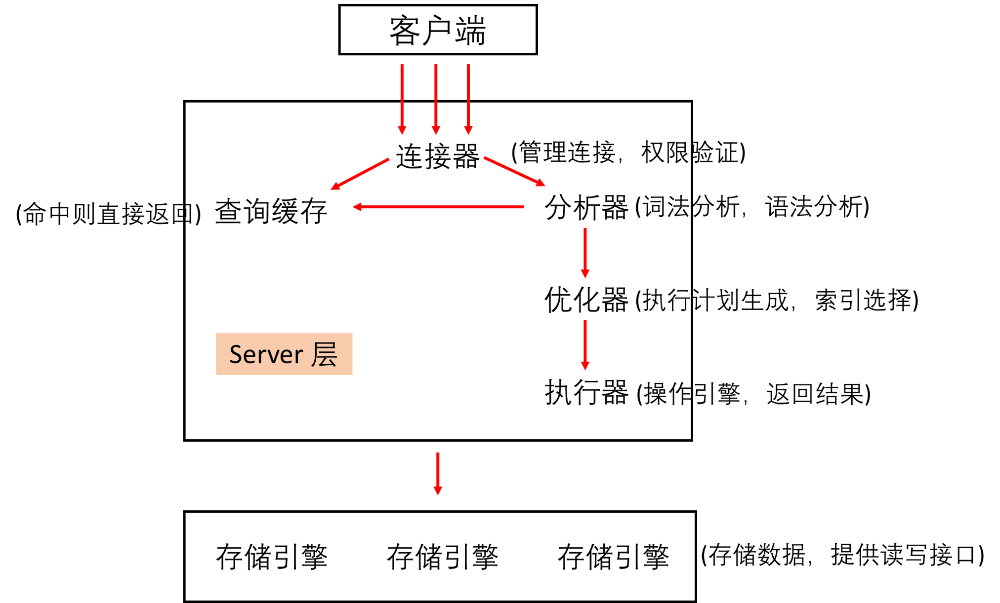

# 1. 基础架构

总的来说，MySQL 可以分为 Server 层和存储引擎层两部分。

Server 层包括连接器，查询缓存，分析器，优化器，执行器等，涵盖 MySQL 的大多数核心服务功能，以及所有的内置函数（日期，时间，数学和加密函数等），所有跨存储引擎的功能都在这一层实现，比如存储过程，触发器，视图等。

存储引擎负责数据的存储和提取。其架构模式是插件式的，支持 InnoDB，MyISAM，Memory 等多个存储引擎。现在最常用的是 InnoDB，从 MySQL 5.5.5 版本开始成为了默认存储引擎。不同存储引擎的表数据存取方式不同，支持的功能也不同。

不同的存储引擎，共用一个 Server 层，从连接器到执行器的部分。

## 1.1 连接器

连接到数据库上，这个时候使用的就是连接器，连接器负责跟客户端建立连接，获取权限，维持和管理连接。

`mysql -h$ip -P$port -u$user -p`

连接命令中的 mysql 是客户端工具，用来跟服务端建立连接。在完成 TCP 握手后，连接器用输入的用户名和密码开始认证身份，

+ 如果用户名或密码错误，会收到一个 `Access denied for user` 的错误，然后客户端程序结束执行。
+ 如果用户名和密码认证通过，连接器会到权限表里查看该用户所拥有的的权限，之后的权限判断逻辑，都依赖于此时读到的权限。

连接完成之后，如果没有后续操作，那么这个连接就处于空闲状态，可以使用 `show processlist` 命令看到。

客户端如果长时间没有动静，那么连接就会自动断开，时间由参数 wait_timeout 控制，默认是 8 小时。

连接断开之后，客户端再次查询数据，就会收到一个错误提醒 `Lost Connection to MySQL server duraing query`。

数据库里面，长连接是指连接成功后，如果客户端持续有请求，则一直使用同一个连接。短连接则是指每次执行完很少的几次查询就断开查询，下次查询时再重新建立一个。

因为建立连接的过程是比较复杂的，所以一般建议减少建立连接的动作，使用长连接。

但是如果全部使用长连接，那么 MySQL 占用的内存涨的特别快，这是因为 MySQL 在执行过程中临时使用的内存是管理在连接对象里的。这些资源会在连接断开时才释放。如果长时间积累下来，可能会导致内存占用太大，被系统强行杀掉(OOM, Out of Memory )，从现象上来看就是 MySQL 异常重启了。

长连接解决方案：
+ 定期断开长连接，使用一段时间，或者程序里判断执行过一个占用内存的大查询后，断开连接，之后要查询再重连。
+ 如果使用的 MySQL 5.7 以上的版本，可以在每次执行一个比较大的操作后，通过执行 mysql_reset_connection 来重新初始化连接资源。这个过程不需要重连和重新做权限验证，但是会将连接恢复到刚刚创建完时的状态。

## 1.2 查询缓存

MySQL 拿到查询请求后，先到查询缓存看，是否执行过这条语句。如果查询结果在缓存中，那么直接返回缓存结果。如果不在缓存中，那么就会继续执行后面的阶段，执行完毕后，执行结果会被存入查询缓存中。

由于新插入数据会将查询缓存清空，所以对于更新压力比较大的数据库来说，查询缓存命中率很低。

可以通过将参数 query_cache_type 设置为 DEMAND，这样对于默认的 SQL 语句都不实用查询缓存，而对于明确需要使用查询缓存的语句，可以使用 SQL_CACHE 显式指定。

`mysql> select SQL_CACHE * from T where ID >=10;`

但是，MySQL 8.0 版本将查询缓存的整块功能去掉了，所以就没有查询缓存这个功能了。

## 1.3 分析器

开始真正执行语句，需要对 SQL 语句进行解析。

分析器会先做词法分析，MySQL 需要识别出里边的字符分别是什么，代表什么意思。

词法分析完毕后，开始语法分析，语法分析器会根据语法规则，判断输入的 SQL 语句是否满足 MySQL 语法。如果语法错误，就会收到 `You hav an error in your SQL syntax` 的错误信息。

## 1,4 优化器

优化器在表里面有多个索引的时候，决定使用哪个索引；或者在一个语句有多表关联(join)的时候，决定各个表的链接顺序。

`mysql> select * from t1 join t2 useing(ID) where t1.c=10 and t2.d=20;`

+ 既可以先从表 t1 里取出 c=10 记录的 id 值，再根据 id 值关联到表 t2，再判断 t2 里面 d 的值是否等于 20。
+ 也可以先从表 t2 里取出 d=20 记录的 id 值，再根据 id 值关联到表 t1，在判断 t1 里面 c 的值是否等于 10。

这两种执行方法的逻辑结果都是一样的，但是执行效率不一样，优化器的作用就是决定选择使用哪个方案。

## 1.5 执行器

开始执行的时候，要先判断用户对表 t1 是否有查询权限，如果没有，就会返回没有权限的错误。

如果有权限，就会打开表继续执行，打开表的时候，执行器就会根据表的引擎定义，去使用这个引擎提供的接口。

如果刚才的表里，id 字段没有索引，那么执行器的执行流程是这样的：

+ 调用 InnoDB 引擎接口取这个表的第一行，判断 id 值是否为 10，如果不是则跳过，如果是则将这行存在结果集。
+ 调用引擎接口取下一行，重复相同的判断逻辑，直到取到这个表的最后一行。
+ 执行器将上述遍历过程中素有满足条件的行组成的记录集作为结果集返回给客户端。

至此，这条 SQL 语句执行完毕。

我们会在数据库的慢查询日志中看到一个 rows_examined 的字段，表示这个语句执行过程中扫描了多少行，这个值就是在执行器每次调用引擎获取数据行的时候累加的。

在某些场景下，执行器调用一次，在引擎内部则扫描很多行，因此 **引擎扫描行数跟 rows_examined 并不是完全相同的。**
