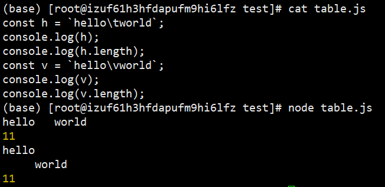
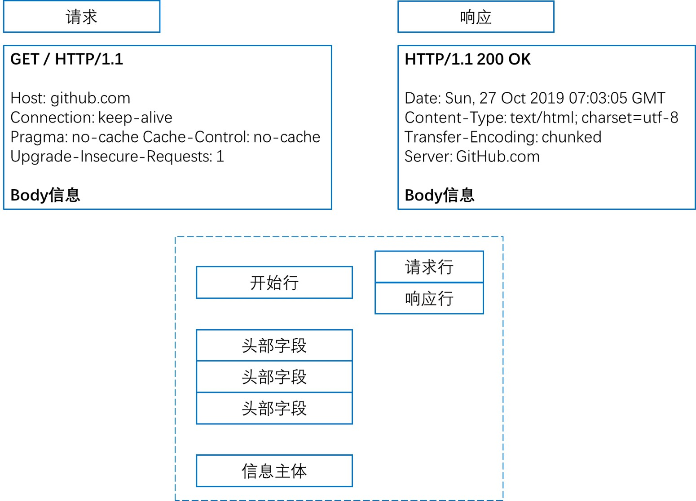
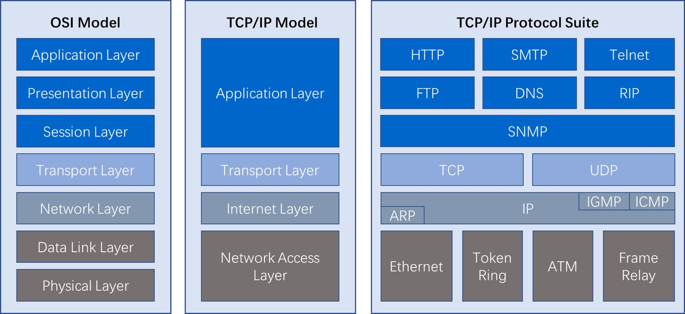
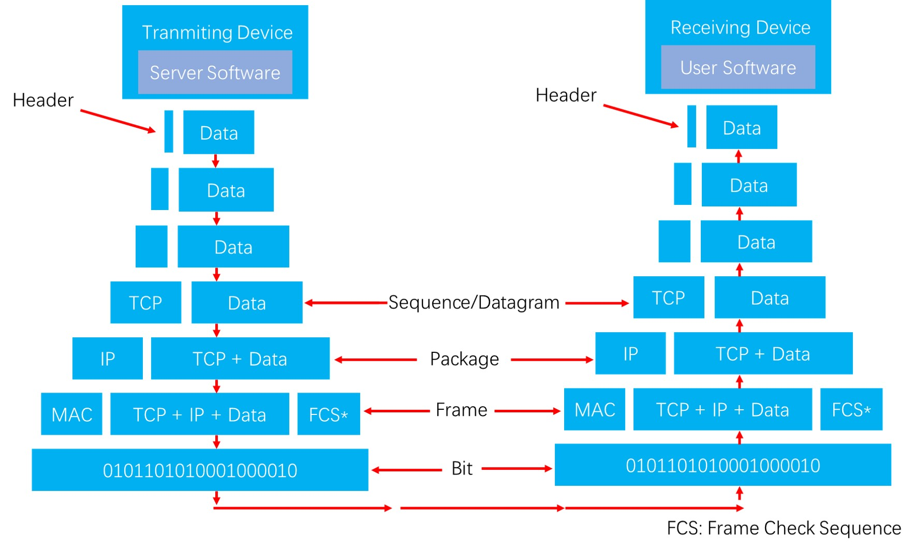

# 1. HTTP(Hypertext Transfer Protocol) 协议

HTTP 协议是一种无状态的、应用层的、以请求/应答方式运行的协议，它使用可扩展的语义和自描述格式，与基于网络的超文本信息系统灵活的互动。

# 2. 基于 ABNF 语义定义的 HTTP 消息格式
## 2.1 BNF(Backus Normal Form) 巴科斯范式

> 巴科斯范式（英语：Backus Normal Form，缩写为 BNF），又称为巴科斯-诺尔范式（英语：Backus-Naur Form，缩写同样为 BNF，也译为巴科斯-瑙尔范式、巴克斯-诺尔范式），是一种用于表示上下文无关文法的语言，上下文无关文法描述了一类形式语言。它是由约翰·巴科斯（John Backus）和彼得·诺尔（Peter Naur）首先引入的用来描述计算机语言语法的符号集。<small>引用自维基百科 [巴科斯范式](https://zh.wikipedia.org/wiki/巴科斯范式)</small>

> 尽管巴科斯范式也能表示一部分自然语言的语法，它还是更广泛地使用于程序设计语言、指令集、通信协议的语法表示中。大多数程序设计语言或者形式语义方面的教科书都采用巴科斯范式。在各种文献中还存在巴科斯范式的一些变体，如扩展巴科斯范式 EBNF 或扩充巴科斯范式 ABNF。<small>引用自维基百科 [巴科斯范式](https://zh.wikipedia.org/wiki/巴科斯范式)</small>

## 2.2 ABNF(Augmented Backus Normal Form) 扩充巴科斯范式

> 在计算机科学中，扩充巴科斯-瑙尔范式（ABNF）是一种基于巴科斯-瑙尔范式（BNF）的元语言，但它有自己的语法和派生规则。ABNF的原动原则是描述一种作为双向通信协议的语言的形式系统。它是由第68号互联网标准（"STD 68"，大小写样式按照原文）定义的，也就是RFC 5234，经常用于互联网工程任务组（IETF）通信协议的定义语言。<small>引用自维基百科 [扩充巴科斯范式](https://zh.wikipedia.org/wiki/扩充巴科斯范式)</small>

+ ABNF 是一种规范形式，定义语言，但自身不是一种语言，在 HTTP 协议格式里可以理解为，规定了 HTTP 协议请求和应答的格式，便于对请求应答内容做出相应的解析。

### 2.2.1 ABNF 规范
+ 空白字符 ` `: 用来分隔定义中的各个元素，`GET / HTTP/1.1`
+ 选择 `/`: 表示多个规则都是可供选择的规则，`start-line = request-line / status-line`
+ 值范围 `%c##-##`: 取值范围，`OCTET="0"/"1"/"2"/"3"/"4"/"5"/"6"/"7"` 与 `OCTET = %x30-37` 等价
+ 序列组合 `()`: 将规则组合起来，视为单个元素
+ 不定量重复 `m*n`:
  + `*` 元素表示零个或更多元素: `*(header-field CRLF)`
  + `1*` 元素表示一个或更多元素: `2*4` 元素表示两个至四个元素
+ 可选序列 `[]`: `[message-body]`

<small>引用自维基百科 [扩充巴科斯范式](https://zh.wikipedia.org/wiki/扩充巴科斯范式)</small>

### 2.2.2 ABNF 核心规则

<table class="wikitable">
    <tbody>
        <tr style="background-color: #efefef;">
            <th>规则</th>
            <th>形式定义</th>
            <th>意义
            </th>
        </tr>
        <tr>
            <td>ALPHA</td>
            <td>%x41-5A / %x61-7A</td>
            <td>大写和小写ASCII字母（A-Z, a-z）
            </td>
        </tr>
        <tr>
            <td>DIGIT</td>
            <td>%x30-39</td>
            <td>数字（0-9）
            </td>
        </tr>
        <tr>
            <td>HEXDIG</td>
            <td>DIGIT / "A" / "B" / "C" / "D" / "E" / "F"</td>
            <td>十六进制数字（0-9, A-F, a-f）
            </td>
        </tr>
        <tr>
            <td>DQUOTE</td>
            <td>%x22</td>
            <td>双引号
            </td>
        </tr>
        <tr>
            <td>SP</td>
            <td>%x20</td>
            <td>空格
            </td>
        </tr>
        <tr>
            <td>HTAB</td>
            <td>%x09</td>
            <td>横向制表符
            </td>
        </tr>
        <tr>
            <td>WSP</td>
            <td>SP / HTAB</td>
            <td>空格或横向制表符
            </td>
        </tr>
        <tr>
            <td>LWSP</td>
            <td>*(WSP / CRLF WSP)</td>
            <td>直线空白（晚于换行）
            </td>
        </tr>
        <tr>
            <td>VCHAR</td>
            <td>%x21-7E</td>
            <td>可见（打印）字符
            </td>
        </tr>
        <tr>
            <td>CHAR</td>
            <td>%x01-7F</td>
            <td>任何7-位US-ASCII字符，不包括NUL（%x00）
            </td>
        </tr>
        <tr>
            <td>OCTET</td>
            <td>%x00-FF</td>
            <td>8位数据
            </td>
        </tr>
        <tr>
            <td>CTL</td>
            <td>%x00-1F / %x7F</td>
            <td>控制字符
            </td>
        </tr>
        <tr>
            <td>CR</td>
            <td>%x0D</td>
            <td>回车
            </td>
        </tr>
        <tr>
            <td>LF</td>
            <td>%x0A</td>
            <td>换行
            </td>
        </tr>
        <tr>
            <td>CRLF</td>
            <td>CR LF</td>
            <td>互联网标准换行
            </td>
        </tr>
        <tr>
            <td>BIT</td>
            <td>"0" / "1"</td>
            <td>二进制数字
            </td>
        </tr>
    </tbody>
</table>

### 2.2.3 基于 ABNF 描述的 HTTP 协议格式

HTTP-message = start-line *(header-field CRLF) CRLF [message-body]
+ start-line = request-line / status-line
  + request-line = method SP request-target SP HTTP-version CRLF
  + status-line = HTTP-version SP status-code SP reason-phrase CRLF
+ header-field = field-name ":" OWS field-value OWS
  + OWS = *(SP / HTAB)
  + field-name = token
  + field-value = *(field-content / obs-fold)
+ message-body = *OCTET

SP 代表空格，HTAB 代表横向制表符

### 2.2.4 制表符扩展 

有横向制表符，也有纵向制表符，纵向制表符可以在纵向分隔。纵向制表符在 windows 上显示的是空白方框，在 linux 上正常显示

```javascript
const h = `hello\tworld`;
console.log(h);
console.log(h.length);
const v = `hello\vworld`;
console.log(v);
console.log(v.length);
```



<small>引用自维基百科 [扩充巴科斯范式](https://zh.wikipedia.org/wiki/扩充巴科斯范式)</small>

## 2.3 HTTP 请求响应格式



# 3. 网络分层
## 3.1 [OSI(Open System Interconnection Model) 开放式系统网络模型](https://zh.wikipedia.org/wiki/OSI模型)
+ 应用层(Application Layer): 用户接口
+ 表示层(Presentation Layer): 数据的表现形式，特定功能的实现，比如加密压缩
+ 会话层(Session Layer): 对应用会话的管理，同步
+ 传输层(Transport Layer): 判断传输协议是否可靠，传输前的错误检测，流控(TCP略慢，但是保证不丢数据；UDP更快，但是有可能会丢数据)
+ 网络层(Network Layer): 提供逻辑地址，选择线路
+ 数据链路层(Data Link Layer): 成帧，用 MAC 地址访问媒介，错误检测与修正
+ 物理层(Physical Layer): (网线、网卡、集线器、中继器等)设备之间的比特流的传输，物理接口，电气特性等

## 3.2 OSI 模型与 TCP/IP 模型
### 3.2.1 模型与 TCP/IP 模型对照
| OSI 7层模型 | TCP/IP 4层模型 |
|-------------|----------------|
|应用层       |应用层          |
|表示层       |应用层          |
|会话层       |应用层          |
|传输层       |传输层          |
|网络层       |网际互联层      |
|数据链路层   |网络接口层      |
|物理层       |网络接口层      |

+ 应用层：应用层对应于 OSI 参考模型的高层，为用户提供所需要的各种服务。例如：FTP，Telnet，DNS，SMTP等
+ 传输层：传输层对应于 OSI 参考模型的传输层，为应用层实体提供端到端的通信功能，保证了数据包的顺序传送机数据的完整性。该层定义了两个主要的协议：**传输控制协议(TCP)** 和 **用户数据报协议(UDP)**。
  + TCP/IP 协议的三次握手(两军问题)
+ 网际互联层：网际互联层对应于 OSI 参考模型的网络层，主要解决主机到主机的通信问题。它所包含的协议设计数据包在整个网络上的逻辑传输。该层有三个主要协议：**网际协议(IP)**，**互联网组管理协议(IGMP)** 和 **互联网控制报文协议(ICMP)**
  + ICMP协议即平时`ping www.baidu.com`这个协议
+ 网络接口层：网络接入层与 OSI 参考模型中的物理层和数据链路层相对应，负责监视数据在主机和网络之间的交换。
  + 事实上，TCP/IP 本身并未定义该层的协议，而由参与互连的各网络使用自己的物理层和数据链路层协议，然后与 TCP/IP 的网络接入层进行连接
  + 地址解析协议(ARP)工作在此层，即OSI参考模型的数据链路层



### 3.2.2 TCP/IP模型与OSI模型的比较
+ **共同点**
  + OSI 参考模型和 TCP/IP 参考模型都采用了层析结构的概念
  + 都能够提供面向连接和无连接两种通信服务机制

+ **不同点**
    + TCP/IP 是四层模型，OSI 模型是七层模型
    + TCP/IP 对可靠性要求更高
    + OSI 模型是在协议开发前设计的，具有通用性。TCP/IP 是先有协议集然后建立模型，不适用于非TCP/IP网络
    + 实际市场应用不同(OSI模型只是理论上的模型，并没有成熟的产品，而TCP/IP已经成为"实际上的国际标准")

## 3.3 报文头部


# 4. HTTP 解决了哪些问题
+ 低门槛
+ 可扩展性：巨大的用户群体，超长的寿命
+ 分布式系统下的 Hypermedia：大颗粒度数据的网络传输
+ Internet 规模
  + 无法控制的 scalability
    + 不可预测的负载、非法格式的数据、恶意消息
    + 客户端不能保持所有服务器信息，服务器不能保持多个请求间的状态信息
  + 独立的组件部署：新老组件并存
+ 向前兼容：自 1993 年起 HTTP0.9/1.0(1996) 已经被广泛使用

# 5. 评估 web 架构的关键属性
## 5.1 七个关键属性
+ 性能 Performance：影响高可用的关键属性
+ 可伸缩性 Scalability：支持部署可以互相交互的大量组件
+ 简单性 Simplicity：易理解、易实现、易验证
+ 可见性 Visiable：对两个组件间的交互进行监视或者仲裁的能力。如缓存、分层设计等
+ 可移植性 Portability：在不通过的环境下运行的能力
+ 可靠性 Reliablity：出现部分故障时，对整体影响的程度
+ 可修改性 Modifiablity：对系统做出修改的难易程度，由可进化性、可定制性、可扩展性、可配置性、可重用性构成

## 5.2 性能
+ 网络性能 Network Performance
  + Thoughput 吞吐量：小于等于带宽 bandwith
  + Overhead 开销：首次开销，每次开销
+ 用户感知到的性能 User-perceived Performance
  + Latency 延迟：发起请求到接收到响应的时间
  + Completion 完成时间：完成一个应用动作所花费的时间
+ 网络效率 Network Efficiency
  + 重用缓存、减少交互次数、数据传输距离更近、COD

## 5.3 可修改性
+ 可进化性 Evolvability：一个组件独立升级而不影响其他组件
+ 可扩展性 Extensibility：向系统添加功能，而不影响到系统的其他部分
+ 可定制性 Customizability：临时性、定制性地更改某一要素来提供服务，不对常规客户产生影响
+ 可配置性 Configurability：应用部署后通过修改配置提供新的功能
+ 可重用性 Reusability：组件可以不做修改在其他应用再次使用

# 6. 架构风格
## 6.1 五种架构风格
+ 数据流风格 Data-flow Styles
  + 优点：简单性、可进化性、可扩展性、可配置性、可重用性
+ 复制风格 Replication Styles
  + 优点：用户可察觉的性能、可伸缩性、网络效率高、可靠性可以得到提升
+ 分层风格 Hierarhical Styles
  + 优点：简单性、可进化性、可伸缩性
+ 移动代码风格 Mobile Code Styles
  + 优点：可移植性、可扩展性、网络效率高
+ 点对点风格 Peer-to-Peer Styles
  + 优点：可进化性、可重用性、可扩展性、可配置性

## 6.2 数据流风格 Data-flow Styles
+ 管道与过滤器 Pipe And Filter, PF
  + 每个 Filter 都有输入端和输出端，只能从输入端读取数据，处理后再从输出端产生数据
+ 统一接口的管道与过滤器 Uniform Pipe And Filer UPF
  + 在 PF 上增加了同意接口的约束，所有 Filter 过滤器必须具备同样的接口

## 6.3 复制风格 Replication Styles 
+ 复制仓库 Replicated Reponsitory, RR(例如 MySQL 冷热备份，Nginx)
    + 多个进程提供相同的服务，通过反向代理对外提供集中服务
+ 缓存 $
  + RR 的变体，通过复制请求的结果，为后续请求复用

## 6.4 分层风格 Hierarhical Styles
+ 客户端服务器 Client-Server, CS
  + 由 Client 出发请求，Server 监听到请求后产生响应，Client 一直等待收到响应后，会话结束
  + 分离关注点隐藏细节，良好的简单性、可伸缩性、可进化性
+ 分层系统 Layered System, LS
  + 每一层为其之上的层服务，并使用在其下的层所提供的服务，例如 TCP/IP
+ 分层客户端服务器 Layered Client-Server, LCS
  + LS + CS，例如正向代理和反向代理，从空间上分为外部层与内部层
+ 无状态、客户端服务器 Client-Stateless-Server, CSS
  + 基于 CS，服务器上不允许有 session state 会话状态
  + 提升了可见性、可伸缩性、可靠性，但重复数据导致降低网络性能
+ 缓存、无状态、客户端服务器 Client-Cache-Stateless-Server C$SS
  + 提升性能
+ 分层、缓存、无状态、客户端服务器 Layered-Client-Cache-Stateless-Server, LC$SS
+ 远程会话 Remote Session, RS
  + CS 变体，服务器保存 Application state 应用状态
  + 可伸缩性、可见性差
+ 远程数据访问 Remote Data Access, RDA
  + CS 变体，Application state 应用状态同时分布在客户端和服务器
  + 巨大的数据集有可能通过迭代减少
  + 简单性、可伸缩性

## 6.5 移动代码风格 Mobile Code Styles
+ 虚拟机 Virtual Machine, VM
  + 分离指令与实现
+ 远程求值 Remote Evaluation, REV
  + 基于 CS 的 VM，将代码发送至服务器执行
+ 按需代码 Code on Demand, COD
  + 服务器在响应中发回处理代码，在客户端执行
  + 优秀的可扩展性和可配置性，提升用户可察觉性能和网络效率
+ 分层、按需代码、缓存、无状态、客户端服务器 Layered-Code-On-Demand-Client-Cache-Stateless-Server, LCODC$SS
  + LC$SS + COD
+ 移动代理 Mobile Agent, MA
  + 相当于 REV + COD

## 6.6 点对点风格 Peer-to-Peer Styles
+ Event-based Integration, EBI
  + 基于事件集成系统，如由类似 Kafka 这样的消息系列 + 分发订阅来消除耦合
  + 优秀的可重用性、可扩展性、可进化性
  + 缺乏可理解性
  + 由于消息广播等因素造成的消息风暴，可伸缩性差
+ Chiron-2, C2
  + 相当于 EBI + LCS，控制了消息的方向
+ Distributed Objects, DO
  + 组件结对交互
+ Brokered Distributed Objects, BDO
  + 引入名字解析组件来简化 DO，例如 CORBA

# 7. URI 和 URL
+ URL(Uniform Resource Locator) 统一资源定位符，表示资源的位置，期望提供查找资源的方法
+ URN(Uniform Resource Name) 统一资源名称，期望为资源提供持久的、位置无关的表示方式，并允许简单地将多个命名空间映射到单个 URN 命名空格键
+ URI(Uniform Resource Identifier) 统一资源标识符，用以区分资源，是 URL 和 URN 的超集，用以取代 URL 和 URN

## 7.1 为什么要进行 URI 编码
+ 传递的数据中，如果存在用作分隔符的保留字符该怎么办？
+ 对可能产生歧义的数据编码
  + 不在 ASCII 码范围内的字符
  + ASCII 码中不可显示的字符
  + URI 中规定的保留字符
  + 不安全字符(传输过程中可能会被不正确处理)，如空格、引号、尖角号等

## 7.2 保留字符与非保留字符
+ 保留字符
  + reserved = gen-delims / sub-delims
    + gen-delims = : / ? # [ ] @
    + sub-delims = ! $ & ' ( ) * + , ; =
+ 非保留字
  + unreserved = ALPHA / DIGIT / - / . / _ / ~
  + ALPHA: %41-%51 and %61-%7A
  + DIGIT: %30-%39
  + `-`: `%2D` `.`: `%2E` `_`: `%5D`
  + `~`: `%7E` 某些直线将其认为保留字符，通常对 ~ 编码


## 7.3 URI 百分号编码
+ 百分号编码的方式
  + pct-encoded = % HEXDIG HEXDIG
    + US-ASCII: 128 个字符(95 个可显示字符，33 个不可显示字符)
  + 对于 HEXDIG 十六进制中的字符，大小写等价
+ 非 ASCII 码字符，例如中文，建议先 UTF-8 编码，再 US-ASCII 编码
+ 对 URI 合法字符，编码与不编码是等价的
