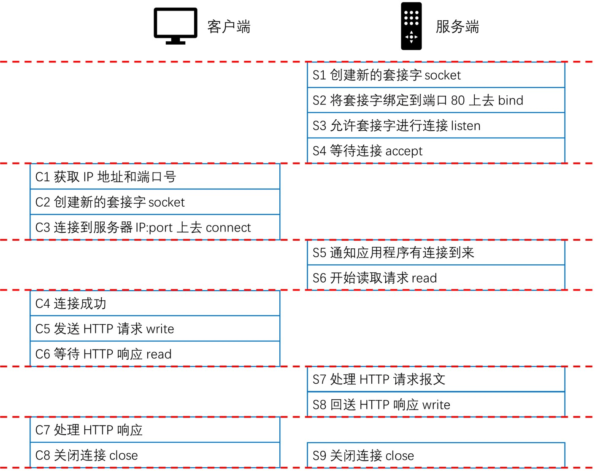

# 1. HTTP 的请求行
## 1.1 请求行
+ 格式：request-line = method SP request-target SP HTTP-version CRLF
+ 示例：GET / HTTP/1.0
+ method 方法：指明操作目的，动词
+ request-target = origin-form / absolute-form/ authority-form / asterisk-form
+ HTTP-version 表示 HTTP 的版本

## 1.2 request-target 格式
+ origin-form = absolute-path[? query]
  + 向 origin server 发起的请求，path 为空时必须传递 /
+ absolute-form = absolute-URI
  + 仅用于正向代理 proxy 发起请求时
+ authority-form = authority
  + 仅用于 CONNECT 方法，例如 CONNECT www.example.com:80 HTTP/1.1
+ asterisk-form = *
  + 仅用于 OPTIONS 方法

## 1.3 HTTP-version [发展历史](https://www.w3.org/Protocols/History.html)
+ HTTP/0.9 只支持 GET 方法，过时
+ HTTP/1.0 RFC1945, 1996 常见于代理服务器(例如 Nginx 默认配置)
+ HTTP/1.1 RFC2616, 1999
+ HTTP/2.0 2015.5 正式发布

## 1.4 用户文档管理的 WEBDAV 方法

对文件操作时的方法

+ PROPFIND: 从 WEB 资源中检索以 XML 格式存储的属性，允许被重载，允许一个检索远程系统的集合结构(也叫目录层次结构)
+ PROPPATCH：在单个原子性动作中更改和删除资源的多个属性
+ MKCOL：创建集合或者目录
+ COPY：将资源从一个 URI 复制到另一个 URI
+ MOVE：将资源从一个 URI 移动到另一个 URI
+ LOCK：锁定一个资源，WEBDAV 支持共享锁和互斥锁
+ UNLOCK：解除资源的锁定

# 2. HTTP 响应码
+ 格式：status-line = HTTP-version SP status-code SP reason-phrase CRLF
+ 示例：HTTP/1.1 200 OK

## 2.1 1xx
+ 1xx 表示请求已经收到，需要进一步处理才能完成，HTTP/1.0 不支持
+ 100 Continue：上传大文件前使用
  + 由客户端发起请求中携带 Expert: 100-continue 头部触发
+ 101 Switch Protocols：协议升级使用
  + 由客户端发起请求中携带 Upgrade：头部触发，如升级 websocket 或者 HTTP/2.0
+ 102 Processing：WebDAV 请求可能包含许多设计文件操作的子请求，需要很长时间才能完成请求。该代码表示服务器已经接收到并正在处理请求，但无响应可用，这样以防止客户端超时，并假设请求丢失

## 2.2 2xx
+ 2xx 成功处理请求
+ 200 OK：成功返回响应
+ 201 Created：有新资源在服务端被成功创建
+ 202 Accepted：服务器接收并开始处理请求，但请求未处理完成。这样一个模糊的概念是有意如此设计，可以覆盖更多的场景。例如异步、需要长时间处理的任务
+ 203 Non-Authroritative Information：当代理服务器修改了 origin server 的原始响应包体时，例如 HTML 更换了元素值，代理服务器可以通过修改 200 为 203 的方式告知客户端这一事实，方便客户端为这一行为作出相应的处理。203 响应可以被缓存
+ 204 No Content：成功执行了请求且不携带响应包体，并暗示客户端无需更新当前的页面视图
+ 205 Reset Content：成功中了请求且不携带相应包体，同时指明客户端需要更新当前页面视图
+ 206 Partial Content：使用 range 协议时返回部分响应内容时的响应码
+ 207 Multi-Status：在 WebDAV 协议中以 XML 返回多个资源的状态
+ 208 Already Reported：为避免想通过集合下资源在 207 响应码下重复上报，使用 208 可以使用父集合的响应码

## 2.3 3xx
+ 3xx 重定向使用 Location 指向的资源或者缓存中的资源。在 RFC2068 中规定客户端重定向次数不应超过 5 次，以防止死循环
+ 300 Multiple Choices：资源有多种表述，通过 300 返回给客户端后其自行选择访问哪一种表述。由于缺乏明确的细节，300 很少使用
+ 301 Moved Permanently：资源永久重定向到另一个 URI 中
+ 302 Found：资源临时的重定向到另一个 URI 中
+ 303 See Other：重定向到其他资源，常用于 POST/PUT 等方法的响应中
+ 304 Not Modified：当客户端拥有可能过期的缓存时，会携带缓存的标识 etag、时间等信息询问服务器缓存是否仍可服用，而 304 是告诉客户端可以复用缓存
+ 307 Temportary Redirect：类似 302，但明确重定向后的请求方法必须与原请求方法相同，不得改变
+ 308 Permannet Redirect 类似 301，但明确重定向后的请求方法必须与原请求方法相同，不得改变

## 2.4 4xx
+ 4xx 客户端出现错误
+ 400 Bad Request：服务器认为客户端出现了错误，但不能明确判断为哪种错误时使用此错误码
+ 401 Unauthorized：用户认证信息缺失或者不正确，导致服务器无法处理请求
+ 403 Forbidden：服务器理解请求的含义，但是没有权限执行此请求
+ 404 Not Found：服务器没有找到对应的资源
+ 405 Method Not Allowed：服务器不支持请求行中的 method 方法
+ 406 Not Acceptable：对客户端指定的资源表述不存在（例如对语言或者编码有要求），服务器返回表述列表供客户端选择
+ 407 Proxy Authentication Required：对需要经过代理的请求，认证信息未通过代理服务器的验证
+ 408 Request Timeout：服务器接收请求超时
+ 409 Conflict：资源冲突，例如上传文件时目标位置已经存在版本更新的资源
+ 410 Gone：服务器没有找到对应的资源，且明确的知道该位置永久性找不到该资源
+ 411 Length Required：如果请求含有包体且未携带 Content-Length 头部，且不属于 chunk 类请求时，返回 411
+ 412 Precondition Failed：复用缓存时传递的 If-Unmodified-Since 或 If-None-Match 头部不被满足
+ 413 Payload Too Large/Request Entiny Too Large：请求的包体超出服务器能处理的最大长度
+ 414 URI Too Long：请求的 URI 超出服务器能接受的最大长度
+ 415 Unsupported Media Type：上传的文件类型不被服务器支持
+ 416 Range Not Satisfiable：无法提供 Range 请求中指定的那段包体
+ 417 Excepcation Failed：对于 Except 请求头部期待的情况无法满足时的响应码
+ 421 Misdirected Request：服务器认为这个请求不该发给他，因为它没有能力处理
+ 426 Upgrade Required：服务器拒绝基于当前 HTTP 协议提供服务，通过 Upgrade 头部告知客户端必须升级协议才能继续处理
+ 428 Precondition Required：用户请求中缺失了条件类头部，例如 If-Match
+ 429 Too Many Requests：客户端发送请求的速率过快
+ 431 Request Header Fields Too Large：请求的 HEADER 头部大小超过限制
+ 451 Unavailable For Legal Reasons：由于法律原因资源不可访问

## 2.5 5xx
+ 5xx 服务端出现错误
+ 500 Internal Server Error：服务器内部错误，且不属于以下错误类型
+ 501 Not Implemented：服务器不支持实现请求所需要的功能
+ 502 Bad Gateway：代理服务器无法获取到合法响应
+ 503 Server Unavailabel：服务器资源尚未准备好处理当前请求
+ 504 Gateway Timeout：代理服务器无法及时的从上游获得响应
+ 505 HTTP Version Not Supported：请求使用的 HTTP 协议版本不支持
+ 507 Insufficient Storage：服务器没有足够的空间处理请求（暴露了服务器的内部情况，有安全隐患，不要使用）
+ 508 Loop Detected：访问资源时检测到循环
+ 511 Network Authentication Required：代理服务器发现客户端需要进行身份验证才能获得网络访问权限

# 3. 跨代理服务器的长短连接
## 3.1 HTTP 连接的常见流程
+ 浏览器解析出主机名
+ 浏览器查询到这个主机名的 IP 地址(DNS)
+ 浏览器获得端口号(80)
+ 浏览器发起到目标 IP 及端口号的连接
+ 浏览器向服务器发送一条 HTTP GET 报文
+ 浏览器从服务器读取 HTTP 响应报文
+ 浏览器关闭连接

## 3.2 从 TCP 编程上看 HTTP 请求处理

## 3.3 长连接与短连接
+ Connection 头部
  + Keep-Alive：长连接
    + 客户端请求长连接 Connection: Keep-Alive
    + 服务端表示支持长连接 Connection: Keep-Alive
    + 客户端复用连接
    + HTTP/1.1 默认支持长连接
  + Close：短连接
  + 对代理服务器的要求
    + 不转发 Connection 列出的头部，该头部仅与当前连接有关
  + Connection 仅对当前连接有效
+ Proxy-Connection
  + 旧式的代理服务器不识别该头部：退化为短连接
  + 新版本的代理服务器理解该头部
    + 与客户端建立长连接
    + 与服务器使用 Connection 代替 Proxy-Connect 头部

# 4. HTTP 消息在服务端的路由
## 4.1 Host = uri-host[":"port]
+ HTTP/1.1 规范要求，不传递 Host 头部则返回 400 错误响应码
+ 为防止陈旧的代理服务器，发向正向代理的请求 request-target 必须以 absolute-form 形式出现
  + request-line = method SP request-target SP HTTP-Version CRLF
  + absolute-form = absolute-URI
    + absolute-URI = schema ":" hier-part ["?" query]

## 4.2 Host 头部与消息的路由(Nginx 为例)
+ 建立 TCP 连接
  + 确定服务器的 IP 地址
+ 接收请求
+ 寻找虚拟主机
  + 匹配 Host 头部与域名
+ 寻找 URI 的处理代码
  + 匹配 URI
+ 执行处理请求的代码
  + 访问资源
+ 生成 HTTP 响应
  + 各中间件基于 PF 结构串行修改响应
+ 发送 HTTP 响应
+ 记录访问日志

# 5. 代理服务器转发消息
## 5.1 如何传递 IP
当网络中存在很多反向代理

+ TCP 连接四元组(src ip, src port, dst ip, dst port)
+ HTTP 头部 X-Forwarded-For 用户传递 IP
+ HTTP 头部 X-Real-IP 用户传递用户 IP

## 5.2 消息的转发
+ Max-Forwaeds 头部
  + 限制 Proxy 代理服务器的最大转发次数，仅对 TRACE/OPTIONS 方法有效
  + Max-Forwards = 1*DIGIT
+ Via 头部
  + 指明经过的代理服务器名称及版本
  + Via = 1#(received-protocol RWS received-by [RWS comment])
    + received-protocol = [protocol-name "/"] protocol-version
    + received-by = (uri-host ["/" port]) / pseudonym
    + pseudonym = token
+ Cache-Control:no-transform
  + 禁止代理服务器修改响应包体
