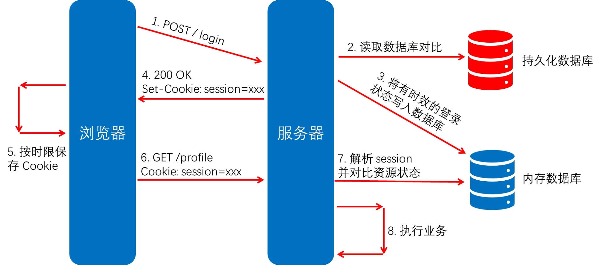
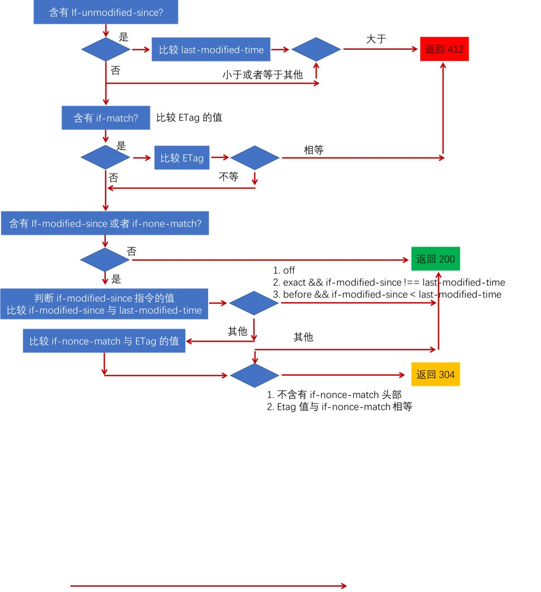

# 11. Cookie 的格式与约束
## 11.1 Cookie 是什么
+ RFC6256, HTTP State Management Machanism
+ 保存在客户端、由浏览器维护、表示应用状态的 HTTP 头部
  + 存放在内存或者磁盘中
  + 服务端生成 Cookie 在响应中通过 Set-Cookie 告知客户端(允许多个 Set-Cookie 头部传递多个值)
  + 客户端得到 Cookie 后，后续请求都会自动将 Cookie 头部携带至请求中

## 11.2 Cookie 与 Set-Cookie 头部的定义
+ Cookie 头部中可以存放多个 name/value 名值对
  + cookie-header = "Cookie:" OWS cookie-string OWS
    + cookie-string = cookie-pair * (";" SP cookie-pair)
      + cookie-pair = cookie-name "=" cookie-value
+ Set-Cookie 头部一次只能传递一个 name/value 名值对，响应中可以含多个头部
  + set-cookie-header = "Set-Cookie:" SP set-cookie-string
    + set-cookie-string = cookie-pair * (";" SP cookie-av)
      + cookie-pair = cookie-name "=" cookie-value
      + cookie-av：描述 cookie-pair 的可选属性

## 11.3 Set-Cookie 中描述 cookie-pair 的属性
+ cookie-av = expires-av / max-age-av / domain-av / path-av / secure-av / httponly-av / extension - av
+ expires-av = "Expires=" sane-cookie-date
  + cookie 到日期 sane-cookie-date 后失效
+ max-age-av = "Max-Age=" non-zero-digit *DIGIT
  + cookie 经过 *DIGIT 秒后失效。max-age 优先级高于 expires
+ domain-av = "Domain=" domain-value
  + 指定 cookie 可用于哪些域名，默认可以访问当前域名
+ path-av = "Path=" path-value
  + 指定 Path 路径下才能使用 cookie
+ secure-av = "Secure"
  + 只有使用 TLS/SSL 协议的 HTTPS 时才能使用 cookie
+ httponly-av = "HttpOnly"
  + 不能使用 JavaScript(Document.cookie、XMLHttpRequest、Request APIs) 访问到 cookie

## 11.4 Cookie 使用的限制
+ RFC 规范对浏览器使用 Cookie 的要求
  + 每条 Cookie 的长度(包括 name、value 以及描述的属性等总长度)，浏览器的支持至少要达到 4KB
  + 每个域名下最少支持 50 个 Cookie
  + 至少要支持 3000 个 Cookie
+ 代理服务器传递 Cookie 时会由限制

## 11.5 Cookie 在协议设计上的问题
+ Cookie 会被附加在每个 HTTP 请求中，所以无形中增加了流量
+ 由于在 HTTP 请求中的 Cookie 是明文传递的，所以有安全性问题（除非有 HTTPS）
+ Cookie 的大小不应超过 4KB，故对于复杂的存储需求来说是不够用的

## 12. Session 及第三方 Cookie的工作原理

## 12.1 登录场景下 Cookie 与 Session 的常见用法

## 12.2 无状态的 REST 架构 VS 状态架构
+ 应用状态与资源状态
  + 应用状态：应该由客户端管理，不应该由服务端管理
    + 例如
      + 目前浏览到哪一个页面
      + REST 架构要求服务端不应保存应用状态
  + 资源状态：应该由服务端管理，不应该有客户端管理
    + 例如
      + 数据库中存放的数据状态，用户的登录信息
+ HTTP 请求的状态
  + 有状态的请求：服务端保存请求的相关信息，每个请求可以使用以前保留的请求相关信息
    + 服务端 session 机制使服务端保存请求的相关信息
    + cookie 使请求可以携带查询信息，与 session 配合完成有状态的请求
  + 无状态的请求：服务端能够处理的所有西悉尼都来自当前请求所携带的信息
    + 服务端不会保存 session 信息
    + 请求可以通过 cookie 携带

## 12.3 第三方 Cookie
+ 浏览器允许对于不安全域下的资源(例如广告图片)响应中的 Set-Cookie 保存，并在后续访问该域时自动使用 Cookie
+ 用户跟踪信息的搜集

# 13. 同源策略
## 13.1 为什么需要同源策略
+ 同一个浏览器发出的请求，未必都是用户资源发送的请求
+ 站点 b 收到来自同一浏览器的请求，可能来自于站点 a

## 13.2 同源策略
+ 只能保证用户请求来自同一浏览器，不能确保时用户自愿发出的
+ 访问站点 A 后，站点 A 通过 Set-Cookie 将 Cookie 头部返回给浏览器
+ 浏览器保存 Cookie，留待下次使用
+ 站点 B 的脚本访问站点 A 时，浏览器会自动将 Cookie 添加到请求的头部访问站点 A，提升用户体验
+ 站点 A 的鉴权策略，取出 Cookie 值与数据库或者缓存中的 token 验证，通过后将数据赋予请求继续处理

## 13.3 如果没有如果没有
+ 站点 B 的脚本就可以随意修改站点 A 的 DOM 结构

## 13.4 安全性和可用性需要一个平衡点
+ 可用性：HTML 的创作者决定跨域请求是否对本站点安全
  + `<script>`，``，`<iframe>`，`<link>`，`<video>`，`<audio>`
  + 允许跨域写操作，例如表单提交或者重定向问题
    + CSRF 安全性问题
+ 安全性：浏览器需要防止站点 A 的脚本向站点 B 发起危险动作
  + Cookie、LocalStorage 和 IndexDB 无法读取
  + DOM 无法获得(防止跨域脚本篡改 DOM 结构)
  + AJAX 请求不能发送
+ 跨域请求伪造攻击(Cross-Site Request Forgery, CSRF)

# 14. 通过 CORS 实现跨域访问
## 14.1 CORS(Cross-Origin Resource Sharing)
+ 浏览器同源策略下的跨域访问解决方案
  + 如果站点 A 允许站点 B 的脚本访问其资源，必须在 HTTP 响应中显示的告知浏览器，站点 B 时被允许访问的
    + 访问站点 A 的请求，浏览器应该告知该请求来自站点 B
    + 站点 A 的请求中，应明确哪些跨域请求时被允许的
+ 策略1：何为简单请求
  + GET/HEAD/POST 方法之一
  + 仅能使用 CORS 安全的头部：Accept、Accept-Language、Content-Language、Content-Type
  + Content-Type 的值只能是: text/plain、multipart/form-data、application/x-www-form-urlencoded
+ 策略2：简单请求以外的其他请求
  + 访问资源钱，需要先发起 preflight 预检请求(OPTIONS)，询问何种请求是被允许的

## 14.2 简单请求的跨域访问
+ 请求中携带 Origin 头部告知来自哪个域
+ 响应中携带 Access-Control-Allow-Origin 头部表示允许哪些域
+ 浏览器放行

## 14.3 预检请求
+ 预检请求头部
  + Access-Control-Request-Method
  + Access-Control-Request-Headers
+ 预检请求响应
  + Access-Control-Allow-Methods
  + Access-Control-Allow-Headers
  + Access-Control-Max-Age

## 14.4 跨域访问资源：请求头部
+ Origin(RFC6454)：一个页面的资源可能来自多页域名，在 AJAX 等子请求中表明来源于某个域名下的脚本，以通过服务器的安全校验
  + origin = "Origin:" OWS origin-list-or-null OWS
  + orgin-list-or-null = %x6E %x75 %x6C %x6C / origin-list
  + origin-list = serialized-origin *(SP serialized-origin)
  + serialized-origin = schema "://" host [":" host]
+ Access-Control-Request-Method
  + 在 preflight 预检请求(OPTIONS) 中，告知服务器接下来的请求会使用哪些方法
+ Access-Control-Request-Headers
  + 在 preflight 预检请求(OPTIONS) 中，告知服务器接下来的请求会传递哪些请求头

## 14.5 跨域访问资源：响应头部 
+ Access-Control-Allow-Methods
  + 在 preflight 预检请求的响应中，告知客户端后续请求允许使用的方法
+ Access-Control-Allow-Headers
  + 在 preflight 预检请求的响应中，告知客户端后续请求允许携带的头部
+ Access-Control-Max-Age
  + 在 preflight 预检请求的响应中，告知客户端该响应的信息客户缓存多久
+ Access-Control-Expose-Headers
  + 告知浏览器哪些响应头部可以供客户端使用，默认情况下只有 Cache-Control，Content-Language，Content-Type，Expires，Last-Modified，Pragma 可供使用
+ Access-Control-Allow-Origin
  + 告知浏览器允许哪些域可以访问当前资源，* 表示允许所有域，为避免缓存错乱，响应中需要携带 Vary: Origin
+ Access-Control-Allow-Credentials
  + 告知浏览器知否可以将 Credentials 暴露给客户端使用，Credentials 包含 cookie、authorization 类头部、TLS 证书

# 15. 条件请求
## 15.1 资源 URI 与资源表述 Representation
+ 资源 R 可被定义为随时间变化的函数 MR(t)
  + 静态资源：创建后任何时刻值都不变，例如指定版本号的库文件
  + 动态资源：其值随时间而频繁地变化，例如某新闻站点首页
+ 优点
  + 提供了无需认为设定类型或者实现方式的情况下，同一资源多种不同来源的信息
  + 基于请求特性进行内容协商，使资源的渲染延迟绑定
  + 允许表述概念而不是具体的 Representation，故资源变化时不用修改所有链接

## 15.2 Precondition 条件请求
+ 目的
  + 由客户端携带条件判断信息，而服务器预执行条件验证过程成功后，再返回资源的表述
+ 常见应用场景
  + 使缓存的更新更有效率(如 304 响应码使服务端不用传递包体)
  + 断点续传时对之前内容的验证
  + 当多个客户端并行修改同一资源时，防止某一客户端的更新被错误丢弃

## 15.3 强验证器和弱验证器
验证器 validator 根据客户端请求中携带的相关头部，以及服务器资源的信息，执行两端的资源验证

+ 强验证器：服务器上的资源表述只要有变动(例如版本更新或者元数据更新)，那么以旧的验证头部访问一定会导致验证失败
+ 弱验证器：服务器上的资源表示变动时，允许一定程度上仍然可以验证通过(例如通过一小段时间内允许缓存有效)

## 15.4 验证器响应头部
+ Etag 响应头部
  + 定义
    + ETag = entity-tag
    + entity-tag = [weak] opaque-tag
    + weak = %x57.2F
    + opaque-tag = DQUOTE *etagc DQUOTE
    + etagc = %x21 / %x23-7E / ob-text
  + 给出当前资源表述的标签
  + 例如
    + 强验证器：ETag: "xyzzy"
    + 弱验证器：ETag: W/"xyzzy"
+ Last-Modified 响应头部
  + 定义：Last-Modified = HTTP-date
  + 表示对应资源表述的上次修改时间
  + 对比 Date 头部：Date = HTTP-Date
    + 表示响应包体生成的时间
    + Last-Modified 不能晚于 Date 的值

## 15.5 条件请求头部
+ If-Match = "*" / 1#entity-tag
+ If-None-Match = "*" / 1#entity-tag
+ If-Modified-Since = HTTP-date
+ If-Unmodified-Since = HTTTP-date
+ If-Range = entity-tag / HTTP-date

## 15.6 增量更新
+ 当服务器支持 Range 时，连接意外中断时已接收到数据部分
+ 通过 Range 请求下载其他包体时，加入验证器防止两次下载间资源已发生变更
+ 如果两次下载操作中，资源已经变量，则服务器用 412 通知客户端，而客户端重新下载完整包体
+ 通过 If-Range 头部可以避免两次请求交互带来的损耗

## 15.7 更新丢失问题
+ 更新资源意味着 2 步操作，先获取资源，再把本地资源修改
+ 2 个客户端并发修改同一资源会导致更新丢失
+ 乐观锁：只允许第 1 个提交更新的客户端更新资源，可以解决首次上传问题

## 15.8 服务器处理条件请求的常见规则-nginx

