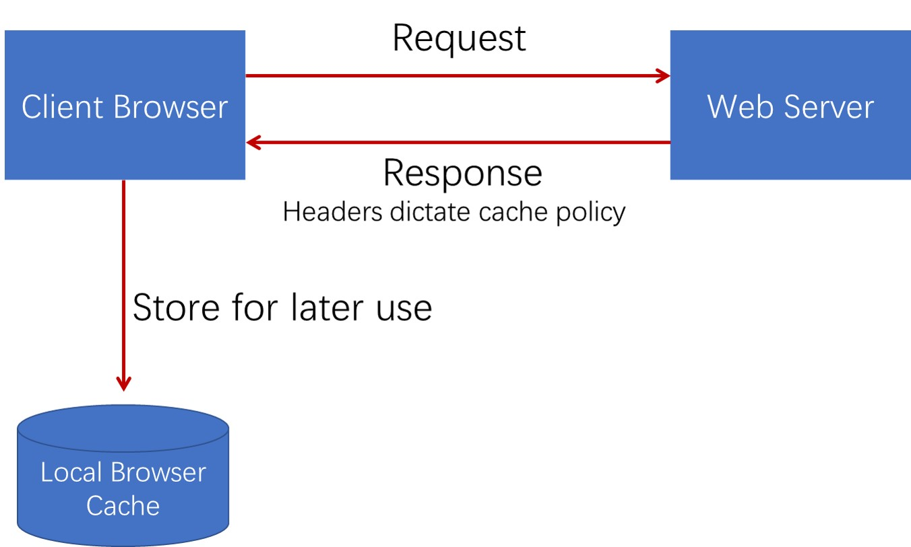

# 16. 缓存的工作原理
## 16.1 HTTP 缓存：为当前请求服用前请求的响应
+ 目标：减少时延，降低带宽消耗
+ 可选而又必要

## 16.2  使用缓存
+ 请求之后，响应结果缓存到内存或硬盘
+ 再次请求时，如果有缓存，根据缓存的 max-age 和 etag 判断是否过期
+ 如果 max-age 过期，那么直接重新获取
+ 如果 max-age 没有过期，那么客户端请求时会把这个资源的 etag 信息发送给服务端，服务端根据 etag 判断资源是否过期
+ 如果 etag 有效，那么返回 304，客户端直接使用缓存的信息
+ 如果 etag 失效，那么服务端重新返回最新的资源

## 16.3 私有缓存和共享缓存
+ 私有缓存：仅供一个用户使用的缓存，通常只存在于如浏览器这样的客户端上
+ 共享缓存：可以供多个用户的缓存，存在网络中负责转发消息的代理服务器(对热点资源常使用共享缓存，以减轻源服务器的压力，并提升网络效率)
  + Authorization 响应不可以被代理服务器缓存
  + 正向代理
  + 反向代理

# 17. 计算缓存是否过期的方式
## 17.1 判断缓存是否过期
+ response_is_refresh = (freshes_lifetime > current_age)
  + freshes_lifetime：按优先级，取以下响应头部的值
    + s-maxage > max-age > Expires > 预估过期时间
      + 例如
        + Cache-Control: s-maxage = 3600
        + Cache-Control: max-age = 86400
        + Expires: Fri, 03 May 2019 03:15:20 GMT
          + Expires = HTTP-date 指缓存的绝对过期时间

      + 常见的预估时间
        + (DownlodTime - LastModified) * 10%

## 17.2 Age 头部及 current_age 的计算
+ Age 表示自源服务器发出响应(或者验证过期缓存)，到使用缓存的响应发出时经过的秒数
  + 对于代理服务器管理的共享缓存，客户端可以根据 Age 头部判断缓存时间
  + Age = delta-seconds
+ current_age 计算：current_age = corrected_initial_age + resident_time
  + resident_time = now - response_time
  + corrected_initial_age = max(apparent_age, corrected_age_value)
    + corrected_age = age_value + response_delay
      + response_delay = response_time - request_time(发起请求的时间)
    + apparent_age = max(0, response_time - date_value)

# 18. Cache-Controll
## 18.1 Cache-Controll 头部
+ Cache-Control = 1#cache-directive
  + cache-directive = token ["="(token / quoted-strin)]
    + delta-second = 1*DIGIT
      + RFC 规范中的要求使，至少能够支持到 2147483648(2^31)
+ 请求中的头部：max-age、max-stale、min-fresh、no-cache、no-store、no-transform、only-if-cached
+ 响应中的头部：max-age、s-maxage、must-revalidate、proxy-revalidate、no-cache、no-store、no-transform、public、private

## 18.2 Cache-Control 头部在请求中的值
+ max-age：告知服务器，客户端不会接受 Age 超出 max-age 秒的缓存
+ max-stale：告知服务器，即使缓存不再新鲜，但陈旧秒数没有超出 max-stale 时，客户端仍打算使用。弱 max-stale 后没有值，则表示无论过期多久客户端都可以使用
+ min-fresh：告诉服务器，Age 至少经过 min-fresh 秒后缓存才可以使用
+ no-cache：告诉服务器，不能直接使用已有缓存作为响应返回，除非带着缓存条件到上有服务端得到 304 验证返回码才可使用现有缓存
+ no-store：告诉各代理服务器不要对该请求的响应缓存(实际上有不少不遵守该规定的代理服务器)
+ no-transform：告诉代理服务器不要修改消息包体的内容
+ only-if-cached：告诉服务器仅能返回缓存的响应，否则若没有缓存则返回 504 错误码

## 18.3 Cache-Control 头部在响应中的值
+ must-revalidate：告诉客户端一旦缓存过期，必须向服务器验证后才可以使用
+ proxy-revalidate：与 must-revalidate 类似，但它对代理服务器的共享缓存有效
+ no-cache：告诉客户端不能直接使用缓存的响应，使用前必须在源服务器验证得到 304 饭hi吗，如果 no-cache 后指定头部，则若客户端的后续请求及响应中不含有这些头则可以直接使用缓存
+ max-age：告诉客户端缓存 Age 超过 max-age 秒后则缓存过期
+ s-maxage：与 max-age 相似，但仅针对共享缓存，且优先级高于 max-age 和 Expires
+ public：表示无论私有缓存或者共享缓存，皆可以将该响应缓存
+ private：表示该响应不能被代理服务器作为共享缓存使用。若 private 后指定头部，则再告诉代理服务器不能缓存指定的头部，但可以缓存其他部分
+ no-store：告诉所有下游节点不能对响应进行存储
+ no-transform：告诉代理服务器不能修改包体的内容

# 19. 什么样的响应才会被缓存
## 19.1 什么样的 HTTP 响应会缓存
+ 请求方法可以被缓存理解(不只与 GET 方法)
+ 响应码可以被缓存理解(404、206 也可以被缓存)
+ 响应与请求头部没有指明 no-store
+ 响应中至少含有以下头部中的 1 个或多个
  + Expires、Max-age、s-maxage、public
  + 当响应中没有明确指示过期时间的头部时，如果响应码非常明确，也可以缓存
+ 如果缓存在代理服务器上
  + 不含有 private
  + 不含有 Authorization

## 19.2 使用缓存作为当前请求响应的条件
+ URI 是匹配的
  + URI 作为主要的缓存关键字，当一个 URI 同时对应多份缓存时，选择日期最近的缓存
  + 例如 Nginx 中默认的缓存关键字：proxy_cache_key $schema$proxy_host$request_uri
+ 缓存中的响应允许当前请求的方法使用缓存

## 19.3 使用缓存作为当前请求响应的条件
+ 缓存中的响应 Vary 头部指定的头部必须与请求中的头部相匹配
  + Vary = "*" / 1#field-name
    + Vary："*" 意味着一定匹配失败
+ 当前请求以及缓存中的响应都不包含 no-cache 头部(Pragma: no-cache 或者 Cache-Control: no-cache)
+ 缓存中的响应必须是以下三者之一
  + 新鲜的(时间上未过期)
  + 缓存中的响应头部明确告知可以使用过期的响应(如 Cache-Control: max-stale=60)
  + 使用条件请求去服务器端验证请求是否过期，得到 304 响应

## 19.4 Warning 头部：对响应码进行补充(缓存或包体转换)
+ Warning = 1#warning-vlue
  + warning-value = warn-code SP warn-agent SP warn-text [SP warn-code]
    + warn-code = 3DIGIT
    + warn-agent = (uri-host[":" port]) / pseudonmy
    + warn-text = quoted-string
    + warn-date = DQUOTE HELP-date DQUOTE
+ 常见的 warn-code
  + Warning: 110 - "Response is Stale"
  + Warning: 111 - "Revalidation Faild"
  + Warning: 112 - "Disconnected Operation"
  + Warning: 113 - "Heuristic Expiration"
  + Warning: 119 - "Miscellaneous Warning"
  + Warning: 214 - "Transformation Applied"
  + Warning: 299 - "Miscellaneous Persistent Warning"

## 19.5 验证请求与响应
+ 验证请求
  + 若缓存响应中含有 Last-Modified 头部
    + If-Unmodified-Since
    + If-Modified-Since
    + If-Range
  + 若缓存响应中含有 ETag 头部
    + If-None-Match
    + If-Match
    + If-Range

# 20. 重定向
## 20.1 为什么需要 URI 重定向
+ 提交 FORM 表单成功后需要显示内容页，怎么办？
+ 站点从 HTTP 迁移到 HTTPS，怎么办？
+ 站点部分 URI 发生了变化，但是搜索引擎或者流量入口站点只收录了老的 URI，怎么办？
+ 站点正在维护中，需要给用户展示不一样的内容，怎么办？
+ 站点更换了新域名，怎么办？

## 20.2 重定向的流程
+ 当浏览器接受到重定向响应码时，需要读取响应头部 Location 头部的值，获取到新的 URI 再跳转访问该页面

## 20.3 Location 头部
+ Location = URI-Reference(对 201 响应码表示新创建的资源)
  + URI-reference = URI/relative-ref
  + relative-ref = relative-part["?" query] ["#" fragment]
    + relative-part = "//" authority path-abempty / path-absolute / path-noschema / path-empty

## 20.4 重定向响应返回码
+ 概念
  + 原请求：接收到重定向响应码的请求这里称为原请求
  + 重定向请求：浏览器接收到重定向响应码后，会发起新的重定向请求
+ 永久重定向，表示资源永久性变更到新的 URI
  + 301(HTTP/1.0)：重定向请求通常(由于历史原因一些浏览器会把 POST 改为 GET) 会使用 GET 方法，而不管原请求究竟采用的是什么方法
  + 308(HTTP/1.1)：重定向请求必须使用原请求的方法和包体发起访问
+ 临时重定向，表示资源只是临时的变更 URI
  + 302(HTTP/1.0)：重定向请求通常会使用 GET 方法，而不管原请求究竟采用的是什么方法
  + 303(HTTP/1.1)：它不表示资源变迁，而是使用新 URI 的响应表述而为原请求服务，重定向请求会使用 GET 方法
  + 307(HTTP/1.1)：重定向请求必须使用原请求的方法和包体发起访问
+ 特殊重定向
  + 300：响应式内容协商中，告知客户端有多种资源表述，要求客户端选择一种自认为合适的表述
  + 304：服务器验证过期缓存有效后，要求客户端使用该缓存
+ 重定向循环
  + 服务端在生成 Location 重定向 URI 时，在同一条路径上使用了之前的 URI，导致无线循环出现
  + Chrome 浏览器会提示：ERR_TOO_MANY_REDIRECTS
