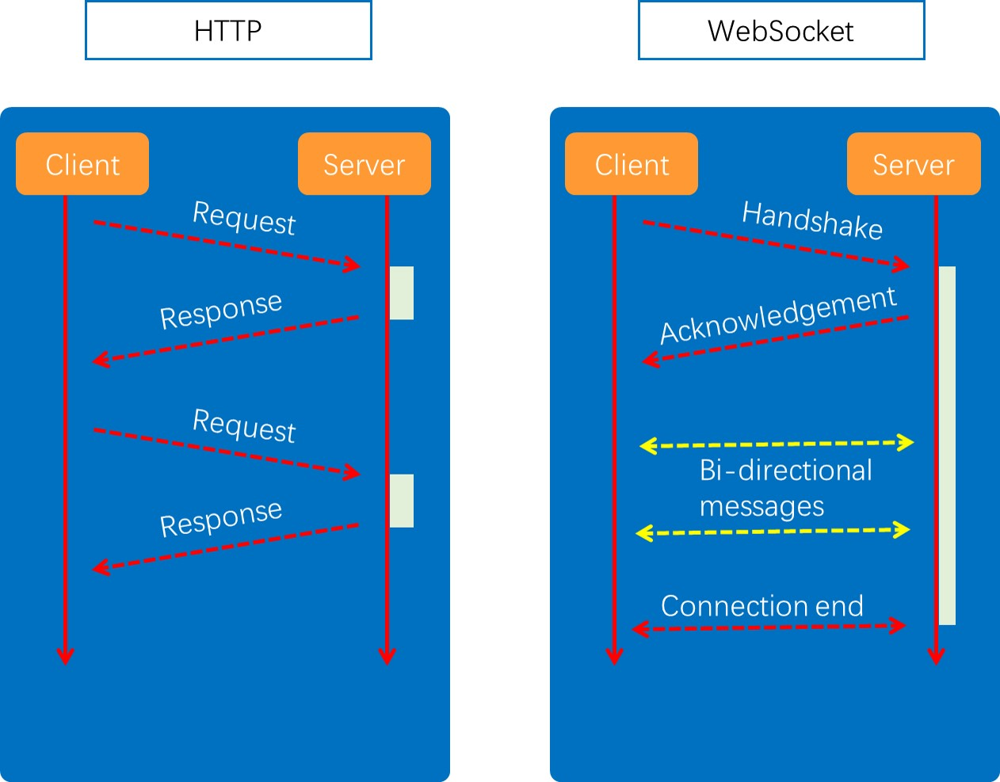
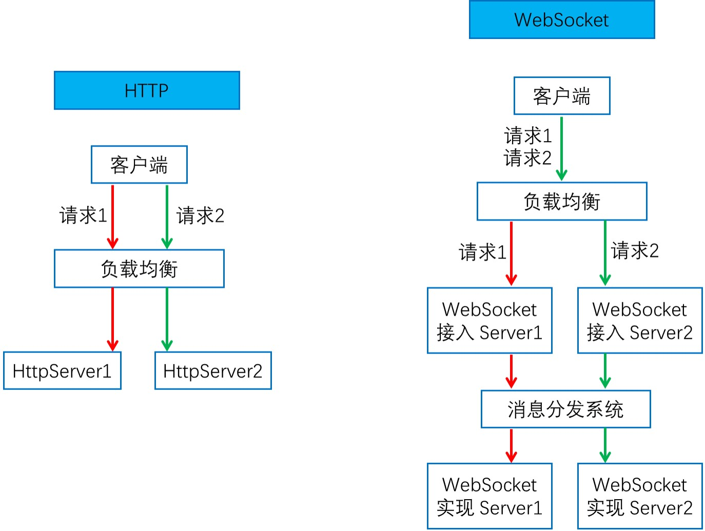
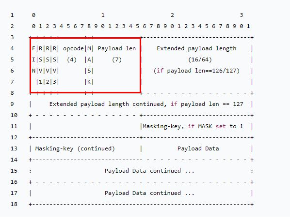
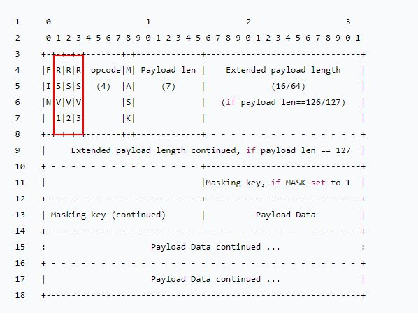
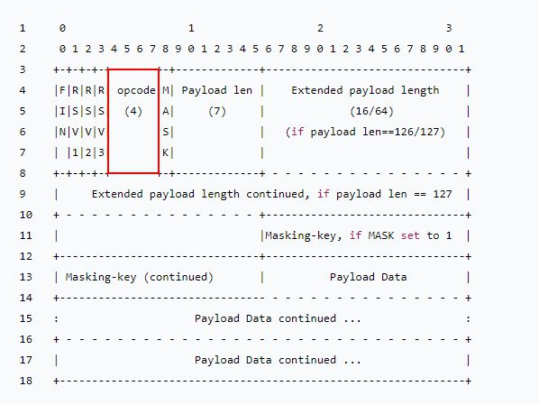
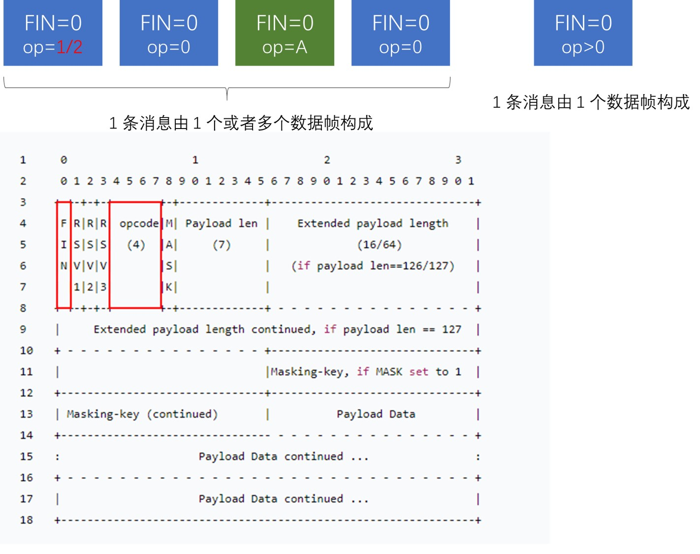
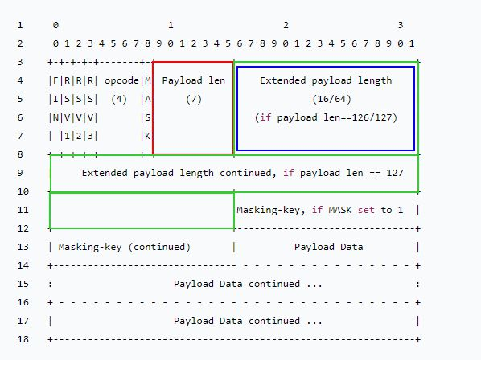
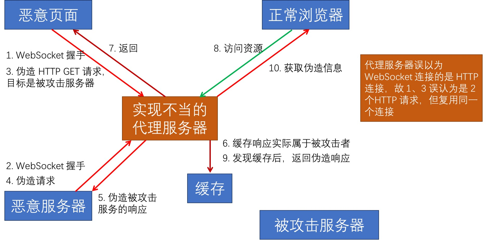
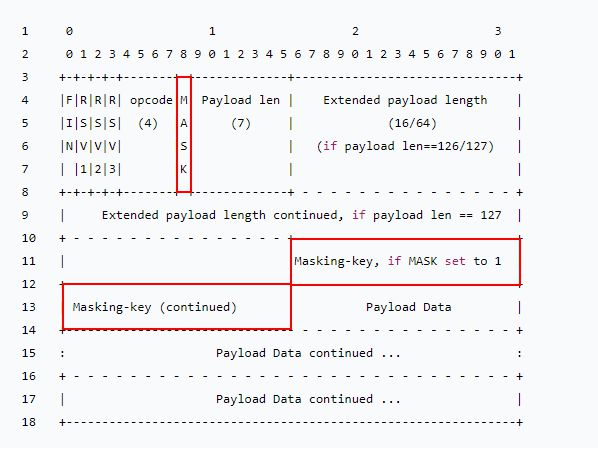

# 1. Websocket 解决了什么问题
## 1.1 如何及时获取更新？
+ HTTP 下需要通过轮询获取信息
  + 如果轮询时间过短，那么服务器压力就很大，消耗带宽
  + 如果轮询时间过长，那么如果服务器更新了资源，而客户端还没到请求的时间，就会造成长时间没有更新资源
+ Websocket 可以双向通知

## 1.2 Chrome 请求列表：分析 WebSocket
+ 过滤器
  + 按类型：WS
  + 属性过滤：is:running
+ 表格列
  + Data：消息负载，如果消息为纯为本，则在此处显示，对于二进制操作码，此列将显示操作码的名称和代码，支持以下操作码：Continuation Frame、Binary Frame、Connection Close Frame、Ping Frame 和 Pong Frame
  + Length：消息负载的长度(以字节为单位)
  + Time：收到或发送消息的时间
+ 消息颜色
  + 发送至服务器的文本消息为绿色
  + 收到的文本消息为白色
  + WebSocket 操作码为浅黄色
  + 错误为浅红色

## 1.3 支持双向通讯
+ RFC6455(2011.12) 
+ 双向通讯的优劣？
+ 如何管理会话？
+ 如何维持长连接？
+ 兼容 HTTP 协议
  + 端口复用
+ 支持扩展
  + 如 permessage-deflate 扩展

## 1.4 HTTP和WebSocket对比

# 2. WebSocket的约束
## 2.1 WebSocket 的成本
+ 实时性与可伸缩性
  + 牺牲了简单性
+ 网络效率与无状态：请求 2 基于请求 1
  + 牺牲了见到那行和可见性

## 2.2 兼容 HTTP 协议
+ 默认使用 80 或 443 端口
+ 协议升级
+ 代理服务器可以简单支持

## 2.3 设计哲学：在 Web 约束下暴露 TCP 给上层
+ 元数据去哪儿了？
  + 对比：HTTP 协议头部会存放元数据
  + 由 WebSocket 上传输的应用层存放元数据
+ 基于帧：不是基于流(HTTP，TCP)
  + 每一帧要么承载字符数据，要么承载二进制数据
+ 基于浏览器的同源策略模型(非浏览器无效)
  + 可以使用 Access-Control-Allow-Origin 等头部
+ 基于 URI、子协议支持同主机同端口上的多个服务

# 3. WebSocket 协议格式
## 3.1 帧格式示意图
+ 红色是 2 字节必然存在的帧首部

## 3.2 数据帧格式: RSV 保留值
+ RSV1/RSV2/RSV3：默认为 0， 仅当使用 extension 扩展时，由扩展决定其值

## 3.3 数据帧格式：帧类型
+ 持续帧
  + 0：继续前一帧
+ 非控制帧
  + 1：文本帧(UTF8)
  + 2：二进制帧
  + 3-7：非控制帧保留
+ 控制帧
  + 8：关闭帧
  + 9：心跳帧 ping
  + A：心跳帧 pong
  + B-F：控制帧保留

## 3.4 ABNF 描述的帧格式
+ ws-frame = frame-fin; 1 bit in lenth
+ ws-frame = frame-rsv1; 1 bit in lenth
+ ws-frame = frame-rsv2; 1 bit in lenth
+ ws-frame = frame-rsv3; 1 bit in lenth
+ ws-frame = frame-opcode; 4 bits in lenth
+ ws-frame = frame-masked; 1 bit in lenth
+ ws-frame = frame-payload-length; 3 种长度
+ ws-frame = [frame-masking-key]; 32 bits in lenth
+ ws-frame = frame-payload-data; n*8 bits in; length, where; n >= 0

# 4. 如何从 HTTP 升级到 WebSocket
## 4.1 URI 格式
+ ws-URI = "ws:" "//" host [":" port] path ["?" query]
  + 默认 port 端口为 0
+ wss-URI = "wss:" "//" host [":" port] path ["?" query]
  + 默认 port 端口为 443
+ 客户端提供信息
  + host 与 port：主机名与端口
  + schema：是否基于 SSL
  + 访问资源：URI
  + 握手随机数：Sec-WebSocket-Key
  + 选择子协议：Sec-WebSocket-Protocol
  + 扩展协议：Sec-WebSocket-Extensions
  + CORS 跨域：Origin

## 4.2 如何证明握手被服务器接受？预防意外
+ 请求中的 Sec-WebSocket-Key 随机数
+ 响应中的 Sec-WebSocket-Accept 证明值
  + GUID(RFC4122)
  + 值构造规则：BASE64(SHA1(Sec-WebSocket-KeyGUID))
    + 拼接值
    + SHA1 值
    + BASE64 值
    + 最终头部值

# 5. 传递消息时的编码格式
## 5.1 消息与数据帧
+ Message 消息
  + 1 条消息由 1 个或者多个帧组成，这些数据帧属于同一类型
  + 代理服务器可能合并、拆分消息的数据帧
+ Frame 数据帧
  + 持续帧
  + 文本帧、二进制帧

## 5.2 非控制帧的消息分片：有序

## 5.3 数据帧格式：消息内容的长度
+ 消息内容长度组成
  + 应用消息长度
  + 扩展数据长度
+ <= 125 字节
  + 仅使用 Payload len
+ 126 至 2^16 - 1
  + Payload len 值为 126
  + Extended payload length 16 位表示长度
+ 2^16 至 2^64 - 1
  + Payload len 值为 127
  + Extended payload length 共 8 字节 64 位表示长度

## 5.4 发送消息
+ 确保 WebSocket 会话处于 OPEN 状态
+ 以帧来承载消息，一条消息可以拆分为多个数据帧
+ 客户端发送的帧必须是基于掩码编码
+ 一旦发送或者接受到关闭帧，链接处于 CLOSING 状态
+ 一旦发送了关闭帧，且接收到关闭帧，连接处于 CLOSED 状态
+ TCP 链接关闭后，WebSocket 连接才完全被关闭

# 6. 掩码及其所针对的代理污染
## 6.1 针对代理服务器的缓存污染狗估计

## 6.2 frame-masking-key 掩码
+ 客户端消息：MASK 为 1(包括控制帧)，传递 32 位无法预测的，随机的 Masking-key
+ 服务端消息：MASK 位 0

## 6.3 掩码如何防止缓存污染攻击？
+ 目的：防止恶意页面上的代码，可以经由浏览器构造出合法的 GET 请求，使得代理服务器可以识别出请求并缓存响应
+ 强制浏览器执行以下方法：
  + 生成随机的 32 位 frame-masking-key，不能让 JS 代码猜出(否则可以反向构造)
  + 对传输的包体按照 frame-masking-key 执行可对称解密的 XOR 异或操作，使代理服务器不识别
  + 消息编码算法
    + j = i MOD 4
    + transformed-octet-i = original-octet-i XOR masking-key-octet-j

# 7. 维持 WebSocket 会话心跳-心跳帧
+ 心跳帧可以插在数据帧中传输
+ ping 帧
  + opcode = 9
  + 可以含有数据
+ pong 帧
  + opcode = A
  + 必须与 ping 帧数据相同

# 8. 关闭 WebSocket 会话
+ 在 TCP 连接关闭之前关闭 WebSocket

## 8.1 关闭会话的方式
+ 控制帧中的关闭帧：在 TCP 连接之上的双向关闭
  + 发送关闭帧后，不能再发送任何数据
  + 接受到关闭帧后，不能再接受任何到达的数据
+ TCP 连接意外中断

## 8.2 关闭帧格式
+ opcode = 8
+ 可以含有数据，但仅用于解释关闭会话的原因
  + 前 2 个字节无符号整型
  + 遵循 mask 掩码规则

## 8.3 关闭帧的错误码

<table>
    <tr>
        <td>1000</td>
        <td>正常关闭</td>
    </tr>
    <tr>
        <td>1001</td>
        <td>端点丢失，如服务器宕机或浏览器切换其他页面</td>
    </tr>
    <tr>
        <td>1002</td>
        <td>协议错误</td>
    </tr>
    <tr>
        <td>1003</td>
        <td>接收到不能处理的数据帧，数据类型错误（例如端点只能处理文本，但传来了二进制消息）</td>
    </tr>
    <tr>
        <td>1004</td>
        <td>保留</td>
    </tr>
    <tr>
        <td>1005</td>
        <td>保留，禁止由端点发送此类型关闭帧，它是用来当端点没有表明关闭码时的默认关闭码。</td>
    </tr>
    <tr>
        <td>1006</td>
        <td>保留，禁止由端点发送此类型关闭帧，它是用来当端点未发送关闭帧，连接异常断开时使用。</td>
    </tr>
    <tr>
        <td>1007</td>
        <td>消息格式不符合 opcode，数据内容错误（如在text帧中非utf-8编码的数据）</td>
    </tr>
    <tr>
        <td>1008</td>
        <td>端点已接收消息，但违反某些策略。当没有更好的关闭码（1003或1009）的时候用此关闭码或者不希望显示错误细节。</td>
    </tr>
    <tr>
        <td>1009</td>
        <td>消息超出能处理的最大长度</td>
    </tr>
    <tr>
        <td>1010</td>
        <td>客户端期望服务器协商一个或多个扩展，但这些扩展并未在 WebSocket 握手响应中返回。</td>
    </tr>
    <tr>
        <td>1011</td>
        <td>遇到未知情况无法执行请求</td>
    </tr>
    <tr>
        <td>1015</td>
        <td>保留，禁止由端点发送此类型关闭帧，它会在TLS握手失败（如证书验证失败）时返回。
        </td>
    </tr>
</table>
