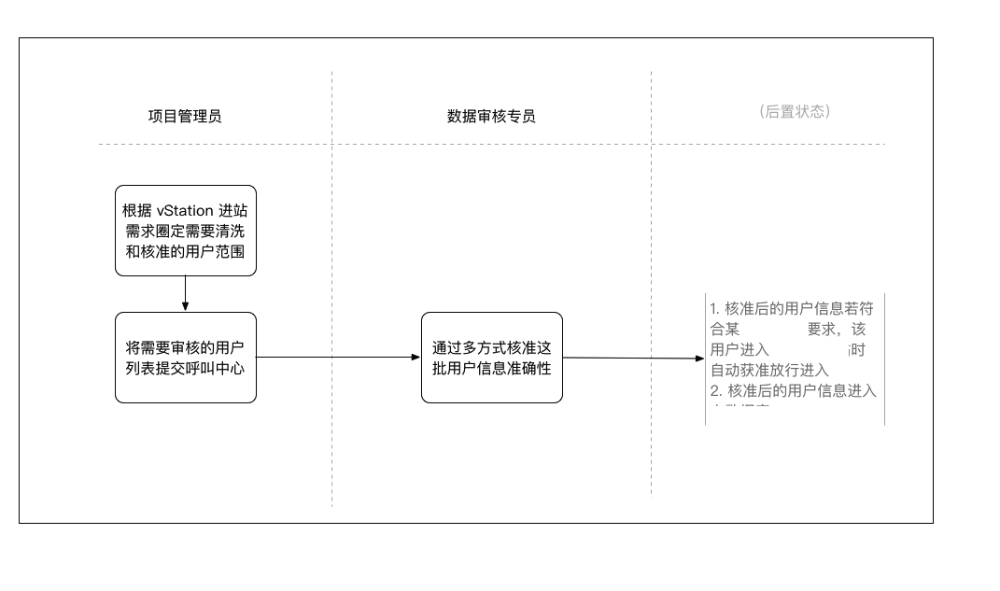

# 引用的产品介绍
+ Trigraphy https://trigraphyapp.com/
+ the guardian
+ hopper
+ WWF together
+ fabulous
+ pathSource
+ quartz hooked
+ primmer
+ arts culture
+ 知识星球
+ statgeek
+ unread
+ Chartistic

# 1. 关于验证码的思考
+ 不要将责任推卸给用户
+ 方案选择的平衡
+ 验证码的进化

# 2. 产品经理的工具
+ 纸笔 + Scanner Pro
+ 原型工具 Axure/Keynote/OmniGraffle/Sketch/墨刀/POP 等
+ 思维导图 MindManager/MindNode/XMind
+ UML 图 StarUML/Visio/LucidChart/ProcessOn

# 3. AI 时代产品经理
## 3.1 学习

+ 要不要学算法？
要。在当前的阶段，人工智能的能力大都隐藏在我们能感知到的功能之下，我们很难从场景出发，理解内部机制，获得认知。

+ 怎么学算法？

从视频开始，吴恩达教授在 Coursera 上的机器学习课程，网易公开课上有中文字幕。李宏毅教授的课程。

然后读文章。

+ 要不要真的写程序？
如果你之前就有工程能力，就尝试着写一点；如果完全没有相关背景，不写也罢，别给自己添堵。

不要写具体的算法实现，找到合适的算法跑好，拷过来直接看结果就可以了

## 3.2 实践

+ 产品与算法的结合粒度要小
+ 要重视工程的力量
+ 利用产品最大化算法和工程的产出结果，技术能力满足用户需求即可，可以适度增加，但是不能一味增加技术而忽略产品和用户体验，这是技术浪费。
+ 做好数据规划，盲目扩大数据量并不总是有用的，如果数据的多样性得不到保证，扩大数据规模对算法结果没有太大帮助，甚至如果数据特性分布出现问题导致训练数据有偏，还可能会造成算法的过度拟合和表现下降。
+ 去完美主义，理解算法的不确定性

# 4. 产品被抄袭了怎么办

+ 摆正心态，泰然处之
+ 别担心，抄不走的是气质
+ 不要将产品的护城河建在脸上

我们在产品规划设计之初，就要清楚自己的相对优势和可能的成功路径，一腔热血“打造好用的产品”未必能成功，所谓“不要将护城河建在脸上”，意思是说不要将产品的外表作为护城河，因为外表太容易被抄走了。

比如有的团队优势在于廉价获客，有的团队可能在技术上有壁垒，或者有行业资源门槛，或者有些特别偏门的优势，比如我认识的一个创业者有个神奇的技能是 ASO 做得非常厉害，别人即便抄走他的产品也抄不走他的获客效率，他做了很多应用，并从不担心别人抄袭。

所谓大公司抄死小公司的说法，也正是大公司在规模上的相对优势。如果一个产品只有基于规模优势才能长起来，那它本就应该交给有规模优势的企业去做，或者能用极快的速度在大公司反应过来之前利用巧劲儿建立规模优势或其他的壁垒。不要明知道在规模上打不过还要去硬拼，历史上基本没有靠正面硬干以弱胜强、以少胜多的故事。

作为产品经理，一定要清楚产品 Idea、产品界面和功能流程都无法成为真正的竞争壁垒，认为自己设计出了天才的界面就能立于不败之地，其实是在设计之初就将自己置于非常危险的境地，把命运放到了别人手里。

+ 做有积累效应的事情

抄袭者能抄走产品特性，却抄不走数据和用户。产品设计中一定要考虑数据的积累和用户的卷入，要设计出一套机制：让用户使用产品越多，产品对用户的价值就越大，或者使用产品的用户越多，产品的价值就越大（也被称作网络效应）。

在产品设计中，还要尽早让用户“卷入”，也就是在产品中做出投资。比如当你的名片都印上了某个电子邮件地址，就很难再换一个电子邮箱服务提供商了。同样的道理，在某款音乐播放器中标记越多“喜爱的歌曲”，你就越离不开它。

+ 有条不紊，不要情绪化处理

不论如何，如果抄袭者越过底线，开始直接伤害到我们的利益，我们也不能任由事态发展。在这时，保持冷静，不要情绪化很重要。

你需要找到靠谱的律师，先做好一些准备，比如整理和收集侵权的证据，去做相关的公正，以及准备相关的资质等。这里也提醒你，对一些比较核心的产品机制，能申请专利和著作权的最好尽早申请，因为专利审批需要一个比较长的周期，临时处理肯定来不及。

随后最好可以和对方直接对话沟通，消除不必要的误会，或许很多事情可以化干戈为玉帛。处理这样的争端非常花费心力，不到万不得已，不要将事态扩大。

最后如果确实不得已要开战，除了法律武器之外，也应当恰当地利用好公关渠道发声，利用舆论向抄袭者施加压力。同时别忘了很多平台方有仲裁机制，比如 App Store 和一些流行的安卓市场，或者电商网站等，都可以直接发邮件要求下架抄袭者。

总之，一定不要让愤怒冲昏头脑，只拿出一部分精力处理就可以了，互联网历史上还没有哪一家企业是通过搞死竞争对手赢得成功的，成功只有一条路径，就是赢得用户，赢得市场。盯紧你的目标，把更多的精力放到迭代产品和服务用户上，让抄袭者永远跟随你的步伐。

# 5. 讲产品经理如何获得非权力性的影响力
+ 建立信任是个长期的过程
+ 如何试错
+ 要重视承诺，不要找借口
+ 不要在不重视承诺交付的环境中工作

# 6. 产品经理的图文基本功

## 6.1 产品文档

文档（包括原型和 PPT 等等）是产品经理重要的基本功，也是产品经理的脸面，很多时候会决定别人跟你合作的初始心态；而且从某种意义上来说，产品文档也是产品经理设计的一个“产品”，也是有用户（阅读者），目的（文档的目的）和特性设计（如何表述，用什么逻辑和工具等）的。

+ BRD/MRD

BRD 是商业需求文档（Business Requirement Document），MRD 是市场需求文档（Marketing Requirement Document），BRD 和 MRD 的出现机率并不高。通常在启动全新产品线的时候才需要用到 BRD。

顾名思义，BRD 描述的是商业级别的内容和判断，通常逻辑和内容会比较短小精悍，但背后要有广泛的调研和思考基础，而且 BRD 是站在公司和股东层面的，它回答的问题是我们要不要做，比如我们是否需要面向所有用户新增一种新的商业产品，或者我们是否需要将一次性收费模式变更为订阅模式。

我在过去的工作中，大部分要用到 BRD 的机会都伴随着重大的战略决策，需要比较长时间的周密推演和讨论，最终一般会是高层非常慎重的决策过程。

从另一个角度来说，我觉得大部分的项目是不需要 BRD 的，尤其是有些项目，都已经决定要做了，还要去准备 BRD 论证其合理性，就很形式化，没有太大价值。

MRD 一般会在既有的产品路线上启动比较大的项目或者新功能时用到，但我在过去的工作中却很少专门写 MRD，我自己的理解是： MRD 是 BRD 和 PRD 之间承上启下的一种形式，交代市场机会，竞争情况，产品和运营策略和计划等等，有点像是对 BRD 的拆解和细化，也有点像是高度概括、没有细节的 PRD；所以我会选择干脆把这样的内容拆到 PRD 或 BRD 里面去。

如果说 BRD 回答的是“我们要不要做”，那 MRD 回答的就应该是“我们怎么做”，它会比 BRD 多了很多细节，却又不涉及详细的功能逻辑和流程。在大部分项目中，我的习惯是把 MRD 的内容放到 PRD 中去，在不同的场合着重讲不同的部分。

比如在对业务和运营部门宣讲的时候，我会避开产品特性的细节逻辑，着重讲偏向 MRD 的部分，而在向工程师宣讲的时候，则会反过来，主要精力放在讲具体要实现些什么特性，只需要简明扼要地交代商业背景。

+ PRD/UC/FSD
PRD 是 Product Requirement Document 的缩写，意思是产品需求文档。PRD 是产品经理写得最多的文档，按照惯例，它一般是写具体的功能逻辑和细节，给工程师看的；但正如我刚才提到的，在操作过程中，产品经理还是应该在 PRD 中写一些包含商业、业务背景、市场机会等等内容；也就是交代清楚“为什么做”，而不是简单地描述流程和功能。

网上能找到的 PRD 的模板有很多，除非有强制文档格式要求，否则大家完全没有必要拘泥于其中的任何一种。最好是可以把各种模板都研究一下，根据不同的产品或项目类型挑选合适的框架。比如重操作的 To C 产品可能需要交互流程描述和线框图，而 To B 的产品可能注重的是概念模型和业务流程。

记住所有的模板都是为文档服务的，我们的目标是清晰和准确的文档描述，而不是把文档模板的空档填满。我看到过不少照着模板写的 PRD，其中有些部分明显就是为了避免空白硬填的内容，比如“数据字典”，作为一个操作类的特性，不涉及什么数据字典，去掉这部分就好了，完全没必要硬着头皮往里面填充没有意义的内容。

UC 是指用例文档，通常是以用户角度的完整功能单位为粒度，描述用户跟系统的交互过程以及系统的输出逻辑。如果项目是重交互，以用户场景驱动的话，我会推荐用 UC 来组织 PRD，也就是 PRD 里面按照用例的方式来描述功能实现，这样做更容易向工程师交代产品价值。

用例文档的模板比较简单，网上一搜一大把，最核心的部分是流程，通常会把主流程和分支流程分开描述，再复杂的业务，主流程一般都简明扼要，所有的复杂度最好都放到分支流程里面去，分支流程里面的一些限制和规则，可以整理一下，在业务规则的那个部分重写一份，便于工程师在开发过程中去查阅。

具体的细节我就不赘述了，但我建议你去仔细研究用例模板中的每一部分（比如背景、涉众、主流程和分支流程、业务规则等等）存在的价值。它给我们提供了一个研究用户以及思考用户行为的框架，能够帮助我们去有条理的从用户角度出发理解场景和系统功能。如果你有关于这些内容的想法可以在留言里提，我们再仔细聊。

FSD 是功能详细说明（Function Specifications Document），有时候我们也称作 FRD，我们经常说“写 Spec”，其实就是指它。这时的文档就偏向实现了，交代具体的数据字典，概念模型结构，业务接口规范等等，一般 FSD 会跟 PRD 合并，不会单独拆出来。

大部分项目中，如果你写了 PRD，就不大需要再写 FSD 了。除非项目的规模很大，涉及各种各样的子项目，可能整个项目组有一套 PRD，但每个具体的子项目会准备专门的 FSD。

+ 产品原型/交互稿

同样的道理，一个产品所有的相关产出不一定要处于同样的质量水平。我们要克服“事事都做到完美”的倾向，这种完美主义倾向很多时候来源于对目标的不清晰和对真正产品价值思考的逃避。专业的事情交给专业的人，让设计师去完美产品的样子就够了。

另外一个提醒是，除非面对面讲解，否则产品原型需要一个明确的阅读线索。很多产品经理画完原型图就完了，往文档上一贴，不解释不说明，让开发自己去读图。开发读完做出来的东西有偏差，产品经理会从图上里挑出一个并不引人注目的细节说：“你看，我早就画在图上了，你没看见怪谁？”这种行为就挺招人恨的。

大部分人很难系统性地读完一张产品原型图，因为图不是一个线性信息，需要引导。在这里跟你分享一个方法，就是在产品原型图上齐整地加上标注：可以用数字标记，在下方注释，或是用细线引导在原型图边上加注释。

用这样的方式，将原型图中的组件逻辑和数据规则说清楚，读图者也有线索依赖，不会让一个人对着图不知所措。

如果没有交互设计师，可能产品经理还要做交互稿，交互稿要描述元素布局和交互流程，这个我不是很专业，大力推荐我曾经的同事 Heidi 多年前的一篇文章“如何写一份交互说明文档”。我后来的工作中需要做交互稿的时候，基本就是按照这篇文章来操作的，很多思路也被我借鉴到了做产品原型上。

+ 其他各种因需创建的文档

还有很多根据不同需求创建的文档形式，比如需求收集文档、需求进度文档、需求评审报告、发布通知，有时要做验收测试，还有验收测试的文档等等。在任何需要文档来规范思考、引导书面沟通、存档留底的场景中，都可以建立相应的文档机制。

## 6.2 产品图例
+ 概念模型图

概念模型的目的是要将产品中的业务概念分门别类的整理出来，并在同时确定概念之间的关系。在复杂业务的系统中，这一工具非常重要，它是一切业务流程的基础。

抽取概念模型的过程并不复杂，但需要一些时间，我们可以首先去尽可能详细地描述系统各种场景和逻辑，然后注意描述中的所有名词。比如我们说用户可以创建账号、设置用户名，登录系统，系统管理员为其指定一个角色。

这样简单的一句话中就包含了用户、账号、用户名、系统、系统管理员和角色等名词，我们把这些名词不断地取出来，去分析他们之间的关系。

比如一个用户和账号之间是对应关系，这是就要去确定对应方式，是一个用户只能有一个账号，还是可以有多个账号，或多个用户共用一个账号。基于这个关系，可能就能长出用户识别、同账号登录互踢或子母账号管理的需求。如果再考虑账号和角色之间的关系，可能就是一套完整的权限系统。

而有的名词可能是其他名词的属性，比如上面提到的“用户名”便是账号的属性，属性跟概念之间也会有对应关系，比如是否唯一，是否可变，是否是与其他概念产生关系的“键”等等。技术可能会据此去做系统设计。

越是基础的东西，在这时越需要谨慎设计，比如有多少系统错将用户名作为主键，导致未来有用户需要更换用户名时无比复杂（我职业生涯中至少遇到过两次）。

所以概念模型的梳理最大的作用是来回答系统的根本性问题，从而可以帮助工程师设计数据结构，也帮助业务找到设计出发点。一个产品的架构扩展潜力，很多时候就受限于概念模型的设计。比如订单管理系统在最初设计中，订单和标的之间的关系被设为一一对应，那将来要多产品搭售的时候，整个产品技术团队就会无比痛苦。

概念模型图通常是用 UML 中的类图或传统的 E-R 图的结构来绘制，突出概念和关系，去询问自己每个概念实体和另外一个概念实体之间可能有的关系。

也有人会说，这样的概念模型应该是工程师在做概要设计或数据结构设计时才应该考虑的，产品经理考虑早了点。

我不这么认为，我认为这是一个产品经理和工程师需要共同关注的地带，甚至产品经理的职责更重，因为它背后更多的是业务上的前瞻、取舍和判断。工程师在设计中会讲 DDD、OOD，进而去理解和重现业务架构模型，那产品经理就更应该把业务背后的逻辑关系抽丝剥茧整理清楚。

我们在招产品经理时会要求产品经理具备“抽象和建模的能力”，其实指的就是抽象概念模型的能力。有些公司甚至会在复杂系统中设立“业务架构师”岗位，专门做这件事情，有点像传统软件行业里的“系统分析师”。

概念模型有一点偏技术，又不是一个酷炫的东西，很难拿出来做展示，而且它的作用不那么立竿见影，所以没有得到应有的重视。但它在业务逻辑复杂的产品设计中确实非常重要，希望你动手去尝试一下，挖掘它的价值，为自己所用。

+ 流程图/泳道图/时序图

所有的业务系统都有流程，我们的文档中一定会或多或少涉及“流程图”，最基础的流程图是面向过程的描述性流程图，有些图形规范，比如开始结束是圆角矩形，数据操作是矩形，判断是菱形等等，还有些其他的一些形状代表的意思。但我很少见过真的完全按照标准格式画的，基本就用到矩形和菱形，有时为了加以区分会有颜色上的差异。

但如果流程比较复杂，涉及的角色或子系统、模块多起来的时候，传统的流程图就会开始捉襟见肘，应接不暇；所以除非描述单一功能模块内部的流程外，我一般很少会用传统流程图。而是用泳道图和时序图。

泳道图很好理解，就是在传统的流程图上加入角色，因为每个角色之间是平行的，从图上看起来每个角色就像是一个泳道。通过这些泳道去标识每个动作是由哪个角色（或子系统）做出的。这种图形一般用于比较宏观的流程描述中，比如划分各业务角色之间大的流程步骤，或描述子系统之间的边界和职能。

当进一步细致到具体的用例或方法时，则可以用时序图，时序图也是 UML 标准里面的一种图示，也是面向对象设计的一种工具，本来是工程师用，后来被产品经理借来描述业务流程。

时序图整体看起来像很多根竹签，每根竹签代表用户、业务对象、子系统甚至“时间”，凡是可以向其他竹签发出请求的都可以表示为一根竹签，而有些过程是需要定时执行的，在时序图上，我们就可以将其表示为“时间”。每根竹签向自己或其他竹签发起请求，然后响应请求的竹签则根据这个请求开始一个过程，这个过程可以是同步，也可以是异步，可以是判断过程，也可以是循环。

总之时序图可以表达的逻辑非常丰富，能将复杂逻辑梳理得很有条理，而且读图成本很低，既能一目了然，也有引导按图索骥。我有一段时间非常迷恋时序图，连项目管理中的不同角色的流程安排都用时序图表达，强烈建议你深入学习一下，把它用到你的流程分析中。

+ 状态图

系统中所有的概念实体都应该有状态，用户有状态，订单有状态，账单也有状态。在数据结构设计时，经常会在业务对象表里加一个“状态”字段。产品经理有时不会将状态显式地单独表达出来，而是让工程师自己通过读业务逻辑去区分和判断业务对象的状态。

这样的沟通断层会产生一些风险，有时描述同一个状态用了不同的用词，导致工程师记录成了两个状态，比如前一条业务逻辑写的是“完成对账后系统进入休眠状态”，后一条写成了“完成角色更新后系统挂起”，这可能来自于产品经理的不严谨，结果系统里就出来一条没有必要的脏状态。

更吓人的是有时产品经理描述不清，导致本来应该是不同的状态，被开发理解为同一个，未来需要再做拆分时，难上加难。比如用户欠费挂起和用户到期挂起应该分开不同的状态，但产品经理在文档里都写着“挂起”，导致未来给用户开通服务的时候不知道该怎么直接从数据表里区分，还要去关联行为日志的表。

建议产品经理对于比较核心的业务对象，把状态画成状态图，每个节点是一个状态，每两个状态之间是一个行为，描述的是出发状态转变的可能。这么做还有一个好处是，可以帮助你从状态的角度出发，去穷尽所有状态之间可能的变化，保证不会遗漏用例。

+ 用例图

用例图是 UML 的标准图示，看起来特别简单，一个火柴人和一些椭圆。每个椭圆是一个用例描述，然后把椭圆和人连起来。用例图复杂起来很复杂，还有扩展点，互相之间的关联包含关系等等。但开始使用它很容易，只用火柴人和椭圆就够了。

那这么简单，甚至有点蠢的图，能干吗呢？首先是可以让读者一眼看到一个产品或一个项目需要实现的用户价值，以及它可能的规模是什么；另外则是可以利用用例来组织产品文档的结构，很容易理解，也容易作为标准来管理进度。

用例图的一个老大难问题是区分用例的粒度，这是个没有唯一答案的问题，同一个人的用力粒度划分标准可能都不同。比如 CRUD （创建、读取、更新、删除）算一个用例，还是四个用例。比如“账户管理”算是一个用例，还是“账户创建”“角色分配”“账户删除”“账户查询”四个用例。这简直是个哲学问题，这么多年我也没能找到一个金标准。

我最喜欢的标准是来自一场 UML 培训，说的是“以卖点作为粒度”，也就是设想你的系统是按功能收费的，你从兜里一个接一个地往外掏用例，每掏一个用户就要付一份钱，你要保证每个用例用户都是愿意买单的，同时，又要保证用例尽量丰富，以求收到足够多的钱。

假设你现在做“极客时间”，你从兜里掏出一个“修改密码”，用户不会认为它是个卖点。但你假设你现在做的是一个复杂的金融保险系统，很可能“修改密码”就会成为一个独立的卖点，所以用例粒度划分一定是因系统而异的。

# 7. 写好产品文档
+ 明确受众、目的和形式

好的产品文档应该有非常强的针对性。就像做产品要先明确用户一样，写产品文档的第一步就是要明确文章的目标受众是谁。知道谁是文档的主要受众或者读者，结合他们的思考维度，才能知道该用什么样的语言、逻辑和形式。

之后，我们是要清楚每个文档的目的，而不是把写文档本身当做目的。去设想一个文档的读者在读之前的状态和读完之后的状态，你希望他能获得什么信息，做出什么决定，以及有些什么后续的动作。

弄清楚受众和目的之后，你就可以判断用什么形式来呈现文档，是静态的产品原型，动态的 Demo，一张流程图，幻灯片还是一篇 PDF 或一封邮件，大概是什么长度等等。

比如 BRD 通常面向管理层和业务部门，目的一般是要获得支持和授权，申请到足够的资源，那就应该避免说产品实现细节，不要用技术的语言，而是从潜在的市场机会和风险解释要做什么，文档的形式可能是幻灯片。

幻灯片也分阅读型和演讲型的，阅读型要把逻辑写下来，演讲型则写提纲或放图，通常要准备两份，因为很多时候是既要做演讲，也有时候是发邮件的。

而 PRD 通常是面向工程师，让他们知道要做什么，以及为什么做，进而驱动他们设计和实现具体功能。PRD 通常是写成文档，PDF 或者写在 Wiki 上（建议不要用 Word，很多工程师如果不用 Windows 系统，排版会失控），工程师不喜欢长篇大论，最好能图文并茂，如果有机会能给现场给他们讲解一下，就更好了。

+ 知其所以然，然后知其然

在面向职能部门的文档中，目的主要是为了推进执行，所以很多人只在文档中交代其“然”，不交代其“所以然”。比如只告诉开发要做什么功能，只告诉运营要推什么入口，却不交代为什么。很多文档模板里有“项目背景” 一项，结果产品经理只是随便写一两句话就算充数。

另外交代背景和原因还有个好处是可以得到职能部门的建议和反馈。没有人比一线的工程师更了解系统实现，他们或许可以给你更好的解决方案。

+ 打造良好的阅读体验——金字塔原理、逻辑及格式

文档的阅读体验也非常重要，有的文档逻辑杂乱无章，东一榔头西一棒子，不忍卒读。要保证文档的可读性，不能随性起笔写到哪儿算哪儿，而应该有提前的谋篇布局。

有个著名的方法论叫金字塔原理，就是从一个论点出发（通常是文档的目的），找到支持它的三到五个方面，每个方面再向下拆分，形成一个逻辑上的金字塔。每一层的拆分都要尽可能保证观点是相互独立，同时又完全覆盖的。

写文档就是一个不断拆分，再向上合并的过程。比如我们举个常见的例子，现在要给 ATM 机写 PRD，首先第一层拆分是 ATM 机的不同角色，用户、维护管理人员、系统（有时我们会将系统也当做一个角色）等。

从用户这里拆分下来，有存钱、取钱、汇款、账户管理之类的用例，继续从存钱这个用例去拆解，可以分解出“校验身份，完成取款，退出系统”的主流程。

如果我们看“完成取款”的流程，可以继续拆到“用户输入金额，系统从账户上扣款，系统吐出钞票，用户取走钞票”的具体交互步骤，任何一个交互步骤又可以长出各种分支流程，比如系统扣款失败，或者扣款成功后，吐出钞票失败等等。

如果像写故事一样，想到哪里写哪里，这就很容易遗漏关键流程，也会让读文档的人陷入混乱，不知所云。对于上面的拆解过程，我们通常的做法是：对每个角色给出一系列用例，每个用例有一个用例文档，用例文档中先描述正常流程逻辑，然后单独描述正常流程每个节点上可能出现的异常情况。

在文档描述过程中可能会出现一系列商业规则，比如取款每次不得超过 3000 块钱，每天每张卡不得超过 20 万等等，这些规则在流程中即便阐述了，也最好可以单独在某一个地方列出来，一来方便工程师查漏补缺，二来也方便测试时去设计测试用例，提高效率。

最后还要重点提一下格式，好多人写文档完全不注意格式，包括字体排版之类。虽说这不是关键，可还是建议处理处理，不一定要多好看，起码看起来易读一些，比如增加一点段间距和页边距，该对齐的对齐，该加粗的加粗，这是文档的第一印象，最好还是正儿八经收拾收拾。

+ 先写厚，再写薄
写文档通常不是一蹴而就的，写的过程也是整理思路，查漏补缺的过程。所以一开始的时候可以尽量多写一点，然后不断重读，不断裁剪、重构、修改和调整。可能在写主流程的时候会突然意识到遗漏了分支流程，那就立刻写下来，等到修改的时候再把它摘出来放到分支流程的文档结构里。

另外是写的过程中可能没注意遣词造句，会写得比较啰嗦，或存在二义性。这些都需要在修改的过程里不断地提炼，这个过程跟写作很像，都是先堆后理，先厚再薄的过程。

在堆和理之间，可以尝试引入一个“冷静期”，我在之前的文章中提到过，我会建议同事在写完文档后不着急定稿和评审，而是搁置在那里，放一晚上，睡一觉或者忙一点别的事情之后，等思路开始从深陷其中抽离出来了，再把文档翻出来重读和修改。我们把这个过程叫做文档的发酵。

当你全力写的时候，很容易陷入在写作者的角度抽不出身，有些东西会在你脑子里，但没有落到文档中；而文档的写作最主要的目的还是为了读，当你放下文档晾它一会儿，重新再捡起来的时候，你会更容易站到读者的角度。

另一个更简单的办法是把写出的文档给熟悉的自己人先读读看，获得一些从读者角度来的反馈。就像白居易写完诗会念给隔壁大妈听一样，这也是一个精进文档写作的方法。

我以前偶尔会把初稿文档发给我媳妇让她帮我看看，一来她之前在业务部门工作，大概能理解业务，二来她不太会担心我的自尊心，会比较直接地指出她看不懂的地方。

# 8. 产品分析-谁是利益相关者
+ 利益相关者，不只用户

首先，“谁的”是了解需求背后主体的过程。每个产品背后都会有多个利益相关者，也就是我们常说的 Stake Holder、涉众。

我们平时最容易关注到的利益相关者可能是用户 —— 也就是产品的直接使用者；但对于产品经理来说，我们不能只关注用户，产品经理的段位高低，很多时候取决于能看到和平衡利益相关者有多少，对他们的了解有多深。

除此之外，当评估整个产品的效率和盈利能力时，我们还要学会站在投资者的角度去看问题。这是一个很大的话题，从投资者角度所关注的具体指标去看产品、服务，是一个产品经理有没有完成进阶的标志。

需要注意的是，这里的投资者关注的或许不仅仅是财务指标，还有整个产品的健康程度和存续指标。比如一款工具的日启、日活、留存、传播，或者社区型产品的用户数量，用户之间的关系数量等。

除了刚才提到的这些容易被漏掉的利益相关者之外，产品经理最需要关注的依然是用户本身。

我们经常提到产品经理的“共情能力”，其实指的是对用户立场和偏好的深刻理解，理解他们的关注点，并把它们变成指标。

这个过程有一些工具，比如做用户角色分析（也就是我们会提到的 persona）、关键人物地图等等，它们是做用户研究的一些基本功。这些对角色的理解除了对单一功能点的分析很有价值之外，也对我们后面会提到的，合理排定需求优先级有决定性的影响。

不论是用户还是其他利益相关者，我们需要了解他们对哪些事情最为关心，不同的角色关心的指标或许会有关联，甚至有矛盾，产品经理要在其中做出平衡和决策。

+ To B 和 To C 的不同决策方式

想特别提一下的是，通常面向消费者的产品，也就是我们平时提到的 To C 类的产品，考虑利益相关者的套路跟面向企业用户（也就是 To B 类产品），是相差很大的。

对于 To B 类用户，做出购买决定的人、影响决定的人和使用最终产品的人、甚至是掏钱的人可能都是不同的，他们在购买决策链上的角色和作用，以及发生作用的时机也是不同的。 To C 类产品通常是一人一票，只要打动一个用户，就会投一票，一票就是一个实打实的 deal。

+ 上下游特点与平台价值

对于市场容量比较大的 B 端客户，我们的思考方式和市场容量比较小的 B 端客户也是不同的。这里的市场容量指的不是财务市场的大小，而是玩家数量的多寡。通常 B2B 平台型的产品会偏向于认为市场容量越大、越散，玩家越多，平台越有价值。

这个结论背后逻辑是，当交易其中一方相对集中时，通常意味着该方在交易中掌握更大的议价权，任何一方的相对集中都会导致中间平台退化为其代理。

比如我们想象一个桔子交易市场，如果卖方非常集中，只有一家，所有买桔子的人都要从他手上购买桔子，那他拥有绝对的桔子定价权。

想象你现在要做一个桔子交易平台，你的上游是这唯一一家桔子供应商，你是很难对他有控制力或影响力的，最终你将退化为这一家供应商的代理或技术服务公司，帮助其向下游销售桔子，此时可能你只剩下技术价值，没有平台价值。

现在设想另一种情况，倘若卖家和买家都很多，卖家之间互相竞争争取买家，买家有各自的性格，有人喜欢个头大的，有人喜欢水分多的，有人喜欢便宜的，他们为了买到心仪的桔子需要对比、甄别、挑选，耗费很多心力。

这时，你决定做一个桔子交易平台，把买卖双方都搬上来，卖家可以在这里展示自己桔子的特点，平台提供不同维度的信息筛选机制和认证机制，买家则可以通过这些机制找到自己喜欢的桔子，买卖双方还能够在平台上留下自己的信用记录。

如此一来，平台价值就逐渐地显现出来，正是由于你创建的桔子交易平台，桔子交易成本被大幅度降低，买卖双方都很开心，甚至都有为此付费的意愿。平台也就逐渐掌握了桔子交易市场上的议价权。

我们顺着这个例子再思考下去。如果，平台充分竞争，有一个桔子卖家，假设名叫小池柑桔，以质优价廉，服务周到逐渐占领了市场，吞并了其他卖家，逐渐成为了桔子交易平台的寡头。他的桔子出货量、交易量、收入和利润，都占据了整个平台的较大比例。

最早由于规范上下游的分散而形成的平台价值，会开始逐渐式微。买家到平台来不再根据自己的喜好筛选桔子卖家，而是直接进到小池柑桔的店铺里去买桔子。这时，你作为交易平台方，会怎么想？怎么做？

是顺应市场竞争规律，任由小池柑桔形成垄断？还是杀富济贫，用平台规则和制度打压小池柑桔，扶持其他中小桔子卖家，维护上下游的分散，保持平台价值存续？如果这时出现了其他的桔子交易平台跟你竞争呢？试着从这个角度去理解平台价值，或对平台类的产品做一些观察和分析，或许你会有些有趣的发现。

# 9. 产品分析-解决什么问题
+ 重视解决的问题，而不是解决的方案

产品要做的任何事情，都应该围绕着某一个或某几个利益相关者的具体问题来展开。很多产品经理在这里投入的精力和时间是不够的，大家更喜欢花时间在解决方案上，也就是后面会提到的“用什么方法”上面。这样不妥，应该在理解谁的问题，什么问题之后，才去想解决方案。

这种错误也被称作 X-Y Problem，也就是，我们希望解决 X 问题，然后想到了 Y 方案，随后把所有的精力放在 Y 这个解决方案上，而忽略了对要解决问题本身的理解。 映射到我们的日常工作中，产品经理接到的需求通常不是真正意义上的“需求”，而是提出需求的人，基于某一个需求提出的“解决方案”。

+ 把自己放进场景，吃“自己的狗粮”

另外，在理解各种利益相关者的需求动机，尤其是用户的需求动机的过程中，有一个非常重要的概念叫做“场景”。我们常说场景是需求的灵魂。也就是我们在考虑需求时，不应该只是孤立地考虑功能逻辑，而应该把这些功能和流程放到具体的用户使用上下文里面去。

场景这个词来源于戏剧和电影，包含了时间、空间、角色等等许多因素。在考虑功能特性的时候，我们得把自己放到实际场景中去。

把需求放在场景中考虑最好的办法是在脑海中把所有的功能过程演一遍，充分地把自己带入，把每个细节都摸到。闭上眼一步步地演进，考虑具体利益相关人的情绪、关注点、好恶，以及所处的环境，所用的终端等等。

我们一般认为，为自己做一款产品是一件相对容易的事情，许多做产品的书也提到建议产品经理“吃自己的狗粮”，也就是成为自己产品的重度用户。

这是因为当你成为自己产品重度用户后，就压根不需要演的过程，不需要“带入”“模拟”或者“共情”之类的过程，便可以全然沉浸在产品的使用场景中从而发现和理解问题。

这里有一个有趣的概念叫“共情”，共情也叫“移情”或者“投情”，大概就是“设身处地”“感同身受”的意思。

一个很著名的研究动物和心理学的科学家弗朗斯·德瓦尔有一本书叫做《共情时代》，把共情这个事情做了很深的剖析和解释，他认为共情是人甚至动物的本能。这跟达尔文和道金斯的观点其实是有些相悖的，是一本很有意思的书，也是一本挺温暖的书，在这里顺手做一个推荐。

+ 转益多师，加深对场景的理解

另外，关于场景的理解，我还推荐大家可以去看一些编剧相关的书，看看编剧是如何构建和表述一个场景的。甚至是一些漫画书，我曾经在公众号中介绍过一本叫做《以图代言》的书，你在有空的时候，也可以去看看，总之所有叙事类的文字形式都会关注场景的描述和构建，可以借鉴。

之前在聊对利益相关者分析的时候，我们提到过用户角色分析、关键人物地图，这些都是来自于一个叫做“服务设计”领域的工具，这些工具可以给出很多解决体验问题的思考框架，在理解场景的时候，我们可能还会用到其中比如用户体验地图、服务路径、问题卡片之类的工具。

对于服务设计，专业做用户研究的人应该会有更深刻的理解，我也只是知道一点皮毛，你如果感兴趣的话，可以去网上搜“服务设计工具”，或者搜英文 Service Design Tools，找一些相关的东西来看，这里有个网站可以作为索引。

（链接:http://servicedesigntools.org )

对于除了用户之外的其他利益相关者，比如投资人，供应商等等角色，最好的办法也是把自己放到他们的角色上，了解他们每天的工作、绩效考核标准、最关注的事情、最怕的事情等等。就像了解男女朋友那样了解这些利益相关者，最终才能做出全盘的平衡。

有时候我们因为习惯了某种流程，所以并不觉得流程中存在问题，比如我们在专栏开始时聊到关于验证码的分析，当我们都习以为常的时候，问题可能就会被掩盖。

有人说世界是不忿的懒人推进向前的，指的就是那些不断对现状表示不满，而且不断试图用新的方案简化问题解决路径的人。所以当我们希望发现问题的时候，不妨激活自己不忿和混蛋的那一面，做一个对现状找茬的人，会更容易发现问题。

# 10.需求优先级：从受众规模、需求频率和强度出发(价值曲线)

它主要是用于分析用户感知和服务质量的工具；但正如我们之前的分享所提到的，产品经理不能仅关注用户，而是要关注所有跟产品相关的受众。我们要从产品涉及的所有利益相关者的角度出发，利用价值曲线分析的方法去理解他们的感知，然后再去评价我们产品提供的服务质量。

将所有的利益相关者以及他们的问题列出来，逐条分析受众的规模，以及问题的频率和强度。最简单的逻辑是：受益者越多、问题的频率越高、强度越大，则解决这样问题的价值就越大，优先级也越高。

## 10.1 规模、频率与强度
判断规模，有一个概念叫做 TAM（Total Addressable Market），这是指潜在市场范围，每项服务都有受众天花板。

不同的推测结果可能会有差异，但这其实不重要，重要的是要有完整和健全的逻辑链条，在这个逻辑链条中，客观因素越多，可控性就越差，整个产品模式的设计也就越不稳固。

如果对趋势的判断足够准确或运气足够好，你服务的受众规模天花板可能会在短期内爆发性增长。

地域优势，咱们国家的互联网公司算是占了挺大的便宜，我们随便做个什么 To C 的服务，潜在市场基数就是 10 亿网民，可能在别的国家，算破天也就几千万。这两种其实也是我们常说的流量红利和人口红利。

在规模、频率和强度之外还有一个考虑因素，叫主观的可达性，我们拿吃饭举例子，按理说吃饭这个事情的规模、频率和强度都很高，所有人都要吃饭、每天至少三顿、不吃就饿死了。

但是，显然我们不可能按照全世界人口 x 3 去推算我们自己饭店的业务天花板，这个例子听起来可能会觉得很蠢，但其实很多商业计划和产品规划里的业务模式推算差不多就是这样的逻辑，很无奈。

## 10.2 排定优先级

我们平时在挑战自己或别人的需求优先级时，首先会关注规模描述的逻辑，也就是刚才说到的，你怎么算出服务的市场规模，这里面的逻辑通不通顺。假设我现在设计一个产品，为一部分的 Python 开发者提供服务，那我如何去计算 Python 开发者的数量，如何对他们进行用户群区分，以及怎样定位自己的目标用户，就会非常重要。

把不同利益相关者的问题列出来，在后面根据规模、频率和强度打分，然后综合考虑。比如当某个用户提出需求期望的时候，我们在挖掘到他背后的动机之后，会考虑他能代表多少人，是一个小众的需求，还是大部分用户面临同样的问题。

然后，我们去客观评价类似的问题出现几率是否高，有的问题虽然确实存在，但因为出现频率足够低，所以有时会策略性地选择暂时不去解决。比如我们做社区，更换会员 ID 这样的需求可能就是一个出现频率足够低的事情，即便有用户真的提出来，可能不会满足，或者线下在数据库里帮他订正一下了事。

最后是从正反两面去评价强度，通俗一点说，就是问自己，如果满足了这个需求，用户会有多开心。以及，如果没有满足这个需求，用户会有多痛苦。我们以前有个同事评价需求的时候有句口头禅是“不做会死人吗？”，后来才知道她原来是做 110 出警系统的，对她来说，这句话并不是夸张。

描述规模、频率和强度的时候，得到结论固然重要，但更重要的是去探求结论的过程，它背后是产品经理对自己产品定位的深入理解，还有对用户的理解、对场景的理解、以及对市场和竞争环境的理解。有时候还会包含产品经理的一些价值取向和判断，比如有人相信薄利多销，有人则愿意高价高质，这并没有对错，选择不同而已。

# 11. 排定需求优先级

## 11.1 罗列利益相关者和他们的感知价值

## 11.2 对问题进行优先级排序

当我们列出每个角色的关注问题列表之后，我们要做的第一件事是为这些问题做个排序，这里的排序没有正确答案，但跟业务方向和目标用户群强相关。

## 11.3 将问题指标化并拆解

在面向市场和用户介绍产品的时候可以叙事，可以说副词说形容词，可以赋比兴，但在做产品和规划业务的时候，要多说数字，多说名词，多用白描。产品经理要避免把诗性和情绪带到分析框架里，容易耽误事。

在指标化的过程中可能需要对部分指标做拆解，比如当我们关注利润的时候，其实是营收减去成本，关注成本的时候，可能会有可变成本和固定成本，关注固定成本时又会有人员成本和设备成本。

关于指标的粒度，并没有标准答案，不同的业务阶段和状态可能会有不同的关注点，比如我曾经负责的一部分业务在一段时间内，优先级最高的目标是大幅度降低获客成本——这只是所有成本中的一部分，但在那个阶段成为核心矛盾，所以就把粒度拆到这里。

## 11.4 整体权衡和排序

基于这个模型进行整体排序，我们先要在业务上去做出一个判断，目前哪些人的哪些问题是当前的瓶颈，是我们需要集中解决的？抓住这个问题和背后的指标，基本就抓住了业务重心和方向。

在不同人的感知价值之间，可能是会有矛盾的。我们决定做的事情可能会伤害一些利益相关者。

比如我们如果要提高效率，虽然能提高店面的增长速度，但可能会伤害用户体验，如果要提高用户体验，可能就要提高店长的运营成本，伤害店长。这样的权衡可能是做产品的常态，需要把路径想清楚，有所抉择，一旦做了决定，下手要迅速，不要犹豫，不要绣花。

# 12.需求评审
## 12.1 当我们谈论需求评审的时候，我们在谈论什么

需求评审串起了前期的需求收集和分析，不同利益相关方的博弈，以及后续项目落地实施的计划管理等各个方面，评审会议本身只是露出水面的一角，想让评审更有效，事前和事后都要做不少工作。

## 12.2 需求评审的受众、目的

作为产品经理的下意识反应，任何事情都应该先去追问：“解决谁的什么问题”。对需求评审来说，就是要先弄明白需求评审的受众和目的。我们通常意义的需求评审，是产品经理完成需求收集和分析，确定解决方案之后，面向两个角色，做四件事情。

第一件事情是向需求方以及其他利益相关方详述自己对需求的理解和分析，明确我们的需求分析与他们的原始期望是一致的。通俗一点讲，就是需求方（包括用户）说了自己需要什么东西，你思考和挖掘他们背后的动机之后，用自己的理解复述给他们听，确定自己的理解是不是正确。比如用户说要一匹更快的马，你分析需求和场景之后，认为他的动机是希望更快地到达目的地，把你的分析过程讲给他听，并同他们达成一致。

第二件事情是向设计、研发和测试团队，也就是需要去实现产品的这一票人，讲清楚需求的背景和来龙去脉。这个在我们之前怎样与工程师相处的分享中也提到过，不能只交代做什么，还要交代为什么做。这个事情本质上跟刚才提到的，向需求方详述对需求的理解和分析很像，只不过受众不同，可能需要多交代一些背景。

第三件事情，是向需求方交代具体的产品解决方案，也就是他们将要得到一个什么东西，是一个按钮，还是一个表单，还是一段没有界面的逻辑。这个东西会如何出现在他们的工作场景中，以及会如何跟他们发生关系，让他们的工作发生什么变化。

第四件事情，则是向开发团队交代产品解决方案，设计师、工程师需要弄清楚自己将要制造一个什么东西，长成什么样子，怎样运转，有哪些特性。这也是我们提到需求评审之后可能想到的第一件事情。

## 12.3 哪些人参加评审，怎样安排议程？

有人曾经问我，需求评审会应该安排哪些人参加？需求方和工程师应该在一起完成评审吗，要不要分开开会，或者，怎样安排需求评审会的议程等等。其实如果把上面提到的四件事情拽出来，分别排列组合一下，就很容易得到答案。

需求方代表，如果有的话，通常是业务或者运营团队，To C 产品也可能没有一个具体的代表，通常有产品经理本身来充当。实现方则包括设计、研发、算法、测试甚至运维等等。

如果通过一次串讲，既能与需求方达成一致，也向实现方交代了背景；既能让需求方明白产品方案，也可以让实现方清楚特性列表，那就尽量一次性搞定。如果有实际情况或者流程障碍，比如你的开发团队是外包的，或者关于产品方案实现细节的讨论冗长而且专业，那再根据具体情况去拆分会议。当然，不论开几个会，评审几次，都要记住上面四个目标，手段是为目标服务的。

评审议程也应该结合目标来安排，一般是先讲业务，然后再讲方案，讲的过程中还是根据刚才说的四个目标来安排逻辑和内容，提高效率。

## 12.4 预则立，不预则废

重视会前的沟通，提前做功课，要记住需求评审会应该是凯旋的钟声，而不是冲锋的号角。

会前沟通一般是小范围的，针对一些细节点深入、频繁地与具体的相关人交换信息，达成一致。这其中既包括与业务部门的沟通，也包括与工程师的沟通。通过这样的沟通，确保在需求评审之前，将整个流程中可能发生分歧的点都考虑到，并且进行过讨论，要做到最终在需求评审会上的内容不会让与会者感到“意外”。

另外很重要的就是一定要提前发出需求评审的材料，让大家可以提前熟悉一下评审内容。虽然有一些手段可以敦促大家提前预习，但说实话，大部分人还是不会读。你也不能怪别人，在没有引导的情况下读产品文档确实是件很低效的事情，寄希望于把文档发出去大家就都会仔细阅读然后给出反馈，其实也是一种推卸责任。

这时候，最好可以一对一跟进一下，也就是说，产品经理需要能够意识到不同的人关注的不同内容，然后非常具体地指出来，再让对方去提前读。

比如，文档发出去之后，跟业务部门代表说：“你看看功能图例里头那个流程图，是不是跟你们业务实际情况一致”，或者是，“你看看文档里的线框图，加了一个按钮可不可以”。只有这样具体地指出来，相关的同事才能有操作路径，才有预习的效果。

除了会前沟通之外，还有一件对于需求评审很重要的准备工作，就是准备材料和议程。材料至少要包括需求文档，议程至少有讲业务、讲实现、评审讨论三个部分，如果是大规模需求评审，可能还需要特别准备幻灯片，如果需求评审跟项目启动会一起开，或许还要加上项目计划等等。

会前发出来的材料和议程，一定要专业，要严谨，一方面是可以把事情交代清楚，另一方面，大家提前看到这样专业和严谨的东西，会收到影响，在潜意识里会对这次需求评审更严肃和重视一点。虽然听起来有点形式主义，但还是有必要传递这样的信息。如果你自己都吊儿郎当，别人凭什么郑重其事。

## 12.5 当心知识的诅咒

评审会上大家不能积极参与的情况，通常情况产品经理都会责怪评审会的参与人，觉得他们没有积极投入，缺乏主动性。其实我觉得并不完全是这样，很多时候他们也是有苦难言。

这里要先提到一个叫做“知识的诅咒”的概念，指的是当一个人拥有某种知识之后，就很难想象和模拟出不知道它时的状态，因为陷入这样的状态会影响沟通和表达，仿佛就像受到诅咒一般，所以由此得名。

作为产品经理，对业务和产品细节的了解就像脑海中的旋律，台上的你其实无法想象坐在下面听讲的人的处境。我参加过类似的评审会，虽然抱定全情投入的决心，但产品经理在上面讲不了几分钟，我就完全迷失了。

所以我建议你在做宣讲或者评审需求的时候，要像做产品设计的时候一样，把自己放到听众的上下文中去，把来龙去脉讲清楚。哪怕有一部分听众会觉得你有点啰嗦，也要讲，尽可能从所有人都了解的背景开始讲起，逐渐向外延伸，像讲故事一样。大部分人听到自己已经知道的事情时会有安全感，以此为基础延伸开来，才能让听众感到踏实和好奇，摆脱知识的诅咒。

## 12.6 不要强迫、要吸引

和与人相处一个道理，当听众没有积极参与的时候，我们要做的不是强迫他们，而是引导他们来理解。在需求评审会上引导听众的最有力武器就是“具体”。

为了让听众理解需求和方案，我们最好可以从场景和故事出发，用具体的案例来跟听众沟通，而不是对着文档从头到尾照本宣科。我过去的习惯是，先整体地介绍业务，大的逻辑和背景，然后用一个实际的业务案例把相关的功能和流程串讲一遍，最后回到文档本身，把需求文档从头到尾过一遍。

## 12.7 用自己的态度感染别人

换位思考一下，如果你拿到的是一份非常潦草的文档，以及没有任何议程计划的会议邀请，你也不会为这次评审提前投入什么精力。相反，如果文档严谨准确，会议邀请里写有相对完整的会议议程，或许你本能地就会觉得这是一次“正式而严肃的会议”。

信心也是一样，产品经理在评审时一定要有信心，并且要在评审过程中传递这样的信心。所谓“自信者，人恒信之”，如果你自己都对产品和方案没有信心，整个项目组就会没有主心骨；而且人都很奇怪，他们是否会相信一件事情，通常会取决于是否相信提出这件事情的人。

所以想要让听众相信你的话，最好能让他们先相信你，除了日常建立的影响力和信任之外，在评审过程中表现出来的信念和气势也非常重要。没人愿意跟软蛋合作，尤其是产品经理。

## 12.8 不要为了赢而争吵

需求评审中经常会发生争吵，产品经理站在台上被人挑战，不论是挑战方案还是个人能力，都会让人不太舒服。人在面对挑战和危险的时候，会自动开启战斗或逃跑模式，也就是要么选择对抗，要么选择逃避。开会的时候我们站在台上无所遁形，所以大部分人会本能地选择对抗，也就是开始为自己的方案和想法辩解。

对抗通常会激起更多对抗，很快大家都忘了本来要做什么，只是希望能赢得辩论。一旦大家的目标是赢，争吵就变得毫无建设性。所以说争吵本身不可怕，可怕的是为了捍卫自己而吵。产品经理要对自己的情绪活动敏感，当意识到是因为自尊而开启战斗模式的时候，你需要能尽快刹车。

防止将不同意见升级为争吵的一个办法是用陈述句复述并确认，我举个例子，比如我们正在讲客户服务流程，你说客户来电结束后，需要记录在案并设置下次跟进提醒时间。听众插嘴了，说：“你了解过现在的流程吗，所有的来电都记录提醒时间，服务人员还用不用干别的了？”

这句话可能不太友好，如果你恶向胆边生，回他说：“我看是你不了解流程吧，你知不知道有多少没有及时后续跟进造成的客户投诉？”照着这个趋势，说不了几句应该就要吵起来了。

可是如果你能及时摁住情绪，把态度描述忽略掉，用陈述句去复述提问人的意思，你说：“我理解一下，你是想说，并不是所有的来电都要记录提醒时间”，对方可能还会挑衅，说：“废话，一天一个服务人员平均接两百个电话，你说呢？”

你继续摁住情绪，复述：“所以我理解你的意思是，如果我们要求服务人员为未处理的来电建立提醒，会降低工作效率。”

用这样的风格不断复述的同时，你可以引导他把问题背后的问题说出来。这个过程的目的是通过他的反对找到有建设性的建议，而不是赢得争论。

另外，用这样的方式还可以让提出挑战的人意识到他自己在对话中混杂了情绪，从而被你引导回到冷静讨论的范围中，而不是继续抬杠。不要让情绪影响了判断，更不要让赢得争吵取代做好产品成为你的评审目标。

如果没能控制好情绪，或者发现陷入细节无法自拔了，一定有礼貌地喊停，先搁置争议继续后面的内容，不要浪费其他人的时间。

## 12.9 小公司的需求评审

下关于小公司、创业团队的需求评审方式。在小公司中，需求评审未必会成为一个仪式化的流程环节。可能是产品经理跟老板聊几句，然后写比较短的文档，或者画个原型，跟工程师面对面交流。

然后工程师在设计开发的过程中，可能还会不断跟产品经理交流，来进一步明确需求，可能需求分析的过程直到产品上线的一刻才最终成型。

这样的工作方式对小团队来说可能是合适的，因为它足够灵活，而且没有流程成本；但我的建议是，小公司可以没有正儿八经的大型需求评审会，但最好要有需求评审的过程。

这个评审可能是跟工程师小范围的需求串讲，也可能是产品经理自己在脑海中对自己的一次模拟评审。不能因为缺乏评审会，就把没有完全想清楚的需求交付给开发，浪费了时间，也影响士气。

# 13. 产品经理的项目管理心得

## 13.1 影响力大于权力

互联网公司的项目团队通常是根据项目范围临时组建的，团队成员来自于不同的职能部门。这就意味着产品经理对项目组成员并没有行政权力。

在这样的环境中，作为产品经理或项目经理一定要依靠影响力来组织团队。我在前面的专栏文章中专门分享过“产品经理如何获得非权力性的影响力”这个主题，这里不再重复，但还是想要提醒你，即便是在临时组成的短期项目组里，也要有意识地建立和利用影响力。

千万不要抱有“我是这个项目的项目经理，所以你们要听我的”，这样的态度和言行，否则很容易让项目组内部出现罅隙。

在另一些情况下，我们也有可能会获得明确的行政权力，比如一些长期项目可能会单独建立团队编制，或者，绩效考核时，项目经理可以拥有一定的权限等等。我的建议是：即便在这种情况下，也要尽可能利用影响力而不是权力来组织团队、管理项目。

利用权力威逼利诱，总是隔着一层障碍，利用影响力团结一心，才能打造更有效率的项目团队。

## 13.2 管人大于管事

项目进行的过程中，有的项目经理会根据流程和制度，照本宣科地执行项目管理手段。

从单个项目的角度来看，这样的方式可能不会有太大问题，但如果忽略了项目中人的因素，那么项目抵抗风险的能力以及达成卓越的可能性都会降低，并且久而久之，会消耗整个团队的心力和士气。从我自己的体会来说，我感觉在项目中，对人关注的重要性或许会超过对执行具体事务的管理。

士气是团队中看不见的那只手，项目经理需要对此有感性上的敏感，关注整个项目组的士气。士气低落会影响交付能力，并且也会造成团队的不稳定。

在项目组中提高士气的大前提是：你做的产品规划和设计要靠谱，大家能够理解并且看到希望。在此基础之上，也要注意项目的里程碑和仪式感。在达成阶段性的目标或交付阶段性的特性时，可以买点水果大家一起庆祝庆祝，或者哪怕在项目群里郑重其事地宣布一下，既可以保持项目组内部的信息透明，也能让大家时刻感受到项目在持续向前推进，不至于疲倦懈怠。

## 13.3 交付大于计划

项目管理通常都是基于项目计划开展的，包括分析预估并排定计划，在项目推进过程中设置里程碑和观测点，以及最终保质保量交付上线。我们都会根据计划来确保项目进程始终保持在轨道上行进不失控。

这个过程需要项目计划保持一定的严肃和刚性，尤其是当项目涉及人员数量较多时，某些任务如果延期，就可能造成较大的影响。所以我们会反复强调项目计划的重要性，它相当于项目的一条主线。

但我们也要知道，项目计划只是手段，项目交付才是项目管理的目的，所以不能过分拘泥于计划，因为过程中的一些意外自乱阵脚。

项目管理中我们要能识别关键路径，清楚任务依赖，并且建立尽可能多的观察点，在问题发生前预警、问题发生时快速做出调整。这要求我们在脑子里或纸面上有一张完整的甘特图，即使出现问题，也能弄清楚可能的影响范围和应对措施。

我曾经看到一个项目经理的实践，他在管理复杂项目的过程中，把所有项目进度画在一张泳道图上，并且根据前后依赖在不同的任务之间画上箭头，每个节点用颜色来标识：进度正常的标记为绿色，识别到风险标记为黄色，如果发现问题将会导致延期就标记为红色，任何环节出现问题可能造成的影响都一目了然，非常清楚。

当项目进展出现风险时，应对方案基本就是三招：“加班、加人、砍需求”。

先考虑加班，如果加班搞不定，考虑往项目组中增派人手；如果加人也解决不了问题，就要开始根据优先级倒着往下砍需求或者改方案；不到万不得已尽量不要延期，虽然可能有些项目从业务上来说延几天并不影响大局，可一旦形成习惯和风气，团队就会变得越来越散漫。

我刚开始学做项目管理的时候，前辈曾经给我一句忠告，他说做项目经理，交付就是承诺，只有保住交付，才能保住饭碗。

另外，还有一个建议就是在项目计划中争取缓冲时间，我过去经历的大部分项目评估都偏向乐观，工程师觉得三天能做完的东西，可能需要五天才搞得定；所以我们要在项目中，尤其是在关键路径前后，根据风险大小和团队情况，在评估的结果上留出余量，应付可能出现的延期。

这一条建议可能在敏捷开发的实践中没有那么突出，但依然需要注意，当涉及功能模块依赖时，我们应当对交付尽可能严肃。

## 13.4 正确看待项目管理工具

项目管理是一项技术活，涉及了很多工具和方法，小到一张燃尽图，大到一整套执行规范。面对这些工具，有两种极端的态度，一种是全面实施，严格按照工具来执行项目管理；另一种是觉得工具都是形式主义，没有价值，根据自己的经验管理项目就可以。

这两种态度都不可取，我建议你要全面了解项目管理工具和方法论，同时不拘泥于它们。每一样工具和规范都是前人经验的结晶，通过研究这些工具的设计和构造，我们可以学习很多关于项目管理的洞察。

## 13.5 稳住才能赢

除了心态要好之外，项目经理能稳得住，最重要的是对整个项目状况的通盘掌握。项目经理要深刻地理解业务背景和项目目标，并以此把握好相关优先级，管理好项目边界，控制好成本和质量，只有这样，才能在项目推进过程中尽早识别和应对风险的发生。

这一切都需要投入精力和时间去学习，所以项目管理并不是一个纯粹的经验学科，而是一门手艺，不能随意而为，而要刻意练习。

# 14. 产品设计

## 14.1 持续实时的反馈

实时的反馈是游戏中最常见的设计手段。不论是吃掉砖块里长出来的蘑菇，还是命中远方山坡上举着平底锅的敌人，游戏一定会立即通过声音或影像给予玩家以反馈，它既是互动，也是奖励。

这种奖励会在神不知鬼不觉中激活我们的低级神经反应，达到一种生理上的过瘾；然而，当我们全身心沉浸在游戏情节中时，或许并没有注意到，自己已经被这些感官反馈激发了。这也是游戏设计的精妙之处，就像是用一只你没有注意到的、看不见的手拉住你一样。

我们可以通过一些方式去理解这些反馈带来的引力，前些日子微信发布了跳一跳小游戏，一夜之间周围很多人玩儿。我也试了试，发现总是得不到高分。

后来我有个分数很高的同事跟我说有个窍门，就是：“玩儿的时候把声音打开”。于是我打开声音试了试，发现在有声音的情况下，不但自己的表现更好，而且觉得这个游戏似乎“更好玩了”。

类似的道理，在产品的交互设计中也一样。比如我们在做按钮设计时，都会做一个点击状态的样式，当点击或触摸到按钮的时候，背景颜色反显一下或者阴影变化一下，这样让用户在点击时有一个直观的反馈。

这个设计说起来可能没什么大不了的，很多人都没有注意到，但如果你试着把这个反馈拿掉，让按钮在点击时没有变化，那立刻就会觉得别扭，会很难受。

我们之前在分享 Mimo 的时侯提到过它的实时反馈，就是当用户完成一道题目的时候，除了声音和视觉效果的反馈之外，还会立刻对题目的正误做出解析。

我之前也做过一个答题类的 App，当时设计了一个效果是：用户每完成一道题目会有一个动效，屏幕上淡淡地闪现一个“+1”的字样，然后立刻看到“已答题数”的增加。这一点就是希望利用这样的设计，对用户进行潜意识中的奖励。

还有我们在分享 Trigraphy 时提到过的进度条，也是一种实时反馈，它可以直观地让用户和玩家意识到，自己在哪里，距离目标还有多远，给人们继续玩下去的动力。

类似的技巧很容易应用到产品设计中，但要注意过犹不及，不要给反馈效果加太多戏，不要让用户感到突兀和莫名其妙。前段时间玩儿一个游戏，开始玩儿的时候，每做一步操作就出现很震撼的效果，还会有大字和感叹号，表扬我说：“你太棒了！”让我很不舒服，这就是一种负反馈。

除了这些交互细节的设计之外，实时反馈能给我们的另一个启发是关于生活的。当我们从电子产品中越来越容易获得实时反馈时，我们的大脑会逐渐适应并迷上这种感觉。这样一来，我们很容易对那些奖励周期比较长的事情产生厌倦。

在生活和工作中，许多了不得的成就都来自于没有显著反馈情况下的坚持，比如锻炼身体、学外语或积累产品设计经验等等。我们应当具备延迟享受（Delayed Gratification）的耐力，才能够收获更多成绩。

## 14.2 人性的开关

## 14.3 与社群建立联系

人是社会动物，我们都渴望与社会建立联系，游戏中会有大量人与人之间的纽带设计，吸引玩家持续投入其中。

比如我前一阵子一直在玩《王者荣耀》，它最大的吸引力其实不是游戏本身，而是跟几个要好的朋友合作完成一件事情的体验。我们在游戏中分工配合、互相协助的过程中，在这个过程里，我体会到了因为融入和关联而产生的开心。

跟游戏一样，产品设计也可以通过加入社交元素来构建持续的吸引力，不论是在应用中加入社区，还是做一个排行榜，哪怕是在内容里做出用户的头像，都可以让一个冰冷的产品变得有人情味和烟火气。

比如我们之前分享过的 Learn Python 中的排行榜和社区，还有近几年崛起的社交电商应用拼多多，就连音乐播放器里面都有“附近的人”这样的社交功能了。

关于社交元素的应用，有一个提醒是：类似的产品特性在计算成本和投入的时候，一定要考虑到运营。任何有人群的地方，都需要持续投入运营的力量，如果规划不力，可能会出现冷冷清清，有不如无的情况。

## 14.4 构建意义

每个人都渴望成为超越个体的伟大事业的一部分，各种游戏通常都会把自己放到一个宏大的背景中，拯救宇宙、拯救地球或拯救公主。玩家会将自己代入故事，建立使命感，为自己疯狂点击鼠标或机械地移动拼图的行为找到意义。

这是游戏设计惯用的手法，因为游戏本身通常是脱离现实的，为了在虚拟中把游戏世界有血有肉地建立起来，就必须通过叙事的手段去构建游戏的意义。比如最近流行的吃鸡游戏，为什么要不由分说见人就打？这一定需要“大逃杀”或者“军事演习”这样的背景来建立合理性。

而产品设计通常就是在现实语境中解决实际问题的，不需要构建环境和意义，那么说，关于这一点，产品设计能向游戏借鉴什么呢？

其实还是可以借鉴的，比如对于英语学习的应用来说，可以通过强调跨文化交流的意义，来缓解用户背单词带来的枯燥。

再比如我之前做过一款医学职业资格证考试类的App，我在开屏的界面上，放了一段希波克拉底的医学誓言。这样的做法是希望可以唤起用户学医的使命感。

或者我们可以通过构建意义的手段去润滑产品的体验，比如微信朋友圈的“赞”就是一种。你可以设想一下，如果这个按钮被设计成“阅”，即便操作完全一样，带来的体验也会大相径庭。

## 14.5 游戏机制为核心的启发

独立游戏界有一位以观点犀利著称的制作人 Jonathan Blow，他一直旗帜鲜明地反对空洞的游戏内核，反对游戏设计中的操纵。他认为优秀的游戏来自于精妙的机制，而非处心积虑的音、画设计。

他推崇清晰易懂、简单有力的游戏机制，就像物理定律一样，游戏中无穷的变幻和惊喜都自然而然地从中演化出来，并不会让玩家觉得突兀。Jonathan Blow 以自己的作品《时空要塞》举例，其中所有的玩法都基于一个简单的假设：如果时间可以倒流，世界会变成什么样子。

他的观点虽然有些激烈，却对我非常有启发。一个好的产品或运营活动的设计也是一样，那些精巧的、处心积虑的功能性设计，远不如关键性的机制设计来得重要、有效。

我们用最近很流行的知识产品推广来举个例子。

假设我们想推进某个知识产品的销量，可能会考虑促进用户间的传播，于是我们设计分享功能；为了让分享率更高，于是我们精心地设计分享按钮的位置、尺寸和颜色。

分享后，为了让分享出去的内容转化率更高，我们还会不断调整文案、样式设计，最终一点一点优化用户传播带来的销售。这个过程就是精巧和处心积虑的功能性设计。

那什么是机制设计呢？

如果我们不去雕琢分享功能，而是设计一套分销机制，比如用户 A 分享了内容，如果用户 B 通过这个分享产生购买，则将收入的一部分作为奖励分给用户 A。

如果用户 C 通过 B 的分享又发生购买，那么用户 A 和 B 都会得到一定比例的提成。不过请注意，这个设计很容易让我们想到传销，法律对多级分销和传销有明确规定，层级太多涉嫌传销是违法的。

在写就这篇文章的时候，三联周刊的电子版刚刚完成了一轮类似规则的运营，虽然海报设计得挺一般，但传播效果确实非常好。

类似的案例很多，优秀成熟的产品多半都有一个简单有力的机制，而内核空洞的产品，多半是靠花里胡哨的设计和奇技淫巧的操纵来支撑。

如果你陷入了无尽的功能性设计中很难突破的时候，不妨停下来回到产品机制重新出发去做一些思考，看看会不会有新想法。

先推荐《游戏改变世界》和《游戏化实战》，这两本书讲的是游戏设计原则和分析方法在通用领域的应用；接下来是《体验引擎：游戏设计全景揭秘》，这本讲的是游戏设计方法论以及背后的原理，不但很成体系，而且非常细致；还有《通关：游戏设计之道》与《游戏设计的 100 个原理》，这两本讲的是游戏设计中的一些典型工具和方法，也很好，都值得读一下。
