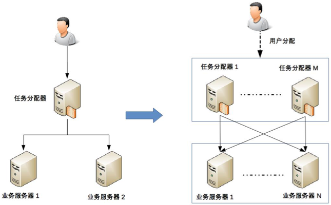
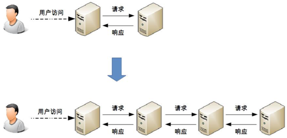
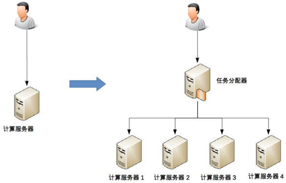
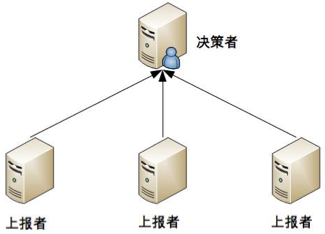
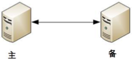
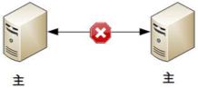
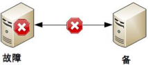
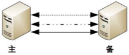
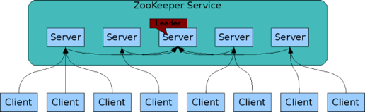

# 1. 架构到底是指什么

要想准确地回答这几个问题，关键在于梳理几个有关系而又相似的概念，包括：系统与子系统、模块与组件、框架与架构。系统与子系统。

## 1.1 系统和子系统

+ 系统：

> 系统泛指由一群有关联的个体组成，根据某种规则运作，能完成个别元件不能单独完成的工作的群体。它的意思是“总体”“整体”或“联盟”。

**关联** ：系统是由一群有关联的个体组成的，没有关联的个体堆在一起不能成为一个系统。例如，把一个发动机和一台 PC 放在一起不能称之为一个系统，把发动机、底盘、轮胎、车架组合起来才能成为一台汽车。

**规则** ：系统内的个体需要按照指定的规则运作，而不是单个个体各自为政。规则规定了系统内个体分工和协作的方式。例如，汽车发动机负责产生动力，然后通过变速器和传动轴，将动力输出到车轮上，从而驱动汽车前进。

**能力** ：系统能力与个体能力有本质的差别，系统能力不是个体能力之和，而是产生了新的能力。例如，汽车能够载重前进，而发动机、变速器、传动轴、车轮本身都不具备这样的能力。

+ 子系统

> 子系统也是由一群有关联的个体所组成的系统，多半会是更大系统中的一部分。

其实子系统的定义和系统定义是一样的，只是观察的角度有差异，一个系统可能是另外一个更大系统的子系统。

按照这个定义，系统和子系统比较容易理解。我们以微信为例来做一个分析。

微信本身是一个系统，包含聊天、登录、支付、朋友圈等子系统。

朋友圈这个系统又包括动态、评论、点赞等子系统。

评论这个系统可能又包括防刷子系统、审核子系统、发布子系统、存储子系统。

评论审核子系统不再包含业务意义上的子系统，而是包括各个模块或者组件，这些模块或者组件本身也是另外一个维度上的系统。例如，MySQL、Redis 等是存储系统，但不是业务子系统。

## 1.2 模块与组件

模块和组件

> 软件模块（Module）是一套一致而互相有紧密关连的软件组织。它分别包含了程序和数据结构两部分。现代软件开发往往利用模块作为合成的单位。模块的接口表达了由该模块提供的功能和调用它时所需的元素。模块是可能分开被编写的单位。这使它们可再用和允许人员同时协作、编写及研究不同的模块。软件组件定义为自包含的、可编程的、可重用的、与语言无关的软件单元，软件组件可以很容易被用于组装应用程序中。

模块和组件都是系统的组成部分，只是从不同的角度拆分系统而已。

## 1.3 框架与架构

框架与架构

> 软件框架（Software framework）通常指的是为了实现某个业界标准或完成特定基本任务的软件组件规范，也指为了实现某个软件组件规范时，提供规范所要求之基础功能的软件产品。

单纯从定义的角度来看，框架和架构的区别还是比较明显的，框架关注的是“规范”，架构关注的是“结构”。框架的英文是 Framework，架构的英文是 Architecture。Spring MVC 的英文文档标题就是“Web MVC framework”。

## 1.4 小结

架构是顶层设计；框架是面向编程或配置的半成品；组件是从技术维度上的复用；模块是从业务维度上职责的划分；系统是相互协同可运行的实体。

系统与子系统：系统是由一系列有关联，按特定规则组成的个体，并且产生新的能力，而系统与子系统则是观察的交角度不同

模块与组件：模块是从逻辑角度去看待，而组件是从物理角度去看待

框架与架构：框架是规范也是约束，可以理解为封闭性的话题，定义好，让别人如何去使用，而架构是一种结构，是一种开放性的话题，如何去设计组织架构，如何让架构更具有拓展性，减少沟通错误成本

# 2. 软件设计历史背景

软件开发最本质的挑战有两个:复杂和变更，而软件的价值是保证业务的响应力，而与之相对的是开发资源的有限，而各种的软件开发方法论，也都是在研究有限的资源下，如何应对着两个挑战，寻找平衡点，实现业务目标，因为是在寻找平衡点，就说明是有取舍的，所以就没有所谓的银弹的存在

变化才是唯一的不变，所以银弹不会存在

作者这个问题是否在考验，读者认真看了这篇文章没有？我认为文章的软件发展历史正是答案，软件工程归根结底是为各行各业的需求服务的，而随着需求的复杂度越来越高，用户的要求越来越高，软件也越复杂，形态也在不断变化，所以没有一种方法论能称得上是银弹，只能说某一种方法论适合某一种需求。这也正是架构师存在的意义，去选择合适的技术，如果有银弹，还要架构师干嘛！以上只是个人见解！

软件本身的复杂度难以度量，随时间和规模发展，原有的解决方案很快难适应，人们就不断总结经验模式和设计解决新困难的办法，但是不管什么样的架构设计都是在尽量满足适应我们可能遇到的问题的解决方案，不是解决问题方案。生活中我们的应用从单体到主备再到集群、分布式、微服务最后到最新的Service Mesh，这些其实都是解决和改善、完善、优化我们在软件开发遇到的问题。There is no silver bullet.

# 3. 架构设计的目的

## 3.1 内容

架构设计的主要目的是为了解决软件系统复杂度带来的问题。

有的放矢，而不是贪大求全。

## 3.2 小结

### 3.2.1 小结 01

架构是为了应对软件系统复杂度而提出的一个解决方案。个人感悟是:架构即(重要)决策，是在一个有约束的盒子里去求解或接近最合适的解。这个有约束的盒子是团队经验、成本、资源、进度、业务所处阶段等所编织、掺杂在一起的综合体(人，财，物，时间，事情等)。架构无优劣，但是存在恰当的架构用在合适的软件系统中，而这些就是决策的结果。

需求驱动架构。在分析设计阶段，需要考虑一定的人力与时间去"跳出代码，总揽全局"，为业务和IT技术之间搭建一座"桥梁"。

架构设计处于软件研制的前期，一方面，越是前期，如有问题，就能够越早发现，修改的代价也就越低；另外一方面，也意味着，软件实施后期若有架构上的修改，也需要付出更多的代价。

今日得到:

1 架构是为了应对软件系统复杂度而提出的一个解决方案。

2 架构即(重要)决策

3 需求驱动架构，架起分析与设计实现的桥梁

4 架构与开发成本的关系 

### 3.2.1 小结 02

我觉得做软件架构是为两件事服务的：业务架构和业务量级，这应该算是“软件系统复杂度带来问题”的具体化吧。

业务架构和业务量级都是从每个具体项目的实际应用场景中提炼出来的。

业务架构是对业务需求的提炼和抽象，开发软件必须要满足业务需求，否则就是空中楼阁。软件系统业务上的复杂度问题，可以从业务架构的角度切分工作交界面来解决。设计软件架构，首先是要保证能和业务架构对的上，这也是从业务逻辑转向代码逻辑的过程，所以软件架构的设计为开发指明了方向。另外架构设计也为接下来的开发工作分工奠定了基础。

业务量级表现在存储能力、吞吐能力和容错能力等，主要是软件运维期业务的复杂度。做软件架构设计，是要保证软件有能力托起它在业务量级上的要求的，如果软件到运行使用期废了，前面所有的工作都付诸东流了。不同的业务量级，对应的软件的架构复杂度是不同的，所以对于不同的项目，业务量级不同，架构设计也不同。

做业务架构必须与其面向的实际应用场景相匹配，由于每个产品或项目的业务场景均有所不同，所以每次做新的软件开发前，必须先设计软件架构，试图不经分析直接套用先前的架构方案，十有八九会让当前的系统在某个点上报出大问题导致推翻重来，更不要说直接拿别人的现成架构方案了。

所以每个软件在开发前，都要结合自己的应用场景设计适合自身的软件架构，现成的架构方案只能借鉴，不能直接套用。

另外，由于业务架构和业务量级也会不断调整或长大，软件架构也不是一劳永逸的，会随业务不断调整。

### 3.2.1 小结 03

架构是解决复杂度的问题。那么复杂度有很多不同的来源，比如人（不同的代码风格，不同的编程习惯），比如业务，比如技术。那么架构不可能面面俱到的解决所有问题，必须要分析出所面对的一个或几个关键的问题，这样架构的设计就能有落脚点，而且问题解决也不会有大的冲突。

架构设计在发展的不同阶段面临不同的问题，例如我们公司刚开始就做了业务拆分，后端是多个服务，前端一个站点，并且提供了一个服务互相调用的公共代理，现在主站越来越庞大，涵盖的业务越来越多，所以要做业务拆分，公共代理所包含的服务也越来越多，也要进行拆分。另外一个业务要调用多个服务，如何去监控调用链的完整性，这也需要解决。

所以架构本身在不同阶段集中解决几个最主要的问题，之后随着业务，技术，问题的不断变化，架构的重点也在不断调整。

# 4. 高性能

软件系统中高性能带来的复杂度主要体现在两方面，一方面是单台计算机内部为了高性能带来的复杂度；另一方面是多台计算机集群为了高性能带来的复杂度。

## 4.1 单机复杂度
操作系统和性能最相关的就是进程和线程。

最初的计算机是没有操作系统的，只有输入、计算和输出功能，用户输入一个命令，计算机完成操作，输出结果。但是由于人的输入的速度远远比不上计算机计算的速度，所以计算机大多数时间都是在等待用户输入新的指令，这样性能比较低效。

后来有了批处理操作系统，批处理就是先把要执行的指令预先写下来，纸带、磁带或者是磁盘等，形成一个指令清单，这就是一个任务清单，交给计算机去执行。批处理操作系统负责读取任务指令并执行指令，无需人工手动操作，提升了计算机的性能。

批处理解决了人工手动操作的问题，但是计算机每次却只能执行一个任务，如果某个任务需要从 IO 设备读取大量数据，那么在 IO 操作过程中，CPU 是空闲的，而这个空闲时间是可以用来做其他计算的。

所以有了进程，用进程来对应一个任务，每个任务都有自己独立的内存空间，进程之间互不相关，全部由操作系统来调度。此时 CPU 还没有多核多线程的概念，为了达到多进程并行运行的目的，采用了分时的方式，把 CPU 的时间分成很多片段，每个片段只能执行某个进程的指令。从操作系统和 CPU 的角度来看还是串行处理的，但是由于 CPU 处理速度很快，从用户的角度来看，感觉是多进程在并行处理。

虽然多进程里的每个进程由独立的内存空间，互不关联，但是对于用户来说，两个任务之间能够在运行的过程中就进行通信，会让任务设计变得更加灵活高效。否则两个任务不能通信，只能 A 进程存储，B 进程读取，效率低效，设计复杂。所以为了解决这个问题，进程通信的各种方式就被设计出来了，包括管道、消息队列、信号量、共享存储等。

多进程让多任务能够并行处理任务，但是他自身也有缺点，单个进程只能串行处理，而实际上很多进程内部的子项任务并不是严格按照时间顺序来执行的，也需要并行处理。为此，又发明了线程，线程是进程内部的子任务，但是这些子任务都共享同一份进程数据。为了保证数据的正确性，又发明了互斥锁的机制。有了多线程后，操作系统调度的最小单位就变成了线程，而进程变成了操作系统分配资源的最小单位。

多进程多线程虽然可以让多任务并行处理性能大大提升，但是本质上还是分时系统，并不能坐到时间上真正的并行。解决方式就是让多个 CPU 能够同时执行计算任务，从而实现真正意义上的多任务并行。目前有三种解决方案：SMP(SymmetricMulti-Processor, 对称多处理器结构)，NUMA(Non-Uniform Memory Access, 非一致存储访问结构)，MPP(Massive Parallel Processing, 海量并行处理结构)，其中 SMP 最常见，目前流行的多核处理器就是 SMP 方案。

## 4.2 集群的复杂度

通过大量机器来提升性能，并不仅仅是增加机器这么简单，让多台机器配合起来达到高性能的目的，是一个复杂的任务，

### 4.2.1 任务分配

任务分配的意思是指每台机器都可以处理完整的业务任务，不同的任务分配到不同的机器上执行。

**单台服务器到两台服务器**

我从最简单的一台服务器变两台服务器开始，来讲任务分配带来的复杂性，整体架构示意图如下。

从图中可以看到，1 台服务器演变为 2 台服务器后，架构上明显要复杂多了，主要体现在：

+ 需要增加一个任务分配器，这个分配器可能是硬件网络设备（例如，F5、交换机等），可能是软件网络设备（例如，LVS），也可能是负载均衡软件（例如，Nginx、HAProxy），还可能是自己开发的系统。选择合适的任务分配器也是一件复杂的事情，需要综合考虑性能、成本、可维护性、可用性等各方面的因素。

+ 任务分配器和真正的业务服务器之间有连接和交互（即图中任务分配器到业务服务器的连接线），需要选择合适的连接方式，并且对连接进行管理。例如，连接建立、连接检测、连接中断后如何处理等。

+ 任务分配器需要增加分配算法。例如，是采用轮询算法，还是按权重分配，又或者按照负载进行分配。如果按照服务器的负载进行分配，则业务服务器还要能够上报自己的状态给任务分配器。

**两台服务器到多台服务器**

这个架构比 2 台业务服务器的架构要复杂，主要体现在：

任务分配器从 1 台变成了多台（对应图中的任务分配器 1 到任务分配器 M），这个变化带来的复杂度就是需要将不同的用户分配到不同的任务分配器上（即图中的虚线“用户分配”部分），常见的方法包括 DNS 轮询、智能 DNS、CDN（Content Delivery Network，内容分发网络）、GSLB 设备（Global Server Load Balance，全局负载均衡）等。

任务分配器和业务服务器的连接从简单的“1 对多”（1 台任务分配器连接多台业务服务器）变成了“多对多”（多台任务分配器连接多台业务服务器）的网状结构。

机器数量从 3 台扩展到 30 台（一般任务分配器数量比业务服务器要少，这里我们假设业务服务器为 25 台，任务分配器为 5 台），状态管理、故障处理复杂度也大大增加。

### 4.2.2 任务分解
继续以上面“任务分配”中的架构为例，“业务服务器”如果越来越复杂，我们可以将其拆分为更多的组成部分，我以微信的后台架构为例。

那为何通过任务分解就能够提升性能呢？

**简单的系统更加容易做到高性能**

系统的功能越简单，影响性能的点就越少，就更加容易进行有针对性的优化。而系统很复杂的情况下，首先是比较难以找到关键性能点，因为需要考虑和验证的点太多；其次是即使花费很大力气找到了，修改起来也不容易，因为可能将 A 关键性能点提升了，但却无意中将 B 点的性能降低了，整个系统的性能不但没有提升，还有可能会下降。

**可以针对单个任务进行扩展**

当各个逻辑任务分解到独立的子系统后，整个系统的性能瓶颈更加容易发现，而且发现后只需要针对有瓶颈的子系统进行性能优化或者提升，不需要改动整个系统，风险会小很多。以微信的后台架构为例，如果用户数增长太快，注册登录子系统性能出现瓶颈的时候，只需要优化登录注册子系统的性能（可以是代码优化，也可以简单粗暴地加机器），消息逻辑、LBS 逻辑等其他子系统完全不需要改动。

虽然系统拆分可能在某种程度上能提升业务处理性能，但提升性能也是有限的，不可能系统不拆分的时候业务处理耗时为 50ms，系统拆分后业务处理耗时只要 1ms，因为最终决定业务处理性能的还是业务逻辑本身，业务逻辑本身没有发生大的变化下，理论上的性能是有一个上限的，系统拆分能够让性能逼近这个极限，但无法突破这个极限。因此，任务分解带来的性能收益是有一个度的，并不是任务分解越细越好，而对于架构设计来说，如何把握这个粒度就非常关键了。

# 5. 高可用

高性能增加机器目的在于“扩展”处理性能；高可用增加机器目的在于“冗余”处理单元。

高可用的双机架构和高性能的双机架构是一样的，因此复杂度也是类似的。
+ 需要增加一个任务分配器，选择合适的任务分配器也是一件复杂的事情，需要综合考虑性能、成本、可维护性、可用性等各方面因素。
+ 任务分配器和真正的业务服务器之间有连接和交互，需要选择合适的连接方式，并且对连接进行管理。例如，连接建立、连接检测、连接中断后如何处理等。
+ 任务分配器需要增加分配算法。例如，常见的双机算法有主备、主主，主备方案又可以细分为冷备、温备、热备。

这个高可用集群相比双机来说，分配算法更加复杂，可以是 1 主 3 备、2 主 2 备、3 主 1 备、4 主 0 备，具体应该采用哪种方式，需要结合实际业务需求来分析和判断，并不存在某种算法就一定优于另外的算法。例如，ZooKeeper 采用的就是 1 主多备，而 Memcached 采用的就是全主 0 备。

## 5.1 存储高可用

无论是正常情况下的传输延迟，还是异常情况下的传输中断，都会导致系统的数据在某个时间点或者时间段是不一致的，而数据的不一致又会导致业务问题；但如果完全不做冗余，系统的整体高可用又无法保证，所以 **存储高可用的难点不在于如何备份数据，而在于如何减少或者规避数据不一致对业务造成的影响。**

分布式领域里面有一个著名的 CAP 定理，从理论上论证了存储高可用的复杂度。也就是说，存储高可用不可能同时满足“一致性、可用性、分区容错性”，最多满足其中两个，这就要求我们在做架构设计时结合业务进行取舍。

## 5.2 高可用状态决策

无论是计算高可用还是存储高可用，其基础都是“状态决策”，即系统需要能够判断当前的状态是正常还是异常，如果出现了异常就要采取行动来保证高可用。如果状态决策本身都是有错误或者有偏差的，那么后续的任何行动和处理无论多么完美也都没有意义和价值。但在具体实践的过程中，恰好存在一个本质的矛盾： **通过冗余来实现的高可用系统，状态决策本质上就不可能做到完全正确。**

### 5.2.1 独裁式

独裁式决策指的是存在一个独立的决策主体，我们姑且称它为“决策者”，负责收集信息然后进行决策；所有冗余的个体，我们姑且称它为“上报者”，都将状态信息发送给决策者。

独裁式的决策方式不会出现决策混乱的问题，因为只有一个决策者，但问题也正是在于只有一个决策者。当决策者本身故障时，整个系统就无法实现准确的状态决策。如果决策者本身又做一套状态决策，那就陷入一个递归的死循环了。

### 5.2.2 协商式

协商式决策指的是两个独立的个体通过交流信息，然后根据规则进行决策， **最常用的协商式决策就是主备决策**。

这个架构的基本协商规则可以设计成：

+ 2 台服务器启动时都是备机。
+ 2 台服务器建立连接。
+ 2 台服务器交换状态信息。
+ 某 1 台服务器做出决策，成为主机；另一台服务器继续保持备机身份。

协商式决策的架构不复杂，规则也不复杂，其难点在于，如果两者的信息交换出现问题（比如主备连接中断），此时状态决策应该怎么做。

如果备机在连接中断的情况下认为主机故障，那么备机需要升级为主机，但实际上此时主机并没有故障，那么系统就出现了两个主机，这与设计初衷（1 主 1 备）是不符合的。

如果备机在连接中断的情况下不认为主机故障，则此时如果主机真的发生故障，那么系统就没有主机了，这同样与设计初衷（1 主 1 备）是不符合的。

如果为了规避连接中断对状态决策带来的影响，可以增加更多的连接。例如，双连接、三连接。这样虽然能够降低连接中断对状态带来的影响（注意：只能降低，不能彻底解决），但同时又引入了这几条连接之间信息取舍的问题，即如果不同连接传递的信息不同，应该以哪个连接为准？实际上这也是一个无解的答案，无论以哪个连接为准，在特定场景下都可能存在问题。

综合分析，协商式状态决策在某些场景总是存在一些问题的。

### 5.2.3 民主式

民主式决策指的是多个独立的个体通过投票的方式来进行状态决策。例如，ZooKeeper 集群在选举 leader 时就是采用这种方式。民主式决策和协商式决策比较类似，其基础都是独立的个体之间交换信息，每个个体做出自己的决策，然后按照“多数取胜”的规则来确定最终的状态。不同点在于民主式决策比协商式决策要复杂得多，ZooKeeper 的选举算法 Paxos，绝大部分人都看得云里雾里，更不用说用代码来实现这套算法了。

除了算法复杂，民主式决策还有一个固有的缺陷：脑裂。这个词来源于医学，指人体左右大脑半球的连接被切断后，左右脑因为无法交换信息，导致各自做出决策，然后身体受到两个大脑分别控制，会做出各种奇怪的动作。例如：当一个脑裂患者更衣时，他有时会一只手将裤子拉起，另一只手却将裤子往下脱。脑裂的根本原因是，原来统一的集群因为连接中断，造成了两个独立分隔的子集群，每个子集群单独进行选举，于是选出了 2 个主机，相当于人体有两个大脑了。

## 5.3 小节

### 5.3.1 01

需求驱动驱动；而高可用与高性能，是架构设计中两个非常重要的决策因素。因此，面对不同业务系统的不同需求，对高可用与高性能也会有不同的决策结论，其实现的复杂度也各不相同。支付宝业务，对于可用性和性能就会有很高的要求，在可用性方面希望能提供7＊24不间断服务，在高性能方面则希望能实时收付款；而对于一个学生管理系统，在可用性与性能方面就不一定要有多高的要求，比如晚上可关机，几秒内能查询到信息也可接受。为此，高可用性与高性能的复杂度讨论需要结合业务需求。

+ 1 WHAT - 什么是可用性？

定义可用性，可以先定义什么是不可用。需要经历若干环节，网站的页面才能呈现在最终的用户面前；而其中的任何一个环节出现了故障，都可能会导致网站的页面不可访问，也就是出现了网站不可用的情况。昨夜iOS版本QQ出现大面积闪退就是一个系统不可用的典型案例。

我们可以利用百分比来对网站可用性进行度量：

网站不可用时间=完成故障修复的时间点 - 故障发现的时间点

网站年度可用时间=年度总时间 - 网站不可用时间

网站年度可用性=(网站年度可用时间/年度总时间) x 100%

举例：一些知名大型网站的可用性可达到99.99%（俗称4个9），我们可以算一下一年下来留给处理故障的时间有多少？

年度总时间=365*24*60=525600分钟

网站不可用时间=525600*(1-99.99%)=52.56分钟

也就是，如果网站要达到4个9的可用性，一年下来网站不可用时间最多53分钟（也就是不足1个小时）。

可见，高可用性就是技术实力的象征，高可用性就是竞争力。

+ 2 WHY - 为什么会出现不可用？

硬件故障。网站多运行在普通的商用服务器，而这些服务器本身就不具备高可用性，再加之网站系统背后有数量众多服务器，那么一定时间内服务器宕机是大概率事件，直接导致部署在该服务器上的服务受影响。

软件BUG或网站更新升级发布。BUG不能消灭，只能减少；上线后的系统在运行过程中，难免会出现故障，而这些故障同样直接导致某些网站服务不可用；此外，网站更新升级发布也会引起相对较频繁的服务器宕机。

不可抗拒力。如地震、水灾、战争等。

+ 3 HOW - 如何做到高可用

核心思想：网站高可用的主要技术手段是服务与数据的冗余备份与失效转移。同一服务组件部署在多台服务器上；数据存储在多台服务器上互相备份。通过上述技术手段，当任何一台服务器宕机或出现各种不可预期的问题时，就将相应的服务切换到其他可用的服务器上，不影响系统的整体可用性，也不会导致数据丢失。

从架构角度看可用性：当前网站系统多采用经典的分层模型，从上到下为：应用层、服务层与数据层。应用层主要实现业务逻辑处理；服务层提供可复用的服务；数据层负责数据读写；在部署架构上常采用应用和数据分离部署，应用会部署到不同服务器上，这些服务器被称为应用层的服务器；这些可复用的服务也会各自部署在不同服务器上，称为服务层的服务器；而各类数据库系统、文件柜等数据则部署在数据层的服务器。

硬件故障方面引起不可用的技术解决措施：(1)应用服务器。可通过负载均衡设备将多个应用服务器构建为集群对外提供服务（前提是这些服务需要设计为无状态，即应用服务器不保存业务的上下文信息，而仅根据每次请求提交的数据进行业务逻辑的操作响应），当均衡设备通过心跳检测手段检测到应用服务器不可用时，则将其从集群中移除，并将请求切换到其他可用的应用服务上。(2)服务层服务器。这些服务器被应用层通过分布式服务框架（如Dubbo）访问，分布式服务框架可在应用层客户端程序中实现软件负载均衡，并通过服务注册中心提供服务的服务器进行心跳检测，当发现有服务器不可用时，立即通知客户端程序修改服务列表，同时移除响应的服务器。(3)数据服务器。需要在数据写入时进行数据同步复制，将数据写入多台服务器上，实现数据冗余备份；当数据服务器宕机时，应用程序将访问切换到有备份数据的服务器上。

软件方面引起不可用的技术解决措施：通过软件开发过程进行质量保证。通过预发布验证、严格测试、灰度发布等手段，尽量减少上线服务的故障。

# 6. 可扩展性
可扩展性指系统为了应对将来需求变化而提供的一种扩展能力，当有新的需求出现时，系统不需要或者仅需要少量修改就可以支持，无须整个系统重构或者重建。

**正确预测变化、完美封装变化**

+ 预测变化的复杂性在于：
    + 不能每个设计点都考虑可扩展性。
    + 不能完全不考虑可扩展性。
    + 所有的预测都存在出错的可能性。
+ 系统需要拆分出变化层和稳定层
+ 需要设计变化层和稳定层之间的接口

## 6.1 小结

1 What：什么是架构的可扩展性？

业务需求、运行环境方面的变化都会导致软件系统发生变化，而这种软件系统对上述变化的适应能力就是可扩展性。

可扩展性可以理解为是一种从功能需求方面考虑的软件属性，属性就会存在好坏之分。

按照可扩展性的定义，一个具备良好可扩展性的架构设计应当符合开闭原则：对扩展开放，对修改关闭。衡量一个软件系统具备良好可扩展性主要表现但不限于：（1）软件自身内部方面。在软件系统实现新增的业务功能时，对现有系统功能影响较少，即不需要对现有功能作任何改动或者很少改动。（2）软件外部方面。软件系统本身与其他存在协同关系的外部系统之间存在松耦合关系，软件系统的变化对其他软件系统无影响，其他软件系统和功能不需要进行改动。反之，则是一个可扩展性不好的软件系统。

2 Why：为什么要求架构具备良好的可扩展性？

伴随业务的发展、创新，运行环境的变化，对技术也就提出了更多、更高的要求。能够快速响应上述变化，并最大程度降低对现有系统的影响，是设计可扩展性好的架构的主要目的。

3 How：如何设计可扩展性好的架构？

面向对象思想、设计模式都是为了解决可扩展性的而出现的方法与技术。

设计具备良好可扩展性的系统，有两个思考角度：（1）从业务维度。对业务深入理解，对可预计的业务变化进行预测。（2）从技术维度。利用扩展性好的技术，实现对变化的封装。

(1)在业务维度。对业务深入理解，对业务的发展方向进行预判，也就是不能完全不考虑可扩展性；但是，变化无处不在，在业务看得远一点的同时，需要注意:警惕过度设计；不能每个设计点都考虑可扩展性；所有的预测都存在不正确的可能性。

(2)在技术维度。预测变化是一回事，采取什么方案来应对变化，又是另外一个复杂的事情。即使预测很准确，如果方案不合适，则系统扩展一样很麻烦。第一种应对变化的常见方案是将“变化”封装在一个“变化层”，将不变的部分封装在一个独立的“稳定层”。第二种常见的应对变化的方案是提炼出一个“抽象层”和一个“实现层”。

4.在实际工作场景中的解决方案
在实际软件系统架构设计中，常通过以下技术手段实现良好的可扩展性:（1）使用分布式服务(框架)构建可复用的业务平台。（2）使用分布式消息队列降低业务模块间的耦合性。

(1)分布式服务框架
利用分布式服务框架(如Dubbo)可以将业务逻辑实现和可复用组件服务分离开，通过接口降低子系统或模块间的耦合性。新增功能时，可以通过调用可复用的组件实现自身的业务逻辑，而对现有系统没有任何影响。可复用组件升级变更的时候，可以提供多版本服务对应用实现透明升级，对现有应用不会造成影响。

(2) 分布式消息队列
基于生产者-消费者编程模式，利用分布式消息队列(如RabbitMQ)将用户请求、业务请求作为消息发布者将事件构造成消息发布到消息队列，消息的订阅者作为消费者从消息队列中获取消息进行处理。通过这种方式将消息生产和消息处理分离开来，可以透明地增加新的消息生产者任务或者新的消息消费者任务。
