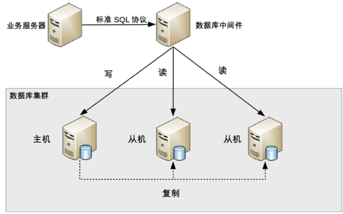
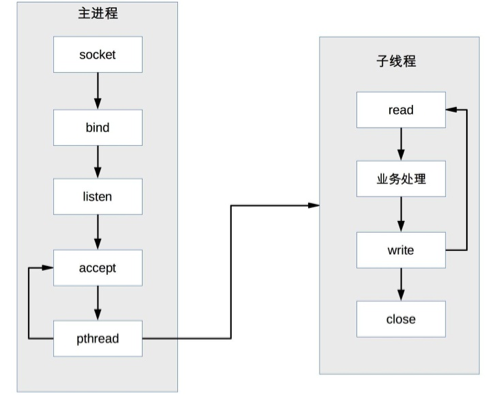

# 1. 数据库读写分离

读写分离的基本原理是将数据库读写操作分散到不同的节点上

## 1.1 读写分离的基本实现
+ 数据库服务器搭建主从集群，一主一从、一主多从都可以。
+ 数据库主机负责读写操作，从机只负责读操作。
+ 数据库主机通过复制将数据同步到从机，每台数据库服务器都存储了所有的业务数据。
+ 业务服务器将写操作发给数据库主机，将读操作发给数据库从机。

## 1.2 主从复制延迟

以 MySQL 为例，主从复制延迟可能达到 1 秒，如果有大量数据同步，延迟 1 分钟也是有可能的。主从复制延迟会带来一个问题：如果业务服务器将数据写入到数据库主服务器后立刻（1 秒内）进行读取，此时读操作访问的是从机，主机还没有将数据复制过来，到从机读取数据是读不到最新数据的，业务上就可能出现问题。

**解决方法**

+ 写操作后的读操作指定发给数据库主服务器。缺点是和业务强行绑定，对业务的侵入和影响较大，新人容易引起 bug。
+ 读从机失败后再读主机，二次读取和业务无绑定，仅需要对访问数据库的 API 进行封装，代价小。缺点在于增加主机的读操作压力。
+ 关键业务读写操作全部指向主机，非关键业务采用读写分离。比如登录业务采用主机读写操作，修改个人信息采用读写分离操作。

## 1.3 分配机制

将读写操作区分开来，然后访问不同的数据库服务器，一般有两种方式：程序代码封装和中间件封装。

### 1.3.1 程序代码封装
程序代码封装指在代码中抽象一个数据访问层（所以有的文章也称这种方式为“中间层封装”），实现读写操作分离和数据库服务器连接的管理。例如，基于 Hibernate 进行简单封装，就可以实现读写分离，基本架构是：

程序代码封装的方式具备几个特点：

+ 实现简单，而且可以根据业务做较多定制化的功能。
+ 每个编程语言都需要自己实现一次，无法通用，如果一个业务包含多个编程语言写的多个子系统，则重复开发的工作量比较大。
+ 故障情况下，如果主从发生切换，则可能需要所有系统都修改配置并重启。

### 1.3.2 中间件封装

中间件封装指的是独立一套系统出来，实现读写操作分离和数据库服务器连接的管理。中间件对业务服务器提供 SQL 兼容的协议，业务服务器无须自己进行读写分离。对于业务服务器来说，访问中间件和访问数据库没有区别，事实上在业务服务器看来，中间件就是一个数据库服务器。其基本架构是：

数据库中间件的方式具备的特点是：

+ 能够支持多种编程语言，因为数据库中间件对业务服务器提供的是标准 SQL 接口。
+ 数据库中间件要支持完整的 SQL 语法和数据库服务器的协议（例如，MySQL 客户端和服务器的连接协议），实现比较复杂，细节特别多，很容易出现 bug，需要较长的时间才能稳定。
+ 数据库中间件自己不执行真正的读写操作，但所有的数据库操作请求都要经过中间件，中间件的性能要求也很高。
+ 数据库主从切换对业务服务器无感知，数据库中间件可以探测数据库服务器的主从状态。例如，向某个测试表写入一条数据，成功的就是主机，失败的就是从机。

由于数据库中间件的复杂度要比程序代码封装高出一个数量级，一般情况下建议采用程序语言封装的方式，或者使用成熟的开源数据库中间件。如果是大公司，可以投入人力去实现数据库中间件，因为这个系统一旦做好，接入的业务系统越多，节省的程序开发投入就越多，价值也越大。

目前的开源数据库中间件方案中，MySQL 官方先是提供了 MySQL Proxy，但 MySQL Proxy 一直没有正式 GA，现在 MySQL 官方推荐 MySQL Router。MySQL Router 的主要功能有读写分离、故障自动切换、负载均衡、连接池等，其基本架构如下：

## 1.4 小结

### 1.4.1 01

读写分离适用单机并发无法支撑并且读的请求更多的情形。在单机数据库情况下，表上加索引一般对查询有优化作用却影响写入速度，读写分离后可以单独对读库进行优化，写库上减少索引，对读写的能力都有提升，且读的提升更多一些。

不适用的情况:

1 如果并发写入特别高，单机写入无法支撑，就不适合这种模式。

2 通过缓存技术或者程序优化能够满足要求

# 2. 数据库分库分表

读写分离分散了数据库读写操作的压力，但没有分散存储压力，当数据量达到千万甚至上亿条的时候，单台数据库服务器的存储能力会成为系统的瓶颈，主要体现在这几个方面：

+ 数据量太大，读写的性能会下降，即使有索引，索引也会变得很大，性能同样会下降。
+ 数据文件会变得很大，数据库备份和恢复需要耗费很长时间。
+ 据文件越大，极端情况下丢失数据的风险越高（例如，机房火灾导致数据库主备机都发生故障）。

基于上述原因，单个数据库服务器存储的数据量不能太大，需要控制在一定的范围内。为了满足业务数据存储的需求，就需要将存储分散到多台数据库服务器上。

常见的分散存储的方法 **分库分表**，包括分库和分表两大类。

## 2.1 业务分库

**业务分库指的是按照业务模块将数据分散到不同的数据库服务器。**

虽然业务分库能够分散存储和访问压力，但同时也带来了新的问题。

+ join 操作问题

业务分库后，原本在同一个数据库中的表分散到不同数据库中，导致无法使用 SQL 的 join 查询。

+ 事务问题

原本在同一个数据库中不同的表可以在同一个事务中修改，业务分库后，表分散到不同的数据库中，无法通过事务统一修改。虽然数据库厂商提供了一些分布式事务的解决方案（例如，MySQL 的 XA），但性能实在太低，与高性能存储的目标是相违背的。

+ 成本问题

业务分库同时也带来了成本的代价，本来 1 台服务器搞定的事情，现在要 3 台，如果考虑备份，那就是 2 台变成了 6 台。

## 2.2 小公司初创业务，不建议一开始就这样拆分业务分库

+ 初创业务存在很大的不确定性，业务不一定能发展起来，业务开始的时候并没有真正的存储和访问压力，业务分库并不能为业务带来价值。
+ 业务分库后，表之间的 join 查询、数据库事务无法简单实现了。
+ 业务分库后，因为不同的数据要读写不同的数据库，代码中需要增加根据数据类型映射到不同数据库的逻辑，增加了工作量。而业务初创期间最重要的是快速实现、快速验证，业务分库会拖慢业务节奏。

**如果业务真的发展很快，岂不是很快就又要进行业务分库了？那为何不一开始就设计好呢？**

+ 首先，这里的“如果”事实上发生的概率比较低，做 10 个业务有 1 个业务能活下去就很不错了，更何况快速发展，和中彩票的概率差不多。如果我们每个业务上来就按照淘宝、微信的规模去做架构设计，不但会累死自己，还会害死业务。
+ 其次，如果业务真的发展很快，后面进行业务分库也不迟。因为业务发展好，相应的资源投入就会加大，可以投入更多的人和更多的钱，那业务分库带来的代码和业务复杂的问题就可以通过增加人来解决，成本问题也可以通过增加资金来解决。
+ 第三，单台数据库服务器的性能其实也没有想象的那么弱，一般来说，单台数据库服务器能够支撑 10 万用户量量级的业务，初创业务从 0 发展到 10 万级用户，并不是想象得那么快。

## 2.3 分表

将不同业务数据分散存储到不同的数据库服务器，能够支撑百万甚至千万用户规模的业务，但如果业务继续发展，同一业务的单表数据也会达到单台数据库服务器的处理瓶颈。

单表数据拆分有两种方式：**垂直分表** 和 **水平分表**。

为了形象地理解垂直拆分和水平拆分的区别，可以想象你手里拿着一把刀，面对一个蛋糕切一刀：

+ 从上往下切就是垂直切分，因为刀的运行轨迹与蛋糕是垂直的，这样可以把蛋糕切成高度相等（面积可以相等也可以不相等）的两部分，对应到表的切分就是表记录数相同但包含不同的列。例如，示意图中的垂直切分，会把表切分为两个表，一个表包含 ID
、name、age、sex 列，另外一个表包含 ID、nickname、description 列。
+ 从左往右切就是水平切分，因为刀的运行轨迹与蛋糕是平行的，这样可以把蛋糕切成面积相等（高度可以相等也可以不相等）的两部分，对应到表的切分就是表的列相同但包含不同的行数据。例如，示意图中的水平切分，会把表分为两个表，两个表都包含 ID
、name、age、sex、nickname、description 列，但是一个表包含的是 ID 从 1 到 999999 的行数据，另一个表包含的是 ID 从 1000000 到 9999999 的行数据。

实际架构设计过程中并不局限切分的次数，可以切两次，也可以切很多次，就像切蛋糕一样，可以切很多刀。

单表进行切分后，是否要将切分后的多个表分散在不同的数据库服务器中，可以根据实际的切分效果来确定，并不强制要求单表切分为多表后一定要分散到不同数据库中。原因在于单表切分为多表后，新的表即使在同一个数据库服务器中，也可能带来可观的性能提升，如果性能能够满足业务要求，是可以不拆分到多台数据库服务器的，毕竟我们在上面业务分库的内容看到业务分库也会引入很多复杂性的问题；如果单表拆分为多表后，单台服务器依然无法满足性能要求，那就不得不再次进行业务分库的设计了。

分表能够有效地分散存储压力和带来性能提升，但和分库一样，也会引入各种复杂性。

### 2.3.1 垂直分表

垂直分表适合将表中某些不常用且占了大量空间的列拆分出去。例如，前面示意图中的 nickname 和 description 字段，假设我们是一个婚恋网站，用户在筛选其他用户的时候，主要是用 age 和 sex 两个字段进行查询，而 nickname 和 description 两个字段主要用于展示，一般不会在业务查询中用到。description 本身又比较长，因此我们可以将这两个字段独立到另外一张表中，这样在查询 age 和 sex 时，就能带来一定的性能提升。

垂直分表引入的复杂性主要体现在表操作的数量要增加。例如，原来只要一次查询就可以获取 name、age、sex、nickname、description，现在需要两次查询，一次查询获取 name、age、sex，另外一次查询获取 nickname、description。

### 2.3.2 水平分表

水平分表适合表行数特别大的表，有的公司要求单表行数超过 5000 万就必须进行分表，这个数字可以作为参考，但并不是绝对标准，关键还是要看表的访问性能。对于一些比较复杂的表，可能超过 1000 万就要分表了；而对于一些简单的表，即使存储数据超过 1 亿行，也可以不分表。但不管怎样，当看到表的数据量达到千万级别时，作为架构师就要警觉起来，因为这很可能是架构的性能瓶颈或者隐患。

水平分表相比垂直分表，会引入更多的复杂性，主要表现在下面几个方面：

+ 路由

水平分表后，某条数据具体属于哪个切分后的子表，需要增加路由算法进行计算，这个算法会引入一定的复杂性。

**常见的路由算法有：**

**范围路由：** 选取有序的数据列（例如，整形、时间戳等）作为路由的条件，不同分段分散到不同的数据库表中。以最常见的用户 ID 为例，路由算法可以按照 1000000 的范围大小进行分段，1 ~ 999999 放到数据库 1 的表中，1000000 ~ 1999999 放到数据库 2 的表中，以此类推。

范围路由设计的复杂点主要体现在分段大小的选取上，分段太小会导致切分后子表数量过多，增加维护复杂度；分段太大可能会导致单表依然存在性能问题，一般建议分段大小在 100 万至 2000 万之间，具体需要根据业务选取合适的分段大小。

**范围路由的优点是可以随着数据的增加平滑地扩充新的表。**

范围路由的一个比较隐含的缺点是分布不均匀，假如按照 1000 万来进行分表，有可能某个分段实际存储的数据量只有 1000 条，而另外一个分段实际存储的数据量有 900 万条。

**Hash 路由：** 选取某个列（或者某几个列组合也可以）的值进行 Hash 运算，然后根据 Hash 结果分散到不同的数据库表中。同样以用户 ID 为例，假如我们一开始就规划了 10 个数据库表，路由算法可以简单地用 user_id % 10 的值来表示数据所属的数据库表编号，ID 为 985 的用户放到编号为 5 的子表中，ID 为 10086 的用户放到编号为 6 的字表中。

Hash 路由设计的复杂点主要体现在初始表数量的选取上，表数量太多维护比较麻烦，表数量太少又可能导致单表性能存在问题。而用了 Hash 路由后，增加字表数量是非常麻烦的，所有数据都要重分布。

Hash 路由的优缺点和范围路由基本相反，Hash 路由的优点是表分布比较均匀，缺点是扩充新的表很麻烦，所有数据都要重分布。

**配置路由：** 配置路由就是路由表，用一张独立的表来记录路由信息。同样以用户 ID 为例，我们新增一张 user_router 表，这个表包含 user_id 和 table_id 两列，根据 user_id 就可以查询对应的 table_id。

配置路由设计简单，使用起来非常灵活，尤其是在扩充表的时候，只需要迁移指定的数据，然后修改路由表就可以了。

配置路由的缺点就是必须多查询一次，会影响整体性能；而且路由表本身如果太大（例如，几亿条数据），性能同样可能成为瓶颈，如果我们再次将路由表分库分表，则又面临一个死循环式的路由算法选择问题。

### 2.3.3 水平分表带来的问题

+ **join 操作** ，水平分表后，数据分散在多个表中，如果需要与其他表进行 join 查询，需要在业务代码或者数据库中间件中进行多次 join 查询，然后将结果合并。

+ **count() 操作** ，水平分表后，虽然物理上数据分散到多个表中，但某些业务逻辑上还是会将这些表当作一个表来处理。例如，获取记录总数用于分页或者展示，水平分表前用一个 count() 就能完成的操作，在分表后就没那么简单了。

常见的处理方式有下面两种：

**count() 相加** ：具体做法是在业务代码或者数据库中间件中对每个表进行 count() 操作，然后将结果相加。这种方式实现简单，缺点就是性能比较低。例如，水平分表后切分为 20 张表，则要进行 20 次 count (*) 操作，如果串行的话，可能需要几秒钟才能得到结果。

**记录数表**：具体做法是新建一张表，假如表名为“记录数表”，包含 table_name、row_count 两个字段，每次插入或者删除子表数据成功后，都更新“记录数表”。

这种方式获取表记录数的性能要大大优于 count() 相加的方式，因为只需要一次简单查询就可以获取数据。缺点是复杂度增加不少，对子表的操作要同步操作“记录数表”，如果有一个业务逻辑遗漏了，数据就会不一致；且针对“记录数表”的操作和针对子表的操作无法放在同一事务中进行处理，异常的情况下会出现操作子表成功了而操作记录数表失败，同样会导致数据不一致。

此外，记录数表的方式也增加了数据库的写压力，因为每次针对子表的 insert 和 delete 操作都要 update 记录数表，所以对于一些不要求记录数实时保持精确的业务，也可以通过后台定时更新记录数表。定时更新实际上就是“count() 相加”和“记录数表”的结合，即定时通过 count() 相加计算表的记录数，然后更新记录数表中的数据。

**+ order by 操作** ，水平分表后，数据分散到多个子表中，排序操作无法在数据库中完成，只能由业务代码或者数据库中间件分别查询每个子表中的数据，然后汇总进行排序。

## 2.4 分库分表的问题解决方案

+ 做硬件优化，例如从机械硬盘改成使用固态硬盘，当然固态硬盘不适合服务器使用，只是举个例子
+ 先做数据库服务器的调优操作，例如增加索引，oracle有很多的参数调整;
+ 引入缓存技术，例如Redis，减少数据库压力
+ 程序与数据库表优化，重构，例如根据业务逻辑对程序逻辑做优化，减少不必要的查询;
+ 在这些操作都不能大幅度优化性能的情况下，不能满足将来的发展，再考虑分库分表，也要有预估性

# 3. 高性能的 NoSQL

ACID，是指数据库管理系统（DBMS）在写入或更新资料的过程中，为保证事务（transaction）是正确可靠的，所必须具备的四个特性：原子性（atomicity，或称不可分割性）、一致性（consistency）、隔离性（isolation，又称独立性）、持久性（durability）。

在数据库系统中，一个事务是指：由一系列数据库操作组成的一个完整的逻辑过程。

## 3.1 关系型数据库的缺点
+ 关系数据库存储的是行记录，无法存储数据结构
+ 关系数据库的 schema 扩展很不方便
+ 关系数据库在大数据场景下 I/O 较高
+ 关系数据库的全文搜索功能比较弱

NoSQL 方案带来的优势，本质上是牺牲 ACID 中的某个或者某几个特性，因此我们不能盲目地迷信 NoSQL 是银弹，而应该将 NoSQL 作为 SQL 的一个有力补充。

## 3.2 常见的 NoSQL 方案
+ K-V 存储：解决关系数据库无法存储数据结构的问题，以 Redis 为代表。
+ 文档数据库：解决关系数据库强 schema 约束的问题，以 MongoDB 为代表。
+ 列式数据库：解决关系数据库大数据场景下的 I/O 问题，以 HBase 为代表。
 + 全文搜索引擎：解决关系数据库的全文搜索性能问题，以 Elasticsearch 为代表。

## 3.3 K-V 存储

K-V 存储的全称是 Key-Value 存储，其中 Key 是数据的标识，和关系数据库中的主键含义一样，Value 就是具体的数据。

Redis 是 K-V 存储的典型代表，它是一款开源（基于 BSD 许可）的高性能 K-V 缓存和存储系统。Redis 的 Value 是具体的数据结构，包括 string、hash、list、set、sorted set、bitmap 和 hyperloglog，所以常常被称为数据结构服务器。

Redis 的缺点主要体现在并不支持完整的 ACID 事务，Redis 虽然提供事务功能，但 Redis 的事务和关系数据库的事务不可同日而语，Redis 的事务只能保证隔离性和一致性（I 和 C），无法保证原子性和持久性（A 和 D）。

虽然 Redis 并没有严格遵循 ACID 原则，但实际上大部分业务也不需要严格遵循 ACID 原则。以上面的微博关注操作为例，即使系统没有将 A 加入 B 的粉丝列表，其实业务影响也非常小，因此我们在设计方案时，需要根据业务特性和要求来确定是否可以用 Redis，而不能因为 Redis 不遵循 ACID 原则就直接放弃。

## 3.4 文档数据库

为了解决关系数据库 schema 带来的问题，文档数据库应运而生。文档数据库最大的特点就是 no-schema，可以存储和读取任意的数据。目前绝大部分文档数据库存储的数据格式是 JSON（或者 BSON），因为 JSON 数据是自描述的，无须在使用前定义字段，读取一个 JSON 中不存在的字段也不会导致 SQL 那样的语法错误。

**优势**
+ 新增字段简单：业务上增加新的字段，无须再像关系数据库一样要先执行 DDL 语句修改表结构，程序代码直接读写即可。
+ 历史数据不会出错：对于历史数据，即使没有新增的字段，也不会导致错误，只会返回空值，此时代码进行兼容处理即可。
+ 可以很容易存储复杂数据

**文档数据库 no-schema 的特性带来的这些优势也是有代价的，最主要的代价就是不支持事务。**

使用 MongoDB 来存储商品库存，系统创建订单的时候首先需要减扣库存，然后再创建订单。这是一个事务操作，用关系数据库来实现就很简单，但如果用 MongoDB 来实现，就无法做到事务性。异常情况下可能出现库存被扣减了，但订单没有创建的情况。因此某些对事务要求严格的业务场景是不能使用文档数据库的。

**文档数据库另外一个缺点就是无法实现关系数据库的 join 操作。**

例如，我们有一个用户信息表和一个订单表，订单表中有买家用户 id。如果要查询“购买了苹果笔记本用户中的女性用户”，用关系数据库来实现，一个简单的 join 操作就搞定了；而用文档数据库是无法进行 join 查询的，需要查两次：一次查询订单表中购买了苹果笔记本的用户，然后再查询这些用户哪些是女性用户。

## 3.5 列式数据库

列式数据库就是按照列来存储数据的数据库，与之对应的传统关系数据库被称为“行式数据库”，因为关系数据库是按照行来存储数据的。

能够一次性完成对一行中的多个列的写操作，保证了针对行数据写操作的原子性和一致性；否则如果采用列存储，可能会出现某次写操作，有的列成功了，有的列失败了，导致数据不一致。

行式存储的优势是在特定的业务场景下才能体现，如果不存在这样的业务场景，那么行式存储的优势也将不复存在，甚至成为劣势，典型的场景就是海量数据进行统计。

除了节省 I/O，列式存储还具备更高的存储压缩比，能够节省更多的存储空间。普通的行式数据库一般压缩率在 3:1 到 5:1 左右，而列式数据库的压缩率一般在 8:1 到 30:1 左右，因为单个列的数据相似度相比行来说更高，能够达到更高的压缩率。

如果场景发生变化，列式存储的优势又会变成劣势。典型的场景是需要频繁地更新多个列。因为列式存储将不同列存储在磁盘上不连续的空间，导致更新多个列时磁盘是随机写操作；而行式存储时同一行多个列都存储在连续的空间，一次磁盘写操作就可以完成，列式存储的随机写效率要远远低于行式存储的写效率。此外，列式存储高压缩率在更新场景下也会成为劣势，因为更新时需要将存储数据解压后更新，然后再压缩，最后写入磁盘。

基于上述列式存储的优缺点，一般将列式存储应用在离线的大数据分析和统计场景中，因为这种场景主要是针对部分列单列进行操作，且数据写入后就无须再更新删除。

## 3.6 全文搜索引擎

传统的关系型数据库通过索引来达到快速查询的目的，但是在全文搜索的业务场景下，索引也无能为力，主要体现在：
+ 全文搜索的条件可以随意排列组合，如果通过索引来满足，则索引的数量会非常多。
+ 全文搜索的模糊匹配方式，索引无法满足，只能用 like 查询，而 like 查询是整表扫描，效率非常低。

+ 全文搜索基本原理

全文搜索引擎的技术原理被称为“倒排索引”（Inverted index），也常被称为反向索引、置入档案或反向档案，是一种索引方法，其基本原理是建立单词到文档的索引。之所以被称为“倒排”索引，是和“正排“索引相对的，“正排索引”的基本原理是建立文档到单词的索引。我们通过一个简单的样例来说明这两种索引的差异。

正排索引适用于根据文档名称来查询文档内容。

倒排索引适用于根据关键词来查询文档内容。

+ 全文搜索的使用方式

全文搜索引擎的索引对象是单词和文档，而关系数据库的索引对象是键和行，两者的术语差异很大，不能简单地等同起来。因此，为了让全文搜索引擎支持关系型数据的全文搜索，需要做一些转换操作，即将关系型数据转换为文档数据。

目前常用的转换方式是将关系型数据按照对象的形式转换为 JSON 文档，然后将 JSON 文档输入全文搜索引擎进行索引。

全文搜索引擎能够基于 JSON 文档建立全文索引，然后快速进行全文搜索。以 Elasticsearch 为例，其索引基本原理如下：

> Elastcisearch 是分布式的文档存储方式。它能存储和检索复杂的数据结构——序列化成为 JSON 文档——以实时的方式。

> 在 Elasticsearch 中，每个字段的所有数据都是默认被索引的。即每个字段都有为了快速检索设置的专用倒排索引。而且，不像其他多数的数据库，它能在相同的查询中使用所有倒排索引，并以惊人的速度返回结果。

## 3.7 软件系统分类
+ 管理型系统，如运营类系统，首选关系型。
+ 大流量系统，如电商单品页的某个服务，后台选关系型，前台选内存型。
+ 日志型系统，原始数据选列式，日志搜索选倒排索引。
+ 搜索型系统，指站内搜索，非通用搜索，如商品搜索，后台选关系型，前台选倒排索引。
+ 事务型系统，如库存、交易、记账，选关系型+缓存+一致性协议，或新型关系数据库。
+ 离线计算，如大量数据分析，首选列式，关系型也可以。
+ 实时计算，如实时监控，可以选时序数据库，或列式数据库。

# 4. 高性能缓存架构

虽然我们可以通过各种手段来提升存储系统的性能，但在某些复杂的业务场景下，单纯依靠存储系统的性能提升不够的，典型的场景有：

+ 需要经过复杂运算后得出的数据，存储系统无能为力
+ 读多写少的数据，存储系统有心无力

缓存就是为了弥补存储系统在这些复杂业务场景下的不足，其基本原理是将可能重复使用的数据放到内存中，一次生成、多次使用，避免每次使用都去访问存储系统。

缓存能够带来性能的大幅提升，以 Memcache 为例，单台 Memcache 服务器简单的 key-value 查询能够达到 TPS 50000 以上，其基本的架构是：

缓存虽然能够大大减轻存储系统的压力，但同时也给架构引入了更多复杂性。架构设计时如果没有针对缓存的复杂性进行处理，某些场景下甚至会导致整个系统崩溃。

## 4.1 缓存穿透

缓存穿透是指缓存没有发挥作用，业务系统虽然去缓存查询数据，但缓存中没有数据，业务系统需要再次去存储系统查询数据。通常情况下有两种情况：

+ 存储数据不存在

第一种情况是被访问的数据确实不存在。一般情况下，如果存储系统中没有某个数据，则不会在缓存中存储相应的数据，这样就导致用户查询的时候，在缓存中找不到对应的数据，每次都要去存储系统中再查询一遍，然后返回数据不存在。缓存在这个场景中并没有起到分担存储系统访问压力的作用。

通常情况下，业务上读取不存在的数据的请求量并不会太大，但如果出现一些异常情况，例如被黑客攻击，故意大量访问某些读取不存在数据的业务，有可能会将存储系统拖垮。

这种情况的解决办法比较简单，如果查询存储系统的数据没有找到，则直接设置一个默认值（可以是空值，也可以是具体的值）存到缓存中，这样第二次读取缓存时就会获取到默认值，而不会继续访问存储系统。

+ 缓存数据生成耗费大量时间或者资源

第二种情况是存储系统中存在数据，但生成缓存数据需要耗费较长时间或者耗费大量资源。如果刚好在业务访问的时候缓存失效了，那么也会出现缓存没有发挥作用，访问压力全部集中在存储系统上的情况。

典型的就是电商的商品分页，假设我们在某个电商平台上选择“手机”这个类别查看，由于数据巨大，不能把所有数据都缓存起来，只能按照分页来进行缓存，由于难以预测用户到底会访问哪些分页，因此业务上最简单的就是每次点击分页的时候按分页计算和生成缓存。通常情况下这样实现是基本满足要求的，但是如果被竞争对手用爬虫来遍历的时候，系统性能就可能出现问题。

**具体的场景有：**

a: 分页缓存的有效期设置为 1 天，因为设置太长时间的话，缓存不能反应真实的数据。

b: 通常情况下，用户不会从第 1 页到最后 1 页全部看完，一般用户访问集中在前 10 页，因此第 10 页以后的缓存过期失效的可能性很大。

c: 竞争对手每周来爬取数据，爬虫会将所有分类的所有数据全部遍历，从第 1 页到最后 1 页全部都会读取，此时很多分页缓存可能都失效了。

d: 由于很多分页都没有缓存数据，从数据库中生成缓存数据又非常耗费性能（order by limit 操作），因此爬虫会将整个数据库全部拖慢。

这种情况并没有太好的解决方案，因为爬虫会遍历所有的数据，而且什么时候来爬取也是不确定的，可能是每天都来，也可能是每周，也可能是一个月来一次，我们也不可能为了应对爬虫而将所有数据永久缓存。通常的应对方案要么就是识别爬虫然后禁止访问，但这可能会影响 SEO 和推广；要么就是做好监控，发现问题后及时处理，因为爬虫不是攻击，不会进行暴力破坏，对系统的影响是逐步的，监控发现问题后有时间进行处理。

## 4.2 缓存雪崩

缓存雪崩是指当缓存失效（过期）后引起系统性能急剧下降的情况。当缓存过期被清除后，业务系统需要重新生成缓存，因此需要再次访问存储系统，再次进行运算，这个处理步骤耗时几十毫秒甚至上百毫秒。而对于一个高并发的业务系统来说，几百毫秒内可能会接到几百上千个请求。由于旧的缓存已经被清除，新的缓存还未生成，并且处理这些请求的线程都不知道另外有一个线程正在生成缓存，因此所有的请求都会去重新生成缓存，都会去访问存储系统，从而对存储系统造成巨大的性能压力。这些压力又会拖慢整个系统，严重的会造成数据库宕机，从而形成一系列连锁反应，造成整个系统崩溃。

缓存雪崩的常见解决方法有两种：**更新锁机制** 和 **后台更新机制**。

+ 更新锁

对缓存更新操作进行加锁保护，保证只有一个线程能够进行缓存更新，未能获取更新锁的线程要么等待锁释放后重新读取缓存，要么就返回空值或者默认值。

对于采用分布式集群的业务系统，由于存在几十上百台服务器，即使单台服务器只有一个线程更新缓存，但几十上百台服务器一起算下来也会有几十上百个线程同时来更新缓存，同样存在雪崩的问题。因此分布式集群的业务系统要实现更新锁机制，需要用到分布式锁，如 ZooKeeper。

+ 后台更新

由后台线程来更新缓存，而不是由业务线程来更新缓存，缓存本身的有效期设置为永久，后台线程定时更新缓存。

后台定时机制需要考虑一种特殊的场景，当缓存系统内存不够时，会“踢掉”一些缓存数据，从缓存被“踢掉”到下一次定时更新缓存的这段时间内，业务线程读取缓存返回空值，而业务线程本身又不会去更新缓存，因此业务上看到的现象就是数据丢了。

**解决的方式有两种：**

后台线程除了定时更新缓存，还要频繁地去读取缓存（例如，1 秒或者 100 毫秒读取一次），如果发现缓存被“踢了”就立刻更新缓存，这种方式实现简单，但读取时间间隔不能设置太长，因为如果缓存被踢了，缓存读取间隔时间又太长，这段时间内业务访问都拿不到真正的数据而是一个空的缓存值，用户体验一般。

业务线程发现缓存失效后，通过消息队列发送一条消息通知后台线程更新缓存。可能会出现多个业务线程都发送了缓存更新消息，但其实对后台线程没有影响，后台线程收到消息后更新缓存前可以判断缓存是否存在，存在就不执行更新操作。这种方式实现依赖消息队列，复杂度会高一些，但缓存更新更及时，用户体验更好。

## 4.3 缓存热点

**缓存热点的解决方案就是复制多份缓存副本，将请求分散到多个缓存服务器上，减轻缓存热点导致的单台缓存服务器压力。**

缓存副本设计有一个细节需要注意，就是不同的缓存副本不要设置统一的过期时间，否则就会出现所有缓存副本同时生成同时失效的情况，从而引发缓存雪崩效应。正确的做法是设定一个过期时间范围，不同的缓存副本的过期时间是指定范围内的随机值。

## 4.4 问题
### 4.4.1 经常我说到缓存的时候，面试官问我，数据库自身不是有缓存吗，标准答案是怎么回击他?

仅限mysql：
+  mysql第一种缓存叫sql语句结果缓存，但条件比较苛刻，程序员不可控，我们的dba线上都关闭这个功能，具体实现可以查一下
+  mysql第二种缓存是innodb buffer pool，缓存的是磁盘上的分页数据，不是sql的查询结果，sql的执行过程省不了。而mc，redis这些实际上都是缓存sql的结果，两种缓存方式，性能差很远。

因此，可控性，性能是数据库缓存和独立缓存的主要区别。

# 5. 但服务器高性能模式：PPC 与 TPC

高性能是每个程序员的追求，无论我们是做一个系统还是写一行代码，都希望能够达到高性能的效果，而高性能又是最复杂的一环，磁盘、操作系统、CPU、内存、缓存、网络、编程语言、架构等，每个都有可能影响系统达到高性能，一行不恰当的 debug 日志，就可能将服务器的性能从 TPS 30000 降低到 8000；一个 tcp_nodelay 参数，就可能将响应时间从 2 毫秒延长到 40 毫秒。因此，要做到高性能计算是一件很复杂很有挑战的事情，软件系统开发过程中的不同阶段都关系着高性能最终是否能够实现。

高性能架构设计主要集中在两方面：

+ 尽量提升单服务器的性能，将单服务器的性能发挥到极致。
+ 如果单服务器无法支撑性能，设计服务器集群方案。

单服务器高性能的关键之一就是 **服务器采取的并发模型**

+ 服务器如何管理连接。
+ 服务器如何处理请求。

以上两个设计点最终都和操作系统的 I/O 模型及进程模型相关。

+ I/O 模型：阻塞、非阻塞、同步、异步。
+ 进程模型：单进程、多进程、多线程。

## 5.1 PPC

PPC 是 Process Per Connection 的缩写，其含义是指每次有新的连接就新建一个进程去专门处理这个连接的请求，这是传统的 UNIX 网络服务器所采用的模型。

+ 父进程接受连接（图中 accept）。
+ 父进程“fork”子进程（图中 fork）。
+ 子进程处理连接的读写请求（图中子进程 read、业务处理、write）。
+ 子进程关闭连接（图中子进程中的 close）。

父进程“fork”子进程后，直接调用了 close，看起来好像是关闭了连接，其实只是将连接的文件描述符引用计数减一，真正的关闭连接是等子进程也调用 close 后，连接对应的文件描述符引用计数变为 0 后，操作系统才会真正关闭连接，更多细节请参考《UNIX 网络编程：卷一》。

PPC 模式实现简单，比较适合服务器的连接数没那么多的情况，例如数据库服务器。对于普通的业务服务器，在互联网兴起之前，由于服务器的访问量和并发量并没有那么大，这种模式其实运作得也挺好，世界上第一个 web 服务器 CERN httpd 就采用了这种模式（具体你可以参考https://en.wikipedia.org/wiki/CERN_httpd）。互联网兴起后，服务器的并发和访问量从几十剧增到成千上万，这种模式的弊端就凸显出来了，主要体现在这几个方面：

+ fork 代价高：站在操作系统的角度，创建一个进程的代价是很高的，需要分配很多内核资源，需要将内存映像从父进程复制到子进程。即使现在的操作系统在复制内存映像时用到了 Copy on Write（写时复制）技术，总体来说创建进程的代价还是很大的。
+ 父子进程通信复杂：父进程“fork”子进程时，文件描述符可以通过内存映像复制从父进程传到子进程，但“fork”完成后，父子进程通信就比较麻烦了，需要采用 IPC（Interprocess Communication）之类的进程通信方案。例如，子进程需要在 close 之前告诉父进程自己处理了多少个请求以支撑父进程进行全局的统计，那么子进程和父进程必须采用 IPC 方案来传递信息。
+ 支持的并发连接数量有限：如果每个连接存活时间比较长，而且新的连接又源源不断的进来，则进程数量会越来越多，操作系统进程调度和切换的频率也越来越高，系统的压力也会越来越大。因此，一般情况下，PPC 方案能处理的并发连接数量最大也就几百。

## 5.2 prefork

prefork 就是提前创建进程（pre-fork）。系统在启动的时候就预先创建好进程，然后才开始接受用户的请求，当有新的连接进来的时候，就可以省去 fork 进程的操作，让用户访问更快、体验更好。

prefork 的实现关键就是多个子进程都 accept 同一个 socket，当有新的连接进入时，操作系统保证只有一个进程能最后 accept 成功。但这里也存在一个小小的问题：“惊群”现象，就是指虽然只有一个子进程能 accept 成功，但所有阻塞在 accept 上的子进程都会被唤醒，这样就导致了不必要的进程调度和上下文切换了。幸运的是，操作系统可以解决这个问题，例如 Linux 2.6 版本后内核已经解决了 accept 惊群问题。

prefork 模式和 PPC 一样，还是存在父子进程通信复杂、支持的并发连接数量有限的问题，因此目前实际应用也不多。Apache 服务器提供了 MPM prefork 模式，推荐在需要可靠性或者与旧软件兼容的站点时采用这种模式，默认情况下最大支持 256 个并发连接。

## 5.3 TPC

TPC 是 Thread Per Connection 的缩写，其含义是指每次有新的连接就新建一个线程去专门处理这个连接的请求。与进程相比，线程更轻量级，创建线程的消耗比进程要少得多；同时多线程是共享进程内存空间的，线程通信相比进程通信更简单。因此，TPC 实际上是解决或者弱化了 PPC fork 代价高的问题和父子进程通信复杂的问题。

+ 父进程接受连接（图中 accept）。
+ 父进程创建子线程（图中 pthread）。
+ 子线程处理连接的读写请求（图中子线程 read、业务处理、write）。
+ 子线程关闭连接（图中子线程中的 close）。

和 PPC 相比，主进程不用“close”连接了。原因是在于子线程是共享主进程的进程空间的，连接的文件描述符并没有被复制，因此只需要一次 close 即可。

+ 创建线程虽然比创建进程代价低，但并不是没有代价，高并发时（例如每秒上万连接）还是有性能问题。
+ 无须进程间通信，但是线程间的互斥和共享又引入了复杂度，可能一不小心就导致了死锁问题。
+ 多线程会出现互相影响的情况，某个线程出现异常时，可能导致整个进程退出（例如内存越界）。

## 5.4 prethread

TPC 模式中，当连接进来时才创建新的线程来处理连接请求，虽然创建线程比创建进程要更加轻量级，但还是有一定的代价，而 prethread 模式就是为了解决这个问题。

和 prefork 类似，prethread 模式会预先创建线程，然后才开始接受用户的请求，当有新的连接进来的时候，就可以省去创建线程的操作，让用户感觉更快、体验更好。

由于多线程之间数据共享和通信比较方便，因此实际上 prethread 的实现方式相比 prefork 要灵活一些，常见的实现方式有下面几种：

+ 主进程 accept，然后将连接交给某个线程处理。
+ 子线程都尝试去 accept，最终只有一个线程 accept 成功。

Apache 服务器的 MPM worker 模式本质上就是一种 prethread 方案，但稍微做了改进。Apache 服务器会首先创建多个进程，每个进程里面再创建多个线程，这样做主要是为了考虑稳定性，即：即使某个子进程里面的某个线程异常导致整个子进程退出，还会有其他子进程继续提供服务，不会导致整个服务器全部挂掉。

prethread 理论上可以比 prefork 支持更多的并发连接，Apache 服务器 MPM worker 模式默认支持 16 × 25 = 400 个并发处理线程。

# 6. 单服务器高性能模式：Reactor与Proactor

## 6.1 Reactor

PPC 模式最主要的问题就是每个连接都要创建进程（为了描述简洁，这里只以 PPC 和进程为例，实际上换成 TPC 和线程，原理是一样的），连接结束后进程就销毁了，这样做其实是很大的浪费。为了解决这个问题，一个自然而然的想法就是资源复用，即不再单独为每个连接创建进程，而是创建一个进程池，将连接分配给进程，一个进程可以处理多个连接的业务。

引入资源池的处理方式后，会引出一个新的问题：进程如何才能高效地处理多个连接的业务？当一个连接一个进程时，进程可以采用“read -> 业务处理 -> write”的处理流程，如果当前连接没有数据可以读，则进程就阻塞在 read 操作上。这种阻塞的方式在一个连接一个进程的场景下没有问题，但如果一个进程处理多个连接，进程阻塞在某个连接的 read 操作上，此时即使其他连接有数据可读，进程也无法去处理，很显然这样是无法做到高性能的。

解决这个问题的最简单的方式是将 read 操作改为非阻塞，然后进程不断地轮询多个连接。这种方式能够解决阻塞的问题，但解决的方式并不优雅。首先，轮询是要消耗 CPU 的；其次，如果一个进程处理几千上万的连接，则轮询的效率是很低的。

为了能够更好地解决上述问题，很容易可以想到，只有当连接上有数据的时候进程才去处理，这就是 I/O 多路复用技术的来源。

**I/O 多路复用技术归纳起来有两个关键实现点**

+ 当多条连接共用一个阻塞对象后，进程只需要在一个阻塞对象上等待，而无须再轮询所有连接，常见的实现方式有 select、epoll、kqueue 等。
+ 当某条连接有新的数据可以处理时，操作系统会通知进程，进程从阻塞状态返回，开始进行业务处理。

I/O 多路复用结合线程池，完美地解决了 PPC 和 TPC 的问题，而且“大神们”给它取了一个很牛的名字：Reactor
 ，中文是“反应堆”。联想到“核反应堆”，听起来就很吓人，实际上这里的“反应”不是聚变、裂变反应的意思，而是 **“事件反应”** 的意思，可以通俗地理解为“来了一个事件我就有相应的反应”，这里的“我”就是 Reactor ，具体的反应就是我们写的代码，Reactor 会根据事件类型来调用相应的代码进行处理。Reactor 模式也叫 Dispatcher 模式（在很多开源的系统里面会看到这个名称的类，其实就是实现 Reactor 模式的），更加贴近模式本身的含义，即 I/O 多路复用统一监听事件，收到事件后分配（Dispatch）给某个进程。

Reactor 模式的核心组成部分包括 Reactor 和处理资源池（进程池或线程池），其中 Reactor 负责监听和分配事件，处理资源池负责处理事件。初看 Reactor 的实现是比较简单的，但实际上结合不同的业务场景，Reactor 模式的具体实现方案灵活多变，主要体现在：

+ Reactor 的数量可以变化：可以是一个 Reactor，也可以是多个 Reactor。
+ 资源池的数量可以变化：以进程为例，可以是单个进程，也可以是多个进程（线程类似）。

// TODO 完全看不懂

# 7. 高性能负载均衡：分类及架构

高性能集群的本质很简单，通过增加更多的服务器来提升系统整体的计算能力。由于计算本身存在一个特点：同样的输入数据和逻辑，无论在哪台服务器上执行，都应该得到相同的输出。因此高性能集群设计的复杂度主要体现在任务分配这部分，需要设计合理的任务分配策略，将计算任务分配到多台服务器上执行。

**高性能集群的复杂性主要体现在需要增加一个任务分配器，以及为任务选择一个合适的任务分配算法。**

任务分配并不只是考虑计算单元的负载均衡，不同的任务分配算法目标是不一样的，有的基于负载考虑，有的基于性能（吞吐量、响应时间）考虑，有的基于业务考虑。考虑到“负载均衡”已经成为了事实上的标准术语，这里我也用“负载均衡”来代替“任务分配”， **负载均衡不只是为了计算单元的负载达到均衡状态。**

## 7.1 负载均衡分类

常见的负载均衡系统包括 3 种：DNS 负载均衡、硬件负载均衡和软件负载均衡。

组合的基本原则为：

DNS 负载均衡用于实现地理级别的负载均衡；

硬件负载均衡用于实现集群级别的负载均衡；

软件负载均衡用于实现机器级别的负载均衡。

### 7.1.1 DNS 负载均衡

DNS 是最简单也是最常见的负载均衡方式，一般用来实现地理级别的均衡。

DNS 负载均衡的本质是 DNS 解析同一个域名可以返回不同的 IP 地址。

DNS 负载均衡实现简单、成本低，但也存在粒度太粗、负载均衡算法少等缺点。仔细分析一下优缺点。

+ 优点：
    + 简单、成本低：负载均衡工作交给 DNS 服务器处理，无须自己开发或者维护负载均衡设备。
    + 就近访问，提升访问速度：DNS 解析时可以根据请求来源 IP，解析成距离用户最近的服务器地址，可以加快访问速度，改善性能。
+ 缺点：
    + 更新不及时：DNS 缓存的时间比较长，修改 DNS 配置后，由于缓存的原因，还是有很多用户会继续访问修改前的 IP，这样的访问会失败，达不到负载均衡的目的，并且也影响用户正常使用业务。
    + 扩展性差：DNS 负载均衡的控制权在域名商那里，无法根据业务特点针对其做更多的定制化功能和扩展特性。
    + 分配策略比较简单：DNS 负载均衡支持的算法少；不能区分服务器的差异（不能根据系统与服务的状态来判断负载）；也无法感知后端服务器的状态。

针对 DNS 负载均衡的一些缺点，对于时延和故障敏感的业务，有一些公司自己实现了 HTTP-DNS 的功能，即使用 HTTP 协议实现一个私有的 DNS 系统。这样的方案和通用的 DNS 优缺点正好相反。

### 7.1.2 硬件负载均衡

硬件负载均衡是通过单独的硬件设备来实现负载均衡功能，这类设备和路由器、交换机类似，可以理解为一个用于负载均衡的基础网络设备。

目前业界典型的硬件负载均衡设备有两款：F5 和 A10。这类设备性能强劲、功能强大，但价格都不便宜，一般只有“土豪”公司才会考虑使用此类设备。普通业务量级的公司一是负担不起，二是业务量没那么大，用这些设备也是浪费。

+ 优点：
    + 功能强大：全面支持各层级的负载均衡，支持全面的负载均衡算法，支持全局负载均衡。
    + 性能强大：对比一下，软件负载均衡支持到 10 万级并发已经很厉害了，硬件负载均衡可以支持 100 万以上的并发。
    + 稳定性高：商用硬件负载均衡，经过了良好的严格测试，经过大规模使用，稳定性高。
    + 支持安全防护：硬件均衡设备除具备负载均衡功能外，还具备防火墙、防 DDoS 攻击等安全功能。
+ 缺点：
    + 价格昂贵：最普通的一台 F5 就是一台“马 6”，好一点的就是“Q7”了。
    + 扩展能力差：硬件设备，可以根据业务进行配置，但无法进行扩展和定制。

### 7.1.3 软件负载均衡

软件负载均衡通过负载均衡软件来实现负载均衡功能，常见的有 Nginx 和 LVS，其中 Nginx 是软件的 7 层负载均衡，LVS 是 Linux 内核的 4 层负载均衡。4 层和 7 层的区别就在于协议和灵活性，Nginx 支持 HTTP、E-mail 协议；而 LVS 是 4 层负载均衡，和协议无关，几乎所有应用都可以做，例如，聊天、数据库等。

软件和硬件的最主要区别就在于性能，硬件负载均衡性能远远高于软件负载均衡性能。Ngxin 的性能是万级，一般的 Linux 服务器上装一个 Nginx 大概能到 5 万 / 秒；LVS 的性能是十万级，据说可达到 80 万 / 秒；而 F5 性能是百万级，从 200 万 / 秒到 800 万 / 秒都有

+ 优点：
    + 简单：无论是部署还是维护都比较简单。
    + 便宜：只要买个 Linux 服务器，装上软件即可。
    + 灵活：4 层和 7 层负载均衡可以根据业务进行选择；也可以根据业务进行比较方便的扩展，例如，可以通过 Nginx 的插件来实现业务的定制化功能。
+ 缺点：
    + 性能一般：一个 Nginx 大约能支撑 5 万并发。
    + 功能没有硬件负载均衡那么强大。
    + 一般不具备防火墙和防 DDoS 攻击等安全功能。

## 7.2 负载均衡典型架构

# 8. 高性能负载均衡：算法

负载均衡算法数量较多，而且可以根据一些业务特性进行定制开发，抛开细节上的差异，根据算法期望达到的目的，大体上可以分为下面几类。

[微信红包百亿级的高并发资金交易系统设计方案](https://www.infoq.cn/article/2017hongbao-weixin)

+ 任务平分类：负载均衡系统将收到的任务平均分配给服务器进行处理，这里的“平均”可以是绝对数量的平均，也可以是比例或者权重上的平均。
+ 负载均衡类：负载均衡系统根据服务器的负载来进行分配，这里的负载并不一定是通常意义上我们说的“CPU 负载”，而是系统当前的压力，可以用 CPU 负载来衡量，也可以用连接数、I/O 使用率、网卡吞吐量等来衡量系统的压力。
+ 性能最优类：负载均衡系统根据服务器的响应时间来进行任务分配，优先将新任务分配给响应最快的服务器。
+ Hash 类：负载均衡系统根据任务中的某些关键信息进行 Hash 运算，将相同 Hash 值的请求分配到同一台服务器上。常见的有源地址 Hash、目标地址 Hash、session id hash、用户 ID Hash 等。

## 8.1 轮询

负载均衡系统收到请求后，按照顺序轮流分配到服务器上。轮询是最简单的一个策略，无须关注服务器本身的状态。

需要注意的是负载均衡系统无须关注“服务器本身状态”，这里的关键词是“本身”。也就是说，只要服务器在运行，运行状态是不关注的。但如果服务器直接宕机了，或者服务器和负载均衡系统断连了，这时负载均衡系统是能够感知的，也需要做出相应的处理。

## 8.2 加权轮询

负载均衡系统根据服务器权重进行任务分配，这里的权重一般是根据硬件配置进行静态配置的，采用动态的方式计算会更加契合业务，但复杂度也会更高。

加权轮询是轮询的一种特殊形式，其主要目的就是为了解决不同服务器处理能力有差异的问题。例如，集群中有新的机器是 32 核的，老的机器是 16 核的，那么理论上我们可以假设新机器的处理能力是老机器的 2 倍，负载均衡系统就可以按照 2:1 的比例分配更多的任务给新机器，从而充分利用新机器的性能。

加权轮询解决了轮询算法中无法根据服务器的配置差异进行任务分配的问题，但同样存在无法根据服务器的状态差异进行任务分配的问题。

## 8.3 负载最低优先

负载均衡系统将任务分配给当前负载最低的服务器，这里的负载根据不同的任务类型和业务场景，可以用不同的指标来衡量。

+ LVS 这种 4 层网络负载均衡设备，可以以“连接数”来判断服务器的状态，服务器连接数越大，表明服务器压力越大。
+ Nginx 这种 7 层网络负载系统，可以以“HTTP 请求数”来判断服务器状态（Nginx 内置的负载均衡算法不支持这种方式，需要进行扩展）。
+ 如果我们自己开发负载均衡系统，可以根据业务特点来选择指标衡量系统压力。如果是 CPU 密集型，可以以“CPU 负载”来衡量系统压力；如果是 I/O 密集型，可以以“I/O 负载”来衡量系统压力。

**负载最低优先的算法解决了轮询算法中无法感知服务器状态的问题，由此带来的代价是复杂度要增加很多。例如：**

最少连接数优先的算法要求负载均衡系统统计每个服务器当前建立的连接，其应用场景仅限于负载均衡接收的任何连接请求都会转发给服务器进行处理，否则如果负载均衡系统和服务器之间是固定的连接池方式，就不适合采取这种算法。例如，LVS 可以采取这种算法进行负载均衡，而一个通过连接池的方式连接 MySQL 集群的负载均衡系统就不适合采取这种算法进行负载均衡。

CPU 负载最低优先的算法要求负载均衡系统以某种方式收集每个服务器的 CPU 负载，而且要确定是以 1 分钟的负载为标准，还是以 15 分钟的负载为标准，不存在 1 分钟肯定比 15 分钟要好或者差。不同业务最优的时间间隔是不一样的，时间间隔太短容易造成频繁波动，时间间隔太长又可能造成峰值来临时响应缓慢。

负载最低优先算法基本上能够比较完美地解决轮询算法的缺点，因为采用这种算法后，负载均衡系统需要感知服务器当前的运行状态。当然，其代价是复杂度大幅上升。通俗来讲，轮询可能是 5 行代码就能实现的算法，而负载最低优先算法可能要 1000 行才能实现，甚至需要负载均衡系统和服务器都要开发代码。负载最低优先算法如果本身没有设计好，或者不适合业务的运行特点，算法本身就可能成为性能的瓶颈，或者引发很多莫名其妙的问题。所以负载最低优先算法虽然效果看起来很美好，但实际上真正应用的场景反而没有轮询（包括加权轮询）那么多。

## 8.4 性能最优类

负载最低优先类算法是站在服务器的角度来进行分配的，而性能最优优先类算法则是站在客户端的角度来进行分配的，优先将任务分配给处理速度最快的服务器，通过这种方式达到最快响应客户端的目的。

和负载最低优先类算法类似，性能最优优先类算法本质上也是感知了服务器的状态，只是通过响应时间这个外部标准来衡量服务器状态而已。因此性能最优优先类算法存在的问题和负载最低优先类算法类似，复杂度都很高，主要体现在：

+ 负载均衡系统需要收集和分析每个服务器每个任务的响应时间，在大量任务处理的场景下，这种收集和统计本身也会消耗较多的性能。
+ 为了减少这种统计上的消耗，可以采取采样的方式来统计，即不统计所有任务的响应时间，而是抽样统计部分任务的响应时间来估算整体任务的响应时间。采样统计虽然能够减少性能消耗，但使得复杂度进一步上升，因为要确定合适的采样率，采样率太低会导致结果不准确，采样率太高会导致性能消耗较大，找到合适的采样率也是一件复杂的事情。
+ 无论是全部统计还是采样统计，都需要选择合适的周期：是 10 秒内性能最优，还是 1 分钟内性能最优，还是 5
 分钟内性能最优……没有放之四海而皆准的周期，需要根据实际业务进行判断和选择，这也是一件比较复杂的事情，甚至出现系统上线后需要不断地调优才能达到最优设计。

## 8.5 Hash 类

负载均衡系统根据任务中的某些关键信息进行 Hash 运算，将相同 Hash 值的请求分配到同一台服务器上，这样做的目的主要是为了满足特定的业务需求。

+ 源地址 Hash

将来源于同一个源 IP 地址的任务分配给同一个服务器进行处理，适合于存在事务、会话的业务。但需要保证用户在会话存在期间，每次都能访问到同一个服务器，这种业务场景就可以用源地址 Hash 来实现。

+ ID Hash

将某个 ID 标识的业务分配到同一个服务器中进行处理，这里的 ID 一般是临时性数据的 ID（如 session id）。

# 9. CAP理论

**对于设计分布式系统的架构师来说，CAP 是必须掌握的理论。**

CAP 定理（CAP theorem）又被称作布鲁尔定理（Brewer's theorem），是加州大学伯克利分校的计算机科学家埃里克·布鲁尔（Eric Brewer）在 2000 年的 ACM PODC 上提出的一个猜想。2002 年，麻省理工学院的赛斯·吉尔伯特（Seth Gilbert）和南希·林奇（Nancy Lynch）发表了布鲁尔猜想的证明，使之成为分布式计算领域公认的一个定理。

对于一个分布式计算系统，不可能同时满足一致性（Consistence）、可用性（Availability）、分区容错性（Partition Tolerance）三个设计约束。

在一个分布式系统（指互相连接并共享数据的节点的集合）中，当涉及读写操作时，只能保证一致性（Consistence）、可用性（Availability）、分区容错性（Partition Tolerance）三者中的两个，另外一个必须被牺牲。

## 9.1 CAP 理论
+ 一致性（Consistency）

所有节点在同一时刻都能看到相同的数据。

对某个指定的客户端来说，读操作保证能够返回最新的写操作结果。

+ 可用性（Availability）

每个请求都能得到成功或者失败的响应。

非故障的节点在合理的时间内返回合理的响应（不是错误和超时的响应）。

+ 分区容忍性（Partition Tolerance）

出现消息丢失或者分区错误时系统能够继续运行。

当出现网络分区后，系统能够继续“履行职责”。

## 9.2 CAP 应用

虽然 CAP 理论定义是三个要素中只能取两个，但放到分布式环境下来思考，我们会发现必须选择 P（分区容忍）要素，因为网络本身无法做到 100% 可靠，有可能出故障，所以分区是一个必然的现象。如果我们选择了 CA 而放弃了 P，那么当发生分区现象时，为了保证 C，系统需要禁止写入，当有写入请求时，系统返回 error（例如，当前系统不允许写入），这又和 A 冲突了，因为 A 要求返回 no error 和 no timeout。因此，分布式系统理论上不可能选择 CA 架构，只能选择 CP 或者 AP 架构。

+ CP - Consistency/Partition Tolerance
+ AP - Availability/Partition Tolerance

## 9.3 CAP 关键细节点

+ CAP 关注的粒度是数据，而不是整个系统。

**C 与 A 之间的取舍可以在同一系统内以非常细小的粒度反复发生，而每一次的决策可能因为具体的操作，乃至因为牵涉到特定的数据或用户而有所不同。**

这句话是理解和应用 CAP 理论非常关键的一点。CAP 理论的定义和解释中，用的都是 system、node 这类系统级的概念，这就给很多人造成了很大的误导，认为我们在进行架构设计时，整个系统要么选择 CP，要么选择 AP。但在实际设计过程中，每个系统不可能只处理一种数据，而是包含多种类型的数据，有的数据必须选择 CP，有的数据必须选择 AP。而如果我们做设计时，从整个系统的角度去选择 CP 还是 AP，就会发现顾此失彼，无论怎么做都是有问题的。

所以在 CAP 理论落地实践时，我们需要将系统内的数据按照不同的应用场景和要求进行分类，每类数据选择不同的策略（CP 还是 AP），而不是直接限定整个系统所有数据都是同一策略。

+ CAP 是忽略网络延迟的。

这是一个非常隐含的假设，布鲁尔在定义一致性时，并没有将延迟考虑进去。也就是说，当事务提交时，数据能够瞬间复制到所有节点。但实际情况下，从节点 A 复制数据到节点 B，总是需要花费一定时间的。如果是相同机房，耗费时间可能是几毫秒；如果是跨地域的机房，例如北京机房同步到广州机房，耗费的时间就可能是几十毫秒。这就意味着，CAP 理论中的 C 在实践中是不可能完美实现的，在数据复制的过程中，节点 A 和节点 B 的数据并不一致。

不要小看了这几毫秒或者几十毫秒的不一致，对于某些严苛的业务场景，例如和金钱相关的用户余额，或者和抢购相关的商品库存，技术上是无法做到分布式场景下完美的一致性的。而业务上必须要求一致性，因此单个用户的余额、单个商品的库存，理论上要求选择 CP 而实际上 CP 都做不到，只能选择 CA。也就是说，只能单点写入，其他节点做备份，无法做到分布式情况下多点写入。

**正常运行情况下，不存在 CP 和 AP 的选择，可以同时满足 CA。**

CAP 理论告诉我们分布式系统只能选择 CP 或者 AP，但其实这里的前提是系统发生了“分区”现象。如果系统没有发生分区现象，也就是说 P 不存在的时候（节点间的网络连接一切正常），我们没有必要放弃 C 或者 A，应该 C 和 A 都可以保证，这就要求架构设计的时候既要考虑分区发生时选择 CP 还是 AP，也要考虑分区没有发生时如何保证 CA。

**放弃并不等于什么都不做，需要为分区恢复后做准备。**

CAP 理论告诉我们三者只能取两个，需要“牺牲”（sacrificed）另外一个，这里的“牺牲”是有一定误导作用的，因为“牺牲”让很多人理解成什么都不做。实际上，CAP 理论的“牺牲”只是说在分区过程中我们无法保证 C 或者 A，但并不意味着什么都不做。因为在系统整个运行周期中，大部分时间都是正常的，发生分区现象的时间并不长。

## 9.4 ACID
+ Atomicity（原子性）一个事务中的所有操作，要么全部完成，要么全部不完成，不会在中间某个环节结束。事务在执行过程中发生错误，会被回滚到事务开始前的状态，就像这个事务从来没有执行过一样。
+ Consistency（一致性）在事务开始之前和事务结束以后，数据库的完整性没有被破坏。
+ Isolation（隔离性）数据库允许多个并发事务同时对数据进行读写和修改的能力。隔离性可以防止多个事务并发执行时由于交叉执行而导致数据的不一致。事务隔离分为不同级别，包括读未提交（Read uncommitted）、读提交（read committed）、可重复读（repeatable read）和串行化（Serializable）。
+ Durability（持久性）事务处理结束后，对数据的修改就是永久的，即便系统故障也不会丢失。

## 9.5 BASE

BASE 是指基本可用（Basically Available）、软状态（ Soft State）、最终一致性（ Eventual Consistency），核心思想是即使无法做到强一致性（CAP 的一致性就是强一致性），但应用可以采用适合的方式达到最终一致性。

+ 基本可用（Basically Available）分布式系统在出现故障时，允许损失部分可用性，即保证核心可用。
+ 软状态（Soft State）允许系统存在中间状态，而该中间状态不会影响系统整体可用性。这里的中间状态就是 CAP 理论中的数据不一致。
+ 最终一致性（Eventual Consistency）系统中的所有数据副本经过一定时间后，最终能够达到一致的状态。

CAP 理论是忽略延时的，而实际应用中延时是无法避免的。

AP 方案中牺牲一致性只是指分区期间，而不是永远放弃一致性。

