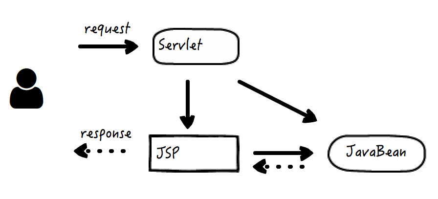
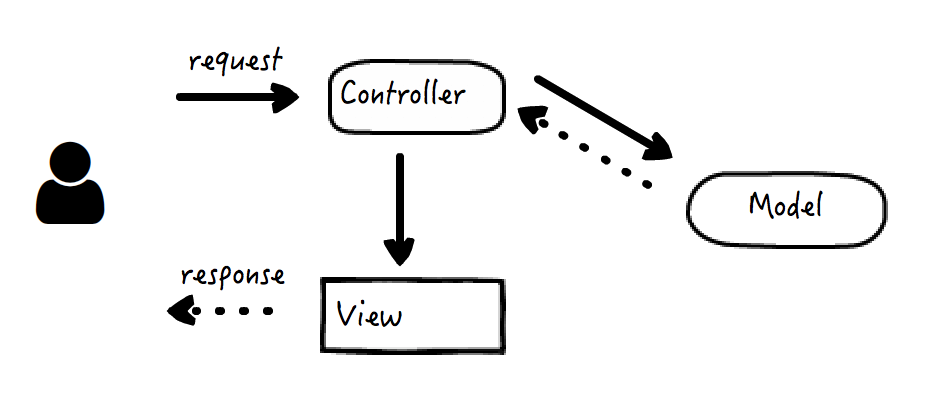
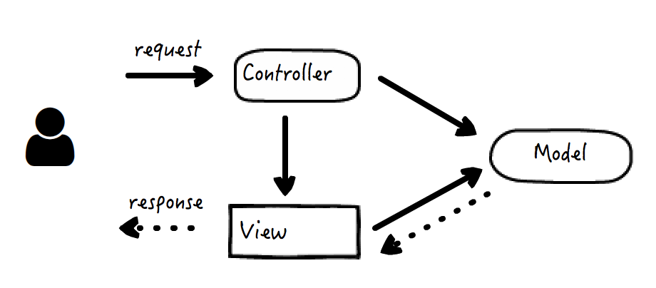
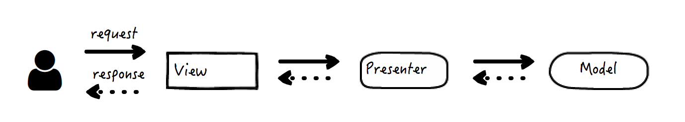
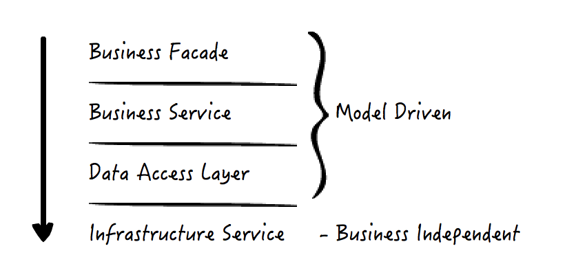

# 解耦

## JSP 和 Servlet

### 概念介绍

至于 JSP，它的全称叫做 Java Server Pages，它允许静态的 HTML 页面插入一些类似于“<% %>”这样的标记（scriptlet），而在这样的标记中，还能以表达式或代码片段的方式，嵌入一些 Java 代码，在 Web 容器响应 HTTP 请求时，这些标记里的 Java 代码会得到执行，这些标记也会被替换成代码实际执行的结果，嵌入页面中一并返回。这样一来，原本静态的页面，就能动态执行代码，并将执行结果写入页面了。

+ 第一次运行时，系统会执行编译过程，并且这个过程只会执行一次：JSP 会处理而生成 Servlet 的 Java 代码，接着代码会被编译成字节码（class 文件），在 Java 虚拟机上运行。
+ 之后每次就只需要执行运行过程了，Servlet 能够接受 HTTP 请求，并返回 HTML 文本，最终以 HTTP 响应的方式返回浏览器。

+ 编译过程：JSP 页面 → Java 文件（Servlet）→ class 文件（Servlet）
+ 运行过程：HTTP 请求 + class 文件（Servlet）→ HTML 文本

### 深入理解

**从编程范型的角度来看，JSP 页面的代码多是基于声明式（Declarative），而 Servlet 的代码则多是基于命令式（Imperative）**，这两种技术适合不同的场景。这两个概念，最初来源于编程范型的分类，声明式编程，是去描述物件的性质，而非给出指令，而命令式编程则恰恰相反。

**对于某些问题，使用声明式会更符合直觉，更形象，因而更接近于人类的语言；而另一些问题，则使用命令式，更符合行为步骤的思考模式，更严谨，也更能够预知机器会怎样执行。**

计算机生来就是遵循命令执行的，因此声明式的 JSP 页面会被转化成一行行命令式的 Servlet 代码，交给计算机执行。

## MVC 的演进

MVC 模式包含这样三层：

+ 控制器（Controller），恰如其名，主要负责请求的处理、校验和转发。
+ 视图（View），将内容数据以界面的方式呈现给用户，也捕获和响应用户的操作。
+ 模型（Model），数据和业务逻辑真正的集散地。

### JSP Model 1

JSP Model 1 是整个演化过程中最古老的一种，请求处理的整个过程，包括参数验证、数据访问、业务处理，到页面渲染（或者响应构造），全部都放在 JSP 页面里面完成。JSP 页面既当爹又当妈，静态页面和嵌入动态表达式的特性，使得它可以很好地容纳声明式代码；而 JSP 的 scriptlet，又完全支持多行 Java 代码的写入，因此它又可以很好地容纳命令式代码。

### JSP Model 2

在 Model 1 中，你可以对 JSP 页面上的内容进行模块和职责的划分，但是由于它们都在一个页面上，物理层面上可以说是完全耦合在一起，因此模块化和单一职责无从谈起。和 Model 1 相比，Model 2 做了明显的改进。

+ JSP 只用来做一件事，那就是页面渲染，换言之，JSP 从全能先生转变成了单一职责的页面模板；
+ 引入 JavaBean 的概念，它将数据库访问等获取数据对象的行为封装了起来，成为业务数据的唯一来源；
+ 请求处理和派发的活交到纯 Servlet 手里，它成为了 MVC 的“大脑”，它知道创建哪个 JavaBean 准备好业务数据，也知道将请求引导到哪个 JSP 页面去做渲染。

通过这种方式，你可以看到，原本全能的 JSP 被解耦开了，分成了三层，这三层其实就是 MVC 的 View、Model 和 Controller。于是殊途同归，MVC 又一次进入了人们的视野，今天的 MVC 框架千差万别，原理上却和这个版本基本一致。

+ JavaBean 其实指的是一类特殊的封装对象，这里的“Bean”其实指的就是可重用的封装对象。它的特点是可序列化，包含一个无参构造器，以及遵循统一的 getter 和 setter 这样的简单命名规则的存取方法。

+ POJO，即 Plain Old Java Object，还是最擅长创建软件概念的 Martin Fowler 的杰作。它指的就是一个普通和简单的 Java 
  对象，没有特殊限制，也不和其它类有关联（它不能继承自其它类，不能实现任何接口，也不能被任何注解修饰）。

所以，二者是两个类似的概念，通常认为它们之间具备包含关系，即 JavaBean 可以视作 POJO 的一种。但它们二者也有一些共性，比如，它们都是可以承载实际数据状态，都定义了较为简单的方法，概念上对它们的限制只停留在外在表现（即内部实现可以不“plain”，可以很复杂，比如 JavaBean 经常在内部实现中读写数据库）。

### MVC 的一般化

JSP Model 2 已经具备了 MVC 的基本形态，但是，它却对技术栈有着明确限制——Servlet、JSP 和 JavaBean。今天我们见到的 MVC，已经和实现技术无关了，并且，在 MVC 三层大体职责确定的基础上，其中的交互和数据流动却是有许多不同的实现方式的。

不同的 MVC 框架下实现的 MVC 架构不同，有时即便是同一个框架，不同的版本之间其 MVC 架构都有差异（比如 ASP.NET MVC），在这里我只介绍最典型的两种情况，如果你在学习的过程中见到其它类型，请不要惊讶，重要的是理解其中的原理。

+ **MVC典型模型1**

用户请求发送给 Controller，而 Controller 是大总管，需要主动调用 Model 层的接口去取得实际需要的数据对象，之后将数据对象发送给需要渲染的 View，View 渲染之后返回页面给用户。

在这种情况下，Controller 往往会比较大，因为它要知道需要调用哪个 Model 的接口获取数据对象，还需要知道要把数据对象发送给哪个 View 去渲染；View 和 Model 都比较简单纯粹，它们都只需要被动地根据 Controller 的要求完成它们自己的任务就好了。

+ **MVC典型模型2**

这种情况在更新操作中比较常见，Controller 调用 Model 的接口发起数据更新操作，接着就直接转向最终的 View 去了；View 会调用 Model 去取得经过 Controller 更新操作以后的最新对象，渲染并返回给用户。

在这种情况下，Controller 相对就会比较简单，而这里写操作是由 Controller 发起的，读操作是由 View 发起的，二者的业务对象模型可以不相同，非常适合需要 CQRS（Command Query Responsibility Segregation，命令查询职责分离）的场景

### MVC 的变体

MVP 包含的三层为 Model、View 和 Presenter，它往往被用在用户的界面设计当中，和 MVC 比起来，Controller 被 Presenter 替代了。

+ Model 的职责没有太大的变化，依然是业务数据的唯一来源。
+ View 变成了纯粹的被动视图，它被动地响应用户的操作来触发事件，并将其转交给 Presenter；反过来，它的视图界面被动地由 Presenter 来发起更新。 
+ Presenter 变成了 View 和 Model 之间的协调者（Middle-man），它是真正调度逻辑的持有者，会根据事件对 Model 进行状态更新，又在 Model 层发生改变时，相应地更新 View。

MVVM 是在 MVP 的基础上，将职责最多的 Presenter 替换成了 ViewModel，它实际是一个数据对象的转换器，将从 Model 中取得的数据简化，转换为 View 可以识别的形式返回给 View。View 和 ViewModel 实行双向绑定，成为命运共同体，即 View 的变化会自动反馈到 ViewModel 中，反之亦然。

**MVP和MVC的主要区别**

MVP 是 MVC 的变体，功能、层次和应用场景有所区别。

对于 MVC 来说，Controller 层次上完全独立于 View，它可以跨多个视图、可以决定视图路由，更多存放的是控制逻辑，应用较为广泛，但多数在服务端代码中；

而对于 MVP 来说，Presenter 则其实是和 View 在相似的层次上，协调并把 Model 的数据绑定到指定 View 上去，主要用在纯粹 UI 的实现中。

## 小结

+ JSP Model 1：请求处理的整个过程，全部都耦合在 JSP 页面里面完成；
+ JSP Model 2：MVC 分别通过 JavaBean、JSP 和 Servlet 解耦成三层；
+ MVC 的常见形式一：数据由 Controller 调用 Model 来准备，并传递给 View 层；
+ MVC 的常见形式二：Controller 发起对数据的修改，在 View 中查询修改后的数据并展示，二者分别调用 Model；MVP：Presenter 扮演协调者，对 Model 和 View 实施状态的更新； 
+ MVVM：View 和 ViewModel 实行数据的双向绑定，以自动同步状态。

# 模型

## 贫血模型和充血模型

我们在谈模型层的时候，有时候会更关心领域模型这一抽象概念本身，有时候则会更关心数据本身。

这里的“血”，就是逻辑。它既包括我们最关心的业务逻辑，也包含非业务逻辑 。

+ 贫血模型（Anemic Domain Model），逻辑从模型实体中剥离出去，并被放到了无状态的 Service 层中，于是状态和逻辑就被解耦开了，意味着模型实体在设计和实现上，不包含或包含很少的逻辑。

+ 在充血模型的设计中，领域模型实体就是有血有肉的了，既包含数据，也包含逻辑，具备了更高程度的完备性和自恰性。

## 内部层次划分

软件的耦合和复杂性问题往往都可以通过分层解决，模型层内部也一样，但是我们需要把握其中的度。**层次划分过多、过细，并不利于开发人员严格遵从和保持层次的清晰，也容易导致产生过多的无用样板代码，从而降低开发效率。** 下面是一种比较常见的 Model 层，它是基于贫血模型的分层方式。

第一层 Facade，提供粗粒度的接口，逻辑上是对 Service 功能的组合。有时候由于事务需要跨多个领域模型的实体控制，那就适合放在这里。举例来说，创建用户的时候，我们同时免费赠送一本电子书给用户，我们既要调用 UserService 去创建用户对象，也要调用 SubscriptionService 去添加一条订购（赠送）记录，而这两个属于不同 Service 的行为需要放到一处 Facade 类里面做统一事务控制。在某些较小系统的设计里面，Service 和 Facade 这两层是糅合在一起的。

第二层 Service，前面已经介绍了，通常会存放仅属于单个领域模型实体的操作。

第三层数据访问层，在某些类型的数据访问中需要，比如关系型数据库，这里存放数据库字段和模型对象之间的 ORM（Object-Relational Mapping，对象关系映射）关系。

第四层基础设施层，这一层的通用性最好，必须和业务无关。某些框架会把基础设施的工作给做了，但有时候也需要我们自己实现。比如 S3Service，存放数据到亚马逊的分布式文件系统。

## CQRS 模式

CQRS（Command Query Responsibility Segregation，命令查询职责分离）。

CQRS 模式下，模型层的接口分为且只分为两种：

命令（Command），它不返回任何结果，但会改变数据的状态。

查询（Query），它返回结果，但是不会改变数据的状态。

CQRS 中的命令，可能是幂等的（例如对象更新），也可能不是幂等的（例如对象创建），但一定是不安全的；CQRS 中的查询，一定是幂等的，且一定是安全的。

在计算机行业的dargon中，“数据”的同义词是“状态”。“逻辑”的同义词是“服务”、“行为”、“函数”或“功能”。

# 视图

**MVC 架构中的视图是指将数据有目的、按规则呈现出来的组件。** 因此，如果返回和呈现给用户的不是图形界面，而是 XML 或 JSON 等特定格式组织呈现的数据，它依然是视图，而用 MVC 来解决的问题，也绝不只是具备图形界面的网站或者 App 上的问题。

## 页面聚合技术

+ **结构聚合：指的是将一个页面中不同的区域聚合起来，这体现的是分治的思想。**

比如说，对于模板和静态资源（如脚本、样式、图片等），可以利用 CDN（Content Delivery Network，内容分发网络）技术，从网络中距离最近的节点获取，以达到快速展示页面的目的；而动态的数据则可以从中心节点异步获取，速度会慢一点，但保证了数据的一致性。数据抵达浏览器以后，再完成聚合，静态和动态的资源可以根据实际情况分别做服务端和客户端的优化，比如浏览器适配、缓存等等

+ **数据 - 模板聚合：指的是聚合静态的模板和动态的数据，这体现的是解耦的思想。**

### 服务端和客户端聚合方式的比较

+ 架构上，客户端聚合达成了客户端 - 服务端分离和模板 - 数据聚合这二者的统一，这往往可以简化架构，保持灵活性。

+ 资源上，客户端聚合将服务器端聚合造成的计算压力，分散到了客户端。

客户端聚合也有它天然的弊端。其中最重要的一条，就是客户端聚合要求客户端具备一定的规范性和运算能力。

## 常见的聚合技术

+ iFrame 聚合

iFrame 是一种最为原始和简单的聚合方式，也是 CSI（Client Side Includes，客户端包含）的一种典型方式

+ 模板引擎

在使用模板引擎的时候，需要注意保持 View 层代码职责的清晰和纯粹。

+ Portlet

技术上，Portlet 可以做到远程聚合（服务端），也可以做到本地聚合（客户端），数据来源的业务节点可以部署得非常灵活，因此在企业级应用中也非常常见。

+ SSI (server side includes)

一种非常简单的服务端聚合方式

# MVC架构解析：控制器（Controller）篇

## 路径映射和视图指向

+ **入口路由就是路径映射，根据配置的规则，以及请求 URI 的路径，找到具体接收和处理这个请求的控制器逻辑。**
+ **出口路由就是视图指向，根据配置的规则，以及控制器处理完毕后返回的信息，找到需要渲染的视图页面。**

## 请求参数绑定

整个控制器的流程中，有两次重要的数据绑定，这是第一次，是为了控制器而绑定请求数据，后面在视图上下文构造这一步中还有一次绑定，那是为了视图而进行的。

## 参数验证

参数验证的操作因为和请求对象密切相关，因此通常都是在控制器层完成的。在参数验证没有通过的情况下，往往会执行异常流程，转到错误页面，返回失败请求。

## 视图上下文绑定

在控制器中，我们经常需要将数据传入视图层，它可能会携带用户传入的参数，也可能会携带在控制器中查询模型得到的数据，而这个传入方式，就是将数据绑定到视图的上下文中。这就是我刚刚提到过的控制器层两大绑定中的第二个。

xx
