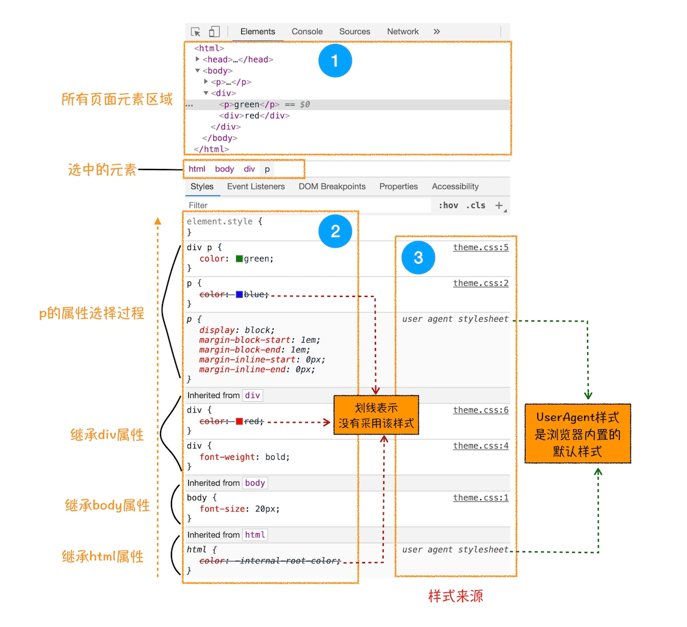
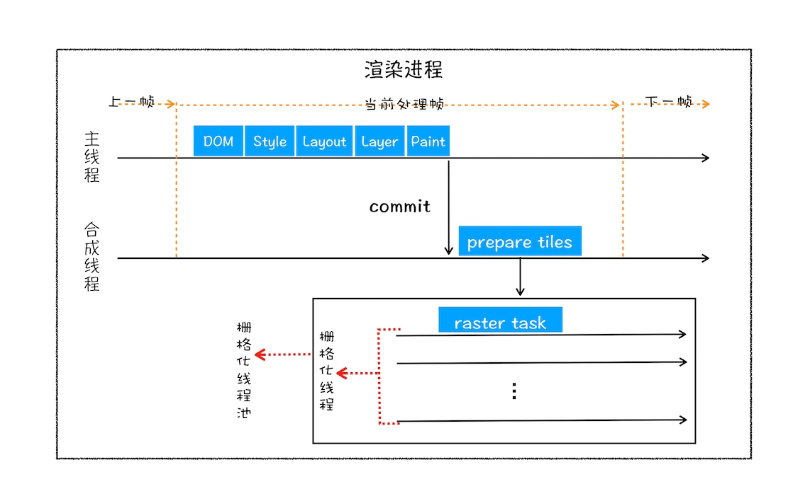

# 1. 浏览器的进程与架构
+ 线程是不能单独存在的，它是由进程来启动和管理。
+ 一个进程就是一个程序的运行实例。
+ 线程是依附于进程的，而进程中使用多线程并行处理能提升运算效率。
+ 进程中的任意一线程执行出错，都会导致整个进程的崩溃。
+ 线程之间共享进程中的数据。


从上图可以看出，线程 1、线程 2、线程 3 分别把执行的结果写入 A、B、C 中，然后线程 2 继续从 A、B、C 中读取数据，用来显示执行结果。

+ 当一个进程关闭之后，操作系统会回收进程所占用的内存。

当一个进程退出时，操作系统会回收该进程所申请的所有资源；即使其中任意线程因为操作不当导致内存泄漏，当进程退出时，这些内存也会被正确回收。

+ 进程之间的内容相互隔离。
    
进程隔离是为保护操作系统中进程互不干扰的技术，每一个进程只能访问自己占有的数据，也就避免出现进程 A 写入数据到进程 B 的情况。正是因为进程之间的数据是严格隔离的，所以一个进程如果崩溃了，或者挂起了，是不会影响到其他进程的。如果进程之间需要进行数据的通信，这时候，就需要使用用于进程间通信（IPC）的机制了。

## 1.1 单进程浏览器
+ 单进程浏览器是指浏览器的所有功能模块都是运行在同一个进程里，这些模块包含了网络、插件、JavaScript 运行环境、渲染引擎和页面等。
+ 如此多的功能模块运行在一个进程里，是导致单进程浏览器 **不稳定、不流畅和不安全** 的一个主要因素。
+ 问题
    + 不稳定
        + 插件的意外崩溃会引起整个浏览器的崩溃。
        + 渲染引擎模块也是不稳定的，通常一些复杂的 JavaScript 代码就有可能引起渲染引擎模块的崩溃。
    + 不流畅
        + 脚本死循环
        + 页面内存泄露
    + 不安全
        + 插件可以使用 C/C++ 等代码编写，通过插件可以获取到操作系统的任意资源，可以释放病毒、窃取你的账号密码
        + 页面脚本，它可以通过浏览器的漏洞来获取系统权限

## 1.2 多进程浏览器


### 1.2.1 多进程浏览器的好处

+ 如何解决不稳定的问题

由于进程是相互隔离的，所以当一个页面或者插件崩溃时，影响到的仅仅是当前的页面进程或者插件进程，并不会影响到浏览器和其他页面。

+ 如何解决不流畅的问题

JavaScript 也是运行在渲染进程中的，所以即使 JavaScript 阻塞了渲染进程，影响到的也只是当前的渲染页面，而并不会影响浏览器和其他页面，因为其他页面的脚本是运行在它们自己的渲染进程中的。所以当我们再在 Chrome 中运行上面那个死循环的脚本时，没有响应的仅仅是当前的页面。

+ 如何解决不安全的问题

采用多进程架构的额外好处是可以使用安全沙箱，你可以把沙箱看成是操作系统给进程上了一把锁，沙箱里面的程序可以运行，但是不能在你的硬盘上写入任何数据，也不能在敏感位置读取任何数据。

### 1.2.2 进程模型的类型

+ `Process-per-site-instance` 对同一个域的实例都会创建独立的进程。例如，用户访问了 milado_nju 的 CSDN 博客（我的博客），然后从个人主页打开多篇文章时，每篇文章的页面都是该域的一个实例，因而它们都共享同一个的进程。如果新打开 CSDN 博客的主页，那么就是另一个实例，会重新创建进程来渲染它。这带来的好处是每个页面互不  影响，坏处自然是资源的巨大浪费。
+ `Process-per-site` 不同一个域会创建独立的进程，同一域的不同实例共享同一个进程。好处是对于不同的域可以共享，相对较小的内存消耗，坏处是可能会有特别大的renderer 进程。
+ `Process-per-tab` 为每个一个标签页创建一个独立的进程。
+ `Single Process` 不为页面创建任何独立的进程， 所有渲染工作都在 browser 进程中。

## 1.3 最新 Chrome 的进程架构


最新的 Chrome 浏览器包括：1 个浏览器（Browser）主进程、1 个 GPU 进程、1 个网络（NetWork）进程、多个渲染进程和多个插件进程。

+ **浏览器进程。** 主要负责界面显示、用户交互、子进程管理，同时提供存储等功能。
+ **渲染进程。** 核心任务是将 HTML、CSS 和 JavaScript 转换为用户可以与之交互的网页，排版引擎 Blink 和 JavaScript 引擎 V8 都是运行在该进程中，默认情况下，Chrome 会为每个 Tab 标签创建一个渲染进程。出于安全考虑，渲染进程都是运行在沙箱模式下。
+ **GPU 进程。** 其实，Chrome 刚开始发布的时候是没有 GPU 进程的。而 GPU 的使用初衷是为了实现 3D CSS 的效果，只是随后网页、Chrome 的 UI 界面都选择采用 GPU 来绘制，这使得 GPU 成为浏览器普遍的需求。最后，Chrome 在其多进程架构上也引入了 GPU 进程。
+ **网络进程。** 主要负责页面的网络资源加载，之前是作为一个模块运行在浏览器进程里面的，直至最近才独立出来，成为一个单独的进程。
+ **插件进程。** 主要是负责插件的运行，因插件易崩溃，所以需要通过插件进程来隔离，以保证插件进程崩溃不会对浏览器和页面造成影响。
+ **问题。**
    + 更高的资源占用。因为每个进程都会包含公共基础结构的副本（如 JavaScript 运行环境），这就意味着浏览器会消耗更多的内存资源。
    + 更复杂的体系架构。浏览器各模块之间耦合性高、扩展性差等问题，会导致现在的架构已经很难适应新的需求了。

## 1.4 未来面向服务的 Chrome 架构

为了解决这些问题，在 2016 年，Chrome 官方团队使用 **“面向服务的架构”（Services Oriented Architecture，简称SOA）** 的思想设计了新的 Chrome 架构。也就是说 Chrome
 整体架构会朝向现代操作系统所采用的“面向服务的架构” 方向发展，原来的各种模块会被重构成独立的服务（Service），每个服务（Service）都可以在独立的进程中运行，访问服务（Service）必须使用定义好的接口，通过 IPC
  来通信，从而 **构建一个更内聚、松耦合、易于维护和扩展的系统** ，更好实现 Chrome 简单、稳定、高速、安全的目标。

Chrome 最终要把 UI、数据库、文件、设备、网络等模块重构为基础服务，类似操作系统底层服务


Chrome 正在逐步构建 Chrome 基础服务（Chrome Foundation Service），如果你认为 Chrome 是“便携式操作系统”，那么 Chrome 基础服务便可以被视为该操作系统的“基础”系统服务层。

同时 Chrome 还提供灵活的弹性架构，在强大性能设备上会以多进程的方式运行基础服务，但是如果在资源受限的设备上（如下图），Chrome 会将很多服务整合到一个进程中，从而节省内存占用。


## 1.5 问题
+ **即使是如今的多进程架构，偶尔还会碰到一些由于单个页面卡死最终崩溃导致所有页面崩溃的情况，请问这是什么原因呢**

是这样的，通常情况下是一个页面使用一个进程，但是，有一种情况，叫"同一站点(same-site)"，具体地讲，我们将“同一站点”定义为根域名（例如，geekbang.org）加上协议（例如，https:// 或者http://），还包含了该根域名下的所有子域名和不同的端口，比如下面这三个：

https://time.geekbang.org

https://www.geekbang.org

https://www.geekbang.org:8080

都是属于同一站点，因为它们的协议都是https，而根域名也都是geekbang.org。你也许了解同源策略，但是同一站点和同源策略还是存在一些不同地方，在这里你需要了解它们不是同一件事就行了。

Chrome的默认策略是，每个标签对应一个渲染进程。但是如果从一个页面打开了新页面，而新页面和当前页面属于同一站点时，那么新页面会复用父页面的渲染进程。官方把这个默认策略叫process-per-site-instance。

直白的讲，就是如果几个页面符合同一站点，那么他们将被分配到一个渲染进程里面去。

所以，这种情况下，一个页面崩溃了，会导致同一站点的页面同时崩溃，因为他们使用了同一个渲染进程。

为什么要让他们跑在一个进程里面呢？

因为在一个渲染进程里面，他们就会共享JS的执行环境，也就是说A页面可以直接在B页面中执行脚本。因为是同一家的站点，所以是有这个需求的。

+ **单进程浏览器开多个页面，渲染线程也只有一个吗？感觉一个页面开一个线程不是更合理吗？**

首先这个问题提的很好，我们从IE6开始讲起，IE6时代，浏览器是单进程的，所有页面也都是运行在一个主线程中的，当时IE6就是这样设计，而且此时的IE6是单标签，也就是说一个页面一个窗口。

这时候，国内有很多国产浏览器，都是基于IE6来二次开发的，而IE6原生架构就是所有页面跑在单线程里面的，意味着，所有的页面都共享着同一套JavaScript运行环境，同样，对于存储Cookie也都是在一个线程里面操作的。
而且这些国产浏览器由于需要，都采用多标签的形式，所以其中的一个标签页面的卡顿都会影响到整个浏览器。

基于卡顿的原因，国内浏览器就开始尝试支持页面多线程，也就是让部分页面运行在单独的线程之中，运行在单独的线程之中，意味着每个线程拥有单独的JavaScript执行环境，和Cookie环境，这时候问题就来了：

比如A站点页面登陆一个网站，保存了一些Cookie数据到磁盘上，再在当前线程环境中保存部分Session数据，由于Session是不需要保存到硬盘上的，所以Session只会保存在当前的线程环境中。这时候再打开另外一个A 站点的页面，假设这个页面在另外一个线程中里面，那么它首先读取硬盘上的Cookie信息，但是，由于Session信息是保存在另外一个线程里面的，无法直接读取，这样就要实现一个Session同步的问题，由于IE 并没有源代码，所以实现起来非常困难，国内浏览器花了好长一点时间才解决这个问题的。

Session问题解决了，但是假死的问题依然有，因为进程内使用了一个窗口，这个窗口是依附到浏览器主窗口之上的，所以他们公用一套消息循环机制，消息循环我们后面会详细地讲，这也就意味这一个窗口如果卡死了。也会导致整个浏览器的卡死。

国产浏览器又出了一招，就是把页面做成一个单独的弹窗，如果这个页面卡死了，就把这个弹窗给隐藏掉。

这里还要提一下为什么Chrome中的一个页面假死不会影响到主窗口呢？

这是因为chrome输出的实际上图片，然后浏览器端把图片贴到自己的窗口上去，在Chrome的渲染进程内，并没有一个渲染窗口，输出的只是图片，如果卡住了，顶多图片不更新了。

国产浏览器这一套技术花了四五年时间，等这套技术差不多成熟时，Chrome发布了 :(

+ **对于浏览器中的页面崩溃的原因该怎么定位呢？很多情况下，问题并不能稳定复现，通过浏览器自带的开发者工具感觉很难定位到真正的问题**

要定位页面崩溃页面，我们先要了解下有可能造成页面崩溃的因素，根据我的实际统计数据看来，主要有以下三个方便的因素：

首先，主要因素是 **一些第三方插件注入浏览器或者页面进程**，拦截了网页的一些正常操作而导致页面或者浏览器崩溃，如一些杀毒软件，或者卫士类软件，或者一些流量劫持软件。

第二个因素是 **插件**，虽然容易崩溃，但是通常情况下只会影响到自身的进程，不过我们以前的统计数据来看，也会小概率地影响到页面的崩溃，不过整体数据来看还好了。另外一个方向来看，插件的使用率已经越来越低了，所以插件不是个大问题。

第三个因素是 **浏览器的一些bug**，如渲染引擎，JavaScript引擎等，不过从统计数据来看，这类因素导致的崩溃也是越来越低的了，而且随着浏览器的更新升级，引起问题的因素也是在不断变化的。

所以要直接给出页面崩溃原因是很难的，而且直接从JS的层面来看，也是很难跟踪崩溃原因的。

提一个我之前使用的方法，那就是使用JS来统计页面是否崩溃，这类统计不是100%准备，但是可以通过数据来大致判断页面是否崩溃，然后再找一些典型的用户环境来实地排查。

# 2. 如何保证页面文件能被完整送达浏览器

在衡量 Web 页面性能的时候有一个重要的指标叫“FP（First Paint）”，是指从页面加载到首次开始绘制的时长。这个指标直接影响了用户的跳出率，更快的页面响应意味着更多的 PV、更高的参与度，以及更高的转化率。那什么影响 FP 指标呢？其中一个重要的因素是 **网络加载速度**。

要想优化 Web 页面的加载速度，你需要对网络有充分的了解。而理解网络的关键是要对网络协议有深刻的认识，不管你是使用 HTTP，还是使用 WebSocket，它们都是基于 TCP/IP 的，如果你对这些原理有足够了解，也就清楚如何去优化 Web 性能，或者能更轻松地定位 Web 问题了。此外，TCP/IP 的设计思想还有助于拓宽你的知识边界，从而在整体上提升你对项目的理解和解决问题的能力。


互联网中的数据是通过数据包来传输的。如果发送的数据很大，那么该数据就会被拆分为很多小数据包来传输。

## 2.1 IP：把数据包送达目的主机

数据包要在互联网上进行传输，就要符合网际协议（Internet Protocol，简称IP）标准。互联网上不同的在线设备都有唯一的地址，地址只是一个数字。

**计算机的地址就称为 IP 地址，访问任何网站实际上只是你的计算机向另外一台计算机请求信息。**

如果要想把一个数据包从主机 A 发送给主机 B，那么在传输之前，数据包上会被附加上主机 B 的 IP 地址信息，这样在传输过程中才能正确寻址。额外地，数据包上还会附加上主机 A 本身的 IP 地址，有了这些信息主机 B 才可以回复信息给主机 A。这些附加的信息会被装进一个叫 IP 头的数据结构里。IP 头是 IP 数据包开头的信息，包含 IP 版本、源 IP 地址、目标 IP 地址、生存时间等信息。


看下一个数据包从主机 A 到主机 B 的旅程：

+ 上层将含有“极客时间”的数据包交给网络层；
+ 网络层再将 IP 头附加到数据包上，组成新的 IP 数据包，并交给底层；
+ 底层通过物理网络将数据包传输给主机 B；
+ 数据包被传输到主机 B 的网络层，在这里主机 B 拆开数据包的 IP 头信息，并将拆开来的数据部分交给上层；
+ 最终，含有“极客时间”信息的数据包就到达了主机 B 的上层了。

## 2.2 UDP：把数据包送达应用程序

IP 是非常底层的协议，只负责把数据包传送到对方电脑，但是对方电脑并不知道把数据包交给哪个程序。

因此，需要基于 IP 之上开发能和应用打交道的协议，最常见的是“用户数据包协议（User Datagram Protocol）”，简称UDP。

UDP 中一个最重要的信息是端口号，端口号其实就是一个数字，每个想访问网络的程序都需要绑定一个端口号。通过端口号 UDP 就能把指定的数据包发送给指定的程序了，所以 **IP 通过 IP 地址信息把数据包发送给指定的电脑，而 UDP
 通过端口号把数据包分发给正确的程序。** 和 IP 头一样，端口号会被装进 UDP 头里面，UDP 头再和原始数据包合并组成新的 UDP 数据包。UDP 头中除了目的端口，还有源端口号等信息。


来看下一个数据包从主机 A 旅行到主机 B 的路线：

+ 上层将含有“极客时间”的数据包交给传输层；
+ 传输层会在数据包前面附加上UDP 头，组成新的 UDP 数据包，再将新的 UDP 数据包交给网络层；
+ 网络层再将 IP 头附加到数据包上，组成新的 IP 数据包，并交给底层；
+ 数据包被传输到主机 B 的网络层，在这里主机 B 拆开 IP 头信息，并将拆开来的数据部分交给传输层；
+ 在传输层，数据包中的 UDP 头会被拆开，**并根据 UDP 中所提供的端口号，把数据部分交给上层的应用程序；**
+ 最终，含有“极客时间”信息的数据包就旅行到了主机 B 上层应用程序这里。

在使用 UDP 发送数据时，有各种因素会导致数据包出错，虽然 UDP 可以校验数据是否正确，但是对于错误的数据包，UDP 并不提供重发机制，只是丢弃当前的包，而且 UDP 在发送之后也无法知道是否能达到目的地。

虽说 **UDP 不能保证数据可靠性，但是传输速度却非常快** ，所以 UDP 会应用在一些关注速度、但不那么严格要求数据完整性的领域，如在线视频、互动游戏等。

## 2.3 TCP：把数据完整地送达应用程序

对于浏览器请求，或者邮件这类要求数据传输可靠性（reliability）的应用，如果使用 UDP 来传输会存在两个问题：

+ 数据包在传输过程中容易丢失；
+ 大文件会被拆分成很多小的数据包来传输，这些小的数据包会经过不同的路由，并在不同的时间到达接收端，而 UDP 协议并不知道如何组装这些数据包，从而把这些数据包还原成完整的文件。

基于这两个问题，我们引入 TCP 了。 **TCP（Transmission Control Protocol，传输控制协议）是一种面向连接的、可靠的、基于字节流的传输层通信协议。** 相对于 UDP，TCP 有下面两个特点:

+ 对于数据包丢失的情况，TCP 提供重传机制；
+ TCP 引入了数据包排序机制，用来保证把乱序的数据包组合成一个完整的文件。

和 UDP 头一样，TCP 头除了包含了目标端口和本机端口号外，还提供了用于排序的序列号，以便接收端通过序号来重排数据包。


TCP 单个数据包的传输流程和 UDP 流程差不多，不同的地方在于，通过 TCP 头的信息保证了一块大的数据传输的完整性。

一个完整的 TCP 连接的生命周期包括了“**建立连接**”“**传输数据**”和“**断开连接**”三个阶段。


+ **首先，建立连接阶段。** 这个阶段是通过“三次握手”来建立客户端和服务器之间的连接。TCP  提供 **面向连接** 的通信传输。面向连接是指在数据通信开始之前先做好两端之间的准备工作。所谓 **三次握手** ，是指在建立一个 TCP  连接时，客户端和服务器总共要发送三个数据包以确认连接的建立。

+ **其次，传输数据阶段。** 在该阶段，**接收端需要对每个数据包进行确认操作**，也就是接收端在接收到数据包之后，需要发送确认数据包给发送端。所以当发送端发送了一个数据包之后，在规定时间内没有接收到接收端反馈的确认消息，则判断为数据包丢失，并触发发送端的重发机制。同样，一个大的文件在传输过程中会被拆分成很多小的数据包，这些数据包到达接收端后，接收端会按照 TCP 头中的序号为其排序，从而保证组成完整的数据。

+ **最后，断开连接阶段。** 数据传输完毕之后，就要终止连接了，涉及到最后一个阶段“四次挥手”来保证双方都能断开连接。


## 2.4 为什么会有三次握手

客户端和服务端通信前要进行连接，“3次握手”的作用就是双方都能明确自己和对方的收、发能力是正常的。

**第一次握手**：客户端发送网络包，服务端收到了。这样服务端就能得出结论：客户端的发送能力、服务端的接收能力是正常的。

**第二次握手**：服务端发包，客户端收到了。这样客户端就能得出结论：服务端的接收、发送能力，客户端的接收、发送能力是正常的。 从客户端的视角来看，我接到了服务端发送过来的响应数据包，说明服务端接收到了我在第一次握手时发送的网络包，并且成功发送了响应数据包，这就说明，服务端的接收、发送能力正常。而另一方面，我收到了服务端的响应数据包，说明我第一次发送的网络包成功到达服务端，这样，我自己的发送和接收能力也是正常的。

**第三次握手**：客户端发包，服务端收到了。这样服务端就能得出结论：客户端的接收、发送能力，服务端的发送、接收能力是正常的。 第一、二次握手后，服务端并不知道客户端的接收能力以及自己的发送能力是否正常。而在第三次握手时，服务端收到了客户端对第二次握手作的回应。从服务端的角度，我在第二次握手时的响应数据发送出去了，客户端接收到了。所以，我的发送能力是正常的。而客户端的接收能力也是正常的。

经历了上面的三次握手过程，客户端和服务端都确认了自己的接收、发送能力是正常的。之后就可以正常通信了。

## 2.5 总结

+ 互联网中的数据是通过数据包来传输的，数据包在传输过程中容易丢失或出错。
+ IP 负责把数据包送达目的主机。
+ UDP 负责把数据包送达具体应用。
+ TCP 保证了数据完整地传输，它的连接可分为三个阶段：建立连接、传输数据和断开连接。

# 3. HTTP 流程

## 3.1 浏览器端发起 HTTP 请求流程
+ **构建请求。** 浏览器构建请求行信息，构建好后，浏览器准备发起网络请求。
+ **查找缓存。** 在真正发起网络请求之前，浏览器会先在浏览器缓存中查询是否有要请求的文件。其中，浏览器缓存是一种在本地保存资源副本，以供下次请求时直接使用的技术。
    + 缓解服务器端压力，提升性能
    + 可以实现资源快速加载
+ **准备 IP 地址和端口** 。
    + 第一步浏览器会请求 DNS 返回域名对应的 IP或者使用缓存 DNS 数据
    + 获取端口号，默认为 80


+ **等待 TCP 队列。** Chrome 有个机制，同一个域名同时最多只能建立 6 个 TCP 连接，如果在同一个域名下同时有 10 个请求发生，那么其中 4 个请求会进入排队等待状态，直至进行中的请求完成。
+ **建立 TCP 连接。** 排队等待结束之后，终于和服务器握手，在 HTTP 工作开始之前，浏览器通过 TCP 与服务器建立连接。
+ **发送 HTTP 请求。** 一旦建立了 TCP 连接，浏览器就可以和服务器进行通信了。而 HTTP 中的数据正是在这个通信过程中传输的。
    + 首先浏览器会向服务器发送请求行，它包括了请求方法、请求 URI（Uniform Resource Identifier）和 HTTP 版本协议。
    + 发送请求行，就是告诉服务器浏览器需要什么资源
    + 在浏览器发送请求行命令之后，还要以请求头形式发送其他一些信息，把浏览器的一些基础信息告诉服务器。比如包含了浏览器所使用的操作系统、浏览器内核等信息，以及当前请求的域名信息、浏览器端的 Cookie 信息，等等。

## 3.2 服务器端处理 HTTP 请求流程
+ **返回请求。** 一旦服务器处理结束，便可以返回数据给浏览器了。
    + 首先服务器会返回响应行，包括协议版本和状态码。
    + 随后，正如浏览器会随同请求发送请求头一样，服务器也会随同响应向浏览器发送响应头。响应头包含了服务器自身的一些信息，比如服务器生成返回数据的时间、返回的数据类型（JSON、HTML、流媒体等类型），以及服务器要在客户端保存的 Cookie 等信息。
    + 发送完响应头后，服务器就可以继续发送响应体的数据，通常，响应体就包含了 HTML 的实际内容。
+ **断开连接。** 
    + 通常情况下，一旦服务器向客户端返回了请求数据，它就要关闭 TCP 连接。不过如果浏览器或者服务器在其头信息中加入了：`Connection:Keep-Alive`，持久链接。
    + 那么 TCP 连接在发送后将仍然保持打开状态，这样浏览器就可以继续通过同一个 TCP 连接发送请求。保持 TCP 连接可以省去下次请求时需要建立连接的时间，提升资源加载速度。
+ **重定向。** 可能存在重定向行为。

## 3.3 问题
+ **为什么很多站点第二次打开速度会很快？**

如果第二次页面打开很快，主要原因是第一次加载页面过程中，缓存了一些耗时的数据。

那么，哪些数据会被缓存呢？从上面介绍的核心请求路径可以发现，**DNS 缓存** 和 **页面资源缓存** 这两块数据是会被浏览器缓存的。其中，DNS 缓存比较简单，它主要就是在浏览器本地把对应的 IP 和域名关联起来。

当服务器返回HTTP 响应头给浏览器时，浏览器是通过响应头中的 Cache-Control 字段来设置是否缓存该资源。比如是 `Cache-Control:Max-age=2000` 缓存过期时间是 2000 秒。这个响应头再下次请求时会带上，放在请求头里。

服务器收到请求头后，会根据 If-None-Match 的值来判断请求的资源是否有更新。

如果没有更新，就返回 304 状态码，相当于服务器告诉浏览器：“这个缓存可以继续使用，这次就不重复发送数据给你了。”

如果资源有更新，服务器就直接返回最新资源给浏览器。

+ **登录状态是如何保持的？**

用户打开登录页面，在登录框里填入用户名和密码，点击确定按钮。点击按钮会触发页面脚本生成用户登录信息，然后调用 POST 方法提交用户登录信息给服务器。

服务器接收到浏览器提交的信息之后，查询后台，验证用户登录信息是否正确，如果正确的话，会生成一段表示用户身份的字符串，并把该字符串写到响应头的 Set-Cookie 字段里，如下所示，然后把响应头发送给浏览器。

浏览器在接收到服务器的响应头后，开始解析响应头，如果遇到响应头里含有 Set-Cookie 字段的情况，浏览器就会把这个字段信息保存到本地。比如把UID=3431uad保持到本地。

当用户再次访问时，浏览器会发起 HTTP 请求，但在发起请求之前，浏览器会读取之前保存的 Cookie 数据，并把数据写进请求头里的 Cookie 字段里（如下所示），然后浏览器再将请求头发送给服务器。

服务器在收到 HTTP 请求头数据之后，就会查找请求头里面的“Cookie”字段信息，当查找到包含UID=3431uad的信息时，服务器查询后台，并判断该用户是已登录状态，然后生成含有该用户信息的页面数据，并把生成的数据发送给浏览器。

浏览器在接收到该含有当前用户的页面数据后，就可以正确展示用户登录的状态信息了。

简单地说，如果服务器端发送的响应头内有 Set-Cookie 的字段，那么浏览器就会将该字段的内容保持到本地。当下次客户端再往该服务器发送请求时，客户端会自动在请求头中加入 Cookie 值后再发送出去。服务器端发现客户端发送过来的 Cookie 后，会去检查究竟是从哪一个客户端发来的连接请求，然后对比服务器上的记录，最后得到该用户的状态信息。

# 4. 从输入 URL 到页面展示


+ 浏览器进程、渲染进程和网络进程的主要职责。
    + 浏览器进程主要负责用户交互、子进程管理和文件储存等功能。
    + 网络进程是面向渲染进程和浏览器进程等提供网络下载功能。
    + 渲染进程的主要职责是把从网络下载的 HTML、JavaScript、CSS、图片等资源解析为可以显示和交互的页面。因为渲染进程所有的内容都是通过网络获取的，会存在一些恶意代码利用浏览器漏洞对系统进行攻击，所以运行在渲染进程里面的代码是不被信任的。这也是为什么 Chrome 会让渲染进程运行在安全沙箱里，就是为了保证系统的安全。

+ 首先，用户从浏览器进程里输入请求信息；
+ 然后，网络进程发起 URL 请求；
+ 服务器响应 URL 请求之后，浏览器进程就又要开始准备渲染进程了；
+ 渲染进程准备好之后，需要先向渲染进程提交页面数据，我们称之为提交文档阶段；
+ 渲染进程接收完文档信息之后，便开始解析页面和加载子资源，完成页面的渲染。

用户发出 URL 请求到页面开始解析的这个过程，就叫做导航。

## 4.1 用户输入

当用户在地址栏中输入一个查询关键字时，地址栏会判断输入的关键字是搜索内容，还是请求的 URL。

如果是搜索内容，地址栏会使用浏览器默认的搜索引擎，来合成新的带搜索关键字的 URL。

如果判断输入内容符合 URL 规则，比如输入的是 google.com，那么地址栏会根据规则，把这段内容加上协议，合成为完整的 URL，

当浏览器刚开始加载一个地址之后，标签页上的图标便进入了加载状态。但此时图中页面显示的依然是之前打开的页面内容，并没立即替换为目标页面。因为需要等待提交文档阶段，页面内容才会被替换。

## 4.2 请求过程

接下来，便进入了页面资源请求过程。这时，浏览器进程会通过 **进程间通信（IPC）** 把 URL 请求发送至网络进程，网络进程接收到 URL 请求后，会在这里发起真正的 URL 请求流程。

首先，网络进程会查找本地缓存 **是否缓存了该资源** 。如果有缓存资源，那么直接返回资源给浏览器进程；如果在缓存中没有查找到资源，那么直接进入网络请求流程。这请求前的第一步是要进行 **DNS 解析** ，以获取请求域名的服务器 IP 地址。如果请求协议是 HTTPS，那么还需要 **建立 TLS 连接**。

接下来就是 **利用 IP 地址和服务器建立 TCP 连接**。连接建立之后，**浏览器端会构建请求行、请求头等信息，并把和该域名相关的 Cookie 等数据附加到请求头中，然后向服务器发送构建的请求信息。**

服务器接收到请求信息后，会 **根据请求信息生成响应数据（包括响应行、响应头和响应体等信息），并发给网络进程**。等网络进程接收了响应行和响应头之后，就开始解析响应头的内容了。（为了方便讲述，下面我将服务器返回的响应头和响应行统称为响应头。）

+ **重定向**

在接收到服务器返回的响应头后，网络进程开始解析响应头，如果发现返回的状态码是 301 或者 302，那么说明服务器需要浏览器重定向到其他 URL。这时网络进程会从响应头的 Location 字段里面读取重定向的地址，然后再发起新的 HTTP 或者 HTTPS 请求，一切又重头开始了。

在导航过程中，如果服务器响应行的状态码包含了 301、302 一类的跳转信息，浏览器会跳转到新的地址继续导航；如果响应行是 200，那么表示浏览器可以继续处理该请求。

+ **响应数据类型处理**

在处理了跳转信息之后，我们继续导航流程的分析。URL 请求的数据类型，有时候是一个下载类型，有时候是正常的 HTML 页面，那么浏览器是如何区分它们呢？

答案是 Content-Type。Content-Type 是 HTTP 头中一个非常重要的字段， 它告诉浏览器服务器返回的响应体数据是什么类型，然后浏览器会根据 Content-Type 的值来决定如何显示响应体的内容。

从返回的响应头信息来看，如果 Content-Type 的值是 **application/octet-stream** ，显示数据是字节流类型的，通常情况下，浏览器会按照 **下载类型** 来处理该请求。

需要注意的是，如果服务器配置 Content-Type 不正确，比如将 text/html 类型配置成 application/octet-stream 类型，那么浏览器可能会曲解文件内容，比如会将一个本来是用来展示的页面，变成了一个下载文件。

所以，不同 Content-Type 的后续处理流程也截然不同。如果 Content-Type 字段的值被浏览器判断为下载类型，那么该请求会被提交给 **浏览器的下载管理器** ，同时该 URL 请求的导航流程就此结束。但如果是HTML，那么浏览器则会继续进行导航流程。由于 Chrome 的 **页面渲染是运行在渲染进程中** 的，所以接下来就需要准备渲染进程了。

## 4.3 准备渲染进程

默认情况下，Chrome 会为每个页面分配一个渲染进程，也就是说，**每打开一个新页面就会配套创建一个新的渲染进程**。但是，也有一些例外，在某些情况下，浏览器会让多个页面直接运行在同一个渲染进程中。

那什么情况下多个页面会同时运行在一个渲染进程中呢？

要解决这个问题，我们就需要先了解下什么是 **同一站点（same-site）**。具体地讲，我们将“同一站点”定义为根域名（例如，geekbang.org）加上协议（例如，https:// 或者 http://），还包含了该根域名下的所有子域名和不同的端口，比如下面这三个：

```
https://time.geekbang.org

https://www.geekbang.org

https://www.geekbang.org:8080
```

它们都是属于同一站点，因为它们的协议都是 HTTPS，而且根域名也都是 geekbang.org。

Chrome 的默认策略是，**每个标签对应一个渲染进程**。但如果从一个页面打开了另一个新页面，而新页面和当前页面属于同一站点的话，那么新页面会 **复用父页面的渲染进程**。官方把这个默认策略叫 **process-per-site-instance**。

那若新页面和当前页面不属于同一站点，情况又会发生什么样的变化呢？比如我通过极客邦页面里的链接打开 InfoQ 的官网（https://www.infoq.cn/ ）， 因为 infoq.cn 和 geekbang.org 不属于同一站点，所以 infoq.cn 会使用一个新的渲染进程，你可以参考下图：


从图中任务管理器可以看出：由于极客邦和极客时间的标签页拥有相同的协议和根域名，所以它们属于同一站点，并运行在同一个渲染进程中；而 infoq.cn 的根域名不同于 geekbang.org，也就是说 InfoQ 和极客邦不属于同一站点，因此它们会运行在两个不同的渲染进程之中。

总结来说，打开一个新页面采用的渲染进程策略就是：

+ 通常情况下，打开新的页面都会使用单独的渲染进程；
+ 如果从 A 页面打开 B 页面，且 A 和 B 都属于同一站点的话，那么 B 页面复用 A 页面的渲染进程；如果是其他情况，浏览器进程则会为 B 创建一个新的渲染进程。

渲染进程准备好之后，还不能立即进入文档解析状态，因为此时的文档数据还在网络进程中，并没有提交给渲染进程，所以下一步就进入了提交文档阶段。

## 4.4 提交文档

+ “提交文档”的消息是由浏览器进程发出的，渲染进程接收到“提交文档”的消息后，会和网络进程建立传输数据的“管道”。
+ 等文档数据传输完成之后，渲染进程会返回“确认提交”的消息给浏览器进程。
+ 浏览器进程在收到“确认提交”的消息后，会更新浏览器界面状态，包括了安全状态、地址栏的 URL、前进后退的历史状态，并更新 Web 页面。

## 4.5 渲染阶段

一旦文档被提交，渲染进程便开始页面解析和子资源加载了，关于这个阶段的完整过程，我会在下一篇文章中来专门介绍。这里你只需要先了解一旦页面生成完成，渲染进程会发送一个消息给浏览器进程，浏览器接收到消息后，会停止标签图标上的加载动画。

至此，一个完整的页面就生成了。那文章开头的“从输入 URL 到页面展示，这中间发生了什么？”这个过程极其“串联”的问题也就解决了。

## 4.6 问题

+ **浏览器的http的keepalive的connection是什么粒度复用的呢？也是域名加协议头级别吗？**

首先 keep-alive 是为了解决连接效率不高的问题，http1.0 时代，http请求都是短连接的形式，也即是每次请求一个资源都需要和服务器建立连接+传输数据+断开连接，通常，建立连接和断开连接的时间就有可能超过传输数据的时间了，这种短连接的效率是异常的低效。

针对短连接低效的问题，后面就出现了长连接，也就是这里要讲的keep-alive。

你可以把长连接看成是一个管道，一个http请求结束之后，不会关闭连接，下个请求可以复用该连接，这样就省去建立连接和断开连接的时间了，但是他们请求是按照顺序，也就是符合IP+端口规则的资源都可以复用该连接，这就回答了上面提的这个问题。

但是，使用keep-alive同样存在问题，比如一个页面可能有100张图片素材，假设这些图片素材都保存在同一个域名下面，如果只复用一个http管道的话，那么传输100张图片的素材也是非常耗时间的，这就出现了同一时刻并发连接服务器的需求，也就是文中提到同一时刻，对同一域名下面，只能可以发起6个请求，这样就可以大大提升请求效率了。

为什么是6个请求而不是更多了，这是为了服务器性能考虑，如果同一时刻无限制连接，那么可能会导致服务器忙不过来。

+ **同一站点共用一个渲染进程，那假设有2个标签页是同一站点，我在A标签页面写个死循环，导致页面卡死，B页面是否也是卡死了呢？**

多个页面公用一个渲染进程，也就意味着多个页面公用同一个主线程，所有页面的任务都是在同一个主线程上执行，这些任务包括渲染流程，JavaScript执行，用户交互的事件的响应等等，但是如果一个标签页里面执行一个死循环，那么意味着该JavaScript代码会一直霸占主线程，这样就导致了其它的页面无法使用该主线程，从而让所有页面都失去响应！

+ **如果需要重定向，那不是之前的大段响应体都浪费了，需要销毁了重新获取新的响应资源？**

就是重头来一次，所以重定向尽量少用。

# 5. 渲染流程

HTML 的内容是由标记和文本组成。标记也称为标签，每个标签都有它自己的语意，浏览器会根据标签的语意来正确展示 HTML 内容。比如上面的 <p> 标签是告诉浏览器在这里的内容需要创建一个新段落，中间的文本就是段落中需要显示的内容。

如果需要改变 HTML 的字体颜色、大小等信息，就需要用到 CSS。CSS 又称为层叠样式表，是由选择器和属性组成，比如图中的 p 选择器，它会把 HTML 里面<p>标签的内容选择出来，然后再把选择器的属性值应用到<p>标签内容上。选择器里面有个 color 属性，它的值是 red，这是告诉渲染引擎把<p>标签的内容显示为红色。

至于JavaScript（简称为 JS），使用它可以使网页的内容“动”起来，比如上图中，可以通过 JavaScript 来修改 CSS 样式值，从而达到修改文本颜色的目的。

由于渲染机制过于复杂，所以渲染模块在执行过程中会被划分为很多子阶段，输入的 HTML 经过这些子阶段，最后输出像素。我们把这样的一个处理流程叫做渲染流水线，其大致流程如下图所示：


按照渲染的时间顺序，流水线可分为如下几个子阶段：构建 DOM 树、样式计算、布局阶段、分层、绘制、分块、光栅化和合成。内容比较多，我会用两篇文章来为你详细讲解这各个子阶段。接下来，在介绍每个阶段的过程中，应该重点关注以下三点内容：

+ 开始每个子阶段都有其输入的内容；
+ 然后每个子阶段有其处理过程；
+ 最终每个子阶段会生成输出内容。

## 5.1 构建 DOM 树

为什么要构建 DOM 树呢？这是因为浏览器无法直接理解和使用 HTML，所以需要将 HTML 转换为浏览器能够理解的结构——DOM 树。


从图中可以看出，构建 DOM 树的输入内容是一个非常简单的 HTML 文件，然后经由 HTML 解析器解析，最终输出树状结构的 DOM。

为了更加直观地理解 DOM 树，你可以打开 Chrome 的“开发者工具”，选择“Console”标签来打开控制台，然后在控制台里面输入“document”后回车，这样你就能看到一个完整的 DOM 树结构，如下图所示：


图中的 document 就是 DOM 结构，你可以看到，DOM 和 HTML 内容几乎是一样的，但是和 HTML 不同的是，DOM 是保存在内存中树状结构，可以通过 JavaScript 来查询或修改其内容。

## 5.2 样式计算（Recalculate Style）

+ **把 CSS 转换为浏览器能够理解的结构**

和 HTML 文件一样，浏览器也是无法直接理解这些纯文本的 CSS 样式，所以当渲染引擎接收到 CSS 文本时，会执行一个转换操作，将 CSS 文本转换为浏览器可以理解的结构——styleSheets。

为了加深理解，你可以在 Chrome 控制台中查看其结构，只需要在控制台中输入 document.styleSheets，然后就看到如下图所示的结构：


从图中可以看出，这个样式表包含了很多种样式，已经把那三种来源的样式都包含进去了。当然样式表的具体结构不是我们今天讨论的重点，你只需要知道渲染引擎会把获取到的 CSS 文本全部转换为 styleSheets 结构中的数据，并且该结构同时具备了查询和修改功能，这会为后面的样式操作提供基础。

+ **转换样式表中的属性值，使其标准化**

现在我们已经把现有的 CSS 文本转化为浏览器可以理解的结构了，那么接下来就要对其进行属性值的标准化操作。

要理解什么是属性值标准化，你可以看下面这样一段 CSS 文本：

```css
body { font-size: 2em }

p {color:blue;}

span  {display: none}

div {font-weight: bold}

div  p {color:green;}

div {color:red; }
```

可以看到上面的 CSS 文本中有很多属性值，如 2em、blue、bold，这些类型数值不容易被渲染引擎理解，所以需要将所有值转换为渲染引擎容易理解的、标准化的计算值，这个过程就是属性值标准化。

```css
body { font-size: 32px }

p {color: rgb(0, 0, 255);}

span  {display: none}

div {font-weight: 700}

div  p {color: rgb(0, 128, 0);}

div {color: rgb(255, 0, 0); }
```

+ **计算出 DOM 树中每个节点的具体样式**

现在样式的属性已被标准化了，接下来就需要计算 DOM 树中每个节点的样式属性了，如何计算呢？

这就涉及到 CSS 的继承规则和层叠规则了。

首先是 CSS 继承。CSS 继承就是每个 DOM 节点都包含有父节点的样式。这么说可能有点抽象，我们可以结合具体例子，看下面这样一张样式表是如何应用到 DOM 节点上的。

```css
body { font-size: 20px }

p {color:blue;}

span  {display: none}

div {font-weight: bold;color:red}

div  p {color:green;}
```


从图中可以看出，所有子节点都继承了父节点样式。比如 body 节点的 font-size 属性是 20，那 body 节点下面的所有节点的 font-size 都等于 20。

为了加深你对 CSS 继承的理解，你可以打开 Chrome 的“开发者工具”，选择第一个“element”标签，再选择“style”子标签，你会看到如下界面：



这个界面展示的信息很丰富，大致可描述为如下。

首先，可以选择要查看的元素的样式（位于图中的区域 2 中），在图中的第 1 个区域中点击对应的元素元素，就可以了下面的区域查看该元素的样式了。比如这里我们选择的元素是<p>标签，位于 html.body.div. 这个路径下面。

其次，可以从样式来源（位于图中的区域 3 中）中查看样式的具体来源信息，看看是来源于样式文件，还是来源于 UserAgent 样式表。这里需要特别提下 UserAgent 样式，它是浏览器提供的一组默认样式，如果你不提供任何样式，默认使用的就是 UserAgent 样式。

最后，可以通过区域 2 和区域 3 来查看样式继承的具体过程。

样式计算过程中的第二个规则是样式层叠。层叠是 CSS 的一个基本特征，它是一个定义了如何合并来自多个源的属性值的算法。它在 CSS 处于核心地位，CSS 的全称“层叠样式表”正是强调了这一点。关于层叠的具体规则这里就不做过多介绍了，网上资料也非常多，你可以自行搜索学习。

总之，样式计算阶段的目的是为了计算出 DOM 节点中每个元素的具体样式，在计算过程中需要遵守 CSS 的继承和层叠两个规则。这个阶段最终输出的内容是每个 DOM 节点的样式，并被保存在 ComputedStyle 的结构内。


## 5.3 布局阶段

现在，我们有 DOM 树和 DOM 树中元素的样式，但这还不足以显示页面，因为我们还不知道 DOM 元素的几何位置信息。那么接下来就需要计算出 DOM 树中可见元素的几何位置，我们把这个计算过程叫做布局。

Chrome 在布局阶段需要完成两个任务：创建布局树和布局计算。

+ **创建布局树**

你可能注意到了 DOM 树还含有很多不可见的元素，比如 head 标签，还有使用了 display:none 属性的元素。所以在显示之前，我们还要额外地构建一棵只包含可见元素布局树。

我们结合下图来看看布局树的构造过程：


从上图可以看出，DOM 树中所有不可见的节点都没有包含到布局树中。

为了构建布局树，浏览器大体上完成了下面这些工作：

+ 遍历 DOM 树中的所有可见节点，并把这些节点加到布局中；
+ 而不可见的节点会被布局树忽略掉，如 head 标签下面的全部内容，再比如 body.p.span 这个元素，因为它的属性包含 dispaly:none，所以这个元素也没有被包进布局树。

+ **布局计算**

现在我们有了一棵完整的布局树。那么接下来，就要计算布局树节点的坐标位置了。布局的计算过程非常复杂，我们这里先跳过不讲，等到后面章节中我再做详细的介绍。

在执行布局操作的时候，会把布局运算的结果重新写回布局树中，所以布局树既是输入内容也是输出内容，这是布局阶段一个不合理的地方，因为在布局阶段并没有清晰地将输入内容和输出内容区分开来。针对这个问题，Chrome 团队正在重构布局代码，下一代布局系统叫 LayoutNG，试图更清晰地分离输入和输出，从而让新设计的布局算法更加简单。

+ **分层**

现在我们有了布局树，而且每个元素的具体位置信息都计算出来了，那么接下来是不是就要开始着手绘制页面了？

答案依然是否定的。

因为页面中有很多复杂的效果，如一些复杂的 3D 变换、页面滚动，或者使用 z-indexing 做 z 轴排序等，为了更加方便地实现这些效果，渲染引擎还需要为特定的节点生成专用的图层，并生成一棵对应的图层树（LayerTree）。

通常情况下，并不是布局树的每个节点都包含一个图层，如果一个节点没有对应的层，那么这个节点就从属于父节点的图层。如上图中的 span 标签没有专属图层，那么它们就从属于它们的父节点图层。但不管怎样，最终每一个节点都会直接或者间接地从属于一个层。

那么需要满足什么条件，渲染引擎才会为特定的节点创建新的层呢？通常满足下面两点中任意一点的元素就可以被提升为单独的一个图层。

**第一点，拥有层叠上下文属性的元素会被提升为单独的一层。**

页面是个二维平面，但是层叠上下文能够让 HTML 元素具有三维概念，这些 HTML 元素按照自身属性的优先级分布在垂直于这个二维平面的 z 轴上。你可以结合下图来直观感受下：


从图中可以看出，明确定位属性的元素、定义透明属性的元素、使用 CSS 滤镜的元素等，都拥有层叠上下文属性。

**第二点，需要剪裁（clip）的地方也会被创建为图层。**

不过首先你需要了解什么是剪裁，结合下面的 HTML 代码：

```html
<style>

      div {

            width: 200;

            height: 200;

            overflow:auto;

            background: gray;

        } 

</style>

<body>

    <div >

        <p> 所以元素有了层叠上下文的属性或者需要被剪裁，那么就会被提升成为单独一层，你可以参看下图：</p>

        <p> 从上图我们可以看到，document 层上有 A 和 B 层，而 B 层之上又有两个图层。这些图层组织在一起也是一颗树状结构。</p>

        <p> 图层树是基于布局树来创建的，为了找出哪些元素需要在哪些层中，渲染引擎会遍历布局树来创建层树（Update LayerTree）。</p> 

    </div>

</body>
```

在这里我们把 div 的大小限定为 200 * 200 像素，而 div 里面的文字内容比较多，文字所显示的区域肯定会超出 200 * 200 的面积，这时候就产生了剪裁，渲染引擎会把裁剪文字内容的一部分用于显示在 div 区域，下图是运行时的执行结果：


出现这种裁剪情况的时候，渲染引擎会为文字部分单独创建一个层，如果出现滚动条，滚动条也会被提升为单独的层。你可以参考下图：


所以说，元素有了层叠上下文的属性或者需要被剪裁，满足这任意一点，就会被提升成为单独一层。

## 5.4 渲染阶段

+ **图层绘制**

在完成图层树的构建之后，渲染引擎会对图层树中的每个图层进行绘制，那么接下来我们看看渲染引擎是怎么实现图层绘制的？

渲染引擎实现图层的绘制与之类似，会把一个图层的绘制拆分成很多小的绘制指令，然后再把这些指令按照顺序组成一个待绘制列表，如下图所示：


从图中可以看出，绘制列表中的指令其实非常简单，就是让其执行一个简单的绘制操作，比如绘制粉色矩形或者黑色的线等。而绘制一个元素通常需要好几条绘制指令，因为每个元素的背景、前景、边框都需要单独的指令去绘制。所以在图层绘制阶段，输出的内容就是这些待绘制列表。

+ **栅格化（raster）操作**

绘制列表只是用来记录绘制顺序和绘制指令的列表，而实际上绘制操作是由渲染引擎中的合成线程来完成的。你可以结合下图来看下渲染主线程和合成线程之间的关系：


如上图所示，当图层的绘制列表准备好之后，主线程会把该绘制列表提交（commit）给合成线程，那么接下来合成线程是怎么工作的呢？

通常一个页面可能很大，但是用户只能看到其中的一部分，我们把用户可以看到的这个部分叫做视口（viewport）。

在有些情况下，有的图层可以很大，比如有的页面你使用滚动条要滚动好久才能滚动到底部，但是通过视口，用户只能看到页面的很小一部分，所以在这种情况下，要绘制出所有图层内容的话，就会产生太大的开销，而且也没有必要。

基于这个原因，合成线程会将图层划分为图块（tile）


然后合成线程会按照视口附近的图块来优先生成位图，实际生成位图的操作是由栅格化来执行的。所谓栅格化，是指将图块转换为位图。而图块是栅格化执行的最小单位。渲染进程维护了一个栅格化的线程池，所有的图块栅格化都是在线程池内执行的，运行方式如下图所示：



通常，栅格化过程都会使用 GPU 来加速生成，使用 GPU 生成位图的过程叫快速栅格化，或者 GPU 栅格化，生成的位图被保存在 GPU 内存中。

相信你还记得，GPU 操作是运行在 GPU 进程中，如果栅格化操作使用了 GPU，那么最终生成位图的操作是在 GPU 中完成的，这就涉及到了跨进程操作。具体形式你可以参考下图：


从图中可以看出，渲染进程把生成图块的指令发送给 GPU，然后在 GPU 中执行生成图块的位图，并保存在 GPU 的内存中。

+ **合成和显示**
  
一旦所有图块都被光栅化，合成线程就会生成一个绘制图块的命令——“DrawQuad”，然后将该命令提交给浏览器进程。

浏览器进程里面有一个叫 viz 的组件，用来接收合成线程发过来的 DrawQuad 命令，然后根据 DrawQuad 命令，将其页面内容绘制到内存中，最后再将内存显示在屏幕上。

到这里，经过这一系列的阶段，编写好的 HTML、CSS、JavaScript 等文件，经过浏览器就会显示出漂亮的页面了。

+ **渲染流水线大总结**
  
我们现在已经分析完了整个渲染流程，从 HTML 到 DOM、样式计算、布局、图层、绘制、光栅化、合成和显示。下面我用一张图来总结下这整个渲染流程：


结合上图，一个完整的渲染流程大致可总结为如下：

+ 渲染进程将 HTML 内容转换为能够读懂的DOM 树结构。
+ 渲染引擎将 CSS 样式表转化为浏览器可以理解的styleSheets，计算出 DOM 节点的样式。
+ 创建布局树，并计算元素的布局信息。
+ 对布局树进行分层，并生成分层树。
+ 为每个图层生成绘制列表，并将其提交到合成线程。
+ 合成线程将图层分成图块，并在光栅化线程池中将图块转换成位图。
+ 合成线程发送绘制图块命令DrawQuad给浏览器进程。
+ 浏览器进程根据 DrawQuad 消息生成页面，并显示到显示器上。

## 5.5 问题
+ **为什么没有清晰地将输入内容和输出内容区分开来不好，我们平时编码过程中，应该尽量做到将输入内容和输出内容区分开来吗？**

分开来，结构会更加清晰，目前布局操作都是在主线程执行执行的，如果将布局的输入结构和输出结构分开来，那么可以在另外一个线程上执行布局操作，解析完把结果提交给主线程，这样会减轻主线程的压力。

所将输入结构和输出结构分开，后续就可以更好地重构渲染模块的代码了！

这也是Chrome渲染团队目前在做的一件事。
