# 1. JavaScript 代码的执行流程

变量和函数声明在代码里的位置是不会改变的，而且是在编译阶段被 JavaScript 引擎放入内存中。

## 1.1 变量声明
+ 缺陷
    + 变量容易在不被察觉的情况下被覆盖掉
    + 本应销毁的变量没有被销毁
+ ES6 解决，使用 let const

## 1.2 代码执行流程

+ 编译阶段
    + 先进行变量提升
    + 再执行部分的代码
    + 编译后，生成执行上下文（Execution context）和可执行代码，执行上下文是 JavaScript 执行一段代码时的运行环境
+ 执行阶段

+ 注意
    + 如果是同名的函数，JavaScript编译阶段会选择最后声明的那个。
    + 如果变量和函数同名，那么在编译阶段，变量的声明会被忽略

# 2. 函数调用栈
+ 如何利用浏览器查看调用栈的信息
    + debugger
    + console.trace()
+ 栈溢出（Stack Overflow）。调用栈是有大小的，当入栈的执行上下文超过一定数目，JavaScript 引擎就会报错，我们把这种错误叫做栈溢出。

# 3. 作用域和闭包

词法作用域就是指作用域是由代码中函数声明的位置来决定的，所以词法作用域是静态的作用域，通过它就能够预测代码在执行过程中如何查找标识符。词法作用域是代码阶段就决定好的，和函数是怎么调用的没有关系。

在 JavaScript 中，根据词法作用域的规则，内部函数总是可以访问其外部函数中声明的变量，当通过调用一个外部函数返回一个内部函数后，即使该外部函数已经执行结束了，但是内部函数引用外部函数的变量依然保存在内存中，我们就把这些变量的集合称为闭包。

通常，如果引用闭包的函数是一个全局变量，那么闭包会一直存在直到页面关闭；但如果这个闭包以后不再使用的话，就会造成内存泄漏。

如果引用闭包的函数是个局部变量，等函数销毁后，在下次 JavaScript 引擎执行垃圾回收时，判断闭包这块内容如果已经不再被使用了，那么 JavaScript 引擎的垃圾回收器就会回收这块内存。

所以在使用闭包的时候，你要尽量注意一个原则：如果该闭包会一直使用，那么它可以作为全局变量而存在；但如果使用频率不高，而且占用内存又比较大的话，那就尽量让它成为一个局部变量。

# 4. 栈和堆

原始类型的数据值都是直接保存在“栈”中的，引用类型的值是存放在“堆”中的

JavaScript 引擎需要用栈来维护程序执行期间上下文的状态，如果栈空间大了话，所有的数据都存放在栈空间里面，那么会影响到上下文切换的效率，进而又影响到整个程序的执行效率。

通常情况下，栈空间都不会设置太大，主要用来存放一些原始类型的小数据。而引用类型的数据占用的空间都比较大，所以这一类数据会被存放到堆中，堆空间很大，能存放很多大的数据，不过缺点是分配内存和回收内存都会占用一定的时间。

原始类型的赋值会完整复制变量值，而引用类型的赋值是复制引用地址。

# 5. 垃圾回收

## 5.1 代际假说和分代收集

不过在正式介绍 V8 是如何实现回收之前，你需要先学习下代际假说（The Generational Hypothesis）的内容，这是垃圾回收领域中一个重要的术语，后续垃圾回收的策略都是建立在该假说的基础之上的，所以很是重要。

代际假说有以下两个特点：

第一个是大部分对象在内存中存在的时间很短，简单来说，就是很多对象一经分配内存，很快就变得不可访问；

第二个是不死的对象，会活得更久。

其实这两个特点不仅仅适用于 JavaScript，同样适用于大多数的动态语言，如 Java、Python 等。

在 V8 中会把堆分为新生代和老生代两个区域，新生代中存放的是生存时间短的对象，老生代中存放的生存时间久的对象。

新生区通常只支持 1～8M 的容量，而老生区支持的容量就大很多了。对于这两块区域，V8 分别使用两个不同的垃圾回收器，以便更高效地实施垃圾回收。

副垃圾回收器，主要负责新生代的垃圾回收。

主垃圾回收器，主要负责老生代的垃圾回收。

## 5.2 垃圾回收器的工作流程

不论什么类型的垃圾回收器，它们都有一套共同的执行流程。

第一步是标记空间中活动对象和非活动对象。所谓活动对象就是还在使用的对象，非活动对象就是可以进行垃圾回收的对象。

第二步是回收非活动对象所占据的内存。其实就是在所有的标记完成之后，统一清理内存中所有被标记为可回收的对象。

第三步是做内存整理。一般来说，频繁回收对象后，内存中就会存在大量不连续空间，我们把这些不连续的内存空间称为内存碎片。当内存中出现了大量的内存碎片之后，如果需要分配较大连续内存的时候，就有可能出现内存不足的情况。所以最后一步需要整理这些内存碎片，但这步其实是可选的，因为有的垃圾回收器不会产生内存碎片，比如接下来我们要介绍的副垃圾回收器。

那么接下来，我们就按照这个流程来分析新生代垃圾回收器（副垃圾回收器）和老生代垃圾回收器（主垃圾回收器）是如何处理垃圾回收的。

## 5.3 副垃圾回收器

副垃圾回收器主要负责新生区的垃圾回收。而通常情况下，大多数小的对象都会被分配到新生区，所以说这个区域虽然不大，但是垃圾回收还是比较频繁的。

新生代中用Scavenge 算法来处理。所谓 Scavenge 算法，是把新生代空间对半划分为两个区域，一半是对象区域，一半是空闲区域，如下图所示：

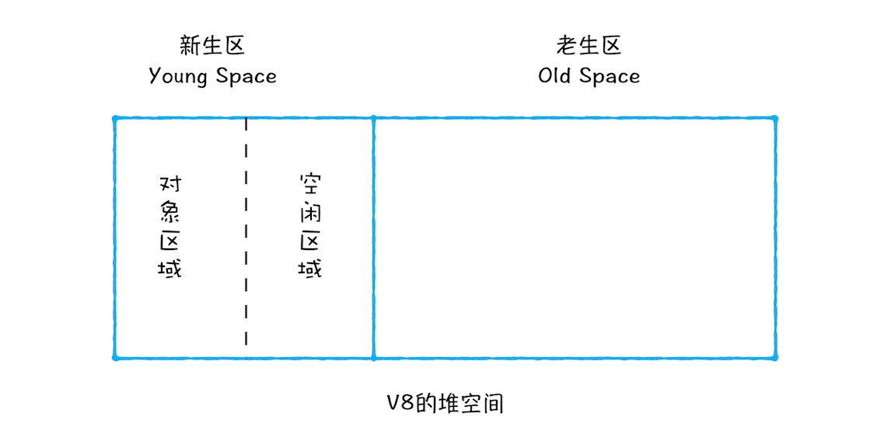

新加入的对象都会存放到对象区域，当对象区域快被写满时，就需要执行一次垃圾清理操作。

在垃圾回收过程中，首先要对对象区域中的垃圾做标记；标记完成之后，就进入垃圾清理阶段，副垃圾回收器会把这些存活的对象复制到空闲区域中，同时它还会把这些对象有序地排列起来，所以这个复制过程，也就相当于完成了内存整理操作，复制后空闲区域就没有内存碎片了。

完成复制后，对象区域与空闲区域进行角色翻转，也就是原来的对象区域变成空闲区域，原来的空闲区域变成了对象区域。这样就完成了垃圾对象的回收操作，同时这种角色翻转的操作还能让新生代中的这两块区域无限重复使用下去。

由于新生代中采用的 Scavenge 算法，所以每次执行清理操作时，都需要将存活的对象从对象区域复制到空闲区域。但复制操作需要时间成本，如果新生区空间设置得太大了，那么每次清理的时间就会过久，所以为了执行效率，一般新生区的空间会被设置得比较小。

也正是因为新生区的空间不大，所以很容易被存活的对象装满整个区域。为了解决这个问题，JavaScript 引擎采用了对象晋升策略，也就是经过两次垃圾回收依然还存活的对象，会被移动到老生区中。

## 5.4 主垃圾回收器

主垃圾回收器主要负责老生区中的垃圾回收。除了新生区中晋升的对象，一些大的对象会直接被分配到老生区。因此老生区中的对象有两个特点，一个是对象占用空间大，另一个是对象存活时间长。

由于老生区的对象比较大，若要在老生区中使用 Scavenge 算法进行垃圾回收，复制这些大的对象将会花费比较多的时间，从而导致回收执行效率不高，同时还会浪费一半的空间。因而，主垃圾回收器是采用标记 - 清除（Mark-Sweep）的算法进行垃圾回收的。下面我们来看看该算法是如何工作的。

首先是标记过程阶段。标记阶段就是从一组根元素开始，递归遍历这组根元素，在这个遍历过程中，能到达的元素称为活动对象，没有到达的元素就可以判断为垃圾数据。

接下来就是垃圾的清除过程。它和副垃圾回收器的垃圾清除过程完全不同，你可以理解这个过程是清除掉红色标记数据的过程，可参考下图大致理解下其清除过程：

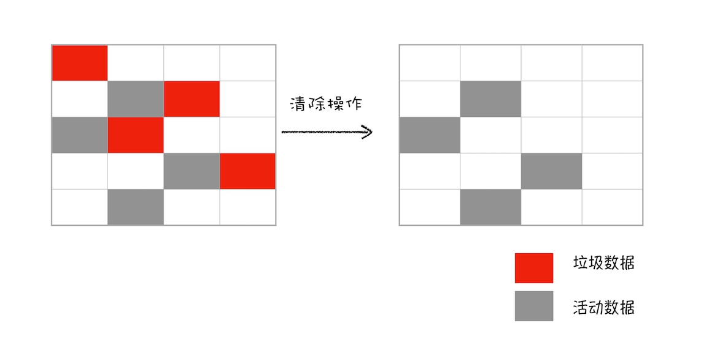

上面的标记过程和清除过程就是标记 - 清除算法，不过对一块内存多次执行标记 - 清除算法后，会产生大量不连续的内存碎片。而碎片过多会导致大对象无法分配到足够的连续内存，于是又产生了另外一种算法——标记 - 整理（Mark-Compact），这个标记过程仍然与标记 - 清除算法里的是一样的，但后续步骤不是直接对可回收对象进行清理，而是让所有存活的对象都向一端移动，然后直接清理掉端边界以外的内存。你可以参考下图：

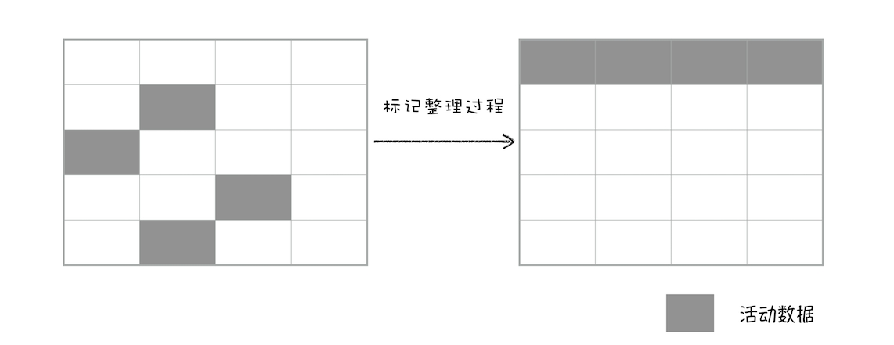

## 5.5 全停顿

现在你知道了 V8 是使用副垃圾回收器和主垃圾回收器处理垃圾回收的，不过由于 JavaScript 是运行在主线程之上的，一旦执行垃圾回收算法，都需要将正在执行的 JavaScript 脚本暂停下来，待垃圾回收完毕后再恢复脚本执行。我们把这种行为叫做全停顿（Stop-The-World）。

比如堆中的数据有 1.5GB，V8 实现一次完整的垃圾回收需要 1 秒以上的时间，这也是由于垃圾回收而引起 JavaScript 线程暂停执行的时间，若是这样的时间花销，那么应用的性能和响应能力都会直线下降。主垃圾回收器执行一次完整的垃圾回收流程如下图所示：

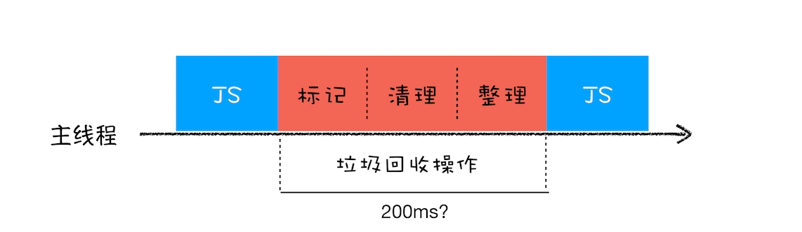

在 V8 新生代的垃圾回收中，因其空间较小，且存活对象较少，所以全停顿的影响不大，但老生代就不一样了。如果在执行垃圾回收的过程中，占用主线程时间过久，就像上面图片展示的那样，花费了 200 毫秒，在这 200 毫秒内，主线程是不能做其他事情的。比如页面正在执行一个 JavaScript 动画，因为垃圾回收器在工作，就会导致这个动画在这 200 毫秒内无法执行的，这将会造成页面的卡顿现象。

为了降低老生代的垃圾回收而造成的卡顿，V8 将标记过程分为一个个的子标记过程，同时让垃圾回收标记和 JavaScript 应用逻辑交替进行，直到标记阶段完成，我们把这个算法称为增量标记（Incremental Marking）算法。如下图所示：

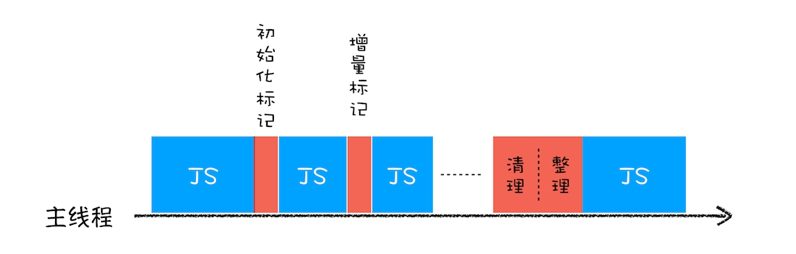

使用增量标记算法，可以把一个完整的垃圾回收任务拆分为很多小的任务，这些小的任务执行时间比较短，可以穿插在其他的 JavaScript 任务中间执行，这样当执行上述动画效果时，就不会让用户因为垃圾回收任务而感受到页面的卡顿了。

# 6. V8 编译器和解释器

## 6.1 编译器和解释器

之所以存在编译器和解释器，是因为机器不能直接理解我们所写的代码，所以在执行程序之前，需要将我们所写的代码“翻译”成机器能读懂的机器语言。按语言的执行流程，可以把语言划分为编译型语言和解释型语言。

编译型语言在程序执行之前，需要经过编译器的编译过程，并且编译之后会直接保留机器能读懂的二进制文件，这样每次运行程序时，都可以直接运行该二进制文件，而不需要再次重新编译了。比如 C/C++、GO 等都是编译型语言。

而由解释型语言编写的程序，在每次运行时都需要通过解释器对程序进行动态解释和执行。

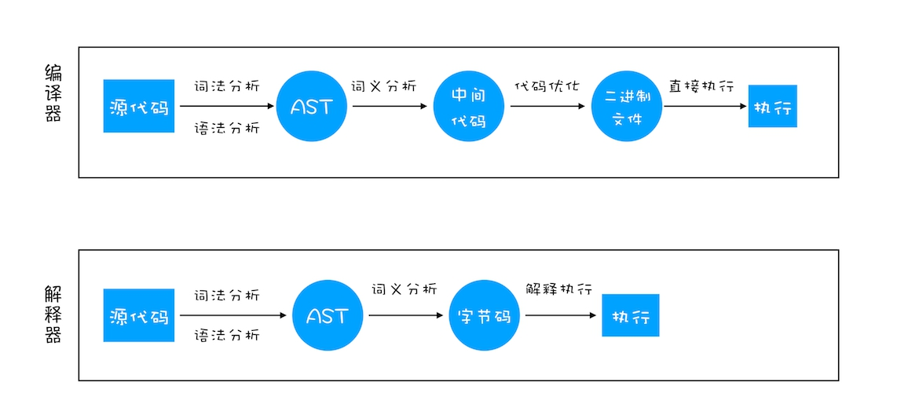

从图中你可以看出这二者的执行流程，大致可阐述为如下：

在编译型语言的编译过程中，编译器首先会依次对源代码进行词法分析、语法分析，生成抽象语法树（AST），然后是优化代码，最后再生成处理器能够理解的机器码。如果编译成功，将会生成一个可执行的文件。但如果编译过程发生了语法或者其他的错误，那么编译器就会抛出异常，最后的二进制文件也不会生成成功。

在解释型语言的解释过程中，同样解释器也会对源代码进行词法分析、语法分析，并生成抽象语法树（AST），不过它会再基于抽象语法树生成字节码，最后再根据字节码来执行程序、输出结果。

## 6.2 V8 是如何执行一段 JavaScript 代码的

V8 在执行过程中既有解释器 Ignition，又有编译器 TurboFan，那么它们是如何配合去执行一段 JavaScript 代码的呢? 下面我们就按照上图来一一分解其执行流程。


### 6.2.1 生成抽象语法树（AST）和执行上下文

将源代码转换为抽象语法树，并生成执行上下文，而执行上下文我们在前面的文章中已经介绍过很多了，主要是代码在执行过程中的环境信息。

那么下面我们就得重点讲解下抽象语法树（下面表述中就直接用它的简称 AST 了），看看什么是 AST 以及 AST 的生成过程是怎样的。

高级语言是开发者可以理解的语言，但是让编译器或者解释器来理解就非常困难了。对于编译器或者解释器来说，它们可以理解的就是 AST 了。所以无论你使用的是解释型语言还是编译型语言，在编译过程中，它们都会生成一个 AST。这和渲染引擎将 HTML 格式文件转换为计算机可以理解的 DOM 树的情况类似。

AST 是非常重要的一种数据结构，在很多项目中有着广泛的应用。其中最著名的一个项目是 Babel。Babel 是一个被广泛使用的代码转码器，可以将 ES6 代码转为 ES5 代码，这意味着你可以现在就用 ES6 编写程序，而不用担心现有环境是否支持 ES6。Babel 的工作原理就是先将 ES6 源码转换为 AST，然后再将 ES6 语法的 AST 转换为 ES5 语法的 AST，最后利用 ES5 的 AST 生成 JavaScript 源代码。

除了 Babel 外，还有 ESLint 也使用 AST。ESLint 是一个用来检查 JavaScript 编写规范的插件，其检测流程也是需要将源码转换为 AST，然后再利用 AST 来检查代码规范化的问题。

+ **生成 AST**

通常，生成 AST 需要经过两个阶段。
    + **分词（tokenize），又称为词法分析。** 其作用是将一行行的源码拆解成一个个 token。所谓token，指的是语法上不可能再分的、最小的单个字符或字符串。你可以参考下图来更好地理解什么 token。
    + **第二阶段是解析（parse），又称为语法分析。** 其作用是将上一步生成的 token 数据，根据语法规则转为 AST。如果源码符合语法规则，这一步就会顺利完成。但如果源码存在语法错误，这一步就会终止，并抛出一个“语法错误”。

这就是 AST 的生成过程，先分词，再解析。

### 6.2.2 生成字节码

有了 AST 和执行上下文后，那接下来的第二步，解释器 Ignition 就登场了，它会根据 AST 生成字节码，并解释执行字节码。

其实一开始 V8 并没有字节码，而是直接将 AST 转换为机器码，由于执行机器码的效率是非常高效的，所以这种方式在发布后的一段时间内运行效果是非常好的。但是随着 Chrome 在手机上的广泛普及，特别是运行在 512M 内存的手机上，内存占用问题也暴露出来了，因为 V8 需要消耗大量的内存来存放转换后的机器码。为了解决内存占用问题，V8 团队大幅重构了引擎架构，引入字节码，并且抛弃了之前的编译器，最终花了将进四年的时间，实现了现在的这套架构。

字节码就是介于 AST 和机器码之间的一种代码。但是与特定类型的机器码无关，字节码需要通过解释器将其转换为机器码后才能执行。

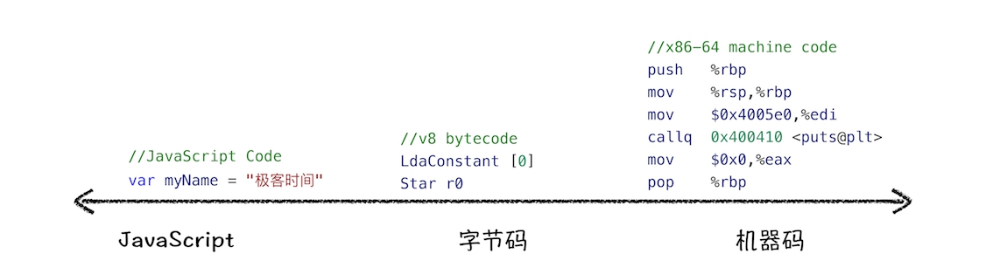

从图中可以看出，机器码所占用的空间远远超过了字节码，所以使用字节码可以减少系统的内存使用。

### 6.2.3 执行代码

生成字节码之后，接下来就要进入执行阶段了。

通常，如果有一段第一次执行的字节码，解释器 Ignition 会逐条解释执行。在执行字节码的过程中，如果发现有热点代码（HotSpot），比如一段代码被重复执行多次，这种就称为热点代码，那么后台的编译器 TurboFan 就会把该段热点的字节码编译为高效的机器码，然后当再次执行这段被优化的代码时，只需要执行编译后的机器码就可以了，这样就大大提升了代码的执行效率。

V8 的解释器和编译器的取名也很有意思。解释器 Ignition 是点火器的意思，编译器 TurboFan 是涡轮增压的意思，寓意着代码启动时通过点火器慢慢发动，一旦启动，涡轮增压介入，其执行效率随着执行时间越来越高效率，因为热点代码都被编译器 TurboFan 转换了机器码，直接执行机器码就省去了字节码“翻译”为机器码的过程。

其实字节码配合解释器和编译器是最近一段时间很火的技术，比如 Java 和 Python 的虚拟机也都是基于这种技术实现的，我们把这种技术称为即时编译（JIT）。具体到 V8，就是指解释器 Ignition 在解释执行字节码的同时，收集代码信息，当它发现某一部分代码变热了之后，TurboFan 编译器便闪亮登场，把热点的字节码转换为机器码，并把转换后的机器码保存起来，以备下次使用。

对于 JavaScript 工作引擎，除了 V8 使用了“字节码 +JIT”技术之外，苹果的 SquirrelFish Extreme 和 Mozilla 的 SpiderMonkey 也都使用了该技术。

这么多语言的工作引擎都使用了“字节码 +JIT”技术，因此理解 JIT 这套工作机制还是很有必要的。你可以结合下图看看 JIT 的工作过程：

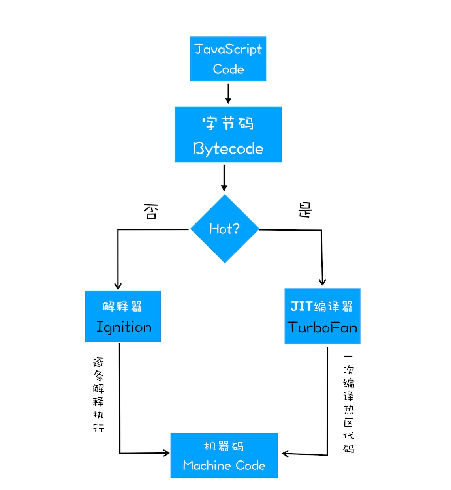

## 6.3 JavaScript 的性能优化

虽然在 V8 诞生之初，也出现过一系列针对 V8 而专门优化 JavaScript 性能的方案，比如隐藏类、内联缓存等概念都是那时候提出来的。不过随着 V8 的架构调整，你越来越不需要这些微优化策略了，相反，对于优化 JavaScript 执行效率，你应该将优化的中心聚焦在单次脚本的执行时间和脚本的网络下载上，主要关注以下三点内容：

提升单次脚本的执行速度，避免 JavaScript 的长任务霸占主线程，这样可以使得页面快速响应交互；

避免大的内联脚本，因为在解析 HTML 的过程中，解析和编译也会占用主线程；

减少 JavaScript 文件的容量，因为更小的文件会提升下载速度，并且占用更低的内存。


# 7. 消息队列和事件循环

主线程非常繁忙，既要处理 DOM，又要计算样式，还要处理布局，同时还需要处理 JavaScript 任务以及各种输入事件。要让这么多不同类型的任务在主线程中有条不紊地执行，这就需要一个系统来统筹调度这些任务，这个统筹调度系统就是我们今天要讲的消息队列和事件循环系统。

## 7.1 在线程运行过程中处理新任务

并不是所有的任务都是在执行之前统一安排好的，大部分情况下，新的任务是在线程运行过程中产生的。

要想在线程运行过程中，能接收并执行新的任务，就需要采用事件循环机制。

## 7.2 处理其他线程发送过来的任务

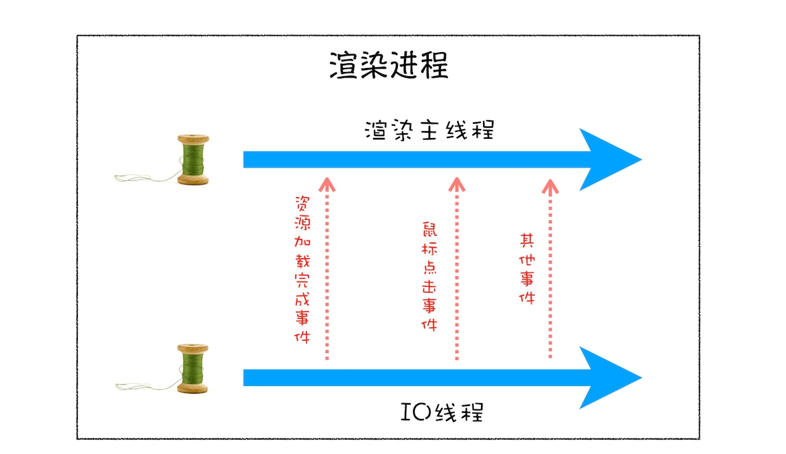

从上图可以看出，渲染主线程会频繁接收到来自于 IO 线程的一些任务，接收到这些任务之后，渲染进程就需要着手处理，比如接收到资源加载完成的消息后，渲染进程就要着手进行 DOM 解析了；接收到鼠标点击的消息后，渲染主线程就要开始执行相应的 JavaScript 脚本来处理该点击事件。

那么如何设计好一个线程模型，能让其能够接收其他线程发送的消息呢？

一个通用模式是使用消息队列。在解释如何实现之前，我们先说说什么是消息队列，可以参考下图：

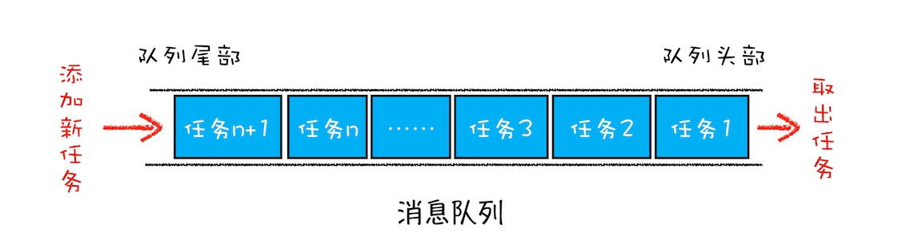

从图中可以看出，消息队列是一种数据结构，可以存放要执行的任务。它符合队列“先进先出”的特点，也就是说要添加任务的话，添加到队列的尾部；要取出任务的话，从队列头部去取。

有了队列之后，我们就可以继续改造线程模型了，改造方案如下图所示：


从上图可以看出，我们的改造可以分为下面三个步骤：

+ 添加一个消息队列；
+ IO 线程中产生的新任务添加进消息队列尾部；
+ 渲染主线程会循环地从消息队列头部中读取任务，执行任务。

有了这些步骤之后，那么接下来我们就可以按步骤使用代码来实现第三版的线程模型。

首先，构造一个队列。当然，在本篇文章中我们不需要考虑队列实现的细节，只是构造队列的接口：

```c++
class TaskQueue{

  public:

  Task takeTask(); // 取出队列头部的一个任务

  void pushTask(Task task); // 添加一个任务到队列尾部

};
```

接下来，改造主线程，让主线程从队列中读取任务：

```c++
TaskQueue task_queue；

void ProcessTask();

void MainThread(){

  for(;;){

    Task task = task_queue.takeTask();

    ProcessTask(task);

  }

}
```

在上面的代码中，我们添加了一个消息队列的对象，然后在主线程的 for 循环代码块中，从消息队列中读取一个任务，然后执行该任务，主线程就这样一直循环往下执行，因此只要消息队列中有任务，主线程就会去执行。

主线程的代码就这样改造完成了。这样改造后，主线程执行的任务都全部从消息队列中获取。所以如果有其他线程想要发送任务让主线程去执行，只需要将任务添加到该消息队列中就可以了，添加任务的代码如下：

```c++
Task clickTask;

task_queue.pushTask(clickTask)
```

由于是多个线程操作同一个消息队列，所以在添加任务和取出任务时还会加上一个同步锁，这块内容你也要注意下。

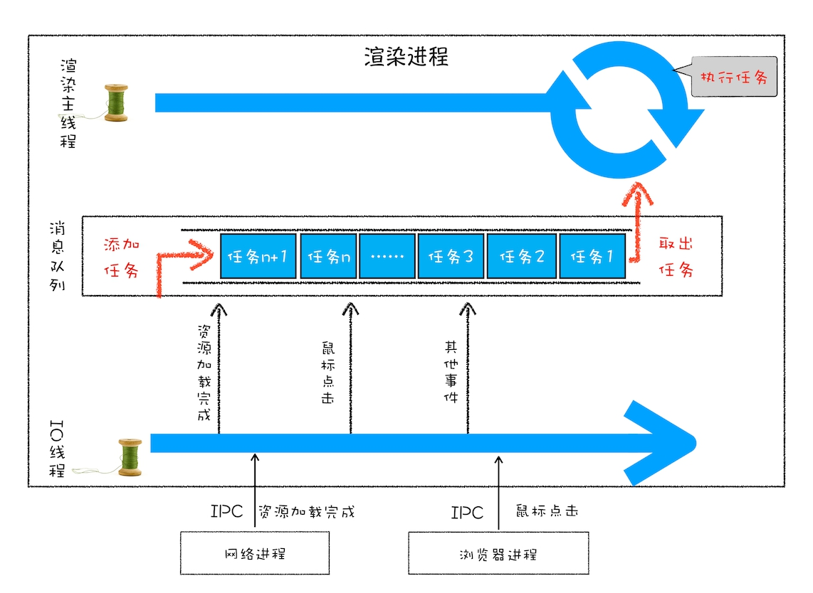

从图中可以看出，渲染进程专门有一个 IO 线程用来接收其他进程传进来的消息，接收到消息之后，会将这些消息组装成任务发送给渲染主线程，后续的步骤就和前面讲解的“处理其他线程发送的任务”一样了，这里就不再重复了。

## 7.3 消息队列中的任务类型

现在你知道页面主线程是如何接收外部任务的了，那接下来我们再来看看消息队列中的任务类型有哪些。你可以参考下Chromium 的官方源码，这里面包含了很多内部消息类型，如输入事件（鼠标滚动、点击、移动）、微任务、文件读写、WebSocket、JavaScript 定时器等等。

除此之外，消息队列中还包含了很多与页面相关的事件，如 JavaScript 执行、解析 DOM、样式计算、布局计算、CSS 动画等。

## 7.4 如何安全退出

当页面主线程执行完成之后，又该如何保证页面主线程能够安全退出呢？Chrome 是这样解决的，确定要退出当前页面时，页面主线程会设置一个退出标志的变量，在每次执行完一个任务时，判断是否有设置退出标志。

如果设置了，那么就直接中断当前的所有任务，退出线程，你可以参考下面代码：

## 7.5 页面使用单线程的缺点

+ **第一个问题是如何处理高优先级的任务。**

如果 DOM 发生变化，采用同步通知的方式，会影响当前任务的执行效率；如果采用异步方式，又会影响到监控的实时性。

针对这种情况，微任务就应用而生了，下面我们来看看微任务是如何权衡效率和实时性的。

通常我们把消息队列中的任务称为宏任务，每个宏任务中都包含了一个微任务队列，在执行宏任务的过程中，如果 DOM 有变化，那么就会将该变化添加到微任务列表中，这样就不会影响到宏任务的继续执行，因此也就解决了执行效率的问题。

等宏任务中的主要功能都直接完成之后，这时候，渲染引擎并不着急去执行下一个宏任务，而是执行当前宏任务中的微任务，因为 DOM 变化的事件都保存在这些微任务队列中，这样也就解决了实时性问题。

+ **第二个是如何解决单个任务执行时长过久的问题**

因为所有的任务都是在单线程中执行的，所以每次只能执行一个任务，而其他任务就都处于等待状态。如果其中一个任务执行时间过久，那么下一个任务就要等待很长时间。可以参考下图：

从图中你可以看到，如果在执行动画过程中，其中有个 JavaScript 任务因执行时间过久，占用了动画单帧的时间，这样会给用户制造了卡顿的感觉，这当然是极不好的用户体验。针对这种情况，JavaScript 可以通过回调功能来规避这种问题，也就是让要执行的 JavaScript 任务滞后执行。

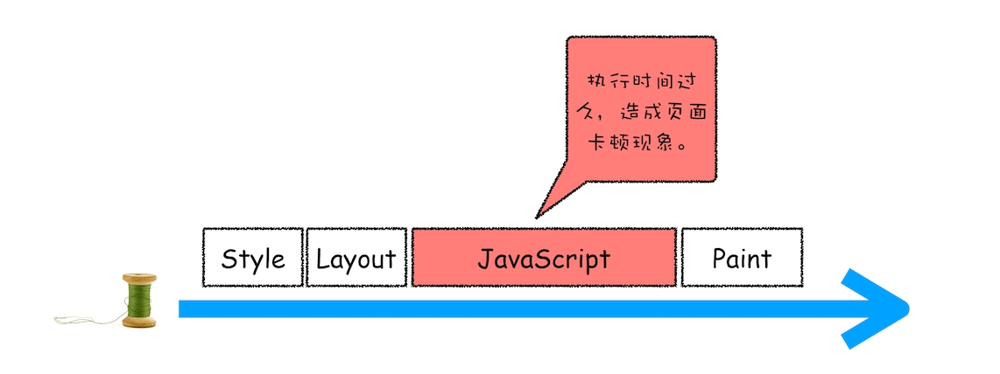

## 7.6 实践：浏览器页面是如何运行的

可以打开开发者工具，点击“Performance”标签，选择左上角的“start porfiling and load page”来记录整个页面加载过程中的事件执行情况，如下图所示：


从图中可以看出，我们点击展开了 Main 这个项目，其记录了主线程执行过程中的所有任务。图中灰色的就是一个个任务，每个任务下面还有子任务，其中的 Parse HTML 任务，是把 HTML 解析为 DOM 的任务。值得注意的是，在执行 Parse HTML 的时候，如果遇到 JavaScript 脚本，那么会暂停当前的 HTML 解析而去执行 JavaScript 脚本。

# 8. setTimeout

## 8.1 浏览器怎么实现 setTimeout

要了解定时器的工作原理，就得先来回顾下之前讲的事件循环系统，我们知道渲染进程中所有运行在主线程上的任务都需要先添加到消息队列，然后事件循环系统再按照顺序执行消息队列中的任务。下面我们来看看那些典型的事件：


当接收到 HTML 文档数据，渲染引擎就会将“解析 DOM”事件添加到消息队列中，

当用户改变了 Web 页面的窗口大小，渲染引擎就会将“重新布局”的事件添加到消息队列中。

当触发了 JavaScript 引擎垃圾回收机制，渲染引擎会将“垃圾回收”任务添加到消息队列中。

同样，如果要执行一段异步 JavaScript 代码，也是需要将执行任务添加到消息队列中。

以上列举的只是一小部分事件，这些事件被添加到消息队列之后，事件循环系统就会按照消息队列中的顺序来执行事件。

所以说要执行一段异步任务，需要先将任务添加到消息队列中。不过通过定时器设置回调函数有点特别，它们需要在指定的时间间隔内被调用，但消息队列中的任务是按照顺序执行的，所以为了保证回调函数能在指定时间内执行，你不能将定时器的回调函数直接添加到消息队列中。

那么该怎么设计才能让定时器设置的回调事件在规定时间内被执行呢？你也可以思考下，如果让你在消息循环系统的基础之上加上定时器的功能，你会如何设计？

在 Chrome 中除了正常使用的消息队列之外，还有另外一个消息队列，这个队列中维护了需要延迟执行的任务列表，包括了定时器和 Chromium 内部一些需要延迟执行的任务。所以当通过 JavaScript 创建一个定时器时，渲染进程会将该定时器的回调任务添加到延迟队列中。

当通过 JavaScript 调用 setTimeout 设置回调函数的时候，渲染进程将会创建一个回调任务，创建好回调任务之后，再将该任务添加到延迟执行队列中。

```c++
void ProcessTimerTask(){

  // 从 delayed_incoming_queue 中取出已经到期的定时器任务

  // 依次执行这些任务

}

TaskQueue task_queue；

void ProcessTask();

bool keep_running = true;

void MainTherad(){

  for(;;){

    // 执行消息队列中的任务

    Task task = task_queue.takeTask();

    ProcessTask(task);

    

    // 执行延迟队列中的任务

    ProcessDelayTask()

 

    if(!keep_running) // 如果设置了退出标志，那么直接退出线程循环

        break; 

  }

}
```

从上面代码可以看出来，我们添加了一个ProcessDelayTask 函数，该函数是专门用来处理延迟执行任务的。这里我们要重点关注它的执行时机，在上段代码中，处理完消息队列中的一个任务之后，就开始执行 ProcessDelayTask 函数。ProcessDelayTask 函数会根据发起时间和延迟时间计算出到期的任务，然后依次执行这些到期的任务。等到期的任务执行完成之后，再继续下一个循环过程。通过这样的方式，一个完整的定时器就实现了。

设置一个定时器，JavaScript 引擎会返回一个定时器的 ID。那通常情况下，当一个定时器的任务还没有被执行的时候，也是可以取消的，具体方法是调用clearTimeout 函数，并传入需要取消的定时器的 ID。

其实浏览器内部实现取消定时器的操作也是非常简单的，就是直接从 delayed_incoming_queue 延迟队列中，通过 ID 查找到对应的任务，然后再将其从队列中删除掉就可以了。

## 8.2 使用 setTimeout 的一些注意事项

+ **如果当前任务执行时间过久，会影延迟到期定时器任务的执行**

在使用 setTimeout 的时候，有很多因素会导致回调函数执行比设定的预期值要久，其中一个就是当前任务执行时间过久从而导致定时器设置的任务被延后执行。

+ **如果 setTimeout 存在嵌套调用，那么系统会设置最短时间间隔为 4 毫秒**

+ **未激活的页面，setTimeout 执行最小间隔是 1000 毫秒**

未被激活的页面中定时器最小值大于 1000 毫秒，也就是说，如果标签不是当前的激活标签，那么定时器最小的时间间隔是 1000 毫秒，目的是为了优化后台页面的加载损耗以及降低耗电量。

+ **延时执行时间有最大值**

除了要了解定时器的回调函数时间比实际设定值要延后之外，还有一点需要注意下，那就是 Chrome、Safari、Firefox 都是以 32 个 bit 来存储延时值的，32bit 最大只能存放的数字是 2147483647 毫秒，这就意味着，如果 setTimeout 设置的延迟值大于 2147483647 毫秒（大约 24.8 天）时就会溢出，这导致定时器会被立即执行。

+ **使用 setTimeout 设置的回调函数中的 this 不符合直觉**

如果被 setTimeout 推迟执行的回调函数是某个对象的方法，那么该方法中的 this 关键字将指向全局环境，而不是定义时所在的那个对象。

# 9. 宏任务和微任务

## 9.1 主线程上执行的任务

+ 渲染事件（如解析 DOM、计算布局、绘制）；
+ 用户交互事件（如鼠标点击、滚动页面、放大缩小等）；
+ JavaScript 脚本执行事件；
+ 网络请求完成、文件读写完成事件。

为了协调这些任务有条不紊地在主线程上执行，页面进程引入了消息队列和事件循环机制，渲染进程内部会维护多个消息队列，比如延迟执行队列和普通的消息队列。然后主线程采用一个 for 循环，不断地从这些任务队列中取出任务并执行任务。我们把这些消息队列中的任务称为宏任务。

## 9.2 宏任务

消息队列中的任务是通过事件循环系统来执行的

WHATWG 规范定义的大致流程：

+ 先从多个消息队列中选出一个最老的任务，这个任务称为 oldestTask；
+ 然后循环系统记录任务开始执行的时间，并把这个 oldestTask 设置为当前正在执行的任务；
+ 当任务执行完成之后，删除当前正在执行的任务，并从对应的消息队列中删除掉这个 oldestTask；
+ 最后统计执行完成的时长等信息。

## 9.3 微任务

+ 异步回调主要有两种方式

第一种是把异步回调函数封装成一个宏任务，添加到消息队列尾部，当循环系统执行到该任务的时候执行回调函数。这种比较好理解，我们前面介绍的 setTimeout 和 XMLHttpRequest 的回调函数都是通过这种方式来实现的。

第二种方式的执行时机是在主函数执行结束之后、当前宏任务结束之前执行回调函数，这通常都是以微任务形式体现的。

**微任务就是一个需要异步执行的函数，执行时机是在主函数执行结束之后、当前宏任务结束之前。**

当 JavaScript 执行一段脚本的时候，V8 会为其创建一个全局执行上下文，在创建全局执行上下文的同时，V8 引擎也会在内部创建一个微任务队列。顾名思义，这个微任务队列就是用来存放微任务的，因为在当前宏任务执行的过程中，有时候会产生多个微任务，这时候就需要使用这个微任务队列来保存这些微任务了。不过这个微任务队列是给 V8 引擎内部使用的，所以你是无法通过 JavaScript 直接访问的。

也就是说每个宏任务都关联了一个微任务队列。那么接下来，我们就需要分析两个重要的时间点——微任务产生的时机和执行微任务队列的时机。

我们先来看看微任务是怎么产生的？在现代浏览器里面，产生微任务有两种方式。

第一种方式是使用 MutationObserver 监控某个 DOM 节点，然后再通过 JavaScript 来修改这个节点，或者为这个节点添加、删除部分子节点，当 DOM 节点发生变化时，就会产生 DOM 变化记录的微任务。

第二种方式是使用 Promise，当调用 Promise.resolve() 或者 Promise.reject() 的时候，也会产生微任务。

通过 DOM 节点变化产生的微任务或者使用 Promise 产生的微任务都会被 JavaScript 引擎按照顺序保存到微任务队列中。

好了，现在微任务队列中有了微任务了，那接下来就要看看微任务队列是何时被执行的。

通常情况下，在当前宏任务中的 JavaScript 快执行完成时，也就在 JavaScript 引擎准备退出全局执行上下文并清空调用栈的时候，JavaScript 引擎会检查全局执行上下文中的微任务队列，然后按照顺序执行队列中的微任务。WHATWG 把执行微任务的时间点称为检查点。当然除了在退出全局执行上下文式这个检查点之外，还有其他的检查点，不过不是太重要，这里就不做介绍了。

如果在执行微任务的过程中，产生了新的微任务，同样会将该微任务添加到微任务队列中，V8 引擎一直循环执行微任务队列中的任务，直到队列为空才算执行结束。也就是说在执行微任务过程中产生的新的微任务并不会推迟到下个宏任务中执行，而是在当前的宏任务中继续执行。

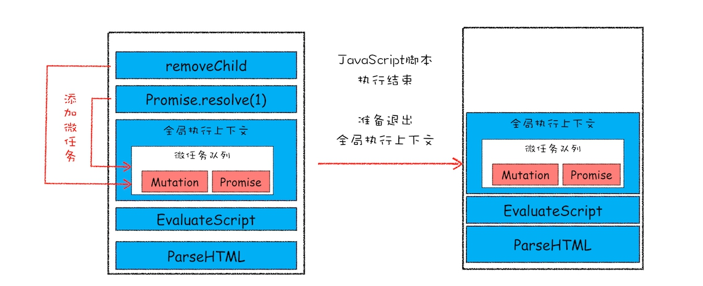

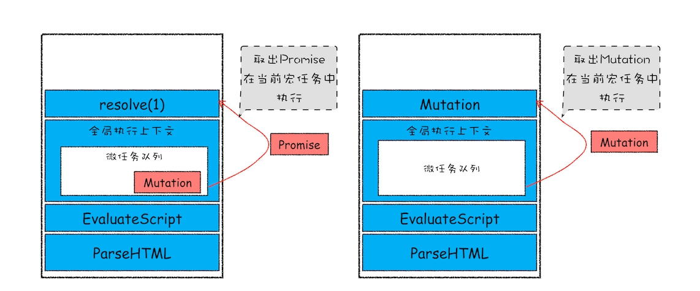

该示意图是在执行一个 ParseHTML 的宏任务，在执行过程中，遇到了 JavaScript 脚本，那么就暂停解析流程，进入到 JavaScript 的执行环境。从图中可以看到，全局上下文中包含了微任务列表。

在 JavaScript 脚本的后续执行过程中，分别通过 Promise 和 removeChild 创建了两个微任务，并被添加到微任务列表中。接着 JavaScript 执行结束，准备退出全局执行上下文，这时候就到了检查点了，JavaScript 引擎会检查微任务列表，发现微任务列表中有微任务，那么接下来，依次执行这两个微任务。等微任务队列清空之后，就退出全局执行上下文。

+ 结论

微任务和宏任务是绑定的，每个宏任务在执行时，会创建自己的微任务队列。

微任务的执行时长会影响到当前宏任务的时长。比如一个宏任务在执行过程中，产生了 100 个微任务，执行每个微任务的时间是 10 毫秒，那么执行这 100 个微任务的时间就是 1000 毫秒，也可以说这 100 个微任务让宏任务的执行时间延长了 1000 毫秒。所以你在写代码的时候一定要注意控制微任务的执行时长。

在一个宏任务中，分别创建一个用于回调的宏任务和微任务，无论什么情况下，微任务都早于宏任务执行。

## 9.4 监听 DOM 变化方法演变

现在知道了微任务是怎么工作的，那接下来我们再来看看微任务是如何应用在 MutationObserver 中的。MutationObserver 是用来监听 DOM 变化的一套方法，而监听 DOM 变化一直是前端工程师一项非常核心的需求。

比如许多 Web 应用都利用 HTML 与 JavaScript 构建其自定义控件，与一些内置控件不同，这些控件不是固有的。为了与内置控件一起良好地工作，这些控件必须能够适应内容更改、响应事件和用户交互。因此，Web 应用需要监视 DOM 变化并及时地做出响应。

虽然监听 DOM 的需求是如此重要，不过早期页面并没有提供对监听的支持，所以那时要观察 DOM 是否变化，唯一能做的就是轮询检测，比如使用 setTimeout 或者 setInterval 来定时检测 DOM 是否有改变。这种方式简单粗暴，但是会遇到两个问题：如果时间间隔设置过长，DOM 变化响应不够及时；反过来如果时间间隔设置过短，又会浪费很多无用的工作量去检查 DOM，会让页面变得低效。

直到 2000 年的时候引入了 Mutation Event，Mutation Event 采用了观察者的设计模式，当 DOM 有变动时就会立刻触发相应的事件，这种方式属于同步回调。

采用 Mutation Event 解决了实时性的问题，因为 DOM 一旦发生变化，就会立即调用 JavaScript 接口。但也正是这种实时性造成了严重的性能问题，因为每次 DOM 变动，渲染引擎都会去调用 JavaScript，这样会产生较大的性能开销。比如利用 JavaScript 动态创建或动态修改 50 个节点内容，就会触发 50 次回调，而且每个回调函数都需要一定的执行时间，这里我们假设每次回调的执行时间是 4 毫秒，那么 50 次回调的执行时间就是 200 毫秒，若此时浏览器正在执行一个动画效果，由于 Mutation Event 触发回调事件，就会导致动画的卡顿。

也正是因为使用 Mutation Event 会导致页面性能问题，所以 Mutation Event 被反对使用，并逐步从 Web 标准事件中删除了。

为了解决了 Mutation Event 由于同步调用 JavaScript 而造成的性能问题，从 DOM4 开始，推荐使用 MutationObserver 来代替 Mutation Event。MutationObserver API 可以用来监视 DOM 的变化，包括属性的变化、节点的增减、内容的变化等。

那么相比较 Mutation Event，MutationObserver 到底做了哪些改进呢？

首先，MutationObserver 将响应函数改成异步调用，可以不用在每次 DOM 变化都触发异步调用，而是等多次 DOM 变化后，一次触发异步调用，并且还会使用一个数据结构来记录这期间所有的 DOM 变化。这样即使频繁地操纵 DOM，也不会对性能造成太大的影响。

我们通过异步调用和减少触发次数来缓解了性能问题，那么如何保持消息通知的及时性呢？如果采用 setTimeout 创建宏任务来触发回调的话，那么实时性就会大打折扣，因为上面我们分析过，在两个任务之间，可能会被渲染进程插入其他的事件，从而影响到响应的实时性。

这时候，微任务就可以上场了，在每次 DOM 节点发生变化的时候，渲染引擎将变化记录封装成微任务，并将微任务添加进当前的微任务队列中。这样当执行到检查点的时候，V8 引擎就会按照顺序执行微任务了。

综上所述， MutationObserver 采用了“异步 + 微任务”的策略。

+ 通过异步操作解决了同步操作的性能问题；
+ 通过微任务解决了实时性的问题。


## 问题
+ **head头部引入的js文件，也是先编译的吗？**

先来解释下页面在含有JavaScript的情况下DOM解析流程，然后再来解释你这个问题。

当从服务器接收HTML页面的第一批数据时，DOM解析器就开始工作了，在解析过程中，如果遇到了JS脚本，如下所示：

```html
<html>
    <body>
        极客时间
        <script>
        document.write("--foo")
        </script>
    </body>
</html>
```

那么DOM解析器会先执行JavaScript脚本，执行完成之后，再继续往下解析。

那么第二种情况复杂点了，我们内联的脚本替换成js外部文件，如下所示：

```html
<html>
    <body>
        极客时间
        <script type="text/javascript" src="foo.js"></script>
    </body>
</html>
```

这种情况下，当解析到JavaScript的时候，会先暂停DOM解析，并下载foo.js文件，下载完成之后执行该段JS文件，然后再继续往下解析DOM。这就是JavaScript文件为什么会阻塞DOM渲染。

我们再看第三种情况，还是看下面代码：

```html
<html>
    <head>
        <style type="text/css" src = "theme.css" />
    </head>
    <body>
        <p>极客时间</p>
        <script>
            let e = document.getElementsByTagName('p')[0]
            e.style.color = 'blue'
        </script>
    </body>
</html>
```

当我在JavaScript中访问了某个元素的样式，那么这时候就需要等待这个样式被下载完成才能继续往下执行，所以在这种情况下，CSS也会阻塞DOM的解析。

所以这时候如果头部包含了js文件，那么同样也会暂停DOM解析，等带该JavaScript文件下载后，便开始编译执行该文件，执行结束之后，才开始继续DOM解析。

+ **在编译完成之后是单单生成了字节码，再到执行过程中变成对应平台的机器码？ 还是编译过程已经生成了对应平台的机器码， 执行阶段就直接去执行相应的机器码？**

先是生成字节码，然后解释器可以直接执行字节码，输出结果。 但是通常Javascript还有个编译器，会把那些频繁执行的字节码编译为二进制，这样那些经常被运行的函数就可以快速执行了，通常又把这种解释器和编译器混合使用的技术称为JIT
