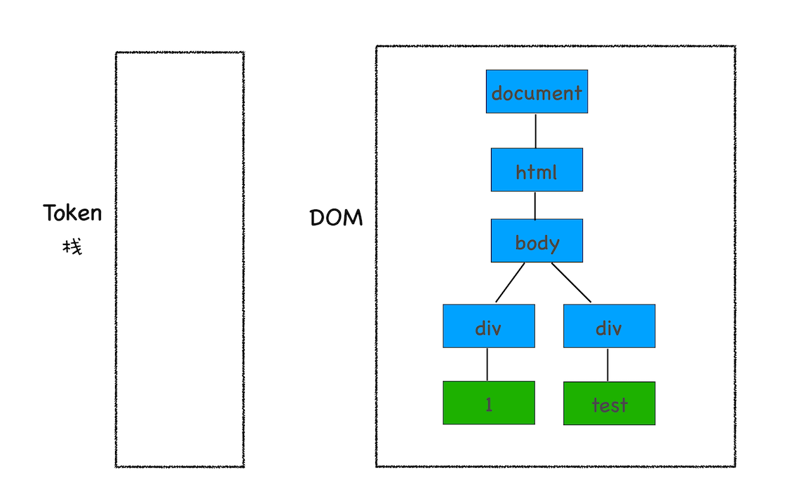
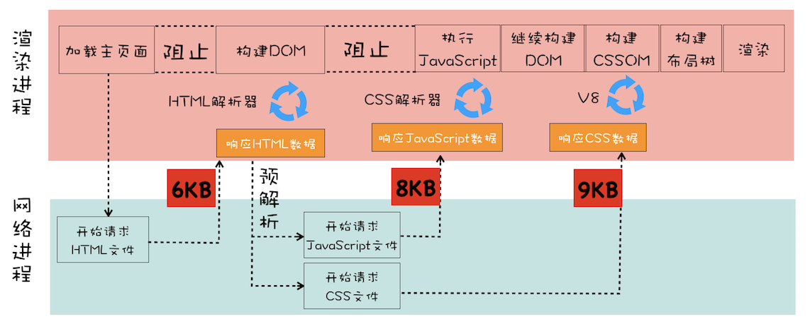

# 1. Chrome 面板功能


## 1.1 优化时间线上耗时项

+ 排队（Queuing）时间过久

排队时间过久，大概率是由浏览器为每个域名最多维护 6 个连接导致的。那么基于这个原因，你就可以让 1 个站点下面的资源放在多个域名下面，比如放到 3 个域名下面，这样就可以同时支持 18 个连接了，这种方案称为域名分片技术。除了域名分片技术外，我个人还建议你把站点升级到 HTTP2，因为 HTTP2 已经没有每个域名最多维护 6 个 TCP 连接的限制了。

+ 第一字节时间（TTFB）时间过久

这可能的原因有如下：

服务器生成页面数据的时间过久。对于动态网页来说，服务器收到用户打开一个页面的请求时，首先要从数据库中读取该页面需要的数据，然后把这些数据传入到模板中，模板渲染后，再返回给用户。服务器在处理这个数据的过程中，可能某个环节会出问题。

网络的原因。比如使用了低带宽的服务器，或者本来用的是电信的服务器，可联通的网络用户要来访问你的服务器，这样也会拖慢网速。

发送请求头时带上了多余的用户信息。比如一些不必要的 Cookie 信息，服务器接收到这些 Cookie 信息之后可能需要对每一项都做处理，这样就加大了服务器的处理时长。

对于这三种问题，你要有针对性地出一些解决方案。面对第一种服务器的问题，你可以想办法去提高服务器的处理速度，比如通过增加各种缓存的技术；针对第二种网络问题，你可以使用 CDN 来缓存一些静态文件；至于第三种，你在发送请求时就去尽可能地减少一些不必要的 Cookie 数据信息。

+ Content Download 时间过久

如果单个请求的 Content Download 花费了大量时间，有可能是字节数太多的原因导致的。这时候你就需要减少文件大小，比如压缩、去掉源码中不必要的注释等方法。

# 2. DOM 树

## 2.1 什么是 DOM

从页面的视角来看，DOM 是生成页面的基础数据结构。

从 JavaScript 脚本视角来看，DOM 提供给 JavaScript 脚本操作的接口，通过这套接口，JavaScript 可以对 DOM 结构进行访问，从而改变文档的结构、样式和内容。

从安全视角来看，DOM 是一道安全防护线，一些不安全的内容在 DOM 解析阶段就被拒之门外了。

## 2.2 DOM 树如何生成

在渲染引擎内部，有一个叫HTML 解析器（HTMLParser）的模块，它的职责就是负责将 HTML 字节流转换为 DOM 结构。所以这里我们需要先要搞清楚 HTML 解析器是怎么工作的。

在开始介绍 HTML 解析器之前，我要先解释一个大家在留言区问到过好多次的问题：HTML 解析器是等整个 HTML 文档加载完成之后开始解析的，还是随着 HTML 文档边加载边解析的？

在这里我统一解答下，HTML 解析器并不是等整个文档加载完成之后再解析的，而是网络进程加载了多少数据，HTML 解析器便解析多少数据。

那详细的流程是怎样的呢？网络进程接收到响应头之后，会根据响应头中的 content-type 字段来判断文件的类型，比如 content-type 的值是“text/html”，那么浏览器就会判断这是一个 HTML 类型的文件，然后为该请求选择或者创建一个渲染进程。渲染进程准备好之后，网络进程和渲染进程之间会建立一个共享数据的管道，网络进程接收到数据后就往这个管道里面放，而渲染进程则从管道的另外一端不断地读取数据，并同时将读取的数据“喂”给 HTML 解析器。你可以把这个管道想象成一个“水管”，网络进程接收到的字节流像水一样倒进这个“水管”，而“水管”的另外一端是渲染进程的 HTML 解析器，它会动态接收字节流，并将其解析为 DOM。

解答完这个问题之后，接下来我们就可以来详细聊聊 DOM 的具体生成流程了。


## 2.3 字节流转换为 DOM 需要三个阶段。
+ **第一个阶段，通过分词器将字节流转换为 Token。**


由图可以看出，Tag Token 又分 StartTag 和 EndTag，比如<body>就是 StartTag ，</body>就是EndTag，分别对于图中的蓝色和红色块，文本 Token 对应的绿色块。

至于后续的第二个和第三个阶段是同步进行的，需要将 Token 解析为 DOM 节点，并将 DOM 节点添加到 DOM 树中。

HTML 解析器维护了一个Token 栈结构，该 Token 栈主要用来计算节点之间的父子关系，在第一个阶段中生成的 Token 会被按照顺序压到这个栈中。具体的处理规则如下所示：

如果压入到栈中的是StartTag Token，HTML 解析器会为该 Token 创建一个 DOM 节点，然后将该节点加入到 DOM 树中，它的父节点就是栈中相邻的那个元素生成的节点。

如果分词器解析出来是文本 Token，那么会生成一个文本节点，然后将该节点加入到 DOM 树中，文本 Token 是不需要压入到栈中，它的父节点就是当前栈顶 Token 所对应的 DOM 节点。

如果分词器解析出来的是EndTag 标签，比如是 EndTag div，HTML 解析器会查看 Token 栈顶的元素是否是 StarTag div，如果是，就将 StartTag div 从栈中弹出，表示该 div 元素解析完成。

通过分词器产生的新 Token 就这样不停地压栈和出栈，整个解析过程就这样一直持续下去，直到分词器将所有字节流分词完成。

```html
<html>

<body>

    <div>1</div>

    <div>test</div>

</body>

</html>
```

这段代码以字节流的形式传给了 HTML 解析器，经过分词器处理，解析出来的第一个 Token 是 StartTag html，解析出来的 Token 会被压入到栈中，并同时创建一个 html 的 DOM 节点，将其加入到 DOM 树中。

这里需要补充说明下，HTML 解析器开始工作时，会默认创建了一个根为 document 的空 DOM 结构，同时会将一个 StartTag document 的 Token 压入栈底。然后经过分词器解析出来的第一个 StartTag html Token 会被压入到栈中，并创建一个 html 的 DOM 节点，添加到 document 上，如下图所示：


然后按照同样的流程解析出来 StartTag body 和 StartTag div，其 Token 栈和 DOM 的状态如下图所示：


接下来解析出来的是第一个 div 的文本 Token，渲染引擎会为该 Token 创建一个文本节点，并将该 Token 添加到 DOM 中，它的父节点就是当前 Token 栈顶元素对应的节点，如下图所示：


再接下来，分词器解析出来第一个 EndTag div，这时候 HTML 解析器会去判断当前栈顶的元素是否是 StartTag div，如果是则从栈顶弹出 StartTag div，如下图所示：


按照同样的规则，一路解析，最终结果如下图所示：



通过上面的介绍，相信你已经清楚 DOM 是怎么生成的了。不过在实际生产环境中，HTML 源文件中既包含 CSS 和 JavaScript，又包含图片、音频、视频等文件，所以处理过程远比上面这个示范 Demo 复杂。不过理解了这个简单的 Demo 生成过程，我们就可以往下分析更加复杂的场景了。

## 2.4 JavaScript 是如何影响 DOM 生成的

```html
<html>

<body>

    <div>1</div>

    <script>

    let div1 = document.getElementsByTagName('div')[0]

    div1.innerText = 'time.geekbang'

    </script>

    <div>test</div>

</body>

</html>
```

在两段 div 中间插入了一段 JavaScript 脚本，这段脚本的解析过程就有点不一样了。<script>标签之前，所有的解析流程还是和之前介绍的一样，但是解析到<script>标签时，渲染引擎判断这是一段脚本，此时 HTML 解析器就会暂停 DOM 的解析，因为接下来的 JavaScript 可能要修改当前已经生成的 DOM 结构。

通过前面 DOM 生成流程分析，我们已经知道当解析到 script 脚本标签时，其 DOM 树结构如下所示：


这时候 HTML 解析器暂停工作，JavaScript 引擎介入，并执行 script 标签中的这段脚本，因为这段 JavaScript 脚本修改了 DOM 中第一个 div 中的内容，所以执行这段脚本之后，div 节点内容已经修改为 time.geekbang 了。脚本执行完成之后，HTML 解析器恢复解析过程，继续解析后续的内容，直至生成最终的 DOM。

除了在页面中直接内嵌 JavaScript 脚本之外，我们还通常需要在页面中引入 JavaScript 文件，这个解析过程就稍微复杂了些，

这段代码的功能还是和前面那段代码是一样的，不过这里我把内嵌 JavaScript 脚本修改成了通过 JavaScript 文件加载。其整个执行流程还是一样的，执行到 JavaScript 标签时，暂停整个 DOM 的解析，执行 JavaScript 代码，不过这里执行 JavaScript 时，需要先下载这段 JavaScript 代码。这里需要重点关注下载环境，因为JavaScript 文件的下载过程会阻塞 DOM 解析，而通常下载又是非常耗时的，会受到网络环境、JavaScript 文件大小等因素的影响。

不过 Chrome 浏览器做了很多优化，其中一个主要的优化是预解析操作。当渲染引擎收到字节流之后，会开启一个预解析线程，用来分析 HTML 文件中包含的 JavaScript、CSS 等相关文件，解析到相关文件之后，预解析线程会提前下载这些文件。

再回到 DOM 解析上，我们知道引入 JavaScript 线程会阻塞 DOM，不过也有一些相关的策略来规避，比如使用 CDN 来加速 JavaScript 文件的加载，压缩 JavaScript 文件的体积。另外，如果 JavaScript 文件中没有操作 DOM 相关代码，就可以将该 JavaScript 脚本设置为异步加载，通过 async 或 defer 来标记代码，使用方式如下所示：

async 和 defer 虽然都是异步的，不过还有一些差异，使用 async 标志的脚本文件一旦加载完成，会立即执行；而使用了 defer 标记的脚本文件，需要在 DOMContentLoaded 事件之前执行。

JavaScript 引擎在解析 JavaScript 之前，是不知道 JavaScript 是否操纵了 CSSOM 的，所以渲染引擎在遇到 JavaScript 脚本时，不管该脚本是否操纵了 CSSOM，都会执行 CSS 文件下载，解析操作，再执行 JavaScript 脚本。

所以说 JavaScript 脚本是依赖样式表的，这又多了一个阻塞过程。

通过上面的分析，我们知道了 JavaScript 会阻塞 DOM 生成，而样式文件又会阻塞 JavaScript 的执行，所以在实际的工程中需要重点关注 JavaScript 文件和样式表文件，使用不当会影响到页面性能的。

# 3. 渲染流水线：CSS如何影响首次加载时的白屏时间？


下面我们结合上图来分析这个页面文件的渲染流水线。

首先是发起主页面的请求，这个发起请求方可能是渲染进程，也有可能是浏览器进程，发起的请求被送到网络进程中去执行。网络进程接收到返回的 HTML 数据之后，将其发送给渲染进程，渲染进程会解析 HTML 数据并构建 DOM。这里你需要特别注意下，请求 HTML 数据和构建 DOM 中间有一段空闲时间，这个空闲时间有可能成为页面渲染的瓶颈。

当渲染进程接收 HTML 文件字节流时，会先开启一个预解析线程，如果遇到 JavaScript 文件或者 CSS 文件，那么预解析线程会提前下载这些数据。对于上面的代码，预解析线程会解析出来一个外部的 theme.css 文件，并发起 theme.css 的下载。这里也有一个空闲时间需要你注意一下，就是在 DOM 构建结束之后、theme.css 文件还未下载完成的这段时间内，渲染流水线无事可做，因为下一步是合成布局树，而合成布局树需要 CSSOM 和 DOM，所以这里需要等待 CSS 加载结束并解析成 CSSOM。

那渲染流水线为什么需要 CSSOM 呢？

和 HTML 一样，渲染引擎也是无法直接理解 CSS 文件内容的，所以需要将其解析成渲染引擎能够理解的结构，这个结构就是 CSSOM。和 DOM 一样，CSSOM 也具有两个作用，第一个是提供给 JavaScript 操作样式表的能力，第二个是为布局树的合成提供基础的样式信息。这个 CSSOM 体现在 DOM 中就是document.styleSheets。具体结构你可以去查阅相关资料，这里我就不过多介绍了，你知道 CSSOM 的两个作用是怎样的就行了。

等 DOM 和 CSSOM 都构建好之后，渲染引擎就会构造布局树。布局树的结构基本上就是复制 DOM 树的结构，不同之处在于 DOM 树中那些不需要显示的元素会被过滤掉，如 display:none 属性的元素、head 标签、script 标签等。复制好基本的布局树结构之后，渲染引擎会为对应的 DOM 元素选择对应的样式信息，这个过程就是样式计算。样式计算完成之后，渲染引擎还需要计算布局树中每个元素对应的几何位置，这个过程就是计算布局。通过样式计算和计算布局就完成了最终布局树的构建。再之后，就该进行后续的绘制操作了。


在解析 DOM 的过程中，如果遇到了 JavaScript 脚本，那么需要先暂停 DOM 解析去执行 JavaScript，因为 JavaScript 有可能会修改当前状态下的 DOM。

不过在执行 JavaScript 脚本之前，如果页面中包含了外部 CSS 文件的引用，或者通过 style 标签内置了 CSS 内容，那么渲染引擎还需要将这些内容转换为 CSSOM，因为 JavaScript 有修改 CSSOM 的能力，所以在执行 JavaScript 之前，还需要依赖 CSSOM。也就是说 CSS 在部分情况下也会阻塞 DOM 的生成。

如果在 body 中被包含的是 JavaScript 外部引用文件


从图中可以看出来，在接收到 HTML 数据之后的预解析过程中，HTML 预解析器识别出来了有 CSS 文件和 JavaScript 文件需要下载，然后就同时发起这两个文件的下载请求，需要注意的是，这两个文件的下载过程是重叠的，所以下载时间按照最久的那个文件来算。

后面的流水线就和前面是一样的了，不管 CSS 文件和 JavaScript 文件谁先到达，都要先等到 CSS 文件下载完成并生成 CSSOM，然后再执行 JavaScript 脚本，最后再继续构建 DOM，构建布局树，绘制页面。

## 3.1 影响页面展示的因素以及优化策略

渲染流水线影响到了首次页面展示的速度，而首次页面展示的速度又直接影响到了用户体验，所以我们分析渲染流水线的目的就是为了找出一些影响到首屏展示的因素，然后再基于这些因素做一些针对性的调整。

从发起 URL 请求开始，到首次显示页面的内容，在视觉上经历的三个阶段。

第一个阶段，**等请求发出去之后，到提交数据阶段，这时页面展示出来的还是之前页面的内容。**

第二个阶段，**提交数据之后渲染进程会创建一个空白页面，我们通常把这段时间称为解析白屏，并等待 CSS 文件和 JavaScript 文件的加载完成，生成 CSSOM 和 DOM，然后合成布局树，最后还要经过一系列的步骤准备首次渲染。**

第三个阶段，**等首次渲染完成之后，就开始进入完整页面的生成阶段了，然后页面会一点点被绘制出来。**

这个阶段的主要问题是白屏时间，如果白屏时间过久，就会影响到用户体验。为了缩短白屏时间，我们来挨个分析这个阶段的主要任务，包括了解析 HTML、下载 CSS、下载 JavaScript、生成 CSSOM、执行 JavaScript、生成布局树、绘制页面一系列操作。

通常情况下的瓶颈主要体现在下载 CSS 文件、下载 JavaScript 文件和执行 JavaScript。

所以要想 **缩短白屏时长，可以有以下策略：**

通过 **内联 JavaScript、内联 CSS 来移除这两种类型的文件下载**，这样获取到 HTML 文件之后就可以直接开始渲染流程了。

但并不是所有的场合都适合内联，那么还可以尽量减少文件大小，比如通过 webpack 等工具移除一些不必要的注释，并压缩 JavaScript 文件。

还可以 **将一些不需要在解析 HTML 阶段使用的 JavaScript 标记上 sync 或者 defer。**

对于 **大的 CSS 文件，可以通过媒体查询属性，将其拆分为多个不同用途的 CSS 文件**，这样只有在特定的场景下才会加载特定的 CSS 文件。

通过以上策略就能缩短白屏展示的时长了，不过在实际项目中，总是存在各种各样的情况，这些策略并不能随心所欲地去引用，所以还需要结合实际情况来调整最佳方案。

# 4. 分层和合成机制：为什么CSS动画比JavaScript高效？

## 4.1 显示器是怎么显示图像的

每个显示器都有固定的刷新频率，通常是 60HZ，也就是每秒更新 60 张图片，更新的图片都来自于显卡中一个叫前缓冲区的地方，显示器所做的任务很简单，就是每秒固定读取 60 次前缓冲区中的图像，并将读取的图像显示到显示器上。

## 4.2 显卡做什么

显卡的职责就是合成新的图像，并将图像保存到后缓冲区中，一旦显卡把合成的图像写到后缓冲区，系统就会让后缓冲区和前缓冲区互换，这样就能保证显示器能读取到最新显卡合成的图像。通常情况下，显卡的更新频率和显示器的刷新频率是一致的。但有时候，在一些复杂的场景中，显卡处理一张图片的速度会变慢，这样就会造成视觉上的卡顿。

## 4.3 帧 VS 帧率

当你通过滚动条滚动页面，或者通过手势缩放页面时，屏幕上就会产生动画的效果。之所以你能感觉到有动画的效果，是因为在滚动或者缩放操作时，渲染引擎会通过渲染流水线生成新的图片，并发送到显卡的后缓冲区。

大多数设备屏幕的更新频率是 60 次 / 秒，这也就意味着正常情况下要实现流畅的动画效果，渲染引擎需要每秒更新 60 张图片到显卡的后缓冲区。

我们把渲染流水线生成的每一副图片称为一帧，把渲染流水线每秒更新了多少帧称为帧率，比如滚动过程中 1 秒更新了 60 帧，那么帧率就是 60Hz（或者 60FPS）。

由于用户很容易观察到那些丢失的帧，如果在一次动画过程中，渲染引擎生成某些帧的时间过久，那么用户就会感受到卡顿，这会给用户造成非常不好的印象。

要解决卡顿问题，就要解决每帧生成时间过久的问题，为此 Chrome 对浏览器渲染方式做了大量的工作，其中最卓有成效的策略就是引入了分层和合成机制。分层和合成机制代表了当今最先进的渲染技术，所以接下来我们就来分析下什么是合成和渲染技术。

## 4.4 如何生成一帧图像

通常渲染路径越长，生成图像花费的时间就越多。比如重排，它需要重新根据 CSSOM 和 DOM 来计算布局树，这样生成一幅图片时，会让整个渲染流水线的每个阶段都执行一遍，如果布局复杂的话，就很难保证渲染的效率了。而重绘因为没有了重新布局的阶段，操作效率稍微高点，但是依然需要重新计算绘制信息，并触发绘制操作之后的一系列操作。

相较于重排和重绘，合成操作的路径就显得非常短了，并不需要触发布局和绘制两个阶段，如果采用了 GPU，那么合成的效率会非常高。

所以，关于渲染引擎生成一帧图像的几种方式，按照效率我们推荐合成方式优先，若实在不能满足需求，那么就再退后一步使用重绘或者重排的方式。

本文我们的焦点在合成上，所以接下来我们就来深入分析下 Chrome 浏览器是怎么实现合成操作的。Chrome 中的合成技术，可以用三个词来概括总结：分层、分块和合成。

## 4.5 分层和合成

通常页面的组成是非常复杂的，有的页面里要实现一些复杂的动画效果，比如点击菜单时弹出菜单的动画特效，滚动鼠标滚轮时页面滚动的动画效果，当然还有一些炫酷的 3D 动画特效。如果没有采用分层机制，从布局树直接生成目标图片的话，那么每次页面有很小的变化时，都会触发重排或者重绘机制，这种“牵一发而动全身”的绘制策略会严重影响页面的渲染效率。

**为了提升每帧的渲染效率，Chrome 引入了分层和合成的机制。**

可以把一张网页想象成是由很多个图片叠加在一起的，每个图片就对应一个图层，Chrome 合成器最终将这些图层合成了用于显示页面的图片。如果你熟悉 PhotoShop 的话，就能很好地理解这个过程了，PhotoShop 中一个项目是由很多图层构成的，每个图层都可以是一张单独图片，可以设置透明度、边框阴影，可以旋转或者设置图层的上下位置，将这些图层叠加在一起后，就能呈现出最终的图片了。

在这个过程中，将素材分解为多个图层的操作就称为分层，最后将这些图层合并到一起的操作就称为合成。所以，分层和合成通常是一起使用的。

考虑到一个页面被划分为两个层，当进行到下一帧的渲染时，上面的一帧可能需要实现某些变换，如平移、旋转、缩放、阴影或者 Alpha 渐变，这时候合成器只需要将两个层进行相应的变化操作就可以了，显卡处理这些操作驾轻就熟，所以这个合成过程时间非常短。

## 4.6 Chrome 是怎么实现分层和合成机制的

在 Chrome 的渲染流水线中，分层体现在生成布局树之后，渲染引擎会根据布局树的特点将其转换为层树（Layer Tree），层树是渲染流水线后续流程的基础结构。

层树中的每个节点都对应着一个图层，下一步的绘制阶段就依赖于层树中的节点。绘制阶段其实并不是真正地绘出图片，而是将绘制指令组合成一个列表，比如一个图层要设置的背景为黑色，并且还要在中间画一个圆形，那么绘制过程会生成|Paint BackGroundColor:Black | Paint Circle|这样的绘制指令列表，绘制过程就完成了。

有了绘制列表之后，就需要进入光栅化阶段了，光栅化就是按照绘制列表中的指令生成图片。每一个图层都对应一张图片，合成线程有了这些图片之后，会将这些图片合成为“一张”图片，并最终将生成的图片发送到后缓冲区。这就是一个大致的分层、合成流程。

需要重点关注的是，合成操作是在合成线程上完成的，这也就意味着在执行合成操作时，是不会影响到主线程执行的。这就是为什么经常主线程卡住了，但是 CSS 动画依然能执行的原因。

## 4.7 分块

如果说分层是从宏观上提升了渲染效率，那么分块则是从微观层面提升了渲染效率。

通常情况下，页面的内容都要比屏幕大得多，显示一个页面时，如果等待所有的图层都生成完毕，再进行合成的话，会产生一些不必要的开销，也会让合成图片的时间变得更久。

因此，合成线程会将每个图层分割为大小固定的图块，然后优先绘制靠近视口的图块，这样就可以大大加速页面的显示速度。不过有时候， 即使只绘制那些优先级最高的图块，也要耗费不少的时间，因为涉及到一个很关键的因素——纹理上传，这是因为从计算机内存上传到 GPU 内存的操作会比较慢。

为了解决这个问题，Chrome 又采取了一个策略：在首次合成图块的时候使用一个低分辨率的图片。比如可以是正常分辨率的一半，分辨率减少一半，纹理就减少了四分之三。在首次显示页面内容的时候，将这个低分辨率的图片显示出来，然后合成器继续绘制正常比例的网页内容，当正常比例的网页内容绘制完成后，再替换掉当前显示的低分辨率内容。这种方式尽管会让用户在开始时看到的是低分辨率的内容，但是也比用户在开始时什么都看不到要好。

## 4.8 如何利用分层技术优化代码

在写 Web 应用的时候，你可能经常需要对某个元素做几何形状变换、透明度变换或者一些缩放操作，如果使用 JavaScript 来写这些效果，会牵涉到整个渲染流水线，所以 JavaScript 的绘制效率会非常低下。

这时你可以使用 will-change 来告诉渲染引擎你会对该元素做一些特效变换，CSS 代码如下：

```css
.box {
    will-change: transform, opacity;
}
```

这段代码就是提前告诉渲染引擎 box 元素将要做几何变换和透明度变换操作，这时候渲染引擎会将该元素单独实现一帧，等这些变换发生时，渲染引擎会通过合成线程直接去处理变换，这些变换并没有涉及到主线程，这样就大大提升了渲染的效率。这也是 CSS 动画比 JavaScript 动画高效的原因。

所以，如果涉及到一些可以使用合成线程来处理 CSS 特效或者动画的情况，就尽量使用 will-change 来提前告诉渲染引擎，让它为该元素准备独立的层。但是凡事都有两面性，每当渲染引擎为一个元素准备一个独立层的时候，它占用的内存也会大大增加，因为从层树开始，后续每个阶段都会多一个层结构，这些都需要额外的内存，所以你需要恰当地使用 will-change。

## 4.9 问题
+ **既然css动画会跳过重绘阶段，则意味着合成阶段的绘制列表不会变化。但是最终得到的相邻两帧的位图是不一样的。那么在合成阶段，相同的绘制列表是如何绘制出不同的位图的？难道绘制列表是有状态的？还是绘制列表一次能绘制出多张位图？**

记住一点，能直接在合成线程中完成的任务都不会改变图层的内容，如文字信息的改变，布局的改变，颜色的改变，统统不会涉及，涉及到这些内容的变化就要牵涉到重排或者重绘了。

能直接在合成线程中实现的是整个图层的几何变换，透明度变换，阴影等，这些变换都不会影响到图层的内容。

比如滚动页面的时候，整个页面内容没有变化，这时候做的其实是对图层做上下移动，这种操作直接在合成线程里面就可以完成了。

再比如文章题目列子中的旋转操作，如果样式里面使用了will-change ，那么这些box元素都会生成单独的一层，那么在旋转操作时，只要在合成线程将这些box图层整体旋转到设置的角度，再拿旋转后的box图层和背景图层合成一张新图片，这个图片就是最终输出的一帧，整个过程都是在合成线程中实现的。

# 5. 页面性能

通常一个页面有三个阶段：加载阶段、交互阶段和关闭阶段。

加载阶段，是指从发出请求到渲染出完整页面的过程，影响到这个阶段的主要因素有网络和 JavaScript 脚本。

交互阶段，主要是从页面加载完成到用户交互的整合过程，影响到这个阶段的主要因素是 JavaScript 脚本。

关闭阶段，主要是用户发出关闭指令后页面所做的一些清理操作。

## 5.1 加载阶段

我们先来分析如何系统优化加载阶段中的页面，还是先看一个典型的渲染流水线，如下图所示：



并非所有的资源都会阻塞页面的首次绘制，比如图片、音频、视频等文件就不会阻塞页面的首次渲染；而 JavaScript、首次请求的 HTML 资源文件、CSS 文件是会阻塞首次渲染的，因为在构建 DOM 的过程中需要 HTML 和 JavaScript 文件，在构造渲染树的过程中需要用到 CSS 文件。

我们把这些能阻塞网页首次渲染的资源称为关键资源。基于关键资源，我们可以继续细化出来三个影响页面首次渲染的核心因素。

第一个是关键资源个数。关键资源个数越多，首次页面的加载时间就会越长。比如上图中的关键资源个数就是 3 个，1 个 HTML 文件、1 个 JavaScript 和 1 个 CSS 文件。

第二个是关键资源大小。通常情况下，所有关键资源的内容越小，其整个资源的下载时间也就越短，那么阻塞渲染的时间也就越短。上图中关键资源的大小分别是 6KB、8KB 和 9KB，那么整个关键资源大小就是 23KB。

第三个是请求关键资源需要多少个 RTT（Round Trip Time）。那什么是 RTT 呢？ 当使用 TCP 协议传输一个文件时，比如这个文件大小是 0.1M，由于 TCP 的特性，这个数据并不是一次传输到服务端的，而是需要拆分成一个个数据包来回多次进行传输的。RTT 就是这里的往返时延。它是网络中一个重要的性能指标，表示从发送端发送数据开始，到发送端收到来自接收端的确认，总共经历的时延。 **通常 1 个 HTTP 的数据包在 14KB 左右，所以 1 个 0.1M 的页面就需要拆分成 8 个包来传输了，也就是说需要 8 个 RTT。**

我们可以结合上图来看看它的关键资源请求需要多少个 RTT。首先是请求 HTML 资源，大小是 6KB，小于 14KB，所以 1 个 RTT 就可以解决了。至于 JavaScript 和 CSS 文件，这里需要注意一点，由于渲染引擎有一个预解析的线程，在接收到 HTML 数据之后，预解析线程会快速扫描 HTML 数据中的关键资源，一旦扫描到了，会立马发起请求，你可以认为 JavaScript 和 CSS 是同时发起请求的，所以它们的请求是重叠的，那么计算它们的 RTT 时，只需要计算体积最大的那个数据就可以了。这里最大的是 CSS 文件（9KB），所以我们就按照 9KB 来计算，同样由于 9KB 小于 14KB，所以 JavaScript 和 CSS 资源也就可以算成 1 个 RTT。也就是说，上图中关键资源请求共花费了 2 个 RTT。

了解了影响加载过程中的几个核心因素之后，接下来我们就可以系统性地考虑优化方案了。总的优化原则就是减少关键资源个数，降低关键资源大小，降低关键资源的 RTT 次数。

如何减少关键资源的个数？一种方式是可以将 JavaScript 和 CSS 改成内联的形式，比如上图的 JavaScript 和 CSS，若都改成内联模式，那么关键资源的个数就由 3 个减少到了 1 个。另一种方式，如果 JavaScript 代码没有 DOM 或者 CSSOM 的操作，则可以改成 sync 或者 defer 属性；同样对于 CSS，如果不是在构建页面之前加载的，则可以添加媒体取消阻止显现的标志。当 JavaScript 标签加上了 sync 或者 defer、CSSlink 属性之前加上了取消阻止显现的标志后，它们就变成了非关键资源了。

如何减少关键资源的大小？可以压缩 CSS 和 JavaScript 资源，移除 HTML、CSS、JavaScript 文件中一些注释内容，也可以通过前面讲的取消 CSS 或者 JavaScript 中关键资源的方式。

如何减少关键资源 RTT 的次数？可以通过减少关键资源的个数和减少关键资源的大小搭配来实现。除此之外，还可以使用 CDN 来减少每次 RTT 时长。

在优化实际的页面加载速度时，你可以先画出优化之前关键资源的图表，然后按照上面优化关键资源的原则去优化，优化完成之后再画出优化之后的关键资源图表。

## 5.2 交互阶段

谈交互阶段的优化，其实就是在谈渲染进程渲染帧的速度，因为在交互阶段，帧的渲染速度决定了交互的流畅度。因此讨论页面优化实际上就是讨论渲染引擎是如何渲染帧的，否则就无法优化帧率。


结合上图，我们来一起回顾下交互阶段是如何生成一个帧的。大部分情况下，生成一个新的帧都是由 JavaScript 通过修改 DOM 或者 CSSOM 来触发的。还有另外一部分帧是由 CSS 来触发的。

如果在计算样式阶段发现有布局信息的修改，那么就会触发重排操作，然后触发后续渲染流水线的一系列操作，这个代价是非常大的。

同样如果在计算样式阶段没有发现有布局信息的修改，只是修改了颜色一类的信息，那么就不会涉及到布局相关的调整，所以可以跳过布局阶段，直接进入绘制阶段，这个过程叫重绘。不过重绘阶段的代价也是不小的。

还有另外一种情况，通过 CSS 实现一些变形、渐变、动画等特效，这是由 CSS 触发的，并且是在合成线程上执行的，这个过程称为合成。因为它不会触发重排或者重绘，而且合成操作本身的速度就非常快，所以执行合成是效率最高的方式。

回顾了在交互过程中的帧是如何生成的，那接下来我们就可以讨论优化方案了。一个大的原则就是让单个帧的生成速度变快。所以，下面我们就来分析下在交互阶段渲染流水线中有哪些因素影响了帧的生成速度以及如何去优化。

+ **减少 JavaScript 脚本执行时间**

有时 JavaScript 函数的一次执行时间可能有几百毫秒，这就严重霸占了主线程执行其他渲染任务的时间。针对这种情况我们可以采用以下两种策略：

一种是将一次执行的函数分解为多个任务，使得每次的执行时间不要过久。

另一种是采用 Web Workers。你可以把 Web Workers 当作主线程之外的一个线程，在 Web Workers 中是可以执行 JavaScript 脚本的，不过 Web Workers 中没有 DOM、CSSOM 环境，这意味着在 Web Workers 中是无法通过 JavaScript 来访问 DOM 的，所以我们可以把一些和 DOM 操作无关且耗时的任务放到 Web Workers 中去执行。

总之，在交互阶段，对 JavaScript 脚本总的原则就是不要一次霸占太久主线程。

+ **避免强制同步布局**

在介绍强制同步布局之前，我们先来聊聊正常情况下的布局操作。通过 DOM 接口执行添加元素或者删除元素等操作后，是需要重新计算样式和布局的，不过正常情况下这些操作都是在另外的任务中异步完成的，这样做是为了避免当前的任务占用太长的主线程时间。为了直观理解，你可以参考下面的代码：

```html
<html>

<body>

    <div id="mian_div">

        <li id="time_li">time</li>

        <li>geekbang</li>

    </div>

 

    <p id="demo"> 强制布局 demo</p>

    <button onclick="foo()"> 添加新元素 </button>

 

    <script>

        function foo() {

            let main_div = document.getElementById("mian_div")      

            let new_node = document.createElement("li")

            let textnode = document.createTextNode("time.geekbang")

            new_node.appendChild(textnode);

            document.getElementById("mian_div").appendChild(new_node);

        }

    </script>

</body>

</html>
```

对于上面这段代码，我们可以使用 Performance 工具来记录添加元素的过程，如下图所示：


从图中可以看出来，执行 JavaScript 添加元素是在一个任务中执行的，重新计算样式布局是在另外一个任务中执行，这就是正常情况下的布局操作。

理解了正常情况下的布局操作，接下来我们就可以聊什么是强制同步布局了。

所谓强制同步布局，是指 JavaScript 强制将计算样式和布局操作提前到当前的任务中。为了直观理解，这里我们对上面的代码做了一点修改，让它变成强制同步布局，修改后的代码如下所示：

```javascript
function foo() {

    let main_div = document.getElementById("mian_div")

    let new_node = document.createElement("li")

    let textnode = document.createTextNode("time.geekbang")

    new_node.appendChild(textnode);

    document.getElementById("mian_div").appendChild(new_node);

    // 由于要获取到 offsetHeight，

    // 但是此时的 offsetHeight 还是老的数据，

    // 所以需要立即执行布局操作

    console.log(main_div.offsetHeight)

}
```

将新的元素添加到 DOM 之后，我们又调用了main_div.offsetHeight来获取新 main_div 的高度信息。如果要获取到 main_div 的高度，就需要重新布局，所以这里在获取到 main_div 的高度之前，JavaScript 还需要强制让渲染引擎默认执行一次布局操作。我们把这个操作称为强制同步布局。

同样，你可以看下面通过 Performance 记录的任务状态：


从上图可以看出来，计算样式和布局都是在当前脚本执行过程中触发的，这就是强制同步布局。

为了避免强制同步布局，我们可以调整策略，在修改 DOM 之前查询相关值。代码如下所示：

```javascript
function foo() {

    let main_div = document.getElementById("mian_div")

    // 为了避免强制同步布局，在修改 DOM 之前查询相关值

    console.log(main_div.offsetHeight)

    let new_node = document.createElement("li")

    let textnode = document.createTextNode("time.geekbang")

    new_node.appendChild(textnode);

    document.getElementById("mian_div").appendChild(new_node);
}
```

+ **避免布局抖动**

还有一种比强制同步布局更坏的情况，那就是布局抖动。所谓布局抖动，是指在一次 JavaScript 执行过程中，多次执行强制布局和抖动操作。为了直观理解，你可以看下面的代码：

```javascript
function foo() {

    let time_li = document.getElementById("time_li")

    for (let i = 0; i < 100; i++) {

        let main_div = document.getElementById("mian_div")

        let new_node = document.createElement("li")

        let textnode = document.createTextNode("time.geekbang")

        new_node.appendChild(textnode);

        new_node.offsetHeight = time_li.offsetHeight;

        document.getElementById("mian_div").appendChild(new_node);
    }
}
```

我们在一个 for 循环语句里面不断读取属性值，每次读取属性值之前都要进行计算样式和布局。执行代码之后，使用 Performance 记录的状态如下所示：


从上图可以看出，在 foo 函数内部重复执行计算样式和布局，这会大大影响当前函数的执行效率。这种情况的避免方式和强制同步布局一样，都是尽量不要在修改 DOM 结构时再去查询一些相关值。

**合理利用 CSS 合成动画**

合成动画是直接在合成线程上执行的，这和在主线程上执行的布局、绘制等操作不同，如果主线程被 JavaScript 或者一些布局任务占用，CSS 动画依然能继续执行。所以要尽量利用好 CSS 合成动画，如果能让 CSS 处理动画，就尽量交给 CSS 来操作。

另外，如果能提前知道对某个元素执行动画操作，那就最好将其标记为 will-change，这是告诉渲染引擎需要将该元素单独生成一个图层。

**避免频繁的垃圾回收**

我们知道 JavaScript 使用了自动垃圾回收机制，如果在一些函数中频繁创建临时对象，那么垃圾回收器也会频繁地去执行垃圾回收策略。这样当垃圾回收操作发生时，就会占用主线程，从而影响到其他任务的执行，严重的话还会让用户产生掉帧、不流畅的感觉。

所以要尽量避免产生那些临时垃圾数据。那该怎么做呢？可以尽可能优化储存结构，尽可能避免小颗粒对象的产生。
