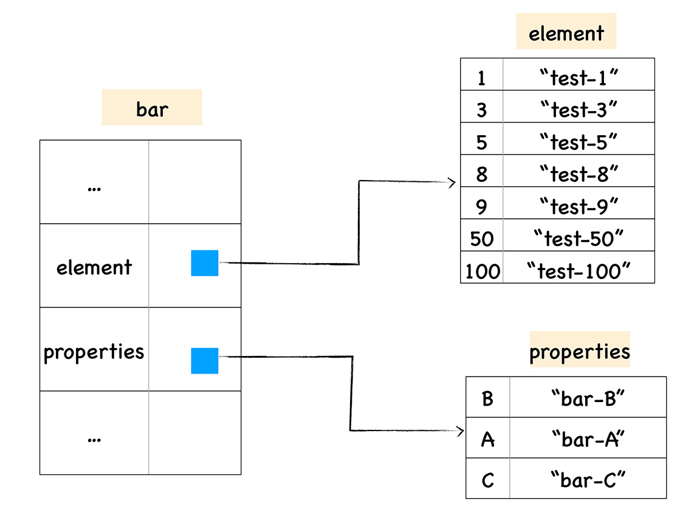

# 1. V8是如何执行一段JavaScript代码的

## 1.1 什么是 V8？

V8 是一个由 Google 开发的开源 JavaScript 引擎，目前用在 Chrome 浏览器和 Node.js 中，其核心功能是执行易于人类理解的 JavaScript 代码。

V8 是怎么执行 JavaScript 代码的呢？

其主要核心流程分为编译和执行两步。首先需要将 JavaScript 代码转换为低级中间代码或者机器能够理解的机器代码，然后再执行转换后的代码并输出执行结果。

可以把 V8 看成是一个虚构出来的计算机，也称为虚拟机，虚拟机通过模拟实际计算机的各种功能来实现代码的执行，如模拟实际计算机的 CPU、堆栈、寄存器等，虚拟机还具有它自己的一套指令系统。

所以对于 JavaScript 代码来说，V8 就是它的整个世界，当 V8 执行 JavaScript 代码时，你并不需要担心现实中不同操作系统的差异，也不需要担心不同体系结构计算机的差异，你只需要按照虚拟机的规范写好代码就可以了。

## 1.2 高级代码为什么需要先编译再执行？

我们先从 CPU 是怎么执行机器代码讲起，你可以把 CPU 看成是一个非常小的运算机器，我们可以通过二进制的指令和 CPU 进行沟通，比如我们给 CPU 发出“1000100111011000”的二进制指令，这条指令的意思是将一个寄存器中的数据移动到另外一个寄存器中，当处理器执行到这条指令的时候，便会按照指令的意思去实现相关的操作。

为了能够完成复杂的任务，工程师们为 CPU 提供了一大堆指令，来实现各种功能，我们就把这一大堆指令称为 **指令集（Instructions）**，也就是 **机器语言**。

注意，CPU 只能识别二进制的指令，但是对程序员来说，二进制代码难以阅读和记忆，于是我们又将二进制指令集转换为人类可以识别和记忆的符号，这就是 **汇编指令集** ，你可以参考下面的代码：

```
1000100111011000  机器指令
mov ax,bx         汇编指令
```

如果你使用汇编编写了一段程序，还需要一个汇编编译器，其作用是将汇编代码编程成机器代码：

虽然汇编语言对机器语言做了一层抽象，减少了程序员理解机器语言的复杂度，但是汇编语言依然是复杂且繁琐的，即便你写一个非常简单的功能，也需要实现大量的汇编代码，这主要表现在以下两点。

首先，**不同的 CPU 有着不同的指令集**，如果要使用机器语言或者汇编语言来实现一个功能，那么你需要为每种架构的 CPU 编写特定的汇编代码，这会带来巨大的、枯燥繁琐的操作，你可以参看下图：

其次，**在编写汇编代码时，我们还需要了解和处理器架构相关的硬件知识**，比如你需要使用寄存器、内存、操作 CPU 等。大部分程序员在编写应用的时候，只想专心处理业务逻辑，并不想要过多地理会这些处理器架构相关的细节。

因此我们需要一种屏蔽了计算机架构细节的语言，能适应多种不同 CPU 架构的语言，能专心处理业务逻辑的语言，诸如 C、C++、Java、C#、Python、JavaScript 等，这些“高级语言”就应运而生了。

和汇编语言一样，处理器也不能直接识别由高级语言所编写的代码，那怎么办呢？通常，要有两种方式来执行这些代码。

第一种是 **解释执行** ，需要先将输入的源代码通过解析器编译成中间代码，之后直接使用解释器解释执行中间代码，然后直接输出结果。具体流程如下图所示：


第二种是 **编译执行** 。采用这种方式时，也需要先将源代码转换为中间代码，然后我们的编译器再将中间代码编译成机器代码。通常编译成的机器代码是以二进制文件形式存储的，需要执行这段程序的时候直接执行二进制文件就可以了。还可以使用虚拟机将编译后的机器代码保存在内存中，然后直接执行内存中的二进制代码。


以上就是计算机执行高级语言的两种基本的方式：解释执行和编译执行。但是针对不同的高级语言，这个实现方式还是有很大差异的，比如要执行 C 语言编写的代码，你需要将其编译为二进制代码的文件，然后再直接执行二进制代码。而对于像 Java 语言、JavaScript 语言等，则需要不同虚拟机，模拟计算机的这个编译执行流程。执行 Java 语言，需要经过 Java 虚拟机的转换，执行 JavaScript 需要经过 JavaScript 虚拟机的转换。

即便是 JavaScript 一门语言，也有好几种流行的虚拟机，它们之间的实现方式也存在着一部分差异，比如苹果公司在 Safari 中就是用 JavaScriptCore 虚拟机，Firefox 使用了 TraceMonkey 虚拟机，而 Chrome 则使用了 V8 虚拟机。

## 1.3 V8 是怎么执行 JavaScript 代码的？

V8 作为 JavaScript 的虚拟机的一种，它到底是怎么执行 JavaScript 代码的呢？是解释执行，还是编译执行呢？

实际上，V8 并没有采用某种单一的技术，而是 **混合编译执行和解释执行** 这两种手段，我们把这种混合使用编译器和解释器的技术称为 JIT（Just In Time）技术。

这是一种权衡策略，因为这两种方法都各自有自的优缺点，解释执行的启动速度快，但是执行时的速度慢，而编译执行的启动速度慢，但是执行时的速度快。


先看上图中的最左边的部分，在 V8 启动执行 JavaScript 之前，它还需要准备执行 JavaScript 时所需要的一些基础环境，这些基础环境包括了“堆空间”“栈空间”“全局执行上下文”“全局作用域”“消息循环系统”“内置函数”等，这些内容都是在执行 JavaScript 过程中需要使用到的，比如：

+ JavaScript 全局执行上下文就包含了执行过程中的全局信息，比如一些内置函数，全局变量等信息；
+ 全局作用域包含了一些全局变量，在执行过程中的数据都需要存放在内存中；
+ 而 V8 是采用了经典的堆和栈的管理内存管理模式，所以 V8 还需要初始化了内存中的堆和栈结构；
+ 另外，要我们的 V8 系统活起来，还需要初始化消息循环系统，消息循环系统包含了消息驱动器和消息队列，它如同 V8 的心脏，不断接受消息并决策如何处理消息。

基础环境准备好之后，接下来就可以向 V8 提交要执行的 JavaScript 代码了。

首先 V8 会接收到要执行的 JavaScript 源代码，不过这对 V8 来说只是一堆字符串，V8 并不能直接理解这段字符串的含义，它需要结构化这段字符串。 **结构化** ，是指信息经过分析后可分解成多个互相关联的组成部分，各组成部分间有明确的层次结构，方便使用和维护，并有一定的操作规范。

V8 源代码的结构化之后，就生成了 **抽象语法树 (AST)** ，我们称为 AST，AST 是便于 V8 理解的结构。

在生成 AST 的同时，V8 还会生成相关的作用域，作用域中存放相关变量。

有了 AST 和作用域之后，接下来就可以生成字节码了，字节码是介于 AST 和机器代码的中间代码。但是与特定类型的机器代码无关，解释器可以直接解释执行字节码，或者通过编译器将其编译为二进制的机器代码再执行。

生成了字节码之后，解释器就登场了，它会按照顺序解释执行字节码，并输出执行结果。

我们在解释器附近画了个监控机器人，这是一个监控解释器执行状态的模块，在解释执行字节码的过程中，如果发现了某一段代码会被重复多次执行，那么监控机器人就会将这段代码标记为 **热点代码** 。

当某段代码被标记为热点代码后，V8 就会将这段字节码丢给优化编译器，优化编译器会在后台将字节码编译为二进制代码，然后再对编译后的二进制代码执行优化操作，优化后的二进制机器代码的执行效率会得到大幅提升。如果下面再执行到这段代码时，那么 V8 会优先选择优化之后的二进制代码，这样代码的执行速度就会大幅提升。

不过，和静态语言不同的是，JavaScript 是一种非常灵活的动态语言，对象的结构和属性是可以在运行时任意修改的，而经过优化编译器优化过的代码只能针对某种固定的结构，一旦在执行过程中，对象的结构被动态修改了，那么优化之后的代码势必会变成无效的代码，这时候优化编译器就需要执行反优化操作，经过反优化的代码，下次执行时就会回退到解释器解释执行。

## 1.4 跟踪一段实际代码的执行流程

我们以一段最简单的 JavaScript 代码为例，如果将这段非常简单的代码提交给 V8 引擎，V8 在处理过程中，中间所产生的结果是怎样的呢？下面我们就一步一步详细“追踪”下。

代码如下所示：

```javascript
var test = 'GeekTime'
```

要查看 V8 中间生成的一些结构，可以使用 V8 提供的调试工具 D8 来查看，你可以将上面那段代码保存到 test.js 的文件中，然后执行下面命令：

```
d8 --print-ast test.js
```

执行这段命令之后，D8 会打印出如下内容：

```
--- AST ---
FUNC at 0
. KIND 0
. LITERAL ID 0
. SUSPEND COUNT 0
. NAME ""
. INFERRED NAME ""
. DECLS
. . VARIABLE (0x7ff0e3022298) (mode = VAR, assigned = true) "test"
. BLOCK NOCOMPLETIONS at -1
. . EXPRESSION STATEMENT at 11
. . . INIT at 11
. . . . VAR PROXY unallocated (0x7ff0e3022298) (mode = VAR, assigned = true) "test"
. . . . LITERAL "GeekTime"

```

上面这个结构就是 AST，它就是 JS 源代码的结构化表述，AST 是个树状结构，直观地理解，你可以将其转换为一个图形树，如下图所示：


在生成 AST 的同时，还会生成作用域，同样我们使用 D8 来看看它生成的作用域是什么样子，你可以使用下面的命令来查看作用域：

```
d8 --print-scopes test.js
```

执行这段命令之后，D8 会打印出如下内容：


```
Global scope:
global { // (0x7fd974022048) (0, 24)
  // will be compiled
  // 1 stack slots
  // temporary vars:
  TEMPORARY .result;  // (0x7fd9740223c8) local[0]
  // local vars:
  VAR test;  // (0x7fd974022298)
}
```

上面这行代码生成了一个全局作用域，我们可以看到 test 变量被添加进了这个全局作用域中。

生成了 AST 和作用域之后，就可以使用解释器生成字节码了，同样你可以使用 D8 来打印生成后的字节码，打印的命令如下所示：

```
d8 --print-bytecode test.js
```

执行这段语句，最终打印出来的结果如下所示：


```
[generated bytecode for function:  (0x2b510824fd55 <SharedFunctionInfo>)]
Parameter count 1
Register count 4
Frame size 32
         0x2b510824fdd2 @    0 : a7                StackCheck
         0x2b510824fdd3 @    1 : 12 00             LdaConstant [0]
         0x2b510824fdd5 @    3 : 26 fa             Star r1
         0x2b510824fdd7 @    5 : 0b                LdaZero
         0x2b510824fdd8 @    6 : 26 f9             Star r2
         0x2b510824fdda @    8 : 27 fe f8          Mov <closure>, r3
         0x2b510824fddd @   11 : 61 32 01 fa 03    CallRuntime [DeclareGlobals], r1-r3
         0x2b510824fde2 @   16 : 12 01             LdaConstant [1]
         0x2b510824fde4 @   18 : 15 02 02          StaGlobal [2], [2]
         0x2b510824fde7 @   21 : 0d                LdaUndefined
         0x2b510824fde8 @   22 : ab                Return
Constant pool (size = 3)
0x2b510824fd9d: [FixedArray] in OldSpace
 - map: 0x2b51080404b1 <Map>
 - length: 3
           0: 0x2b510824fd7d <FixedArray[4]>
           1: 0x2b510824fd1d <String[#8]: GeekTime>
           2: 0x2b51081c8549 <String[#4]: test>
Handler Table (size = 0)
Source Position Table (size = 0)
```

生成字节码之后，解释器会解释执行这段字节码，如果重复执行了某段代码，监控器就会将其标记为热点代码，并提交给编译器优化执行，如果你想要查看那些代码被优化了，可以使用下面的命令：

```
d8 --trace-opt test.js
```

如果要查看那些代码被反优化了，可以使用如下命令行来查看：

```
pt --trace-deopt test.js
```

由于我们这段代码过于简单，没有触发 V8 的优化机制。

## 1.5 小结

V8 是由 Google 开发的开源 JavaScript 引擎，也被称为虚拟机，模拟实际计算机各种功能来实现代码的编译和执行。那么，要想搞清楚 V8 内部的工作流程和原理，我们可以从分析计算机对语言的编译和执行过程入手。

因为计算机只能识别二进制指令，所以要让计算机执行一段高级语言通常有两种手段，第一种是将高级代码转换为二进制代码，再让计算机去执行；另外一种方式是在计算机安装一个解释器，并由解释器来解释执行。

解释执行和编译执行都有各自的优缺点，解释执行启动速度快，但是执行时速度慢，而编译执行启动速度慢，但是执行速度快。为了充分地利用解释执行和编译执行的优点，规避其缺点，V8 采用了一种权衡策略，在启动过程中采用了解释执行的策略，但是如果某段代码的执行频率超过一个值，那么 V8 就会采用优化编译器将其编译成执行效率更加高效的机器代码。

理解了这一点，我们就可以来深入分析 V8 执行一段 JavaScript 代码所经历的主要流程了，这包括了：

+ 初始化基础环境；
+ 解析源码生成 AST 和作用域；
+ 依据 AST 和作用域生成字节码；
+ 解释执行字节码；
+ 监听热点代码；
+ 优化热点代码为二进制的机器代码；
+ 反优化生成的二进制机器代码。

V8 是一门动态语言，在运行过程中，某些被优化的结构可能会被 JavaScript 动态修改了，这会导致之前被优化的代码失效，如果某块优化之后的代码失效了，那么编译器需要执行反优化操作。

# 2. JavaScript的函数特点

JavaScript 中的函数非常灵活，其根本原因在于 **JavaScript 中的函数就是一种特殊的对象**，我们把 JavaScript 中的函数称为 **一等公民 (First Class Function)**。

## 2.1 什么是 JavaScript 中的对象？

JavaScript 是一门 **基于对象 (Object-Based)** 的语言，可以说 JavaScript 中大部分的内容都是由对象构成的，诸如函数、数组，也可以说 JavaScript 是建立在对象之上的语言。


而这些对象在运行时可以动态修改其内容，这造就了 JavaScript 的超级灵活特性。不过，因为 JavaScript 太灵活了，也加大了理解和使用这门语言的难度。

虽然 JavaScript 是基于对象设计的，但是它却不是一门 **面向对象的语言 (Object-Oriented Programming Language)**，因为面向对象语言天生支持 **封装、继承、多态**，但是 JavaScript 并没有直接提供多态的支持，因此要在 JavaScript 中使用多态并不是一件容易的事。

除了对多态支持的不好，JavaScript 实现继承的方式和面向对象的语言实现继承的方式同样存在很大的差异。

面向对象语言是由语言本身对继承做了充分的支持，并提供了大量的关键字，如 public、protected、friend、interface 等，众多的关键字使得面向对象语言的继承变得异常繁琐和复杂，**而 JavaScript 中实现继承的方式却非常简单清爽，只是在对象中添加了一个称为原型的属性，把继承的对象通过原型链接起来，就实现了继承，我们把这种继承方式称为基于原型链继承。**

其实 JavaScript 中的对象非常简单，每个对象就是由一组组属性和值构成的集合。

```javascript
var person = new Object();
person.firstname = "John";
person.lastname = "Doe";
person.age = 50;
person.eyecolor = "blue";
```

对象的属性值有三种类型：

第一种是 **原始类型 (primitive)** ，所谓的原始类的数据，是指值本身无法被改变，比如 JavaScript 中的字符串就是原始类型，如果你修改了 JavaScript 中字符串的值，那么 V8 会返回给你一个新的字符串，原始字符串并没有被改变，我们称这些类型的值为“原始值”。

JavaScript 中的原始值主要包括 null、undefined、boolean、number、string、bigint、symbol 这七种。

第二种就是我们现在介绍的 **对象类型 (Object)**，对象的属性值也可以是另外一个对象，比如上图中的 info 属性值就是一个对象。

第三种是 **函数类型 (Function)** ，如果对象中的属性值是函数，那么我们把这个属性称为方法，所以我们又说对象具备属性和方法，那么上图中的 showinfo 就是 person 对象的一个方法。

## 2.2 函数的本质

在 JavaScript 中，函数是一种特殊的对象，它和对象一样可以拥有属性和值，但是函数和普通对象不同的是，函数可以被调用。

V8 内部是怎么实现函数可调用特性的呢？

其实在 V8 内部，我们会为函数对象添加了两个隐藏属性，具体属性如下图所示：


函数除了可以拥有常用类型的属性值之外，还拥有两个隐藏属性，分别是 name 属性和 code 属性。

隐藏 name 属性的值就是函数名称，如果某个函数没有设置函数名，该函数对象的默认的 name 属性值就是 anonymous，表示该函数对象没有被设置名称。

另外一个隐藏属性是 code 属性，其值表示函数代码，以字符串的形式存储在内存中。当执行到一个函数调用语句时，V8 便会从函数对象中取出 code 属性值，也就是函数代码，然后再解释执行这段函数代码。

## 2.3 函数是一等公民

因为函数是一种特殊的对象，所以在 JavaScript 中，函数可以赋值给一个变量，也可以作为函数的参数，还可以作为函数的返回值。

**如果某个编程语言的函数可以和它的数据类型做一样的事情，我们就把这个语言中的函数称为一等公民。** 支持函数是一等公民的语言可以使得代码逻辑更加清晰，代码更加简洁。

在执行 JavaScript 函数的过程中，为了实现变量的查找，V8 会为其维护一个作用域链，如果函数中使用了某个变量，但是在函数内部又没有定义该变量，那么函数就会沿着作用域链去外部的作用域中查找该变量。

当函数内部引用了外部的变量时，使用这个函数进行赋值、传参或作为返回值，你还需要保证这些被引用的外部变量是确定存在的，这就是让函数作为一等公民麻烦的地方，因为虚拟机还需要处理函数引用的外部变量。

我们也把这种将外部变量和和函数绑定起来的技术称为闭包。

## 2.4 小结

+ 函数作为一个对象，它有自己的属性和值，所以函数关联了基础的属性和值；
+ 函数之所以成为特殊的对象，这个特殊的地方是函数可以“被调用”，所以一个函数被调用时，它还需要关联相关的执行上下文。

# 3. 快属性和慢属性：V8采用了哪些策略提升了对象属性的访问速度？

在 V8 实现对象存储时，并没有完全采用字典的存储方式，这主要是出于性能的考量。因为字典是非线性的数据结构，查询效率会低于线性的数据结构，V8 为了提升存储和查找效率，采用了一套复杂的存储策略。


## 3.1 常规属性 (properties) 和排序属性 (element)

```javascript
function Foo() {
    this[100] = 'test-100'
    this[1] = 'test-1'
    this["B"] = 'bar-B'
    this[50] = 'test-50'
    this[9] =  'test-9'
    this[8] = 'test-8'
    this[3] = 'test-3'
    this[5] = 'test-5'
    this["A"] = 'bar-A'
    this["C"] = 'bar-C'
}
var bar = new Foo()

for(key in bar){
    console.log(`index:${key}  value:${bar[key]}`)
}
```

```
index:1  value:test-1
index:3  value:test-3
index:5  value:test-5
index:8  value:test-8
index:9  value:test-9
index:50  value:test-50
index:100  value:test-100
index:B  value:bar-B
index:A  value:bar-A
index:C  value:bar-C
```

观察这段打印出来的数据，我们发现打印出来的属性顺序并不是我们设置的顺序，我们设置属性的时候是乱序设置的，比如开始先设置 100，然后有设置了 1，但是输出的内容却非常规律，总的来说体现在以下两点：

+ 设置的数字属性被最先打印出来了，并且按照数字大小的顺序打印的；
+ 设置的字符串属性依然是按照之前的设置顺序打印的，比如我们是按照 B、A、C 的顺序设置的，打印出来依然是这个顺序。

之所以出现这样的结果，是因为在 ECMAScript 规范中定义了 **数字属性应该按照索引值大小升序排列，字符串属性根据创建时的顺序升序排列。**

在这里我们把对象中的数字属性称为 **排序属性**，在 V8 中被称为 **elements**，字符串属性就被称为 **常规属性**，在 V8 中被称为  **properties**。

在 V8 内部，为了有效地提升存储和访问这两种属性的性能，分别使用了两个线性数据结构来分别保存排序属性和常规属性，具体结构如下图所示：



通过上图我们可以发现，bar 对象包含了两个隐藏属性：elements 属性和 properties 属性，elements 属性指向了 elements 对象，在 elements 对象中，会按照顺序存放排序属性，properties 属性则指向了 properties 对象，在 properties 对象中，会按照创建时的顺序保存了常规属性。

分解成这两种线性数据结构之后，如果执行索引操作，那么 V8 会先从 elements 属性中按照顺序读取所有的元素，然后再在 properties 属性中读取所有的元素，这样就完成一次索引操作。

## 3.2 快属性和慢属性

将不同的属性分别保存到 elements 属性和 properties 属性中，无疑简化了程序的复杂度，但是在查找元素时，却多了一步操作，比如执行 bar.B这个语句来查找 B 的属性值，那么在 V8 会先查找出 properties 属性所指向的对象 properties，然后再在 properties 对象中查找 B 属性，这种方式在查找过程中增加了一步操作，因此会影响到元素的查找效率。

基于这个原因，V8 采取了一个权衡的策略以加快查找属性的效率，这个策略是将部分常规属性直接存储到对象本身，我们把这称为 **对象内属性 (in-object properties)**。对象在内存中的展现形式，你可以参看下图：


采用对象内属性之后，常规属性就被保存到 bar 对象本身了，这样当再次使用bar.B来查找 B 的属性值时，V8 就可以直接从 bar 对象本身去获取该值就可以了，这种方式减少查找属性值的步骤，增加了查找效率。

不过对象内属性的数量是固定的，默认是 10 个，如果添加的属性超出了对象分配的空间，则它们将被保存在常规属性存储中。虽然属性存储多了一层间接层，但可以自由地扩容。

通常，我们将保存在线性数据结构中的属性称之为“快属性”，因为线性数据结构中只需要通过索引即可以访问到属性，虽然访问线性结构的速度快，但是如果从线性结构中添加或者删除大量的属性时，则执行效率会非常低，这主要因为会产生大量时间和内存开销。

```javascript
const maxNumber = 100000;

function objectPropertyNumber() {
    console.time('objectPropertyNumberSet');
    const obj = {};
    for (let i = 0; i < maxNumber; i++) {
        obj[i] = i;
    }
    console.timeEnd('objectPropertyNumberSet');

    const newObj = {};
    console.time('objectPropertyNumberGet');
    Object.keys(obj).forEach(key => newObj[key] = obj[key]);
    console.timeEnd('objectPropertyNumberGet');
}

function objectPropertyString() {
    console.time('objectPropertyStringSet');
    const obj = {};
    for (let i = 0; i < maxNumber; i++) {
        obj[`objectPropertyString-${i}`] = i;
    }
    console.timeEnd('objectPropertyStringSet');

    const newObj = {};
    console.time('objectPropertyStringGet');
    Object.keys(obj).forEach(key => newObj[key] = obj[key]);
    console.timeEnd('objectPropertyStringGet');
}

function arrayIndex() {
    console.time('arrayIndexSet');
    const arr = [];
    for (let i = 0; i < maxNumber; i++) {
        arr[i] = i;
    }
    console.timeEnd('arrayIndexSet');

    console.time('arrayIndexGet');
    const newArr = [];
    for (let i = 0; i < maxNumber; i++) {
        newArr[i] = arr[i];
    }
    console.timeEnd('arrayIndexGet');
}

function arrayPropertyString() {
    console.time('arrayPropertyStringSet');
    const arr = [];
    for (let i = 0; i < maxNumber; i++) {
        arr[`objectPropertyString-${i}`] = i;
    }
    console.timeEnd('arrayPropertyStringSet');

    console.time('arrayPropertyStringGet');
    const newArr = [];
    for (let i = 0; i < maxNumber; i++) {
        newArr[`objectPropertyString-${i}`] = arr[`objectPropertyString-${i}`]
    }
    console.timeEnd('arrayPropertyStringGet');
}

objectPropertyNumber();
objectPropertyString();

arrayIndex();
arrayPropertyString();

/*
objectPropertyNumberSet: 6.004ms
objectPropertyNumberGet: 18.367ms
objectPropertyStringSet: 115.466ms
objectPropertyStringGet: 52.782ms
arrayIndexSet: 6.592ms
arrayIndexGet: 3.401ms
arrayPropertyStringSet: 75.872ms
arrayPropertyStringGet: 106.433ms
* */
```

因此，如果一个对象的属性过多时，V8 为就会采取另外一种存储策略，那就是 **“慢属性”** 策略，但慢属性的对象内部会有独立的非线性数据结构 (词典) 作为属性存储容器。所有的属性元信息不再是线性存储的，而是直接保存在属性字典中。


## 3.3 在 Chrome 中查看对象布局

可以打开 Chrome 开发者工具，先选择控制台标签，然后在控制台中执行以下代码查看内存快照：

```javascript
function Foo(property_num,element_num) {
    //添加可索引属性
    for (let i = 0; i < element_num; i++) {
        this[i] = `element${i}`;
    }
    //添加常规属性
    for (let i = 0; i < property_num; i++) {
        let ppt = `property${i}`;
        this[ppt] = ppt;
    }
}
var bar = new Foo(10, 10);
```


观察上图，我们搜索出来了所有经过构造函数 Foo 创建的对象，点开 Foo 的那个下拉列表，第一个就是刚才创建的 bar 对象，我们可以看到 bar 对象有一个 elements 属性，这里面就包含我们创造的所有的排序属性，那么怎么没有常规属性对象呢？

这是因为只创建了 10 个常规属性，所以 V8 将这些常规属性直接做成了 bar 对象的对象内属性。

所以这时候的数据内存布局是这样的：

+ 10 个常规属性作为对象内属性，存放在 bar 函数内部；
+ 10 个排序属性存放在 elements 中。

## 3.4 其他属性

除了 elements 和 properties 属性，V8 还为每个对象实现了 map 属性和 `__proto__` 属性。`__proto__` 属性就是原型，是用来实现 JavaScript 继承的。而 map 则是隐藏类。

## 3.5 小结

为了提升查找效率，V8 在对象中添加了两个隐藏属性，排序属性和常规属性，指向了 elements 对象，在 elements 对象中，会按照顺序存放排序属性。properties 属性则指向了 properties 对象，在 properties 对象中，会按照创建时的顺序保存常规属性。

通过引入这两个属性，加速了 V8 查找属性的速度，为了更加进一步提升查找效率，V8 还实现了内置内属性的策略，当常规属性少于一定数量时，V8 就会将这些常规属性直接写进对象中，这样又节省了一个中间步骤。

但是如果对象中的属性过多时，或者存在反复添加或者删除属性的操作，那么 V8 就会将线性的存储模式降级为非线性的字典存储模式，这样虽然降低了查找速度，但是却提升了修改对象的属性的速度。

# 4. 函数表达式

函数表达式和函数声明有着本质上的差异。


因为语义不同，所以给这两种定义函数的方式使用了不同的名称，第一种称之为 **函数声明**，第二种称之为 **函数表达式**。

## 4.1 V8 是怎么处理函数声明的

**函数声明** 定义了一个具有指定参数的函数

```
function name([param,[, param,[..., param]]]) {
   [statements]
}
```

V8 在执行 JavaScript 的过程中，会先对其进行编译，然后再执行。

```javascript
var x = 5
function foo(){
    console.log('Foo')
}
```

V8 执行这段代码的流程大致如下图所示：


在编译阶段，如果解析到函数声明，那么 V8 会将这个函数声明转换为内存中的函数对象，并将其放到作用域中。同样，如果解析到了某个变量声明，也会将其放到作用域中，但是会将其值设置为 undefined，表示该变量还未被使用。

然后在 V8 执行阶段，如果使用了某个变量，或者调用了某个函数，那么 V8 便会去作用域查找相关内容。

关于作用域的数据，你也可以使用 D8 来查看，具体操作方式如下：

+ 将这段代码保存到 test.js 中；
+ 使用“d8 --print-scopes test.js”命令即可查看作用域的状态。

```
Global scope:
global { // (0x7fb62281ca48) (0, 50)
  // will be compiled
  // 1 stack slots
  // temporary vars:
  TEMPORARY .result;  // (0x7fb62281cfe8) local[0]
  // local vars:
  VAR x;  // (0x7fb62281cc98)
  VAR foo;  // (0x7fb62281cf40)
  function foo () { // (0x7fb62281cd50) (22, 50)
    // lazily parsed
    // 2 heap slots
  }
}
```

上面这段就是 V8 生成的作用域，我们可以看到，作用域中包含了变量 x 和 foo，变量 x 的默认值是 undefined，变量 foo 指向了 foo 函数对象，foo 函数对象被 V8 存放在内存中的堆空间了，这些变量都是在编译阶段被装进作用域中的。


因为在执行之前，这些变量都被提升到作用域中了，所以在执行阶段，V8 当然就能获取到所有的定义变量了。我们把这种在编译阶段，将所有的变量提升到作用域的过程称为 **变量提升**。

了解了变量提升，我们就能解释，为什么可以在函数声明之前调用该函数了，这是因为声明的函数在编译阶段就被提升到作用域中，在执行阶段，只要是在作用域中存在的变量或者对象，都是可以使用的。

对于变量提升，函数和普通的对象还是存在一些差异的，通过上面的分析我们知道，如果是一个普通变量，变量提升之后的值都是 undefined，如果是声明的函数，那么变量提升之后的值则是函数对象，我们可以通过下面的代码来实践下：


```javascript
console.log(x);
console.log(foo);

var x = 5;

function foo(){}
```

执行上面这段代码，我们可以看到，普通变量 x 的值就是 undefined，而函数对象 foo 的值则是完整的对象，那这又是为什么呢？这就是涉及到表达式和语句的区别了。

简单地理解，表达式就是表示值的式子，而语句是操作值的式子。

在 V8 执行var x = 5这段代码时，会认为它是两段代码，一段是定义变量的语句，一段是赋值的表达式。

```javascript
var x = undefined;
x = 5;
```

首先，在变量提升阶段，V8 并不会执行赋值的表达式，该阶段只会分析基础的语句，比如变量的定义，函数的声明。

而这两行代码是在不同的阶段完成的，var x 是在编译阶段完成的，也可以说是在变量提升阶段完成的，而x = 5是表达式，所有的表达式都是在执行阶段完成的。

在变量提升阶段，V8 将这些变量存放在作用域时，还会给它们赋一个默认的 undefined 值，所以在定义一个普通的变量之前，使用该变量，那么该变量的值就是 undefined。

**表达式是不会在编译阶段执行的**

```javascript
function foo(){
    console.log('Foo')
}
```

执行上面这段代码，它并没有输出任何内容，所以可以肯定，函数声明并不是一个表达式，而是一个语句。V8 在变量提升阶段，如果遇到函数声明，那么 V8 同样会对该函数声明执行变量提升操作。

函数也是一个对象，所以在编译阶段，V8 就会将整个函数对象提升到作用域中，并不是给该函数名称赋一个 undefined，理解这一点尤为重要。

总的来说，在 V8 解析 JavaScript 源码的过程中，如果遇到普通的变量声明，那么便会将其提升到作用域中，并给该变量赋值为 undefined，如果遇到的是函数声明，那么 V8 会在内存中为声明生成函数对象，并将该对象提升到作用域中。

## 4.2 V8 是怎么处理函数表达式？

**我们在一个表达式中使用 function 来定一个函数，那么就把该函数称为函数表达式。**

函数表达式与函数声明的最主要区别有以下三点：

+ 函数表达式是在表达式语句中使用 function 的，最典型的表达式是“a=b”这种形式，因为函数也是一个对象，我们把“a = function (){}”这种方式称为函数表达式；
+ 在函数表达式中，可以省略函数名称，从而创建匿名函数（anonymous functions）；
+ 一个函数表达式可以被用作一个即时调用的函数表达式——IIFE（Immediately Invoked Function Expression）。

```javascript
foo()
var foo = function (){
    console.log('foo')
}
```

当执行这段代码的时候，V8 在编译阶段会先查找声明语句，你可以把这段代码拆分为下面两行代码：

```javascript
var foo = undefined;
foo = function (){
    console.log('foo');
}
```

第一行是声明语句，所以 V8 在解析阶段，就会在作用域中创建该对象，并将该对象设置为 undefined，第二行是函数表达式，在编译阶段，V8 并不会处理函数表达式，所以也就不会将该函数表达式提升到作用域中了。

那么在函数表达式之前调用该函数 foo，此时的 foo 只是指向了 undefined，所以就相当于调用一个 undefined，而 undefined 只是一个原生对象，并不是函数，所以当然会报错了。

## 4.3 立即调用的函数表达式（IIFE）

在编译阶段，V8 并不会处理函数表达式，而 JavaScript 中的立即函数调用表达式正是使用了这个特性来实现了非常广泛的应用。

存放在括号里面的函数便是一个函数表达式，它会返回一个函数对象，如果我直接在表达式后面加上调用的括号，这就称立即调用函数表达式（IIFE），比如下面代码：

```javascript
(function () {
    //statements
})()
```

因为函数立即表达式也是一个表达式，所以 V8 在编译阶段，并不会为该表达式创建函数对象。**这样的一个好处就是不会污染环境，函数和函数内部的变量都不会被其他部分的代码访问到。**

在 ES6 之前，JavaScript 中没有私有作用域的概念，如果在多人开发的项目中，你模块中的变量可能覆盖掉别人的变量，所以使用函数立即表达式就可以将我们内部变量封装起来，避免了相互之间的变量污染。

另外，因为函数立即表达式是立即执行的，所以将一个函数立即表达式赋给一个变量时，不是存储 IIFE 本身，而是存储 IIFE 执行后返回的结果。如下所示：

## 4.4 小结

+ 函数声明和变量声明类似，V8 在编译阶段，都会对其执行变量提升的操作，将它们提升到作用域中，在执行阶段，如果使用了某个变量，就可以直接去作用域中去查找。
+ 不过 V8 对于提升函数和提升变量的策略是不同的，如果提升了一个变量，那么 V8 在将变量提升到作用域中时，还会为其设置默认值 undefined，如果是函数声明，那么 V8 会在内存中创建该函数对象，并提升整个函数对象。
+ 函数表达式也是表达式的一种，在编译阶段，V8 并不会将表达式中的函数对象提升到全局作用域中，所以无法在函数表达式之前使用该函数。函数立即表达式是一种特别的表达式，主要用来封装一些变量、函数，可以起到变量隔离和代码隐藏的作用，因此在一些大的开源项目中有广泛的应用。
