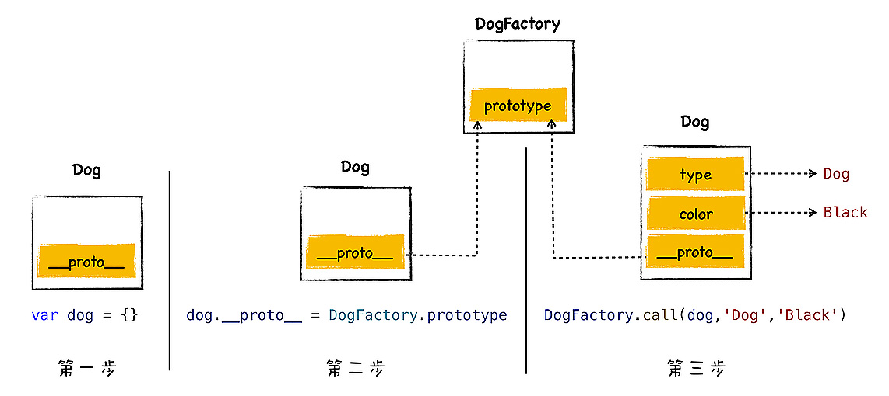
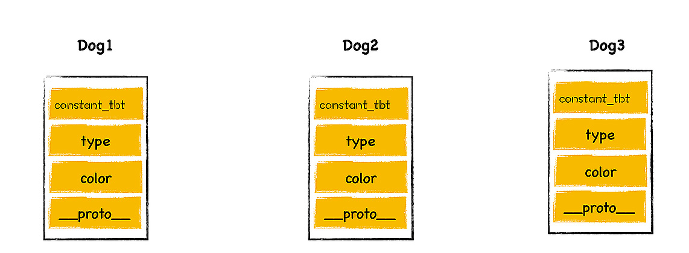
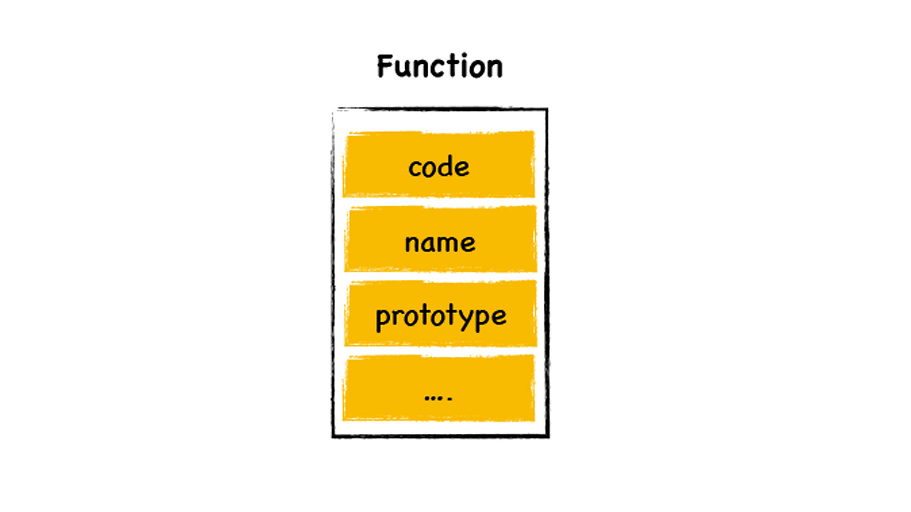
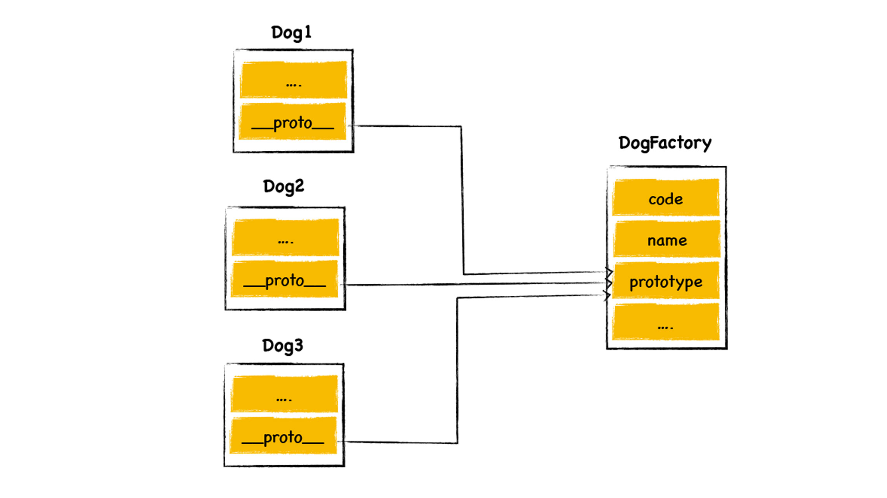
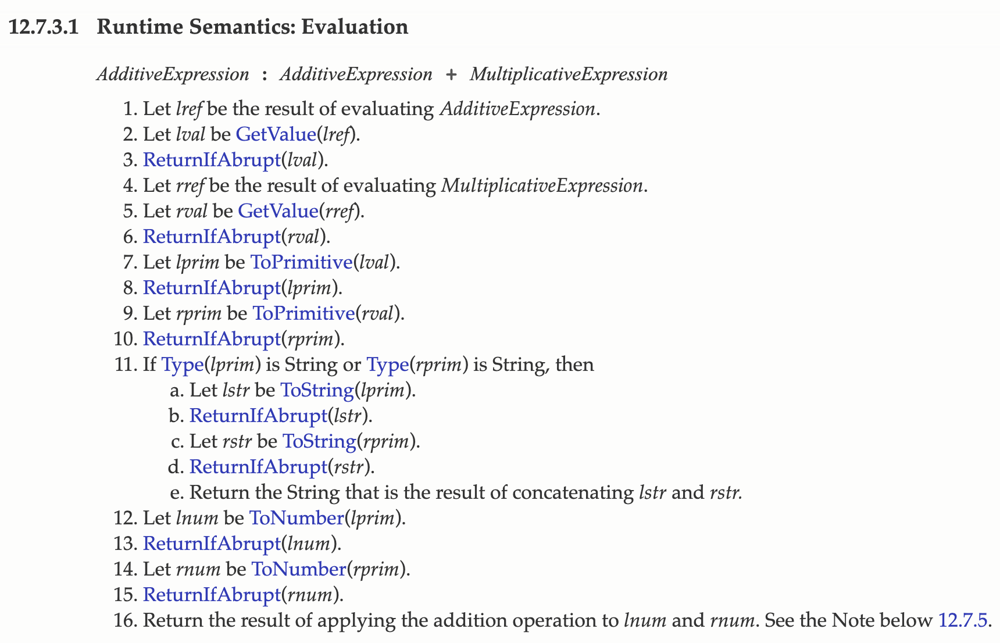

# 1. 原型链: V8是如何实现对象继承的？

**继承就是一个对象可以访问另外一个对象中的属性和方法。**

不同的语言实现继承的方式是不同的，其中最典型的两种方式是 **基于类的设计** 和 **基于原型继承的设计** 。

C++、Java、C# 这些语言都是基于经典的类继承的设计模式，这种模式最大的特点就是提供了非常复杂的规则，并提供了非常多的关键字，诸如 class、friend、protected、private、interface 等，通过组合使用这些关键字，就可以实现继承。

使用基于类的继承时，如果业务复杂，那么你需要创建大量的对象，然后需要维护非常复杂的继承关系，这会导致代码过度复杂和臃肿，另外引入了这么多关键字也给设计带来了更大的复杂度。

而 JavaScript 的继承方式和其他面向对象的继承方式有着很大差别，JavaScript 本身不提供一个 class 实现。虽然标准委员会在 ES2015/ES6 中引入了 class 关键字，但那只是语法糖，JavaScript 的继承依然和基于类的继承没有一点关系。所以当你看到 JavaScript 出现了 class 关键字时，不要以为 JavaScript 也是面向对象语言了。

JavaScript 仅仅在对象中引入了一个原型的属性，就实现了语言的继承机制，基于原型的继承省去了很多基于类继承时的繁文缛节，简洁而优美。

## 1.1 原型继承是如何实现的？

从 V8 的内存快照看到，JavaScript 的每个对象都包含了一个隐藏属性 `__proto__` ，我们就把该隐藏属性 `__proto__` 称之为该对象的原型 (prototype)，`__proto__` 指向了内存中的另外一个对象，我们就把 `__proto__` 指向的对象称为该对象的原型对象，那么该对象就可以直接访问其原型对象的方法或者属性。

**继承就是一个对象可以访问另外一个对象中的属性和方法，在JavaScript 中，我们通过原型和原型链的方式来实现了继承特性。**

在 JavaScript 中的继承非常简洁，就是每个对象都有一个原型属性，该属性指向了原型对象，查找属性的时候，JavaScript 虚拟机会沿着原型一层一层向上查找，直至找到正确的属性。

## 1.2 实践：利用 `__proto__` 实现继承

```javascript
var animal = {
    type: "Default",
    color: "Default",
    getInfo: function () {
        return `Type is: ${this.type}，color is ${this.color}.`
    }
};

var dog = {
    type: "Dog",
    color: "Black",
};
```

在这段代码中，我创建了两个对象 animal 和 dog，我想让 dog 对象继承于 animal 对象，那么最直接的方式就是将 dog 的原型指向对象 animal，应该怎么操作呢？


我们可以通过设置 dog 对象中的 `__proto__` 属性，将其指向 animal，代码是这样的：

```javascript
dog.__proto__ = animal;
```

设置之后，我们就可以使用 dog 来调用 animal 中的 getInfo 方法了。

```javascript
dog.getInfo();
```

通常隐藏属性是不能使用 JavaScript 来直接与之交互的。虽然现代浏览器都开了一个口子，让 JavaScript 可以访问隐藏属性 _proto_，但是在实际项目中，我们不应该直接通过 _proto_ 来访问或者修改该属性，其主要原因有两个：

+ 首先，这是隐藏属性，并不是标准定义的 ;
+ 其次，使用该属性会造成严重的性能问题。

**使用构造函数来创建对象**

## 1.3 构造函数是怎么创建对象的？

比如我们要创建一个 dog 对象，我可以先创建一个 DogFactory 的函数，属性通过参数就行传递，在函数体内，通过 this 设置属性值。代码如下所示：

```javascript
function DogFactory(type,color){
    this.type = type
    this.color = color
}
```

然后再结合关键字“new”就可以创建对象了，创建对象的代码如下所示：

```javascript
var dog = new DogFactory('Dog', 'Black');
```

通过这种方式，我们就把后面的函数称为构造函数，因为通过执行 new 配合一个函数，JavaScript 虚拟机便会返回一个对象。

其实当 V8 执行上面这段代码时，V8 会在背后悄悄地做了以下几件事情，模拟代码如下所示：

```javascript
var dog = {};
dog.__proto__ = DogFactory.prototype;
DogFactory.call(dog,'Dog','Black');
```



观察上图，我们可以看到执行流程分为三步：

+ 首先，创建了一个空白对象 dog；
+ 然后，将 DogFactory 的 prototype 属性设置为 dog 的原型对象，这就是给 dog 对象设置原型对象的关键一步，我们后面来介绍；
+ 最后，再使用 dog 来调用 DogFactory，这时候 DogFactory 函数中的 this 就指向了对象 dog，然后在 DogFactory 函数中，利用 this 对对象 dog 执行属性填充操作，最终就创建了对象 
  dog。

## 1.4 构造函数怎么实现继承？

```javascript
function DogFactory(type,color){
    this.type = type
    this.color = color
    //Mammalia
    //恒温
    this.constant_temperature = 1
}
var dog1 = new DogFactory('Dog','Black');
var dog2 = new DogFactory('Dog','Black');
var dog3 = new DogFactory('Dog','Black');
```



从图中可以看出来，对象 dog1 到 dog3 中的 constant_temperature 属性都占用了一块空间，但是这是一个通用的属性，表示所有的 dog 对象都是恒温动物，所以没有必要在每个对象中都为该属性分配一块空间，我们可以将该属性设置公用的。

怎么设置呢？

函数有两个隐藏属性。这两个隐藏属性就是 name 和 code，其实函数还有另外一个隐藏属性，那就是 prototype，刚才介绍构造函数时我们也提到过。一个函数有以下几个隐藏属性：



每个函数对象中都有一个公开的 prototype 属性，当你将这个函数作为构造函数来创建一个新的对象时，新创建对象的原型对象就指向了该函数的 prototype 属性。当然了，如果你只是正常调用该函数，那么 prototype 属性将不起作用。



这时候我们可以将 constant_temperature 属性添加到 DogFactory 的 prototype 属性上，代码如下所示：

```javascript
function DogFactory(type, color) {
    this.type = type;
    this.color = color;
    //Mammalia
}
DogFactory. prototype.constant_temperature = 1;

var dog1 = new DogFactory('Dog','Black');
var dog2 = new DogFactory('Dog','Black');
var dog3 = new DogFactory('Dog','Black');
```

这样我们三个 dog 对象的原型对象都指向了 prototype，而 prototype 又包含了 constant_temperature 属性，这就是我们实现继承的正确方式。

# 2. 作用域链：V8是如何查找变量的？

作用域链就是将一个个作用域串起来，实现变量查找的路径。讨论作用域链，实际就是在讨论按照什么路径查找变量的问题。

作用域就是存放变量和函数的地方，全局环境有全局作用域，全局作用域中存放了全局变量和全局函数。每个函数也有自己的作用域，函数作用域中存放了函数中定义的变量。

## 2.1 什么是函数作用域和全局作用域？

每个函数在执行时都需要查找自己的作用域，我们称为函数作用域，在执行阶段，在执行一个函数时，当该函数需要使用某个变量或者调用了某个函数时，便会优先在该函数作用域中查找相关内容。

全局作用域和函数作用域类似，也是存放变量和函数的地方，但是它们还是有点不一样： **全局作用域是在 V8 启动过程中就创建了，且一直保存在内存中不会被销毁的，直至 V8 退出。 而函数作用域是在执行该函数时创建的，当函数执行结束之后，函数作用域就随之被销毁掉了。**

全局作用域中包含了很多全局变量，比如全局的 this 值，如果是浏览器，全局作用域中还有 window、document、opener 等非常多的方法和对象，如果是 node 环境，那么会有 Global、File 等内容。

## 2.2 作用域链是怎么工作的？

首先当 V8 启动时，会创建全局作用域，全局作用域中包括了 this、window 等变量，还有一些全局的 Web API 接口。

V8 启动之后，消息循环系统便开始工作了。

V8 会先编译顶层代码，在编译过程中会将顶层定义的变量和声明的函数都添加到全局作用域中。

全局作用域创建完成之后，V8 便进入了执行状态。

第一部分是在编译过程中完成的，此时全局作用中两个变量的值依然是 undefined，然后进入执行阶段；第二部代码就是执行时的顺序。

因为词法作用域是根据函数在代码中的位置来确定的，作用域是在声明函数时就确定好的了，所以我们也将词法作用域称为静态作用域。

和静态作用域相对的是动态作用域，动态作用域并不关心函数和作用域是如何声明以及在何处声明的，只关心它们从何处调用。换句话说，作用域链是基于调用栈的，而不是基于函数定义的位置的。

# 3. 类型转换：V8是怎么实现1+“2”的？

## 3.1 什么是类型系统 (Type System)？

在这个简单的表达式中，涉及到了两种不同类型的数据的相加。要想理清以上两个问题，我们就需要知道类型的概念，以及 JavaScript 操作类型的策略。

对机器语言来说，所有的数据都是一堆二进制代码，CPU 处理这些数据的时候，并没有类型的概念，CPU 所做的仅仅是移动数据，比如对其进行移位，相加或相乘。

而在高级语言中，我们都会为操作的数据赋予指定的类型，类型可以确认一个值或者一组值具有特定的意义和目的。所以，类型是高级语言中的概念。

比如在 C/C++ 中，你需要为要处理的每条数据指定类型，这样定义变量：

```c++
int counter = 100;     // 赋值整型变量
float miles = 1000.0;  // 浮点型
char* name = "John";   // 字符串
```

C/C++ 编译器负责将这些数据片段转换为供 CPU 处理的正确命令，通常是二进制的机器代码。

在某些更高级的语言中，还可以根据数据推断出类型。

通用的类型有数字类型、字符串、Boolean 类型等等，引入了这些类型之后，编译器或者解释器就可以根据类型来限制一些有害的或者没有意义的操作。

每种语言都定义了自己的类型，还定义了如何操作这些类型，另外还定义了这些类型应该如何相互作用，我们就把这称为 **类型系统**。

> 在计算机科学中，类型系统（type system）用于定义如何将编程语言中的数值和表达式归类为许多不同的类型，如何操作这些类型，这些类型如何互相作用。

一个语言的类型系统越强大，那编译器能帮程序员检查的东西就越多，程序员定义“检查规则”的方式就越灵活。

## 3.2 V8 是怎么执行加法操作的？

当有两个值相加的时候，比如: `a + b`

V8 会严格根据 ECMAScript 规范来执行操作。ECMAScript 是一个语言标准，JavaScript 就是 ECMAScript 的一个实现，比如在 ECMAScript 就定义了怎么执行加法操作。



> AdditiveExpression : AdditiveExpression + MultiplicativeExpression


+ 把第一个表达式 (AdditiveExpression) 的值赋值给左引用 (lref)。
+ 使用 GetValue(lref) 获取左引用 (lref) 的计算结果，并赋值给左值。
+ 使用ReturnIfAbrupt(lval) 如果报错就返回错误。
+ 把第二个表达式 (MultiplicativeExpression) 的值赋值给右引用 (rref)。
+ 使用 GetValue(rref) 获取右引用 (rref) 的计算结果，并赋值给 rval。
+ 使用ReturnIfAbrupt(rval) 如果报错就返回错误。
+ 使用 ToPrimitive(lval) 获取左值 (lval) 的计算结果，并将其赋值给左原生值 (lprim)。
+ 使用 ToPrimitive(rval) 获取右值 (rval) 的计算结果，并将其赋值给右原生值 (rprim)。
+ 如果 Type(lprim) 和 Type(rprim) 中有一个是 String，则：
  + a. 把 ToString(lprim) 的结果赋给左字符串 (lstr)；
  + b. 把 ToString(rprim) 的结果赋给右字符串 (rstr)；
  + c. 返回左字符串 (lstr) 和右字符串 (rstr) 拼接的字符串。
+ 把 ToNumber(lprim) 的结果赋给左数字 (lnum)。
+ 把 ToNumber(rprim) 的结果赋给右数字 (rnum)。
+ 返回左数字 (lnum) 和右数字 (rnum) 相加的数值。

通俗地理解，V8 会提供了一个 ToPrimitive 方法，其作用是将 a 和 b 转换为原生数据类型，其转换流程如下：

+ 先检测该对象中是否存在 valueOf 方法，如果有并返回了原始类型，那么就使用该值进行强制类型转换；
+ 如果 valueOf 没有返回原始类型，那么就使用 toString 方法的返回值；
+ 如果 valueOf 和 toString 两个方法都不返回基本类型值，便会触发一个 TypeError 的错误。


当 V8 执行 1 + “2” 时，因为这是两个原始值相加，原始值相加的时候，如果其中一项是字符串，那么 V8 会默认将另外一个值也转换为字符串，相当于执行了下面的操作：

```javascript
Number(1).toString() + "2";
```

这里，把数字 1 偷偷转换为字符串“1”的过程也称为强制类型转换，因为这种转换是隐式的，所以如果我们不熟悉语义，那么就很容易判断错误。

```javascript
var Obj = {
  toString() {
    return '200'
  }, 
  valueOf() {
    return 100
  }   
};

Obj + 3
```

由于需要先使用 ToPrimitve 方法将 Obj 转换为原生类型，而 ToPrimitve 会优调用对象中的 valueOf 方法，由于 valueOf 返回了 100，那么 Obj 就会被转换为数字 100，那么数字 100 加数字 3，那么结果当然是 103 了。


```javascript
var Obj = {
  toString() {
    return new Object()
  }, 
  valueOf() {
    return new Object()
  }   
};

Obj + 3
```

因为 ToPrimitve 会先调用 valueOf 方法，发现返回的是一个对象，并不是原生类型，当 ToPrimitve 继续调用 toString 方法时，发现 toString 返回的也是一个对象，都是对象，就无法执行相加运算了，这时候虚拟机就会抛出一个异常，异常如下所示：

```
VM263:9 Uncaught TypeError: Cannot convert object to primitive value
    at <anonymous>:9:6
```

提示的是类型错误，错误原因是无法将对象类型转换为原生类型。

所以说，在执行加法操作的时候，V8 会通过 ToPrimitve 方法将对象类型转换为原生类型，最后就是两个原生类型相加，如果其中一个值的类型是字符串时，则另一个值也需要强制转换为字符串，然后做字符串的连接运算。在其他情况时，所有的值都会转换为数字类型值，然后做数字的相加。
