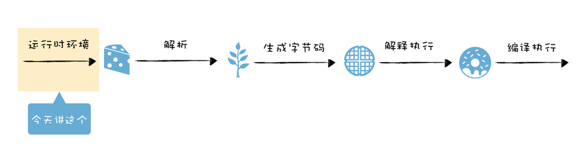
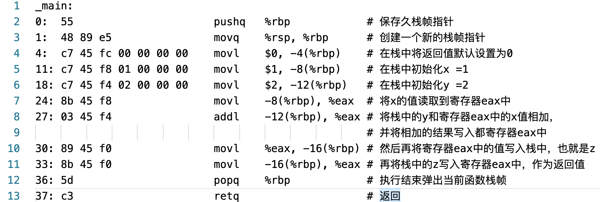
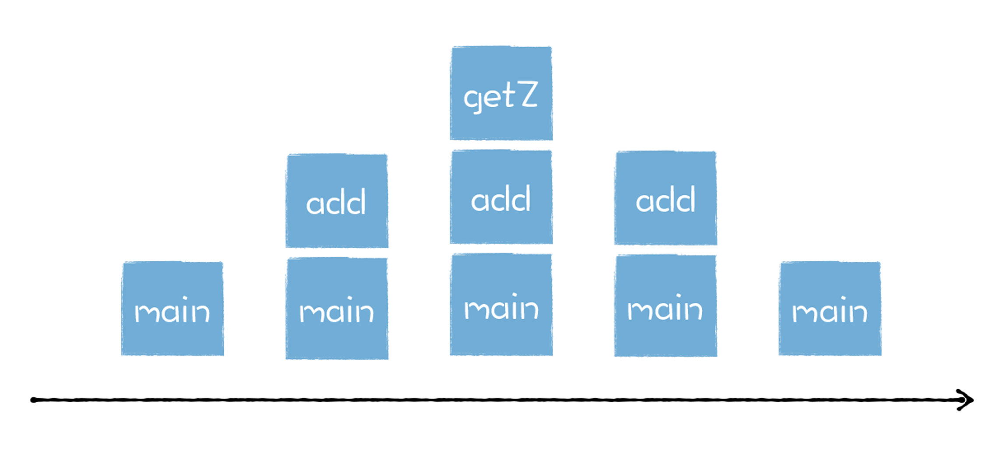
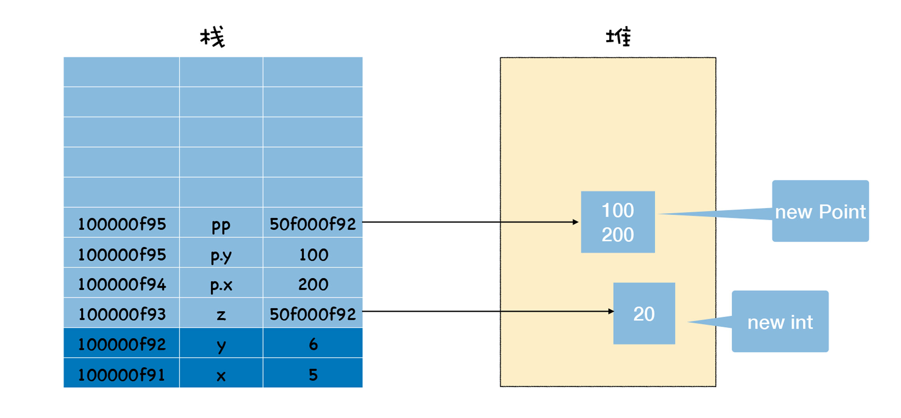
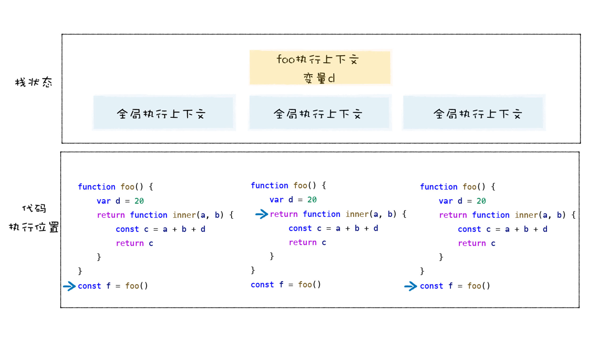

# 1. 运行时环境：运行JavaScript代码的基石

当你想执行一段 JavaScript 代码时，只需要将代码丢给 V8 虚拟机，V8 便会执行并返回给你结果。

其实在执行 JavaScript 代码之前，V8 就已经准备好了代码的运行时环境，这个环境包括了堆空间和栈空间、全局执行上下文、全局作用域、内置的内建函数、宿主环境提供的扩展函数和对象，还有消息循环系统。准备好运行时环境之后，V8
才可以执行 JavaScript 代码，这包括解析源码、生成字节码、解释执行或者编译执行这一系列操作。



对运行时环境有足够的了解，能够帮助我们更好地理 V8 的执行流程。比如事件循环系统可以让你清楚各种回调函数是怎么被执行的，栈空间可以让你了解函数是怎么被调用的，堆空间和栈空间让你了解为什么要有传值和传引用，等等。


## 1.1 什么是宿主环境？

在生物学上，宿主是指为病毒等寄生物提供生存环境的生物，宿主有的自己的完整的代谢系统，而病毒则没有自己的代谢系统，也没有自己的酶系统，它只是由核酸长链和蛋白质外壳构成。

因此，病毒想要完成自我复制，则会和宿主共同使用一套代谢系统，当病毒离开了宿主细胞，就成了没有任何生命活动，也不能独立自我繁殖的化学物质。同时，如果病毒利用了太多的宿主细胞资源，也会影响到细胞的正常活动。

同样，你可以把 V8 和浏览器的渲染进程的关系看成病毒和细胞的关系，浏览器为 V8 提供基础的消息循环系统、全局变量、Web API，而 V8 的核心是实现了 ECMAScript 标准，这相当于病毒自己的 DNA 或者 RNA，V8
只提供了 ECMAScript 定义的一些对象和一些核心的函数，这包括了 Object、Function、String。除此之外，V8 还提供了垃圾回收器、协程等基础内容，不过这些功能依然需要宿主环境的配合才能完整执行。

如果 V8 使用不当，比如不规范的代码触发了频繁的垃圾回收，或者某个函数执行时间过久，这些都会占用宿主环境的主线程，从而影响到程序的执行效率，甚至导致宿主环境的卡死。

其实，除了浏览器可以作为 V8 的宿主环境，Node.js 也是 V8 的另外一种宿主环境，它提供了不同的宿主对象和宿主的 API，但是整个流程依然是相同的，比如 Node.js 也会提供一套消息循环系统，也会提供一个运行时的主线程。


好了，现在我们知道，要执行 V8，则需要有一个宿主环境，宿主环境可以是浏览器中的渲染进程，可以是 Node.js 进程, 也可以是其他的定制开发的环境，而这些宿主则提供了很多 V8 执行 JavaScript
时所需的基础功能部件，接下来我们就来一一分析下这些部件。

## 1.2 构造数据存储空间：堆空间和栈空间

由于 V8 是寄生在浏览器或者 Node.js 这些宿主中的，因此，V8 也是被这些宿主启动的。比如，在 Chrome 中，只要打开一个渲染进程，渲染进程便会初始化 V8，同时初始化堆空间和栈空间。

栈空间主要是用来管理 JavaScript 函数调用的，栈是内存中连续的一块空间，同时栈结构是“先进后出”的策略。在函数调用过程中，涉及到上下文相关的内容都会存放在栈上，比如原生类型、引用到的对象的地址、函数的执行状态、this
值等都会存在在栈上。当一个函数执行结束，那么该函数的执行上下文便会被销毁掉。

栈空间的最大的特点是空间连续，所以在栈中每个元素的地址都是固定的，因此栈空间的查找效率非常高，但是通常在内存中，很难分配到一块很大的连续空间，因此，V8 对栈空间的大小做了限制，如果函数调用层过深，那么 V8 就有可能抛出栈溢出的错误。

如果有一些占用内存比较大的数据，或者不需要存储在连续空间中的数据，使用栈空间就显得不是太合适了，所以 V8 又使用了堆空间。

堆空间是一种树形的存储结构，用来存储对象类型的离散的数据，在前面的课程中我们也讲过，JavaScript 中除了原生类型的数据，其他的都是对象类型，诸如函数、数组，在浏览器中还有 window 对象、document
对象等，这些都是存在堆空间的。

宿主在启动 V8 的过程中，会同时创建堆空间和栈空间，再继续往下执行，产生的新数据都会存放在这两个空间中。

## 1.3 全局执行上下文和全局作用域

V8 初始化了基础的存储空间之后，接下来就需要初始化全局执行上下文和全局作用域了，这两个内容是 V8 执行后续流程的基础。

当 V8 开始执行一段可执行代码时，会生成一个执行上下文。V8 用执行上下文来维护执行当前代码所需要的变量声明、this 指向等。

执行上下文中主要包含了三部分，变量环境、词法环境、和 this 关键字。比如在浏览器的环境中，全局执行上下文中就包括了 window 对象，还有默认指向 window 的 this 关键字，另外还有一些 Web API 函数，诸如
setTimeout、XMLHttpRequest 等内容。

而词法环境中，则包含了使用 let、const 等变量的内容。

执行上下文所包含的具体内容，你可以参考下图：


全局执行上下文在 V8
的生存周期内是不会被销毁的，它会一直保存在堆中，这样当下次在需要使用函数或者全局变量时，就不需要重新创建了。另外，当你执行了一段全局代码时，如果全局代码中有声明的函数或者定义的变量，那么函数对象和声明的变量都会被添加到全局执行上下文中。

在这里还有一点需要注意下，全局作用域和全局执行上下文的关系，其实你可以把作用域看成是一个抽象的概念，比如在 ES6 中，同一个全局执行上下文中，都能存在多个作用域。

当 V8 调用了一个函数时，就会进入函数的执行上下文，这时候全局执行上下文和当前的函数执行上下文就形成了一个栈结构。

## 1.4 构造事件循环系统

V8 还需要有一个主线程，用来执行 JavaScript 和执行垃圾回收等工作。V8 是寄生在宿主环境中的，它并没有自己的主线程，而是使用宿主所提供的主线程，V8 所执行的代码都是在宿主的主线程上执行的。

只有一个主线程依然不行，因为如果你开启一个线程，在该线程执行一段代码，那么当该线程执行完这段代码之后，就会自动退出了，执行过程中的一些栈上的数据也随之被销毁，下次再执行另外一个段代码时，你还需要重新启动一个线程，重新初始化栈数据，这会严重影响到程序执行时的性能。

为了在执行完代码之后，让线程继续运行，通常的做法是在代码中添加一个循环语句，在循环语句中监听下个事件，比如你要执行另外一个语句，那么激活该循环就可以执行了。

如果主线程正在执行一个任务，这时候又来了一个新任务，比如 V8 正在操作 DOM，这时候浏览器的网络线程完成了一个页面下载的任务，而且 V8
注册监听下载完成的事件，那么这种情况下就需要引入一个消息队列，让下载完成的事件暂存到消息队列中，等当前的任务执行结束之后，再从消息队列中取出正在排队的任务。当执行完一个任务之后，我们的事件循环系统会重复这个过程，继续从消息队列中取出并执行下个任务。

因为所有的任务都是运行在主线程的，在浏览器的页面中，V8 会和页面共用主线程，共用消息队列，所以如果 V8 执行一个函数过久，会影响到浏览器页面的交互性能。

# 2. 机器代码：二进制机器码究竟是如何被CPU执行的？

准备好了运行时环境，V8 就可以执行 JavaScript 代码了。在执行代码时，V8 需要先将 JavaScript 编译成字节码，然后再解释执行字节码，或者将需要优化的字节码编译成二进制，并直接执行二进制代码。

也就是说，V8 首先需 **要将 JavaScript编译成字节码或者二进制代码，然后再执行。**

今天我们就要来分析下二进制代码是怎么被 CPU 执行的，在编译流水线中的位置你可以参看下图：

## 2.1 将源码编译成机器码

```c
int main() {  
    int x = 1;
    int y = 2;
    int z = x + y;
    return z;
}
```

CPU 并不能直接执行这段 C 代码，而是需要对其进行编译，将其转换为二进制的机器码，然后 CPU 才能按照顺序执行编译后的机器码。

通过 GCC 编译器将这段 C 代码编译成二进制文件。

最后编译出来的机器码如下图所示：



左边就是编译生成的机器码，在这里它是使用十六进制来展示的，这主要是因为十六进制比较容易阅读，所以我们通常使用十六进制来展示二进制代码。你可以观察到上图是由很多行组成的，每一行其实都是一个指令，该指令可以让 CPU 执行指定的任务。

中间的部分是汇编代码，汇编代码采用 **助记符（memonic）** 来编写程序，例如原本是二进制表示的指令，在汇编代码中可以使用单词来表示，比如 mov、add
就分别表示数据的存储和相加。汇编语言和机器语言是一一对应的，这一点和高级语言有很大的不同。

通常我们将汇编语言编写的程序转换为机器语言的过程称为 **“汇编”** ；反之，机器语言转化为汇编语言的过程称为 **“反汇编”**

这一大堆指令按照顺序集合在一起就组成了程序，所以程序的执行，本质上就是 CPU 按照顺序执行这一大堆指令的过程。

## 2.2 CPU 是怎么执行程序的？


这张图是比较通用的系统硬件组织模型图，从图中我们可以看出，它主要是由 CPU、主存储器、各种 IO 总线，还有一些外部设备，诸如硬盘、显示器、USB 等设备组成的。

**首先，在程序执行之前，我们的程序需要被装进内存。**

CPU 可以通过指定内存地址，从内存中读取数据，或者往内存中写入数据，有了内存地址，CPU 和内存就可以有序地交互。

内存还是一个临时存储数据的设备，之所以是临时的存储器，是因为断电之后，内存中的数据都会消失。

**内存中的每个存储空间都有其对应的独一无二的地址**

在内存中，每个存放字节的空间都有其唯一的地址，而且地址是按照顺序排放的。

有时候一条指令只需要一个字节就可以了，但是有时候一条指令却需要多个字节。

一旦二进制代码被装载进内存，CPU 便可以从内存中取出一条指令，然后分析该指令，最后执行该指令。

我们把取出指令、分析指令、执行指令这三个过程称为一个 **CPU 时钟周期** 。CPU 是永不停歇的，当它执行完成一条指令之后，会立即从内存中取出下一条指令，接着分析该指令，执行该指令，CPU 一直重复执行该过程，直至所有的指令执行完成。

CPU 中有一个 PC 寄存器，它保存了将要执行的指令地址，当二进制代码被装载进了内存之后，系统会将二进制代码中的第一条指令的地址写入到 PC 寄存器中，到了下一个时钟周期时，CPU 便会根据 **PC 寄存器**
中的地址，从内存中取出指令。

PC 寄存器中的指令取出来之后，系统要做两件事：

第一件是将下一条指令的地址更新到 PC 寄存器中，比如上图中，CPU 将第一个指令 55 取出来之后，系统会立即将下一个指令的地址填写到 PC 寄存器中，上个寄存器的地址是 100000f90，那么下一条指令的地址就是 100000f91
了。

更新了 PC 寄存器之后，CPU 就会立即做第二件事，那就是 **分析该指令**，并识别出不同的类型的指令，以及各种获取操作数的方法。在指令分析完成之后，就要执行指令了。不过要了解 CPU 是如何执行指令的，我们还需要了解 CPU
中的一个重要部件：**通用寄存器**。

通用寄存器是 CPU 中用来存放数据的设备，不同处理器中寄存器的个数也是不一样的，之所要通用寄存器，是因为 CPU 访问内存的速度很慢，所以 CPU 就在内部添加了一些存储设备，这些设备就是通用寄存器。

**通用寄存器容量小，读写速度快。内存容量大，读写速度慢。**

通用寄存器通常用来存放数据或者内存中某块数据的地址，我们把这个地址又称为指针，通常情况下寄存器对存放的数据是没有特别的限制的，比如某个通用寄存器既可以存储数据，也可以存储指针。

不过由于历史原因，我们还会将某些专用的数据或者指针存储在专用的通用寄存器中 ，比如 rbp 寄存器通常用来存放栈帧指针的，rsp 寄存器用来存放栈顶指针的，PC 寄存器用来存放下一条要执行的指令等。

接下来我们就可以分析 CPU 是如何执行指令的了，我们先来了解下几种常用的指令类型：

第一种是 **加载的指令**，其作用是从内存中复制指定长度的内容到通用寄存器中，并覆盖寄存器中原来的内容。你可以参看下图：


上图使用了 movl 指令，指令后面跟着的第一个参数是要拷贝数据的内存的位置，第二个参数是要拷贝到 ecx 这个寄存器。

第二种是 **存储的指令**，和加载类型的指令相反，其作用是将寄存器中的内容复制内存某个位置，并覆盖掉内存中的这个位置上原来的内容。

第三种是 **更新指令**，其作用是复制两个寄存器中的内容到 ALU 中，也可以是一块寄存器和一块内存中的内容到 ALU 中，ALU 将两个字相加，并将结果存放在其中的一个寄存器中，并覆盖该寄存器中的内容。

还有一个非常重要的指令，是跳转指令，从指令本身抽取出一个字，这个字是下一条要执行的指令的地址，并将该字复制到 PC 寄存器中，并覆盖掉 PC 寄存器中原来的值。那么当执行下一条指令时，便会跳转到对应的指令了。

除了以上指令之外，还有 IO 读 / 写指令，这些指令可以从一个 IO 设备中复制指定长度的数据到寄存器中，也可以将一个寄存器中的数据复制到指定的 IO 设备。

## 2.3 分析一段汇编代码的执行流程

在 C 程序中，CPU 会首先执行调用 main 函数，在调用 main 函数时，CPU 会保存上个栈帧上下文信息和创建当前栈帧的上下文信息，主要是通过下面这两条指令实现的：

```
pushq   %rbp
movq    %rsp, %rbp
```

第一条指令 pushq %rbp，是将 rbp 寄存器中的值写到内存中的栈区域。第二条是将 rsp 寄存器中的值写到 rbp 寄存器中。

然后将 0 写到栈帧的第一个位置，对应的汇编代码如下：

```
movl  $0, -4(%rbp)
```

接下来给 x 和 y 赋值，对应的代码是下面两行：

```
movl  $1, -8(%rbp)
movl  $2, -12(%rbp)
```

第一行指令是将常数值 1 压入到栈中，然后再将常数值 2 压入到栈中，这两个只分别对应着 x 和 y。

接下来，x 的值从栈中复制到 eax 寄存器中，对应的指令如下所示：

```
movl  -8(%rbp), %eax
```

现在 eax 寄存器中保存了 x 的值，那么接下来，再将内存中的 y 和 eax 中的 x 相加，相加的结果再保存在 eax 中，对应的指令如下所示：

```
addl  -12(%rbp), %eax
```

现在 x+y 的结果保存在了 eax 中了，接下来 CPU 会将结果保存中内存中，执行如下指令：

```
movl  %eax, -16(%rbp)
```

最后又将结果 z 加载到 eax 寄存器中，代码如下所示：

```
movl  -16(%rbp), %eax
```

注意这里的 eax 寄存器中的内容就被默认作为返回值了，执行到这里函数基本就执行结束了，然后需要继续执行一些恢复现场的操作，代码如下所示：

```
popq  %rbp 
retq
```

## 2.4 小结

+ CPU 执行机器代码的逻辑非常简单，首先编译之后的二进制代码被加载进内存，然后 CPU 就按照指令的顺序，一行一行地执行。
+ 在执行指令的过程中，CPU 需要对数据执行读写操作，如果直接读写内存，那么会严重影响程序的执行性能，因此 CPU 就引入了寄存器，将一些中间数据存放在寄存器中，这样就能加速 CPU 的执行速度。
+ 有了寄存器之后，CPU
  执行指令的操作就变得复杂了一点，因为需要寄存器和内存之间传输数据，或者寄存器和寄存器之间传输数据。我们通常有以下几种方式来使用寄存器，这包括了加载指令、存储指令、更新指令。通过配合这几种类型的指令，我们就可以实现完整的程序功能了。

# 3. 堆和栈：函数调用是如何影响到内存布局的？

## 3.1 为什么使用栈结构来管理函数调用？

我们知道，大部分高级语言都不约而同地采用栈这种结构来管理函数调用，为什么呢？这与函数的特性有关。通常函数有两个主要的特性：

第一个特点是 **函数可以被调用**，你可以在一个函数中调用另外一个函数，当函数调用发生时，执行代码的控制权将从父函数转移到子函数，子函数执行结束之后，又会将代码执行控制权返还给父函数；

第二个特点是 **函数具有作用域机制**，所谓作用域机制，是指函数在执行的时候可以将定义在函数内部的变量和外部环境隔离，在函数内部定义的变量我们也称为 **临时变量**
，临时变量只能在该函数中被访问，外部函数通常无权访问，当函数执行结束之后，存放在内存中的临时变量也随之被销毁。

```c
int getZ() {
    return 4;
}

int add(int x, int y) {
    int z = getZ();
    return x + y + z;
}

int main() {
    int x = 5;
    int y = 6;
    int ret = add(x, y);
}
```

**函数调用者的生命周期总是长于被调用者（后进），并且被调用者的生命周期总是先于调用者的生命周期结束 (先出)。**

因为函数是有作用域机制的，作用域机制通常表现在函数执行时，会在内存中分配函数内部的变量、上下文等数据，在函数执行完成之后，这些内部数据会被销毁掉。 **所以站在函数资源分配和回收角度来看，被调用函数的资源分配总是晚于调用函数 (后进)
，而函数资源的释放则总是先于调用函数 (先出)。**



通过观察函数的生命周期和函数的资源分配情况，我们发现，它们都符合 **后进先出 (LIFO)** 的策略，而栈结构正好满足这种后进先出 (LIFO) 的需求，所以我们选择栈来管理函数调用关系是一种很自然的选择。

## 3.2 栈如何管理函数调用？

**当执行一个函数的时候，栈怎么变化？**

**函数在执行过程中，其内部的临时变量会按照执行顺序被压入到栈中。**

只要在寄存器中保存一个永远指向当前栈顶的指针，栈顶指针的作用就是告诉你应该往哪个位置添加新元素，这个指针通常存放在 esp 寄存器中。如果你想往栈中添加一个元素，那么你需要先根据 esp
寄存器找到当前栈顶的位置，然后在栈顶上方添加新元素，新元素添加之后，还需要将新元素的地址更新到 esp 寄存器中。

## 3.3 既然有了栈，为什么还要堆？

**使用栈有非常多的优势：**

+ 栈的结构和非常适合函数调用过程。
+ 在栈上分配资源和销毁资源的速度非常快，这主要归结于栈空间是连续的，分配空间和销毁空间只需要移动下指针就可以了。

虽然操作速度非常快，但是栈也是有缺点的，其中最大的缺点也是它的优点所造成的，那就是栈是连续的，所以要想在内存中分配一块连续的大空间是非常难的，因此栈空间是有限的。

因为栈空间是有限的，这就导致我们在编写程序的时候，经常一不小心就会导致栈溢出，比如函数循环嵌套层次太多，或者在栈上分配的数据过大，都会导致栈溢出，基于栈不方便存放大的数据，因此我们使用了另外一种数据结构用来保存一些大数据，这就是堆。

和栈空间不同，存放在堆空间中的数据是不要求连续存放的，从堆上分配内存块没有固定模式的，你可以在任何时候分配和释放它。

```c
struct Point {
    int x;
    int y;
};

int main() {
    int x = 5;
    int y = 6;
    int *z = new int;
    *z = 20;
    Point p;
    p.x = 100;
    p.y = 200;
    Point *pp = new Point();
    pp->y = 400;
    pp->x = 500;
    delete z;
    delete pp;
    return 0;
}
```

执行这些语句时，表示要在堆中分配一块数据，然后返回指针，通常返回的指针会被保存到栈中，下面我们来看看当 main 函数快执行结束时，堆和栈的状态，具体内容你可以参看下图：



当使用 new 时，我们会在堆中分配一块空间，在堆中分配空间之后，会返回分配后的地址，我们会把该地址保存在栈中，如上图中 p 和 pp 都是地址，它们保存在栈中，指向了在堆中分配的空间。

通常，当堆中的数据不再需要的时候，需要对其进行销货，在 C 语言中可以使用 free，在 C++ 语言中可以使用 delete 来进行操作，比如可以通过：

```c
delete p;
delete pp;
```

来销毁堆中的数据，像 C/C++ 这种手动管理内存的语言，如果没有手动销毁堆中的数据，那么就会造成内存泄漏。不过 JavaScript，Java
使用了自动垃圾回收策略，可以实现垃圾自动回收，但是事情总有两面性，垃圾自动回收也会给我们带来一些性能问题。所以不管是自动垃圾回收策略，还是手动垃圾回收策略，要想写出高效的代码，我们都需要了解内存的底层工作机制。

## 3.4 小结

因为现代语言都是基于函数的，每个函数在执行过程中，都有自己的生命周期和作用域，当函数执行结束时，其作用域也会被销毁，因此，我们会使用栈这种数据结构来管理函数的调用过程，我们也把管理函数调用过程的栈结构称之为 **调用栈**。

因为栈在内存中连续的数据结构，所以在通常情况下，栈都有最大容量限制的，这也就意味着，函数的嵌套调用次数过多，就会超出栈的最大使用范围，从而导致栈溢出。

为了解决栈溢出的问题，我们可以使用 setTimeout 将要执行的函数放到其他的任务中去执行，也可以使用 Promise 来改变栈的调用方式，这涉及到了事件循环和微任务。

# 4. 延迟解析：V8是如何实现闭包的？

V8 执行 JavaScript 代码，需要经过编译和执行两个阶段，其中编译过程是指 V8 将 JavaScript 代码转换为字节码或者二进制机器代码的阶段，而执行阶段则是指解释器解释执行字节码，或者是 CPU
直接执行二进制机器代码的阶段。

在编译 JavaScript 代码的过程中，V8 并不会一次性将所有的 JavaScript 解析为中间代码，这主要是基于以下两点：

+ 首先，如果一次解析和编译所有的 JavaScript 代码，过多的代码会增加编译时间，这会严重影响到首次执行 JavaScript 代码的速度，让用户感觉到卡顿。因为有时候一个页面的 JavaScript 代码都有 10
  多兆，如果要将所有的代码一次性解析编译完成，那么会大大增加用户的等待时间；
+ 其次，解析完成的字节码和编译之后的机器代码都会存放在内存中，如果一次性解析和编译所有 JavaScript 代码，那么这些中间代码和机器代码将会一直占用内存，特别是在手机普及的年代，内存是非常宝贵的资源。

基于以上的原因，所有主流的 JavaScript 虚拟机都实现了 **惰性解析**。所谓惰性解析是指解析器在解析的过程中，如果遇到函数声明，那么会跳过函数内部的代码，并不会为其生成 AST 和字节码，而仅仅生成顶层代码的 AST 和字节码。

## 4.1 惰性解析的过程

```javascript
function foo(a, b) {
    var d = 100;
    var f = 10;
    return d + f + a + b;
}

var a = 1;
var c = 4;
foo(1, 5);
```

当把这段代码交给 V8 处理时，V8 会至上而下解析这段代码，在解析过程中首先会遇到 foo 函数，由于这只是一个函数声明语句，V8 在这个阶段只需要将该函数转换为函数对象


注意，这里只是将该函数声明转换为函数对象，但是并有没有解析和编译函数内部的代码，所以也不会为 foo 函数的内部代码生成抽象语法树。

然后继续往下解析，由于后续的代码都是顶层代码，所以 V8 会为它们生成抽象语法树，最终生成的结果如下所示：


代码解析完成之后，V8 便会按照顺序自上而下执行代码，首先会先执行“a=1”和“c=4”这两个赋值表达式，接下来执行 foo 函数的调用，过程是从 foo 函数对象中取出函数代码，然后和编译顶层代码一样，V8 会先编译 foo
函数的代码，编译时同样需要先将其编译为抽象语法树和字节码，然后再解释执行。

在 V8 实现惰性解析的过程中，需要支持 JavaScript 中的闭包特性，这会使得 V8 的解析过程变得异常复杂。

## 4.2 拆解闭包——JavaScript 的三个特性

**JavaScript 语言允许在函数内部定义新的函数**

```javascript
function foo() {
    function inner() {
    }

    inner();
}
```

这和其他的流行语言有点差异，在其他的大部分语言中，函数只能声明在顶层代码中，而 JavaScript 中之所以可以在函数中声明另外一个函数，主要是因为 JavaScript
中的函数即对象，你可以在函数中声明一个变量，当然你也可以在函数中声明一个函数。

**可以在内部函数中访问父函数中定义的变量**

```javascript
var d = 20

//inner函数的父函数，词法作用域
function foo() {
    var d = 55;

    //foo的内部函数
    function inner() {
        return d + 2;
    }

    inner();
}
```

由于可以在函数中定义新的函数，所以很自然的，内部的函数可以使用外部函数中定义的变量，注意上面代码中的 inner 函数和 foo 函数，inner 是在 foo 函数内部定义的，我们就称 inner 函数是 foo 函数的子函数，foo
函数是 inner 函数的父函数。这里的父子关系是针对词法作用域而言的，因为词法作用域在函数声明时就决定了，比如 inner 函数是在 foo 函数内部声明的，所以 inner 函数可以访问 foo 函数内部的变量，比如 inner
就可以访问 foo 函数中的变量 d。

每个函数有自己的词法作用域，该函数中定义的变量都存在于该作用域中，然后 V8 会将这些作用域按照词法的位置，也就是代码位置关系，将这些作用域串成一个链，这就是词法作用域链，查找变量的时候会沿着词法作用域链的途径来查找。

所以，inner 函数在自己的作用域中没有查找到变量 d，就接着在 foo 函数的作用域中查找，再查找不到才会查找顶层作用域中的变量。所以 inner 函数中使用的变量 d 就是 foo 函数中的变量 d。

**因为函数是一等公民，所以函数可以作为返回值**

```javascript
function foo() {
    return function inner(a, b) {
        const c = a + b;
        return c;
    }
}

const f = foo();
```

观察上面这段代码，我们将 inner 函数作为了 foo 函数的返回值，也就是说，当调用 foo 函数时，最终会返回 inner 函数给调用者，比如上面我们将 inner 函数返回给了全局变量 f，接下来就可以在外部像调用 inner
函数一样调用 f 了。

## 4.3 闭包给惰性解析带来的问题

```javascript
function foo() {
    var d = 20
    return function inner(a, b) {
        const c = a + b + d
        return c
    }
}

const f = foo();
```

分析下上面这段代码的执行过程：

+ 当调用 foo 函数时，foo 函数会将它的内部函数 inner 返回给全局变量 f；
+ 然后 foo 函数执行结束，执行上下文被 V8 销毁了；
+ 虽然 foo 函数的执行上下文被销毁了，但是依然存活的 inner 函数引用了 foo 函数作用域中的变量 d。

按照通用的做法，d 已经被 v8 销毁了，但是由于存活的函数 inner 依然引用了 foo 函数中的变量 d，这样就会带来两个问题：

+ 当 foo 执行结束时，变量 d 该不该被销毁？如果不应该被销毁，那么应该采用什么策略？
+ 如果采用了惰性解析，那么当执行到 foo 函数时，V8 只会解析 foo 函数，并不会解析内部的 inner 函数，那么这时候 V8 就不知道 inner 函数中是否引用了 foo 函数的变量 d。

这么讲可能有点抽象，下面我们就来看一下上面这段代码的执行流程，当执行 foo 函数的时候，堆栈的变化如下图所示：



在执行全局代码时，V8 会将全局执行上下文压入到调用栈中，然后进入执行 foo 函数的调用过程，这时候 V8 会为 foo 函数创建执行上下文，执行上下文中包括了变量 d，然后将 foo 函数的执行上下文压入栈中，foo
函数执行结束之后，foo 函数执行上下文从栈中弹出，这时候 foo 执行上下文中的变量 d 也随之被销毁。

但是这时候，由于 inner 函数被保存到全局变量中了，所以 inner 函数依然存在，最关键的地方在于 inner 函数使用了 foo 函数中的变量 d，按照正常执行流程，变量 d 在 foo 函数执行结束之后就被销毁了。

所以正常的处理方式应该是 foo 函数的执行上下文虽然被销毁了，但是 inner 函数引用的 foo 函数中的变量却不能被销毁，那么 V8 就需要为这种情况做特殊处理，需要保证即便 foo 函数执行结束，但是 foo 函数中的 d
变量依然保持在内存中，不能随着 foo 函数的执行上下文被销毁掉。

**那么怎么处理呢？**

在执行 foo 函数的阶段，虽然采取了惰性解析，不会解析和执行 foo 函数中的 inner 函数，但是 V8 还是需要判断 inner 函数是否引用了 foo 函数中的变量，负责处理这个任务的模块叫 **预解析器**。

## 4.4 预解析器如何解决闭包所带来的问题？

V8 引入预解析器，比如当解析顶层代码的时候，遇到了一个函数，那么预解析器并不会直接跳过该函数，而是对该函数做一次快速的预解析，其主要目的有两个。

第一，是判断当前函数是不是存在一些语法上的错误，如下面这段代码：

```javascript

function foo(a, b) {
    {
        /} /
        /语法错误
    }
    var a = 1
    var c = 4
    foo(1, 5);
```

在预解析过程中，预解析器发现了语法错误，那么就会向 V8 抛出语法错误，比如上面这段代码的语法错误是这样的：

```
Uncaught SyntaxError: Invalid regular expression: missing /
```

第二，除了检查语法错误之外，预解析器另外的一个重要的功能就是检查函数内部是否引用了外部变量，如果引用了外部的变量，预解析器会将栈中的变量复制到堆中，在下次执行到该函数的时候，直接使用堆中的引用，这样就解决了闭包所带来的问题。

## 4.5 小结

利用惰性解析可以加速 JavaScript 代码的启动速度，如果要将所有的代码一次性解析编译完成，那么会大大增加用户的等待时间。

由于 JavaScript 是一门天生支持闭包的语言，由于闭包会引用当前函数作用域之外的变量，所以当 V8
解析一个函数的时候，还需要判断该函数的内部函数是否引用了当前函数内部声明的变量，如果引用了，那么需要将该变量存放到堆中，即便当前函数执行结束之后，也不会释放该变量。
