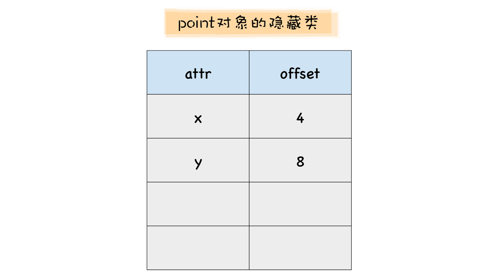
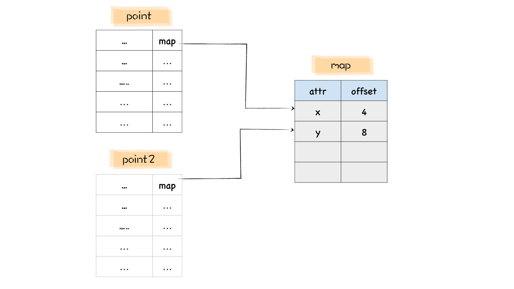
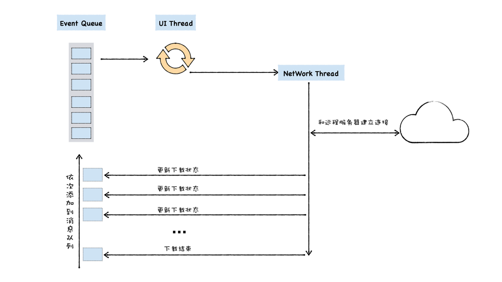

# 1. 隐藏类：如何在内存中快速查找对象属性？

## 1.1 为什么静态语言的效率更高？

```javascript
let point = {x: 100, y: 100};
console.log(point.x);
console.log(point.y);
```

```c++
struct Point {
  int x;
  int y;
}

Point point;
point.x = 100;
point.y = 200;
```


JavaScript 这种动态查询对象属性的方式和 C++ 这种静态语言不同，C++ 在声明一个对象之前需要定义该对象的结构，我们也可以称为形状，比如 Point 结构体就是一种形状，我们可以使用这个形状来定义具体的对象。

C++ 代码在执行之前需要先被编译，编译的时候，每个对象的形状都是固定的，也就是说，在代码的执行过程中，Point 的形状是无法被改变的。

那么在 C++ 中访问一个对象的属性时，自然就知道该属性相对于该对象地址的偏移值了，比如在 C++ 中使用 point.x 的时候，编译器会直接将 x 相对于 point 的地址写进汇编指令中，那么当使用了对象 point 中的 x 
属性时，CPU 就可以直接去内存地址中取出该内容即可，没有任何中间的查找环节。

因为静态语言中，可以直接通过偏移量查询来查询对象的属性值，这也就是静态语言的执行效率高的一个原因。

## 1.2 什么是隐藏类 (Hiden Class）？

既然静态语言的查询效率这么高，那么是否能将这种静态的特性引入到 V8 中呢？

答案是 **可行** 的。

目前所采用的一个思路就是将 JavaScript 中的对象静态化，也就是 V8 在运行 JavaScript 的过程中，会假设 JavaScript 中的对象是静态的，具体地讲，V8 对每个对象做如下两点假设：

+ 对象创建好了之后就不会添加新的属性；
+ 对象创建好了之后也不会删除属性。

符合这两个假设之后，V8 就可以对 JavaScript 中的对象做深度优化了，那么怎么优化呢？

具体地讲，V8 会为每个对象创建一个隐藏类，对象的隐藏类中记录了该对象一些基础的布局信息，包括以下两点：

+ 对象中所包含的所有的属性；
+ 每种类型相对于对象的偏移量。

有了隐藏类之后，那么当 V8 访问某个对象中的某个属性时，就会先去隐藏类中查找该属性相对于它的对象的偏移量，有了偏移量和属性类型，V8 就可以直接去内存中取出对于的属性值，而不需要经历一系列的查找过程，那么这就大大提升了 V8 查找对象的效率。

```javascript
let point = {x: 100, y: 200};
```

当 V8 执行到这段代码时，会先为 point 对象创建一个隐藏类，在 V8 中，把隐藏类又称为 map，每个对象都有一个 map 属性，其值指向内存中的隐藏类。

隐藏类描述了对象的属性布局，它主要包括了属性名称和每个属性所对应的偏移量，比如 point 对象的隐藏类就包括了 x 和 y 属性，x 的偏移量是 4，y 的偏移量是 8。



注意，这是 point 对象的 map，它不是 point 对象本身。关于 point 对象和 map 之间的关系，你可以参看下图：


在这张图中，左边的是 point 对象在内存中的布局，右边是 point 对象的 map，我们可以看到，point 对象的第一个属性就指向了它的 map。

有了 map 之后，当你再次使用 point.x 访问 x 属性时，V8 会查询 point 的 map 中 x 属性相对 point 对象的偏移量，然后将 point 对象的起始位置加上偏移量，就得到了 x 属性的值在内存中的位置，有了这个位置也就拿到了 x 的值，这样我们就省去了一个比较复杂的查找过程。

这就是将动态语言静态化的一个操作，V8 通过引入隐藏类，模拟 C++ 这种静态语言的机制，从而达到静态语言的执行效率。


## 1.3 多个对象共用一个隐藏类

在 V8 中，每个对象都有一个 map 属性，该属性值指向该对象的隐藏类。不过如果两个对象的形状是相同的，V8 就会为其复用同一个隐藏类。

+ 减少隐藏类的创建次数，也间接加速了代码的执行速度；
+ 减少了隐藏类的存储空间。

那么，什么情况下两个对象的形状是相同的，要满足以下两点：

+ 相同的属性名称；
+ 相等的属性个数。

```javascript

let point = {x: 100, y: 200};
let point2 = {x: 3, y: 4};

%DebugPrint(point);
%DebugPrint(point2);
```

当 V8 执行到这段代码时，首先会为 point 对象创建一个隐藏类，然后继续创建 point2 对象。在创建 point2 对象的过程中，发现它的形状和 point 是一样的。这时候，V8 就会将 point 的隐藏类给 point2 复用，具体效果你可以参看下图：



## 1.4 重新构建隐藏类

JavaScript 依然是动态语言，在执行过程中，对象的形状是可以被改变的，如果某个对象的形状改变了，隐藏类也会随着改变，这意味着 V8 要为新改变的对象重新构建新的隐藏类，这对于 V8 的执行效率来说，是一笔大的开销。

通俗地理解，给一个对象添加新的属性，删除新的属性，或者改变某个属性的数据类型都会改变这个对象的形状，那么势必也就会触发 V8 为改变形状后的对象重建新的隐藏类。

同样，如果你删除了对象的某个属性，那么对象的形状也就随着发生了改变，这时 V8 也会重建该对象的隐藏类。

## 1.5 最佳实践

+ 如果对象的形状没有发生改变，那么该对象就会一直使用该隐藏类；
+ 如果对象的形状发生了改变，那么 V8 会重建一个新的隐藏类给该对象。

我们当然希望对象中的隐藏类不要随便被改变，因为这样会触发 V8 重构该对象的隐藏类，直接影响到了程序的执行性能。

**一，使用字面量初始化对象时，要保证属性的顺序是一致的**

**二，尽量使用字面量一次性初始化完整对象属性**

**三，尽量避免使用 delete 方法**

## 1.6 小结

为了加速查找对象属性的速度，V8 在背后为每个对象提供了一个隐藏类，隐藏类描述了该对象的具体形状。有了隐藏类，V8 就可以根据隐藏类中描述的偏移地址获取对应的属性值，这样就省去了复杂的查找流程。

不过隐藏类是建立在两个假设基础之上的：

+ 对象创建好了之后就不会添加新的属性；
+ 对象创建好了之后也不会删除属性。

一旦对象的形状发生了改变，这意味着 V8 需要为对象重建新的隐藏类，这就会带来效率问题。为了避免一些不必要的性能问题，我们在程序中尽量不要随意改变对象的形状。

+ 在 V8 中，每个对象都有一个隐藏类，隐藏类在 V8 中又被称为 map。
+ 在 V8 中，每个对象的第一个属性的指针都指向其 map 地址。
+ map 描述了其对象的内存布局，比如对象都包括了哪些属性，这些数据对应于对象的偏移量是多少？
+ 如果添加新的属性，那么需要重新构建隐藏类。
+ 如果删除了对象中的某个属性，通用也需要构建隐藏类。

# 2. 消息队列：V8是怎么实现回调函数的？

## 2.1 什么是回调函数？

回调函数具有函数的所有特征，它可以有参数和返回值。如果单独给出一个函数，你是看不出来它是不是回调函数的。回调函数区别于普通函数，在于它的调用方式。只有当某个函数被作为参数，传递给另外一个函数，或者传递给宿主环境，然后该函数在函数内部或者在宿主环境中被调用，我们才称为回调函数。

具体地讲，回调函数有两种不同的形式，同步回调和异步回调。通常，我们需要将回调函数传入给另外一个执行函数，那么同步回调和异步回调的最大区别在于 **同步回调函数是在执行函数内部被执行的，而异步回调函数是在执行函数外部被执行的**。

## 2.2 UI 线程的宏观架构

早期浏览器的页面是运行在一个单独的 UI 线程中的，所以要在页面中引入 JavaScript，那么 JavaScript 也必须要运行在和页面相同的线程上，这样才能方便使用 JavaScript 来操纵 DOM，所以从一开始，JavaScript 就被设计成了运行在 UI 线程中。

所谓 UI 线程，是指运行窗口的线程，当你运行一个窗口时，无论该页面是 Windows 上的窗口系统，还是 Android 或者 iOS 上的窗口系统，它们都需要处理各种事件，诸如有触发绘制页面的事件，有鼠标点击、拖拽、放大缩小的事件，有资源下载、文件读写的事件，等等。

在页面线程中，当一个事件被触发时，比如用户使用鼠标点击了页面，系统需要将该事件提交给 UI 线程来处理。

在大部分情况下，UI 线程并不能立即响应和处理这些事件，比如在你在移动鼠标的过程中，每移动一个像素都会产生一个事件，所以鼠标移动的事件会频繁地被触发。在这种情况下，页面线程可能正在处理前一个事件，那么最新的事件就无法被立即执行。

针对这种情况，我们为 UI 线程提供一个消息队列，并将这些待执行的事件添加到消息队列中，然后 UI 线程会不断循环地从消息队列中取出事件、执行事件。**我们把 UI 线程每次从消息队列中取出事件，执行事件的过程称为一个任务**。


```javascript
function UIMainThread() {
    while (queue.waitForMessage()) {
        Task task = queue.getNext()
        processNextMessage(task)
    }
}
```

在这段代码中，queue 是消息队列，queue.waitForMessage() 会同步地等待消息队列中的消息到达，如果当前没有任何消息等待被处理，则这个函数会将 UI 线程挂起。如果消息队列中有消息，则使用 queue.getNext() 取出下一个要执行的消息，并交由 processNextMessage 函数来处理消息。

这就是通用的 UI 线程的结构，有消息队列，通过鼠标、键盘、触控板等产生的消息都会被添加进消息队列，主线程会循环地从消息队列中取出消息并执行。

## 2.3 异步回调函数的调用时机

比如在页面主线程中正在执行 A 任务，在执行 A 任务的过程中调用 setTimeout(foo, 3000)，在执行 setTimeout 函数的过程中，宿主就会将 foo 函数封装成一个事件，并添加到消息队列中，然后 setTimeout 函数执行结束。

主线程会不间断地从消息队列中取出新的任务，执行新的任务，等到时机合适，便取出 setTimeout 设置的 foo 函数的回调的任务，然后就可以直接执行 foo 函数的调用了。

通过 setTimeout 的执行流程其实是比较简单的，在 setTimeout 函数内部封装回调消息，并将回调消息添加进消息队列，然后主线程从消息队列中取出回调事件，并执行。

还有一类比较复杂一点的流程，最典型的是通过 XMLHttpRequest 所触发的回调，它和 setTimeout 有一些区别。

因为 XMLHttpRequest 是用来下载网络资源的，但是实际的下载过程却并不适合在主线程上执行，因为下载任务会消耗比较久的时间，如果在 UI 线程上执行，那么会阻塞 UI 线程，这就会拖慢 UI 界面的交互和绘制的效果。所以当主线程从消息队列中取出来了这类下载任务之后，会将其分配给网络线程，让其在网络线程上执行下载过程，这样就不会影响到主线程的执行了。



结合上图，我们就可以来分析下通用的 UI 线程是如何处理下载事件的，大致可以分为以下几步：

+ UI 线程会从消息队列中取出一个任务，并分析该任务。
+ 分析过程中发现该任务是一个下载请求，那么主线程就会将该任务交给网络线程去执行。
+ 网络线程接到请求之后，便会和服务器端建立连接，并发出下载请求；
+ 网络线程不断地收到服务器端传过来的数据；
+ 网络线程每次接收到数据时，都会将设置的回调函数和返回的数据信息，如大小、返回了多少字节、返回的数据在内存中存放的位置等信息封装成一个新的事件，并将该事件放到消息队列中 ;
+ UI 线程继续循环地读取消息队列中的事件，如果是下载状态的事件，那么 UI 线程会执行回调函数，程序员便可以在回调函数内部编写更新下载进度的状态的代码；
+ 直到最后接收到下载结束事件，UI 线程会显示该页面下载完成。

这就是 XMLHttpRequest 所触发的回调流程，除了下载以外，JavaScript 中获取系统设备信息、文件读取等都是采用了类似的方式来实现的

## 2.4 小结

关于异步回调，这里也有两种不同的类型，其典型代表是 setTimeout 和 XMLHttpRequest。

setTimeout 的执行流程其实是比较简单的，在 setTimeout 函数内部封装回调消息，并将回调消息添加进消息队列，然后主线程从消息队列中取出回调事件，并执行回调函数。

XMLHttpRequest 稍微复杂一点，因为下载过程需要放到单独的一个线程中去执行，所以执行 XMLHttpRequest.send 的时候，宿主会将实际请求转发给网络线程，然后 send 函数退出，主线程继续执行下面的任务。网络线程在执行下载的过程中，会将一些中间信息和回调函数封装成新的消息，并将其添加进消息队列中，然后主线程从消息队列中取出回调事件，并执行回调函数。

# 3. V8是怎么通过内联缓存来提升函数执行效率的？

**内联缓存 (Inline Cache)，简称 IC**

## 3.1 什么是内联缓存？

在 V8 执行函数的过程中，会观察函数中一些 **调用点 (CallSite)** 上的关键的中间数据，然后将这些数据缓存起来，当下次再次执行该函数的时候，V8 就可以直接利用这些中间数据，节省了再次获取这些数据的过程，因此 V8 利用 
IC，可以有效提升一些重复代码的执行效率。

IC 会为每个函数维护一个 **反馈向量 (FeedBack Vector)**，反馈向量记录了函数在执行过程中的一些关键的中间数据。

反馈向量其实就是一个表结构，它由很多项组成的，每一项称为一个插槽 (Slot)，V8 会依次将执行 loadX 函数的中间数据写入到反馈向量的插槽中。

```javascript
function loadX(o) { 
    o.y = 4;
    return o.x;
}
```

当 V8 执行这段函数的时候，它会判断 o.y = 4 和 return o.x 这两段是 **调用点 (CallSite)**，因为它们使用了对象和属性，那么 V8 会在 loadX 函数的反馈向量中为每个调用点分配一个插槽。

每个插槽中包括了插槽的索引 (slot index)、插槽的类型 (type)、插槽的状态 (state)、隐藏类 (map) 的地址、还有属性的偏移量，比如上面这个函数中的两个调用点都使用了对象 o，那么反馈向量两个插槽中的 map 属性也都是指向同一个隐藏类的，因此这两个插槽的 map 地址是一样的。

**暂停记录，有其他的事情要做**


xx
