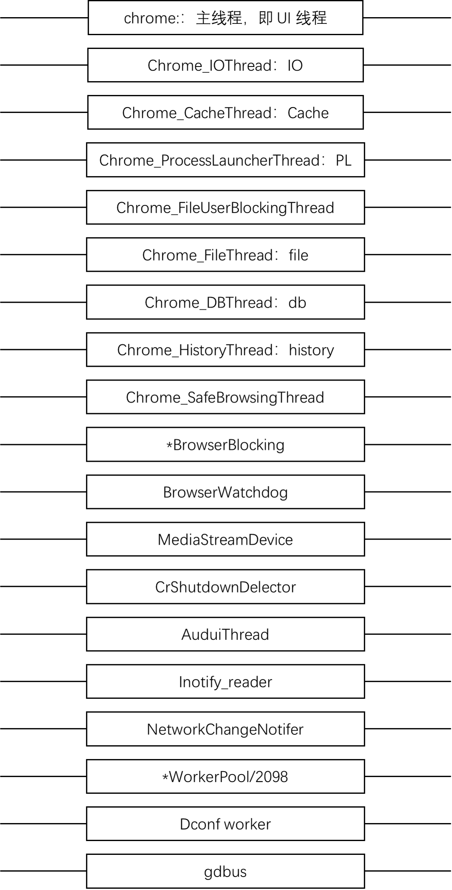
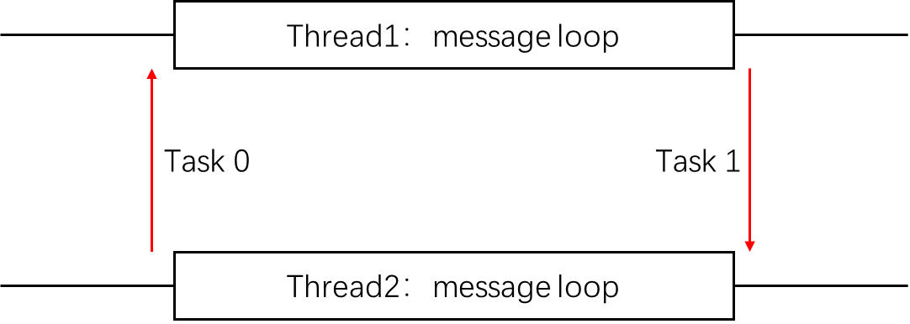

# 1. Chromium的多线程机制

## 1.1 概述

为什么会有这么多的线程，主要的目的就是为了保持 UI 的高响应度，保证 UI 先后才能不会被任何其他费时的操作阻碍从而影响了对用户的响应。

线程间如何通信呢？Chromium 设计了一套机制来处理线程通信。

每个线程内部如何处理任务和事件？使用 MessageLoop，每个线程都会有一个自己的 MessageLoop，他们用来处理这些事件和任务。

任务和 MessageLoop 的基本原理：任务被派发到进程的某个线程的 MessageLoop 的队列中，MessageLoop 会调度执行这些 Task。

## 1.2 重要的线程

+ chrome线程：进程的主进程，browser 进程主要是负责 UI，也是管家。Renderer 进程则是管家兼处理 Webkit 渲染的。GPU 进程是负责处理绘图请求并调用 openGL 进行绘制工作的。
+ Chrome_IOThread/Chrome_ChildIOThread 线程：用来接受来自其他进程的 IPC 信息和派发自身消息到其他进程。
+ SingalSender 线程：V8 JavaScript 引擎中用于处理 Linux 信号的进程。

## 1.3 任务

Chromium 的特色是在事件的基础上，加入了一个新的机制——任务。当需要执行某个操作时候，可以把该操作封装成一个任务，由任务派发机制传递给相应的进程的 MessageLoop。 

# 2.消息循环

在 Chromium 里，需要处理三种类型的消息：Chromium 自定义的任务，Socket 或者文件等 IO 操作，用户界面 UI 的消息。

这里边，Chromium 自定义任务是平台无关的，而后面两种类型的消息是平台相关的。

## 2.1 Chromium中主要的类

+ **类 RunLoop**
  
一个辅助类，主要封装消息循环 MessageLoop 类，其本身没有什么特别的功能，主要提供与一组公共接口被调用，其本质是调用 MessageLoop 类的接口和实现。

+ **类 MessageLoop**

主消息循环。原理上讲，它应该可以处理三种类型的消息，包括支持不同平台的消息。
