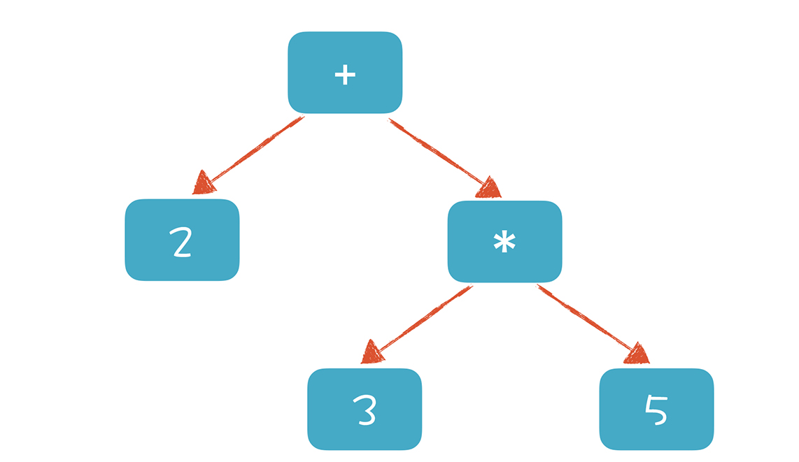

# 1. 理解代码·编译器的前端技术

**前端** 是指编译器对程序代码的分析和理解过程。

**后端** 是指生成目标代码的过程，跟目标机器有关。


编译器的前端主要分为三个部分：**词法分析**，**语法分析**，**语义分析**，主要涉及自动机和形式语言方便的基础计算理论。

## 1.1 词法分析

代码里的 **词** ，英文叫做 token，中文叫做 **词法记号**。

分析一段 C 语言代码

```c
#include <stdio.h>

int main(int argc, char* argv[]) {
    int age = 45;
    if (age > 17 + 8 + 20) {
        printf("Hello old man!\\n");
    } else {
        printf("Hello young man!\\n");
    }
    return 0;
}
```

在这么一段程序里进行词法分析，会先识别出 `int`，`if`，`else` 和 `return` 等关键字。`main`，`printf` 和 `age
` 等识别符，`+`，`-` 和 `=` 这样的操作符号。以及花括号，圆括号，分号等标点符号，以及数字字面量，字符串，空格等，都是 token。

通过制定一些规则来区分每个不同的 token。

**识别 age 这样的标识符**，以字母开头，后边是字母或数字，直到遇到第一个既不是字母又不是数组的字符结束。

**识别 > = 这样的操作符**，当扫描到一个 `>` 符号时，就要注意，他可能是 GT(Great Than，大于)操作符，因为 GE(Great Equal ，大于等于) 也是以 `>` 开头的，所以需要再往下看一位，如果是 `=`，那么这个 token 就是 GE，否则就是 GT。

**识别 45 这样的数字字面量**，当扫描到一个数字字符时，就开始把他看做数字，直到遇到非数字的字符。

不同语言都不同的规则设定，我们可以通过手写程序来实现，很多编译器的词法分析器都是手写实现的，例如 GUN 的 C 语言编译器。

但是都用手写会比较麻烦，而且很耗费时间。所以也可以采用词法分析器的生成工具来生成。比如 Lex ，这些生成工具是基于一些规则来工作的，这些规则用 **正则文法** 表达，附和正则文法的表达式成为 **正则表达式**。生成工具可以读入正则表达式，生成一种叫 **有限自动机** 的算法，来完成具体的词法分析工作。

正则文法是一种最普通，最常见的规则，写正则表达式的时候用的就是正则文法。

有限自动机是一个有限状态的自动机器，以抽水马桶为例，分为两个状态，**注水** 和 **水满** 状态，当在注水的状态时，浮球上升到一定高度，就会把阀门关闭，从而转为水满的状态。

词法分析器也是类似，词法分析器会分析这个程序的字符串，当遇到不同的字符时，会驱使它迁移到不同的状态。例如，在扫描 age 的时候，处于标识符的状态，等遇到一个 > 符号，就会切换到比较操作符的状态。词法分析的过程，就是一个个状态迁移的过程。


## 1.2 语法分析

词法分析完毕之后，就会开始语法分析，词法分析时识别一个一个的单次，而语法分析时在词法分析的基础上识别出程序的语法结构。这个结构是一个树状的结构，计算机容易理解和执行。

程序有定义良好的语法结构，它的语法分析过程，就是构造一棵树。一个程序就是一棵树，这棵树叫做 **抽象语法树(Abstract Syntax Tree)**。树的每个节点（子树）是一个语法单元，这个单元的构成规则就叫 **语法**，每一个节点都可能会有子节点。

计算机语言的程序结构就是一个机构嵌套另外一个结构，大程序嵌套子程序，子程序又可以嵌套子程序。

**形成AST以后有什么好处呢？就是计算机很容易去处理。** 根据生成后的 AST，我们可以从根节点开始遍历，得到每个节点的值。

如果再把循环语句，判断语句，赋值语句等节点加到 AST 上，并解释执行它，那么实际上就实现了一个脚本语言。而执行脚本语言的过程，就是遍历 AST 的过程。

**构造 AST**，自上而下进行分析，首选构造根节点，代表整个程序，之后再向下扫描 token 串，构建它的子节点。当他看到一个 int 类型的 token
 时，知道这是一个变量声明语句，于是就会建立一个变量声明的节点。接着再遇到 age，建立一个子节点，这是第一个变量。之后遇到 =，意味着这个变量有初始化值，那么建立一个初始化的子节点，最后遇到一个字面量，值为 45。

这样，一颗子树扫描完毕，程序回退到根节点，开始构建根节点的第二个子节点。就这样递归扫描，直到构建起一棵完整的树。

与自上向下对应的，有自下向上的算法，这个算法会将最下面的叶子结点之别出来，然后再组装上一级节点。

## 1.3 语义分析

语法分析完毕之后，就是语义分析，语义分析的目的就是让计算机理解程序的真实目的，把一些模棱两可的地方消除掉。

计算机语言的语义一般可以表达为一些规则，只要检查是否符合这些规则既可。

比如：

某个表达式的计算结果是什么数据类型？如果有数据类型不匹配的情况，是否要做自动转换？

如果在一个代码块的内部和外部有同样的变量名，那么在执行的时候，该使用哪个？

在同一个作用域内，不允许有两个名称的变量名相同，唯一性检查。

# 2. 正则文法和有限自动机

写出一个词法分析器，能够分析下边的三个程序语句：

+ 关系表达式：age >= 45
+ 变量声明和初始化语句：int age = 40
+ 算术表达式：2 + 3 * 5

## 2.1 解析示例

标识符、比较操作符和数字字面量的 token 词法规则

+ 标识符：第一个字符必须是字母，后边的字符可以是字母或数字
+ 比较操作符：`>` 或 `>=`，暂时忽略其他
+ 数字字面量：全部由数字构成，暂时忽略浮点数

**一个严格意义上的有限自动机**


+ 初始状态：刚开始启动词法分析的时候，程序所处的状态。
+ 标识符状态：在初始状态时，当第一个字符是字母的时候，迁移到状态 2。当后续字符是数字和字母时，保留在状态 2。如果不是，就离开状态2，写下该 token，回到初始状态。
+ 大于操作符（GT）：在初始状态时，当第一个字符是 `>` 时，进入这个状态，是比较操作符的一种情况。
+ 大于等于操作符（GE）：如果状态3 的下一个字符是 `=`，就进入状态4，变成 `>=`，是比较操作符的另一种情况。
+ 数字字面量：在初始状态时，下一个字符是数字，进入这个状态，如果后续仍是数组，就保持在状态5。

**词法原理，就是依据构造好的有限自动机，在不同的状态中迁移，从而解析出Token来。你只要再扩展这个有限自动机，增加里面的状态和迁移路线，就可以逐步实现一个完整的词法分析器了。**

## 2.2 初识正则表达式

上边例子涉及了 4 种 token，每种 token 的正则表达式如下：

```
Id:         [a-zA-Z_] ([a-zA-Z_] | [0-9])*
IntLiteral: [0-9]+
GT:         '>'
GE:         '>='
```

**正则符号**

+ `[]` 代表匹配方括号中的字符之一
+ `[abc]` 匹配 a 或 b 或 c
+ `[a-z]` 匹配从 a 到 z 的任意一个字符
+ `*` 匹配 0 个或者多个前面的元素
+ `+` 匹配 1 个或者多个前面的元素
+ `''` 严格匹配单引号里面的所有字符

不同语言的标识符、整型字面量的规则可能是不同的。在 js 里，就可以用中文做变量名，但是在 C 语言里就不可以。

## 2.3 处理标识符和关键字规则的冲突

比如 int 这个关键字，与标识符很想，都是以字母开头，后边跟着其他字母。这个时候，如果扫描的时候，该使用什么规则区分？


当第一个字符是 i 的时候，让他进入到一个特殊的状态。接下来，如果遇到 n 和 t，就进入状态4。这个时候，如果后续的字符还有其他的字母或数字，他就变成了一个普通的标识符，否则就是关键字或保留字。

# 3. 语法分析：公式计算器

[源码](https://gitee.com/richard-gong/PlayWithCompiler/blob/master/lab/craft/SimpleCalculator.java)

**实现一个公式计算器，掌握语法分析的原理和递归下降算法(Recursive Descent Parsing)，并初步了解上下问无关文法(Context-free Grammar, CFG)。**

## 3.1 解析声明变量语句：理解“下降”的含义

变量声明语句的规则，用形式化的方法表示。它的左边是一个非终结符(Non-terminal)，右边是他的产生式(Production Rule
)。在语法分析的过程中，左边会被邮编代替。如果代替之后还有非终结符，那么继续这个代替过程，直到最后全部都是终结符(Terminal)，也就是 token。只有终结符才可以成为 AST 的叶子结点，这个过程也叫做推导(Derivation)过程。

`intDeclaration: Int Identifier ('=' additiveExpression)?:`

int 类型声明的变量，需要有一个 Int 的 token，加上一个变量标识符，后边跟一个可选的赋值表达式，翻译成程序语句，就是这样：

```
MatchIntDeclare() {
    MatchToken(Int);    // 匹配 Int 关键字
    MatchIdentifier();  // 匹配标识符
    MatchToken(Equal);  // 匹配等号
    MatchExpression();  // 匹配表达式
}
```

解析的过程：在解析变量声明语句时，先看第一个 token 是不是 int，如果是 int，那么就创建一个 AST 节点，记录一下 int
 后边变量的名称，然后再看后面是不是跟了初始化的部分内容，就是一个等号表达式。如果有等号，那么就匹配等号表达式。

一般来说，变量声明语句会建立四个子节点，分别是 int 关键字、标识符、等号和表达式。为了简化，我们只生成一个表达式子节点。

在语法分析的时候，调用这些函数跟后边的 token 串做模式匹配，如果匹配上了，就返回一个 AST 节点，否则返回 null。如果匹配过程中发现跟语法规则不匹配，那么就会报编译错误。

在这个过程中，上级文法嵌套下级文法，上级的算法调用下级的算法。表现在 AST 中，上级算法生成上级节点，下级算法生成下级节点，这就是 **下降** 。

**程序结构基本上是跟文法规则同构的，这就是递归下降算法的优点，非常直观。**

`int age = 45` 生成的 AST

```
Program Calculator
    IntDeclaration age
        AssignmentExp =
            IntLiteral 45
```

## 3.2 用上下文无关文法描述算术表达式

在解析算术表达式的时候，会遇到很多更复杂的情况，这个时候正则文法就不够用了，所以需要引入 **上下文无关文法** 来表达。

算术表达式包含加法和乘法两种类型的运算，他们各自有不同的优先级。

所以，我们要把规则分为两级，第一级是加法规则，第二级是乘法规则，同时把乘法规则作为加法规则的子规则，这样形成的 AST，乘法节点一定是加法节点的子节点，从而被优先计算。



如果要计算表达式的值，只需要对根节点进行求值，为了完成对根节点的求值，需要对下级节点递归求值。所以，在解析表达式的时候，可以在加法规则中嵌套匹配乘法。

加法规则中还会递归地引用加法规则。

加法规则文法比正则文法的表达能力更强，叫做 **上下文无关文法**。正则文法是上下文无关文法的一个子集。区别就是：上下文无关文法允许递归调用，正则文法不可以。

上下文无关的意思是：无论在任何情况下，文法的推导规则都是一样的。

## 3.3 解析算术表达式：理解递归的含义

比如解析：`2 + 3` 这个加法表达式，结果会出现以下几种情况

+ 首先匹配是不是乘法表达式，发现不是；
+ 然后匹配是不是加法表法师，这里是递归调用；
+ 重复上面的两步，无穷无尽。

additiveExpression Plus multiplicativeExpress 这个问法规则第一个部分就递归的引用了自身，这种情况叫做 **左递归**。

左递归是递归下降算法无法处理的，这是递归下降算法最大的问题。

解析归程：先尝试能否匹配乘法表达式，如果不能，那么这个节点肯定不是加法节点，因为加法表达式的两个产生式都必须首先匹配乘法表达式。遇到这种情况，直接返回 null ，调用者这次没有匹配成功。如果乘法表达式匹配成功，那么就再尝试匹配加号右边的部分，也就是去递归地匹配加法表达式。如果匹配成功，就构造一个加法的 ASTNode 返回。

运算这个算法解析 `2 + 3 * 5`，得到下边的 AST

```
Program Calculator
    AdditiveExp         +
        IntLiteral      2
        MulticativeExp  *
            IntLiteral  3
            IntLiteral  5
```

## 3.4 实现表达式求值

要实现一个表达式计算，只需要基于 AST 做求值运算，这个过程只需要对这棵树做深度优先遍历即可。

以 `2 + 3 * 5` 为例，解析求值过程

```
Calculating: AdditiveExp            // 计算根节点
    Calculating: IntLiteral         // 计算第一个子节点
    Result: 2                       // 第一个子节点的结果是 2
    Calculating: MulticativeExp     // 递归计算第二个子节点
        Calculating: IntLiteral
        Result: 3
        Calculating: IntLiteral
        Result: 5
    Result: 15                      // 忽略递归细节，得到 15
Result: 17                          // 根节点的值是 17        
```

## 3.5 DSL 解释

```
additiveExpression
    :   multiplicativeExpression
    |   additiveExpression Plus multiplicativeExpression
    ;

multiplicativeExpression
    :   IntLiteral
    |   multiplicativeExpression Star IntLiteral
    ;
```

# 4. 语法分析：二元表达式

左递归：在二元表达式的语法规则中，如果产生式的第一个元素是它自身，那么程序就会无限地递归下去。

## 4.1 书写语法规则，并进行推导


