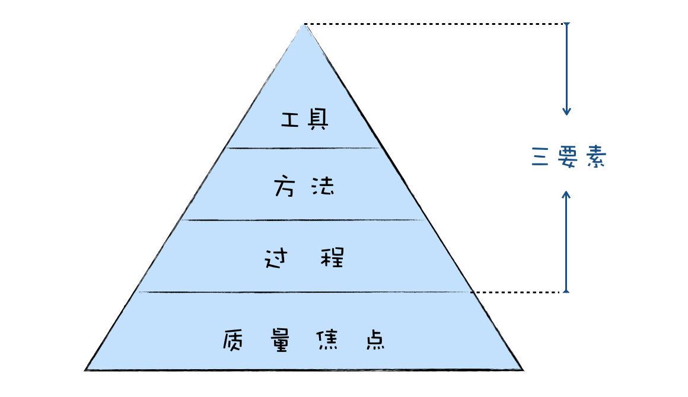

# 1. 软件工程知识架构全景图

在《软件工程——实践者的研究方法》这本经典软件工程教材中，作者 Roger S.Pressman 画了一张图，高度概括了整个软件工程的核心知识。

“质量焦点”在最底层，这不难理解软件工程是为了应对软件危机诞生的学科，其目标就是为了要聚焦于质量，构建和维护高质量的软件。可以说，聚焦于质量就是软件工程的基石。

+ 过程
    + 要解决软件过程中的混乱，将软件开发过程中的沟通、计划、建模、构建和部署等活动有效地组织起来。
    + 软件过程，就是在软件项目的生命周期内，也就是软件从诞生到结束这期间，在开发与构建系统时要遵循的步骤。
+ 方法是指在整个过程中，如何构建系统的方法学。
+ 工具，工具来辅助方法的执行，提高效率

**软件工程 = 工具 + 方法 + 过程。**

# 2. 学习软件工程的四重境界

+ 第一重：用器
“器”就是工具，工具规则简单，上手就可以用，也很快就能看到效果。比如，原型设计工具可以帮助你确定需求，持续集成工具可以帮助你简化测试和部署的流程。对工具的学习是最为简单的，也是最基础的。

+ 第二重：学术
“术”就是方法，学会方法，你就能应用方法去完成一个任务，例如用需求分析的方法，你去搞清楚用户想要什么，用 Scrum 去组织项目开发过程。

掌握了术，甚至是可以脱离器的，例如你没用原型设计工具，你用纸和笔，用白板，一样可以去沟通确认需求。

+ 第三重：悟道
“道”就是本源，软件工程知识的核心思想和本质规律。就像敏捷开发，本身并不是一种方法，而是一套价值观和原则，领悟了这个道，就可以成为你在处理项目过程中各种问题决策的依据。道是可以产生术的，你掌握了敏捷开发的道，你就可以领悟出 Scrum、极限编程这样的术。

+ 第四重： 传道
当你能把复杂的知识通过浅显易懂的方式传授给别人，那就说明你对知识的领悟已经到了更高的境界。同时，教学也是最好的学习方式，通过传授别人知识，可以让你对知识本身有更深入的理解。

# 3. 做中学和教中学

+ “做中学”，是一种自下而上的学习方法，通过实践，从使用工具到学习方法，再从方法中提炼出道。

在学习本专栏的时候，你可以采用“做中学”的方式，把专栏中的知识应用起来，在实践的过程中去巩固你学到的知识，去思考背后的道。把已经积累的项目经验和软件工程的知识点关联起来，这样才能加深你的理解，学以致用，把经验和知识转化为能力。

+ “教中学”，是一种自上而下的学习方法，通过教学，去进一步深入领会别人总结出来的道，去模仿推导方法，去学习如何使用工具。

比如，你学习完一篇专栏文章后，把学到的知识进行输出，写成微博或博客分享出去；在公司内部讲给你的同事们听等。在教学分享的过程中，去进一步深化吸收知识内容，构建你的知识体系。
