# 1. 什么是软件工程

有人参与、有计划、有步骤地造一件产品，我们通常称为“工程”。

所有工程的本质，就是要做出有用的产品，比如造房子的建筑工程、造火箭的航天工程。像网红“手工耿”一样专搞无用发明的情况，我们是不能称为“工程”的。

当软件的规模越来越大，复杂度不断增加，软件项目开发维护过程中的问题就逐步暴露出来：**软件产品质量低劣、软件维护工作量大、成本不断上升、进度不可控、程序人员无限度地增加。**

软件工程定义的本质：就是要用工程化方法去规范软件开发，让项目可以按时完成、成本可控、质量有保证。

瀑布模型的诞生，在当时是有非常重大的意义的，让软件开发从无序到有序，让大家更好的分工协作，同时每个阶段又衍生出各自的方法学和工具，例如需求分析、软件测试等等。

然而瀑布的特性决定了它只能从上往下流，而且从上到下走完整个周期很长，所以一旦出现了需求的变更，将会非常痛苦，很多事情需要重头再来。

于是基于瀑布模型，又衍生出 V 模型、原型设计、增量模型、螺旋模型等模型，试图改善瀑布模型存在的一些缺陷。这些改进模型的发展趋势上就是缩短项目周期，快速迭代。

# 2. 把每一件事都当做一个项目来推进

软件工程是一门用工程化方法解决软件项目问题的学科，其本质也是一门工程学科，这门课的知识在学完后，不仅可以应用在软件项目中，还可以应用于日常生活中遇到的一些问题，Everything is a project。

解决这些问题的方式，就是参考软件生命周期和瀑布模型，把一件事情分成几个阶段：分析、设计、实施、测试、完成，然后制定相应的计划。这种方法不仅非常有效，让我的做事效率大幅提高，而且让我在看待事情上，能够更全面地、站在更高的角度去思考。

## 2.1 工程方法

有目的、有计划、有步骤地解决问题的方法就是工程方法。

工程方法通常会分成六个阶段：想法、概念、计划、设计、开发和发布。

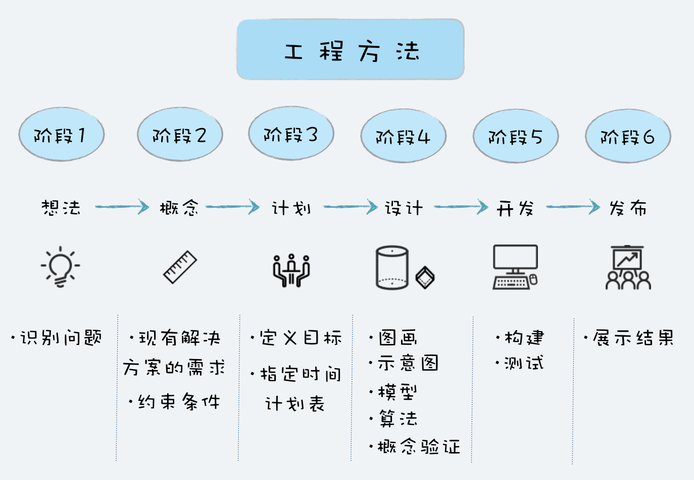

+ **想法：** 想法阶段通常是想要解决问题。最开始问题通常是模糊的，所以需要清晰地定义好问题，研究其可行性，检查是否有可行的解决方案。
+ **概念：** 概念阶段就是用图纸、草图、模型等方式，提出一些概念性的解决方案。这些方案可能有多个，最终会确定一个解决方案。
+ **计划：** 计划阶段是关于如何实施的计划，通常会包含人员、任务、任务持续时间、任务的依赖关系，以及完成项目所需要的预算。
+ **设计：** 设计阶段就是要针对产品需求，将解决方案进一步细化，设计整体架构和划分功能模块，作为分工合作和开发实施的一个依据和参考。
+ **开发：** 开发阶段就是根据设计方案，将解决方案构建实施。开发阶段通常是一个迭代的过程，这个阶段通常会有构建、测试、调试和重新设计的迭代。
+ **发布：** 将最终结果包括文档发布。

## 2.2 站在整体而非局部去看问题

使用工程方法做事情的好处

+ 有一个被有效论证过的方法论指导你，可以帮助你提高成功概率，也可以提高效率。
+ 当你用工程方法去思考的时候，你会更多的站在整体而非局部去思考，更有大局观。

所以问题的核心并不在于是不是用工程方法，而是有没有把这件事当作一个项目，是不是能看到这件事的全貌，而不是只看到局部。

站在项目整体来看问题，你就会去关注项目的质量、项目的进度、项目的成本、项目的最终用户

每个项目成员，如果能多站在项目的角度去考虑，那么这样不仅对项目有利，更对自己有好处。

+ 为了项目整体的效率和避免返工浪费，产品经理会及早和开发人员确认技术可行性，并对产品设计先行验证；
+ 为了节约项目开发成本，提高开发效率，架构师选择成熟的架构，合理购买商业组件和使用开源程序；
+ 为了提升开发效率，不影响项目开发进度，开发工程师尽可能采用成熟的技术，高效简洁地落实项目；
+ 为了项目质量和效率，测试工程师学习自动化测试技术，将大部分测试变成自动化运行，极大地提高了测试效率和质量；
+ 为了让用户有好的体验，不仅产品经理，每个人都会仔细体验用户界面，对于不合理的地方提出改进意见。

工程思维，本质上是一种思考问题的方式，在解决日常遇到的问题时，尝试从一个项目的角度去看待问题、尝试用工程方法去解决问题、站在一个整体而不是局部的角度去看问题。

改变，最有效的是方式是改变思想，这往往也是最难的部分。

# 3. 瀑布模型

## 3.1 瀑布模型六个主要阶段

+ 一、问题的定义及规划
这个阶段是需求方和开发方共同确定软件开发目标，同时还要做可行性研究，以确定项目可行。这个阶段会产生需求文档和可行性研究报告。

+ 二、需求分析
对需求方提出的所有需求，进行详细的分析。这个阶段一般需要和客户反复确认，以保证能充分理解客户需求。最终会形成需求分析文档。

+ 三、软件设计
根据需求分析的结果，对整个软件系统进行抽象和设计，如系统框架设计，数据库设计等等。最后会形成架构设计文档。

+ 四、程序编码
将架构设计和界面设计的结果转换成计算机能运行的程序代码。

+ 五、软件测试
在编码完成后，对可运行的结果对照需求分析文档进行严密的测试。如果测试发现问题，需要修复。最终测试完成后，形成测试报告。

+ 六、运行维护
在软件开发完成，正式运行投入使用。后续需要继续维护，修复错误和增加功能。交付时需要提供使用说明文档。

也是从那时开始，有了“软件生命周期”(Software Life Cycle,SLC) 的概念。

软件生命周期是软件的产生直到报废或停止使用的生命周期。而像瀑布模型这样，通过把整个软件生命周期划分为若干阶段来管理软件开发过程的方法，叫软件生命周期模型。

因为不管什么软件项目，不管采用什么开发模式，有四种活动是必不可少的，那就是需求、设计、编码和测试。而这四项活动，都是起源自瀑布模型，也是瀑布模型中核心的部分。

## 3.2 如何用瀑布模型开发项目

+ 需求分析的阶段

在项目立项后，产品经理首先和老板充分的沟通，了解老板的想法是什么，要做一个什么样的网站。在了解老板的想法后，产品经理对市场上同类的社交网站进行了调研，然后用原型工具设计了网站的原型。原型虽然很简陋，但是从原型可以看出来，项目要做成什么样子，便于确认需求。

原型拿给老板看后，老板再根据自己的想法提一些反馈，这样反复沟通确认，在原型设计确认清楚后，产品经理开始撰写产品设计文档，将原型设计落实到文档，将整个网站划分成不同的功能模块，例如用户注册、登录、添加好友等，确定每个功能模块需要哪些功能。

这个阶段产品经理是最忙的，那这时候其他人在干嘛呢？其他人都还挺轻松的，架构师研究网上流行的社交网站都采用什么架构，程序员、测试看看技术文档。

虽然最终确定了产品设计文档，但是因为中间反复确认的时间过长，原定 2 周能完成的需求分析，最后拖到了 3 周。项目经理一看，最终上线时间点没法延，那就只好压缩编码时间了，不行加加班！

+ 软件设计

产品经理的产品设计文档确定后，架构师开始做架构设计，UI 设计师开始设计 UI，测试经理开始针对产品设计文档写测试用例，产品经理还要进一步设计交互。

由于前期原型设计工作做的好，所以 UI 设计还是很顺利的，主风格定下来以后，各个界面就是细节的确认了。

因为产品设计文档写的详细，输入输出很清楚，测试用例也进展顺利。

至于架构设计这边，架构师很有经验，先把整体架构确定，写了个技术方案文档，和大家一起开会讨论，几次后确认了整体技术方案。按照功能模块一拆分，把其中一个功能模块做了一个样板，然后把各个子模块分给开发人员，大家一起协助做详细设计，然后再分别确认。

大家都如火如荼地忙起来了。如果一切顺利的话，软件设计 4 周应该能完成，可以进入编码阶段了。但是软件设计进行到第 3 周的时候，老板的想法发生了一些变化。

因为市场上已经有了游戏社交的网站，而且运营结果不算太好，而网页游戏正流行，如果我们的平台能接入网页游戏，这会是个不错的机会。

于是需求变更了，我们要能和其他网页游戏的用户系统对接，这个需求最开始是没有提出来，也没有考虑的。

项目经理考虑再三，决定还是接受这个需求变更，但是希望能多一些时间，老板没同意，认为时间点很重要，哪怕砍一点功能，牺牲一点质量也要如期上线。但就算这时候砍功能，设计工作还是少不了多少。

于是产品经理重新修改相应原型，再确认，再重新修改产品设计文档。变更完后，UI 设计的相关页面重新修改设计、测试人员修改测试用例，最苦的是架构师，当初没有考虑到要和其他用户系统对接，现在用户系统的设计都要重新考虑了。

于是为了赶进度，项目组开始加班，即使如此，软件设计阶段也推迟到了第 5 周才勉强完成。

+ 程序编码

终于进入编码阶段了，为了保证进度，加班还在继续，哪怕前期做了大量的设计，真到编码的时候还是有好多没有考虑到的，同时各个模块之间还存在相互依赖，有时候虽然自己功能开发完成，还需要等待其他人的功能完成才能调试，所以 5 周时间很快就过去了，而程序还不能完整地跑起来。

其实中间还有个小插曲，老板觉得还要加上支付的功能，但是项目经理觉得这个阶段改需求已经不可能了，以辞职为威胁总算顶回去了，打算放在下个版本加上。

终于到第 6 周的时候，有了一个勉强可以测试的版本。

+ 软件测试

留给测试的时间只有两周了，但是前期实在 bug 太多，两周测试时间过去，软件质量还是很糟糕，完全无法正常使用，于是项目不得不延期，一直延期了 4 周后，才算具备上线条件。

## 3.3 瀑布模型的优缺点

+ 每个阶段都有侧重的事情，就像需求阶段专注于搞清楚需求，编码阶段专注于实现。这种编码前先设计、编码后测试、整个过程重视文档的方式，开发出来的产品，质量相对是有保障的。
+ 最大的问题就是不能及时响应需求变更，越到后期变更代价越大。另外，通常要到最后阶段才能看到结果是什么样子。

+ 优点：
    + 简易可行
    + 可以按照阶段检查，能及时发现问题
    + 前一个阶段完成后，就可以重点关注下一个阶段
    + 很好的分工协作
    + 对质量有保证
+ 缺点：
    + 难以响应需求的变更，当需求发生改变时，越到后期代价越大
    + 工作量分布不均衡
    + 前期进度受阻，会一直压缩后续阶段的时间，导致延期或影响质量
    + 一直到最后阶段才能看到结果

+ 瀑布模型解决的问题
    + 让软件开发过程有序可控。瀑布模型的每个阶段都有明确的任务，每个阶段都有明确的交付产物，都有相应的里程碑。这些让整个过程更可控，而且能及早发现问题。
    + 让分工协作变成可能。瀑布模型的六个阶段，也让软件开发产生相应的基础分工：项目经理、产品经理、架构师、软件工程师、测试工程师、运维工程师。
    + 质量有保障。瀑布模型每个阶段都需要交付相应的文档，而文档的撰写和评审，可以帮助在动手之前把问题沟通清楚，想清楚。瀑布模型在编码结束后，会有严密的测试，只有测试验收通过后，才能上线发布。这些措施都让软件的质量更有保障。

# 4. 其他开发模型

## 4.1 快速开发快速改

快速原型模型，就是为了要解决客户的需求不明确和需求多变的问题。

**先迅速建造一个可以运行的软件原型，然后收集用户反馈，再反复修改确认，使开发出的软件能真正反映用户需求，这种开发模型就叫快速原型模型，也叫原型模型。重点是反映软件核心功能和交互，功能可以是不完整的，可靠性和性能要求不高，但开发速度可以很快。**

**原型模型因为能快速修改，所以能快速对用户的反馈和变更作出响应，同时原型模型注重和客户的沟通，所以最终开发出来的软件能够真正反映用户的需求。**

但这种快速原型开发往往是以牺牲质量为代价的。

在原型开发过程中，没有经过严谨的系统设计和规划，可靠性和性能都难以保障。所以在实际的软件项目中，针对原型模型的这种快速、低质量的特点，通常有两种处理策略：**抛弃策略和附加策略**。

**抛弃策略** 是将原型只应用于需求分析阶段，在确认完需求后，原型会被抛弃，实际开发时，将重新开发所有功能。

**附加策略** 则是将原型应用于整个开发过程，原型一直在完善，不断增加新功能新需求，直到满足客户所有需求，最终将原型变成交付客户的软件。

另外，原型制作并不一定要像传统代码一样进行设计编码，有很多原型工具，像 Axure、墨刀等，简单的拖拽就可以实现简单的界面和交互，同样可以达到确认需求的目的。现在原型设计已经成为产品经理确认需求的一个非常重要手段。

## 4.2 大瀑布拆小瀑布

**瀑布模型的很多问题，根源都是周期太长。** 周期长所以中间难以响应变更，周期长所以客户很久才能看到结果，周期太长所以风险不好控制。如果能将周期变短，那么很多问题就迎刃而解了。

基于这种思路，产生了很多开发模型，比较典型的主要是：**增量模型 和 迭代模型**。

+ 增量模型——按模块分批次交付

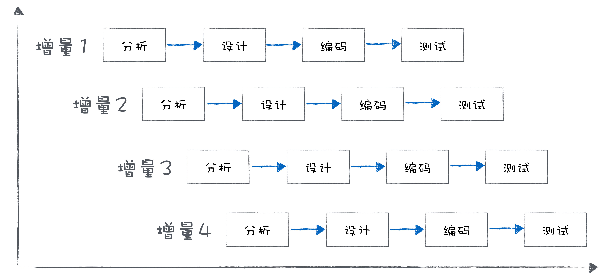

增量模型是把待开发的软件系统模块化，然后在每个小模块的开发过程中，应用一个小瀑布模型，对这个模块进行需求分析、设计、编码和测试。相对瀑布模型而言，增量模型周期更短，不需要一次性把整个软件产品交付给客户，而是分批次交付。

因为增量模型的根基是模块化，所以，如果系统不能模块化，那么将很难采用增量模型的模式来开发。另外，对模块的划分很抽象，这本身对于系统架构的水平是要求很高的。

基于这样的特点，增量模型主要适用于：需求比较清楚，能模块化的软件系统，并且可以按模块分批次交付。

+ 迭代模型——每次迭代都有一个可用的版本

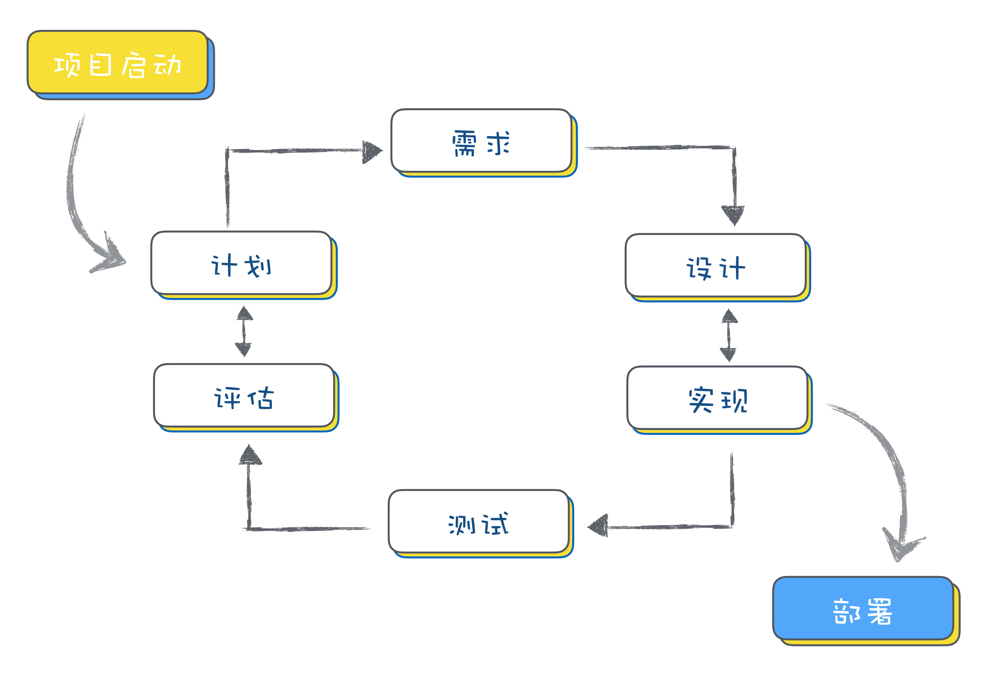

迭代模型每次只设计和实现产品的一部分，然后逐步完成更多功能。每次设计和实现一个阶段叫做一个迭代。

在一个迭代中都会包括需求分析、设计、实现和测试，类似于一个小瀑布模型。迭代结束时要完成一个可以运行的交付版本。

增量模型是按照功能模块来拆分；而迭代模型则是按照时间来拆分，看单位时间内能完成多少功能。

瀑布模型开发的项目，因为要很长时间才能看到最终结果，而且结果通常跟最初描述的结果相差较多，客户看到后多少会有些心理落差。

而后来改用迭代模型后，因为每次迭代完成后都有可以运行的版本，这样客户可以直观感受软件的进展，及时调整心理预期。尤其是当客户见证了一个软件从简陋到完善的过程，往往满意度是比较高的。

**迭代模型最难的部分，在于规划每次迭代的内容和要达到的目标。**

## 4.3 如何选模型

+ 外包项目，需要阶段验收

你可以采用瀑布模型开发，但是甲方需要对你项目的每个阶段进行验收测试，以确认你是不是达到要求。

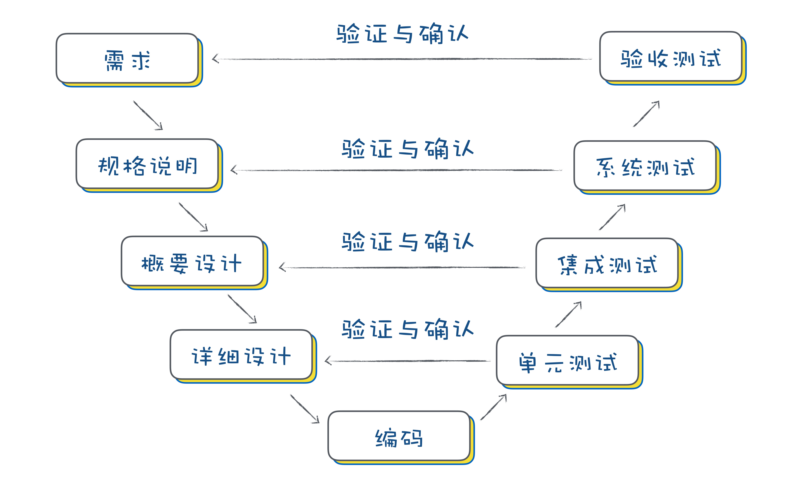

这个模型就是 V 模型，本质上它还是瀑布模型，只不过它是更重视对每个阶段验收测试的过程模型。

+ 项目风险高，随时可能会中断

如果你现在要做一个风险很高的项目，客户可能随时不给你钱了。这种情况下，如果采用传统瀑布模型，无疑风险很高，可能做完的时候才发现客户给不了钱，损失就很大了！

这种情况，基于增量模型或者迭代模型进行开发，就可以有效降低风险。你需要注意的是，在每次交付的时候，要同时做一个风险评估，如果风险过大就不继续后续开发了，及时止损。

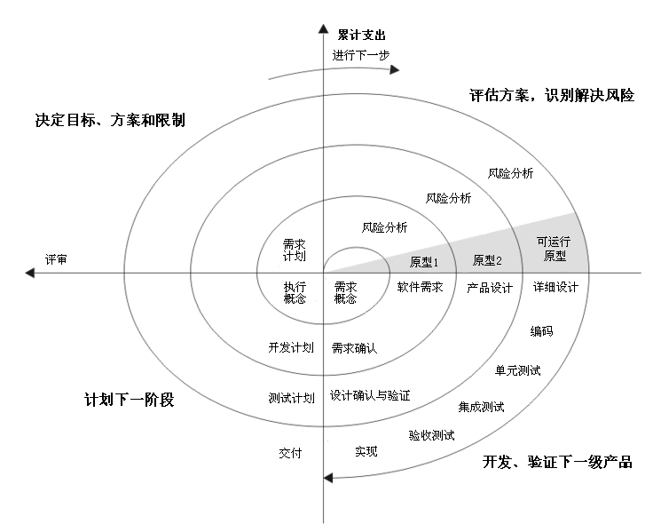

+ 山寨一款软件产品，希望能快速上线发布

其实软件行业山寨的案例不少，山寨项目的特点是，项目需求是明确的，不会有什么变化，这时候就可以选择增量模型，划分好模块，先实现核心模块，发布可运行版本，再增量发布其他模块。多模块可以同步开发。

+ 客户都没想清楚想要什么，但是个大单子

很多项目，客户一开始都没想清楚想要的是什么，需要花很长时间去分析定义需求，但是单子很大，值得认真去做好。

那么这样的项目，你可以考虑拆分成四个阶段：

**初始阶段：** 主要是确定需求边界和主要风险，几乎没有什么开发工作。

**细化阶段：** 这个阶段主要是确定需求，可以采用快速原型模型开发，和客户对需求反复确认，需要辅助一定量的开发和测试工作。对代码质量可以要求比较低，重点是确认需求。可能需要一个或多个版本迭代。

**构造阶段：** 在需求确认清楚后，现在可以使用迭代模型来开发，逐步交付产品。这个阶段的重点是开发和测试。如果迭代中，有新的需求加入或者需求变更，也可以在新的迭代中加入。

**交付阶段：** 在开发和测试完成后，产品可以交付客户，根据线上运行情况还需要修复一些 Bug。这个阶段重点是测试和部署。也会有多个迭代。

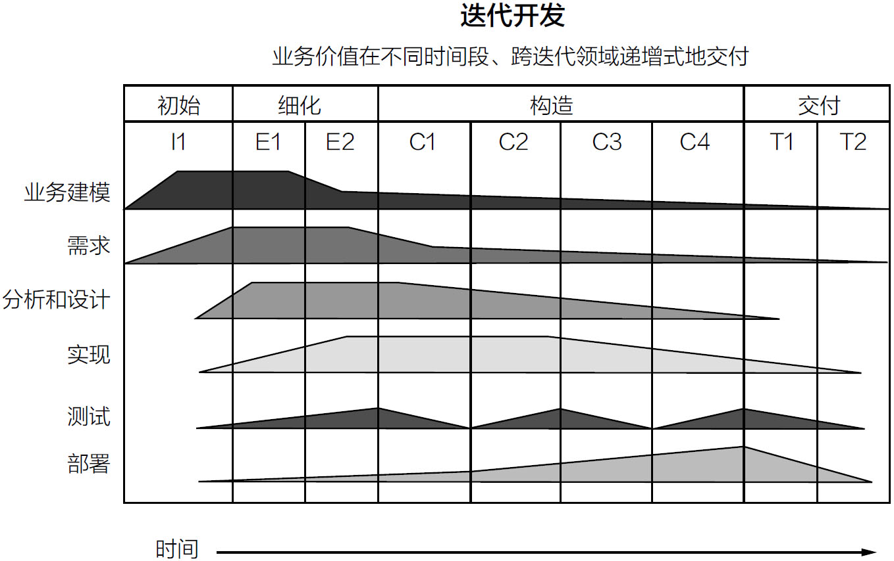

+ 我的产品已经上线，但是需要持续更新维护

很多产品在上线后，还在保持不停的更新维护，修复 Bug、增加新功能，每个月甚至每周更新。

在这种情况下，迭代模型是比较合适的。固定时间周期，在固定的周期内选择适合的需求开发任务和 Bug 修复任务去完成，按时发布。

另外还可以尝试敏捷开发，也是基于迭代的开发模型，它也强调快速交付，每次交付系统的部分功能，来保证客户满意度。在敏捷开发中，系统交付的周期称之为冲刺（Sprint）。

严格来说，敏捷开发并不算是一种开发模型，更像是框架或指南。有各种开发模型来实现敏捷开发，比如说极限编程（Extreme programming），看板（Kanban）和 Scrum。有关敏捷开发，我将在下一篇中向你详细讲解。

## 4.4 总结

现在的软件项目，各种类型都有，根据项目特点，选择好合适的开发模型，可以让你事半功倍，降低项目风险，提高项目开发效率，控制项目成本。比如说：

一个以确认需求为主要目的的项目，就可以不用花太多时间在代码质量上面，低成本、高效做出来才是最重要的；

一个高风险的项目，则可以采用螺旋模型，出现问题及时止损；

一个很长时间加班加点，却一直没法上线，导致士气低落的项目，可以改成增量模型，先上线一个小模块，让大家看到成绩提升士气，然后再迭代，逐步上线其他模块。

# 5. 敏捷开发

> 敏捷宣言：敏捷不是一种方法论，也不是一种软件开发的具体方法，更不是一个框架或过程，而是一套价值观和原则。

> 各种敏捷框架、方法论和工具，就像是“术”，告诉你敏捷开发的方式，而敏捷则是“道”，是一套价值观和原则，指导你在软件项目开发中做决策。

敏捷开发中流行的站立会议，主要目的是为了保证团队成员充分的沟通，遇到困难可以及时寻求帮助。但是如果每天的站立会议流于形式，并不能起到有效的目的，则应该减少频度，甚至取消换成其他方式。

**也就是说，当你开发做决策的时候，遵守了敏捷开发的价值观和原则，不管你是不是用 Scrum 或者极限编程，那么都可以算是敏捷开发。**

## 5.1 解决的问题

用敏捷开发的方式，不再像瀑布模型那样有严格的阶段划分，会在迭代中不断完善；不再写很多文档，而是和客户一起紧密合作；不再抵制需求变更，而是即时响应变更；不再等到测试阶段才发布，而是随时发布，客户随时可以看到东西。

## 5.2 敏捷开发和瀑布模型的差异
+ 敏捷开发是怎么做需求分析的？

瀑布模型的一个重要阶段就是需求分析，要有严谨的需求分析，产生详尽的需求分析文档。而敏捷开发的需求，主要是来源于一个个小的用户故事，用户故事通常是写在卡片上的一句话，在 Sprint 的开发中，再去确认需求的细节。

好处是减少了大量需求文档的撰写，可以早些进入开发。但这个对开发人员在需求理解和沟通的能力上要求更高了。

+ 敏捷开发是怎么做架构设计的？

瀑布模型在需求分析完了以后，就需要根据需求做架构设计。而在敏捷开发中，并不是基于完整的用户需求开发，每个 Sprint 只做一部分需求，所以是一种渐进式的架构设计，当前 Sprint 只做适合当前需求的架构设计。

这种渐进式的架构设计，迭代次数一多，就会出现架构满足不了需求的现象，产生不少冗余代码，通常我们叫它技术债务，需要定期对系统架构进行重构。

+ 敏捷开发怎么保证项目质量的？

瀑布模型在编码完成后，会有专门的阶段进行测试，以保证质量。在敏捷开发的 Sprint 中，并没有专门的测试阶段，这就依赖于开发功能的同时，要编写单元测试和集成测试代码，用自动化的方式辅助完成测试。

相对来说，这种以自动化测试为主的方式，质量确实是要有些影响的。

+ 敏捷开发是怎么发布部署的？

瀑布模型通常在编码结束后，开始部署测试环境，然后在测试阶段定期部署测试环境。测试验收通过后，发布部署到生产环境。

在敏捷开发中，这种持续构建、持续发布的概念叫持续集成，因为整个过程都是全自动化的，每次完成一个任务，提交代码后都可以触发一次构建部署操作，脚本会拿最新的代码做一次全新的构建，然后运行所有的单元测试和集成测试代码，测试通过后部署到测试环境。

持续集成是一个非常好的实践，极大的缩短和简化了部署的流程，而且自动化测试的加入也很好的保证了部署产品的质量。前期搭建整个持续集成环境需要一定技术要求。

+ 敏捷开发的 Sprint 和迭代模型的迭代有什么区别？

我们假设有两个团队，都要实现一个简单的用户系统，一个团队用迭代模型，一个团队用敏捷开发（Scrum），一个迭代 /Sprint 的时间周期都是 2 周（10 个工作日）。

迭代模型所在的团队，产品经理会先花 2 天时间去分析需求，写成需求分析文档，架构师会花 3 天时间来做设计，程序员会花 3 天时间编码，测试再花 2 天时间去测试，最后上线用户系统。

再看敏捷开发的团队，Product Owner（类似于产品经理）会把需求拆分成了几个简单的用户故事：用户登录、用户注册、找回密码、修改资料，然后放到当前 Sprint 的 Backlog（任务清单），Team（开发团队）成员开始从 Backlog 选择用户故事。

程序员 A 选了“用户登录”这个用户故事，他会去找 Product Owner 确认需求细节，之后动手实现这个用户故事。

功能完成后，同时程序员 A 还写了单元测试代码和集成测试代码，对登录的功能写了自动化测试。完成后，通过持续集成工具测试和部署到测试环境。部署完成后，用户登录功能就可以进行使用了。

这个过程，程序员 A 可能花了 4 天时间，做完“用户登录”这个用户故事之后，他又开始继续选取“找回密码”的用户故事来做，4 天时间也完成了。

其他程序员也和程序员 A 一样，他们也会从 Backlog 选择一些用户故事来做。

当团队中第 1 个用户故事部署完之后，测试人员就开始帮助测试，发现的 Bug 都提交到了 Backlog，程序员们在完成用户故事后，开始着手修复这些 Bug，正好在最后 2 天都修复完成。

从上面的例子，你可以看出，迭代模型本质上是一个小瀑布模型，所以在一个迭代里面，需要完整的经历从需求分析，到设计、编码、测试这几个完整的阶段。

所以像瀑布模型一样，刚开始测试的时候是不稳定的，到测试后期才逐步稳定下来，一般迭代前期也会相对轻松一点，而后期测试阶段可能会时间很紧张。

敏捷开发的 Sprint 中，没有严格的阶段划分，每个 Sprint 周期里面会完成多个用户故事。在用户故事的开发时，会针对用户故事有编码、自动化测试编码。当一个用户故事开发完成，即可通过持续集成自动发布到测试环境。

相对来收，敏捷开发中，整个 Sprint 的节奏是比较恒定，产品也是相对稳定的，即使用户故事没有完成，也不影响版本的发布。

因此，敏捷开发更注重软件开发中人的作用，需要团队成员以及客户之间的紧密协作。

## 5.3 该不该选择敏捷开发？

**需要一些满足一些条件才能用好**

+ 团队要小，人数超过一定规模就要分拆；
+ 团队成员之间要紧密协作，客户也要自始至终深度配合；
+ 领导们得支持。敏捷需要扁平化的组织结构，更少的控制，更多的发挥项目组成员的主动性；
+ 写代码时要有一定比例的自动化测试代码，要花时间搭建好源码管理和持续集成环境。

# 6. 大厂的敏捷开发方法（上）

工程中常见的“分而治之”的策略：大项目拆成小项目，大服务拆成小服务，大团队拆成小团队。

服务之间通过商定好的标准协议进行通信，架构上将大的服务拆分隔离成微服务，大团队按照业务或者服务拆分成小组，按照一定的流程规范保障协作。最终，各个小组要负责的内容其实就不多了。

归功于现在微服务、容器等新技术，可以将复杂的业务逐级拆分，让很多公司能真正敏捷起来。

## 6.1 一切工作任务围绕 Ticket 开展

早些年的项目开发，都是围绕着项目计划开展的，把甘特图打印贴在墙上，方便团队成员看项目进展到什么地步了。自从敏捷化后，开始变成了看板。

所谓的看板，就是把白板分成几个栏，每一栏为一类，分别写着“To Do（待选取）”、“In Progress（进行中）”、“Done（完成）”等，再把工作任务变成一个个五颜六色的即时贴，根据状态贴在不同的栏下面。

慢慢的物理的看板变成了电子看板，通过各种项目管理软件来管理跟踪这些任务，即时贴也变成了 Ticket（也有叫 Issue 的）。逐渐的，所有与开发相关的任务也都和 Ticket 挂钩了。

+ 报一个 Bug，提交一个 Ticket ；
+ 提一条需求，提交一个 Ticket ；
+ 要重构一下代码，提交一个 Ticket 。

看板这种基于 Ticket 来管理跟踪任务的方式，看起来繁琐，但确实是很高效的一种方式。

+ 每一个任务的状态都可以被跟踪起来：什么时候开始做的，谁在做，做完没有。
+ 整个团队在做什么一目了然。
+ Ticket 和敏捷开发中的 Backlog（任务清单）正好结合起来，通过 Ticket 可以收集管理整个项目的 Backlog 和当前 Sprint（迭代）的 Backlog。

作为项目成员来说，做完手头的事情也不用去问项目经理该干什么事情了，直接从 To Do 栏选一条 Ticket 做就是了；对于项目经理，看看 To Do 栏还有多少没有被选取，就知道还剩多少 Ticket 没完成，看看 In Progress 栏就知道哪些 Ticket 正在进行中。

如果有 Ticket 在这一栏待太久或者这一栏 Ticket 太多，那可能就有风险了，就可以及时介入。

## 6.2 基于 Git 和 CI 的开发流程

Git 本来只是源代码管理工具，但是其强大的分支管理和灵活的权限控制，结合一定的开发流程，却可以帮助你很好的控制代码质量。

代码审查（Code Review）和自动化测试。如果代码有严格的审查，并且所有自动化测试代码都能测试通过，那么可以认为代码质量是可靠的。当然前提是自动化测试代码要有一定的覆盖比率。

正规的项目组对于代码审查和自动测试代码的覆盖率都有严格的要求。现在还有一个问题，就是如何在合并到 master 之前把代码审查和自动化测试做好呢？

简单来说，就是每次要往 master 添加内容，不是直接提交代码到 master，而是先基于当前稳定的 master，克隆一个 branch（分支）出来，基于 branch 去开发，开发完成后提交一个 PR（Pull Request，合并请求）。

PR 提交后，就可以清楚的看出来代码做了哪些改动，其他人就可以针对每一行代码写评论提出修改意见。如果确认代码没问题了，就可以通过代码审查。

CI 会创建一个干净的运行环境，把你提交的代码下载下来，再下载安装所有依赖项，然后运行你的所有测试代码，运行完后，把测试结果报告给你。测试结果直观的反馈在 PR 上，绿色表示通过，红色表示不通过。

代码审查和自动测试的问题都解决了。当一个 PR 代码审查通过，以及 CI 通过了所有自动化测试，就可以合并到 master 了，而且我们也可以认为合并到 master 后的代码也是稳定的。

至于自动部署测试环境，反倒是简单，就是 CI 这个机器人，在你代码合并到 master 的时候，再次运行自动化测试代码，测试通过后直接运行自动部署的脚本，把 master 代码部署到开发环境或测试环境上。

## 6.3 敏捷开发方法的基本开发流程

+ 把要开发的 Ticket 从“To Do”栏移动到“In Progress”栏；
+ 从主干（master）创建一个分支（branch），基于分支去开发功能或修复 Bug；
+ 编写实现代码和测试代码（单元测试和集成测试），是不是测试驱动不重要，看个人偏好或团队要求；
+ 持续提交代码更新到分支，直到完成；
+ 创建 PR（Pull Request，合并请求），邀请其他人帮忙 Review 代码，根据 Review 的结果，可能还需要更新几次；
+ CI 在每一次提交代码到代码库后都会自动运行，运行后主要做这些工作：
    + 检查代码格式是不是符合规范；
    + 运行单元测试代码；
    + 运行集成测试。
+ 最终这些检查都完成后，CI 会把执行结果显示在 PR 上。通常绿色表示通过，红色表示失败；
+ PR 能合并需要满足两个条件：CI 变绿 + 代码 Review 通过；
+ PR 合并后，CI 会自动构建 Docker Image，将 Image 部署到开发环境；
+ 将相应的 Ticket 从看板上的“In Progress”栏移动到“Done”栏。

## 6.4 部署上线流程

随着容器化、微服务、DevOps 这些技术或概念的兴起，部署已经变得越来越高效，大厂已经开始在部署流程上融合这些理念。

以前是运维人员按照文档部署，现在已经变成了 DevOps 写自动化部署工具，然后开发人员自己去部署生产环境。

现在大厂的部署也都实现了自动化，但是流程上还是有一些控制。

+ 首先，部署的不再是程序代码，而是 Docker 的 Image，每次代码合并后 CI 都会自动生成新的 Image，测试也是基于 Image 测试。
+ 部署生产环境之前，先在内部的测试环境充分测试。
+ 部署生产环境前，需要审批确认，有 Ticket 跟踪。
+ 部署时，先部署一部分，监测正常后再全量部署。
+ 整个过程都有监控报警，出现问题及时回滚。

如果一切顺利的话，整个生产环境的服务部署过程通常几分钟就完成了，这在以前简直是不敢想象的事。

## 6.5 每日站立会议

是不是站着开会其实不重要，重点是要高效沟通反馈。

开会时间控制在半小时以内，半小时内不能完成的应该另外组织会议。

谁来主持站立会议呢？在敏捷的 Scrum 中，有一个角色叫 Scrum Master（敏捷教练、敏捷大师），主要任务就是保证各种敏捷流程的。

所以通常是由 Scrum Master 主持会议，也可以采用轮班制，每个星期换一名团队成员主持。负责主持会议的人，主要职责是组织会议，一个一个环节开展，控制好会议节奏。

+ 成员轮流发言：每个人轮流介绍一下，昨天干了什么事情，今天计划做什么事情，工作上有没有障碍无法推进。
+ 检查最新的 Ticket：每天例会都需要检查一下新增的 Ticket，并且要甄别一下优先级，然后决定是放到当前 Sprint，还是放到 Backlog（任务清单）。
+ 停车场问题：在这个环节，大家可以针对之前来不及讨论的问题进行讨论，能在会议时间内解决的问题，就马上解决，不能解决的会后再私下讨论或者再组织会议。

# 7. 大厂的敏捷开发方法（下）
## 7.1 组织分工

+ 产品经理：写需求设计文档，将需求整理成 Ticket，随时和项目成员沟通确认需求；
+ 开发人员：每天从看板上按照优先级从高到低领取 Ticket，完成日常开发任务；
+ 测试人员：测试已经部署到测试环境的程序，如果发现 Bug，提交 Ticket；
+ 项目经理：保障日常工作流程正常执行，让团队成员可以专注工作，提供必要的帮助，解决问题。

## 7.2 如何完成需求和修复 Bug？

这个小组的日常工作，也是围绕 Ticket 来开展的。所有的需求、Bug、任务都作为 Ticket 提交到项目的 Backlog，每个 Sprint 的任务都以看板的形式展现出来。

每个人手头事情忙完后，就可以去看板上的“To Do”栏，按照优先级从高到低选取新的 Ticket。选取后移动到“In Progress”栏。

## 7.3 每周一部署生产环境

没有人愿意星期五部署，那意味着如果部署后发现故障，可能周末都没法好好休息了。所以即使程序早已经测试好了，除非特别紧急，否则都会留在下一周再部署。所以部署放在上半周，这样后面遇到问题还有足够的时间去应对。

部署很简单，按照流程执行几个命令就可以完成生产环境部署。部署完成后，需要对线上监控的图表进行观察，如果有问题需要及时甄别，必要的话对部署进行回滚操作。**但轻易不会打补丁马上重新上线，因为仓促之间的修复可能会导致更大的问题。**

像敏捷开发这样一周一个 Sprint 的好处之一就是，即使这一周的部署回滚了，下周再一起部署也不会有太大影响。

## 7.3 每周二开迭代回顾会议，总结上个 Sprint

每周二的早上，这个小组一般还会预留一个小时的时间，因为常规的站会完成后，还有一个迭代回顾会议 (Sprint Retrospective)会议，目的是回顾一下在迭代中，团队有哪些做的好的地方，有哪些做的不好的地方。

对于需要后续改进的，需要创建相应的 Ticket，加入到 Backlog 中，在后续迭代中改进完善。

如果会议中要形成涉及项目的决策，最好是通过集体表决的方式决策，尽可能避免独裁式决策。因为敏捷的原则之一是要 **善于激励项目人员，给他们以所需要的环境和支持，并相信他们能够完成任务。**

## 7.4 每周四迭代规划会，计划下周工作

每周四早上，也需要一个小时来组织会议。因为常规站会完成后，还有一个迭代规划会（Sprint Planning Meeting）。这个会议是要大家一起讨论下一个 Sprint 的内容。

在开会之前，产品经理和项目经理会商量好 Ticket 的优先级，会议上，大家一起按优先级高到低从 Backlog 中选出下个 Sprint 的内容。

+ 评估每条 Ticket 工作量的大概流程
    + 会议组织者阅读一条 Ticket，可能是用户故事，可能是 Bug，可能是优化任务。同时会询问大家对内容有没有疑问。
    + 大家一起讨论这个 Ticket，确保充分理解这个 Ticket。
    + 每个团队成员在心中对 Ticket 进行工作量估算。
    + 会议组织者确认大家是否都已经确定估算结果，确认后，开始倒数：“3，2，1”，大家一起伸出一只手，亮出代表分数的手指头。
    + 如果估算结果存在分歧，出分最高的和最低的各自说明理由，讨论后达成一致。

这种估算工作量的方法有个名字叫估算扑克，因为亮分时用扑克牌亮分而得名，但并非一定要用扑克牌。

+ 用这种方式评估工作量有几点很明显的好处
    + 大家积极参与，详细了解需求。相比以前，可能只有当某个功能模块分配到自己头上的时候，才会去详细了解那部分需求，而其他开发人员可能都不了解这部分需求。
    + 工作量是由实际参与开发的成员作出评估，往往更准确也更容易被接受。以前项目经理代为估算的模式，很容易不准确，或者让开发人员抵触。
    + 促进成员的交流和经验分享。我们知道一般经验浅的新手估算工作量都会偏乐观，而经验丰富的老手则会更准确，通过这种方式，新手可以向老手学习到很多工作量估算甚至技术实现的经验。

## 7.5 每周五分支切割

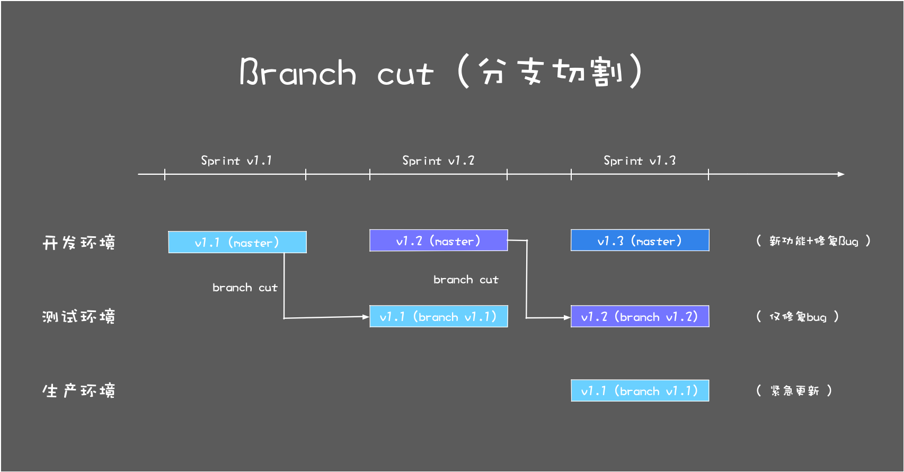

周五标志着一周的工作要结束了，所以下班之前（4 点左右），要做 branch cut（分支切割），也就是要把当前主干上的代码，克隆到一个分支（branch）上。

为什么要做分支切割这一步操作呢？

经过一周的开发，master （主干）已经合并了不少新的 PR（Pull Request，合并请求），但是如果你直接把 master 的代码部署到生产环境，肯定还是不放心，毕竟自动化测试还是不能完全代替专业测试人员的测试。

所以我们需要把 master 上的代码部署到测试环境进行测试，并且对测试出来的 Bug 进行修复，直到稳定下来为止。由于 master 还需要一直合并新的功能，所以最好的方式就是每次 Sprint 结束，从 master 创建一个分支版本出来，然后基于这个分支部署和修复 Bug。

所以需要基于主干做一个 branch cut，创建一个预部署的分支，将预部署分支的代码部署到测试环境，这样下周测试人员就可以测试新的版本。测试验收通过后，预部署分支的代码会部署到生产环境。

## 7.6 每周轮值

小组里面除了日常开发工作以外，其实还有不少琐碎的事情，比如每周部署生产环境，每天部署测试环境，每周的 branch cut（分支切割），回答其他小组的问题，主持每日会议（不一定需要项目经理），这些事情如果都是一个人做难免会有些枯燥。

在敏捷开发中，鼓励发挥每个成员的主动性，所以每周轮值是一个不错的方式，可以让每个人都有机会去体验一下，帮助团队完成这些事情，更有集体荣誉感和责任感。

# 8. 怎样平衡软件质量与时间成本范围的关系

## 8.1 软件项目管理金三角

在现实生活中，我们都知道，做产品想“多、快、好、省”都占着，是不可能的，最多只能选两样。

想要便宜和质量好，就要花时间等；想要快还要质量好，那就得多花钱；想要又便宜又快，那就得接受难用、质量差。

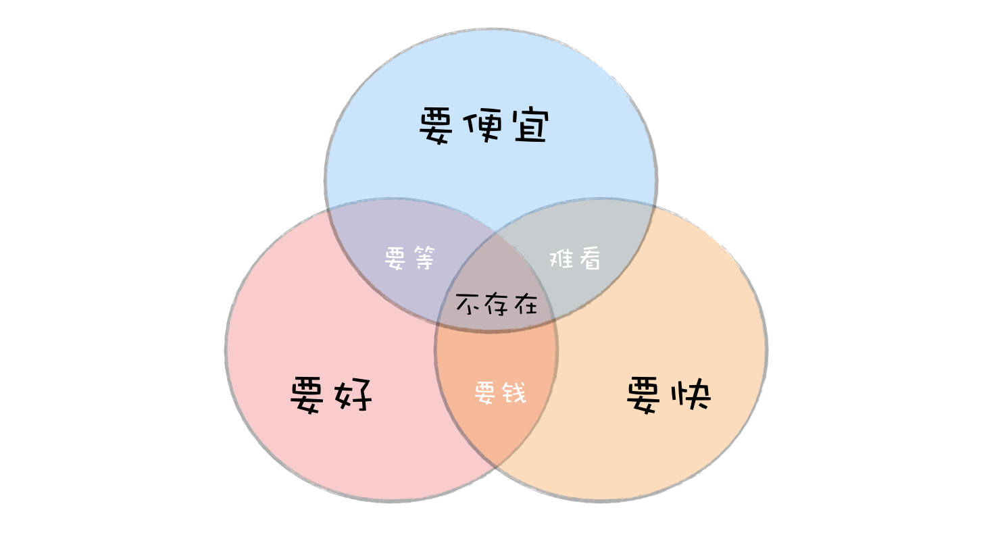

而在软件项目中，也有一个类似的平衡关系，就是软件质量（产品的质量，客户的满意度）与范围（需要实现多少功能）、时间（多久可以完成）、成本（花多少钱）四个要素之间的平衡。

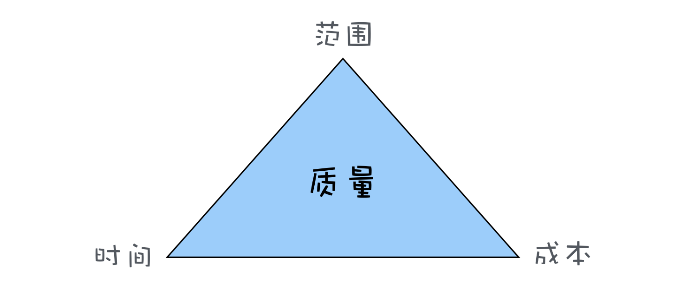

## 8.2 为什么四个要素，是“质量”放在三角形的中间？

因为软件工程的目标就是要构建和维护高质量的软件，所以项目的质量是高于一切的。也就是说，“质量”这个因素一般不会妥协，因此把“质量”放在三角形中间，然后在时间、成本、范围这三条边之间寻求平衡。

质量往往也是其他三个因素平衡后结果的体现，想要做的快、成本低、功能多，最后一定是个质量很差的产品。

## 8.3 如何应用“管理金三角”做决策？

项目管理其实就是项目中一系列问题的平衡和妥协，而“金三角”理论则为我们的平衡提供了理论指导，了解这三个因素分别对项目其他方面产生的影响，可以帮助你在做决策时进行权衡取舍。

当你接手一个项目，项目的进度、成本和范围指标很容易可以跟踪到。有了这些信息，你就可以及时发现问题，调整“金三角”的边，及时解决，以防止这些小问题发展成大问题。

+ 老板要压缩项目时间怎么办？

当项目经理，常遇到的问题之一就是时间被压缩，比如文章中开头举的例子，老板问我一个项目多久能完成，我按照经验，觉得要三个月，老板觉得三个月太久了，要砍到一个月就上线。

遇到这种问题，我就换了一种方式跟老板沟通：“一个月也不是不行，就是我们得需求调整一下，第一个版本只能做一些核心功能，剩下的后面版本再加上（调整范围）。另外还得给我加两人，不然真做不完！（增加成本）”

+ 产品经理要临时加需求怎么办？

增加需求，也就是范围这条边要增加，那就必然对成本和时间这两条边造成影响，要么延期，要么增加成本。

面对这种临时加需求的情况，我们也不需要直接说不能加，而是清楚的让产品经理认识到这样做的后果：进度延期，需要更多的成本。如果这个功能真的太重要，可以接受延期，也不是不可以接受，那就重新制定新的项目计划好了。

## 8.4 瀑布模型和敏捷开发如何平衡时间成本范围的关系？

除了可以将“金三角”的知识应用在软件项目中，还可以应用它来理解和应用软件工程中的开发模式，尤其是瀑布模型和敏捷开发这两种典型的开发模式。

瀑布模型有严格的阶段划分，有需求分析、系统设计、开发和测试等阶段，通常在开发过程中不接受需求变更，也就是说，我们可以认为瀑布模型的范围是固定的，其他两条边时间和成本是变量。

所以使用瀑布模型开发，如果中间发现不能如期完成进度，通常选择的方案就是延期（加班），或者往项目中加人。

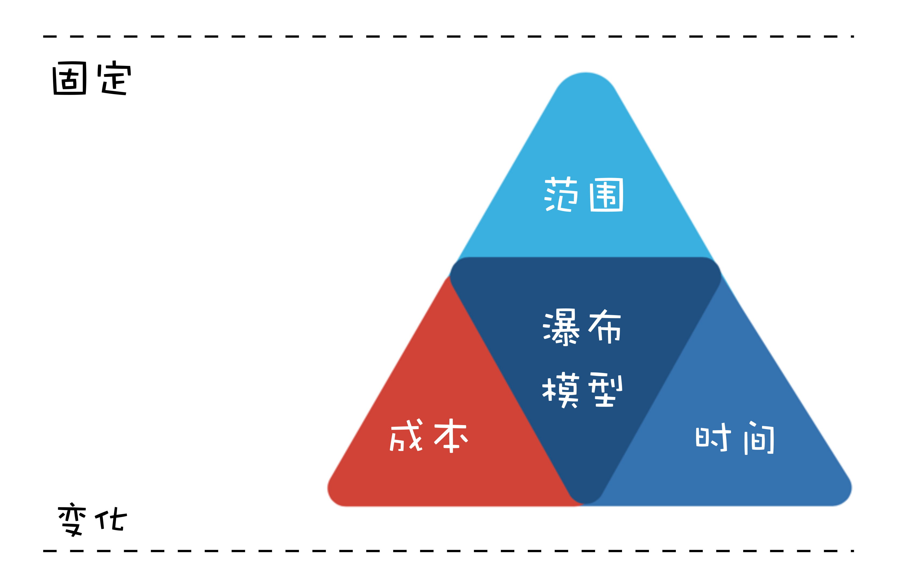

敏捷开发中，是采用固定时间周期的开发模式，例如每两周一个 Sprint，团队人数也比较少。所以，在敏捷开发中，时间和成本两条边是固定，就只有范围这条边是变量。

这就是为什么在敏捷开发中，每个 Sprint 开始前都要开 Sprint 计划会，大家一起选择下个 Sprint 能做完的任务，甚至于在 Sprint 结束时，没能完成的任务会放到下个 Sprint 再做。

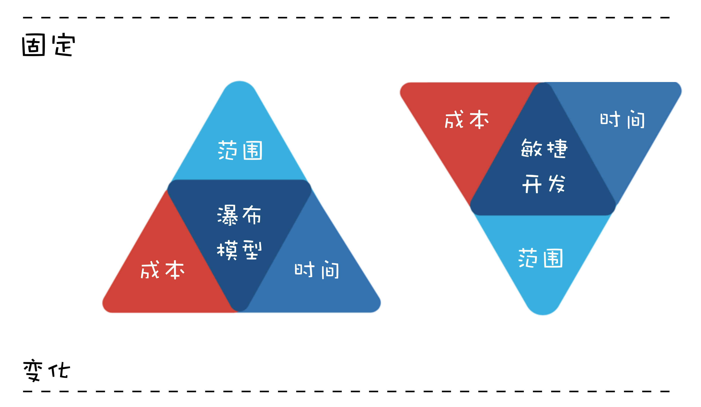

## 8.5 如何平衡好软件质量与时间成本范围的关系？

从时间、成本和范围这三条边中找出来固定的一条或者两条边，再去调整另一条边。

+ 极限编程
    + 持续集成，通过自动化的方式帮助我们部署，节约了大量需要人去手动部署的时间；
    + 自动化测试，通过自动化测试，节约测试时间，另外，有了自动化测试，可以避免后面修改代码产生 Bug，减少了大量的浪费；
    + 只做刚好的设计，避免设计时考虑了太多不必要的可能，造成浪费。

+ MVP 模式
 MVP（minimum viable product，最小化的可行性产品）模式，是一种快速推出产品的模式：一开始只推出最核心的功能，满足用户最核心的需求，然后在用户的使用过程中收集反馈，进一步升级迭代。

所以最简单有效的办法就是砍掉一些重要性不那么高的功能需求，只保留最核心的需求。通过缩小范围的方式，达到快速推出高质量产品的效果。

类似的道理，我们程序员，在遇到很多功能忙不过来的时候，可以主动的去和项目经理协商，砍掉一些不那么重要的需求，把精力放在核心需求上，保证项目可以如期上线。
