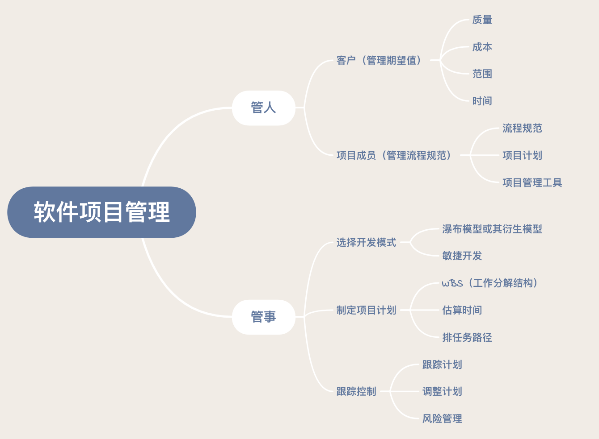
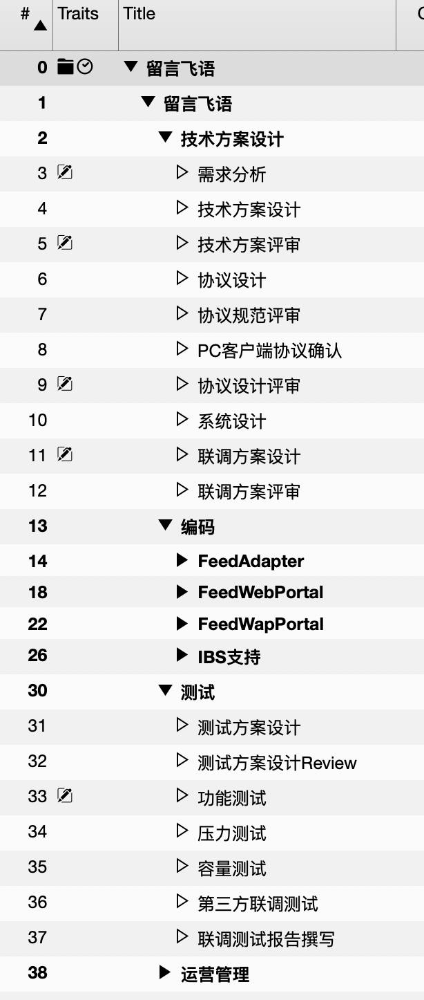
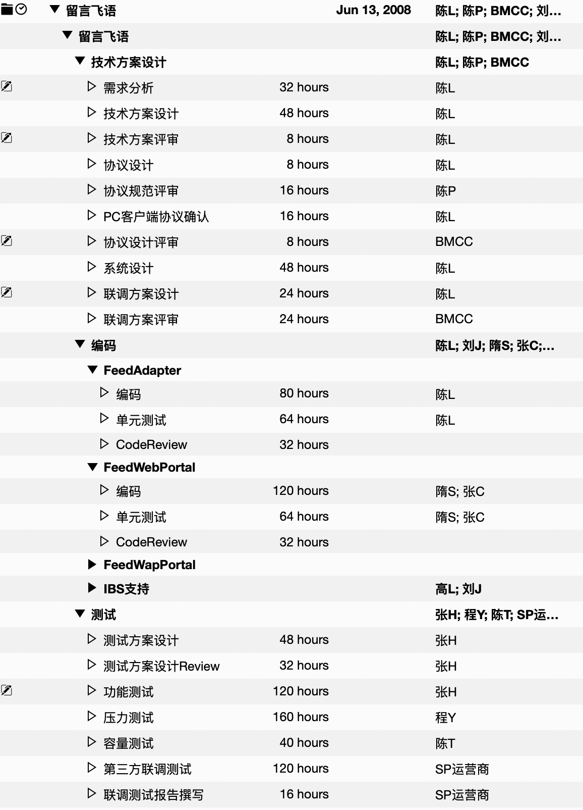
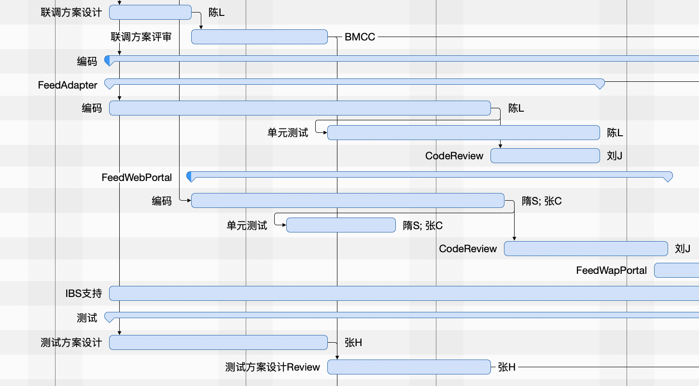
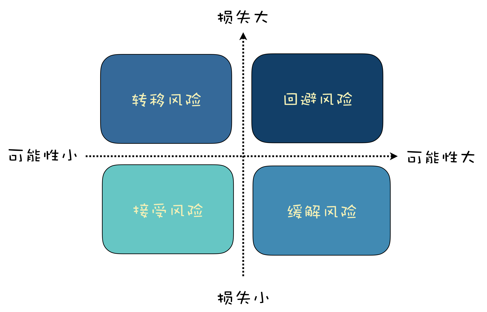

# 1. 可行性研究

“可行性研究”通常讲的是如何科学地论证项目的可行性，以及这个项目是不是值得做。

对于软件项目的可行性研究，主要从以下几个方面入手：

+ **经济可行性。** 从成本和收益角度分析，看投入产出比。不仅要分析短期利益，还要分析长期利益，看是不是值得做。
+ **技术可行性。** 软件项目最终是需要人通过技术来实现的，所以要分析技术上是不是可行，如果有技术上解决不了的问题又能否规避。
+ **社会可行性。** 社会可行性涉及法律、道德、社会影响等社会因素。比如，触犯国家法律的事情肯定不能做；产品如若不符合道德标准，可能带来较大的社会负面影响，那么也要慎重考虑。

可行性研究不是软件项目的专利，在很多其他工程领域，项目正式启动前，都会有可行性研究这一环节，而且一般都会请一家甚至多家专业的评估机构帮助做可行性分析，并出具可行性研究报告，然后项目方来决定是不是立项。

## 1.1 错误一：“因为我们是软件项目，所以我们很特殊。”

“我们很特殊”，这句话听着有没有很熟悉？软件项目确实有和其他工程项目不一样的地方。

比如说软件项目很抽象，以至于在立项之前对于问题的描述（需求）和解决方案（技术方案）通常都是模糊不清的，只有随着项目的推进，才能逐步搞清楚需求。

可行性研究是基于问题和解决方案来分析的，因此这有点像“先有鸡还是先有蛋”的问题：你得先立项才能慢慢搞明白需求是什么，然后才能有解决方案；而你只有搞明白需求是什么，以及解决方案是什么，才能去做可行性研究。

但“我们很特殊”，不能成为不做可行性分析的借口，可能项目需求最开始是模糊不清的，还不具备可行性研究的条件，那么等到项目有了一定的进展，需求逐步明确后，要继续对可行性做研究。

**如果发现方案不具备可行性，也应及时调整方案或停止项目以止损。**

## 1.2 错误二：“老板拍板的项目，明知道不可行也得硬着头皮干呀！”

如果你是项目执行人员，不能参与决策，但觉得项目明显不可行，我仍然建议你尽可能站在专业的角度给出科学的分析，通过合理的方式反馈意见。毕竟，项目如果失败了，你也一样可能遭受损失。

如果你就是老板或者项目负责人，则应该建立可行性研究的意识，并理性听取不同意见，科学客观地进行可行性分析，以便有效降低项目失败概率。

## 1.3 错误三：“软件项目是鼓励创新、鼓励试错的，可行性研究会阻碍创新！”

这也是一种很典型的错误观点，认为创新就可以不做可行性研究，否则会阻碍创新。实际上可行性研究和创新从来就不是矛盾的，它反而可以帮助你提前过滤掉那些不靠谱的创新想法，提前发现可能的风险。

## 1.4 总结

如果可行性研究并不能给你一个很明确的结果，也可以考虑小范围试点，先实现一个最小化可行产品，等验证了可行性，再逐步加大投入。

# 2. 先管好一个项目，再做技术管理

项目管理，是最基础的管理，既要管理一个项目，又要协调整个团队一起，完成共同的目标。

**管理，最重要的一点就是大局观，要能从整个项目的角度，从整个团队的角度去思考，去确定方向，去发现问题，对问题及时解决及时调整。**

当你把注意力都放在技术细节上，就容易忽视其他事情，例如和其他人之间的沟通、不关心当前项目进展。

就像有人说的：

> 关注细节的，是工程师；
> 关注过程的，是项目经理；
> 关注结果的，是老板。

**就软件项目管理来说，“道”就是管好人、管好事。**

管好人、管好事，你就能管好软件项目。

## 2.1 管理好客户的预期

对于客户的管理，就是对于客户期望值的管理，如果你项目的结果高于客户的期望，那么就可以说你的项目就是成功的，如果没有达到客户的期望，可能就是不成功的。

想要满足客户预期，通常来说，就是你能在项目的质量、范围、时间和成本上达到要求。

+ 质量达标：交付产品是高质量的，满足客户需要的。
+ 完整交付：按照约定的功能范围交付最终产品。
+ 按时交付：项目按照客户认可的进度完成。
+ 预算之内：在预算内完成项目。

## 2.2 用流程和规范让项目成员一起紧密协作

对于项目成员的管理，不需要过多依赖人的管理，否则项目经理就会成为项目管理的瓶颈。所以更多要落实到流程和工具上。

**好的项目管理，不需要直接去管人，而是管理好流程规范；项目成员不需要按照项目经理的指令做事，而是遵循流程规范。**

合适的项目管理工具，也可以简化流程，保障流程的执行，提高效率。

## 2.3 选择适合项目的开发模式

软件项目的过程管理，和其他工程项目完全不一样，有其独特性，好在软件工程对这些过程的开发模式都已经有了很好的总结，我们直接借用就可以了。

选择好开发模式，才好确定后续的一系列问题，例如流程规范、使用什么工具，如何制定项目计划等。

所以对软件项目过程的管理，首先就是要根据项目特点选取合适的开发模式，是敏捷开发还是瀑布模型或者瀑布模型的衍生模型？是一步到位还是逐步迭代？

## 2.4 制定好项目计划

凡事预则立不预则废，在选择好开发模式后，紧接着就是要做好项目计划，有了项目计划，才能有计划有目的地去推动项目进展，出现问题也能及时发现、及时调整。

## 2.5 对计划进行跟踪和控制，同时做好风险管理

计划制定后，并不是说事情就会完全按照我们设想的进行，实际执行难免会和计划有些出入，所以还需要对计划进行跟踪和控制。当项目的推进过程中，如果计划有出入时，需要分析原因，对计划做出调整。

同时，也不能盲目乐观，对于项目过程中可能存在的风险要进行识别，做好 B 计划，这样一旦风险发生变成问题，可以及时应对，减少风险导致的损失。

## 2.6 经验教训

+ 控制你想写代码的冲动

对于程序员来说，写代码是自己的“舒适区”，而管理则是“学习区”或“恐慌区”，在转型的过程中，特别容易回到舒适区。

当你转型管理后，你的主要职责就管理，而不是写程序。如果你还是把大部分时间用在写程序上，那么你就很容易忽略项目中的问题。比如没有去关注项目的进展、目前项目的瓶颈、和客户以及其他项目组之间的沟通协调等。

+ 团队的成功，才是你的成功

作为一个管理者，团队的成功，才是你的成功。做程序员的时候，把代码写好就很成功了，但是转型做管理后，团队的成功和项目的成功，才是你的成功。

+ 形成自己的管理风格

管理这种事，并不是只有一种风格一种方法，你完全可以根据自己的特点，找到适合自己的管理风格。

+ 坚持就是胜利

技术转型管理的过程，一定不会是一帆风顺的，你会面临很多挑战，会有非常大的压力。这时候最容易产生的冲动行为就是：“算了，还是回去写程序吧！”

我在转型的过程中也遭遇过非常大的压力，遇到过各种困难，掉了好多头发。我有过好多次想放弃的念头，最终还是咬咬牙，坚持了下来。

一旦你已经下定决心要转型，就不要轻言放弃，坚持就是胜利。

# 3. 项目计划：代码未动，计划先行

## 3.1 如何制定计划

制定项目计划，通常有三个基本步骤：

+ 第一步：任务分解；

在项目管理中，对任务分解有个专业的词汇叫 WBS，它意思是工作分解结构（Work Breakdown Structure, WBS)。就是把要做的事情，按照一个树形结构去组织，逐级分解，分割成小而具体的可交付结果，直到不能再拆分为止。

可以看的出，整个过程是按照瀑布模型来划分的，大的阶段分成技术方案设计、编码和测试，然后每一个大的阶段下面再进一步细分。

例如技术方案设计下面再有需求分析、技术方案设计和评审等；而编码阶段则是按照功能模块再进一步拆分。拆分之后，都是小而具体、可交付结果的任务，且不能再进一步拆分。

这里需要注意的是，在制定计划时，除了要拆分任务，还需要反复思考各种可能存在的问题。

比如，这个项目不仅是网站可以访问，还需要在 PC 客户端能发留言，所以还需要考虑和 PC 客户端的通信协议、什么时间可以让 PC 客户端可以测试协议等。如果上手就写，没有良好的计划，就可能会忽略这些问题，最后导致 PC 客户端都不知道怎么去调用服务端接口，也不知道什么时候可以和客户端联调。

如果项目经理对技术细节不熟悉，可以邀请架构师或者技术负责人协助进行任务的分解。

+ 第二步：估算时间；

任务分解完之后，你就需要对每一个任务估算时间。就像下面这样。

估算时间这事，有很多方法可以参考，主要还是得依靠以前的经验。要想估算准确，需要从两个方面入手：

任务拆分的越细致，想的越清楚，就能估算的越准确。要让负责这个任务的人员参与估算。

假如说，一个任务，项目经理估计需要 3 天，但是实际执行的时候，这个任务可能要 5 天，结果导致开发人员加班。这时候开发人员心中肯定会有不满的情绪，认为是项目经理的错误估算导致了他的加班。

如果这个任务所需的时间，是由项目经理和开发人员一起估算出来的，结果最终发现错误估算了任务的难度，这时候开发人员多半会主动加班加点，努力在 3 天之内完成，也不会轻易怪罪到项目经理头上。

但这不意味着项目经理对估算不需要控制，通常来说，项目经理需要自己有一个估算，然后再请开发人员一起评估。如果结果和自己的估算差不多，那就可以达成一致，如果估算不一致，那怎么办呢？

其实很简单，就是要双方 **一起沟通，消除偏差** 。特别要注意的是，开发人员预估工作量通常会很乐观，所以最后时间会偏紧，这种情况一样要去沟通消除偏差。估算的主要目的是尽可能得到准确的时间。

估算出现偏差，可能是由于开发人员没想清楚，或者是项目经理自己低估了其难度。提问可以帮助双方搞清楚真实的情况是什么样的，而且也不会招致反感。同时项目经理还可以给予一些建议和支持。

沟通最好的方式就是倾听和恰当的提问。

如果任务的粒度太粗，就需要进行细化，细化后就能更准确的知道结果。

对于估算的结果，通常还要考虑增加一些余量，因为实际项目执行过程中，并没办法保证是 100% 投入，有可能并行还有其他事情，或者一些突发事情、事先没有考虑到的任务都有可能影响进度。至于加多少余量，还是要根据项目的情况和经验来判断。

+ 第三步：排任务路径。

**排路径就是要根据任务之间的关系，资源的占用情况，排出合适的顺序。**

排路径是一个相对比较复杂的任务，比如要注意任务的依赖关系，要注意路径的长度，尽可能让几个任务可以并行的进行，避免相互等待。如果借助像 Project 这种工具会让这个过程相对容易些，可以直观的看出来哪些任务是相互依赖的，哪些是同时进行的。没有 MS Project 这类软件，也可以用一些替代手段，例如 Excel 上画表格。

制定计划时不要担心不够准确，先有一个基本的计划，可以粒度比较粗，不那么准确，让事情先推进起来。

## 3.2 设置里程碑

里程碑的时间点确定后，计划可以灵活调整，但里程碑一般不会轻易改变，因为里程碑代表着一份承诺。这对于项目成员来说，有两个重要的影响，一方面，成员会有很明显的来自 DeadLine 的进度压力，自古 DeadLine 就是第一生产力；另一方面，就是在里程碑完成后，大家会获得一种正面激励。

在项目的推进过程中，根据里程碑完成的情况，你就可以很直观地知道项目的进展如何。如果发现不能如期完成里程碑，就需要进行适当的调整了，例如加班，或者砍掉一些功能需求。

当然，设置好的里程碑也不是不能调整，但是要注意调整次数不宜过多，不然就会变成“狼来了”，以后就没有人相信你的时间点了。

## 3.3 计划需要跟踪和调整

项目管理中，并不是计划制定好了就完事了，还需要跟踪和调整。就好比你要开车去什么地方，设置好导航还不够，还需要沿着导航前进，如果遇到障碍或者走错路了，得要及时调整。

项目的跟踪是很必要的，可以了解计划的执行情况，了解成员的工作情况，是否能按时完成，需要什么样的帮助。

跟踪进度的方式主要有两种，一种是项目经理定期收集跟踪，一种是项目成员主动汇报。项目经理挨个收集的话，会有一个沟通确认的过程，对进度会了解的更准确；项目成员主动汇报，可以减少项目经理的收集工作，但有可能不准确。

在这方面，我觉得敏捷开发的两个实践特别值得借鉴和推广。

第一个就是每日站立会议，在每天的站立会议上，每个项目成员都需要说一下自己昨天做了什么，明天计划做什么，有没有什么阻碍。通过这种方式，可以非常好的了解每个人的任务进展情况，同时对于成员遇到的困难，其他人也可以及时给予支持。

第二个就是看板，通过看板，可以非常直观的看到每个人在干什么，进展如何。

通过对项目计划的跟踪，可以很容易的看出来执行的情况，也会发现偏差，计划出现偏差是很常见的，所以需要定期进行调整，也不需要太频繁，例如可以每周一对计划做一次调整。

# 4. 流程和规范

## 4.1 常见的流程规范

+ 开发人员不能直接在生产环境修改代码操作数据库，必须在本地先测试验证后，由运维操作；
+ 代码需要 Review 通过才能合并主分支；
+ 代码需要遵守各种规范，像命名、格式，还有缩进用几个空格还是 tab 的细节问题；
+ 遇到 Bug，先提交到 Bug 跟踪系统。

## 4.2 为什么要有流程规范？

+ 提升团队效率

从个体来看，因为流程规范的存在，确实可能存在效率降低的情况，但从团队的角度来看，好的流程规范反而是提升效率的。

即使是水平高的程序员，也可能会被发现有错误，代码审查可以降低出错的概率，保障质量；

对于水平低的程序员，可以通过代码审查学习和成长，代码被高水平程序员审查后，可以有效提高质量。

+ 将好的实践标准化流程化，让大家可以共享经验

代码规范还有个好处，就是大家写出来的代码看起来差不多，换个人接手别人的代码，也能很快上手。

如果我们站在流程规范的角度看软件工程的开发模式，它也是源自实践过程中，有些厉害的项目经理发现了好的、可以提升软件质量的开发实践，不断总结改进，最后变成了流程，让普通的项目经理按照这一套流程，也能做出不错的软件。

你看瀑布模型也好，敏捷开发也好，最后落实下来，不就是开发过程中一个个的流程规范么？所以瀑布模型我们需要各种阶段评审，敏捷开发需要每天开站立会议，需要每个 Sprint 有计划会、评审会。

+ 借助流程规范，让项目管理从人治到“法治”

因为如果在项目管理中，过于依赖人的管理，项目经理就会成为瓶颈，大事小事都需要项目经理来决策。再说项目经理也不能保证每次决策的正确性，如果决策失误，会很可能导致一些冲突。

**而好的项目管理，不需要直接管人管事，而是管理好计划和流程规范；项目成员不需要按照项目经理的指令做事，而是遵循计划和流程规范。**

**流程规范，看起来是约束，实际上你用的好的话，不仅可以提高团队效率，还可以将好的实践标准化流程化，让大家可以共享经验，还可以有效的管理项目。**

## 4.3 如何制定好流程规范？

+ 明确要解决的问题

要制定一个流程规范，第一步就是明确你是要解决什么样的问题。项目中很多问题，都可以思考是不是能通过流程解决。

+ 提出解决方案

相对来说，方法更有针对性，可能只适用于特定场景或者特定人，而要将方法上升到流程规范，则需要有一定的普适性，能变成具体的步骤或者标准，让每个人都能执行。

敏捷开发的流程、代码规范、源代码管理流程、部署流程。

+ 达成共识，推广执行

对于大家都认可、很重要的流程规范，一定要让大家严格遵守，必要的时候需要配合一些奖惩制度，以保障其执行。

+  持续优化，不断改进

流程制定后，在实际执行的时候，难免发现一些不合理或者不科学的地方，这时候就需要对其进行调整。

还有一些流程规范，随着时间推移，可能已经不能适合要求了，也需要考虑改进甚至抛弃，不然反而会成为一种阻碍。

## 4.4 将流程规范工具化

如果说，以前我还是人为去推动一些流程规范的执行，近些年，我越来越感觉到，应该尽可能借助技术手段来推动甚至替代流程规范。

例如说代码规范，以前代码规范的执行，主要靠反复的教育宣传和代码审查中一个个去检查。而现在，借助 VSCode 这种强大的 IDE，以及 ESLint 这种代码检查工具，可以方便的检测出不符合规范的代码，甚至于可以帮你直接格式化成满足代码规范的格式。

还有像保证代码质量的问题，早些年必须依赖测试人员大量手工的测试，而现在借助 CI（Continuous Integration，持续集成）、自动化测试和 Git，可以保证代码必须在通过测试以后，才会合并到主分支，从而很好的保证了代码的质量。

> “软件工程”和“质量工程”需要依靠架构技术，而不是依靠 CMM 和 QA 管理流程。一切工程问题，首先要思考能否通过技术解决，当前技术无法解决的问题，暂时由管理手段代劳，同时不停止寻找技术手段。

# 5. 开会与写代码

## 5.1 开会是有价值的

评审会议，通过会议，可以让产品设计或架构设计在确定前，收集大家的意见，及时发现问题。

每日站立会议，可以及时了解项目的进展，了解当前的困难和瓶颈，及时调整计划，解决问题。另外在会议上，每个人都要当众讲一下做过的事情和计划要做的事情，这也是一种无形的监督和约束。

项目立项会议，可以创建一种仪式感，让每个人都知道项目的关键信息：

项目总结会议，团队成员可以一起总结一下项目的得失，把经验总结下来，帮助团队在下一次做的更好。

+ **项目目标：** 这项目是要干什么的，达到一个什么目标；
+ **项目里程碑：** 项目的开始结束时间，项目的阶段划分，以及各个阶段的时间点；
+ **角色分工：** 项目成员的分工和角色是什么，每个人知道自己的任务是什么，知道遇到问题该找谁；
+ **流程规范：** 项目开发的主要流程是什么，基于瀑布还是敏捷。

## 5.2 如何提高开会效率

+ 减少开会的成本，增加开会创造的价值！
+ 那就是要让大家意识到开会是有成本的，如果开会创造的价值不能大于其成本，就是浪费。
+ 砍掉一些没价值的会议
+ 减少参与会议的人，会议的成本和两个因素相关：一个是人数，一个是时间。如果减少人数，就能减少成本。
+ 缩短开会时间，站立会议，通过站立的方式逼着大家快点结束。
+ 提升会议所创造的价值，每个会议要有明确的目的和主题，所有的讨论都要围绕会议目的展开。

# 6. 项目管理工具

一个任务，只有 0% 和 100% 两种状态是准确的，中间状态都是不靠谱的。

除此之外，还有个问题就是，项目的进展并不太直观，除了项目经理每天看计划表，对计划有一个大概了解以外，其他人可能只有在到了计划设置的“里程碑”时，才对进度有比较直观的感觉。

项目成员手头事情做完，如果和计划有出入，也不知道自己接下来该干嘛，都要跑去问项目经理，所以项目经理对于很多事情都要从中协调，日常有很多繁重的任务管理工作。

后来我发现其实很多管理者都有类似的困惑：任务不好量化难以估算，项目成员对当前项目进度缺少直观感受，管理者要花大量时间在任务管理上。

这些年，随着软件项目管理工具的发展进化，发现当年困扰我的这些问题已经不再是一个主要问题，因为通过工具就能很好的解决这些问题。

**一切管理问题，都应思考能否通过工具或技术解决，如果当前工具或技术无法解决，暂时由流程规范代替，同时不停止寻找工具和技术。**

## 6.1 基于 Ticket 的任务跟踪系统

一个 Ticket，应该包含：

+ 标题：摘要性的描述 Ticket 内容；
+ 类型：属于什么类型的 Ticket：Bug、需求、任务；
+ 内容：Ticket 的详细内容，例如，如果是 Bug 的话，除了要写清楚 Bug 内容，还需要重现步骤。如果是需求的话，要有需求的描述，可能还需要额外的文档链接辅助说明；
+ 创建人：谁创建的这条 Ticket；
+ 优先级：这个 Ticket 的优先级高还是低；
+ 状态：Ticket 的状态，例如：未开始、处理中、已解决、重新打开、关闭等；
+ 指派给谁：这个 Ticket 被指派给谁了，谁来负责；
+ 历史记录：整个 Ticket 改变的历史信息，用以跟踪；

当然除了这些外，还有一些其他信息，例如创建时间、附件、标签、版本等。另外现在的 Ticket 跟踪软件都有强大的定制功能，可以增加额外的辅助信息，例如你是基于敏捷开发，还可以加上 Sprint、故事分数等信息。

Ticket 的这些内容，基本上可以包含一个工作任务所需要的所有内容。有了 Ticket 之后，无论大到一个功能需求，还是小到一个 Bug，从它创建，一直到完成，整个过程都可以方便的被跟踪起来了。再也不担心像任务被忘记等前面提到的这些情况了。

基于 Ticket 去跟踪任务，不再需要通过日报、一对一会议的方式来收集任务执行情况，负责 Ticket 的项目成员在完成任务后，会直接修改 Ticket 的状态，这样其他人就可以看到 Ticket 是否已经完成。

Ticket 通过各种不同状态，例如未开始、开发中、完成等，可以很直观的了解任务的进展，这就避免了任务难以量化的问题。

Ticket 跟踪系统和敏捷开发也是很好的搭档。在敏捷开发中，产品 Backlog（产品待办任务列表）是一个用来放所有产品的待办任务的清单，在每个 Sprint 开始前的迭代计划会议上，从产品待办任务清单里面选取一部分任务到 Sprint 的待办任务清单（Sprint Backlog）中。

当使用 Ticket 跟踪系统后，就可以把所有产品的待办任务用 Ticket 都记录起来，当我们在迭代计划会议上选取好任务后，就标记为要在当前 Sprint 完成，这样后面就可以方便的筛选出属于当前 Sprint 的所有 Ticket，这样大家就可以从 Ticket 跟踪系统知道我们这个 Sprint 有哪些 Ticket 需要完成、进展如何。

基于 Ticket 的任务跟踪系统，很好的弥补了项目计划工具的不足，让项目中大大小小的各种开发任务都可以方便的记录跟踪起来。燃尽图也可以直观的了解剩余工作情况。

如果说美中不足的话，就是整体的 Ticket 状态还不是很直观，例如不能清楚的看到哪些任务在进行中，哪些任务待领取。

## 6.2 基于看板的可视化任务管理

所以现在的 Ticket 任务跟踪系统几乎都会有看板视图，通过看板可以很直观的看到当前任务进展情况。

可视化的任务视图，不仅是对项目经理，可以很直观看到进展，对于普通项目成员也是很方便。

+ 从“待选取”栏选择一个 Ticket，拖动到“开发中”栏，表示这个 Ticket 已经选取，开始开发了。
+ 手头上的 Ticket 开发完成后，就可以将 Ticket 拖动到下一栏——“测试”栏。
+ 测试人员看到新加入“测试”栏就可以从测试栏选取 Ticket 进行测试。
+ 如果测试没通过，Ticket 就会被拖动到“待选取”栏。
+ 如果测试通过，Ticket 就会被拖动到下一栏——“待部署”栏。
+ 部署完成后，所有“待部署”栏的 Ticket 就会被拖动到“完成”栏。

整个过程完全不需要项目经理从中协调太多，尤其是结合每日站立会议，可以让项目成员自发有序地按照看板开展日常工作。

借助 Ticket 跟踪和看板可视化，项目经理可以从繁重的任务管理中解放出来，可以抽出来时间做一些其他更重要的事情。

# 7. 风险管理

## 7.1 风险

风险是指不确定的事件，一旦发生，将会造成消极的影响。风险包含两个方面的内容：发生后，会造成什么样的损失？发生的概率有多大？

**风险 = 损失 x 发生概率。**

风险管理就是指在项目进行过程中，识别可能的风险，对风险进行评估，并加以监控，从而减少风险对项目的负面影响。

**对软件项目风险的管理，才是体现项目管理水平的地方。**

+ 被动应对：风险已经发生，造成了问题才被动应对；
+ 有备无患：事先制定好风险发生后的补救方案，但没有任何防范措施；
+ 防患未然：对可能的风险做出防范，并把风险防范作为项目任务的一部分。

## 7.2 如何做好风险管理

风险管理其实最大的问题不是如何做，而是项目成员缺少风险意识，有了风险意识，才能去识别出来项目中可能的风险，进而去管理风险。

**项目中的任务，不能盲目乐观，都思考一下它最坏的结果是什么，如果最坏的结果不能接受，就说明要有个 B 计划，考虑风险管理了。**

+ 风险识别，识别可能的风险

风险识别，就是看项目中有哪些可能的风险，因为只有找出来有可能存在的风险，才会有后续的步骤。

### 7.2.1 常见风险
+ 第一版做太多功能 ;
+ 太依赖新技术平台；
+ 与公司另一个有份量的产品竞争；
+ 团队人手不足；
+ 复杂的问题，需要复杂的解法；
+ 成员开始隐藏进度落后的事实和原因；
+ 不断更改、增加的需求 ；
+ 2.0 症候群 - 非要更大、更强、更美 ；
+ 产品没有市场立足点；
+ 你根本无法解决的大问题。

### 7.2.2 软件项目的风险主要分成以下几类
+ 项目风险：项目预算、进度、用户和需求等方面的问题；
+ 人员风险：人员离职、人手不足等问题；
+ 技术风险：采用的技术所可能带来的风险；
+ 商业风险：与市场、产品策略等有关的商业风险。

## 7.3 风险量化，对风险进行评估量化

发生的概率多大？

发生后，后果多严重？

对于概率大，后果严重的风险，需要高优先级重点考虑；对于概率不高但后果严重的问题也要考虑，不过优先级略低；对于概率高但后果不严重的风险事件，可以优先级很低或者不考虑；对于概率低后果不严重的，则可以不予考虑。

## 7.4 应对计划，对风险制定应对策略

+ 回避风险——更改导致风险的方案

回避风险很好理解，就是要对可能发生的风险，放弃或者修改导致风险的方案。这样就从根源上消除了风险，简单而彻底。

+ 转移风险——将损失转嫁出去

+ 缓解风险——降低风险发生概率或减少可能造成的损失

缓解风险就是在风险发生前采取一定措施，降低风险发生的概率，或者减少风险可能造成的损失。

+ 接受风险——明知山有虎偏向虎山行

## 7.5 风险监控，对风险进行监控预警

风险在没发生的时候并不会变成问题也不会造成损失，如果风险可以监控，可以预知风险即将发生，或者可以在风险发生后，第一时间知道，那么就可以马上对风险进行干预，避免变成更大的问题。

要做好监控，第一要能对监控的内容量化，第二要设置阈值，第三就是要有后续的报警和处理机制。

很多公司都已经建立了自己的监控系统，将关键数值量化，并设置阈值，超过阈值后自动触发报警机制。

# 8. 项目文档

**短期高估文档的重要性，而长期低估文档的重要性。**

## 8.1 不写文档的原因

+ 不知道怎么写
+ 太忙没时间写或者懒得写
+ 敏捷开发所以不用写文档？答案是也要写文档

## 8.2 为什么要写文档

+ 帮助写文档的人理清楚思路

如果上手就写代码，就很容易陷入到某个技术细节中，而忽略了整体结构。写的时候才发现一个技术难点无法解决，或者已经在某个不重要的细节上浪费了很多时间；或是发现有些依赖其他人提供的服务还没准备好；又或者是上线后才发现有安全漏洞。

**先写文档，就会抛开代码细节，去站在全局思考。** 写的时候，各个模块之间的依赖关系、各种可能的安全隐患、各种可能需要其他人配合的地方，就都冒出来了，必须要去查资料，去找人讨论，反复缜密的思考后最终写出来。

**真正的障碍是没想清楚，在心中只有一些未成型的混乱的想法和概念，必须要努力把这些模糊的想法确定化和具体化，才能写出来。**

+ 便于未来的维护和交接

一个正常的项目组，如果需要长期维护，就需要一定的文档，把设计、操作流程、环境配置等内容记录下来，而不仅仅依赖于口口相传。

+ 团队更好的协作沟通

在一个项目组中，大家都有不同的分工，有人负责产品设计，有人负责架构设计，有人负责测试。而文档，就成为了团队成员很好的沟通工具。

## 8.3 如何写好文档

很多人对于写文档是有心理压力，觉得自己写作水平不高，不知道该如何下手。首先你要对文档有一个正确的认识：文档写作，关键是通过文档把你的想法表达出来，至于用词、格式相对都是其次的。

+ 从模仿开始
+ 从小文档开始
+ 从粗到细，迭代更新
+ 一些基本的画图的技巧
