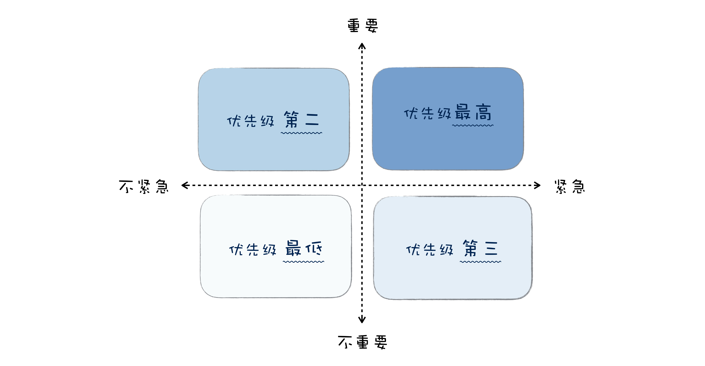

# 1. 需求分析到底要分析什么
## 1.1 需求分析过程

+ 挖掘真实需求

大部分用户提的需求，都不见得是其真实的需求，需要透过现象看本质，去挖掘其背后真实的需求。

要分析用户的真实需求，可以从三个角度入手。

+ 目标用户：用户不同，诉求也不一样；
+ 使用场景：使用场景不一样，解决方案也会有所不同；
+ 想要解决的问题：用户背后想要解决的问题是什么。

+ 提出解决方案

+ 筛选和验证方案

在提出方案后，我们需要对方案进行筛选。

在选好方案后，还需要对方案进行验证，以确保方案能解决用户需求。

在传统瀑布模型中，选定方案后，会写成产品设计文档，走相应的评审流程，评审完成后再进行设计、开发和测试，测试完成后会让客户再进行验收。而敏捷开发，在整个开发过程中，每个迭代或者关键的里程碑，也一样需要客户进行验收。

通过以上三步，就可以对用户需求进行提炼分析，最终形成产品需求。

所以在需求分析过程中，分析的就是一个个用户的需求，找出背后的真实诉求，再有针对性的提出解决方案。

## 1.2 怎样做需求分析

而软件项目的用户需求，从来就不是单一的，而是一系列需求，所以对于软件项目的需求分析，还需要增加收集整理的步骤。整个过程是迭代进行的，如下所示：
    + 收集需求：对用户需求进行收集整理；
    + 分析需求：对需求进行分析，挖掘用户真实需求；
    + 需求评估：筛选过滤掉不可行的需求；
    + 需求设计：针对用户需求提出解决方案，设计成产品方案；
    + 验证需求：验证方案是否可行。

+ 收集需求
    + 头脑风暴：就是大家一起开会头脑风暴讨论；
    + 用户调研：通过调查问卷或者访谈，通过问用户一些问题收集反馈；
    + 竞品分析：通过分析其他同类产品的功能获得需求；
    + 快速原型：通过原型来收集反馈，收集确认需求。

+ 分析需求

收集了需求，就要分析用户的真实需求，这是最难的部分，也是最体现产品经理需求分析水平的地方。

用户需求背后的真实需求有三个层次：
    + 表层需求：用户对解决问题的期望，例如马车更快；
    + 深层需求：用户的深层次动机，诉求产生的原因，例如乘客对出行速度的要求；
    + 底层需求：人性本能的需求，例如对安全感对舒适的追求。

+ 需求评估

需求收集分析完了后，还需要进一步评估，以决定做还是不做，优先级如何，先做哪些再做哪些。
    + 可行性：技术能否实现；
    + 成本：人力成本、时间成本；
    + 商业风险和收益：有没有商业上的风险，收益是否合理；
    + 紧急性与重要性：是不是用户迫切的需求。

+ KANO 模型

红色曲线，是用户认为必须要有的功能；

绿色曲线，就是用户明确提出的需求；

黄色曲线，属于兴奋型需求，就是用户自己没想到，超出预期的功能。

+ 需求设计

在分析和评估完需求后，还需要提出解决方案，也就是对需求进行设计，做出来有效的产品设计方案。最终的产品设计，会落实到人机交互上面，用户可以通过软件界面交互。

现在产品设计方面，各个平台都有一套比较成熟的界面标准控件，大部分产品设计都可以基于标准界面控件，组合成满足需求的用户界面，在满足功能的前提尽可能做的易用和美观。

在需求设计的时候，可以用草图、原型设计工具、界面设计工具进行设计。

+ 验证需求

在需求设计好后，还需要进行验证，看解决方案是否能满足用户的需求。

对需求的验证方式其实是贯穿整个软件项目生命周期的，在需求分析阶段，会反复验证确认设计好的需求是否满足用户的真实需求，例如各种设计评审。

在产品开发完成后，也需要有需求的验收，以确保开发出来的软件产品是客户想要的，满足客户需求的。

现在很多互联网产品，还有一种基于数据的验证需求方式，也就是 A/B 测试。

设计好一个功能上线后，并不直接让所有用户使用，而是先给一小部分用户使用，然后分析数据，看使用这个功能的用户群和不使用这个功能的用户群，在营收、访问量、活跃度等关键数据上是更好还是更坏。如果好，就加大比例，如果数据不好，可能就会调整甚至取消这个功能。

# 2. 程序员的产品意识
## 2.1 程序员的价值

+ 你的价值体现在你所做的产品之上。

你所做的产品越有价值，你的价值就越大，相应的工资就也会高。

这也解释了为什么同一个公司内，负责热门产品的部门，奖金都能多分一点；在效益好的公司，不但不担心裁员，反而钱也拿的多。这些年程序员的待遇相对于其他行业要高，也主要是因为软件和互联网行业的产品估值高。

所以说，程序员的价值，并不完全是体现在技术上的，而在于用技术做成了产品，产品创造了价值，再回过头来成就了程序员的价值。

+ 你的价值体现在团队中的稀缺性。

很多时候程序员其实没机会去选择产品的。但即使在同一个产品中，技术水平相当的程序员，价值也有差别。那些价值高的程序员通常在技术上或者技术之外都有一技之长：

这些有一技之长的程序员，能帮助团队创造更高的价值，也因为其独特性，难以被取代，具有稀缺性，所以价值也更大。

那怎样来提升价值呢？努力提升自己技术水平，让自己成为技术大牛，这肯定是每个程序员都坚持在做的事。但技术水平提升到一定程度后，会有瓶颈的，进展会非常缓慢。

## 2.2 什么是产品意识

产品意识，本质就是一种思维方式，一种站在产品角度思考问题的方式。如果细分一下，产品意识包含：商业意识、用户意识和数据意识。

+ 商业意识

所谓商业意识，就是所做的产品是要有商业价值的。

其实很多程序员也有做产品的梦想，而且也有人付诸行动，业余时间做了不少产品，但是鲜有成功的。其中一个根本的原因就是，他们做的产品其实没有什么商业价值。

商业意识的另一方面其实是成本，成本意识也是程序员容易忽视的。

比如：

有时候为了炫技，采用了更难更酷的技术方案，而忽视了所采用的方案会导致很高的开发成本；

花了太长时间去开会而忽略了开会的成本；

有时候又为了省钱，舍不得买一些成熟的商业组件或服务，反而是浪费了更多成本。

+ 用户意识

所谓用户意识，就是说做产品时，你要能挖掘出用户的真实需求，让产品有好的用户体验。这需要你要有同理心，能站在用户的角度去思考和体验产品。

大部分程序员可能更多专注于程序上，所以在用户意识上确实有所欠缺。

比如：

一个产品功能，产品经理在细节上没有定义清楚，程序员可能并不会主动提出，最终做出来的产品会不好用；

在做技术方案时，更追求技术炫酷，而不是用户体验更好；

在设计接口时，并没有考虑调用者的便利性。

+ 数据意识

所谓数据意识，就是在产品设计、产品运营时，通过数据来发现问题、证实结果。

典型的有 A/B 测试，通过数据来发现用户更喜欢哪个功能，哪个功能带来更多的收入。像微博的“时间乱序”功能，虽然很多大 v 吐槽，但是数据证明了这是一个好的产品设计，最终还是一样上线。上线后新浪根据数据不断优化，到现在反倒是很多人喜欢这个功能。

程序员虽然逻辑很好，但是大多对数据倒是不敏感，对编译警告、测试覆盖率、程序 Crash 的比例、API 错误率、一个函数内上千行代码、性能指标等等这些数据经常选择性忽略。

## 2.3 如何培养产品意识

+ 解放思想

解放思想，其实就是说，对于程序员，不要总是单纯的用技术眼光看问题，也可以从产品的角度看问题。

**技术思维会关注用什么技术，关注技术细节，关注功能“如何”实现；产品思维会关注用户体验，关注一个功能所创造的价值，会去思考为什么要或者不要一个功能。**

这两种思维不同，也很容易导致沟通上的误解。比如程序员会更多考虑技术实现，产品经理会更多考虑产品设计。如果都能往前迈一步，程序员有产品意识、产品思维，产品经理能有一点技术思维、工程思维，那么相互沟通起来就会更通畅。

这两种思维之间的差别，其实也正是要培养产品意识的关键点。要想培养产品意识，就是要从纯粹的技术思维，有意识地培养产品思维。从关注技术、技术细节，到关注用户体验，关注产品创造的价值。

+ 改变习惯

改变习惯是是指在日常使用产品、开发产品的时候，多站在产品的角度思考，去思考它的商业价值、用户体验、使用场景等等。

比如你学习专栏用的极客时间 App，你聊天用的微信。使用一些具体功能时，可以思考一下这些问题：

这个产品的商业价值是什么？

为什么要有这个功能？是为了满足用户哪方面需求的？

这个产品目标用户是谁？

这个功能的使用场景是什么？

这个功能的体验好不好？有没有更好的方式提升体验？

也许你没法马上有清楚的答案，但寻找答案的过程也是一个很好的学习的过程。

如果你是程序员，在开发功能、设计架构的时候，也不妨跳出技术之外，从产品角度思考一下：

这个功能的需求是什么？我是否完全理解了需求？

如果你是这个功能的用户，你觉得还有哪些地方值得改进？

哪些技术可以帮助提升用户体验？

这个 API 用起来是不是好用？有没有更好的设计？

除了对产品的思考，日常工作中，遇到一些问题，也可以从产品思维的角度去想想。

一个常见的场景就是，产品经理一下子提交了一堆新的需求任务，影响了正常的开发进度，这时候你不一定要拒绝他，你就可以和他一起把需求的优先级梳理一下。你就知道哪些要优先做，哪些其实没有那么着急，方便更好的安排你的工作。

+ 多实践

你不妨在业余时间做个小应用程序，或者设计一个原型，做完了再找你的朋友试用一下，让他们提提意见。在做产品的过程中，你自然会去站在产品的角度去思考，这会让你对产品方面有更多感悟。

# 3. 需求变更问题

**在需求变更这个事情上，没有赢家，每个人都是受害者。**

## 3.1 管理需求变更的解决方案

+ 增强需求变更流程，让需求变更规范起来。

这个方案简单来说，就是通过严格的流程，来避免一些没有意义的变更，从而达到管理需求变更的目的。

+ 快速迭代，缩短版本周期。

将大的功能拆分，每个版本周期仅实现一部分功能需求，周期较短，这样需求发生变更时，就可以快速响应。

对于像软件工程这样偏理论知识的学习，你一定不要仅仅停留在了解有什么样的解决方案上，而是要追本溯源，研究问题背后的原因，研究理论背后的来龙去脉。

## 3.2 建筑工程中少有需求变更

**需求的确定性和需求变更的成本。**

+ 需求的确定性

建筑需求是很具象的，而软件工程的需求是抽象的。所以建筑项目里面，无论是提出需求还是变更需求，客户和施工方都明确地知道他们想要什么。

软件需求则经常是抽象、模糊、不精确的，模糊不清的需求导致在软件开发有了雏形后，才慢慢想清楚真正的需求是什么，从而导致需求变更。

+ 需求变更的成本

建筑项目里面的需求变更，我们都很容易和成本挂钩，因为这些东西已经是生活常识了。而与此相对的是，很多人，包括很多老板都对软件项目需求变更导致的成本增加缺少系统认识。

## 3.3 如何解决需求变更问题

在软件项目开发中，需求变更其实是不可避免的，一味抵制需求变更也是不可取的。你能做的就是利用软件工程的知识，理解需求变更背后深层次的原因，找到合适的方案来改善，积极拥抱合理的需求变化，减少不必要的需求变更。这是大的前提条件，也是共识的基础。

+ **提升需求确定性，把需求分析做好，减少需求变更；**
+ **提高需求变更的成本，让客户或者产品经理不能太容易就变更需求，这样就可以达到减少需求变更的目的。**

但在实施的时候，我们会发现一个问题，假如一味提高需求变更的成本，会让客户满意度下降，也造成了产品经理和开发人员之间的对立，不利于项目协作。

+ **降低响应需求变更的成本，可以方便快捷地响应需求变更。**

## 3.4 总结

+ 提升需求确定性，来减少需求的变更。这种方案的优势就是对需求理解透彻，后期返工少，缺点是对产品经理的需求分析能力要求很高。
+ 提高需求变更的成本，规范需求变更流程，减少需求变更。这种方案的优势就是可以马上起到效果，缺点就是过于繁琐的流程不利于项目协作。
+ 降低响应需求变更的成本，积极应对需求变更。这种方案的优势在于可以快速响应需求变更，能快速试错尽快调整，缺点在于对软件架构和项目管理要求比较高。

## 3.5 三句箴言
+ **走一步想三步**
+ **能配置不定制**
+ **不要相信产品经理的“绝对”**
