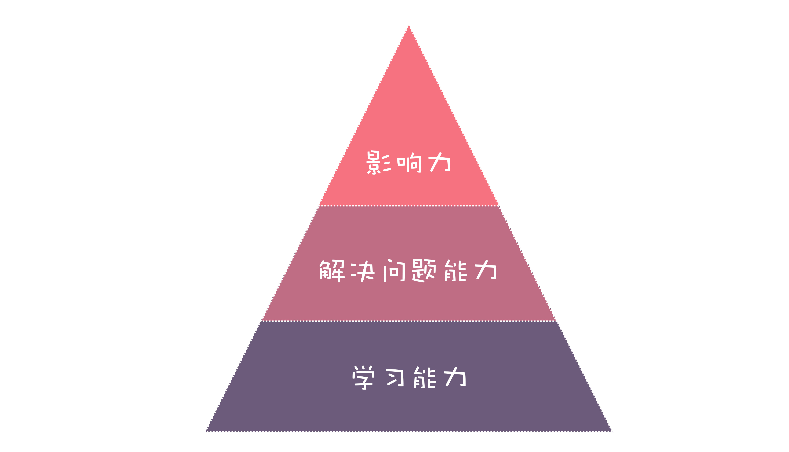
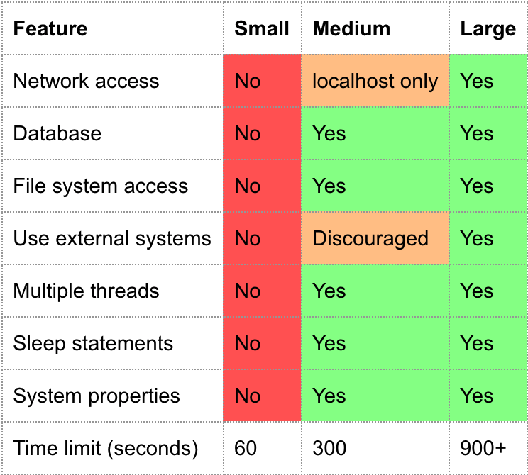

# 1. 提高开发效率

## 1.1 积极主动，行动起来改变自己

+ 不要总盯着自己无法改变的部分，你需要要多花时间精力在影响圈上。

+ 接受不能改变的，改变能改变的，尽量扩大可改变项的范围。

## 1.2 以终为始，想清楚再开工

+ 目标、原则和计划

+ 经常停下来想想目标

+ 制定原则

+ 公开自己的计划

## 1.3 要事第一，把时间用在刀刃上

+ 重要紧急的事情马上处理

+ 重要不紧急的要事，要花最多的时间在上面

+ 紧急不重要的事凑一起集中做

+ 不重要不紧急的事情能不做就不做

# 2. 持续交付

## 2.1 集成、部署和交付的发展史

+ 集成的发展演变

**集成的原始阶段**

大家各自开发，等到开发阶段差不多快结束了，再一起提交代码到源代码管理工具，让代码集成在一起，再编译、部署发布到测试环境。

由于长时间都是在各自的开发环境运行，每次集成都是很痛苦的过程，会遇到各种问题，比如说编译无法通过、hard code 了开发环境地址、类库版本不一致、API 格式不一致等，通常要持续几天甚至几周才能逐步有一个相对稳定的版本。

**从手动集成到自动化的持续集成**

瀑布模型开发的集成，或者说传统的集成，都是在开发阶段整体完成的差不多了，才开始集成。而持续集成的做法，则是每次有代码合并入主干之前，都进行集成，持续的集成。**代码集成到主干之前，必须通过自动化测试，只要有一个测试用例失败，就不能集成。**

持续集成的好处很明显：

配合自动化测试，这样可以保证主干的代码是稳定的；

频繁集成可以让开发人员总能从主干及时获得最新的代码，不至于像类库、API 不一致等问题到最后测试的阶段才暴露出来。

## 2.2 部署和交付的发展史

+ 部署和交付的原始阶段

在早些年，部署是一件很麻烦的事情。需要手动获取最新源代码、编译、再需要针对环境修改很多配置。

随着分工的进一步细化，逐步发展成有专门的运维岗位，由运维人员负责部署。而开发人员上线前要写专门的部署文档和检查表，运维人员按照部署文档和检查表一步步部署生产环境。

+ 从手动部署到脚本自动化部署

早期的自动化部署解决方案是每日构建（Daily Build），简单来说，就是大家在每天晚上下班后，每日构建程序自动从源代码管理器下载最新代码，编译、部署程序到测试环境。这样第二天测试人员就可以拿到最新的程序，对前一天修复的 Bug 进行测试。

每日构建是个很大的进步，因为初步实现了自动化对代码进行编译、部署测试环境。但也有一些不完善的地方，比如说如果有开发人员提交的代码有问题，可能会导致当天的编译或部署失败，那么第二天开发人员上班后，还需要手动解决。

+ 从脚本部署到持续交付

持续交付本质上也是把部署和交付这件让人痛苦的事情，更加频繁地去做，从而让部署和发布变得不但不痛苦，反而越来越简单。

把持续交付的工作做好后，部署生产环境会变得非常简单，只需要点一下按钮或者运行一个命令，就可以很快完成，不需要人为地去修改配置等手动操作，也将因为配置错误或者环境不一致导致的问题的可能性降到了最低。

+ 从持续交付到持续部署

持续交付，对于生产环境的部署，依然需要有手动确认的环节。而持续部署，和持续交付唯一的不同，就是手动确认的环节都没有了，每次代码从分支合并到主干，在自动化测试通过后，会直接自动部署生产环境，不需要人工确认。

当然对于新功能可能导致的不稳定问题也有解决策略，就是把新功能用功能开关（Feature flag）隐藏起来，设置特定的 Cookie 或者 Header 才打开，到生产环境后人工再测试一遍，通过后再打开，如果没通过，就继续修复继续持续部署。

## 2.3 该不该应用持续交付

持续集成和用什么开发模型是没有关系的，瀑布模型也可以应用持续集成，应该尽快将持续集成的环境和相应的开发流程搭建起来，可以马上看到好处。

+ **尽快暴露问题：** Martin Fowler 说过，“持续集成并不能消除 Bug ，而是让它们非常容易发现和改正。”自动化测试，可以保证很多问题在合并到分支之前就能被发现；每次合并后就部署到测试环境，也能让测试人员尽早介入，及时发现问题。

+ **极大提升效率：** 持续交付让开发过程中从代码合并，一直到最终部署，都实现了自动化，能极大程度上提高效率。

+ **提升质量：每次** 合并之前都需要通过自动化测试，因此错误会少很多。

+ **降低项目成本：** 在最初搭建持续交付环境的时候，是要投入一定成本的，但是从长远看，开发效率提升了，代码质量提高了，反而是对降低项目的整体成本有帮助的。

**虽然现在持续交付还不够普及，但未来就像源代码管理一样，成为开发团队的标配。**

## 2.4 如何搭建持续交付环境

+ 持续集成
    + 需要有源代码管理工具
    + 需要写自动化测试代码，自动化测试必须通过
+ 持续交付的要求
    + 对代码构建的过程可以反复进行，并且每次构建的结果都是一致的，稳定的
    + 所有环境的配置都存在源代码管理工具中，不仅仅是代码
    + 需要自动创建针对不同环境的发布包
    + 所有环境的部署发布步骤必须是自动化
+ 选择合适的持续集成工具
    + jenkins
    + go CD
    + Travis CI
    + Gitlab CI
    + Azure Pipelines

# 3. 软件工程师的核心竞争力

**软件工程师的核心竞争力，不是单一能力的体现，而是几种能力和价值的合集。学习能力、解决问题能力和影响力构成了软件工程师的核心竞争力。**

## 3.1 软件工程师需要哪些核心竞争力

+ 学习能力

对于软件工程师来说，最基本的要求是技术和代码。如果你看招聘网站上招聘软件工程师的要求，都需要能掌握一门或者多门编程语言，会熟练使用工具、框架。

但熟练掌握一门编程语言、框架，还不能构成核心竞争力。因为现在技术更新迭代很快，现在你熟悉的语言或者框架，可能过几年就没有太大的市场了，需要学习新的技术。

能快速学习掌握编程语言、框架、工具的学习能力才是软件工程师最基础的核心竞争力。

+ 解决问题的能力

+ 实现功能需求——需要先分析需求，然后抽象设计，最后实现；
+ 修复 Bug——改 Bug 最大的挑战其实是重现问题，也就是发现问题，然后再分析问题，最后解决问题；
+ 重构代码、优化性能——对代码重构，优化性能，最难的地方其实在于发现代码问题在哪，发现性能的瓶颈，后面再去寻找解决方案，最后再解决。

**软件工程师这些日常开发工作的核心还是在发现问题、分析问题和解决问题，在这里我统称为解决问题的能力。**

+ 发现问题

发现可能存在的风险问题

+ 分析问题

分析问题，不仅是分析表面的问题，还需要去分析问题深层次的原因，以及思考预防同类问题的机制。

+ 解决问题

在发现问题和分析问题后，解决问题相对会容易一些。但有时候明明知道问题在哪，但不知道怎么解决也是很苦恼的事情。

+ 影响力

有些程序员，做事情认真靠谱，做出来的结果让人放心，这样久而久之，就在公司形成了口碑和影响力，大家愿意与之共事。

有些程序员，乐于帮助其他人，分享自己的经验，跟一些新手程序员是亦师亦友的关系，在团队里有很高的威望。

有些程序员，有独特的项目、公司或者行业经历，比如在阿里巴巴这样的大厂有多年架构师经验，在业界有一定知名度。

有些程序员，写自己的技术博客，出去做技术讲座，成了技术大 v，在技术圈子里面有一定的名气和影响力。

这样的影响力不是一朝一夕能形成的，但却是一个软件工程师最核心的价值体现。

你需要通过一点点技术成长的积累，需要通过一个个成功项目的积累，需要通过一篇篇技术文章分享的积累，需要通过一次次帮助其他人成长的积累。而一旦形成足够的影响力，就会变成软件工程师职场发展最牢固的护城河。

+ 综合来说软件工程师最核心的竞争力

+ 最底层、最基础的就是学习能力，通过学习能力，快速学习掌握新技术；
+ 中间一层就是解决问题的能力，充分利用学到的技术，去发现问题、分析问题和解决问题；
+ 最上一层就是影响力，是核心竞争力的综合体现。

但必须要注意，这三层缺一不可，你不能光去追求影响力而不踏踏实实学习和做事，也不能光去做事而不学习。必须要踏实地、一层层地打好基础，这样才能让你的竞争力是持久的，而不是昙花一现。

## 3.2 软件工程师竞争力金字塔的意义

如果你是软件工程师，了解了软件工程师竞争力金字塔，你就可以自下而上，更有针对性地培养、提高软件工程师的核心竞争力。

不是把自己绑死在一门技术或者一个框架上，而是训练自己的学习能力，让自己可以拥有快速学习掌握新技术的能力。

日常工作不仅仅是实现一个个的功能，做一个个的项目，而是在这个过程中，去锻炼和提升你发现问题、分析问题和解决问题的能力。这样才能最大化的你的工作经验，而不是机械重复没有积累。

在工作中，不仅是把事情做成，还要把事情做好；不仅是自己成长，还要帮助其他人成长；最大化的利用好所在平台和行业的经历，转变成你的经验和影响力。工作之外，也多分享，打造自己的品牌。

这样你就可以一点点搭建出来属于你的竞争力金字塔，构建出自己的核心竞争力。

## 3.3 如何提升学习能力

构建自己的知识体系

+ 首先需要在一个技术领域深耕

每个人精力其实很有限的，一开始专注在一个技术领域容易在短时间取得成绩，同时也相当于建立起了最初的知识体系，在未来的知识森林里种下的第一棵大树，这样当你开始学习新的技术的时候，已有的知识就可以直接借用，相当于这棵大树可以帮助新的知识树的成长提供很好的养分，快速培养出新的大树。

**只有一个领域的知识你真正吃透，才能有效地共享到其他领域，构成一个知识领域的森林。**

知识体系建立之初，确实是痛苦的，感觉什么都不懂，有很多要学习的。市面上有新技术出来也会觉得焦虑，觉得应该去学新的技术。但如果初期不能够专注在某个领域深入的话，你学了再多技术，结果也没有一门能深入，这就很难构建出有深度的知识树。

要在某一个领域的技术达到一定深度，通常需要三年以上的时间。当你熬过这个阶段，在一个技术领域取得了一定成就，不仅会收获你的知识树，还能收获技术上的自信，让你有信心在其他技术领域也同样取得成就。

+ 往相近的领域逐步横向拓展

当在一个技术领域达到一定深度后，可以开始横向扩展。最好是往相近的领域扩展，因为这样你之前的知识有很多是可以共享的，容易快速取得成绩。

当然横向构建知识体系，也一样不是一个轻松的过程，因为以前你在某个领域取得的成就和经验，反过来也会成为一种阻力。因为以前你熟悉的知识，已经变成了你的舒适区，你会天然地不愿意走出舒适区，不愿意到挑战区或恐慌区去学习新的知识。

但是，当你迈过去，掌握了新领域的知识，就会感觉整个知识体系一下子扩展了很大一块。相当于让你的知识体系，从一棵树，逐步变成了一个小树林，最终会成为一个森林。

快速掌握新技术的秘籍，就是要构建属于你的知识体系，让你在学习新知识时，能借用已有的知识，加快学习速度。

## 3.4 如何提高解决问题的能力

+ 明确问题

解决问题，最重要的一步就是要明确问题是什么，这其实就跟做项目需要先需求分析一样，搞清楚目标是什么，才能做到有的放矢。

+ 拆分和定位问题

一个复杂的问题，只有经过拆分，才好找到本质的问题。

+ 提出解决方案并总结

发现并分析完问题后，找到解决方案是容易的，但很有必要总结一下。总结要做的就是两点：

下次有这种问题怎么解决，是不是可以做的更好？

这种问题是不是可以预防？如果可以，应该怎么做？

**如果每次解决完问题，你还能提出一个预防问题发生的方案，一定会让大家印象深刻的。**

## 3.5 如何提升影响力

+ 在某个领域做出了足够牛的成绩

有些程序员能在某一个技术领域做到一定深度，做出了常人难以达到的成绩。

要取得这样的成绩，要实力、要机缘、还要坚持。

+ 做事情超出预期

在软件项目中，你作为一个程序员，每个人都会对你有预期，项目经理希望你如期完成项目，产品经理希望你完成需求，其他程序员希望你代码质量好。如果你是初级程序员，则大家期望你代码不要有太多问题就好，如果你是高级程序员，大家不仅期望你要写好程序，还要能带带新人。

如果你做事情的结果能超出预期，就会让人对你刮目相看，进而会形成口碑。就像我前面举的例子，如果你解决完一个问题，还能想到怎么预防问题再次发生的方案，这通常就超出他人对你的预期了。

+ 帮助其他人就是在帮助自己

程序员的经验，很大部分来自于解决问题时积累的经验。你自己在工作中遇到的问题其实是很有限的，但如果帮助其他人解决问题，相当于增加了你解决问题的样本，这些样本能帮助放大你的工作经验。

+ 分享就是学习和打造影响力

# 4. 自动化测试

## 4.1 为什么自动化测试能保障质量

首先根据需求写成测试用例，设计好输入值和期望的输出，然后按照测试用例一个个操作，输入一些内容，做一些操作，观察是不是和期望的结果一致，一致就通过，不一致就不通过。

自动化测试，就是把这些操作，用程序脚本来完成的，本质上还是要输入和操作，要检查输出是不是和期望值一致。只要能按照测试用例操作和检查，其实是人来做还是程序来做，结果都是一样的。

自动化测试有一个手工测试没有的优势，那就是可以直接绕过界面，对程序内部的类、函数进行直接测试，如果有一定量的自动化测试代码覆盖，相对来说软件质量是更有保障的。

而且，一旦实现了自动化，每测试一次的成本其实大幅降低了的，几百个测试用例可能几分钟就跑完了。尤其是每次修改完代码，合并到主干之前，把这几百个测试用例跑一遍，可以有效地预防“修复一个 Bug 而产生新 Bug”的情况发生。

但现阶段，自动化测试还是不能完全代替手工测试的，有些测试，自动化测试成本比手工测试成本要高，比如说测试界面布局、颜色等，还是需要一定量的手工测试配合。

## 4.2 有哪些类型的自动化测试

在对自动化测试类型的定义方面，Google 的分类方法我觉得比较科学：根据数据做出决策，而不仅仅是依靠直觉或无法衡量和评估的内容。Google 将自动化测试分成了三大类：小型测试、中型测试和大型测试。

+ 小型测试

小型测试的运行，不需要依赖外部。如果有外部服务（比如文件操作、网络服务、数据库等），必须使用一个模拟的外部服务。

+ 中型测试

中型测试是验证两个或多个模块应用之间的交互，通常也叫集成测试。

对于中型测试，可以使用外部服务（比如文件操作、网络服务、数据库等），可以模拟也可以使用真实的服务。

至于中型测试要不要使用模拟的服务，有个简单的标准，就是看能不能在单机情况下完成集成测试，如果可以就不需要模拟，如果不能，则要模拟避免外部依赖。

+ 大型测试

大型测试则是从较高的层次运行，把系统作为一个整体验证。会验证系统的一个或者所有子系统，从前端一直到后端数据存储。大型测试也叫系统测试或者端对端测试。

对于大型测试，通常会直接使用外部服务（比如文件操作、网络服务、数据库等），而不会去模拟。

## 4.3 区分测试类型的依据是什么

就是契约测试，这个测试最近出现的频度比较高，主要是针对微服务的。其实就是让微服务在测试时，不需要依赖于引用的外部的微服务，在本地就可以模拟运行，同时又可以保证外部微服务的接口更新时，本地模拟的接口（契约）也能同步更新。[契约测试](http://insights.thoughtworks.cn/about-contract-test/)

+ 小型测试，没有外部服务的依赖，都是要模拟的；
+ 中型测试，所有的测试几乎都不需要依赖其他服务器的资源，如果有涉及其他机器的服务，则本地模拟，这样本机就可以完成测试；
+ 大型测试，几乎不模拟，直接访问相关的外部服务。

**越是小型测试，执行速度越快，越是大型测试，执行速度越慢。**

**越是大型测试，写起来的成本也相应的会更高，所以一般项目中，小型测试最多，中型测试次之，大型测试最少。**

## 4.4 怎么写好自动化测试代码

+ 第一步就是准备，例如创建实例，创建模拟对象；
+ 第二步就是执行要测试的方法，传入要测试的参数；
+ 第三步断言就是检查结果对不对，如果不对测试会失败；
+ 第四步还要对数据进行清理，这样不影响下一次测试。

一个完整的自动化测试要包括三个部分的测试：

**验证功能是不是正确：** 例如说输入正确的用户名和密码，要能正常注册账号；

**覆盖边界条件：**  比如说如果用户名或密码为空，应该不允许注册成功；

**异常和错误处理：** 比如说使用一个已经用过的用户名，应该提示用户名被使用。

## 4.5 如何为项目实施自动化测试

+ 选择好自动化测试框架
    + web：Jest, Mocha, Nighwatch
    + ios: 参考 [IOS 自动化测试框架对比](https://www.jianshu.com/p/047035416095)
    + 安卓: 参考 [Android 谈谈自动化测试](https://juejin.im/entry/6844903505275125773)
+ 在持续集成环境上跑你的自动化测试

**让自动化测试在持续集成上运行非常重要，只有这样才能最大化地发挥自动化测试的作用。**

+ 自动测试配合持续集成的一个标准流程
    + 在提交代码前，先本地跑一遍单元测试，这个过程很快的，失败了需要继续修改；
    + 单元测试成功后就可以提交到源代码管理中心，提交后持续集成服务会自动运行完整的自动化测试，不仅包括小型测试，还有中型测试；
    + 通过所有的测试后，就可以合并到主分支，如果失败，需要本地修改后再次提交，直到通过所有的测试为止。

## 4.6 新项目和老项目的不同策略

如果是新项目，那么可以在一开始就保持一定的自动化测试代码的覆盖率，你甚至还可以试试测试驱动（TDD）的开发模式，也就是先写测试代码，再写实现代码，保证测试通过，最后对代码进行重构。

如果是老项目，短期内要让自动化测试代码有覆盖是有难度的，可以先把主要的功能场景的中型测试写起来，这样可以保证这些主要功能不会轻易出问题。

后期维护的过程中，增加新功能的时候，同步对新功能增加自动化测试代码；修复 Bug 的时候，针对 Bug 补写自动化测试代码。

## 4.7 如果时间紧任务重，来不及写自动化测试怎么办

确实遇到时间紧的情况，我建议你要优先保证中型测试代码的覆盖，因为这样至少可以保证主要的用户使用场景是正常的。然后把来不及完成的部分，创建一个 Ticket，放到任务跟踪系统里面，后面补上。

# 5. 源代码管理工具

## 5.1 源代码管理工具发展简史

源代码管理工具也叫版本控制系统，是保存文件多个版本的一种机制。每一次有人提交了修改，这个修改历史都会被版本控制系统记录下来。如下图所示，每一次对内容的修改，都会形成一个当前项目完整内容的快照。

+ 没有源代码管理工具的时代

当你开发时，必须要告知团队里的其他人，你正在对哪些文件进行编辑，好让他们不要操作相同的文件。当你花了很长时间完成你的修改后，可能这些文件早已经被团队里的其他开发成员修改或者删除了。

除了协作的问题，还有一个问题就是版本问题。没有源代码管理，你得经常性对项目的文件保存备份，很麻烦，而且还是一样有不少问题：

很难知道做了哪些修改，你可能需要挨个目录去查看文件修改时间；

对版本命名是一个很麻烦的事情，每次备份都得有一个名字；

很难知道两次备份之间，做了哪些修改。

+ 本地版本管理

最早的版本控制系统是 SCCS（Source Code Control System），诞生于 1972 年，它实现了对单个文件保留多个版本，这就意味着你可以看到每一个文件的修改历史了。

后来又有了 RCS （Revision Control System），它具有更好的文件比较算法，通过登录同一台中央大型机，可以实现每个人签出自己的拷贝。

但这个阶段只能本机使用，而且一次只能修改一个文件，无法满足好多人协作的问题。

+ 集中式版本管理

1986 年问世的 CVS（Concurrent Versions System）是第一个采用集中式的服务器来进行版本库的管理工作，所有文件和版本历史都放在服务端，每个用户通过客户端获取最新的代码，可以多个人编辑一个文件，并且能提交到服务器合并在一起。

再后来的 SVN（Subversion）则对 CVS 进行了很多优化，比如支持文件改名移动、全局版本号等，这些优化很大部分程度上解决了 CVS 存在的一些缺陷，所以在 2000 年后逐步取代了 CVS 成为主流的源代码管理工具。

+ 分布式版本管理

分布式版本管理工具的典型代表就是 Git，分布式版本控制系统的整个代码库的副本都可以存储在用户的本地系统上，这样文件和版本控制操作变得非常容易，离线也可以操作，如果主存储库关闭或者删除，可以很容易从本地存储库恢复。

现在 Git 已经逐步替代了 SVN、CVS 等源代码管理工具，成为最主流的源代码管理工具。

Git 的主要问题是学习成本要稍微高一点，要花点时间理解它的工作原理和记住主要的命令。

## 5.2 如何选择合适的源代码管理系统

+ Git
+ Gitlab
+ Gerrit
+ GitHub
+ Coding

## 5.3 如何用好源代码管理工具

+ 要频繁的提交

很多开发人员不愿意轻易提交代码到源代码管理中心，喜欢“憋个大招”，本地做了大量修改，希望代码能“完美”。但这样做却没能享受到频繁提交带来的好处。

频繁提交，这意味着你每次提交的代码变更是比较少的，便于 Code Review，同时如果出现问题，也可以迅速定位或者直接回滚。

频繁地提交，也让团队成员可以及时同步最新代码，不至于在最后合并时，产生有大量的合并冲突。

**频繁提交，不意味着提交不完整的内容，而是将要提交的内容分拆，并且保证完整性。**

+ 每次提交后要跑自动化测试

源代码管理的第二个原则，就是每次提交，必须要运行自动化测试代码，如果测试不通过就不能合并，要对问题进行甄别和修复，确保提交的代码质量是没问题的。

+ 提交的代码要有人审查

代码审查是自动化测试之外，一种非常行之有效的提高质量的手段，通过代码审查，可以发现代码中潜在的问题。通过代码审查，也可以加强团队的技术交流，让水平高的开发人员 Review，可以帮助提升整体代码水平；Review 高水平的代码也是一种非常有效的学习方法。

对于审查出来的问题，可以分成三个类型：

问题：如果对代码有不清楚的地方，可以作为问题提出，进一步澄清确认；

建议：原来的实现没有太大问题，但是可以有不同的或者更好的实现；

阻塞：代码有明显问题，必须要修改。

## 5.4 选择什么样的开发流程

现在基于源代码管理有三种主要的开发流程：Git flow, Github flow, Gitlab flow

GitHub 开发流程

有一个稳定的分支，例如 master；

每次创建新功能或者修复 Bug，必须创建一个分支。最后通过代码审查和自动化测试后，才能合并回稳定分支。

+ 创建一个分支
+ 提交更新
+ 创建一个 Pull Request
+ 讨论和代码审查
+ 部署测试
+ 合并

## 5.5 开发流程的几个常见问题

+ 怎么发布版本

要发布版本的话，从 master 上创建一个 Tag，例如 v1.0，然后将 Tag v1.0 上的内容部署到生产环境。

+ 怎么给线上版本打补丁

如果线上发布的版本（例如 v1.0）发现 Bug，需要修复，那么基于之前的 Tag 创建一个分支（例如 hotfix-v1.0-xxx）出去，在分支上修复，然后提交 PR，代码审查和自动化测试通过后，从分支上创建一个新的 Tag （例如 v1.0.1），将新的 Tag 发布部署到生产环境，最后再把修改合并回 master。

+ 如果我经常需要打补丁，有没有比 Tag 更好的办法

每次发布后，可以创建一个发布版本的分支，例如 release-v1.0，每次打补丁，都直接从发布分支 release-v1.0 而不是 master 创建新的分支（例如 hotfix-release-v1.0-xxx），修复后提交 PR，代码审查和自动化测试通过后，合并回分支 release-v1.0，然后基于 release-v1.0 分支发布补丁。

最后将合并的 PR，借助 git 的 cherry-pick 命令再同步合并回 master。

