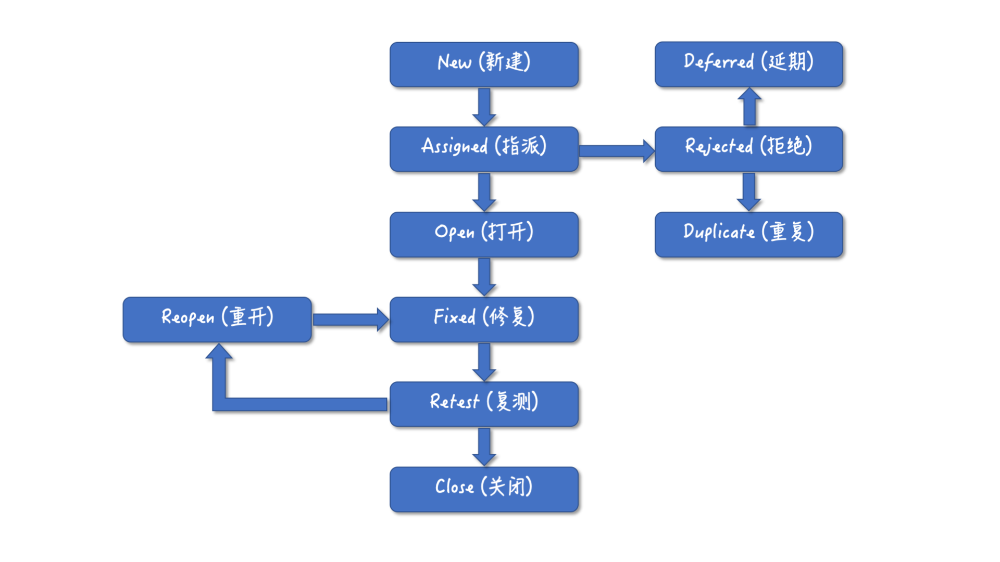

# 1. 软件测试

## 1.1 软件产品质量

不同的人对软件质量好坏的评判角度是不同的。比如对用户来说，更看重产品是不是满足需求，是不是美观好用；对开发来说，看重的是代码质量是不是高，是不是好维护；对于软件测试人员而言，看重的是 Bug 数量、安全、性能等指标；对于项目负责人，看重的是整个开发过程的质量，是不是成本可控、如期完成。

《The Three Aspects of Software Quality: Functional, Structural, and Process》这篇文章作者 David Chappell 的观点，他把软件质量分成了三个考量方面：功能、结构和流程。对于他提的“结构质量”，我认为定义为“代码质量”更贴切，也就是说，**功能质量、代码质量和过程质量这三个方面组合在一起，很好地概括了软件质量。**

所有的软件开发都是从一个想法开始的，用户需要一个软件，有人出钱，然后开发团队实施，把想法变成需求，需求变成设计，设计变成代码，代码变成软件。

+ 功能质量

最终用户得到是软件，体验的是软件的功能，功能的质量直接决定了产品的质量。

满足用户需求，是对功能质量最基础的要求。在这个基础上，Bug 数量、性能、UI/UX 都是很重要的质量指标。

+ 代码质量

构成软件最重要的部分是代码，代码质量指的是实现软件功能的架构和代码的质量。代码的质量主要体现在以下这些方面：

代码的可维护性，也就是在不影响稳定性的前提下，是否能方便地添加或者修改现有的代码；

代码的可读性，代码是否容易理解，是否能快速上手；

代码的执行效率，代码执行效率直接影响了软件性能；

代码的安全性，是否有安全漏洞，安全性是代码质量很重要的一个指标；

代码的可测试性，代码是否能使用单元测试、集成测试进行测试验证。

+ 过程质量

软件的开发离不开软件工程，离不开项目管理。软件开发过程的质量决定了你的项目是否能如期完成，开发成本是否在预算之内。

过程质量虽然也是用户不能直接感知的，但是过程质量会直接影响代码质量和功能质量，甚至是产品的成败。

## 1.2 为产品质量负责

既然产品质量是由功能质量、代码质量和过程质量共同决定的，那么对产品质量负责，意味着要对这三方面共同负责。

软件测试，可以对功能质量负责，对软件产品进行测试验收，以确保产品满足功能需求，有好的功能质量。但是通常不能对代码质量和过程质量负责。

开发人员，可以对代码质量负责，也可以写测试代码，通过自动化的方式做功能测试，虽然还不能完全替代手工测试的作用，所以也可以算得上对功能质量负责。但开发人员通常对过程质量影响有限。

项目负责人，可以对过程质量负责，而且过程质量的水平高低，会间接影响代码质量和功能质量。但因为项目负责人不直接编码和测试，所以无法直接影响代码质量和功能质量。

虽然从权责的角度看，项目负责人是最应该对项目质量负责的，但是从效果来说，却是开发人员对项目质量负责最有利。

开发人员是唯一能直接影响代码质量、能对代码质量负责的人。开发人员能更容易地找到代码中的 Bug，更容易通过架构设计、自动化测试代码等手段保证好代码质量，提升测试效率。

现在软件开发的发展趋势也是如此，软件测试的很大一部分手工测试工作已经被自动化代替。

开发人员对功能质量负责，意味着必须在实现功能的同时，还要考虑如何去测试这个功能，这样让代码更具有可测试性，这就对开发人员的要求更高了。

## 1.3 如何做到“人人为产品质量负责”

首先，可以参考敏捷开发中的扁平化管理。在敏捷开发中没有项目经理，只有产品负责人，而产品负责人更多是充当一种服务型的角色。大家都很平等，也就是说每个人都有权力去影响到项目过程，实现权责对等，大家才会为过程质量负责。

其次，可以选择将团队拆小。敏捷开发中的团队规模都不大，大的开发团队拆分成了小的开发小组，每个组人数都不多。人数多的时候容易推诿扯皮，但如果人少，每个人就必须要承担更多的责任，这有助于形成人人重视产品质量的文化。

另外，也可以鼓励工种之间的融合，例如开发人员多写自动化测试代码；测试人员在开发人员写自动化测试时，提供帮助，例如设计测试用例。这样不只是局限于各自负责的质量领域，也同时关注其他质量领域。

# 2. 专职测试

## 2.1 软件测试怎么发现 Bug

因为开发人员的重点，是放在如何实现功能上，就拿上面用户登录的例子，开发人员会想着如何能校验用户输入的用户名密码，并给出相应的提示，对于异常流程和场景会相对考虑较少。

而对于测试人员来说，重点是在检测，也就是会考虑所有可能的用户使用场景，正常的、异常的，甚至各种极端情况，例如大量并发访问、黑客恶意破解，所以他们能想到更多、更全面的测试用例。

测试人员设计测试用例，就是要尽可能做到覆盖所有用户操作的可能，但理论上来说这是不可能的，因为组合是有无限多个的。不过从测试的角度看，没有必要每一个可能都去测试，可以通过一些科学的方法来通过有限的测试用例，保证尽可能多的测试覆盖。

+ 等价类划分

就是把所有用户可能输入的数据分类，如果一类数据对于发现 Bug 的效果是一样的，那么这类数据就是一个等价类，测试的时候只要从里面任意选取一个值就好了。

+ 边界值分析

边界值是对等价类的补充，因为输入输出的边界是非常容易出错的一个地方。

+ 探索性测试

探索性测试就是根据前面的测试结果，通过有效的策略进行测试。

## 2.2 软件测试怎么报告 Bug

测试人员要做的就是创建一个新的 Ticket，在 Ticket 的描述中，详细说明 Bug 是什么，具体的重现步骤，必要的话还要附上截图、日志等辅助信息。这样开发人员在收到 Bug 后就能快速定位问题，按照优先级对 Bug 进行修复。

## 2.3 软件测试怎么跟踪 Bug

Bug 的跟踪，并不仅仅是要跟踪开发人员什么时候修复了这个 Bug，通常还包括对 Bug 修复的验证。

开发人员修复完一个 Bug 后，测试人员首先会验证这个 Bug 是不是真的被修复了，然后还要对整体功能做一个回归测试，确保不会因为修复 Bug 而引起其他功能出现问题。

回归测试是指修改了旧代码后重新进行测试，以确认修改没有引入新的错误或导致其他代码产生错误。

回归测试这一步很重要，因为通常开发人员在修复完 Bug 后，只会验证其修复的 Bug，而不会验证其他功能是不是会有影响。但实际上，软件项目中经常会出现修复一个 Bug，而导致系统其他功能出现问题的情况。回归测试，则能有效、及时地发现修复 Bug 导致系统不稳定的情况。

## 2.4 什么样的公司需要专职测试

正常来讲，测试时间必然要被压缩的，因为你首先得保证代码实现。这可能就导致只要项目进度一紧张，测试就被严重压缩了，进而会严重影响质量。

这样看来，完全由开发人员兼职测试，还是很有难度的，不仅对开发人员要求非常高，而且需要开发人员承担所有的开发和测试的压力。

## 2.5 为什么 Facebook 可以做到没有专职测试

首先 Facebook 的工程师水平确实是高于业界平均水平的，有能力同时做好开发和部分测试工作；

Facebook 的产品周期相对宽松，可以有时间完成自动化测试代码。

Facebook 在功能发布之前，先发布新功能到内部环境，几千内部员工先测试，部分充当了测试人员角色；

Facebook 的发布和监控也比较完善，有问题能通过监控及时发现，并且可以随时快速回滚或者发布补丁；

最后就是用户对这类社交产品的 Bug 相对容忍度比较高。

**至于 Google 和 Amazon 这些公司，他们也是类似的情况：**

大量优秀的工程师，可以同时兼任开发和测试；

有大量的自动化测试代码覆盖；

强大的发布和监控系统；

时间进度比较宽松；

用户对 Bug 容忍度较高。

对于不能满足上面条件的公司，有专职的测试是更有利于软件项目开发和质量保障的。

**大厂不设专职测试的启示**

用自动化测试代替重复性的手工测试是必然趋势。随着自动化测试技术的成熟，写自动化测试代码的成本逐步降低，而自动化测试，可以极大提高测试效率，尤其是像回归测试这种需要频繁进行的。

其次，测试设计是软件测试人员的核心竞争力。无论是自动化测试还是手工测试，测试用例是核心。无效的测试用例，用任何方法去测试，都不会达到良好的测试目的，只有测试用例设计好了，真正做到有效高覆盖，测试才是高质量的。

最后，开发人员和测试人员的更多融合是一种双赢。比如说测试人员可以给开发人员提供测试用例作为测试参考，开发人员可以写更多自动化测试代码，这些方式都能有效保障产品质量。

# 3. 测试工具

## 3.1 为什么要使用 Bug 跟踪工具

测试人员发现 Bug 只是第一步，还需要报告 Bug 让开发人员可以知晓和定位，并且跟踪整个 Bug 修复的过程。

不能采用 QQ 或邮件报 Bug 的原因

+ Bug 不能有效被跟踪，不知道一个 Bug 是不是已经被修复了；
+ 效率很低，开发人员频繁的被这样的报 Bug 的消息打断，不得不停下手头的工作去甄别 Bug；
+ 不能直观的了解当前项目的 Bug 状态，比如说：修复了多少，还有多少没有修复，近期 Bug 数量是增加了还是减少了。

**Bug 跟踪工具，采用结构化的数据来定义 Bug，每一个 Bug 都有一些关键的信息可以对 Bug 进行分类和检索。**

你平时在 Bug 跟踪系统中看到的 Bug 状态，看起来只是一个有限的状态列表，但背后其实是一套解决 Bug 的流程。就像下面这张图表示的这样，一个 Bug 从创建到最后结束，其实是有一个完整的流程的。

通过这样的流程，开发人员就可以集中对 Bug 进行分配、按照优先级分别解决，而测试人员则可以第一时间知道 Bug 处理的状态变化，及时验证，方便跟踪整个过程。

## 3.2 使用 Bug 跟踪工具的注意事项

报告 Bug 的目的是为了能跟踪 Bug，以及帮助开发人员重现直到解决问题。要想做到测试和开发高效协作，这里面有一些需要注意的事项。

首先，所有的 Bug 都应该通过 Bug 跟踪系统管理和跟踪，不应该再通过 QQ/ 微信 / 邮件的方式跟踪 Bug。如果客户、同事通过 Bug 跟踪系统之外的其他途径反馈 Bug，应该统一提交到 Bug 跟踪系统管理跟踪起来。

然后，不能把多条 Bug 合并成一条，一个 Bug 创建一个独立的 Ticket。我遇到过有些测试为了省事，把几条 Bug 合并成一个 Ticket 来报，导致的问题就是，必须这几条 Bug 都修复了，这个 Ticket 才能改变状态，如果其中一个 Bug 没有验证通过，需要 Reopen 整个 Ticket。

再有，描述清楚如何重现 Bug 非常重要。一个 Bug 如果无法重现，也没有日志、截图等辅助信息，那是非常难以定位的，会浪费很多开发人员定位 Bug 的时间。

最后，不要把 Bug 跟踪系统当成讨论板用。在项目中一个常见的场景是，一个 Ticket 下面，跟讨论版一样添加了很多留言，开发认为不是 Bug，测试认为是一个 Bug，开发又觉得是产品设计没定义清楚，应该让产品经理来讲清楚，皮球踢来踢去，最后问题还没解决。

Bug 跟踪系统的主要功能是用来跟踪 Bug 的，不是用来讨论和扯皮的。遇到上面的情况，其中一方就应该主动一点，拉上相关人面对面讨论，当面确认清楚这个 Bug 到底是什么问题，然后马上解决掉。

## 3.3 自动化测试工具

**未来自动化测试会占据越来越多的比例，很多手工测试的工作会逐步被自动化测试代替。**

测试人员可以学习一些基本的编程知识，尝试自己实现自动化测试。自动化测试所需要的技术，主要是对 API 的调用，并不需要复杂的逻辑，其实学习门槛并不高，而且这种技术在工作效率、薪资、个人职业发展等方面的投资回报都是巨大的。

从项目的角度，应该加大对自动化测试的投入，让开发人员参与到自动化测试代码的开发中。增加自动化测试代码的覆盖，对于提升软件质量是有明显好处的，通过自动化测试可以提升测试效率，及时发现软件质量问题。

对于开发人员来说，如果已经有了测试用例，完成自动化测试并不复杂，这个投入其实比做一些重要性不高的功能回报更高。

# 4. 账号密码泄漏成灾

## 4.1 安全问题本质是技术风险

**安全问题，本质上也是一种技术风险，没发生问题的时候一切都好，一旦发生就会有严重的影响。**

在对安全问题的应对上，你也可以借鉴对风险管理的方法来改进软件的安全问题，也就是风险识别、风险量化、应对计划和风险监控。

软件中的安全问题来源主要可以分为以下三大类。

+ 恶意输入

很多我们熟知的软件安全问题都属于此类型，就是黑客通过恶意输入，然后绕过软件限制对系统进行攻击和破坏。

比如 SQL 注入，XSS 攻击

+ 假冒身份

很多程序对于用户身份的校验比较弱，可能会导致黑客假冒用户身份做出超越权限的事情。

如果对用户的身份不做严格的验证，很可能就会导致假冒身份的安全问题。应对策略就是要对用户的身份做验证，尤其是涉及敏感权限的操作，甚至要做两重验证。

+ 数据泄露

很多软件都储存了用户的敏感信息，一些软件会把服务器上的敏感信息打包在程序中，而程序可能会被反编译导致敏感数据泄漏。

对于软件来说， 我们不能假设数据存储是安全的，而是要考虑到数据是有泄漏的可能，提前做好预防措施，对敏感数据进行加密。

## 4.2 如何预防软件中的安全问题

预防软件中的安全问题，也可以参考对风险管理的策略。在风险管理中，对风险识别和量化后，接下来就是要制定应对计划了。

很多开发人员觉得安全问题，只要在软件开发完成之后，测试阶段做一个安全测试就可以了，但这样做等于把安全问题留到了最后环节，是很难达到对安全问题进行高质量管控的。

一方面，对于安全测试来说，很难覆盖到所有可能存在的场景，可能会出现疏漏，导致安全漏洞被利用。另一方面，如果测试阶段发现安全问题，可能需要修改大量代码，甚至于要重新设计，这时候成本就太高了。

+ 需求阶段

在确定需求，做产品设计的时候，不仅要考虑到功能上的需求，还要同时考虑到安全方面的要求。

需求阶段，涉及用户输入的内容，需要考虑到可能的恶意输入，做出针对性预防措施；对于涉及用户权限的，要求有身份的验证，一些对安全要求极高的，可以在需求上就要求做双重验证；对于有敏感数据的，可以在需求上就要求对数据进行加密。

当你在需求阶段就提出了安全性的需求，设计、实现和测试时自然不会遗漏掉安全方面的内容，从源头上就让大家有了安全方面的意识。

+ 设计阶段

在做设计架构时，最重要的事就是要把安全加入到设计目标，有了安全方面的设计目标，自然能找到很多安全相关的解决方案。

为了保障在设计时就考虑好安全方面的问题，在做架构设计方案的评审时，也需要增加安全方面的评审，确保有安全方面的考虑，确保技术方案切实可行。

现在架构设计领域，也有了一些业界公认的好的安全相关的设计原则，比如说攻击面最小化、权限最小化、纵深防御等。

**攻击面最小化：** 攻击面就是指程序被用户直接访问到的部分，比如 API、网站等，这些暴露给用户的地方也是最可能被黑客攻击的地方。暴露的面越多则风险越高，攻击面最小化的设计原则，就是说尽量减少暴露黑客可能发现并试图利用的攻击面数量。

**权限最小化：** 权限最小化的设计原则就是对于系统的用户、文件访问、进程运行等，都只给予其能拥有的最小权限，这样可以保证一个应用程序或者网站被攻击、破解，能将损害降到最低。

**纵深防御：** 纵深防御的设计原则，指的是从不同的维度去实施安全保护措施，从而缓解被攻击的风险。纵深防御并不是同一个安全方案要做两遍或多遍，而是要从不同的层面、不同的角度对系统做出整体的解决方案。

+ 开发阶段

只是设计阶段做好安全相关的设计还不好，很多安全问题其实都是编码阶段时，没有好的编码习惯、没有良好的安全意识导致的。

**编码规范中加入安全相关内容：** 对于用户输入的数据，需要有校验，防止恶意输入；对于涉及权限的操作，要检查用户权限；对于敏感数据要进行加密处理；对于用户的操作，要有日志记录；不能在日志中记录敏感信息等等。

**要有代码审查：** 代码审查其实在我们专栏提过很多次，这也是预防安全问题一个行之有效的手段，通过代码审查，及时发现代码中的安全问题。

**增加安全相关的自动化测试：** 现在有些安全工具，可以帮助对代码做安全检查，甚至可以和 CI 集成，如果增加相应的自动化安全测试代码，也可以第一时间对代码中的安全问题进行反馈。

+ 测试阶段
+ 上线维护

上线部署时，不部署源代码，只对编译后程序部署；删除 Debug 文件。

对服务器进行安全设置，比如说严格限制端口，只保留必须的端口；只对少数服务器开发外放服务；开启操作日志；对访问目录设置最小的权限。

## 4.3 真的出现安全问题怎么办

安全问题就像程序的 Bug 一样，没有谁能保证绝对的安全，就像风险管理的最后一步风险监控那样，我们必须做好 Plan B，万一出现安全问题，马上应对，将损失降到最低。

首先，要设立应急的流程。当出现安全问题了，根据流程，知道该找谁，应该怎么去第一时间恢复生产，避免进一步损失。

其次，要分析程序的漏洞在哪里。通过分析日志，找出漏洞在哪里，才能针对性去修补漏洞。

最后，要总结原因。从错误中吸取教训，看问题是在哪个环节导致的，必要的话，就改进开发流程，避免类似的安全问题再次发生。

