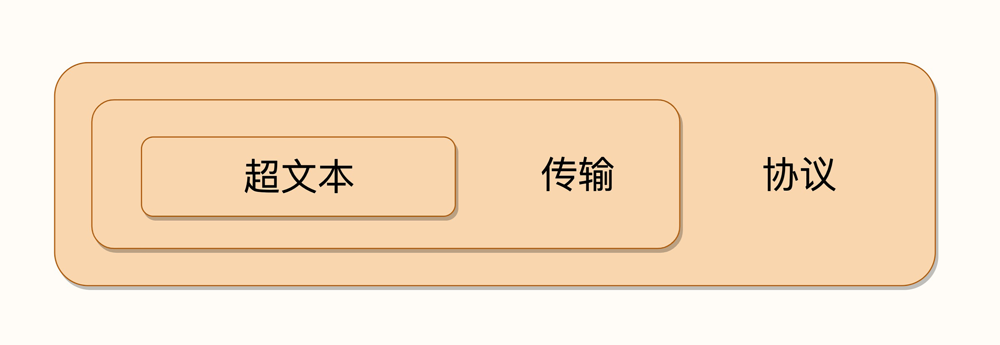

# 1. HTTP的前世今生

## 1.1 史前时期

20世纪60年代，美国国防部高等研究计划署（ARPA）建立了ARPA网，它有四个分布在各地的节点，被认为是如今互联网的“始祖”。

然后在70年代，基于对ARPA网的实践和思考，研究人员发明出了著名的TCP/IP协议。由于具有良好的分层结构和稳定的性能，TCP/IP协议迅速战胜其他竞争对手流行起来，并在80年代中期进入了UNIX系统内核，促使更多的计算机接入了互联网。

## 1.2 创世纪

1989年，任职于欧洲核子研究中心（CERN）的蒂姆·伯纳斯-李（Tim Berners-Lee）发表了一篇论文，提出了在互联网上构建超链接文档系统的构想。这篇论文中他确立了三项关键技术。

+ URI：即统一资源标识符，作为互联网上资源的唯一身份；
+ HTML：即超文本标记语言，描述超文本文档； 
+ HTTP：即超文本传输协议，用来传输超文本。

这三项技术在如今的我们看来已经是稀松平常，但在当时却是了不得的大发明。基于它们，就可以把超文本系统完美地运行在互联网上，让各地的人们能够自由地共享信息，蒂姆把这个系统称为“万维网”（World Wide Web）。

## 1.3 HTTP/0.9

20世纪90年代初期的互联网世界非常简陋，计算机处理能力低，存储容量小，网速很慢，还是一片“信息荒漠”。网络上绝大多数的资源都是纯文本，很多通信协议也都使用纯文本，所以HTTP的设计也不可避免地受到了时代的限制。

这一时期的HTTP被定义为0.9版，结构比较简单，为了便于服务器和客户端处理，它也采用了纯文本格式。蒂姆·伯纳斯-李最初设想的系统里的文档都是只读的，所以只允许用“GET”动作从服务器上获取HTML文档，并且在响应请求之后立即关闭连接，功能非常有限。

HTTP/0.9虽然很简单，但它作为一个“原型”，充分验证了Web服务的可行性，而“简单”也正是它的优点，蕴含了进化和扩展的可能性，因为：

**“把简单的系统变复杂”，要比“把复杂的系统变简单”容易得多。**

## 1.4 HTTP/1.0

1993年，NCSA（美国国家超级计算应用中心）开发出了Mosaic，是第一个可以图文混排的浏览器，随后又在1995年开发出了服务器软件Apache，简化了HTTP服务器的搭建工作。

同一时期，计算机多媒体技术也有了新的发展：1992年发明了JPEG图像格式，1995年发明了MP3音乐格式。

更的多的人开始使用互联网，研究HTTP并提出改进意见，甚至实验性地往协议里添加各种特性，从用户需求的角度促进了HTTP的发展。

在这些已有实践的基础上，经过一系列的草案，HTTP/1.0版本在1996年正式发布。它在多方面增强了0.9版，形式上已经和我们现在的HTTP差别不大了。

+ 增加了HEAD、POST等新方法；
+ 增加了响应状态码，标记可能的错误原因；
+ 引入了协议版本号概念；
+ 引入了HTTP Header（头部）的概念，让HTTP处理请求和响应更加灵活；
+ 传输的数据不再仅限于文本。

但HTTP/1.0并不是一个“标准”，只是记录已有实践和模式的一份参考文档，不具有实际的约束力，相当于一个“备忘录”。

所以HTTP/1.0的发布对于当时正在蓬勃发展的互联网来说并没有太大的实际意义，各方势力仍然按照自己的意图继续在市场上奋力拼杀。

## 1.5 HTTP/1.1

1995年，网景的Netscape Navigator和微软的Internet Explorer开始了著名的“浏览器大战”，都希望在互联网上占据主导地位。

“浏览器大战”再一次极大地推动了Web的发展，HTTP/1.0也在这个过程中经受了实践检验。于是在“浏览器大战”结束之后的1999年，HTTP/1.1发布了RFC文档，编号为2616，正式确立了延续十余年的传奇。

从版本号我们就可以看到，HTTP/1.1是对HTTP/1.0的小幅度修正。但一个重要的区别是：它是一个“正式的标准”，而不是一份可有可无的“参考文档”。这意味着今后互联网上所有的浏览器、服务器、网关、代理等等，只要用到HTTP协议，就必须严格遵守这个标准，相当于是互联网世界的一个“立法”。

不过，说HTTP/1.1是“小幅度修正”也不太确切，它还是有很多实质性进步的。毕竟经过了多年的实战检验，比起0.9/1.0少了“学术气”，更加“接地气”，同时表述也更加严谨。HTTP/1.1主要的变更点有：

+ 增加了PUT、DELETE等新的方法； 
+ 增加了缓存管理和控制； 
+ 明确了连接管理，允许持久连接； 
+ 允许响应数据分块（chunked），利于传输大文件； 
+ 强制要求Host头，让互联网主机托管成为可能。

不过由于HTTP/1.1太过庞大和复杂，所以在2014年又做了一次修订，原来的一个大文档被拆分成了六份较小的文档，编号为7230-7235，优化了一些细节，但此外没有任何实质性的改动。

## 1.6 HTTP/2

这期间也出现了一些对HTTP不满的意见，主要就是连接慢，无法跟上迅猛发展的互联网，但HTTP/1.1标准一直“岿然不动”，无奈之下人们只好发明各式各样的“小花招”来缓解这些问题，比如以前常见的切图、JS合并等网页优化手段。

Google首先开发了自己的浏览器Chrome，然后推出了新的SPDY协议，并在Chrome里应用于自家的服务器，从实际的用户方来“倒逼”HTTP协议的变革，这也开启了第二次的“浏览器大战”。

历史再次重演，不过这次的胜利者是Google，Chrome目前的全球的占有率超过了60%。“挟用户以号令天下”，Google借此顺势把SPDY推上了标准的宝座，互联网标准化组织以SPDY为基础开始制定新版本的HTTP协议，最终在2015年发布了HTTP/2，RFC编号7540。

HTTP/2的制定充分考虑了现今互联网的现状：宽带、移动、不安全，在高度兼容HTTP/1.1的同时在性能改善方面做了很大努力，主要的特点有：

+ 二进制协议，不再是纯文本；
+ 可发起多个请求，废弃了1.1里的管道；
+ 使用专用算法压缩头部，减少数据传输量；
+ 允许服务器主动向客户端推送数据；
+ 增强了安全性，“事实上”要求加密通信。

虽然HTTP/2到今天已经四岁，也衍生出了gRPC等新协议，但由于HTTP/1.1实在是太过经典和强势，目前它的普及率还比较低，大多数网站使用的仍然还是20年前的HTTP/1.1。

## 1.7 HTTP/3

在HTTP/2还处于草案之时，Google又发明了一个新的协议，叫做QUIC，而且还是相同的“套路”，继续在Chrome和自家服务器里试验着“玩”，依托它的庞大用户量和数据量，持续地推动QUIC协议成为互联网上的“既成事实”。

“功夫不负有心人”，当然也是因为QUIC确实自身素质过硬。

在去年，也就是2018年，互联网标准化组织IETF提议将“HTTP over QUIC”更名为“HTTP/3”并获得批准，HTTP/3正式进入了标准化制订阶段，也许两三年后就会正式发布，到时候我们很可能会跳过HTTP/2直接进入HTTP/3。

## 1.8 小结

+ HTTP协议始于三十年前蒂姆·伯纳斯-李的一篇论文； 
+ HTTP/0.9是个简单的文本协议，只能获取文本资源； 
+ HTTP/1.0确立了大部分现在使用的技术，但它不是正式标准； 
+ HTTP/1.1是目前互联网上使用最广泛的协议，功能也非常完善； 
+ HTTP/2基于Google的SPDY协议，注重性能改善，但还未普及； 
+ HTTP/3基于Google的QUIC协议，是将来的发展方向。

# 2. HTTP是什么？HTTP又不是什么？

## 2.1 HTTP是什么：超文本传输协议

**协议**

+ 协议必须要有两个或多个参与者，也就是“协”。
+ 协议是对参与者的一种行为约定和规范，也就是“议”。

协议意味着有多个参与者为了达成某个共同的目的而站在了一起，除了要无疑义地沟通交流之外，还必须明确地规定各方的“责、权、利”，约定该做什么不该做什么，先做什么后做什么，做错了怎么办，有没有补救措施等等。

**HTTP是一个用在计算机世界里的协议。它使用计算机能够理解的语言确立了一种计算机之间交流通信的规范，以及相关的各种控制和错误处理方式。**

**传输**

HTTP是一个“传输协议”，所谓的“传输”（Transfer）其实很好理解，就是把一堆东西从A点搬到B点，或者从B点搬到A点，即“A<===>B”。

+ HTTP协议是一个“双向协议”，通常我们把先发起传输动作的A叫做请求方，把后接到传输的B叫做应答方或者响应方。
+ 数据虽然是在A和B之间传输，但并没有限制只有A和B这两个角色，允许中间有“中转”或者“接力”。这样，传输方式就从“A<===>B”，变成了“A<=>X<=>Y<=>Z<=>B”，A到B的传输过程中可以存在任意多个“中间人”，而这些中间人也都遵从HTTP协议，只要不打扰基本的数据传输，就可以添加任意的额外功能，例如安全认证、数据压缩、编码转换等等，优化整个传输过程。

**HTTP是一个在计算机世界里专门用来在两点之间传输数据的约定和规范。**

**超文本**

所谓“文本”（Text），就表示HTTP传输的不是TCP/UDP这些底层协议里被切分的杂乱无章的二进制包（datagram），而是完整的、有意义的数据，可以被浏览器、服务器这样的上层应用程序处理。

所谓“超文本”，就是“超越了普通文本的文本”，它是文字、图片、音频和视频等的混合体，最关键的是含有“超链接”，能够从一个“超文本”跳跃到另一个“超文本”，形成复杂的非线性、网状的结构关系。

对于“超文本”，我们最熟悉的就应该是HTML了，它本身只是纯文字文件，但内部用很多标签定义了对图片、音频、视频等的链接，再经过浏览器的解释，呈现在我们面前的就是一个含有多种视听信息的页面。

**HTTP是一个在计算机世界里专门在两点之间传输文字、图片、音频、视频等超文本数据的约定和规范**

## 2.2 HTTP不是什么

HTTP是一个协议，是一种计算机间通信的规范，所以它不存在“单独的实体”。

HTTP又与应用程序、操作系统、Web服务器密切相关，在它们之间的通信过程中存在，而且是一种“动态的存在”，是发生在网络连接、传输超文本数据时的一个“动态过程”。

**HTTP不是互联网**

互联网（Internet）是遍布于全球的许多网络互相连接而形成的一个巨大的国际网络，在它上面存放着各式各样的资源，也对应着各式各样的协议，例如超文本资源使用HTTP，普通文件使用FTP，电子邮件使用SMTP和POP3等。

但毫无疑问，HTTP是构建互联网的一块重要拼图，而且是占比最大的那一块。

**HTTP不是编程语言**

编程语言是人与计算机沟通交流所使用的语言，而HTTP是计算机与计算机沟通交流的语言，我们无法使用HTTP来编程，但可以反过来，用编程语言去实现HTTP，告诉计算机如何用HTTP来与外界通信。

**HTTP不是HTML**

HTML是超文本的载体，是一种标记语言，使用各种标签描述文字、图片、超链接等资源，并且可以嵌入CSS、JavaScript等技术实现复杂的动态效果。单论次数，在互联网上HTTP传输最多的可能就是HTML，但要是论数据量，HTML可能要往后排了，图片、音频、视频这些类型的资源显然更大。

**HTTP不是一个孤立的协议**

在互联网世界里，HTTP通常跑在TCP/IP协议栈之上，依靠IP协议实现寻址和路由、TCP协议实现可靠数据传输、DNS协议实现域名查找、SSL/TLS协议实现安全通信。此外，还有一些协议依赖于HTTP，例如WebSocket、HTTPDNS等。这些协议相互交织，构成了一个协议网，而HTTP则处于中心地位。

## 2.3 小结
+ HTTP是一个用在计算机世界里的协议，它确立了一种计算机之间交流通信的规范，以及相关的各种控制和错误处理方式。 
+ HTTP专门用来在两点之间传输数据，不能用于广播、寻址或路由。 
+ HTTP传输的是文字、图片、音频、视频等超文本数据。 
+ HTTP是构建互联网的重要基础技术，它没有实体，依赖许多其他的技术来实现，但同时许多技术也都依赖于它。

# 3. HTTP世界全览（上）：与HTTP相关的各种概念

## 3.1 网络世界

**互联网世界更像是由数不清的大小岛屿组成的“千岛之国”。**

互联网上还有许多万维网之外的资源，例如常用的电子邮件、BT和Magnet点对点下载、FTP文件下载、SSH安全登录、各种即时通信服务等等，它们需要用各自的专有协议来访问。

由于HTTP协议非常灵活、易于扩展，而且“超文本”的表述能力很强，所以很多其他原本不属于HTTP的资源也可以“包装”成HTTP来访问，这就是我们为什么能够总看到各种“网页应用”——例如“微信网页版”“邮箱网页版”——的原因。

综合起来看，现在的互联网90%以上的部分都被万维网，也就是HTTP所覆盖，所以把互联网约等于万维网或HTTP应该也不算大错。

## 3.2 Web服务器

Web服务器是一个很大也很重要的概念，它是HTTP协议里响应请求的主体，通常也把控着绝大多数的网络资源，在网络世界里处于强势地位。

当我们谈到“Web服务器”时有两个层面的含义：硬件和软件。

**硬件** 含义就是物理形式或“云”形式的机器，在大多数情况下它可能不是一台服务器，而是利用反向代理、负载均衡等技术组成的庞大集群。但从外界看来，它仍然表现为一台机器，但这个形象是“虚拟的”。

**软件** 含义的Web服务器可能我们更为关心，它就是提供Web服务的应用程序，通常会运行在硬件含义的服务器上。它利用强大的硬件能力响应海量的客户端HTTP请求，处理磁盘上的网页、图片等静态文件，或者把请求转发给后面的Tomcat
、Node.js等业务应用，返回动态的信息。

## 3.3 CDN

CDN，全称是“Content Delivery Network”，翻译过来就是“内容分发网络”。它应用了HTTP协议里的缓存和代理技术，代替源站响应客户端的请求。

可以缓存源站的数据，让浏览器的请求不用“千里迢迢”地到达源站服务器，直接在“半路”就可以获取响应。如果CDN的调度算法很优秀，更可以找到离用户最近的节点，大幅度缩短响应时间。

CDN也是现在互联网中的一项重要基础设施，除了基本的网络加速外，还提供负载均衡、安全防护、边缘计算、跨运营商网络等功能，能够成倍地“放大”源站服务器的服务能力，很多云服务商都把CDN作为产品的一部分，我也会在后面用一讲的篇幅来专门讲解CDN。

## 3.4 爬虫

HTTP协议并没有规定用户代理后面必须是“真正的人类”，它也完全可以是“机器人”，这些“机器人”的正式名称就叫做“爬虫”（Crawler），实际上是一种可以自动访问Web资源的应用程序。

“爬虫”这个名字非常形象，它们就像是一只只不知疲倦的、辛勤的蚂蚁，在无边无际的网络上爬来爬去，不停地在网站间奔走，搜集抓取各种信息。

绝大多数是由各大搜索引擎“放”出来的，抓取网页存入庞大的数据库，再建立关键字索引，这样我们才能够在搜索引擎中快速地搜索到互联网角落里的页面。

爬虫也有不好的一面，它会过度消耗网络资源，占用服务器和带宽，影响网站对真实数据的分析，甚至导致敏感信息泄漏。所以，又出现了“反爬虫”技术，通过各种手段来限制爬虫。其中一项就是“君子协定”robots.txt，约定哪些该爬，哪些不该爬。

无论是“爬虫”还是“反爬虫”，用到的基本技术都是两个，一个是HTTP，另一个就是HTML。

## 3.5 HTML/WebService/WAF

HTML是HTTP协议传输的主要内容之一，它描述了超文本页面，用各种“标签”定义文字、图片等资源和排版布局，最终由浏览器“渲染”出可视化页面。

HTML目前有两个主要的标准，HTML4和HTML5。广义上的HTML通常是指HTML、JavaScript、CSS等前端技术的组合，能够实现比传统静态页面更丰富的动态页面。

Web Service，它的名字与Web Server很像，但却是一个完全不同的东西。

Web Service是一种由W3C定义的应用服务开发规范，使用client-server主从架构，通常使用WSDL定义服务接口，使用HTTP协议传输XML或SOAP消息，也就是说，它是一个基于Web（HTTP）的服务架构技术，既可以运行在内网，也可以在适当保护后运行在外网。

因为采用了HTTP协议传输数据，所以在Web Service架构里服务器和客户端可以采用不同的操作系统或编程语言开发。例如服务器端用Linux+Java，客户端用Windows+C#，具有跨平台跨语言的优点。

WAF是近几年比较“火”的一个词，意思是“网络应用防火墙”。与硬件“防火墙”类似，它是应用层面的“防火墙”，专门检测HTTP流量，是防护Web应用的安全技术。

WAF通常位于Web服务器之前，可以阻止如SQL注入、跨站脚本等攻击，目前应用较多的一个开源项目是ModSecurity，它能够完全集成进Apache或Nginx。

## 3.6 小结

+ 互联网上绝大部分资源都使用HTTP协议传输；
+ 浏览器是HTTP协议里的请求方，即User Agent；
+ 服务器是HTTP协议里的应答方，常用的有Apache和Nginx；
+ CDN位于浏览器和服务器之间，主要起到缓存加速的作用；
+ 爬虫是另一类User Agent，是自动访问网络资源的程序。

# 4. HTTP世界全览（下）：与HTTP相关的各种协议

## 4.1 TCP/IP

TCP/IP协议实际上是一系列网络通信协议的统称，其中最核心的两个协议是TCP和IP，其他的还有UDP、ICMP、ARP等等，共同构成了一个复杂但有层次的协议栈。

这个协议栈有四层，最上层是“应用层”，最下层是“链接层”，TCP和IP则在中间：TCP属于“传输层”，IP属于“网际层”。

IP协议是“Internet Protocol”的缩写，主要目的是解决寻址和路由问题，以及如何在两点间传送数据包。IP协议使用“IP地址”的概念来定位互联网上的每一台计算机。

现在我们使用的IP协议大多数是v4版，地址是四个用“.”分隔的数字，例如“192.168.0.1”，总共有2^32，大约42亿个可以分配的地址。看上去好像很多，但互联网的快速发展让地址的分配管理很快就“捉襟见肘”。所以，就又出现了v6版，使用8组“:”分隔的数字作为地址，容量扩大了很多，有2^128个，在未来的几十年里应该是足够用了。

TCP协议是“Transmission Control Protocol”的缩写，意思是“传输控制协议”，它位于IP协议之上，基于 IP 协议提供可靠的、字节流形式的通信，是HTTP协议得以实现的基础。

可靠”是指保证数据不丢失，“字节流”是指保证数据完整，所以在TCP协议的两端可以如同操作文件一样访问传输的数据，就像是读写在一个密闭的管道里“流动”的字节。

## 4.2 DNS

域名系统”（Domain Name System）用有意义的名字来作为IP地址的等价替代。

在DNS中，“域名”（Domain Name）又称为“主机名”（Host），为了更好地标记不同国家或组织的主机，让名字更好记，所以被设计成了一个有层次的结构。

域名用“.”分隔成多个单词，级别从左到右逐级升高，最右边的被称为“顶级域名”。

但想要使用TCP/IP协议来通信仍然要使用IP地址，所以需要把域名做一个转换，“映射”到它的真实IP，这就是所谓的“域名解析”。

HTTP协议中并没有明确要求必须使用DNS，但实际上为了方便访问互联网上的Web服务器，通常都会使用DNS来定位或标记主机名，间接地把DNS与HTTP绑在了一起。

## 4.3 URI/URL

URI（Uniform Resource Identifier），中文名称是 统一资源标识符，使用它就能够唯一地标记互联网上资源。

URL（Uniform Resource Locator）， 统一资源定位符，也就是我们俗称的“网址”，它实际上是URI的一个子集。

## 4.4 HTTPS

**全称是“HTTP over SSL/TLS”，也就是运行在SSL/TLS协议上的HTTP。**

是SSL/TLS，而不是TCP/IP，它是一个负责加密通信的安全协议，建立在TCP/IP之上，所以也是个可靠的传输协议，可以被用作HTTP的下层。

SSL的全称是“Secure Socket Layer”，由网景公司发明，当发展到3.0时被标准化，改名为TLS，即“Transport Layer Security”，但由于历史的原因还是有很多人称之为SSL/TLS，或者直接简称为SSL。

SSL使用了许多密码学最先进的研究成果，综合了对称加密、非对称加密、摘要算法、数字签名、数字证书等技术，能够在不安全的环境中为通信的双方创建出一个秘密的、安全的传输通道，为HTTP套上一副坚固的盔甲。

## 4.5 代理

代理（Proxy）是HTTP协议中请求方和应答方中间的一个环节，作为“中转站”，既可以转发客户端的请求，也可以转发服务器的应答。

代理有很多的种类，常见的有：

+ 匿名代理：完全“隐匿”了被代理的机器，外界看到的只是代理服务器；
+ 透明代理：顾名思义，它在传输过程中是“透明开放”的，外界既知道代理，也知道客户端；
+ 正向代理：靠近客户端，代表客户端向服务器发送请求；
+ 反向代理：靠近服务器端，代表服务器响应客户端的请求；

由于代理在传输过程中插入了一个“中间层”，所以可以在这个环节做很多有意思的事情，比如：

+ 负载均衡：把访问请求均匀分散到多台机器，实现访问集群化；
+ 内容缓存：暂存上下行的数据，减轻后端的压力；
+ 安全防护：隐匿IP,使用WAF等工具抵御网络攻击，保护被代理的机器；
+ 数据处理：提供压缩、加密等额外的功能。

## 4.6 小结

+ TCP/IP是网络世界最常用的协议，HTTP通常运行在TCP/IP提供的可靠传输基础上；
+ DNS域名是IP地址的等价替代，需要用域名解析实现到IP地址的映射；
+ URI是用来标记互联网上资源的一个名字，由“协议名+主机名+路径”构成，俗称URL；
+ HTTPS相当于“HTTP+SSL/TLS+TCP/IP”，为HTTP套了一个安全的外壳；
+ 代理是HTTP传输过程中的“中转站”，可以实现缓存加速、负载均衡等功能。
