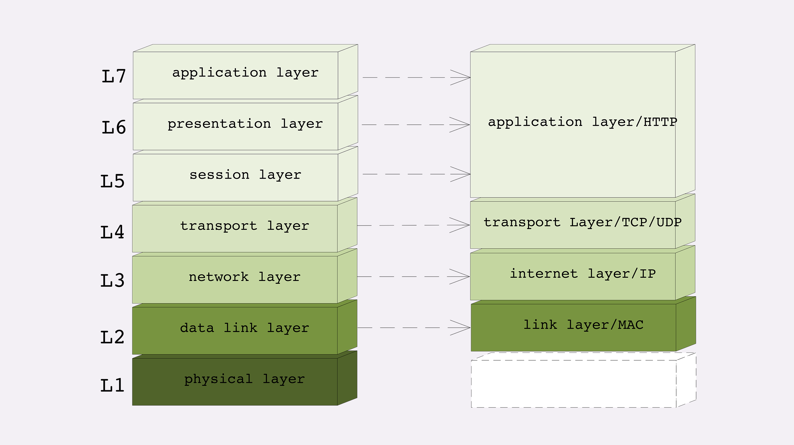
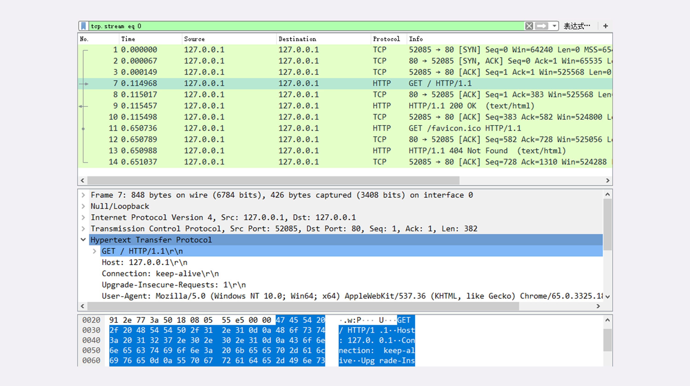

# 1. 网络分层

## 1.1 TCP/IP网络分层模型

TCP/IP当初的设计者真的是非常聪明，创造性地提出了“分层”的概念，把复杂的网络通信划分出多个层次，再给每一个层次分配不同的职责，层次内只专心做自己的事情就好，用“分而治之”的思想把一个“大麻烦”拆分成了数个“小麻烦”，从而解决了网络通信的难题。


TCP/IP协议总共有四层，就像搭积木一样，每一层需要下层的支撑，同时又支撑着上层，任何一层被抽掉都可能会导致整个协议栈坍塌。

+ 第一层叫 **“链接层”（link layer）** ，负责在以太网、WiFi这样的底层网络上发送原始数据包，工作在网卡这个层次，使用MAC地址来标记网络上的设备，所以有时候也叫MAC层。

+ 第二层叫 **“网际层”或者“网络互连层”（internet layer）** ，IP协议就处在这一层。因为IP协议定义了“IP地址”的概念，所以就可以在“链接层”的基础上，用IP地址取代MAC
地址，把许许多多的局域网、广域网连接成一个虚拟的巨大网络，在这个网络里找设备时只要把IP地址再“翻译”成MAC地址就可以了。

+ 第三层叫 **“传输层”（transport layer）**，这个层次协议的职责是保证数据在IP地址标记的两点之间“可靠”地传输，是TCP协议工作的层次，另外还有它的一个“小伙伴”UDP。

+ TCP是一个有状态的协议，需要先与对方建立连接然后才能发送数据，而且保证数据不丢失不重复。而UDP则比较简单，它无状态，不用事先建立连接就可以任意发送数据，但不保证数据一定会发到对方。两个协议的另一个重要区别在于数据的形式。TCP 的数据是连续的“字节流”，有先后顺序，而UDP则是分散的小数据包，是顺序发，乱序收。

协议栈的第四层叫 **“应用层”（application layer）** ，由于下面的三层把基础打得非常好，所以在这一层就“百花齐放”了，有各种面向具体应用的协议。例如Telnet、SSH、FTP、SMTP等等，当然还有我们的HTTP。

MAC层的传输单位是帧（frame），IP层的传输单位是包（packet），TCP层的传输单位是段（segment），HTTP的传输单位则是消息或报文（message）。但这些名词并没有什么本质的区分，可以统称为数据包。

## 1.2 OSI网络分层模型

**OSI，全称是“开放式系统互联通信参考模型”（Open System Interconnection Reference Model）。**

OSI模型分成了七层，部分层次与TCP/IP很像，从下到上分别是：


+ 第一层：物理层，网络的物理形式，例如电缆、光纤、网卡、集线器等等；
+ 第二层：数据链路层，它基本相当于TCP/IP的链接层；
+ 第三层：网络层，相当于TCP/IP里的网际层；
+ 第四层：传输层，相当于TCP/IP里的传输层；
+ 第五层：会话层，维护网络中的连接状态，即保持会话和同步；
+ 第六层：表示层，把数据转换为合适、可理解的语法和语义；
+ 第七层：应用层，面向具体的应用传输数据。

TCP/IP是一个纯软件的栈，没有网络应有的最根基的电缆、网卡等物理设备的位置。而OSI则补足了这个缺失，在理论层面上描述网络更加完整。

OSI为每一层标记了明确了编号，最底层是一层，最上层是七层，而TCP/IP的层次从来只有名字而没有编号。

## 1.3 两个分层模型的映射关系



OSI的分层模型在四层以上分的太细，而TCP/IP实际应用时的会话管理、编码转换、压缩等和具体应用经常联系的很紧密，很难分开。例如，HTTP协议就同时包含了连接管理和数据格式定义。

所谓的“四层负载均衡”就是指工作在传输层上，基于TCP/IP协议的特性，例如IP地址、端口号等实现对后端服务器的负载均衡。

所谓的“七层负载均衡”就是指工作在应用层上，看到的是HTTP协议，解析HTTP报文里的URI、主机名、资源类型等数据，再用适当的策略转发给后端服务器。

## 1.4 小结

+ TCP/IP分为四层，核心是二层的IP和三层的TCP，HTTP在第四层；
+ OSI分为七层，基本对应TCP/IP，TCP在第四层，HTTP在第七层；
+ OSI可以映射到TCP/IP，但这期间一、五、六层消失了；
+ 日常交流的时候我们通常使用OSI模型，用四层、七层等术语；
+ HTTP利用TCP/IP协议栈逐层打包再拆包，实现了数据传输，但下面的细节并不可见。

**凡是由操作系统负责处理的就是四层或四层以下，否则，凡是需要由应用程序（也就是你自己写代码）负责处理的就是七层**

# 2. 域名

## 2.1 域名的形式

域名是一个有层次的结构，是一串用“.”分隔的多个单词，最右边的被称为“顶级域名”，然后是“二级域名”，层级关系向左依次降低。

最左边的是主机名，通常用来表明主机的用途，比如“www”表示提供万维网服务、“mail”表示提供邮件服务，不过这也不是绝对的，名字的关键是要让我们容易记忆。

## 2.2 域名的解析

就像IP地址必须转换成MAC地址才能访问主机一样，域名也必须要转换成IP地址，这个过程就是 **“域名解析”。**

DNS成了互联网的重要基础设施，必须要保证域名解析稳定可靠、快速高效。

DNS的核心系统是一个三层的树状、分布式服务，基本对应域名的结构：

+ **根域名服务器（Root DNS Server）**：管理顶级域名服务器，返回“com”“net”“cn”等顶级域名服务器的IP地址；
+ **顶级域名服务器（Top-level DNS Server）**：管理各自域名下的权威域名服务器，比如com顶级域名服务器可以返回apple.com域名服务器的IP地址；
+ **权威域名服务器（Authoritative DNS Server）**：管理自己域名下主机的IP地址，比如apple.com权威域名服务器可以返回www.apple.com的IP地址。


虽然核心的DNS系统遍布全球，服务能力很强也很稳定，但如果全世界的网民都往这个系统里挤，即使不挤瘫痪了，访问速度也会很慢。

所以在核心DNS系统之外，还有两种手段用来减轻域名解析的压力，并且能够更快地获取结果，基本思路就是 **“缓存”**。

首先，许多大公司、网络运行商都会建立自己的DNS服务器，作为用户DNS查询的代理，代替用户访问核心DNS系统。这些“野生”服务器被称为“非权威域名服务器”，可以缓存之前的查询结果，如果已经有了记录，就无需再向根服务器发起查询，直接返回对应的IP地址。

这些DNS服务器的数量要比核心系统的服务器多很多，而且大多部署在离用户很近的地方。比较知名的DNS有Google的“8.8.8.8”，Microsoft的“4.2.2.1”，还有CloudFlare的“1.1.1.1”等等。

其次，操作系统里也会对DNS解析结果做缓存，如果你之前访问过“www.apple.com”，那么下一次在浏览器里再输入这个网址的时候就不会再跑到DNS那里去问了，直接在操作系统里就可以拿到IP地址。

另外，操作系统里还有一个特殊的“主机映射”文件，通常是一个可编辑的文本，在Linux里是“/etc/hosts”，在Windows里是“C:\WINDOWS\system32\drivers\etc\hosts”，如果操作系统在缓存里找不到DNS记录，就会找这个文件。

有了上面的“野生”DNS服务器、操作系统缓存和hosts文件后，很多域名解析的工作就都不用“跋山涉水”了，直接在本地或本机就能解决，不仅方便了用户，也减轻了各级DNS服务器的压力，效率就大大提升了。


在Nginx里有这么一条配置指令“resolver”，它就是用来配置DNS服务器的，如果没有它，那么Nginx就无法查询域名对应的IP，也就无法反向代理到外部的网站。

```
resolver 8.8.8.8 valid=30s;  #指定Google的DNS，缓存30秒
```

## 2.3 域名的“新玩法”

**重定向**

因为域名代替了IP地址，所以可以让对外服务的域名不变，而主机的IP地址任意变动。当主机有情况需要下线、迁移时，可以更改DNS记录，让域名指向其他的机器。

**基于域名实现的负载均衡**

第一种方式，因为域名解析可以返回多个IP地址，所以一个域名可以对应多台主机，客户端收到多个IP地址后，就可以自己使用轮询算法依次向服务器发起请求，实现负载均衡。

第二种方式，域名解析可以配置内部的策略，返回离客户端最近的主机，或者返回当前服务质量最好的主机，这样在DNS端把请求分发到不同的服务器，实现负载均衡。

前面我们说的都是可信的DNS，如果有一些不怀好意的DNS，那么它也可以在域名这方面“做手脚”，弄一些比较“恶意”的“玩法”，举两个例子：

+ “域名屏蔽”，对域名直接不解析，返回错误，让你无法拿到IP地址，也就无法访问网站；
+ “域名劫持”，也叫“域名污染”，你要访问A网站，但DNS给了你B网站。

## 2.4 小结
+ 域名使用字符串来代替IP地址，方便用户记忆，本质上一个名字空间系统；
+ DNS就像是我们现实世界里的电话本、查号台，统管着互联网世界里的所有网站，是一个“超级大管家”；
+ DNS是一个树状的分布式查询系统，但为了提高查询效率，外围有多级的缓存；
+ 使用DNS可以实现基于域名的负载均衡，既可以在内网，也可以在外网。

# 3. 输入 url 按下回车发生了什么？

## 3.1 使用IP地址访问Web服务器

打开 wireshark 抓包工具，用来抓包。



## 3.2 抓包分析

因为我们在地址栏里直接输入了IP地址“127.0.0.1”，而Web服务器的默认端口是80，所以浏览器就要依照TCP协议的规范，使用“三次握手”建立与Web服务器的连接。

对应到Wireshark里，就是最开始的三个抓包，浏览器使用的端口是52085，服务器使用的端口是80，经过SYN、SYN/ACK、ACK的三个包之后，浏览器与服务器的TCP连接就建立起来了。

有了可靠的TCP连接通道后，HTTP协议就可以开始工作了。于是，浏览器按照HTTP协议规定的格式，通过TCP发送了一个“GET / HTTP/1.1”请求报文，也就是Wireshark里的第四个包。

随后，Web服务器回复了第五个包，在TCP协议层面确认：“刚才的报文我已经收到了”，不过这个TCP包HTTP协议是看不见的。

Web服务器收到报文后在内部就要处理这个请求。同样也是依据HTTP协议的规定，解析报文，看看浏览器发送这个请求想要干什么。

它一看，原来是要求获取根目录下的默认文件，好吧，那我就从磁盘上把那个文件全读出来，再拼成符合HTTP格式的报文，发回去吧。这就是Wireshark里的第六个包“HTTP/1.1 200 OK”，底层走的还是TCP协议。

同样的，浏览器也要给服务器回复一个TCP的ACK确认，“你的响应报文收到了，多谢”，即第七个包。

这时浏览器就收到了响应数据，但里面是什么呢？所以也要解析报文。一看，服务器给我的是个HTML文件，好，那我就调用排版引擎、JavaScript引擎等等处理一下，然后在浏览器窗口里展现出了欢迎页面。

这之后还有两个来回，共四个包，重复了相同的步骤。这是浏览器自动请求了作为网站图标的“favicon.ico”文件，与我们输入的网址无关。但因为我们的实验环境没有这个文件，所以服务器在硬盘上找不到，返回了一个“404 Not Found”。


**简要叙述一下这次最简单的浏览器HTTP请求过程**

+ 浏览器从地址栏的输入中获得服务器的IP地址和端口号；
+ 浏览器用TCP的三次握手与服务器建立连接；
+ 浏览器向服务器发送拼好的报文；
+ 服务器收到报文后处理请求，同样拼好报文再发给浏览器；
+ 浏览器解析报文，渲染输出页面。

## 3.3 小结

+ HTTP协议基于底层的TCP/IP协议，所以必须要用IP地址建立连接；
+ 如果不知道IP地址，就要用DNS协议去解析得到IP地址，否则就会连接失败；
+ 建立TCP连接后会顺序收发数据，请求方和应答方都必须依据HTTP规范构建和解析报文；
+ 为了减少响应时间，整个过程中的每一个环节都会有缓存，能够实现“短路”操作；
+ 虽然现实中的HTTP传输过程非常复杂，但理论上仍然可以简化成实验里的“两点”模型。

# 4. HTTP报文

## 4.1 报文结构


HTTP协议也是与TCP/UDP类似，同样也需要在实际传输的数据前附加一些头数据，不过与TCP/UDP不同的是，它是一个“纯文本”的协议，所以头数据都是ASCII码的文本，可以很容易地用肉眼阅读，不用借助程序解析也能够看懂。

HTTP协议的请求报文和响应报文的结构基本相同，由三大部分组成：

+ 起始行（start line）：描述请求或响应的基本信息；
+ 头部字段集合（header）：使用key-value形式更详细地说明报文；
+ 消息正文（entity）：实际传输的数据，它不一定是纯文本，可以是图片、视频等二进制数据。

这其中前两部分起始行和头部字段经常又合称为“请求头”或“响应头”，消息正文又称为“实体”，但与“header”对应，很多时候就直接称为“body”。

HTTP协议规定报文必须有header，但可以没有body，而且在header之后必须要有一个“空行”，也就是“CRLF”，十六进制的“0D0A”。


在这个浏览器发出的请求报文里，第一行“GET / HTTP/1.1”就是请求行，而后面的“Host”“Connection”等等都属于header，报文的最后是一个空白行结束，没有body。

## 4.2 请求行

请求报文里的起始行也就是请求行（request line），它简要地描述了客户端想要如何操作服务器端的资源。

请求行由三部分构成：

+ 请求方法：是一个动词，如GET/POST，表示对资源的操作；
+ 请求目标：通常是一个URI，标记了请求方法要操作的资源；
+ 版本号：表示报文使用的HTTP协议版本。

这三个部分通常使用空格（space）来分隔，最后要用CRLF换行表示结束。


```
GET / HTTP/1.1
```

在这个请求行里，“GET”是请求方法，“/”是请求目标，“HTTP/1.1”是版本号，把这三部分连起来，意思就是“服务器你好，我想获取网站根目录下的默认文件，我用的协议版本号是1.1，请不要用1.0或者2.0回复我。”

## 4.3 状态行

“状态行”（status line），意思是服务器响应的状态。

比起请求行来说，状态行要简单一些，同样也是由三部分构成：

+ 版本号：表示报文使用的HTTP协议版本；
+ 状态码：一个三位数，用代码的形式表示处理的结果，比如200是成功，500是服务器错误；
+ 原因：作为数字状态码补充，是更详细的解释文字，帮助人理解原因。


```
HTTP/1.1 200 OK
```

浏览器你好，我已经处理完了你的请求，这个报文使用的协议版本号是1.1，状态码是200，一切OK。”

## 4.4 头部字段

请求行或状态行再加上头部字段集合就构成了HTTP报文里完整的请求头或响应头


请求头和响应头的结构是基本一样的，唯一的区别是起始行。

头部字段是key-value的形式，key和value之间用“:”分隔，最后用CRLF换行表示字段结束。

HTTP头字段非常灵活，不仅可以使用标准里的Host、Connection等已有头，也可以任意添加自定义头，这就给HTTP协议带来了无限的扩展可能。

**不过使用头字段需要注意下面几点：**

+ 字段名不区分大小写，例如“Host”也可以写成“host”，但首字母大写的可读性更好；
+ 字段名里不允许出现空格，可以使用连字符“-”，但不能使用下划线“_”。例如，“test-name”是合法的字段名，而“test name”“test_name”是不正确的字段名；
+ 字段名后面必须紧接着“:”，不能有空格，而“:”后的字段值前可以有多个空格；
+ 字段的顺序是没有意义的，可以任意排列不影响语义；
+ 字段原则上不能重复，除非这个字段本身的语义允许，例如Set-Cookie。

## 4.5 常用头字段

HTTP协议规定了非常多的头部字段，实现各种各样的功能，但基本上可以分为四大类：

+ 通用字段：在请求头和响应头里都可以出现；
+ 请求字段：仅能出现在请求头里，进一步说明请求信息或者额外的附加条件；
+ 响应字段：仅能出现在响应头里，补充说明响应报文的信息；
+ 实体字段：它实际上属于通用字段，但专门描述body的额外信息。

对HTTP报文的解析和处理实际上主要就是对头字段的处理，理解了头字段也就理解了HTTP报文。

### 4.5.1 `host`

属于请求字段，只能出现在请求头里，它同时也是唯一一个HTTP/1.1规范里要求 **必须出现** 的字段，也就是说，如果请求头里没有Host，那这就是一个错误的报文。

Host字段告诉服务器这个请求应该由哪个主机来处理，当一台计算机上托管了多个虚拟主机的时候，服务器端就需要用Host字段来选择，有点像是一个简单的“路由重定向”。

### 4.5.2 `User-Agent`

请求字段，只出现在请求头里。它使用一个字符串来描述发起HTTP请求的客户端，服务器可以依据它来返回最合适此浏览器显示的页面。

由于历史的原因，User-Agent非常混乱，每个浏览器都自称是“Mozilla”“Chrome”“Safari”，企图使用这个字段来互相“伪装”，导致User-Agent变得越来越长，最终变得毫无意义。

不过有的比较“诚实”的爬虫会在User-Agent里用“spider”标明自己是爬虫，所以可以利用这个字段实现简单的反爬虫策略。

### 4.5.3 `Date`

一个通用字段，但通常出现在响应头里，表示HTTP报文创建的时间，客户端可以使用这个时间再搭配其他字段决定缓存策略。

### 4.5.4 `Server`

响应字段，只能出现在响应头里。它告诉客户端当前正在提供Web服务的软件名称和版本号。

Server字段也不是必须要出现的，因为这会把服务器的一部分信息暴露给外界，如果这个版本恰好存在bug，那么黑客就有可能利用bug攻陷服务器。所以，有的网站响应头里要么没有这个字段，要么就给出一个完全无关的描述信息。

实体字段里要说的一个是Content-Length，它表示报文里body的长度，也就是请求头或响应头空行后面数据的长度。服务器看到这个字段，就知道了后续有多少数据，可以直接接收。如果没有这个字段，那么body就是不定长的，需要使用chunked方式分段传输。

## 4.6 小结

+ HTTP报文结构就像是“大头儿子”，由“起始行+头部+空行+实体”组成，简单地说就是“header+body”；
+ HTTP报文可以没有body，但必须要有header，而且header后也必须要有空行，形象地说就是“大头”必须要带着“脖子”；
+ 请求头由“请求行+头部字段”构成，响应头由“状态行+头部字段”构成；
+ 请求行有三部分：请求方法，请求目标和版本号；
+ 状态行也有三部分：版本号，状态码和原因字符串；
+ 头部字段是key-value的形式，用“:”分隔，不区分大小写，顺序任意，除了规定的标准头，也可以任意添加自定义字段，实现功能扩展；
+ HTTP/1.1里唯一要求必须提供的头字段是Host，它必须出现在请求头里，标记虚拟主机名。

# 5. 请求方法

## 5.1 标准请求方法

目前HTTP/1.1规定了八种方法，**单词都必须是大写的形式**，我先简单地列把它们列出来，后面再详细讲解。

+ GET：获取资源，可以理解为读取或者下载数据；
+ HEAD：获取资源的元信息；
+ POST：向资源提交数据，相当于写入或上传数据；
+ PUT：类似POST；
+ DELETE：删除资源；
+ CONNECT：建立特殊的连接隧道；
+ OPTIONS：列出可对资源实行的方法；
+ TRACE：追踪请求-响应的传输路径。


既然请求方法是一个“指示”，那么客户端自然就没有决定权，服务器掌控着所有资源，也就有绝对的决策权力。它收到HTTP请求报文后，看到里面的请求方法，可以执行也可以拒绝，或者改变动作的含义，毕竟HTTP是一个“协议”，两边都要“商量着来”。

## 5.2 GET/HEAD

GET方法应该是HTTP协议里最知名的请求方法了，也应该是用的最多的，自0.9版出现并一直被保留至今，是名副其实的“元老”。

它的含义是请求从服务器获取资源，这个资源既可以是静态的文本、页面、图片、视频，也可以是由PHP、Java动态生成的页面或者其他格式的数据。

GET方法虽然基本动作比较简单，但搭配URI和其他头字段就能实现对资源更精细的操作。

在URI后使用“#”，就可以在获取页面后直接定位到某个标签所在的位置；使用If-Modified-Since字段就变成了“有条件的请求”，仅当资源被修改时才会执行获取动作；使用Range字段就是“范围请求”，只获取资源的一部分数据。

HEAD方法与GET方法类似，也是请求从服务器获取资源，服务器的处理机制也是一样的，但服务器不会返回请求的实体数据，只会传回响应头，也就是资源的“元信息”。

HEAD方法可以看做是GET方法的一个“简化版”或者“轻量版”。因为它的响应头与GET完全相同，所以可以用在很多并不真正需要资源的场合，避免传输body数据的浪费。

比如，想要检查一个文件是否存在，只要发个HEAD请求就可以了，没有必要用GET把整个文件都取下来。再比如，要检查文件是否有最新版本，同样也应该用HEAD，服务器会在响应头里把文件的修改时间传回来。

## 5.3 POST/PUT

GET和HEAD方法是从服务器获取数据，而POST和PUT方法则是相反操作，向URI指定的资源提交数据，数据就放在报文的body里。

POST也是一个经常用到的请求方法，使用频率应该是仅次于GET，应用的场景也非常多，只要向服务器发送数据，用的大多数都是POST。

PUT的作用与POST类似，也可以向服务器提交数据，但与POST存在微妙的不同，通常POST表示的是“新建”“create”的含义，而PUT则是“修改” “update”的含义。

在实际应用中，PUT用到的比较少。而且，因为它与POST的语义、功能太过近似，有的服务器甚至就直接禁止使用PUT方法，只用POST方法上传数据。

## 5.4 其他方法


**DELETE** 方法指示服务器删除资源，因为这个动作危险性太大，所以通常服务器不会执行真正的删除操作，而是对资源做一个删除标记。当然，更多的时候服务器就直接不处理DELETE请求。

**CONNECT** 是一个比较特殊的方法，要求服务器为客户端和另一台远程服务器建立一条特殊的连接隧道，这时Web服务器在中间充当了代理的角色。

**OPTIONS** 方法要求服务器列出可对资源实行的操作方法，在响应头的Allow字段里返回。它的功能很有限，用处也不大，有的服务器（例如Nginx）干脆就没有实现对它的支持。

**TRACE** 方法多用于对HTTP链路的测试或诊断，可以显示出请求-响应的传输路径。它的本意是好的，但存在漏洞，会泄漏网站的信息，所以Web服务器通常也是禁止使用。

## 5.5 扩展方法

虽然HTTP/1.1里规定了八种请求方法，但它并没有限制我们只能用这八种方法，这也体现了HTTP协议良好的扩展性，我们可以任意添加请求动作，只要请求方和响应方都能理解就行。

实际应用的请求方法（WebDAV），例如MKCOL、COPY、MOVE、LOCK、UNLOCK、PATCH等。如果有合适的场景，你也可以把它们应用到自己的系统里，比如用LOCK方法锁定资源暂时不允许修改，或者使用PATCH方法给资源打个小补丁，部分更新数据。但因为这些方法是非标准的，所以需要为客户端和服务器编写额外的代码才能添加支持。

## 5.6 安全与幂等

关于请求方法还有两个面试时有可能会问到、比较重要的概念：安全与幂等。

在HTTP协议里，所谓的“安全”是指请求方法不会“破坏”服务器上的资源，即不会对服务器上的资源造成实质的修改。

按照这个定义，只有GET和HEAD方法是“安全”的，因为它们是“只读”操作，只要服务器不故意曲解请求方法的处理方式，无论GET和HEAD操作多少次，服务器上的数据都是“安全的”。

而POST/PUT/DELETE操作会修改服务器上的资源，增加或删除数据，所以是“不安全”的。

所谓的 **“幂等”** 实际上是一个数学用语，被借用到了HTTP协议里，意思是多次执行相同的操作，结果也都是相同的，即多次“幂”后结果“相等”。

很显然，GET和HEAD既是安全的也是幂等的，DELETE可以多次删除同一个资源，效果都是“资源不存在”，所以也是幂等的。

POST和PUT的幂等性质就略费解一点。

按照RFC里的语义，POST是“新增或提交数据”，多次提交数据会创建多个资源，所以不是幂等的；而PUT是“替换或更新数据”，多次更新一个资源，资源还是会第一次更新的状态，所以是幂等的。

对比一下SQL来加深理解：把POST理解成INSERT，把PUT理解成UPDATE，这样就很清楚了。多次INSERT会添加多条记录，而多次UPDATE只操作一条记录，而且效果相同。

## 5.7 小结

+ 请求方法是客户端发出的、要求服务器执行的、对资源的一种操作；
+ 请求方法是对服务器的“指示”，真正应如何处理由服务器来决定；
+ 最常用的请求方法是GET和POST，分别是获取数据和发送数据；
+ HEAD方法是轻量级的GET，用来获取资源的元信息；
+ PUT基本上是POST的同义词，多用于更新数据；
+ “安全”与“幂等”是描述请求方法的两个重要属性，具有理论指导意义，可以帮助我们设计系统。
