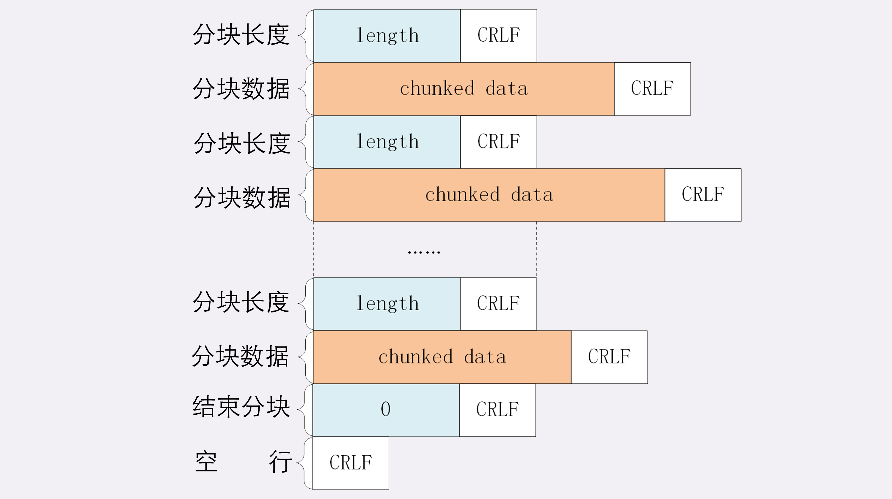
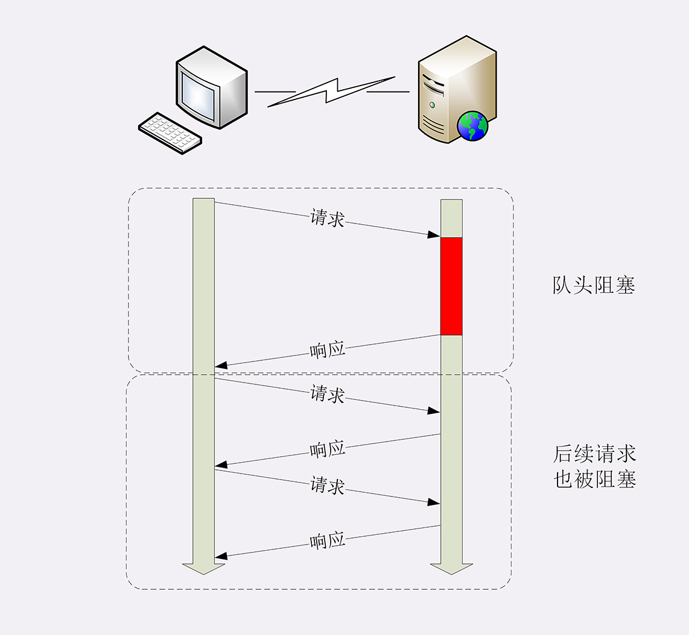
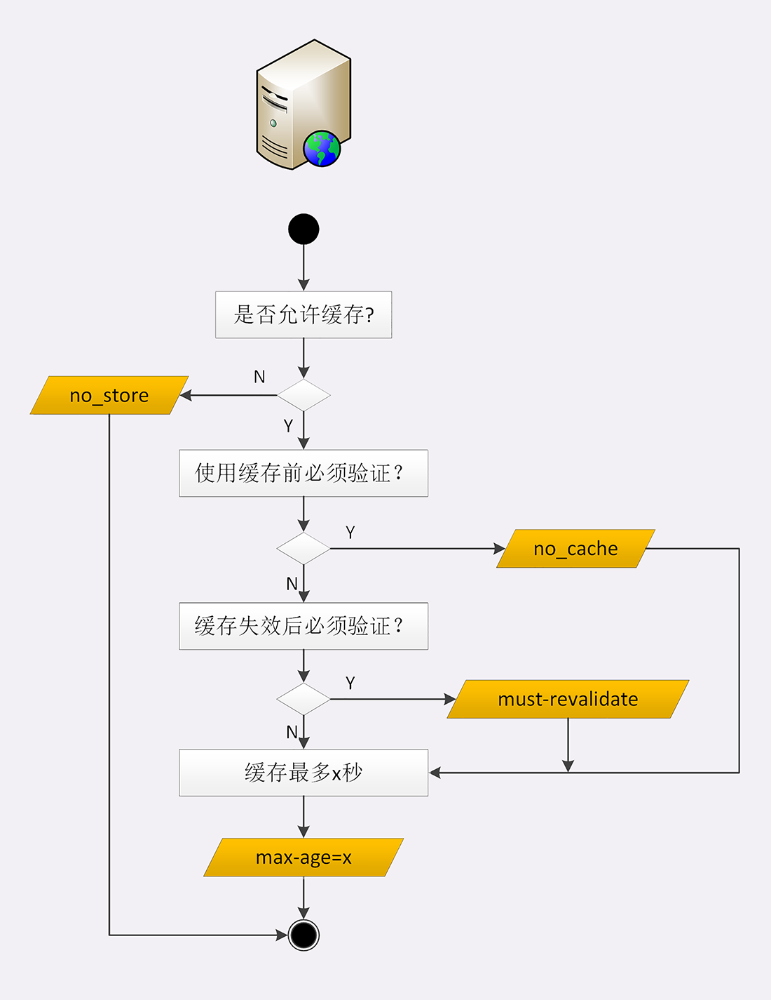

# 1. HTTP的实体数据

## 1.1 数据类型与编码

在TCP/IP协议栈里，传输数据基本上都是“header+body”的格式。但TCP、UDP因为是传输层的协议，它们不会关心body数据是什么，只要把数据发送到对方就算是完成了任务。

而HTTP协议则不同，它是应用层的协议，数据到达之后工作只能说是完成了一半，还必须要告诉上层应用这是什么数据才行，否则上层应用就会“不知所措”。

假如HTTP没有告知数据类型的功能，服务器把“一大坨”数据发给了浏览器，浏览器看到的是一个“黑盒子”，这时候该怎么办呢？

当然，它可以“猜”。因为很多数据都是有固定格式的，所以通过检查数据的前几个字节也许就能知道这是个GIF图片、或者是个MP3音乐文件，但这种方式无疑十分低效，而且有很大几率会检查不出来文件类型。

早在HTTP协议诞生之前就已经有了针对这种问题的解决方案，不过它是用在电子邮件系统里的，让电子邮件可以发送ASCII码以外的任意数据，方案的名字叫做 **“多用途互联网邮件扩展”** （Multipurpose Internet Mail Extensions），简称为MIME。

**MIME** 是一个很大的标准规范，但HTTP只“顺手牵羊”取了其中的一部分，用来标记body的数据类型，这就是我们平常总能听到的 **“MIME type”。**

MIME把数据分成了八大类，每个大类下再细分出多个子类，形式是“type/subtype”的字符串，巧得很，刚好也符合了HTTP明文的特点，所以能够很容易地纳入HTTP头字段里。

在HTTP里经常遇到的几个类别：

+ text：即文本格式的可读数据，我们最熟悉的应该就是text/html了，表示超文本文档，此外还有纯文本text/plain、样式表text/css等。
+ image：即图像文件，有image/gif、image/jpeg、image/png等。
+ audio/video：音频和视频数据，例如audio/mpeg、video/mp4等。
+ application：数据格式不固定，可能是文本也可能是二进制，必须由上层应用程序来解释。常见的有application/json，application/javascript、application/pdf
  等，另外，如果实在是不知道数据是什么类型，像刚才说的“黑盒”，就会是application/octet-stream，即不透明的二进制数据。

但仅有MIME type还不够，因为HTTP在传输时为了节约带宽，有时候还会压缩数据，为了不要让浏览器继续“猜”，还需要有一个“Encoding type”，告诉数据是用的什么编码格式，这样对方才能正确解压缩，还原出原始的数据。

**Encoding type** 常用的有下面三种：

+ gzip：GNU zip压缩格式，也是互联网上最流行的压缩格式；
+ deflate：zlib（deflate）压缩格式，流行程度仅次于gzip；
+ br：一种专门为HTTP优化的新压缩算法（Brotli）。

## 1.2 数据类型使用的头字段

有了MIME type和Encoding type，无论是浏览器还是服务器就都可以轻松识别出body的类型，也就能够正确处理数据了。

HTTP协议为此定义了两个Accept请求头字段和两个Content实体头字段，用于客户端和服务器进行“内容协商”。也就是说，客户端用Accept头告诉服务器希望接收什么样的数据，而服务器用Content头告诉客户端实际发送了什么样的数据。


**Accept** 字段标记的是客户端可理解的MIME type，可以用“,”做分隔符列出多个类型，让服务器有更多的选择余地。

```
Accept: text/html,application/xml,image/webp,image/png
```

相应的，服务器会在响应报文里用头字段Content-Type告诉实体数据的真实类型：

```
Content-Type: text/html
Content-Type: image/png
```

**Accept-Encoding** 字段标记的是客户端支持的压缩格式，例如上面说的gzip、deflate等，同样也可以用“,”列出多个，服务器可以选择其中一种来压缩数据，实际使用的压缩格式放在响应头字段Content-Encoding里。

```
Accept-Encoding: gzip, deflate, br
Content-Encoding: gzip
```

不过这两个字段是可以省略的，如果请求报文里没有Accept-Encoding字段，就表示客户端不支持压缩数据；如果响应报文里没有Content-Encoding字段，就表示响应数据没有被压缩。

## 1.3 语言类型与编码

**“语言类型”** 就是人类使用的自然语言，例如英语、汉语、日语等，而这些自然语言可能还有下属的地区性方言，所以在需要明确区分的时候也要使用“type-subtype”的形式，不过这里的格式与数据类型不同，分隔符不是“/”，而是“-”。

## 1.4 语言类型使用的头字段

HTTP协议也使用Accept请求头字段和Content实体头字段，用于客户端和服务器就语言与编码进行“内容协商”。

Accept-Language字段标记了客户端可理解的自然语言，也允许用“,”做分隔符列出多个类型，例如：

```
Accept-Language: zh-CN, zh, en
```

相应的，服务器应该在响应报文里用头字段Content-Language告诉客户端实体数据使用的实际语言类型：

```
Content-Language: zh-CN
```

字符集在HTTP里使用的请求头字段是Accept-Charset，但响应头里却没有对应的Content-Charset，而是在Content-Type字段的数据类型后面用“charset=xxx”来表示，这点需要特别注意。

```
Accept-Charset: gbk, utf-8
Content-Type: text/html; charset=utf-8
```

不过现在的浏览器都支持多种字符集，通常不会发送Accept-Charset，而服务器也不会发送Content-Language，因为使用的语言完全可以由字符集推断出来，所以在请求头里一般只会有Accept-Language字段，响应头里只会有Content-Type字段。


## 1.5 内容协商的质量值

在HTTP协议里用Accept、Accept-Encoding、Accept-Language等请求头字段进行内容协商的时候，还可以用一种特殊的“q”参数表示权重来设定优先级，这里的“q”是“quality factor”的意思。

权重的最大值是1，最小值是0.01，默认值是1，如果值是0就表示拒绝。具体的形式是在数据类型或语言代码后面加一个“;”，然后是“q=value”。

这里要提醒的是“;”的用法，在大多数编程语言里“;”的断句语气要强于“,”，而在HTTP的内容协商里却恰好反了过来，“;”的意义是小于“,”的。

```
Accept: text/html,application/xml;q=0.9,*/*;q=0.8
```

表示浏览器最希望使用的是HTML文件，权重是1，其次是XML文件，权重是0.9，最后是任意数据类型，权重是0.8。服务器收到请求头后，就会计算权重，再根据自己的实际情况优先输出HTML或者XML。

## 1.6 内容协商的结果

内容协商的过程是不透明的，每个Web服务器使用的算法都不一样。但有的时候，服务器会在响应头里多加一个 **Vary** 字段，记录服务器在内容协商时参考的请求头字段，给出一点信息，例如：

```
Vary: Accept-Encoding,User-Agent,Accept
```

这个Vary字段表示服务器依据了Accept-Encoding、User-Agent和Accept这三个头字段，然后决定了发回的响应报文。

Vary字段可以认为是响应报文的一个特殊的“版本标记”。每当Accept等请求头变化时，Vary也会随着响应报文一起变化。也就是说，同一个URI可能会有多个不同的“版本”，主要用在传输链路中间的代理服务器实现缓存服务


## 1.7 小结

+ 数据类型表示实体数据的内容是什么，使用的是MIME type，相关的头字段是Accept和Content-Type；
+ 数据编码表示实体数据的压缩方式，相关的头字段是Accept-Encoding和Content-Encoding；
+ 语言类型表示实体数据的自然语言，相关的头字段是Accept-Language和Content-Language；
+ 字符集表示实体数据的编码方式，相关的头字段是Accept-Charset和Content-Type；
+ 客户端需要在请求头里使用Accept等头字段与服务器进行“内容协商”，要求服务器返回最合适的数据；
+ Accept等头字段可以用“,”顺序列出多个可能的选项，还可以用“;q=”参数来精确指定权重。

# 2. HTTP传输大文件

## 2.1 数据压缩

通常浏览器在发送请求时都会带着“Accept-Encoding”头字段，里面是浏览器支持的压缩格式列表，例如gzip、deflate、br等，这样服务器就可以从中选择一种压缩算法，放进“Content-Encoding”响应头里，再把原数据压缩后发给浏览器。

如果压缩率能有50%，也就是说100K的数据能够压缩成50K的大小，那么就相当于在带宽不变的情况下网速提升了一倍，加速的效果是非常明显的。

不过这个解决方法也有个缺点，gzip等压缩算法通常只对文本文件有较好的压缩率，而图片、音频视频等多媒体数据本身就已经是高度压缩的，再用gzip处理也不会变小（甚至还有可能会增大一点），所以它就失效了。

不过数据压缩在处理文本的时候效果还是很好的，所以各大网站的服务器都会使用这个手段作为“保底”。例如，在Nginx里就会使用“gzip on”指令，启用对“text/html”的压缩。

## 2.2 分块传输

这种“化整为零”的思路在HTTP协议里就是“chunked”分块传输编码，在响应报文里用头字段“Transfer-Encoding: chunked”来表示，意思是报文里的body部分不是一次性发过来的，而是分成了许多的块（chunk）逐个发送。

分块传输也可以用于“流式数据”，例如由数据库动态生成的表单页面，这种情况下body数据的长度是未知的，无法在头字段“Content-Length”里给出确切的长度，所以也只能用chunked方式分块发送。

**“Transfer-Encoding: chunked”** 和 **“Content-Length”** 这两个字段是互斥的，也就是说响应报文里这两个字段不能同时出现，一个响应报文的传输要么是长度已知，要么是长度未知（chunked）。

分块传输的编码规则，同样采用了明文的方式，很类似响应头

+ 每个分块包含两个部分，长度头和数据块；
+ 长度头是以CRLF（回车换行，即\r\n）结尾的一行明文，用16进制数字表示长度；
+ 数据块紧跟在长度头后，最后也用CRLF结尾，但数据不包含CRLF；
+ 最后用一个长度为0的块表示结束，即“0\r\n\r\n”。



不过浏览器在收到分块传输的数据后会自动按照规则去掉分块编码，重新组装出内容，所以想要看到服务器发出的原始报文形态就得用Telnet手工发送请求（或者用Wireshark抓包）：

```
GET /16-1 HTTP/1.1
Host: www.chrono.com
```

因为Telnet只是收到响应报文就完事了，不会解析分块数据，所以可以很清楚地看到响应报文里的chunked数据格式：先是一行16进制长度，然后是数据，然后再是16进制长度和数据，如此重复，最后是0长度分块结束。

## 2.3 范围请求

有了分块传输编码，服务器就可以轻松地收发大文件了，但对于上G的超大文件，还有一些问题需要考虑。

比如，你在看当下正热播的某穿越剧，想跳过片头，直接看正片，或者有段剧情很无聊，想拖动进度条快进几分钟，这实际上是想获取一个大文件其中的片段数据，而分块传输并没有这个能力。

HTTP协议为了满足这样的需求，提出了“范围请求”（range requests）的概念，允许客户端在请求头里使用专用字段来表示只获取文件的一部分，相当于是客户端的“化整为零”。

范围请求不是Web服务器必备的功能，可以实现也可以不实现，所以服务器必须在响应头里使用字段“Accept-Ranges: bytes”明确告知客户端：“我是支持范围请求的”。

如果不支持的话该怎么办呢？服务器可以发送“Accept-Ranges: none”，或者干脆不发送“Accept-Ranges”字段，这样客户端就认为服务器没有实现范围请求功能，只能老老实实地收发整块文件了。

请求头Range是HTTP范围请求的专用字段，格式是“bytes=x-y”，其中的x和y是以字节为单位的数据范围。

要注意x、y表示的是“偏移量”，范围必须从0计数，例如前10个字节表示为“0-9”，第二个10字节表示为“10-19”，而“0-10”实际上是前11个字节。

Range的格式也很灵活，起点x和终点y可以省略，能够很方便地表示正数或者倒数的范围。假设文件是100个字节，那么：

+ “0-”表示从文档起点到文档终点，相当于“0-99”，即整个文件；
+ “10-”是从第10个字节开始到文档末尾，相当于“10-99”；
+ “-1”是文档的最后一个字节，相当于“99-99”；
+ “-10”是从文档末尾倒数10个字节，相当于“90-99”。

服务器收到Range字段后，需要做四件事。

+ 第一，它必须检查范围是否合法，比如文件只有100个字节，但请求“200-300”，这就是范围越界了。服务器就会返回状态码416，意思是“你的范围请求有误，我无法处理，请再检查一下”。
+ 第二，如果范围正确，服务器就可以根据Range头计算偏移量，读取文件的片段了，返回状态码“206 Partial Content”，和200的意思差不多，但表示body只是原数据的一部分。
+ 第三，服务器要添加一个响应头字段Content-Range，告诉片段的实际偏移量和资源的总大小，格式是“bytes 
x-y/length”，与Range头区别在没有“=”，范围后多了总长度。例如，对于“0-10”的范围请求，值就是“bytes 0-10/100”。
+ 最后剩下的就是发送数据了，直接把片段用TCP发给客户端，一个范围请求就算是处理完了。

有了范围请求之后，HTTP处理大文件就更加轻松了，看视频时可以根据时间点计算出文件的Range，不用下载整个文件，直接精确获取片段所在的数据内容。

不仅看视频的拖拽进度需要范围请求，常用的下载工具里的多段下载、断点续传也是基于它实现的，要点是：

+ 先发个HEAD，看服务器是否支持范围请求，同时获取文件的大小；
+ 开N个线程，每个线程使用Range字段划分出各自负责下载的片段，发请求传输数据； 
+ 下载意外中断也不怕，不必重头再来一遍，只要根据上次的下载记录，用Range请求剩下的那一部分就可以了。

## 2.4 多段数据

范围请求一次只获取一个片段，其实它还支持在Range头里使用多个“x-y”，一次性获取多个片段数据。

这种情况需要使用一种特殊的MIME类型：“multipart/byteranges”，表示报文的body是由多段字节序列组成的，并且还要用一个参数“boundary=xxx”给出段之间的分隔标记。

多段数据的格式与分块传输也比较类似，但它需要用分隔标记boundary来区分不同的片段，可以通过图来对比一下。


每一个分段必须以“- -boundary”开始（前面加两个“-”），之后要用“Content-Type”和“Content-Range”标记这段数据的类型和所在范围，然后就像普通的响应头一样以回车换行结束，再加上分段数据，最后用一个“- -boundary- -”（前后各有两个“-”）表示所有的分段结束。

报文里的“- -00000000001”就是多段的分隔符，使用它客户端就可以很容易地区分出多段Range 数据。

## 2.5 小结

+ 压缩HTML等文本文件是传输大文件最基本的方法；
+ 分块传输可以流式收发数据，节约内存和带宽，使用响应头字段“Transfer-Encoding: chunked”来表示，分块的格式是16进制长度头+数据块；
+ 范围请求可以只获取部分数据，即“分块请求”，实现视频拖拽或者断点续传，使用请求头字段“Range”和响应头字段“Content-Range”，响应状态码必须是206；
+ 也可以一次请求多个范围，这时候响应报文的数据类型是“multipart/byteranges”，body里的多个部分会用boundary字符串分隔。

# 3. HTTP的连接管理

## 3.1 短连接

HTTP协议最初（0.9/1.0）是个非常简单的协议，通信过程也采用了简单的“请求-应答”方式。

它底层的数据传输基于TCP/IP，每次发送请求前需要先与服务器建立连接，收到响应报文后会立即关闭连接。

因为客户端与服务器的整个连接过程很短暂，不会与服务器保持长时间的连接状态，所以就被称为 **“短连接”（short-lived connections）**。早期的HTTP协议也被称为是 **“无连接”** 的协议。

短连接的缺点相当严重，因为在TCP协议里，建立连接和关闭连接都是非常“昂贵”的操作。TCP建立连接要有“三次握手”，发送3个数据包，需要1个RTT；关闭连接是“四次挥手”，4个数据包需要2个RTT。

而HTTP的一次简单“请求-响应”通常只需要4个包，如果不算服务器内部的处理时间，最多是2个RTT。这么算下来，浪费的时间就是“3÷5=60%”，有三分之二的时间被浪费掉了，传输效率低得惊人。


## 3.2 长连接

针对短连接暴露出的缺点，HTTP协议就提出了 **“长连接”** 的通信方式，也叫 **“持久连接”（persistent connections）、“连接保活”（keep alive）、“连接复用”（connection reuse）**。

其实解决办法也很简单，用的就是 **“成本均摊”** 的思路，既然TCP的连接和关闭非常耗时间，那么就把这个时间成本由原来的一个“请求-应答”均摊到多个“请求-应答”上。

这样虽然不能改善TCP的连接效率，但基于 **“分母效应”** ，每个“请求-应答”的无效时间就会降低不少，整体传输效率也就提高了。


在短连接里发送了三次HTTP“请求-应答”，每次都会浪费60%的RTT时间。而在长连接的情况下，同样发送三次请求，因为只在第一次时建立连接，在最后一次时关闭连接，所以浪费率就是“3÷9≈33%”，降低了差不多一半的时间损耗。显然，如果在这个长连接上发送的请求越多，分母就越大，利用率也就越高。

## 3.3 连接相关的头字段

由于长连接对性能的改善效果非常显著，所以在HTTP/1.1中的连接都会默认启用长连接。不需要用什么特殊的头字段指定，只要向服务器发送了第一次请求，后续的请求都会重复利用第一次打开的TCP连接，也就是长连接，在这个连接上收发数据。

我们可以在请求头里明确地要求使用长连接机制，使用的字段是Connection，值是“keep-alive”。

不过不管客户端是否显式要求长连接，如果服务器支持长连接，它总会在响应报文里放一个“Connection: keep-alive”字段，告诉客户端：“我是支持长连接的，接下来就用这个TCP一直收发数据吧”。

因为TCP连接长时间不关闭，服务器必须在内存里保存它的状态，这就占用了服务器的资源。如果有大量的空闲长连接只连不发，就会很快耗尽服务器的资源，导致服务器无法为真正有需要的用户提供服务。

所以，长连接也需要在恰当的时间关闭，不能永远保持与服务器的连接，这在客户端或者服务器都可以做到。

在客户端，可以在请求头里加上“Connection: close”字段，告诉服务器：“这次通信后就关闭连接”。服务器看到这个字段，就知道客户端要主动关闭连接，于是在响应报文里也加上这个字段，发送之后就调用Socket API关闭TCP连接。

服务器端通常不会主动关闭连接，但也可以使用一些策略。拿Nginx来举例，它有两种方式：

+ 使用“keepalive_timeout”指令，设置长连接的超时时间，如果在一段时间内连接上没有任何数据收发就主动断开连接，避免空闲连接占用系统资源。
+ 使用“keepalive_requests”指令，设置长连接上可发送的最大请求次数。比如设置成1000，那么当Nginx在这个连接上处理了1000个请求后，也会主动断开连接。

另外，客户端和服务器都可以在报文里附加通用头字段“Keep-Alive: timeout=value”，限定长连接的超时时间。但这个字段的约束力并不强，通信的双方可能并不会遵守，所以不太常见。

## 3.4 队头阻塞

队头阻塞”（Head-of-line blocking，也叫“队首阻塞”）了。

“队头阻塞”与短连接和长连接无关，而是由HTTP基本的“请求-应答”模型所导致的。

因为HTTP规定报文必须是“一发一收”，这就形成了一个先进先出的“串行”队列。队列里的请求没有轻重缓急的优先级，只有入队的先后顺序，排在最前面的请求被最优先处理。

如果队首的请求因为处理的太慢耽误了时间，那么队列里后面的所有请求也不得不跟着一起等待，结果就是其他的请求承担了不应有的时间成本。



## 3.5 性能优化

这在HTTP里就是“并发连接”（concurrent connections），也就是同时对一个域名发起多个长连接，用数量来解决质量的问题。

但这种方式也存在缺陷。如果每个客户端都想自己快，建立很多个连接，用户数×并发数就会是个天文数字。服务器的资源根本就扛不住，或者被服务器认为是恶意攻击，反而会造成“拒绝服务”。

所以，HTTP协议建议客户端使用并发，但不能“滥用”并发。RFC2616里明确限制每个客户端最多并发2个连接。不过实践证明这个数字实在是太小了，众多浏览器都“无视”标准，把这个上限提高到了6~8。后来修订的RFC7230也就“顺水推舟”，取消了这个“2”的限制。

但“并发连接”所压榨出的性能也跟不上高速发展的互联网无止境的需求，还有什么别的办法吗？

## 3.6 域名分片

“域名分片”（domain sharding）技术，还是用数量来解决质量的思路。

## 3.7 小结

+ 早期的HTTP协议使用短连接，收到响应后就立即关闭连接，效率很低；
+ HTTP/1.1默认启用长连接，在一个连接上收发多个请求响应，提高了传输效率；
+ 服务器会发送“Connection: keep-alive”字段表示启用了长连接；
+ 报文头里如果有“Connection: close”就意味着长连接即将关闭；
+ 过多的长连接会占用服务器资源，所以服务器会用一些策略有选择地关闭长连接；
+ “队头阻塞”问题会导致性能下降，可以用“并发连接”和“域名分片”技术缓解。

# 4. HTTP的重定向和跳转

## 4.1 重定向的过程

**“Location”** 字段属于响应字段，必须出现在响应报文里。但只有配合301/302状态码才有意义，它 **标记了服务器要求重定向的URI** ，这里就是要求浏览器跳转到“index.html”。

浏览器收到301/302报文，会检查响应头里有没有“Location”。如果有，就从字段值里提取出URI，发出新的HTTP请求，相当于自动替我们点击了这个链接。

在“Location”里的URI既可以使用绝对URI，也可以使用相对URI。所谓“绝对URI”，就是完整形式的URI，包括scheme、host:port、path等。所谓“相对URI”，就是省略了scheme和host:port，只有path和query部分，是不完整的，但可以从请求上下文里计算得到。

在重定向时如果只是在站内跳转，你可以放心地使用相对URI。但如果要跳转到站外，就必须用绝对URI。

## 4.2 重定向状态码

最常见的重定向状态码就是301和302，另外还有几个不太常见的，例如303、307、308等。它们最终的效果都差不多，让浏览器跳转到新的URI，但语义上有一些细微的差别，使用的时候要特别注意。


**301** 俗称“永久重定向”（Moved Permanently），意思是原URI已经“永久”性地不存在了，今后的所有请求都必须改用新的URI。

浏览器看到301，就知道原来的URI“过时”了，就会做适当的优化。比如历史记录、更新书签，下次可能就会直接用新的URI访问，省去了再次跳转的成本。搜索引擎的爬虫看到301，也会更新索引库，不再使用老的URI。

**302** 俗称“临时重定向”（“Moved Temporarily”），意思是原URI处于“临时维护”状态，新的URI是起“顶包”作用的“临时工”。

浏览器或者爬虫看到302，会认为原来的URI仍然有效，但暂时不可用，所以只会执行简单的跳转页面，不记录新的URI，也不会有其他的多余动作，下次访问还是用原URI。

301/302是最常用的重定向状态码，在3××里剩下的几个还有：

303 See Other：类似302，但要求重定向后的请求改为GET方法，访问一个结果页面，避免POST/PUT重复操作；
307 Temporary Redirect：类似302，但重定向后请求里的方法和实体不允许变动，含义比302更明确；
308 Permanent Redirect：类似307，不允许重定向后的请求变动，但它是301“永久重定向”的含义。

## 4.3 重定向的应用场景

使用重定向跳转，核心是要理解 **“重定向”** 和 **“永久/临时”** 这两个关键词。

**什么时候需要重定向？**

一个最常见的原因就是“资源不可用”，需要用另一个新的URI来代替。

另一个原因就是“避免重复”，让多个网址都跳转到一个URI，增加访问入口的同时还不会增加额外的工作量。

决定要实行重定向后接下来要考虑的就是“永久”和“临时”的问题了，也就是选择301还是302。

**301的含义是“永久”的。**

如果域名、服务器、网站架构发生了大幅度的改变，比如启用了新域名、服务器切换到了新机房、网站目录层次重构，这些都算是“永久性”的改变。原来的URI已经不能用了，必须用301“永久重定向”，通知浏览器和搜索引擎更新到新地址，这也是搜索引擎优化（SEO）要考虑的因素之一。

**302的含义是“临时”的。**

原来的URI在将来的某个时间点还会恢复正常，常见的应用场景就是系统维护，把网站重定向到一个通知页面，告诉用户过一会儿再来访问。另一种用法就是“服务降级”，比如在双十一促销的时候，把订单查询、领积分等不重要的功能入口暂时关闭，保证核心服务能够正常运行。

## 4.4 重定向的相关问题

重定向的用途很多，掌握了重定向，就能够在架设网站时获得更多的灵活性，不过在使用时还需要注意两个问题。

**“性能损耗”** ，重定向的机制决定了一个跳转会有两次请求-应答，比正常的访问多了一次。

虽然301/302报文很小，但大量的跳转对服务器的影响也是不可忽视的。站内重定向还好说，可以长连接复用，站外重定向就要开两个连接，如果网络连接质量差，那成本可就高多了，会严重影响用户的体验。

所以重定向应当适度使用，决不能滥用。

**“循环跳转”**，如果重定向的策略设置欠考虑，可能会出现“A=>B=>C=>A”的无限循环，不停地在这个链路里转圈圈，后果可想而知。

所以HTTP协议特别规定，浏览器必须具有检测“循环跳转”的能力，在发现这种情况时应当停止发送请求并给出错误提示。

## 4.5 小结

+ 重定向是服务器发起的跳转，要求客户端改用新的URI重新发送请求，通常会自动进行，用户是无感知的；
+ 301/302是最常用的重定向状态码，分别是“永久重定向”和“临时重定向”；
+ 响应头字段Location指示了要跳转的URI，可以用绝对或相对的形式；
+ 重定向可以把一个URI指向另一个URI，也可以把多个URI指向同一个URI，用途很多；
+ 使用重定向时需要当心性能损耗，还要避免出现循环跳转。

# 5. HTTP的Cookie机制

## 5.1 Cookie的工作过程

响应头字段 **Set-Cookie** 和请求头字段 **Cookie**。

当用户通过浏览器第一次访问服务器的时候，服务器肯定是不知道他的身份的。所以，就要创建一个独特的身份标识数据，格式是 **“key=value”** ，然后放进Set-Cookie字段里，随着响应报文一同发给浏览器。

浏览器收到响应报文，看到里面有Set-Cookie，知道这是服务器给的身份标识，于是就保存起来，下次再请求的时候就自动把这个值放进Cookie字段里发给服务器。

因为第二次请求里面有了Cookie字段，服务器就知道这个用户不是新人，之前来过，就可以拿出Cookie里的值，识别出用户的身份，然后提供个性化的服务。


Cookie是由浏览器负责存储的，而不是操作系统。所以，它是“浏览器绑定”的，只能在本浏览器内生效。

## 5.2 Cookie的属性

Cookie就是服务器委托浏览器存储在客户端里的一些数据，而这些数据通常都会记录用户的关键识别信息。所以，就需要在“key=value”外再用一些手段来保护，防止外泄或窃取，这些手段就是Cookie的属性。

**设置Cookie的生存周期**，也就是它的有效期，让它只能在一段时间内可用，就像是食品的“保鲜期”，一旦超过这个期限浏览器就认为是Cookie失效，在存储里删除，也不会发送给服务器。

Cookie的有效期可以使用 **Expires** 和 **Max-Age** 两个属性来设置。

**“Expires”** 俗称“过期时间”，用的是绝对时间点，可以理解为“截止日期”（deadline）。

**“Max-Age”** 用的是相对时间，单位是秒，浏览器用收到报文的时间点再加上Max-Age，就可以得到失效的绝对时间。

Expires和Max-Age可以同时出现，两者的失效时间可以一致，也可以不一致，但浏览器会优先采用Max-Age计算失效期。

**设置Cookie的作用域**，让浏览器仅发送给特定的服务器和URI，避免被其他网站盗用。

作用域的设置比较简单，**“Domain”** 和 **“Path”** 指定了Cookie所属的域名和路径，浏览器在发送Cookie前会从URI中提取出host和path部分，对比Cookie 的属性。如果不满足条件，就不会在请求头里发送Cookie。

**Cookie的安全性** ，尽量不要让服务器以外的人看到。

**“HttpOnly”** 会告诉浏览器，此Cookie只能通过浏览器HTTP协议传输，禁止其他方式访问，浏览器的JS引擎就会禁用document.cookie等一切相关的API，脚本攻击也就无从谈起了。

**“SameSite”** 可以防范“跨站请求伪造”（XSRF）攻击，设置成“SameSite=Strict”可以严格限定Cookie不能随着跳转链接跨站发送，而“SameSite=Lax”则略宽松一点，允许GET/HEAD 等安全方法，但禁止POST跨站发送。

**“Secure”**，表示这个Cookie仅能用HTTPS协议加密传输，明文的HTTP协议会禁止发送。但Cookie本身不是加密的，浏览器里还是以明文的形式存在。

## 5.3 Cookie的应用

**身份识别** ，保存用户的登录信息，实现会话事务。

**广告跟踪** ，上网的时候肯定看过很多的广告图片，这些图片背后都是广告商网站（例如Google），它会“偷偷地”给你贴上Cookie小纸条，这样你上其他的网站，别的广告就能用Cookie读出你的身份，然后做行为分析，再推给你广告。

这种Cookie不是由访问的主站存储的，所以又叫“第三方Cookie”（third-party cookie）。如果广告商势力很大，广告到处都是，那么就比较“恐怖”了，无论你走到哪里它都会通过Cookie认出你来，实现广告“精准打击”。

为了防止滥用Cookie搜集用户隐私，互联网组织相继提出了DNT（Do Not Track）和P3P（Platform for Privacy Preferences Project），但实际作用不大。

## 5.4 小结

+ Cookie是服务器委托浏览器存储的一些数据，让服务器有了“记忆能力”；
+ 响应报文使用Set-Cookie字段发送“key=value”形式的Cookie值；
+ 请求报文里用Cookie字段发送多个Cookie值；
+ 为了保护Cookie，还要给它设置有效期、作用域等属性，常用的有Max-Age、Expires、Domain、HttpOnly等；
+ Cookie最基本的用途是身份识别，实现有状态的会话事务。

Cookie并不属于HTTP标准（RFC6265，而不是RFC2616/7230），所以语法上与其他字段不太一致，使用的分隔符是“;”，与Accept等字段的“,”不同，小心不要弄错了。

# 6. HTTP的缓存控制

缓存（Cache）是计算机领域里的一个重要概念，是优化系统性能的利器。

由于链路漫长，网络时延不可控，浏览器使用HTTP获取资源的成本较高。所以，非常有必要把“来之不易”的数据缓存起来，下次再请求的时候尽可能地复用。这样，就可以避免多次请求-应答的通信成本，节约网络带宽，也可以加快响应速度。

实际上，HTTP传输的每一个环节基本上都会有缓存，非常复杂。

基于“请求-应答”模式的特点，可以大致分为客户端缓存和服务器端缓存，因为服务器端缓存经常与代理服务“混搭”在一起，所以今天我先讲客户端——也就是浏览器的缓存。

## 6.1 服务器的缓存控制

+ 浏览器发现缓存无数据，于是发送请求，向服务器获取资源；
+ 服务器响应请求，返回资源，同时标记资源的有效期；
+ 浏览器缓存资源，等待下次重用。

服务器标记资源有效期使用的头字段是“Cache-Control”，里面的值“max-age=30”就是资源的有效时间，相当于告诉浏览器，“这个页面只能缓存30秒，之后就算是过期，不能用。”

“Cache-Control”字段里的“max-age”和上一讲里Cookie有点像，都是标记资源的有效期。

max-age是“生存时间”（又叫“新鲜度”“缓存寿命”，类似TTL，Time-To-Live），时间的计算起点是响应报文的创建时刻（即Date字段，也就是离开服务器的时刻），而不是客户端收到报文的时刻，也就是说包含了在链路传输过程中所有节点所停留的时间。

比如，服务器设定“max-age=5”，但因为网络质量很糟糕，等浏览器收到响应报文已经过去了4秒，那么这个资源在客户端就最多能够再存1秒钟，之后就会失效。

“max-age”是HTTP缓存控制最常用的属性，此外在响应报文里还可以用其他的属性来更精确地指示浏览器应该如何使用缓存：

+ no_store：不允许缓存，用于某些变化非常频繁的数据，例如秒杀页面；
+ no_cache：它的字面含义容易与no_store搞混，实际的意思并不是不允许缓存，而是可以缓存，但在使用之前必须要去服务器验证是否过期，是否有最新的版本；
+ must-revalidate：又是一个和no_cache相似的词，它的意思是如果缓存不过期就可以继续使用，但过期了如果还想用就必须去服务器验证。



## 6.2 客户端的缓存控制

不止服务器可以发“Cache-Control”头，浏览器也可以发“Cache-Control”，也就是说请求-应答的双方都可以用这个字段进行缓存控制，互相协商缓存的使用策略。

当你点“刷新”按钮的时候，浏览器会在请求头里加一个“Cache-Control: max-age=0”。因为max-age是“生存时间”，max-age=0的意思就是“我要一个最最新鲜的西瓜”，而本地缓存里的数据至少保存了几秒钟，所以浏览器就不会使用缓存，而是向服务器发请求。服务器看到max-age=0，也就会用一个最新生成的报文回应浏览器。

**Ctrl+F5的“强制刷新”又是什么样的呢？**

它其实是发了一个“Cache-Control: no-cache”，含义和“max-age=0”基本一样，就看后台的服务器怎么理解，通常两者的效果是相同的。

在“前进”“后退”“跳转”这些重定向动作中浏览器不会“夹带私货”，只用最基本的请求头，没有“Cache-Control”，所以就会检查缓存，直接利用之前的资源，不再进行网络通信。

## 6.3 条件请求

浏览器用“Cache-Control”做缓存控制只能是刷新数据，不能很好地利用缓存数据，又因为缓存会失效，使用前还必须要去服务器验证是否是最新版。

浏览器可以用两个连续的请求组成“验证动作”：先是一个HEAD，获取资源的修改时间等元信息，然后与缓存数据比较，如果没有改动就使用缓存，节省网络流量，否则就再发一个GET请求，获取最新的版本。

但这样的两个请求网络成本太高了，所以HTTP协议就定义了一系列“If”开头的“条件请求”字段，专门用来检查验证资源是否过期，把两个请求才能完成的工作合并在一个请求里做。而且，验证的责任也交给服务器，浏览器只需“坐享其成”。

条件请求一共有5个头字段，我们最常用的是 **“if-Modified-Since”** 和 **“If-None-Match”** 这两个。需要第一次的响应报文预先提供 **“Last-modified”** 和 **“ETag”** ，然后第二次请求时就可以带上缓存里的原值，验证资源是否是最新的。

如果资源没有变，服务器就回应一个 **“304 Not Modified”** ，表示缓存依然有效，浏览器就可以更新一下有效期，然后放心大胆地使用缓存了。


ETag是 **“实体标签”（Entity Tag）** 的缩写，是资源的一个唯一标识，主要是用来解决修改时间无法准确区分文件变化的问题。

使用ETag就可以精确地识别资源的变动情况，让浏览器能够更有效地利用缓存。

**ETag还有“强”“弱”之分。**

强ETag要求资源在字节级别必须完全相符，弱ETag在值前有个 **“W/”** 标记，只要求资源在语义上没有变化，但内部可能会有部分发生了改变（例如HTML里的标签顺序调整，或者多了几个空格）。

## 6.4 小结

+ 缓存是优化系统性能的重要手段，HTTP传输的每一个环节中都可以有缓存；
+ 服务器使用“Cache-Control”设置缓存策略，常用的是“max-age”，表示资源的有效期；
+ 浏览器收到数据就会存入缓存，如果没过期就可以直接使用，过期就要去服务器验证是否仍然可用；
+ 验证资源是否失效需要使用“条件请求”，常用的是“if-Modified-Since”和“If-None-Match”，收到304就可以复用缓存里的资源；
+ 验证资源是否被修改的条件有两个：“Last-modified”和“ETag”，需要服务器预先在响应报文里设置，搭配条件请求使用；
+ 浏览器也可以发送“Cache-Control”字段，使用“max-age=0”或“no_cache”刷新数据。

# 7. HTTP的代理服务

引入HTTP代理后，原来简单的双方通信就变复杂了一些，加入了一个或者多个中间人，但整体上来看，还是一个有顺序关系的链条，而且链条里相邻的两个角色仍然是简单的一对一通信，不会出现越级的情况。


链条的起点还是客户端（也就是浏览器），中间的角色被称为代理服务器（proxy server），链条的终点被称为源服务器（origin server），意思是数据的“源头”“起源”。

## 7.1 代理服务

其实HTTP协议里对它并没有什么特别的描述，它就是在客户端和服务器原本的通信链路中插入的一个中间环节，也是一台服务器，但提供的是“代理服务”。

所谓的“代理服务”就是指 **服务本身不生产内容，而是处于中间位置转发上下游的请求和响应，具有双重身份**：面向下游的用户时，表现为服务器，代表源服务器响应客户端的请求；而面向上游的源服务器时，又表现为客户端，代表客户端发送请求。

## 7.2 代理的作用

由于代理处在HTTP通信过程的中间位置，相应地就对上屏蔽了真实客户端，对下屏蔽了真实服务器，简单的说就是“欺上瞒下”。在这个中间层的“小天地”里就可以做很多的事情，为HTTP协议增加更多的灵活性，实现客户端和服务器的“双赢”。

代理最基本的一个功能是负载均衡。因为在面向客户端时屏蔽了源服务器，客户端看到的只是代理服务器，源服务器究竟有多少台、是哪些IP地址都不知道。于是代理服务器就可以掌握请求分发的“大权”，决定由后面的哪台服务器来响应请求。


代理中常用的负载均衡算法，比如轮询、一致性哈希等等，这些算法的目标都是尽量把外部的流量合理地分散到多台源服务器，提高系统的整体资源利用率和性能。

在负载均衡的同时，代理服务还可以执行更多的功能，比如：

+ **健康检查**：使用“心跳”等机制监控后端服务器，发现有故障就及时“踢出”集群，保证服务高可用；
+ **安全防护**：保护被代理的后端服务器，限制IP地址或流量，抵御网络攻击和过载；
+ **加密卸载**：对外网使用SSL/TLS加密通信认证，而在安全的内网不加密，消除加解密成本；
+ **数据过滤**：拦截上下行的数据，任意指定策略修改请求或者响应；
+ **内容缓存**：暂存、复用服务器响应。

## 7.3 代理相关头字段

代理服务器需要用字段“Via”标明代理的身份。

Via是一个通用字段，请求头或响应头里都可以出现。每当报文经过一个代理节点，代理服务器就会把自身的信息追加到字段的末尾，就像是经手人盖了一个章。

如果通信链路中有很多中间代理，就会在Via里形成一个链表，这样就可以知道报文究竟走过了多少个环节才到达了目的地。

例如下图中有两个代理：proxy1和proxy2，客户端发送请求会经过这两个代理，依次添加就是“Via: proxy1, proxy2”，等到服务器返回响应报文的时候就要反过来走，头字段就是“Via: proxy2, proxy1”。


Via 字段只解决了客户端和源服务器判断是否存在代理的问题，还不能知道对方的真实信息。

服务器的IP地址应该是保密的，关系到企业的内网安全，所以一般不会让客户端知道。不过反过来，通常服务器需要知道客户端的真实IP地址，方便做访问控制、用户画像、统计分析。

可惜的是HTTP标准里并没有为此定义头字段，但已经出现了很多“事实上的标准”，最常用的两个头字段是 **“X-Forwarded-For”** 和 **“X-Real-IP”** 。

“X-Forwarded-For”的字面意思是“为谁而转发”，形式上和“Via”差不多，也是每经过一个代理节点就会在字段里追加一个信息。但“Via”追加的是代理主机名（或者域名），而“X-Forwarded-For”追加的是请求方的IP地址。所以，在字段里最左边的IP地址就客户端的地址。

“X-Real-IP”是另一种获取客户端真实IP的手段，它的作用很简单，就是记录客户端IP地址，没有中间的代理信息，相当于是“X-Forwarded-For”的简化版。如果客户端和源服务器之间只有一个代理，那么这两个字段的值就是相同的。

## 7.4 代理协议

有了“X-Forwarded-For”等头字段，源服务器就可以拿到准确的客户端信息了。但对于代理服务器来说它并不是一个最佳的解决方案。

因为通过“X-Forwarded-For”操作代理信息必须要解析HTTP报文头，这对于代理来说成本比较高，原本只需要简单地转发消息就好，而现在却必须要费力解析数据再修改数据，会降低代理的转发性能。

另一个问题是“X-Forwarded-For”等头必须要修改原始报文，而有些情况下是不允许甚至不可能的（比如使用HTTPS通信被加密）。

所以就出现了一个专门的“代理协议”（The PROXY protocol），它由知名的代理软件HAProxy所定义，也是一个“事实标准”，被广泛采用（注意并不是RFC）。

“代理协议”有v1和v2两个版本，v1和HTTP差不多，也是明文，而v2是二进制格式。今天只介绍比较好理解的v1，它在HTTP报文前增加了一行ASCII码文本，相当于又多了一个头。

这一行文本其实非常简单，开头必须是“PROXY”五个大写字母，然后是“TCP4”或者“TCP6”，表示客户端的IP地址类型，再后面是请求方地址、应答方地址、请求方端口号、应答方端口号，最后用一个回车换行（\r\n）结束。

```
PROXY TCP4 1.1.1.1 2.2.2.2 55555 80\r\n
GET / HTTP/1.1\r\n
Host: www.xxx.com\r\n
\r\n
```

服务器看到这样的报文，只要解析第一行就可以拿到客户端地址，不需要再去理会后面的HTTP数据，省了很多事情。

不过代理协议并不支持“X-Forwarded-For”的链式地址形式，所以拿到客户端地址后再如何处理就需要代理服务器与后端自行约定。

## 7.5 小结

+ HTTP代理就是客户端和服务器通信链路中的一个中间环节，为两端提供“代理服务”；
+ 代理处于中间层，为HTTP处理增加了更多的灵活性，可以实现负载均衡、安全防护、数据过滤等功能；
+ 代理服务器需要使用字段“Via”标记自己的身份，多个代理会形成一个列表；
+ 如果想要知道客户端的真实IP地址，可以使用字段“X-Forwarded-For”和“X-Real-IP”；
+ 专门的“代理协议”可以在不改动原始报文的情况下传递客户端的真实IP。

# 8. HTTP的缓存代理

但HTTP传输链路上，不只是客户端有缓存，服务器上的缓存也是非常有价值的，可以让请求不必走完整个后续处理流程，“就近”获得响应结果。

特别是对于那些“读多写少”的数据，例如突发热点新闻、爆款商品的详情页，一秒钟内可能有成千上万次的请求。即使仅仅缓存数秒钟，也能够把巨大的访问流量挡在外面，让RPS（request per second）降低好几个数量级，减轻应用服务器的并发压力，对性能的改善是非常显著的。

HTTP的服务器缓存功能主要由代理服务器来实现（即缓存代理），而源服务器系统内部虽然也经常有各种缓存（如Memcache、Redis、Varnish等），但与HTTP没有太多关系，所以这里暂且不说。

## 8.1 缓存代理服务

在没有缓存的时候，代理服务器每次都是直接转发客户端和服务器的报文，中间不会存储任何数据，只有最简单的中转功能。


加入了缓存后，代理服务收到源服务器发来的响应数据后需要做两件事。第一个当然是 **把报文转发给客户端** ，而第二个就是 **把报文存入自己的Cache里** 。

下一次再有相同的请求，代理服务器就可以直接发送304或者缓存数据，不必再从源服务器那里获取。这样就降低了客户端的等待时间，同时节约了源服务器的网络带宽。

在HTTP的缓存体系中，缓存代理的身份十分特殊，它“既是客户端，又是服务器”，同时也“既不是客户端，又不是服务器”。

说它“即是客户端又是服务器”，是因为它面向源服务器时是客户端，在面向客户端时又是服务器，所以它即可以用客户端的缓存控制策略也可以用服务器端的缓存控制策略。

但缓存代理也“即不是客户端又不是服务器”，因为它只是一个数据的“中转站”，并不是真正的数据消费者和生产者，所以还需要有一些新的“Cache-Control”属性来对它做特别的约束。

## 8.2 源服务器的缓存控制

服务器端的“Cache-Control”属性：max-age、no_store、no_cache和must-revalidate

这4种缓存属性可以约束客户端，也可以约束代理。

但客户端和代理是不一样的，客户端的缓存只是用户自己使用，而代理的缓存可能会为非常多的客户端提供服务。所以，需要对它的缓存再多一些限制条件。

首先，我们要区分客户端上的缓存和代理上的缓存，可以使用两个新属性 **“private”** 和 **“public”** 。

“private”表示缓存只能在客户端保存，是用户“私有”的，不能放在代理上与别人共享。而“public”的意思就是缓存完全开放，谁都可以存，谁都可以用。

其次，缓存失效后的重新验证也要区分开（即使用条件请求“Last-modified”和“ETag”）， **“must-revalidate”** 是只要过期就必须回源服务器验证，而新的“proxy-revalidate”只要求代理的缓存过期后必须验证，客户端不必回源，只验证到代理这个环节就行了。

再次，缓存的生存时间可以使用新的 **“s-maxage”** （s是share的意思，注意maxage中间没有“-”），只限定在代理上能够存多久，而客户端仍然使用“max_age”。

还有一个代理专用的属性 **“no-transform”** 。代理有时候会对缓存下来的数据做一些优化，比如把图片生成png、webp等几种格式，方便今后的请求处理，而“no-transform”就会禁止这样做，不许“偷偷摸摸搞小动作”。


源服务器在设置完“Cache-Control”后必须要为报文加上“Last-modified”或“ETag”字段。否则，客户端和代理后面就无法使用条件请求来验证缓存是否有效，也就不会有304缓存重定向。

## 8.3 客户端的缓存控制

客户端在HTTP缓存体系里要面对的是代理和源服务器，也必须区别对待。


max-age、no_store、no_cache这三个属性同样作用于代理和源服务器。

关于缓存的生存时间，多了两个新属性 **“max-stale”** 和 **“min-fresh”** 。

“max-stale”的意思是如果代理上的缓存过期了也可以接受，但不能过期太多，超过x秒也会不要。

“min-fresh”的意思是缓存必须有效，而且必须在x秒后依然有效。

有的时候客户端还会发出一个特别的 **“only-if-cached”** 属性，表示只接受代理缓存的数据，不接受源服务器的响应。如果代理上没有缓存或者缓存过期，就应该给客户端返回一个504（Gateway Timeout）。

## 8.4 其他问题

第一个是 **“Vary”** 字段，它是内容协商的结果，相当于报文的一个版本标记。

同一个请求，经过内容协商后可能会有不同的字符集、编码、浏览器等版本。比如，“Vary: Accept-Encoding”“Vary: User-Agent”，缓存代理必须要存储这些不同的版本。

当再收到相同的请求时，代理就读取缓存里的“Vary”，对比请求头里相应的“ Accept-Encoding”“User-Agent”等字段，如果和上一个请求的完全匹配，比如都是“gzip”“Chrome”，就表示版本一致，可以返回缓存的数据。

另一个问题是 **“Purge”** ，也就是“缓存清理”，它对于代理也是非常重要的功能，例如：

+ 过期的数据应该及时淘汰，避免占用空间；
+ 源站的资源有更新，需要删除旧版本，主动换成最新版（即刷新）；
+ 有时候会缓存了一些本不该存储的信息，例如网络谣言或者危险链接，必须尽快把它们删除。

清理缓存的方法有很多，比较常用的一种做法是使用自定义请求方法“PURGE”，发给代理服务器，要求删除URI对应的缓存数据。

## 8.5 小结

+ 计算机领域里最常用的性能优化手段是“时空转换”，也就是“时间换空间”或者“空间换时间”，HTTP缓存属于后者；
+ 缓存代理是增加了缓存功能的代理服务，缓存源服务器的数据，分发给下游的客户端；
+ “Cache-Control”字段也可以控制缓存代理，常用的有“private”“s-maxage”“no-transform”等，同样必须配合“Last-modified”“ETag”等字段才能使用；
+ 缓存代理有时候也会带来负面影响，缓存不良数据，需要及时刷新或删除。
