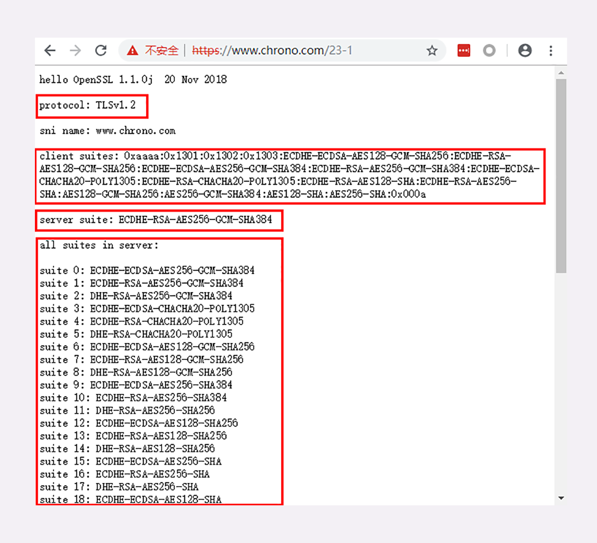
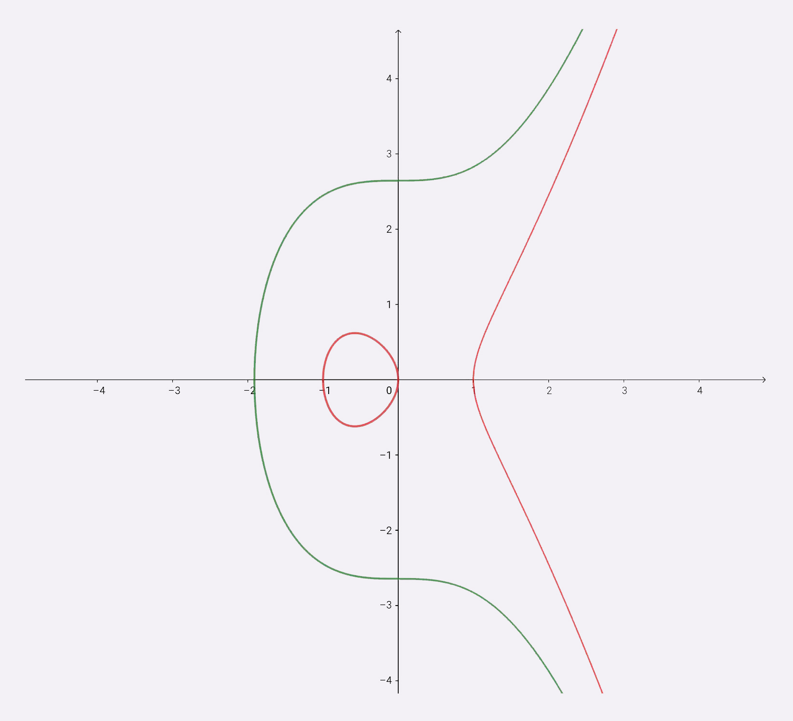
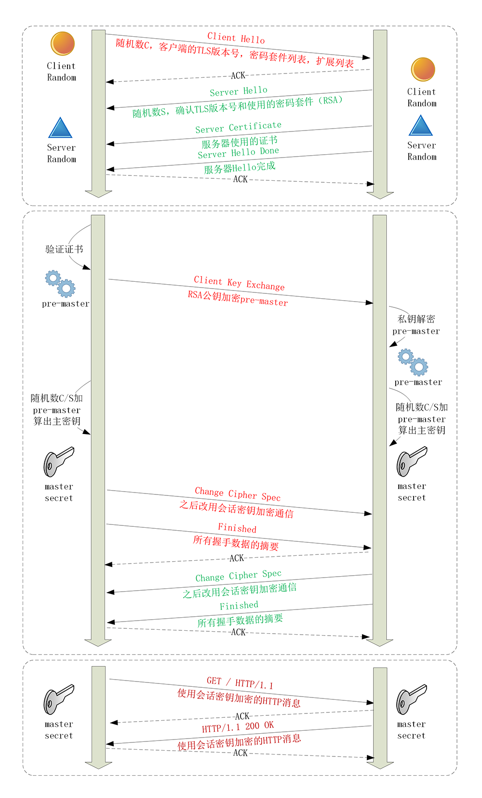
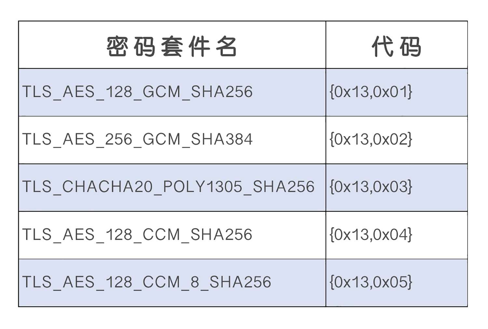
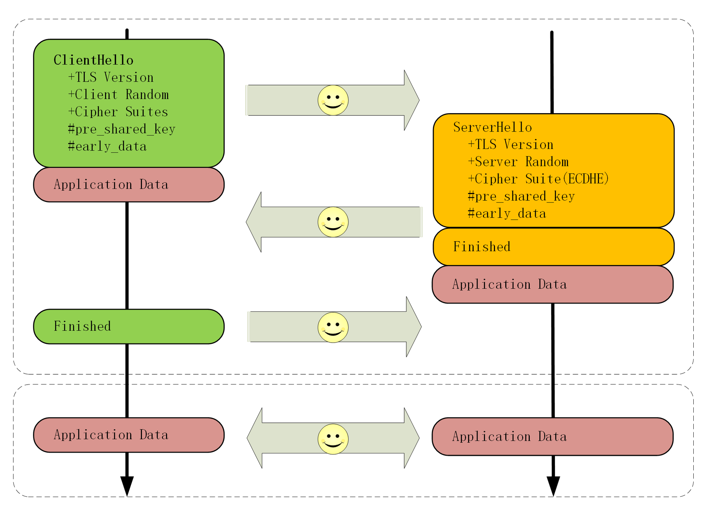

# 1. HTTPS是什么？SSLTLS又是什么？

## 1.1 为什么要有HTTPS？

由于HTTP天生“明文”的特点，整个传输过程完全透明，任何人都能够在链路中截获、修改或者伪造请求/响应报文，数据不具有可信性。

“代理服务”。它作为HTTP通信的中间人，在数据上下行的时候可以添加或删除部分头字段，也可以使用黑白名单过滤body里的关键字，甚至直接发送虚假的请求、响应，而浏览器和源服务器都没有办法判断报文的真伪。

对于安全性要求不那么高的新闻、视频、搜索等网站来说，由于互联网上的恶意用户、恶意代理越来越多，也很容易遭到“流量劫持”的攻击，在页面里强行嵌入广告，或者分流用户，导致各种利益损失。

## 1.2 什么是安全？

既然HTTP“不安全”，那什么样的通信过程才是安全的呢？

**通常认为，如果通信过程具备了四个特性，就可以认为是“安全”的，这四个特性是：机密性、完整性，身份认证和不可否认。**

**机密性（Secrecy/Confidentiality）** 是指对数据的“保密”，只能由可信的人访问，对其他人是不可见的“秘密”，简单来说就是不能让不相关的人看到不该看的东西。

**完整性（Integrity，也叫一致性）** 是指数据在传输过程中没有被窜改，不多也不少，“完完整整”地保持着原状。

机密性虽然可以让数据成为“秘密”，但不能防止黑客对数据的修改，黑客可以替换数据，调整数据的顺序，或者增加、删除部分数据，破坏通信过程。

**身份认证（Authentication）** 是指确认对方的真实身份，也就是“证明你真的是你”，保证消息只能发送给可信的人。

如果通信时另一方是假冒的网站，那么数据再保密也没有用，黑客完全可以使用冒充的身份“套”出各种信息，加密和没加密一样。

**不可否认（Non-repudiation/Undeniable）**，也叫不可抵赖，意思是不能否认已经发生过的行为，不能“说话不算数”“耍赖皮”。

## 1.3 什么是HTTPS？

HTTPS其实是一个“非常简单”的协议，RFC文档很小，只有短短的7页，里面规定了新的协议名“https”，默认端口号443，至于其他的什么请求-应答模式、报文结构、请求方法、URI、头字段、连接管理等等都完全沿用HTTP，没有任何新的东西。

除了协议名“http”和端口号80这两点不同，HTTPS协议在语法、语义上和HTTP完全一样，优缺点也“照单全收”（当然要除去“明文”和“不安全”）。

在用HTTPS访问实验环境时Chrome会有不安全提示，必须点击“高级-继续前往”才能顺利显示页面。而且如果用Wireshark抓包，也会发现与HTTP不一样，不再是简单可见的明文，多了“Client Hello”“Server Hello”等新的数据包。

这就是HTTPS与HTTP最大的区别，它能够鉴别危险的网站，并且尽最大可能保证你的上网安全，防御黑客对信息的窃听、窜改或者“钓鱼”、伪造。

秘密就在于HTTPS名字里的“S”，它把HTTP下层的传输协议由TCP/IP换成了SSL/TLS，由 **“HTTP over TCP/IP”** 变成了 **“HTTP over 
SSL/TLS”** ，让HTTP运行在了安全的SSL/TLS协议上，收发报文不再使用Socket API，而是调用专门的安全接口。


HTTPS本身并没有什么“惊世骇俗”的本事，全是靠着后面的SSL/TLS“撑腰”。只要学会了SSL/TLS，HTTPS自然就“手到擒来”。

## 1.4 SSL/TLS

SSL即安全套接层（Secure Sockets Layer），在OSI模型中处于第5层（会话层），由网景公司于1994年发明，有v2和v3两个版本，而v1因为有严重的缺陷从未公开过。

SSL发展到v3时已经证明了它自身是一个非常好的安全通信协议，于是互联网工程组IETF在1999年把它改名为TLS（传输层安全，Transport Layer Security），正式标准化，版本号从1.0重新算起，所以TLS1.0实际上就是SSLv3.1。

到今天TLS已经发展出了三个版本，分别是2006年的1.1、2008年的1.2和去年（2018）的1.3，每个新版本都紧跟密码学的发展和互联网的现状，持续强化安全和性能，已经成为了信息安全领域中的权威标准。

目前应用的最广泛的TLS是1.2，而之前的协议（TLS1.1/1.0、SSLv3/v2）都已经被认为是不安全的，各大浏览器即将在2020年左右停止支持，所以接下来的讲解都针对的是TLS1.2。

TLS由记录协议、握手协议、警告协议、变更密码规范协议、扩展协议等几个子协议组成，综合使用了对称加密、非对称加密、身份认证等许多密码学前沿技术。

浏览器和服务器在使用TLS建立连接时需要选择一组恰当的加密算法来实现安全通信，这些算法的组合被称为 **“密码套件”** （cipher suite，也叫加密套件）。



使用的TLS是1.2，客户端和服务器都支持非常多的密码套件，而最后协商选定的是“ECDHE-RSA-AES256-GCM-SHA384”。

TLS的密码套件命名非常规范，格式很固定。基本的形式是“密钥交换算法+签名算法+对称加密算法+摘要算法”

“握手时使用ECDHE算法进行密钥交换，用RSA签名和身份认证，握手后的通信使用AES对称算法，密钥长度256位，分组模式是GCM，摘要算法SHA384用于消息认证和产生随机数。”

## 1.5 OpenSSL

说到TLS，就不能不谈到OpenSSL，它是一个著名的开源密码学程序库和工具包，几乎支持所有公开的加密算法和协议，已经成为了事实上的标准，许多应用软件都会使用它作为底层库来实现TLS功能，包括常用的Web服务器Apache、Nginx等。

OpenSSL是从另一个开源库SSLeay发展出来的，曾经考虑命名为“OpenTLS”，但当时（1998年）TLS还未正式确立，而SSL早已广为人知，所以最终使用了“OpenSSL”的名字。

OpenSSL目前有三个主要的分支，1.0.2和1.1.0都将在2019年底不再维护，最新的长期支持版本是1.1.1。

由于OpenSSL是开源的，所以它还有一些代码分支，比如Google的BoringSSL、OpenBSD的LibreSSL，这些分支在OpenSSL的基础上删除了一些老旧代码，也增加了一些新特性，虽然背后有“大金主”，但离取代OpenSSL还差得很远。

## 1.6 小结

+ 因为HTTP是明文传输，所以不安全，容易被黑客窃听或窜改；
+ 通信安全必须同时具备机密性、完整性，身份认证和不可否认这四个特性；
+ HTTPS的语法、语义仍然是HTTP，但把下层的协议由TCP/IP换成了SSL/TLS；
+ SSL/TLS是信息安全领域中的权威标准，采用多种先进的加密技术保证通信安全；
+ OpenSSL是著名的开源密码学工具包，是SSL/TLS的具体实现。

# 2. 对称加密与非对称加密

实现机密性最常用的手段是“加密”（encrypt），就是把消息用某种方式转换成谁也看不懂的乱码，只有掌握特殊“钥匙”的人才能再转换出原始文本。

这里的“钥匙”就叫做 **“密钥”（key）** ，加密前的消息叫 **“明文”（plain text/clear text）** ，加密后的乱码叫 **“密文”（cipher 
text）**，使用密钥还原明文的过程叫 **“解密”（decrypt）** ，是加密的反操作，加密解密的操作过程就是 **“加密算法”**。

所有的加密算法都是公开的，任何人都可以去分析研究，而算法使用的“密钥”则必须保密。

由于HTTPS、TLS都运行在计算机上，所以“密钥”就是一长串的数字，但约定俗成的度量单位是“位”（bit），而不是“字节”（byte）。比如，说密钥长度是128，就是16字节的二进制串，密钥长度1024，就是128字节的二进制串。

按照密钥的使用方式，加密可以分为两大类：**对称加密和非对称加密**。

## 2.1 对称加密

“对称加密”很好理解，就是指加密和解密时使用的密钥都是同一个，是“对称”的。只要保证了密钥的安全，那整个通信过程就可以说具有了机密性。


TLS里有非常多的对称加密算法可供选择，比如RC4、DES、3DES、AES、ChaCha20等，但前三种算法都被认为是不安全的，通常都禁止使用，目前常用的只有AES和ChaCha20。

AES的意思是“高级加密标准”（Advanced Encryption Standard），密钥长度可以是128、192或256。它是DES算法的替代者，安全强度很高，性能也很好，而且有的硬件还会做特殊优化，所以非常流行，是应用最广泛的对称加密算法。

ChaCha20是Google设计的另一种加密算法，密钥长度固定为256位，纯软件运行性能要超过AES，曾经在移动客户端上比较流行，但ARMv8之后也加入了AES硬件优化，所以现在不再具有明显的优势，但仍然算得上是一个不错算法。

## 2.2 加密分组模式

对称算法还有一个 **“分组模式”** 的概念，它可以让算法用固定长度的密钥加密任意长度的明文，把小秘密（即密钥）转化为大秘密（即密文）。

最早有ECB、CBC、CFB、OFB等几种分组模式，但都陆续被发现有安全漏洞，所以现在基本都不怎么用了。最新的分组模式被称为AEAD（Authenticated Encryption with Associated Data），在加密的同时增加了认证的功能，常用的是GCM、CCM和Poly1305。

把上面这些组合起来，就可以得到TLS密码套件中定义的对称加密算法。

比如，AES128-GCM，意思是密钥长度为128位的AES算法，使用的分组模式是GCM；ChaCha20-Poly1305的意思是ChaCha20算法，使用的分组模式是Poly1305。

## 2.3 非对称加密

对称加密看上去好像完美地实现了机密性，但其中有一个很大的问题：如何把密钥安全地传递给对方，术语叫 **“密钥交换”**。

因为在对称加密算法中只要持有密钥就可以解密。如果你和网站约定的密钥在传递途中被黑客窃取，那他就可以在之后随意解密收发的数据，通信过程也就没有机密性可言了。

所以，就出现了非对称加密（也叫公钥加密算法）。

它有两个密钥，一个叫 **“公钥”（public key）**，一个叫 **“私钥”（private key）** 。两个密钥是不同的，“不对称”，公钥可以公开给任何人使用，而私钥必须严格保密。

公钥和私钥有个特别的 **“单向”性** ，虽然都可以用来加密解密，但公钥加密后只能用私钥解密，反过来，私钥加密后也只能用公钥解密。

非对称加密可以解决“密钥交换”的问题。网站秘密保管私钥，在网上任意分发公钥，你想要登录网站只要用公钥加密就行了，密文只能由私钥持有者才能解密。而黑客因为没有私钥，所以就无法破解密文。


非对称加密算法的设计要比对称算法难得多，在TLS里只有很少的几种，比如DH、DSA、RSA、ECC等。

RSA可能是其中最著名的一个，几乎可以说是非对称加密的代名词，它的安全性基于 **“整数分解”** 的数学难题，使用两个超大素数的乘积作为生成密钥的材料，想要从公钥推算出私钥是非常困难的。

10年前RSA密钥的推荐长度是1024，但随着计算机运算能力的提高，现在1024已经不安全，普遍认为至少要2048位。

ECC（Elliptic Curve Cryptography）是非对称加密里的“后起之秀”，它基于 **“椭圆曲线离散对数”** 的数学难题，使用特定的曲线方程和基点生成公钥和私钥，子算法ECDHE用于密钥交换，ECDSA用于数字签名。

目前比较常用的两个曲线是P-256（secp256r1，在OpenSSL称为prime256v1）和x25519。P-256是NIST（美国国家标准技术研究所）和NSA（美国国家安全局）推荐使用的曲线，而x25519被认为是最安全、最快速的曲线。

ECC名字里的“椭圆”经常会引起误解，其实它的曲线并不是椭圆形，只是因为方程很类似计算椭圆周长的公式，实际的形状更像抛物线，比如下面的图就展示了两个简单的椭圆曲线。



两个简单的椭圆曲线：y^2=x^3+7，y^2=x^3-x

比起RSA，ECC在安全强度和性能上都有明显的优势。160位的ECC相当于1024位的RSA，而224位的ECC则相当于2048位的RSA。因为密钥短，所以相应的计算量、消耗的内存和带宽也就少，加密解密的性能就上去了，对于现在的移动互联网非常有吸引力。

## 2.4 混合加密

虽然非对称加密没有“密钥交换”的问题，但因为它们都是基于复杂的数学难题，运算速度很慢，即使是ECC也要比AES差上好几个数量级。如果仅用非对称加密，虽然保证了安全，但通信速度有如乌龟、蜗牛，实用性就变成了零。

```
aes_128_cbc enc/dec 1000 times : 0.97ms, 13.11MB/s

rsa_1024 enc/dec 1000 times : 138.59ms, 93.80KB/s
rsa_1024/aes ratio = 143.17

rsa_2048 enc/dec 1000 times : 840.35ms, 15.47KB/s
rsa_2048/aes ratio = 868.13
```

RSA的运算速度是非常慢的，2048位的加解密大约是15KB/S（微秒或毫秒级），而AES128则是13MB/S（纳秒级），差了几百倍。

那么，是不是能够把对称加密和非对称加密结合起来呢，两者互相取长补短，即能高效地加密解密，又能安全地密钥交换。

这就是现在TLS里使用的 **混合加密** 方式，其实说穿了也很简单：

在通信刚开始的时候使用非对称算法，比如RSA、ECDHE，首先解决密钥交换的问题。

然后用随机数产生对称算法使用的 **“会话密钥”（session key）** ，再用公钥加密。因为会话密钥很短，通常只有16字节或32字节，所以慢一点也无所谓。

对方拿到密文后用私钥解密，取出会话密钥。这样，双方就实现了对称密钥的安全交换，后续就不再使用非对称加密，全都使用对称加密。


这样混合加密就解决了对称加密算法的密钥交换问题，而且安全和性能兼顾，完美地实现了机密性。

## 2.5 小结

+ 加密算法的核心思想是“把一个小秘密（密钥）转化为一个大秘密（密文消息）”，守住了小秘密，也就守住了大秘密；
+ 对称加密只使用一个密钥，运算速度快，密钥必须保密，无法做到安全的密钥交换，常用的有AES和ChaCha20；
+ 非对称加密使用两个密钥：公钥和私钥，公钥可以任意分发而私钥保密，解决了密钥交换问题但速度慢，常用的有RSA和ECC；
+ 把对称加密和非对称加密结合起来就得到了“又好又快”的混合加密，也就是TLS里使用的加密方式。

# 3. 数字签名与证书

黑客虽然拿不到会话密钥，无法破解密文，但可以通过窃听收集到足够多的密文，再尝试着修改、重组后发给网站。因为没有完整性保证，服务器只能“照单全收”，然后他就可以通过服务器的响应获取进一步的线索，最终就会破解出明文。

另外，黑客也可以伪造身份发布公钥。如果你拿到了假的公钥，混合加密就完全失效了。你以为自己是在和“某宝”通信，实际上网线的另一端却是黑客，银行卡号、密码等敏感信息就在“安全”的通信过程中被窃取了。

所以，在机密性的基础上还必须加上完整性、身份认证等特性，才能实现真正的安全。

## 3.1 摘要算法

实现完整性的手段主要是 **摘要算法（Digest Algorithm）** ，也就是常说的散列函数、哈希函数（Hash Function）。

可以把摘要算法近似地理解成一种特殊的压缩算法，它能够把任意长度的数据“压缩”成固定长度、而且独一无二的“摘要”字符串，就好像是给这段数据生成了一个数字“指纹”。

换一个角度，也可以把摘要算法理解成特殊的“单向”加密算法，它只有算法，没有密钥，加密后的数据无法解密，不能从摘要逆推出原文。

摘要算法实际上是把数据从一个“大空间”映射到了“小空间”，所以就存在“冲突”（collision，也叫碰撞）的可能性，就如同现实中的指纹一样，可能会有两份不同的原文对应相同的摘要。好的摘要算法必须能够“抵抗冲突”，让这种可能性尽量地小。

因为摘要算法对输入具有“单向性”和“雪崩效应”，输入的微小不同会导致输出的剧烈变化，所以也被TLS用来生成伪随机数（PRF，pseudo random function）。

用过MD5（Message-Digest 5）、SHA-1（Secure Hash Algorithm 1），它们就是最常用的两个摘要算法，能够生成16字节和20字节长度的数字摘要。但这两个算法的安全强度比较低，不够安全，在TLS里已经被禁止使用了。

目前TLS推荐使用的是SHA-1的后继者：SHA-2。

SHA-2实际上是一系列摘要算法的统称，总共有6种，常用的有SHA224、SHA256、SHA384，分别能够生成28字节、32字节、48字节的摘要。

## 3.2 完整性

摘要算法保证了“数字摘要”和原文是完全等价的。所以，我们只要在原文后附上它的摘要，就能够保证数据的完整性。

真正的完整性必须要建立在机密性之上，在混合加密系统里用会话密钥加密消息和摘要，这样黑客无法得知明文，也就没有办法动手脚了。

这有个术语，叫哈希消息认证码（HMAC）。

.png)

## 3.3 数字签名

加密算法结合摘要算法，我们的通信过程可以说是比较安全了。但这里还有漏洞，就是通信的两个端点（endpoint）。

就像一开始所说的，黑客可以伪装成网站来窃取信息。而反过来，他也可以伪装成你，向网站发送支付、转账等消息，网站没有办法确认你的身份，钱可能就这么被偷走了。

数字签名的原理其实很简单，就是把公钥私钥的用法反过来，之前是公钥加密、私钥解密，现在是私钥加密、公钥解密。

但又因为非对称加密效率太低，所以私钥只加密原文的摘要，这样运算量就小的多，而且得到的数字签名也很小，方便保管和传输。

签名和公钥一样完全公开，任何人都可以获取。但这个签名只有用私钥对应的公钥才能解开，拿到摘要后，再比对原文验证完整性，就可以像签署文件一样证明消息确实是你发的。


刚才的这两个行为也有专用术语，叫做 **“签名”** 和 **“验签”** 。

只要你和网站互相交换公钥，就可以用“签名”和“验签”来确认消息的真实性，因为私钥保密，黑客不能伪造签名，就能够保证通信双方的身份。

## 3.4 数字证书和CA

公钥的信任”问题。因为谁都可以发布公钥，我们还缺少防止黑客伪造公钥的手段，也就是说，怎么来判断这个公钥就是你或者某宝的公钥呢？

我们可以用类似密钥交换的方法来解决公钥认证问题，用别的私钥来给公钥签名，显然，这又会陷入“无穷递归”。

但这次实在是“没招”了，要终结这个“死循环”，就必须引入“外力”，找一个公认的可信第三方，让它作为“信任的起点，递归的终点”，构建起公钥的信任链。

这个“第三方”就是我们常说的 **CA（Certificate Authority，证书认证机构）** 。它就像网络世界里的公安局、教育部、公证中心，具有极高的可信度，由它来给各个公钥签名，用自身的信誉来保证公钥无法伪造，是可信的。

CA对公钥的签名认证也是有格式的，不是简单地把公钥绑定在持有者身份上就完事了，还要包含序列号、用途、颁发者、有效时间等等，把这些打成一个包再签名，完整地证明公钥关联的各种信息，形成 **“数字证书”（Certificate）**。

知名的CA全世界就那么几家，比如DigiCert、VeriSign、Entrust、Let’s Encrypt等，它们签发的证书分DV、OV、EV三种，区别在于可信程度。

DV是最低的，只是域名级别的可信，背后是谁不知道。EV是最高的，经过了法律和审计的严格核查，可以证明网站拥有者的身份（在浏览器地址栏会显示出公司的名字，例如Apple、GitHub的网站）。

不过，CA怎么证明自己呢？

这还是信任链的问题。小一点的CA可以让大CA签名认证，但链条的最后，也就是Root CA，就只能自己证明自己了，这个就叫 **“自签名证书”（Self-Signed Certificate）** 或者 **“根证书”（Root Certificate）**。 你必须相信，否则整个证书信任链就走不下去了。


有了这个证书体系，操作系统和浏览器都内置了各大CA的根证书，上网的时候只要服务器发过来它的证书，就可以验证证书里的签名，顺着证书链（Certificate Chain）一层层地验证，直到找到根证书，就能够确定证书是可信的，从而里面的公钥也是可信的。

## 3.5 证书体系的弱点

证书体系（PKI，Public Key Infrastructure）虽然是目前整个网络世界的安全基础设施，但绝对的安全是不存在的，它也有弱点，还是关键的“信任”二字。

如果CA失误或者被欺骗，签发了错误的证书，虽然证书是真的，可它代表的网站却是假的。

还有一种更危险的情况，CA被黑客攻陷，或者CA有恶意，因为它（即根证书）是信任的源头，整个信任链里的所有证书也就都不可信了。

这两种事情并不是“耸人听闻”，都曾经实际出现过。所以，需要再给证书体系打上一些补丁。

针对第一种，开发出了CRL（证书吊销列表，Certificate revocation list）和OCSP（在线证书状态协议，Online Certificate Status Protocol），及时废止有问题的证书。

对于第二种，因为涉及的证书太多，就只能操作系统或者浏览器从根上“下狠手”了，撤销对CA的信任，列入“黑名单”，这样它颁发的所有证书就都会被认为是不安全的。

## 3.6 小结

+ 摘要算法用来实现完整性，能够为数据生成独一无二的“指纹”，常用的算法是SHA-2；
+ 数字签名是私钥对摘要的加密，可以由公钥解密后验证，实现身份认证和不可否认；
+ 公钥的分发需要使用数字证书，必须由CA的信任链来验证，否则就是不可信的；
+ 作为信任链的源头CA有时也会不可信，解决办法有CRL、OCSP，还有终止信任。

# 4. TLS1.2连接过程解析

## 4.1 HTTPS建立连接

当你在浏览器地址栏里键入“https”开头的URI，再按下回车，会发生什么呢？

浏览器首先要从URI里提取出协议名和域名。因为协议名是“https”，所以浏览器就知道了端口号是默认的443，它再用DNS解析域名，得到目标的IP地址，然后就可以使用三次握手与网站建立TCP连接了。

在HTTP协议里，建立连接后，浏览器会立即发送请求报文。但现在是HTTPS协议，它需要再用另外一个“握手”过程，在TCP上建立安全连接，之后才是收发HTTP报文。

## 4.2 TLS协议的组成

TLS包含几个子协议，你也可以理解为它是由几个不同职责的模块组成，比较常用的有记录协议、警报协议、握手协议、变更密码规范协议等。

**记录协议（Record Protocol）** 规定了TLS收发数据的基本单位：记录（record）。它有点像是TCP里的segment，所有的其他子协议都需要通过记录协议发出。但多个记录数据可以在一个 TCP 包里一次性发出，也并不需要像TCP那样返回ACK。

**警报协议（Alert Protocol）** 的职责是向对方发出警报信息，有点像是HTTP协议里的状态码。比如，protocol_version就是不支持旧版本，bad_certificate 就是证书有问题，收到警报后另一方可以选择继续，也可以立即终止连接。

**握手协议（Handshake Protocol）** 是TLS里最复杂的子协议，要比TCP的SYN/ACK复杂的多，浏览器和服务器会在握手过程中协商TLS版本号、随机数、密码套件等信息，然后交换证书和密钥参数，最终双方协商得到会话密钥，用于后续的混合加密系统。

**变更密码规范协议（Change Cipher Spec Protocol）** ，就是一个“通知”，告诉对方，后续的数据都将使用加密保护。那么反过来，在它之前，数据都是明文的。

下面的这张图简要地描述了TLS的握手过程，其中每一个“框”都是一个记录，多个记录组合成一个TCP包发送。所以，最多经过两次消息往返（4个消息）就可以完成握手，然后就可以在安全的通信环境里发送HTTP报文，实现HTTPS协议。


## 4.3 抓包的准备工作

TLS握手的前几个消息都是明文的，能够在Wireshark里直接看。但只要出现了“Change Cipher Spec”，后面的数据就都是密文了，看到的也就会是乱码，不知道究竟是什么东西。

## 4.4 ECDHE握手过程


在TCP建立连接之后，浏览器会首先发一个“Client Hello”消息，也就是跟服务器“打招呼”。里面有客户端的版本号、支持的密码套件，还有一个 **随机数（Client Random）** ，用于后续生成会话密钥。

```
Handshake Protocol: Client Hello
    Version: TLS 1.2 (0x0303)
    Random: 1cbf803321fd2623408dfe…
    Cipher Suites (17 suites)
        Cipher Suite: TLS_ECDHE_RSA_WITH_AES_128_GCM_SHA256 (0xc02f)
        Cipher Suite: TLS_ECDHE_RSA_WITH_AES_256_GCM_SHA384 (0xc030)
```

服务器收到“Client Hello”后，会返回一个“Server Hello”消息。把版本号对一下，也给出一个 **随机数（Server Random）** ，然后从客户端的列表里选一个作为本次通信使用的密码套件，在这里它选择了“TLS_ECDHE_RSA_WITH_AES_256_GCM_SHA384”。

```
Handshake Protocol: Server Hello
    Version: TLS 1.2 (0x0303)
    Random: 0e6320f21bae50842e96…
    Cipher Suite: TLS_ECDHE_RSA_WITH_AES_256_GCM_SHA384 (0xc030)
```

然后，服务器为了证明自己的身份，就把证书也发给了客户端（Server Certificate）。

接下来是一个关键的操作，因为服务器选择了ECDHE算法，所以它会在证书后发送 **“Server Key Exchange”** 消息，里面是 **椭圆曲线的公钥（Server Params）** ，用来实现密钥交换算法，再加上自己的私钥签名认证。

```
Handshake Protocol: Server Key Exchange
    EC Diffie-Hellman Server Params
        Curve Type: named_curve (0x03)
        Named Curve: x25519 (0x001d)
        Pubkey: 3b39deaf00217894e...
        Signature Algorithm: rsa_pkcs1_sha512 (0x0601)
        Signature: 37141adac38ea4...
```

之后是“Server Hello Done”消息，服务器说：“我的信息就是这些，打招呼完毕。”

这样第一个消息往返就结束了（两个TCP包），结果是客户端和服务器通过明文共享了三个信息：**Client Random、Server Random和Server Params** 。

客户端这时也拿到了服务器的证书，那这个证书是不是真实有效的呢？

开始走证书链逐级验证，确认证书的真实性，再用证书公钥验证签名，就确认了服务器的身份：“刚才跟我打招呼的不是骗子，可以接着往下走。”

然后，客户端按照密码套件的要求，也生成一个 **椭圆曲线的公钥（Client Params）** ，用 **“Client Key Exchange”** 消息发给服务器。

```
Handshake Protocol: Client Key Exchange
    EC Diffie-Hellman Client Params
        Pubkey: 8c674d0e08dc27b5eaa…
```

现在客户端和服务器手里都拿到了密钥交换算法的两个参数（Client Params、Server Params），就用ECDHE算法一阵算，算出了一个新的东西，叫 **“Pre-Master”** ，其实也是一个随机数。

算法可以保证即使黑客截获了之前的参数，也是绝对算不出这个随机数的。

现在客户端和服务器手里有了三个随机数：**Client Random、Server Random和Pre-Master**。用这三个作为原始材料，就可以生成用于加密会 话的主密钥，叫 **“Master Secret”** 。而黑客因为拿不到“Pre-Master”，所以也就得不到主密钥。

为什么非得这么麻烦，非要三个随机数呢？

这就必须说TLS的设计者考虑得非常周到了，他们不信任客户端或服务器伪随机数的可靠性，为了保证真正的“完全随机”“不可预测”，把三个不可靠的随机数混合起来，那么“随机”的程度就非常高了，足够让黑客难以猜测。

“Master Secret”究竟是怎么算出来的吧，贴一下RFC里的公式：

```
master_secret = PRF(pre_master_secret, "master secret",
                    ClientHello.random + ServerHello.random)
```

这里的“PRF”就是伪随机数函数，它基于密码套件里的最后一个参数，比如这次的SHA384，通过摘要算法来再一次强化“Master Secret”的随机性。

主密钥有48字节，但它也不是最终用于通信的会话密钥，还会再用PRF扩展出更多的密钥，比如客户端发送用的会话密钥（client_write_key）、服务器发送用的会话密钥（server_write_key）等等，避免只用一个密钥带来的安全隐患。

有了主密钥和派生的会话密钥，握手就快结束了。客户端发一个 **“Change Cipher Spec”** ，然后再发一个 **“Finished”** 消息，把之前所有发送的数据做个摘要，再加密一下，让服务器做个验证。

服务器也是同样的操作，发 **“Change Cipher Spec”** 和 **“Finished”** 消息，双方都验证加密解密OK，握手正式结束，后面就收发被加密的HTTP请求和响应了。

## 4.5 RSA握手过程

刚才说的其实是如今主流的TLS握手过程，这与传统的握手有两点不同。

第一个，使用ECDHE实现密钥交换，而不是RSA，所以会在服务器端发出“Server Key Exchange”消息。

第二个，因为使用了ECDHE，客户端可以不用等到服务器发回“Finished”确认握手完毕，立即就发出HTTP报文，省去了一个消息往返的时间浪费。这个叫“TLS False Start”，意思就是“抢跑”，和“TCP Fast Open”有点像，都是不等连接完全建立就提前发应用数据，提高传输的效率。



大体的流程没有变，只是 **“Pre-Master”** 不再需要用算法生成，而是客户端直接生成随机数，然后用服务器的公钥加密，通过 **“Client Key 
Exchange”** 消息发给服务器。服务器再用私钥解密，这样双方也实现了共享三个随机数，就可以生成主密钥。

## 4.6 双向认证

不过上面说的是“单向认证”握手过程，只认证了服务器的身份，而没有认证客户端的身份。这是因为通常单向认证通过后已经建立了安全通信，用账号、密码等简单的手段就能够确认用户的真实身份。

但为了防止账号、密码被盗，有的时候（比如网上银行）还会使用U盾给用户颁发客户端证书，实现“双向认证”，这样会更加安全。

双向认证的流程也没有太多变化，只是在“Server Hello Done”之后，“Client Key Exchange”之前，客户端要发送“Client Certificate”消息，服务器收到后也把证书链走一遍，验证客户端的身份。

## 4.7 小结

+ HTTPS协议会先与服务器执行TCP握手，然后执行TLS握手，才能建立安全连接；
+ 握手的目标是安全地交换对称密钥，需要三个随机数，第三个随机数“Pre-Master”必须加密传输，绝对不能让黑客破解；
+ “Hello”消息交换随机数，“Key Exchange”消息交换“Pre-Master”；
+ “Change Cipher Spec”之前传输的都是明文，之后都是对称密钥加密的密文。

# 5. TLS1.3特性解析

TLS1.3 的三个主要改进目标：**兼容、安全与性能** 。

## 5.1 最大化兼容性

该怎么区分1.2和1.3呢？

这要用到一个新的 **扩展协议（Extension Protocol）** ，它有点“补充条款”的意思，通过在记录末尾添加一系列的“扩展字段”来增加新的功能，老版本的TLS不认识它可以直接忽略，这就实现了“后向兼容”。

在记录头的Version字段被兼容性“固定”的情况下，只要是TLS1.3协议，握手的“Hello”消息后面就必须有 **“supported_versions”** 扩展，它标记了TLS的版本号，使用它就能区分新旧协议。

## 5.2 强化安全

TLS1.2在十来年的应用中获得了许多宝贵的经验，陆续发现了很多的漏洞和加密算法的弱点，所以TLS1.3就在协议里修补了这些不安全因素。

**比如：**

+ 伪随机数函数由PRF升级为HKDF（HMAC-based Extract-and-Expand Key Derivation Function）；
+ 明确禁止在记录协议里使用压缩；
+ 废除了RC4、DES对称加密算法；
+ 废除了ECB、CBC等传统分组模式；
+ 废除了MD5、SHA1、SHA-224摘要算法；
+ 废除了RSA、DH密钥交换算法和许多命名曲线。

TLS1.3里只保留了AES、ChaCha20对称加密算法，分组模式只能用AEAD的GCM、CCM和Poly1305，摘要算法只能用SHA256、SHA384，密钥交换算法只有ECDHE和DHE，椭圆曲线也被“砍”到只剩P-256和x25519等5种。

算法精简后带来了一个意料之中的好处：原来众多的算法、参数组合导致密码套件非常复杂，难以选择，而现在的TLS1.3里只有5个套件，无论是客户端还是服务器都不会再犯“选择困难症”了。



**废除RSA和DH密钥交换算法的原因：**

浏览器默认会使用ECDHE而不是RSA做密钥交换，这是因为它不具有 **“前向安全”（Forward Secrecy）** 。

假设有这么一个很有耐心的黑客，一直在长期收集混合加密系统收发的所有报文。如果加密系统使用服务器证书里的RSA做密钥交换，一旦私钥泄露或被破解（使用社会工程学或者巨型计算机），那么黑客就能够使用私钥解密出之前所有报文的“Pre-Master”，再算出会话密钥，破解所有密文。

这就是所谓的“今日截获，明日破解”。

而ECDHE算法在每次握手时都会生成一对临时的公钥和私钥，每次通信的密钥对都是不同的，也就是“一次一密”，即使黑客花大力气破解了这一次的会话密钥，也只是这次通信被攻击，之前的历史消息不会受到影响，仍然是安全的。

所以现在主流的服务器和浏览器在握手阶段都已经不再使用RSA，改用ECDHE，而TLS1.3在协议里明确废除RSA和DH则在标准层面保证了“前向安全”。

## 5.3 提升性能

HTTPS建立连接时除了要做TCP握手，还要做TLS握手，在1.2中会多花两个消息往返（2-RTT），可能导致几十毫秒甚至上百毫秒的延迟，在移动网络中延迟还会更严重。

TLS1.3压缩了以前的“Hello”协商过程，删除了“Key Exchange”消息，把握手时间减少到了“1-RTT”，效率提高了一倍。

具体的做法还是利用了扩展。客户端在“Client Hello”消息里直接用“supported_groups”带上支持的曲线，比如P-256、x25519，用“key_share”带上曲线对应的客户端公钥参数，用“signature_algorithms”带上签名算法。

服务器收到后在这些扩展里选定一个曲线和参数，再用“key_share”扩展返回服务器这边的公钥参数，就实现了双方的密钥交换，后面的流程就和1.2基本一样了。


除了标准的“1-RTT”握手，TLS1.3还引入了“0-RTT”握手，用“pre_shared_key”和“early_data”扩展，在TCP连接后立即就建立安全连接发送加密消息。

## 5.4 握手分析

目前Nginx等Web服务器都能够很好地支持TLS1.3，但要求底层的OpenSSL必须是1.1.1。

## 5.5 小结

+ 为了兼容1.1、1.2等“老”协议，TLS1.3会“伪装”成TLS1.2，新特性在“扩展”里实现；
+ 1.1、1.2在实践中发现了很多安全隐患，所以TLS1.3大幅度删减了加密算法，只保留了ECDHE、AES、ChaCha20、SHA-2等极少数算法，强化了安全；
+ TLS1.3也简化了握手过程，完全握手只需要一个消息往返，提升了性能。

# 6. HTTPS的优化

HTTPS连接大致上可以划分为两个部分，第一个是 **建立连接时的非对称加密握手** ，第二个是 **握手后的对称加密报文传输** 。

由于目前流行的AES、ChaCha20性能都很好，还有硬件优化，报文传输的性能损耗可以说是非常地小，小到几乎可以忽略不计了。所以，通常所说的“HTTPS连接慢”指的就是刚开始建立连接的那段时间。

在TCP建连之后，正式数据传输之前，HTTPS比HTTP增加了一个TLS握手的步骤，这个步骤最长可以花费两个消息往返，也就是2-RTT。而且在握手消息的网络耗时之外，还会有其他的一些“隐形”消耗，比如：

+ 产生用于密钥交换的临时公私钥对（ECDHE）；
+ 验证证书时访问CA获取CRL或者OCSP；
+ 非对称加密解密处理“Pre-Master”。

在最差的情况下，也就是不做任何的优化措施，HTTPS建立连接可能会比HTTP慢上几百毫秒甚至几秒，这其中既有网络耗时，也有计算耗时，就会让人产生“打开一个HTTPS网站好慢啊”的感觉。

不过刚才说的情况早就是“过去时”了，现在已经有了很多行之有效的HTTPS优化手段，运用得好可以把连接的额外耗时降低到几十毫秒甚至是“零”。


## 6.1 硬件优化

HTTPS连接是计算密集型，而不是I/O密集型。所以，如果你花大价钱去买网卡、带宽、SSD存储就是“南辕北辙”了，起不到优化的效果。

首先，你可以选择 **更快的CPU** ，最好还内建AES优化，这样即可以加速握手，也可以加速传输。

其次，你可以选择 **“SSL加速卡”** ，加解密时调用它的API，让专门的硬件来做非对称加解密，分担CPU的计算压力。

不过“SSL加速卡”也有一些缺点，比如升级慢、支持算法有限，不能灵活定制解决方案等。

所以，就出现了第三种硬件加速方式：**“SSL加速服务器”** ，用专门的服务器集群来彻底“卸载”TLS握手时的加密解密计算，性能自然要比单纯的“加速卡”要强大的多。

## 6.2 软件优化

硬件优化方式中除了CPU，其他的通常可不是靠简单花钱就能买到的，还要有一些开发适配工作，有一定的实施难度。比如，“加速服务器”中关键的一点是通信必须是“异步”的，不能阻塞应用服务器，否则加速就没有意义了。

所以，软件优化的方式相对来说更可行一些，性价比高，能够“少花钱，多办事”。

软件方面的优化还可以再分成两部分：一个是 **软件升级** ，一个是 **协议优化** 。

软件升级实施起来比较简单，就是把现在正在使用的软件尽量升级到最新版本，比如把Linux内核由2.x升级到4.x，把Nginx由1.6升级到1.16，把OpenSSL由1.0.1升级到1.1.0/1.1.1。

由于这些软件在更新版本的时候都会做性能优化、修复错误，只要运维能够主动配合，这种软件优化是最容易做的，也是最容易达成优化效果的。

但对于很多大中型公司来说，硬件升级或软件升级都是个棘手的问题，有成千上万台各种型号的机器遍布各个机房，逐一升级不仅需要大量人手，而且有较高的风险，可能会影响正常的线上服务。

所以，在软硬件升级都不可行的情况下，我们最常用的优化方式就是在现有的环境下挖掘协议自身的潜力。

## 6.3 协议优化

如果有可能，应当尽量采用TLS1.3，它大幅度简化了握手的过程，完全握手只要1-RTT，而且更加安全。

如果暂时不能升级到1.3，只能用1.2，那么握手时使用的密钥交换协议应当尽量选用椭圆曲线的ECDHE算法。它不仅运算速度快，安全性高，还支持“False Start”，能够把握手的消息往返由2-RTT减少到1-RTT，达到与TLS1.3类似的效果。

另外，椭圆曲线也要选择高性能的曲线，最好是x25519，次优选择是P-256。对称加密算法方面，也可以选用“AES_128_GCM”，它能比“AES_256_GCM”略快一点点。

在Nginx里可以用“ssl_ciphers”“ssl_ecdh_curve”等指令配置服务器使用的密码套件和椭圆曲线，把优先使用的放在前面，例如：

```
ssl_ciphers   TLS13-AES-256-GCM-SHA384:TLS13-CHACHA20-POLY1305-SHA256:EECDH+CHACHA20；
ssl_ecdh_curve              X25519:P-256;
```

## 6.4 证书优化

除了密钥交换，握手过程中的证书验证也是一个比较耗时的操作，服务器需要把自己的证书链全发给客户端，然后客户端接收后再逐一验证。

这里就有两个优化点，一个是 **证书传输**，一个是 **证书验证**。

服务器的证书可以选择椭圆曲线（ECDSA）证书而不是RSA证书，因为224位的ECC相当于2048位的RSA，所以椭圆曲线证书的“个头”要比RSA小很多，即能够节约带宽也能减少客户端的运算量，可谓“一举两得”。

客户端的证书验证其实是个很复杂的操作，除了要公钥解密验证多个证书签名外，因为证书还有可能会被撤销失效，客户端有时还会再去访问CA，下载CRL或者OCSP数据，这又会产生DNS查询、建立连接、收发数据等一系列网络通信，增加好几个RTT。

CRL（Certificate revocation list，证书吊销列表）由CA定期发布，里面是所有被撤销信任的证书序号，查询这个列表就可以知道证书是否有效。

但CRL因为是“定期”发布，就有“时间窗口”的安全隐患，而且随着吊销证书的增多，列表会越来越大，一个CRL经常会上MB。想象一下，每次需要预先下载几M的“无用数据”才能连接网站，实用性实在是太低了。

所以，现在CRL基本上不用了，取而代之的是OCSP（在线证书状态协议，Online Certificate Status Protocol），向CA发送查询请求，让CA返回证书的有效状态。

但OCSP也要多出一次网络请求的消耗，而且还依赖于CA服务器，如果CA服务器很忙，那响应延迟也是等不起的。

于是又出来了一个“补丁”，叫“OCSP Stapling”（OCSP装订），它可以让服务器预先访问CA获取OCSP响应，然后在握手时随着证书一起发给客户端，免去了客户端连接CA服务器查询的时间。

## 6.5 会话复用

HTTPS建立连接的过程：先是TCP三次握手，然后是TLS一次握手。这后一次握手的重点是算出主密钥“Master Secret”，而主密钥每次连接都要重新计算，未免有点太浪费了，如果能够把“辛辛苦苦”算出来的主密钥缓存一下“重用”，不就可以免去了握手和计算的成本了吗？

这种做法就叫 **“会话复用”（TLS session resumption）** ，和HTTP Cache一样，也是提高HTTPS性能的“大杀器”，被浏览器和服务器广泛应用。

会话复用分两种，第一种叫 **“Session ID**” ，就是客户端和服务器首次连接后各自保存一个会话的ID号，内存里存储主密钥和其他相关的信息。当客户端再次连接时发一个ID 过来，服务器就在内存里找，找到就直接用主密钥恢复会话状态，跳过证书验证和密钥交换，只用一个消息往返就可以建立安全通信。

## 6.6 会话票证

“Session ID”是最早出现的会话复用技术，也是应用最广的，但它也有缺点，服务器必须保存每一个客户端的会话数据，对于拥有百万、千万级别用户的网站来说存储量就成了大问题，加重了服务器的负担。

于是，又出现了第二种 **“Session Ticket”** 方案。

它有点类似HTTP的Cookie，存储的责任由服务器转移到了客户端，服务器加密会话信息，用“New Session Ticket”消息发给客户端，让客户端保存。

重连的时候，客户端使用扩展 **“session_ticket”** 发送“Ticket”而不是“Session ID”，服务器解密后验证有效期，就可以恢复会话，开始加密通信。

不过“Session Ticket”方案需要使用一个固定的密钥文件（ticket_key）来加密Ticket，为了防止密钥被破解，保证“前向安全”，密钥文件需要定期轮换，比如设置为一小时或者一天。

## 6.7 预共享密钥

“False Start”“Session ID”“Session Ticket”等方式只能实现1-RTT，而TLS1.3更进一步实现了 **“0-RTT”** ，原理和“Session 
Ticket”差不多，但在发送Ticket的同时会带上应用数据（Early Data），免去了1.2里的服务器确认步骤，这种方式叫 **“Pre-shared Key”** ，简称为“PSK”。



但“PSK”也不是完美的，它为了追求效率而牺牲了一点安全性，容易受到“重放攻击”（Replay attack）的威胁。黑客可以截获“PSK”的数据，像复读机那样反复向服务器发送。

解决的办法是只允许安全的GET/HEAD方法，在消息里加入时间戳、“nonce”验证，或者“一次性票证”限制重放。

## 6.8 小结

+ 可以有多种硬件和软件手段减少网络耗时和计算耗时，让HTTPS变得和HTTP一样快，最可行的是软件优化；
+ 应当尽量使用ECDHE椭圆曲线密码套件，节约带宽和计算量，还能实现“False Start”；
+ 服务器端应当开启“OCSP Stapling”功能，避免客户端访问CA去验证证书；
+ 会话复用的效果类似Cache，前提是客户端必须之前成功建立连接，后面就可以用“Session ID”“Session Ticket”等凭据跳过密钥交换、证书验证等步骤，直接开始加密通信。
