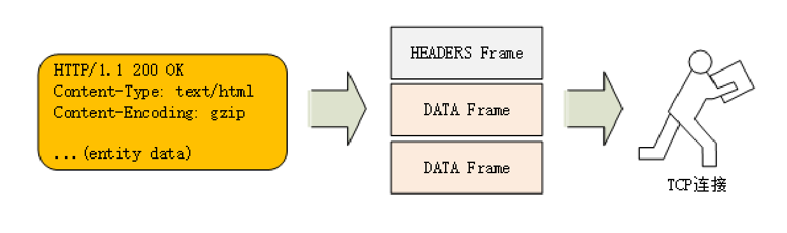
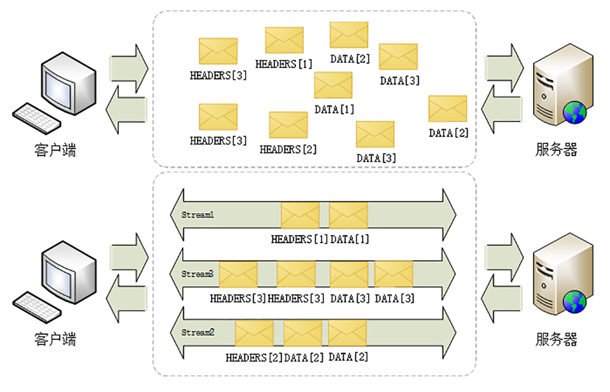
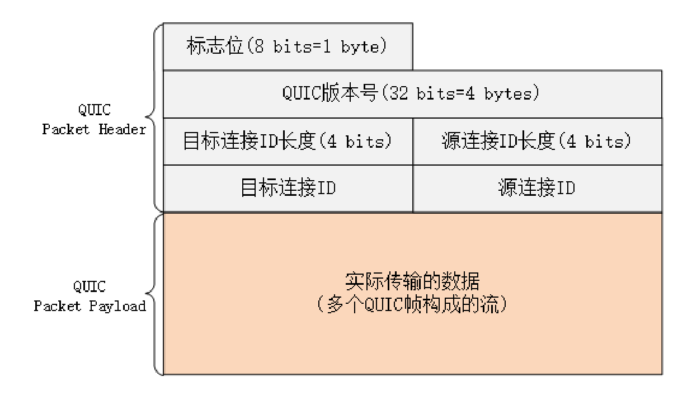
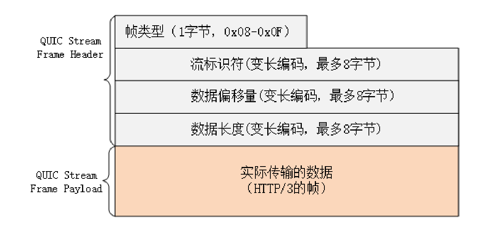

# 1. HTTP2特性

## 1.1 兼容HTTP/1

由于HTTPS已经在安全方面做的非常好了，所以HTTP/2的唯一目标就是改进性能。

但它不仅背负着众多的期待，同时还背负着HTTP/1庞大的历史包袱，所以协议的修改必须小心谨慎，兼容性是首要考虑的目标，否则就会破坏互联网上无数现有的资产，这方面TLS已经有了先例（为了兼容TLS1.2不得不进行“伪装”）。

因为必须要保持功能上的兼容，所以HTTP/2把HTTP分解成了 **“语义”** 和 **“语法”** 两个部分，“语义”层不做改动，与HTTP/1完全一致（即RFC7231）。比如请求方法、URI 、状态码、头字段等概念都保留不变，这样就消除了再学习的成本，基于HTTP的上层应用也不需要做任何修改，可以无缝转换到HTTP/2。

特别要说的是，与HTTPS不同，HTTP/2没有在URI里引入新的协议名，仍然用“http”表示明文协议，用“https”表示加密协议。

这是一个非常了不起的决定，可以让浏览器或者服务器去自动升级或降级协议，免去了选择的麻烦，让用户在上网的时候都意识不到协议的切换，实现平滑过渡。

在“语义”保持稳定之后，HTTP/2在“语法”层做了“天翻地覆”的改造，完全变更了HTTP报文的传输格式。

## 1.2 头部压缩

HTTP/1里可以用头字段“Content-Encoding”指定Body的编码方式，比如用gzip压缩来节约带宽，但报文的另一个组成部分——Header却被无视了，没有针对它的优化手段。

由于报文Header一般会携带“User Agent”“Cookie”“Accept”“Server”等许多固定的头字段，多达几百字节甚至上千字节，但Body却经常只有几十字节（比如GET请求、204/301/304响应），成了不折不扣的“大头儿子”。更要命的是，成千上万的请求响应报文里有很多字段值都是重复的，非常浪费，“长尾效应”导致大量带宽消耗在了这些冗余度极高的数据上。

所以，HTTP/2把 **“头部压缩”** 作为性能改进的一个重点，优化的方式你也肯定能想到，还是“压缩”。


不过HTTP/2并没有使用传统的压缩算法，而是开发了专门的 **“HPACK”** 算法，在客户端和服务器两端建立“字典”，用索引号表示重复的字符串，还釆用哈夫曼编码来压缩整数和字符串，可以达到50%~90%的高压缩率。

## 1.3 二进制格式

HTTP/1里纯文本形式的报文的优点是“一目了然”，用最简单的工具就可以开发调试，非常方便。

但HTTP/2在这方面没有“妥协”，决定改变延续了十多年的现状，不再使用肉眼可见的ASCII码，而是向下层的TCP/IP协议“靠拢”，全面采用二进制格式。

这样虽然对人不友好，但却大大方便了计算机的解析。原来使用纯文本的时候容易出现多义性，比如大小写、空白字符、回车换行、多字少字等等，程序在处理时必须用复杂的状态机，效率低，还麻烦。

而二进制里只有“0”和“1”，可以严格规定字段大小、顺序、标志位等格式，“对就是对，错就是错”，解析起来没有歧义，实现简单，而且体积小、速度快，做到“内部提效”。

以二进制格式为基础，HTTP/2就开始了“大刀阔斧”的改革。

它把TCP协议的部分特性挪到了应用层，把原来的“Header+Body”的消息“打散”为数个小片的二进制“帧”（Frame），用“HEADERS”帧存放头数据、“DATA”帧存放实体数据。

这种做法有点像是“Chunked”分块编码的方式，也是“化整为零”的思路，但HTTP/2数据分帧后“Header+Body”的报文结构就完全消失了，协议看到的只是一个个的“碎片”。



## 1.4 虚拟的“流”

消息的“碎片”到达目的地后应该怎么组装起来呢？

HTTP/2为此定义了一个 **“流”（Stream）** 的概念，它是 **二进制帧的双向传输序列**，同一个消息往返的帧会分配一个唯一的流ID
。你可以想象把它成是一个虚拟的“数据流”，在里面流动的是一串有先后顺序的数据帧，这些数据帧按照次序组装起来就是HTTP/1里的请求报文和响应报文。

因为“流”是虚拟的，实际上并不存在，所以HTTP/2就可以在一个TCP连接上用 **“流”** 同时发送多个“碎片化”的消息，这就是常说的 **“多路复用”（ Multiplexing）** ——多个往返通信都复用一个连接来处理。

在“流”的层面上看，消息是一些有序的“帧”序列，而在“连接”的层面上看，消息却是乱序收发的“帧”。多个请求/响应之间没有了顺序关系，不需要排队等待，也就不会再出现“队头阻塞”问题，降低了延迟，大幅度提高了连接的利用率。


为了更好地利用连接，加大吞吐量，HTTP/2还添加了一些控制帧来管理虚拟的“流”，实现了优先级和流量控制，这些特性也和TCP协议非常相似。

HTTP/2还在一定程度上改变了传统的“请求-应答”工作模式，服务器不再是完全被动地响应请求，也可以新建“流”主动向客户端发送消息。比如，在浏览器刚请求HTML的时候就提前把可能会用到的JS、CSS 文件发给客户端，减少等待的延迟，这被称为 **“服务器推送”（Server Push，也叫Cache Push）**。

## 1.5 强化安全

出于兼容的考虑，HTTP/2延续了HTTP/1的“明文”特点，可以像以前一样使用明文传输数据，不强制使用加密通信，不过格式还是二进制，只是不需要解密。

但由于HTTPS已经是大势所趋，而且主流的浏览器Chrome、Firefox等都公开宣布只支持加密的HTTP/2，所以“事实上”的HTTP/2是加密的。也就是说，互联网上通常所能见到的HTTP/2都是使用“https”协议名，跑在TLS上面。

为了区分“加密”和“明文”这两个不同的版本，HTTP/2协议定义了两个字符串标识符：“h2”表示加密的HTTP/2，“h2c”表示明文的HTTP/2，多出的那个字母“c”的意思是“clear text”。

在HTTP/2标准制定的时候（2015年）已经发现了很多SSL/TLS的弱点，而新的TLS1.3还未发布，所以加密版本的HTTP/2在安全方面做了强化，要求下层的通信协议必须是TLS1.2以上，还要支持前向安全和SNI，并且把几百个弱密码套件列入了“黑名单”，比如DES、RC4、CBC、SHA-1都不能在HTTP/2里使用，相当于底层用的是“TLS1.25”。

## 1.6 协议栈


虽然HTTP/2的底层实现很复杂，但它的“语义”还是简单的HTTP/1，之前学习的知识不会过时，仍然能够用得上。

## 1.7 小结

+ HTTP协议取消了小版本号，所以HTTP/2的正式名字不是2.0；
+ HTTP/2在“语义”上兼容HTTP/1，保留了请求方法、URI等传统概念；
+ HTTP/2使用“HPACK”算法压缩头部信息，消除冗余数据节约带宽；
+ HTTP/2的消息不再是“Header+Body”的形式，而是分散为多个二进制“帧”；
+ HTTP/2使用虚拟的“流”传输消息，解决了困扰多年的“队头阻塞”问题，同时实现了“多路复用”，提高连接的利用率；
+ HTTP/2也增强了安全性，要求至少是TLS1.2，而且禁用了很多不安全的密码套件。

# 2. HTTP2内核剖析

## 2.1 连接前言

由于HTTP/2“事实上”是基于TLS，所以在正式收发数据之前，会有TCP握手和TLS握手。

TLS握手成功之后，客户端必须要发送一个 **“连接前言”（connection preface）** ，用来确认建立HTTP/2连接。

这个“连接前言”是标准的HTTP/1请求报文，使用纯文本的ASCII码格式，请求方法是特别注册的一个关键字“PRI”，全文只有24个字节：

```
PRI * HTTP/2.0\r\n\r\nSM\r\n\r\n
```

在Wireshark里，HTTP/2的“连接前言”被称为“Magic”，意思就是“不可知的魔法”。

只要服务器收到这个“有魔力的字符串”，就知道客户端在TLS上想要的是HTTP/2协议，而不是其他别的协议，后面就会都使用HTTP/2的数据格式。


## 2.2 头部压缩

确立了连接之后，HTTP/2就开始准备请求报文。

因为语义上它与HTTP/1兼容，所以报文还是由“Header+Body”构成的，但在请求发送前，必须要用 **“HPACK”** 算法来压缩头部数据。

“HPACK”算法是专门为压缩HTTP头部定制的算法，与gzip、zlib等压缩算法不同，它是一个“有状态”的算法，需要客户端和服务器各自维护一份“索引表”，也可以说是“字典”（这有点类似brotli），压缩和解压缩就是查表和更新表的操作。

为了方便管理和压缩，HTTP/2废除了原有的起始行概念，把起始行里面的请求方法、URI、状态码等统一转换成了头字段的形式，并且给这些“不是头字段的头字段”起了个特别的名字—— **“伪头字段”（pseudo-header fields）** 。而起始行里的版本号和错误原因短语因为没什么大用，顺便也给废除了。

为了与“真头字段”区分开来，这些“伪头字段”会在名字前加一个“:”，比如“:authority” “:method” “:status”，分别表示的是域名、请求方法和状态码。

现在HTTP报文头就简单了，全都是“Key-Value”形式的字段，于是HTTP/2就为一些最常用的头字段定义了一个只读的“静态表”（Static Table）。

下面的这个表格列出了“静态表”的一部分，这样只要查表就可以知道字段名和对应的值，比如数字“2”代表“GET”，数字“8”代表状态码200。


但如果表里只有Key没有Value，或者是自定义字段根本找不到该怎么办呢？

这就要用到 **“动态表”（Dynamic Table）** ，它添加在静态表后面，结构相同，但会在编码解码的时候随时更新。

比如说，第一次发送请求时的“user-agent”字段长是一百多个字节，用哈夫曼压缩编码发送之后，客户端和服务器都更新自己的动态表，添加一个新的索引号“65”。那么下一次发送的时候就不用再重复发那么多字节了，只要用一个字节发送编号就好。

你可以想象得出来，随着在HTTP/2连接上发送的报文越来越多，两边的“字典”也会越来越丰富，最终每次的头部字段都会变成一两个字节的代码，原来上千字节的头用几十个字节就可以表示了，压缩效果比gzip要好得多。

## 2.3 二进制帧

头部数据压缩之后，HTTP/2就要把报文拆成二进制的帧准备发送。

HTTP/2的帧结构有点类似TCP的段或者TLS里的记录，但报头很小，只有9字节，非常地节省（可以对比一下TCP头，它最少是20个字节）。

二进制的格式也保证了不会有歧义，而且使用位运算能够非常简单高效地解析。


帧开头是3个字节的长度（但不包括头的9个字节），默认上限是2^14，最大是2^24，也就是说HTTP/2的帧通常不超过16K，最大是16M。

长度后面的一个字节是 **帧类型** ，大致可以分成 **数据帧** 和 **控制帧** 两类，HEADERS帧和DATA帧属于数据帧，存放的是HTTP报文，而SETTINGS、PING、PRIORITY等则是用来管理流的控制帧。

HTTP/2总共定义了10种类型的帧，但一个字节可以表示最多256种，所以也允许在标准之外定义其他类型实现功能扩展。这就有点像TLS里扩展协议的意思了，比如Google的gRPC就利用了这个特点，定义了几种自用的新帧类型。

第5个字节是非常重要的 **帧标志** 信息，可以保存8个标志位，携带简单的控制信息。常用的标志位有 **END_HEADERS** 表示头数据结束，相当于HTTP/1里头后的空行（“\r\n”）， **END_STREAM** 表示单方向数据发送结束（即EOS ，End of Stream），相当于HTTP/1里Chunked分块结束标志（“0\r\n\r\n”）。

报文头里最后4个字节是 **流标识符**，也就是帧所属的“流”，接收方使用它就可以从乱序的帧里识别出具有相同流ID的帧序列，按顺序组装起来就实现了虚拟的“流”。

流标识符虽然有4个字节，但最高位被保留不用，所以只有31位可以使用，也就是说，流标识符的上限是2^31，大约是21亿。

## 2.4 流与多路复用

**流是二进制帧的双向传输序列**

要搞明白流，关键是要理解帧头里的流ID。

在HTTP/2连接上，虽然帧是乱序收发的，但只要它们都拥有相同的流ID，就都属于一个流，而且在这个流里帧不是无序的，而是有着严格的先后顺序。

在概念上，一个HTTP/2的流就等同于一个HTTP/1里的“请求-应答”。在HTTP/1里一个“请求-响应”报文来回是一次HTTP通信，在HTTP/2里一个流也承载了相同的功能。

可以对照着TCP来理解。TCP运行在IP之上，其实从MAC层、IP层的角度来看，TCP的“连接”概念也是“虚拟”的。但从功能上看，无论是HTTP/2的流，还是TCP的连接，都是实际存在的，所以你以后大可不必再纠结于流的“虚拟”性，把它当做是一个真实存在的实体来理解就好。

**HTTP/2的流有哪些特点呢？**

+ 流是可并发的，一个HTTP/2连接上可以同时发出多个流传输数据，也就是并发多请求，实现“多路复用”；
+ 客户端和服务器都可以创建流，双方互不干扰；
+ 流是双向的，一个流里面客户端和服务器都可以发送或接收数据帧，也就是一个“请求-应答”来回；
+ 流之间没有固定关系，彼此独立，但流内部的帧是有严格顺序的；
+ 流可以设置优先级，让服务器优先处理，比如先传HTML/CSS，后传图片，优化用户体验；
+ 流ID不能重用，只能顺序递增，客户端发起的ID是奇数，服务器端发起的ID是偶数；
+ 在流上发送“RST_STREAM”帧可以随时终止流，取消接收或发送；
+ 第0号流比较特殊，不能关闭，也不能发送数据帧，只能发送控制帧，用于流量控制。



从这些特性中，我们还可以推理出一些深层次的知识点。

HTTP/2在一个连接上使用多个流收发数据，那么它本身默认就会是长连接，所以永远不需要“Connection”头字段（keepalive或close）。

下载大文件的时候想取消接收，在HTTP/1里只能断开TCP连接重新“三次握手”，成本很高，而在HTTP/2里就可以简单地发送一个“RST_STREAM”中断流，而长连接会继续保持。

因为客户端和服务器两端都可以创建流，而流ID有奇数偶数和上限的区分，所以大多数的流ID都会是奇数，而且客户端在一个连接里最多只能发出2^30，也就是10亿个请求。

ID用完了该怎么办呢？这个时候可以再发一个控制帧“GOAWAY”，真正关闭TCP连接。

## 2.5 流状态转换

流很重要，也很复杂。为了更好地描述运行机制，HTTP/2借鉴了TCP，根据帧的标志位实现流状态转换。当然，这些状态也是虚拟的，只是为了辅助理解。

HTTP/2的流也有一个状态转换图，虽然比TCP要简单一点，但也不那么好懂，所以今天我只画了一个简化的图，对应到一个标准的HTTP“请求-应答”。


最开始的时候流都是 **“空闲”（idle）** 状态，也就是“不存在”，可以理解成是待分配的“号段资源”。

当客户端发送HEADERS帧后，有了流ID，流就进入了 **“打开”** 状态，两端都可以收发数据，然后客户端发送一个带“END_STREAM”标志位的帧，流就进入了 **“半关闭”** 状态。

这个“半关闭”状态很重要，意味着客户端的请求数据已经发送完了，需要接受响应数据，而服务器端也知道请求数据接收完毕，之后就要内部处理，再发送响应数据。

响应数据发完了之后，也要带上“END_STREAM”标志位，表示数据发送完毕，这样流两端就都进入了 **“关闭”** 状态，流就结束了。

流ID不能重用，所以流的生命周期就是HTTP/1里的一次完整的“请求-应答”，流关闭就是一次通信结束。

下一次再发请求就要开一个新流（而不是新连接），流ID不断增加，直到到达上限，发送“GOAWAY”帧开一个新的TCP连接，流ID就又可以重头计数。

这是发生在虚拟的“流”上，而不是实际的TCP连接，又因为流可以并发，所以HTTP/2就可以实现无阻塞的多路复用。

## 2.6 小结

+ HTTP/2必须先发送一个“连接前言”字符串，然后才能建立正式连接；
+ HTTP/2废除了起始行，统一使用头字段，在两端维护字段“Key-Value”的索引表，使用“HPACK”算法压缩头部；
+ HTTP/2把报文切分为多种类型的二进制帧，报头里最重要的字段是流标识符，标记帧属于哪个流；
+ 流是HTTP/2虚拟的概念，是帧的双向传输序列，相当于HTTP/1里的一次“请求-应答”；
+ 在一个HTTP/2连接上可以并发多个流，也就是多个“请求-响应”报文，这就是“多路复用”。

# 3. HTTP3展望

## 3.1 HTTP/2的“队头阻塞”

HTTP/2虽然使用“帧”“流”“多路复用”，没有了“队头阻塞”，但这些手段都是在应用层里，而在下层，也就是TCP协议里，还是会发生“队头阻塞”。

在HTTP/2把多个“请求-响应”分解成流，交给TCP后，TCP会再拆成更小的包依次发送（其实在TCP里应该叫segment，也就是“段”）。

在网络良好的情况下，包可以很快送达目的地。但如果网络质量比较差，像手机上网的时候，就有可能会丢包。而TCP为了保证可靠传输，有个特别的“丢包重传”机制，丢失的包必须要等待重新传输确认，其他的包即使已经收到了，也只能放在缓冲区里，上层的应用拿不出来，只能“干着急”。

简单的例子：

客户端用TCP发送了三个包，但服务器所在的操作系统只收到了后两个包，第一个包丢了。那么内核里的TCP协议栈就只能把已经收到的包暂存起来，“停下”等着客户端重传那个丢失的包，这样就又出现了“队头阻塞”。

由于这种“队头阻塞”是TCP协议固有的，所以HTTP/2即使设计出再多的“花样”也无法解决。

Google在推SPDY的时候就已经意识到了这个问题，于是就又发明了一个新的“QUIC”协议，让HTTP跑在QUIC上而不是TCP上。

而这个“HTTP over QUIC”就是HTTP协议的下一个大版本， **HTTP/3** 。它在HTTP/2的基础上又实现了质的飞跃，真正“完美”地解决了“队头阻塞”问题。


## 3.2 QUIC协议

可以看到HTTP/3有一个关键的改变，那就是它把下层的TCP“抽掉”了，换成了UDP。因为UDP是无序的，包之间没有依赖关系，所以就从根本上解决了“队头阻塞”。

UDP是一个简单、不可靠的传输协议，只是对IP协议的一层很薄的包装，和TCP相比，它实际应用的较少。

不过正是因为它简单，不需要建连和断连，通信成本低，也就非常灵活、高效，“可塑性”很强。

所以，QUIC就选定了UDP，在它之上把TCP的那一套连接管理、拥塞窗口、流量控制等“搬”了过来，“去其糟粕，取其精华”，打造出了一个全新的可靠传输协议，可以认为是“新时代的TCP”。

QUIC最早是由Google发明的，被称为gQUIC。而当前正在由IETF标准化的QUIC被称为iQUIC。两者的差异非常大，甚至比当年的SPDY与HTTP/2的差异还要大。

gQUIC混合了UDP、TLS、HTTP，是一个应用层的协议。而IETF则对gQUIC做了“清理”，把应用部分分离出来，形成了HTTP/3，原来的UDP部分“下放”到了传输层，所以iQUIC有时候也叫“QUIC-transport”。

QUIC都是指iQUIC，要记住，它与早期的gQUIC不同，是一个传输层的协议，和TCP是平级的。

## 3.3 QUIC的特点

QUIC基于UDP，而UDP是“无连接”的，根本就不需要“握手”和“挥手”，所以天生就要比TCP快。

就像TCP在IP的基础上实现了可靠传输一样，QUIC也基于UDP实现了可靠传输，保证数据一定能够抵达目的地。它还引入了类似HTTP/2的“流”和“多路复用”，单个“流”是有序的，可能会因为丢包而阻塞，但其他“流”不会受到影响。

为了防止网络上的中间设备（Middle Box）识别协议的细节，QUIC全面采用加密通信，可以很好地抵御窜改和“协议僵化”（ossification）。

而且，因为TLS1.3已经在去年（2018）正式发布，所以QUIC就直接应用了TLS1.3，顺便也就获得了0-RTT、1-RTT连接的好处。

但QUIC并不是建立在TLS之上，而是内部“包含”了TLS。它使用自己的帧“接管”了TLS里的“记录”，握手消息、警报消息都不使用TLS记录，直接封装成QUIC的帧发送，省掉了一次开销。

## 3.4 QUIC内部细节

由于QUIC在协议栈里比较偏底层，所以我只简略介绍两个内部的关键知识点。

QUIC的基本数据传输单位是 **包（packet）** 和 **帧（frame）** ，一个包由多个帧组成，包面向的是“连接”，帧面向的是“流”。

QUIC使用不透明的 **“连接ID”** 来标记通信的两个端点，客户端和服务器可以自行选择一组ID来标记自己，这样就解除了TCP里连接对“IP地址+端口”（即常说的四元组）的强绑定，支持 **“连接迁移”（Connection Migration）**。



比如你下班回家，手机会自动由4G切换到WiFi。这时IP地址会发生变化，TCP就必须重新建立连接。而QUIC连接里的两端连接ID不会变，所以连接在“逻辑上”没有中断，它就可以在新的IP地址上继续使用之前的连接，消除重连的成本，实现连接的无缝迁移。

QUIC的帧里有多种类型，PING、ACK等帧用于管理连接，而STREAM帧专门用来实现流。

QUIC里的流与HTTP/2的流非常相似，也是帧的序列，你可以对比着来理解。但HTTP/2里的流都是双向的，而QUIC则分为双向流和单向流。



QUIC帧普遍采用变长编码，最少只要1个字节，最多有8个字节。流ID的最大可用位数是62，数量上比HTTP/2的2^31大大增加。

流ID还保留了最低两位用作标志，第1位标记流的发起者，0表示客户端，1表示服务器；第2位标记流的方向，0表示双向流，1表示单向流。

所以QUIC流ID的奇偶性质和HTTP/2刚好相反，客户端的ID是偶数，从0开始计数。

## 3.5 HTTP/3协议

因为QUIC本身就已经支持了加密、流和多路复用，所以HTTP/3的工作减轻了很多，把流控制都交给QUIC去做。调用的不再是TLS的安全接口，也不是Socket API，而是专门的QUIC函数。不过这个“QUIC函数”还没有形成标准，必须要绑定到某一个具体的实现库。

HTTP/3里仍然使用流来发送“请求-响应”，但它自身不需要像HTTP/2那样再去定义流，而是直接使用QUIC的流，相当于做了一个“概念映射”。

HTTP/3里的“双向流”可以完全对应到HTTP/2的流，而“单向流”在HTTP/3里用来实现控制和推送，近似地对应HTTP/2的0号流。

由于流管理被“下放”到了QUIC，所以HTTP/3里帧的结构也变简单了。

帧头只有两个字段：类型和长度，而且同样都采用变长编码，最小只需要两个字节。


HTTP/3里的帧仍然分成数据帧和控制帧两类，HEADERS帧和DATA帧传输数据，但其他一些帧因为在下层的QUIC里有了替代，所以在HTTP/3里就都消失了，比如RST_STREAM、WINDOW_UPDATE、PING等。

头部压缩算法在HTTP/3里升级成了“QPACK”，使用方式上也做了改变。虽然也分成静态表和动态表，但在流上发送HEADERS帧时不能更新字段，只能引用，索引表的更新需要在专门的单向流上发送指令来管理，解决了HPACK的“队头阻塞”问题。

另外，QPACK的字典也做了优化，静态表由之前的61个增加到了98个，而且序号从0开始，也就是说“:authority”的编号是0。

## 3.6 HTTP/3服务发现

HTTP/3没有指定默认的端口号，也就是说不一定非要在UDP的80或者443上提供HTTP/3服务。

那么，该怎么“发现”HTTP/3呢？

这就要用到HTTP/2里的“扩展帧”了。浏览器需要先用HTTP/2协议连接服务器，然后服务器可以在启动HTTP/2连接后发送一个“Alt-Svc”帧，包含一个“h3=host:port”的字符串，告诉浏览器在另一个端点上提供等价的HTTP/3服务。

浏览器收到“Alt-Svc”帧，会使用QUIC异步连接指定的端口，如果连接成功，就会断开HTTP/2连接，改用新的HTTP/3收发数据。

## 3.7 小结

+ HTTP/3基于QUIC协议，完全解决了“队头阻塞”问题，弱网环境下的表现会优于HTTP/2；
+ QUIC是一个新的传输层协议，建立在UDP之上，实现了可靠传输；
+ QUIC内含了TLS1.3，只能加密通信，支持0-RTT快速建连；
+ QUIC的连接使用“不透明”的连接ID，不绑定在“IP地址+端口”上，支持“连接迁移”；
+ QUIC的流与HTTP/2的流很相似，但分为双向流和单向流；
+ HTTP/3没有指定默认端口号，需要用HTTP/2的扩展帧“Alt-Svc”来发现。

# 4. HTTP2的优点和缺点

## 4.1 优点

**完全保持了与HTTP/1的兼容**，在语义上没有任何变化，之前在HTTP上的所有投入都不会浪费。

**基本”解决了HTTP/1的所有缺点**，安全与性能兼顾，可以认为是“更安全的HTTP、更快的HTTPS”。

在安全上，HTTP/2对HTTPS在各方面都做了强化。下层的TLS至少是1.2，而且只能使用前向安全的密码套件（即ECDHE），这同时也就默认实现了“TLS False Start”，支持1-RTT握手，所以不需要再加额外的配置就可以自动实现HTTPS加速。

**节约带宽的基本手段就是压缩**，在HTTP/1里只能压缩body，而HTTP/2则可以用HPACK算法压缩header，这对高流量的网站非常有价值，有数据表明能节省大概5%~10%的流量，这是实实在在的“真金白银”。

**HTTP/2的“多路复用”特性要求对一个域名（或者IP）只用一个TCP连接**，所有的数据都在这一个连接上传输，这样不仅节约了客户端、服务器和网络的资源，还可以把带宽跑满，让TCP充分“吃饱”。

在HTTP/1里的长连接，虽然是双向通信，但任意一个时间点实际上还是单向的：上行请求时下行空闲，下行响应时上行空闲，再加上“队头阻塞”，实际的带宽打了个“对折”还不止。

而在HTTP/2里，“多路复用”则让TCP开足了马力，“全速狂奔”，多个请求响应并发，每时每刻上下行方向上都有流在传输数据，没有空闲的时候，带宽的利用率能够接近100%。所以，HTTP/2只使用一个连接，就能抵得过HTTP/1里的五六个连接。

不过流也可能会有依赖关系，可能会存在等待导致的阻塞，这就是“延迟”，所以HTTP/2的其他特性就派上了用场。

**“优先级”** 可以让客户端告诉服务器，哪个文件更重要，更需要优先传输，服务器就可以调高流的优先级，合理地分配有限的带宽资源，让高优先级的HTML、图片更快地到达客户端，尽早加载显示。

**“服务器推送”** 也是降低延迟的有效手段，它不需要客户端预先请求，服务器直接就发给客户端，这就省去了客户端解析HTML再请求的时间。

## 4.2 缺点

HTTP/2在TCP级别还是存在 **“队头阻塞”** 的问题。所以，如果网络连接质量差，发生丢包，那么TCP会等待重传，传输速度就会降低。

在移动网络中 **发生IP地址切换的时候，下层的TCP必须重新建连** ，要再次“握手”，经历“慢启动”，而且之前连接里积累的HPACK字典也都消失了，必须重头开始计算，导致带宽浪费和时延。

HTTP/2对一个域名只开一个连接，所以一旦这个连接出问题，那么整个网站的体验也就变差了。

## 4.3 应用层协议协商（ALPN）

在URI里用的都是HTTPS协议名，没有版本标记，浏览器怎么知道服务器支持HTTP/2呢？为什么上来就能用HTTP/2，而不是用HTTP/1通信呢？

答案在TLS的扩展里，有一个叫 **“ALPN”（Application Layer Protocol Negotiation）** 的东西，用来与服务器就TLS上跑的应用协议进行“协商”。

客户端在发起“Client Hello”握手的时候，后面会带上一个“ALPN”扩展，里面按照优先顺序列出客户端支持的应用协议。

服务器看到ALPN扩展以后就可以从列表里选择一种应用协议，在“Server Hello”里也带上“ALPN”扩展，告诉客户端服务器决定使用的是哪一种。因为我们在Nginx配置里使用了HTTP/2协议，所以在这里它选择的就是“h2”。

这样在TLS握手结束后，客户端和服务器就通过“ALPN”完成了应用层的协议协商，后面就可以使用HTTP/2通信了。

## 4.4 小结

+ HTTP/2完全兼容HTTP/1，是“更安全的HTTP、更快的HTTPS”，头部压缩、多路复用等技术可以充分利用带宽，降低延迟，从而大幅度提高上网体验；
+ TCP协议存在“队头阻塞”，所以HTTP/2在弱网或者移动网络下的性能表现会不如HTTP/1；
+ 迁移到HTTP/2肯定会有性能提升，但高流量网站效果会更显著；
+ 如果已经升级到了HTTPS，那么再升级到HTTP/2会很简单；
+ TLS协议提供“ALPN”扩展，让客户端和服务器协商使用的应用层协议，“发现”HTTP/2服务。
