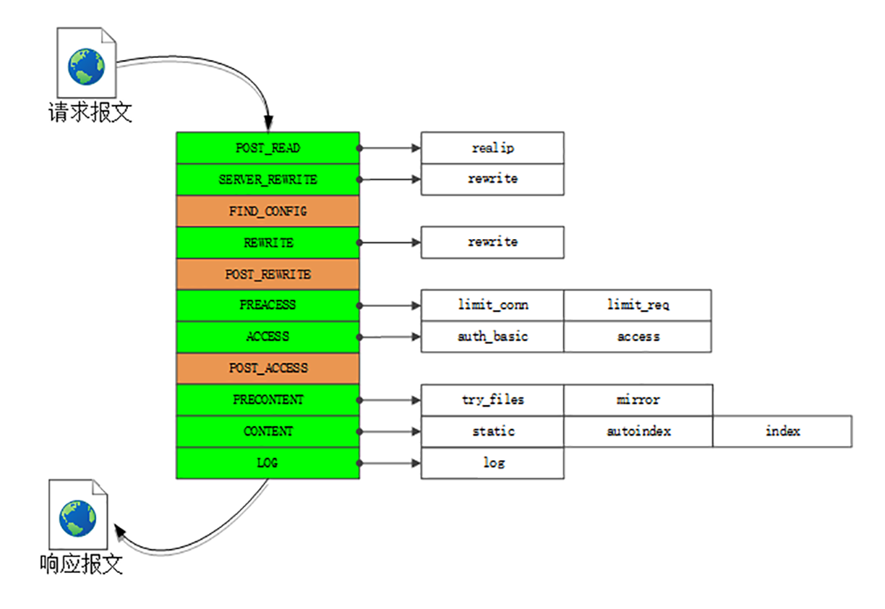

# 1. Nginx：高性能的Web服务器

**Nginx是个“轻量级”的Web服务器**

## 1.1 进程池

“轻量级”是相对于“重量级”而言的。“重量级”就是指服务器进程很“重”，占用很多资源，当处理HTTP请求时会消耗大量的CPU和内存，受到这些资源的限制很难提高性能。

而Nginx作为“轻量级”的服务器，它的CPU、内存占用都非常少，同样的资源配置下就能够为更多的用户提供服务，其奥秘在于它独特的工作模式。


在Nginx之前，Web服务器的工作模式大多是“Per-Process”或者“Per-Thread”，对每一个请求使用单独的进程或者线程处理。这就存在创建进程或线程的成本，还会有进程、线程“上下文切换”的额外开销。如果请求数量很多，CPU就会在多个进程、线程之间切换时“疲于奔命”，平白地浪费了计算时间。

Nginx则完全不同，“一反惯例”地没有使用多线程，而是使用了 **“进程池+单线程”** 的工作模式。

Nginx在启动的时候会预先创建好固定数量的worker进程，在之后的运行过程中不会再fork出新进程，这就是进程池，而且可以自动把进程“绑定”到独立的CPU上，这样就完全消除了进程创建和切换的成本，能够充分利用多核CPU的计算能力。

在进程池之上，还有一个“master”进程，专门用来管理进程池。它的作用有点像是supervisor（一个用Python编写的进程管理工具），用来监控进程，自动恢复发生异常的worker，保持进程池的稳定和服务能力。

不过master进程完全是Nginx自行用C语言实现的，这就摆脱了外部的依赖，简化了Nginx的部署和配置。

## 1.2 I/O多路复用

多线程也有一些缺点，除了刚才说到的“上下文切换”成本，还有编程模型复杂、数据竞争、同步等问题，写出正确、快速的多线程程序并不是一件容易的事情。

所以Nginx就选择了单线程的方式，带来的好处就是开发简单，没有互斥锁的成本，减少系统消耗。

**为什么单线程的Nginx，处理能力却能够超越其他多线程的服务器呢？**

“多路复用”这个词我们已经在之前的HTTP/2、HTTP/3里遇到过好几次，如果你理解了那里的“多路复用”，那么面对Nginx的epoll“多路复用”也就好办了。

Web服务器从根本上来说是“I/O密集型”而不是“CPU密集型”，处理能力的关键在于网络收发而不是CPU计算（这里暂时不考虑HTTPS的加解密），而网络I/O会因为各式各样的原因不得不等待，比如数据还没到达、对端没有响应、缓冲区满发不出去等等。

这种情形就有点像是HTTP里的“队头阻塞”。对于一般的单线程来说CPU就会“停下来”，造成浪费。而多线程的解决思路有点类似“并发连接”，虽然有的线程可能阻塞，但由于多个线程并行，总体上看阻塞的情况就不会太严重了。

Nginx里使用的epoll，就好像是HTTP/2里的“多路复用”技术，它把多个HTTP请求处理打散成碎片，都“复用”到一个单线程里，不按照先来后到的顺序处理，而是只当连接上真正可读、可写的时候才处理，如果可能发生阻塞就立刻切换出去，处理其他的请求。

通过这种方式，Nginx就完全消除了I/O阻塞，把CPU利用得“满满当当”，又因为网络收发并不会消耗太多CPU计算能力，也不需要切换进程、线程，所以整体的CPU负载是相当低的。

epoll还有一个特点，大量的连接管理工作都是在操作系统内核里做的，这就减轻了应用程序的负担，所以Nginx可以为每个连接只分配很小的内存维护状态，即使有几万、几十万的并发连接也只会消耗几百M内存，而其他的Web服务器这个时候早就“Memory not enough”了。

## 1.3 多阶段处理

有了“进程池”和“I/O多路复用”，Nginx是如何处理HTTP请求的呢？

Nginx在内部也采用的是“化整为零”的思路，把整个Web服务器分解成了多个“功能模块”，就好像是乐高积木，可以在配置文件里任意拼接搭建，从而实现了高度的灵活性和扩展性。

Nginx的HTTP处理有四大类模块：

+ handler模块：直接处理HTTP请求；
+ filter模块：不直接处理请求，而是加工过滤响应报文；
+ upstream模块：实现反向代理功能，转发请求到其他服务器；
+ balance模块：实现反向代理时的负载均衡算法。

因为upstream模块和balance模块实现的是代理功能，Nginx作为“中间人”，运行机制比较复杂，所以我今天只讲handler模块和filter模块。

“设计模式”中有一个非常有用的模式叫做“职责链”。它就好像是工厂里的流水线，原料从一头流入，线上有许多工人会进行各种加工处理，最后从另一头出来的就是完整的产品。

Nginx里的handler模块和filter模块就是按照“职责链”模式设计和组织的，HTTP请求报文就是“原材料”，各种模块就是工厂里的工人，走完模块构成的“流水线”，出来的就是处理完成的响应报文。

下面的这张图显示了Nginx的“流水线”，在Nginx里的术语叫“阶段式处理”（Phases），一共有11个阶段，每个阶段里又有许多各司其职的模块。



+ charset模块实现了字符集编码转换；
+ chunked模块实现了响应数据的分块传输；
+ range模块实现了范围请求，只返回数据的一部分；
+ rewrite模块实现了重定向和跳转，还可以使用内置变量自定义跳转的URI；
+ not_modified模块检查头字段“if-Modified-Since”和“If-None-Match”，处理条件请求；
+ realip模块处理“X-Real-IP”“X-Forwarded-For”等字段，获取客户端的真实IP地址；
+ ssl模块实现了SSL/TLS协议支持，读取磁盘上的证书和私钥，实现TLS握手和SNI、ALPN等扩展功能；
+ http_v2模块实现了完整的HTTP/2协议。

在这张图里，你还可以看到limit_conn、limit_req、access、log等其他模块，它们实现的是限流限速、访问控制、日志等功能，不在HTTP协议规定之内，但对于运行在现实世界的Web服务器却是必备的。

## 1.4 小结

+ Nginx是一个高性能的Web服务器，它非常的轻量级，消耗的CPU、内存很少；
+ Nginx采用“master/workers”进程池架构，不使用多线程，消除了进程、线程切换的成本；
+ Nginx基于epoll实现了“I/O多路复用”，不会阻塞，所以性能很高；
+ Nginx使用了“职责链”模式，多个模块分工合作，自由组合，以流水线的方式处理HTTP请求。

# 2. OpenResty：更灵活的Web服务器

Nginx的服务管理思路延续了当时的流行做法，使用磁盘上的静态配置文件，所以每次修改后必须重启才能生效。

这在业务频繁变动的时候是非常致命的（例如流行的微服务架构），特别是对于拥有成千上万台服务器的网站来说，仅仅增加或者删除一行配置就要分发、重启所有的机器，对运维是一个非常大的挑战，要耗费很多的时间和精力，成本很高，很不灵活，难以“随需应变”。

## 2.1 OpenResty是什么？

OpenResty诞生于2009年，到现在刚好满10周岁。它的创造者是当时就职于某宝的“神级”程序员章亦春，网名叫“agentzh”。

OpenResty并不是一个全新的Web服务器，而是基于Nginx，它利用了Nginx模块化、可扩展的特性，开发了一系列的增强模块，并把它们打包整合，形成了一个“一站式”的Web开发平台。

虽然OpenResty的核心是Nginx，但它又超越了Nginx，关键就在于其中的ngx_lua模块，把小巧灵活的Lua语言嵌入了Nginx，可以用脚本的方式操作Nginx内部的进程、多路复用、阶段式处理等各种构件。

脚本语言的好处你一定知道，它不需要编译，随写随执行，这就免去了C语言编写模块漫长的开发周期。而且OpenResty还把Lua自身的协程与Nginx的事件机制完美结合在一起，优雅地实现了许多其他语言所没有的“同步非阻塞”编程范式，能够轻松开发出高性能的Web应用。

目前OpenResty有两个分支，分别是开源、免费的“OpenResty”和闭源、商业产品的“OpenResty+”，运作方式有社区支持、OpenResty基金会、OpenResty.Inc公司，还有其他的一些外界赞助（例如Kong、CloudFlare），正在蓬勃发展。

## 2.2 动态的Lua

OpenResty里的一个关键模块是ngx_lua，它为Nginx引入了脚本语言Lua。

Lua是一个比较“小众”的语言，虽然历史比较悠久，但名气却没有PHP、Python、JavaScript大，这主要与它的自身定位有关。

Lua的设计目标是嵌入到其他应用程序里运行，为其他编程语言带来“脚本化”能力，所以它的“个头”比较小，功能集有限，不追求“大而全”，而是“小而美”，大多数时间都“隐匿”在其他应用程序的后面，是“无名英雄”。

OpenResty选择Lua作为“工作语言”也是基于同样的考虑。因为Nginx C开发实在是太麻烦了，限制了Nginx的真正实力。而Lua作为“最快的脚本语言”恰好可以成为Nginx的完美搭档，既可以简化开发，性能上又不会有太多的损耗。

作为脚本语言，Lua还有一个重要的 **“代码热加载”** 特性，不需要重启进程，就能够从磁盘、Redis或者任何其他地方加载数据，随时替换内存里的代码片段。这就带来了 **“动态配置”** ，让OpenResty 能够永不停机，在微秒、毫秒级别实现配置和业务逻辑的实时更新，比起Nginx秒级的重启是一个极大的进步。

## 2.3 高效率的Lua

OpenResty能够高效运行的一大“秘技”是它的 **“同步非阻塞”** 编程范式，如果你要开发OpenResty应用就必须时刻铭记于心。

“同步非阻塞”本质上还是一种 **“多路复用”** ，我拿上一讲的Nginx epoll来对比解释一下。

epoll是操作系统级别的“多路复用”，运行在内核空间。而OpenResty的“同步非阻塞”则是基于Lua内建的“协程”，是应用程序级别的“多路复用”，运行在用户空间，所以它的资源消耗要更少。

OpenResty里每一段Lua程序都由协程来调度运行。和Linux的epoll一样，每当可能发生阻塞的时候“协程”就会立刻切换出去，执行其他的程序。这样单个处理流程是“阻塞”的，但整个OpenResty却是“非阻塞的”，多个程序都“复用”在一个Lua虚拟机里运行。

但即使因为网络原因没收到或者发不出去，OpenResty也不会在这里阻塞“干等着”，而是做个“记号”，把等待的这段CPU时间用来处理其他的请求，等网络可读或者可写时再"回来"接着运行。

假设收发数据的等待时间是10毫秒，而真正CPU处理的时间是0.1毫秒，那么OpenResty就可以在这10毫秒内同时处理100个请求，而不是把这100个请求阻塞排队，用1000毫秒来处理。

除了“同步非阻塞”，OpenResty还选用了LuaJIT作为Lua语言的”运行时“（Runtime），进一步“挖潜增效”。

LuaJIT是一个高效的Lua虚拟机，支持JIT（Just In Time）技术，可以把Lua代码即时编译成”本地机器码“，这样就消除了脚本语言解释运行的劣势，让Lua脚本跑得和原生C代码一样快。

另外，LuaJIT还为Lua语言添加了一些特别的增强，比如二进制位运算库bit，内存优化库table，还有FFI（Foreign Function Interface），让Lua直接调用底层C函数，比原生的压栈调用快很多。

## 2.4 阶段式处理

和Nginx一样，OpenResty也使用“流水线”来处理HTTP请求，底层的运行基础是Nginx的“阶段式处理”，但它又有自己的特色。

Nginx的“流水线”是由一个个C模块组成的，只能在静态文件里配置，开发困难，配置麻烦（相对而言）。而OpenResty的“流水线”则是由一个个的Lua脚本组成的，不仅可以从磁盘上加载，也可以从Redis、MySQL里加载，而且编写、调试的过程非常方便快捷。


OpenResty里有几个阶段与Nginx是相同的，比如rewrite、access、content、filter，这些都是标准的HTTP处理。

在这几个阶段里可以用”xxx_by_lua“指令嵌入Lua代码，执行重定向跳转、访问控制、产生响应、负载均衡、过滤报文等功能。因为Lua的脚本语言特性，不用考虑内存分配、资源回收释放等底层的细节问题，可以专注于编写非常复杂的业务逻辑，比C模块的开发效率高很多，即易于扩展又易于维护。

OpenResty里还有两个不同于Nginx的特殊阶段。

一个是 **”init阶段“** ，它又分成”master init“和”worker init“，在master进程和worker进程启动的时候运行。这个阶段还没有开始提供服务，所以慢一点也没关系，可以调用一些阻塞的接口初始化服务器，比如读取磁盘、MySQL，加载黑白名单或者数据模型，然后放进共享内存里供运行时使用。

另一个是 **”ssl阶段“** ，这算得上是OpenResty的一大创举，可以在TLS握手时动态加载证书，或者发送“OCSP Stapling”。

Nginx可以依据”服务器名称指示“来选择证书实现HTTPS虚拟主机，但静态配置很不灵活，要编写很多雷同的配置块。虽然后来Nginx增加了变量支持，但它每次握手都要读磁盘，效率很低。

而在OpenResty里就可以使用指令“ssl_certificate_by_lua”，编写Lua脚本，读取SNI名字后，直接从共享内存或者Redis里获取证书。不仅没有读盘阻塞，而且证书也是完全动态可配置的，无需修改配置文件就能够轻松支持大量的HTTPS虚拟主机。

## 2.5 小结

+ Nginx依赖于磁盘上的静态配置文件，修改后必须重启才能生效，缺乏灵活性；
+ OpenResty基于Nginx，打包了很多有用的模块和库，是一个高性能的Web开发平台；
+ OpenResty的工作语言是Lua，它小巧灵活，执行效率高，支持“代码热加载”；
+ OpenResty的核心编程范式是“同步非阻塞”，使用协程，不需要异步回调函数；
+ OpenResty也使用”阶段式处理“的工作模式，但因为在阶段里执行的都是Lua代码，所以非常灵活，配合Redis等外部数据库能够实现各种动态配置。

# 3. WAF：保护网络服务

## 3.1 Web服务遇到的威胁

**DDoS”攻击（distributed denial-of-service attack），有时候也叫“洪水攻击”。**

黑客会控制许多“僵尸”计算机，向目标服务器发起大量无效请求。因为服务器无法区分正常用户和黑客，只能“照单全收”，这样就挤占了正常用户所应有的资源。如果黑客的攻击强度很大，就会像“洪水”一样对网站的服务能力造成冲击，耗尽带宽、CPU和内存，导致网站完全无法提供正常服务。

“DDoS”攻击方式比较“简单粗暴”，虽然很有效，但不涉及HTTP协议内部的细节，“技术含量”比较低。

网站后台的Web服务经常会提取出HTTP报文里的各种信息，应用于业务，有时会缺乏严格的检查。因为HTTP报文在语义结构上非常松散、灵活，URI里的query字符串、头字段、body数据都可以任意设置，这就带来了安全隐患，给了黑客 **“代码注入”** 的可能性。

黑客可以精心编制HTTP请求报文，发送给服务器，服务程序如果没有做防备，就会“上当受骗”，执行黑客设定的代码。

**“SQL注入”（SQL injection）** 应该算是最著名的一种“代码注入”攻击了，它利用了服务器字符串拼接形成SQL语句的漏洞，构造出非正常的SQL语句，获取数据库内部的敏感信息。

**“HTTP头注入”** 攻击的方式也是类似的原理，它在“Host”“User-Agent”“X-Forwarded-For”等字段里加入了恶意数据或代码，服务端程序如果解析不当，就会执行预设的恶意代码。

利用Cookie的攻击手段，**“跨站脚本”（XSS）** 攻击，它属于“JS代码注入”，利用JavaScript脚本获取未设防的Cookie。

## 3.2 网络应用防火墙

**“网络应用防火墙”（Web Application Firewall）了，简称为“WAF”。**

传统“防火墙”工作在三层或者四层，隔离了外网和内网，使用预设的规则，只允许某些特定IP地址和端口号的数据包通过，拒绝不符合条件的数据流入或流出内网， **实质上是一种网络数据过滤设备**。

WAF也是一种“防火墙”，但它工作在七层，看到的不仅是IP地址和端口号，还能看到整个HTTP报文，所以就能够对报文内容做更深入细致的审核，使用更复杂的条件、规则来过滤数据。

**WAF就是一种“HTTP入侵检测和防御系统”。**

WAF都能干什么呢？

+ IP黑名单和白名单，拒绝黑名单上地址的访问，或者只允许白名单上的用户访问；
+ URI黑名单和白名单，与IP黑白名单类似，允许或禁止对某些URI的访问；
+ 防护DDoS攻击，对特定的IP地址限连限速；
+ 过滤请求报文，防御“代码注入”攻击；
+ 过滤响应报文，防御敏感信息外泄；
+ 审计日志，记录所有检测到的入侵操作。

它就像是平时编写程序时必须要做的函数入口参数检查，拿到HTTP请求、响应报文，用字符串处理函数看看有没有关键字、敏感词，或者用正则表达式做一下模式匹配，命中了规则就执行对应的动作，比如返回403/404。

如果你比较熟悉Apache、Nginx、OpenResty，可以自己改改配置文件，写点JS或者Lua代码，就能够实现基本的WAF功能。

比如说，在Nginx里实现IP地址黑名单，可以利用“map”指令，从变量$remote_addr获取IP地址，在黑名单上就映射为值1，然后在“if”指令里判断：

Nginx的配置文件只能静态加载，改名单必须重启，比较麻烦。如果换成OpenResty就会非常方便，在access阶段进行判断，IP地址列表可以使用cosocket连接外部的Redis、MySQL等数据库，实现动态更新：


在网络安全领域必须时刻记得 **“木桶效应”（也叫“短板效应”）** 。网站的整体安全不在于你加固的最强的那个方向，而是在于你可能都没有意识到的“短板”。黑客往往会“避重就轻”，只要发现了网站的一个弱点，就可以“一点突破”，其他方面的安全措施也就都成了“无用功”。

## 3.3 全面的WAF解决方案

WAF领域里的最顶级产品了：ModSecurity，它可以说是WAF界“事实上的标准”。

ModSecurity是一个开源的、生产级的WAF工具包，历史很悠久，比Nginx还要大几岁。它开始于一个私人项目，后来被商业公司Breach Security收购，现在则是由TrustWave公司的SpiderLabs团队负责维护。

ModSecurity最早是Apache的一个模块，只能运行在Apache上。因为其品质出众，大受欢迎，后来的2.x版添加了Nginx和IIS支持，但因为底层架构存在差异，不够稳定。

所以，这两年SpiderLabs团队就开发了全新的3.0版本，移除了对Apache架构的依赖，使用新的“连接器”来集成进Apache或者Nginx，比2.x版更加稳定和快速，误报率也更低。

ModSecurity有两个核心组件。第一个是 **“规则引擎”** ，它实现了自定义的“SecRule”语言，有自己特定的语法。但“SecRule”主要基于正则表达式，还是不够灵活，所以后来也引入了Lua ，实现了脚本化配置。第二个核心组件就是它的 **“规则集”**。

## 3.4 小结

+ Web服务通常都运行在公网上，容易受到“DDoS”、“代码注入”等各种黑客攻击，影响正常的服务，所以必须要采取措施加以保护；
+ WAF是一种“HTTP入侵检测和防御系统”，工作在七层，为Web服务提供全面的防护；
+ ModSecurity是一个开源的、生产级的WAF产品，核心组成部分是“规则引擎”和“规则集”，两者的关系有点像杀毒引擎和病毒特征库；
+ WAF实质上是模式匹配与数据过滤，所以会消耗CPU，增加一些计算成本，降低服务能力，使用时需要在安全与性能之间找到一个“平衡点”。

# 4. CDN：加速网络服务

协议方面，HTTPS强化通信链路安全、HTTP/2优化传输效率；应用方面，Nginx/OpenResty提升网站服务能力，WAF抵御网站入侵攻击，讲到这里，你是不是感觉还少了点什么？

没错，在应用领域，还缺一个在外部加速HTTP协议的服务，这个就是我们今天要说的CDN（Content Delivery Network或Content Distribution Network），中文名叫“内容分发网络”。

## 4.1 为什么要有网络加速？

在实际的电缆、光缆中的速度会下降到原本的三分之二左右，也就是20万公里/秒，这样一来，地理位置的距离导致的传输延迟就会变得比较明显了。

小网络内部的沟通很顺畅，但网络之间却只有很少的联通点。

网络中还存在许多的路由器、网关，数据每经过一个节点，都要停顿一下，在二层、三层解析转发，这也会消耗一定的时间，带来延迟。

## 4.2 什么是CDN？

**CDN有三个关键词：“内容”“分发”和“网络”。**

CDN的最核心原则是 **“就近访问”** ，如果用户能够在本地几十公里的距离之内获取到数据，那么时延就基本上变成0了。

用户在上网的时候就不直接访问源站，而是访问离他“最近的”一个CDN节点，术语叫“边缘节点”（edge node），其实就是缓存了源站内容的代理服务器，这样一来就省去了“长途跋涉”的时间成本，实现了“网络加速”。

在CDN领域里，“内容”其实就是HTTP协议里的“资源”，比如超文本、图片、视频、应用程序安装包等等。

资源按照是否可缓存又分为 **“静态资源”** 和 **“动态资源”** 。所谓的“静态资源”是指数据内容“静态不变”，任何时候来访问都是一样的，比如图片、音频。所谓的“动态资源”是指数据内容是“动态变化”的，也就是由后台服务计算生成的，每次访问都不一样，比如商品的库存、微博的粉丝数等。

很显然，只有静态资源才能够被缓存加速、就近访问，而动态资源只能由源站实时生成，即使缓存了也没有意义。不过，如果动态资源指定了“Cache-Control”，允许缓存短暂的时间，那它在这段时间里也就变成了“静态资源”，可以被CDN缓存加速。

## 4.3 CDN的负载均衡

CDN 有两个关键组成部分：**全局负载均衡** 和 **缓存系统**。

全局负载均衡（Global Sever Load Balance）一般简称为GSLB，它是CDN的“大脑”，主要的职责是当用户接入网络的时候在CDN专网中挑选出一个“最佳”节点提供服务，解决的是用户如何找到“最近的”边缘节点，对整个CDN网络进行“负载均衡”。

GSLB最常见的实现方式是 **“DNS负载均衡”**。

原来没有CDN的时候，权威DNS返回的是网站自己服务器的实际IP地址，浏览器收到DNS解析结果后直连网站。

但加入CDN后就不一样了，权威DNS返回的不是IP地址，而是一个CNAME( Canonical Name )别名记录，指向的就是CDN的GSLB。它有点像是HTTP/2里“Alt-Svc”的意思，告诉外面：“我这里暂时没法给你真正的地址，你去另外一个地方再查查看吧。”

因为没拿到IP地址，于是本地DNS就会向GSLB再发起请求，这样就进入了CDN的全局负载均衡系统，开始“智能调度”，主要的依据有这么几个：

+ 看用户的IP地址，查表得知地理位置，找相对最近的边缘节点；
+ 看用户所在的运营商网络，找相同网络的边缘节点；
+ 检查边缘节点的负载情况，找负载较轻的节点；
+ 其他，比如节点的“健康状况”、服务能力、带宽、响应时间等。

GSLB把这些因素综合起来，用一个复杂的算法，最后找出一台“最合适”的边缘节点，把这个节点的IP地址返回给用户，用户就可以“就近”访问CDN的缓存代理了。

## 4.4 CDN的缓存代理

缓存系统是CDN的另一个关键组成部分，相当于CDN的“心脏”。如果缓存系统的服务能力不够，不能很好地满足用户的需求，那GSLB调度算法再优秀也没有用。

**缓存系统只能有选择地缓存那些最常用的那些资源。**

这里就有两个CDN的关键概念：**“命中”** 和 **“回源”**。

“命中”就是指用户访问的资源恰好在缓存系统里，可以直接返回给用户；“回源”则正相反，缓存里没有，必须用代理的方式回源站取。

相应地，也就有了两个衡量CDN服务质量的指标：**“命中率”** 和 **“回源率”** 。命中率就是命中次数与所有访问次数之比，回源率是回源次数与所有访问次数之比。显然，好的CDN应该是命中率越高越好，回源率越低越好。现在的商业CDN命中率都在90
%以上，相当于把源站的服务能力放大了10倍以上。

**怎么样才能尽可能地提高命中率、降低回源率呢？**

首先，最基本的方式就是在存储系统上下功夫，硬件用高速CPU、大内存、万兆网卡，再搭配TB级别的硬盘和快速的SSD。软件方面则不断“求新求变”，各种新的存储软件都会拿来尝试，比如Memcache、Redis、Ceph，尽可能地高效利用存储，存下更多的内容。

其次，缓存系统也可以划分出层次，分成一级缓存节点和二级缓存节点。一级缓存配置高一些，直连源站，二级缓存配置低一些，直连用户。回源的时候二级缓存只找一级缓存，一级缓存没有才回源站，这样最终“扇入度”就缩小了，可以有效地减少真正的回源。

第三个就是使用高性能的缓存服务，据我所知，目前国内的CDN厂商内部都是基于开源软件定制的。最常用的是专门的缓存代理软件Squid、Varnish，还有新兴的ATS（Apache Traffic Server），而Nginx和OpenResty作为Web服务器领域的“多面手”，凭借着强大的反向代理能力和模块化、易于扩展的优点，也在CDN里占据了不少的份额。

## 4.5 小结

+ 由于客观地理距离的存在，直连网站访问速度会很慢，所以就出现了CDN；
+ CDN构建了全国、全球级别的专网，让用户就近访问专网里的边缘节点，降低了传输延迟，实现了网站加速；
+ GSLB是CDN的“大脑”，使用DNS负载均衡技术，智能调度边缘节点提供服务；
+ 缓存系统是CDN的“心脏”，使用HTTP缓存代理技术，缓存命中就返回给用户，否则就要回源。

# 5. WebSocket：沙盒里的TCP

## 5.1 为什么要有WebSocket

其实WebSocket与HTTP/2一样，都是为了解决HTTP某方面的缺陷而诞生的。HTTP/2针对的是“队头阻塞”，而WebSocket针对的是“请求-应答”通信模式。

那么，“请求-应答”有什么不好的地方呢？

“请求-应答”是一种 **“半双工”** 的通信模式，虽然可以双向收发数据，但同一时刻只能一个方向上有动作，传输效率低。更关键的一点，它是一种“被动”通信模式，服务器只能“被动”响应客户端的请求，无法主动向客户端发送数据。

虽然后来的HTTP/2、HTTP/3新增了Stream、Server Push等特性，但“请求-应答”依然是主要的工作方式。这就导致HTTP难以应用在动态页面、即时消息、网络游戏等要求 **“实时通信”** 的领域。

在WebSocket出现之前，在浏览器环境里用JavaScript开发实时Web应用很麻烦。因为浏览器是一个“受限的沙盒”，不能用TCP，只有HTTP协议可用，所以就出现了很多“变通”的技术，**“轮询”（polling）** 就是比较常用的的一种。

简单地说，轮询就是不停地向服务器发送HTTP请求，问有没有数据，有数据的话服务器就用响应报文回应。如果轮询的频率比较高，那么就可以近似地实现“实时通信”的效果。

但轮询的缺点也很明显，反复发送无效查询请求耗费了大量的带宽和CPU资源，非常不经济。

为了克服HTTP“请求-应答”模式的缺点，WebSocket就“应运而生”了。它原来是HTML5的一部分，后来“自立门户”，形成了一个单独的标准，RFC文档编号是6455。

## 5.2 WebSocket的特点

WebSocket是一个真正 **“全双工”** 的通信协议，与TCP一样，客户端和服务器都可以随时向对方发送数据，而不用像HTTP“你拍一，我拍一”那么“客套”。于是，服务器就可以变得更加“主动”了。一旦后台有新的数据，就可以立即“推送”给客户端，不需要客户端轮询，“实时通信”的效率也就提高了。

WebSocket采用了二进制帧结构，语法、语义与HTTP完全不兼容，但因为它的主要运行环境是浏览器，为了便于推广和应用，就不得不“搭便车”，在使用习惯上尽量向HTTP靠拢，这就是它名字里“Web”的含义。

服务发现方面，WebSocket没有使用TCP的“IP地址+端口号”，而是延用了HTTP的URI格式，但开头的协议名不是“http”，引入的是两个新的名字：“ws”和“wss”，分别表示明文和加密的WebSocket协议。

WebSocket的默认端口也选择了80和443，因为现在互联网上的防火墙屏蔽了绝大多数的端口，只对HTTP的80、443端口“放行”，所以WebSocket就可以“伪装”成HTTP协议，比较容易地“穿透”防火墙，与服务器建立连接。

要注意的一点是，WebSocket的名字容易让人产生误解，虽然大多数情况下我们会在浏览器里调用API来使用WebSocket，但它不是一个“调用接口的集合”，而是一个通信协议，所以我觉得把它理解成“TCP over Web”会更恰当一些。

## 5.3 WebSocket的帧结构

WebSocket和HTTP/2的关注点不同，WebSocket更侧重于 **“实时通信”** ，而HTTP/2更侧重于提高传输效率，所以两者的帧结构也有很大的区别。

WebSocket虽然有“帧”，但却没有像HTTP/2那样定义“流”，也就不存在“多路复用”“优先级”等复杂的特性，而它自身就是“全双工”的，也就不需要“服务器推送”。所以综合起来，WebSocket的帧学习起来会简单一些。


开头的两个字节是必须的，也是最关键的。

第一个字节的第一位“FIN”是消息结束的标志位，相当于HTTP/2里的“END_STREAM”，表示数据发送完毕。一个消息可以拆成多个帧，接收方看到“FIN”后，就可以把前面的帧拼起来，组成完整的消息。

“FIN”后面的三个位是保留位，目前没有任何意义，但必须是0。

第一个字节的后4位很重要，叫 **“Opcode”** ，操作码，其实就是帧类型，比如1表示帧内容是纯文本，2表示帧内容是二进制数据，8是关闭连接，9和10分别是连接保活的PING和PONG。

第二个字节第一位是掩码标志位 **“MASK”** ，表示帧内容是否使用异或操作（xor）做简单的加密。目前的WebSocket标准规定，客户端发送数据必须使用掩码，而服务器发送则必须不使用掩码。

第二个字节后7位是 **“Payload len”** ，表示帧内容的长度。它是另一种变长编码，最少7位，最多是7+64位，也就是额外增加8个字节，所以一个WebSocket帧最大是2^64。

长度字段后面是 **“Masking-key”** ，掩码密钥，它是由上面的标志位“MASK”决定的，如果使用掩码就是4个字节的随机数，否则就不存在。

其实WebSocket的帧头就四个部分：**“结束标志位+操作码+帧长度+掩码”** ，只是使用了变长编码的“小花招”，不像HTTP/2定长报文头那么简单明了。

## 5.4 WebSocket的握手

和TCP、TLS一样，WebSocket也要有一个握手过程，然后才能正式收发数据。

搭上了HTTP的“便车”，利用了HTTP本身的“协议升级”特性，“伪装”成HTTP，这样就能绕过浏览器沙盒、网络防火墙等等限制，这也是WebSocket与HTTP的另一个重要关联点。

WebSocket的握手是一个标准的HTTP GET请求，但要带上两个协议升级的专用头字段：

+ “Connection: Upgrade”，表示要求协议“升级”；
+ “Upgrade: websocket”，表示要“升级”成WebSocket协议。

为了防止普通的HTTP消息被“意外”识别成WebSocket，握手消息还增加了两个额外的认证用头字段（所谓的“挑战”，Challenge）：


+ Sec-WebSocket-Key：一个Base64编码的16字节随机数，作为简单的认证密钥；
+ Sec-WebSocket-Version：协议的版本号，当前必须是13。

服务器收到HTTP请求报文，看到上面的四个字段，就知道这不是一个普通的GET请求，而是WebSocket的升级请求，于是就不走普通的HTTP处理流程，而是构造一个特殊的“101 Switching Protocols”响应报文，通知客户端，接下来就不用HTTP了，全改用WebSocket协议通信。（有点像TLS的“Change Cipher Spec”）

WebSocket的握手响应报文也是有特殊格式的，要用字段“Sec-WebSocket-Accept”验证客户端请求报文，同样也是为了防止误连接。

具体的做法是把请求头里“Sec-WebSocket-Key”的值，加上一个专用的UUID “258EAFA5-E914-47DA-95CA-C5AB0DC85B11”，再计算SHA-1摘要。

客户端收到响应报文，就可以用同样的算法，比对值是否相等，如果相等，就说明返回的报文确实是刚才握手时连接的服务器，认证成功。

握手完成，后续传输的数据就不再是HTTP报文，而是WebSocket格式的二进制帧了。

## 5.5 小结

+ HTTP的“请求-应答”模式不适合开发“实时通信”应用，效率低，难以实现动态页面，所以出现了WebSocket；
+ WebSocket是一个“全双工”的通信协议，相当于对TCP做了一层“薄薄的包装”，让它运行在浏览器环境里；
+ WebSocket使用兼容HTTP的URI来发现服务，但定义了新的协议名“ws”和“wss”，端口号也沿用了80和443；
+ WebSocket使用二进制帧，结构比较简单，特殊的地方是有个“掩码”操作，客户端发数据必须掩码，服务器则不用；
+ WebSocket利用HTTP协议实现连接握手，发送GET请求要求“协议升级”，握手过程中有个非常简单的认证机制，目的是防止误连接。

# 6. HTTP性能优化 1

## 6.1 HTTP服务器

服务器，它一般运行在Linux操作系统上，用Apache、Nginx等Web服务器软件对外提供服务，所以，性能的含义就是它的服务能力，也就是尽可能多、尽可能快地处理用户的请求。

衡量服务器性能的主要指标有三个：**吞吐量（requests per second）**、**并发数（concurrency）**和 **响应时间（time per request）**。

吞吐量就是我们常说的RPS，每秒的请求次数，也有叫TPS、QPS，它是服务器最基本的性能指标，RPS越高就说明服务器的性能越好。

并发数反映的是服务器的负载能力，也就是服务器能够同时支持的客户端数量，当然也是越多越好，能够服务更多的用户。

响应时间反映的是服务器的处理能力，也就是快慢程度，响应时间越短，单位时间内服务器就能够给越多的用户提供服务，提高吞吐量和并发数。

除了上面的三个基本性能指标，服务器还要考虑CPU、内存、硬盘和网卡等系统资源的占用程度，利用率过高或者过低都可能有问题。

在HTTP多年的发展过程中，已经出现了很多成熟的工具来测量这些服务器的性能指标，开源的、商业的、命令行的、图形化的都有。

在Linux上，最常用的性能测试工具可能就是ab（Apache Bench）了，比如，下面的命令指定了并发数100，总共发送10000个请求：

```
ab -c 100 -n 10000 'http://www.xxx.com'
```

系统资源监控方面，Linux自带的工具也非常多，常用的有uptime、top、vmstat、netstat、sar等等

```
top             #查看CPU和内存占用情况
vmstat  2       #每2秒检查一次系统状态
sar -n DEV 2    #看所有网卡的流量，定时2秒检查
```

理解了这些性能指标，我们就知道了服务器的性能优化方向：**合理利用系统资源，提高服务器的吞吐量和并发数，降低响应时间。**

## 6.2 HTTP客户端

客户端是信息的消费者，一切数据都要通过网络从服务器获取，所以它最基本的性能指标就是 **“延迟”（latency）**。

所谓的“延迟”其实就是“等待”，等待数据到达客户端时所花费的时间。但因为HTTP的传输链路很复杂，所以延迟的原因也就多种多样。

首先，我们必须谨记有一个“不可逾越”的障碍——光速，因为地理距离而导致的延迟是无法克服的，访问数千公里外的网站显然会有更大的延迟。

其次，第二个因素是带宽，它又包括接入互联网时的电缆、WiFi、4G和运营商内部网络、运营商之间网络的各种带宽，每一处都有可能成为数据传输的瓶颈，降低传输速度，增加延迟。

第三个因素是DNS查询，如果域名在本地没有缓存，就必须向DNS系统发起查询，引发一连串的网络通信成本，而在获取IP地址之前客户端只能等待，无法访问网站，

第四个因素是TCP握手，必须要经过SYN、SYN/ACK、ACK三个包之后才能建立连接，它带来的延迟由光速和带宽共同决定。

建立TCP连接之后，就是正常的数据收发了，后面还有解析HTML、执行JavaScript、排版渲染等等。

而对于HTTP性能优化，也有一个专门的测试网站 [WebPageTest](https://www.webpagetest.org/) 。它的特点是在世界各地建立了很多的测试点，可以任意选择地理位置、机型、操作系统和浏览器发起测试，非常方便，用法也很简单。

网站测试的最终结果是一个直观的“瀑布图”（Waterfall Chart），清晰地列出了页面中所有资源加载的先后顺序和时间消耗，比如下图就是对GitHub首页的一次测试。


Chrome等浏览器自带的开发者工具也可以很好地观察客户端延迟指标，面板左边有每个URI具体消耗的时间，面板的右边也是类似的瀑布图。

点击某个URI，在Timing页里会显示出一个小型的“瀑布图”，是这个资源消耗时间的详细分解，延迟的原因都列的清清楚楚


+ 因为有“队头阻塞”，浏览器对每个域名最多开6个并发连接（HTTP/1.1），当页面里链接很多的时候就必须排队等待（Queued、Queueing），这里它就等待了1.62秒，然后才被浏览器正式处理；
+ 浏览器要预先分配资源，调度连接，花费了11.56毫秒（Stalled）;
+ 连接前必须要解析域名，这里因为有本地缓存，所以只消耗了0.41毫秒（DNS Lookup）；
+ 与网站服务器建立连接的成本很高，总共花费了270.87毫秒，其中有134.89毫秒用于TLS握手，那么TCP握手的时间就是135.98毫秒（Initial connection、SSL）；
+ 实际发送数据非常快，只用了0.11毫秒（Request sent）；
+ 之后就是等待服务器的响应，专有名词叫TTFB（Time To First Byte），也就是“首字节响应时间”，里面包括了服务器的处理时间和网络传输时间，花了124.2毫秒；
+ 接收数据也是非常快的，用了3.58毫秒（Content Dowload）。

从这张图你可以看到，一次HTTP“请求-响应”的过程中延迟的时间是非常惊人的，总时间415.04毫秒里占了差不多99%。

所以，客户端HTTP性能优化的关键就是：**降低延迟**。

## 6.3 HTTP传输链路


“第一公里”是指网站的出口，也就是服务器接入互联网的传输线路，它的带宽直接决定了网站对外的服务能力，也就是吞吐量等指标。显然，优化性能应该在这“第一公里”加大投入，尽量购买大带宽，接入更多的运营商网络。

“中间一公里”就是由许多小网络组成的实际的互联网，其实它远不止“一公里”，而是非常非常庞大和复杂的网络，地理距离、网络互通都严重影响了传输速度。好在这里面有一个HTTP的“好帮手”——CDN，它可以帮助网站跨越“千山万水”，让这段距离看起来真的就好像只有“一公里”。

“最后一公里”是用户访问互联网的入口，对于固网用户就是光纤、网线，对于移动用户就是WiFi、基站。以前它是客户端性能的主要瓶颈，延迟大带宽小，但随着近几年4G和高速宽带的普及，“最后一公里”的情况已经好了很多，不再是制约性能的主要因素了。

“第零公里”， 就是网站内部的Web服务系统。它其实也是一个小型的网络（当然也可能会非常大），中间的数据处理、传输会导致延迟，增加服务器的响应时间，也是一个不可忽视的优化点。

## 6.4 小结

+ 性能优化是一个复杂的概念，在HTTP里可以分解为服务器性能优化、客户端性能优化和传输链路优化；
+ 服务器有三个主要的性能指标：吞吐量、并发数和响应时间，此外还需要考虑资源利用率；
+ 客户端的基本性能指标是延迟，影响因素有地理距离、带宽、DNS查询、TCP握手等；
+ 从服务器到客户端的传输链路可以分为三个部分，我们能够优化的是前两个部分，也就是“第一公里”和“中间一公里”；
+ 有很多工具可以测量这些指标，服务器端有ab、top、sar等，客户端可以使用测试网站，浏览器的开发者工具。

# 7. HTTP性能优化 2

**投资购买现成的硬件最简单的优化方式**，比如换上更强的CPU、更快的网卡、更大的带宽、更多的服务器，效果也会“立竿见影”，直接提升网站的服务能力，也就实现了HTTP优化。

**花钱购买外部的软件或者服务** 也是一种行之有效的优化方式，最“物有所值”的应该算是CDN了

HTTP性能优化概括为三个关键词：**开源、节流、缓存。**

## 7.1 开源

指抓“源头”，开发网站服务器自身的潜力，在现有条件不变的情况下尽量挖掘出更多的服务能力。

首先，我们应该选用高性能的Web服务器，最佳选择当然就是Nginx/OpenResty了，尽量不要选择基于Java、Python、Ruby的其他服务器，它们用来做后面的业务逻辑服务器更好。利用Nginx强大的反向代理能力实现“动静分离”，动态页面交给Tomcat、Django、Rails，图片、样式表等静态资源交给Nginx。


对于HTTP协议一定要 **启用长连接** 。TCP和SSL建立新连接的成本是非常高的，有可能会占到客户端总延迟的一半以上。长连接虽然不能优化连接握手，但可以把成本“均摊”到多次请求里，这样只有第一次请求会有延迟，之后的请求就不会有连接延迟，总体的延迟也就降低了。

另外，在现代操作系统上都已经支持TCP的新特性 **“TCP Fast Open”（Win10、iOS9、Linux 4.1）** ，它的效果类似TLS的“False 
Start”，可以在初次握手的时候就传输数据，也就是0-RTT，所以我们应该尽可能在操作系统和Nginx里开启这个特性，减少外网和内网里的握手延迟。


## 7.2 节流

“节流”是指减少客户端和服务器之间收发的数据量，在有限的带宽里传输更多的内容。

“节流”最基本的做法就是使用HTTP协议内置的“数据压缩”编码，不仅可以选择标准的gzip，还可以积极尝试新的压缩算法br，它有更好的压缩效果。

不过在数据压缩的时候应当注意选择适当的压缩率，不要追求最高压缩比，否则会耗费服务器的计算资源，增加响应时间，降低服务能力，反而会“得不偿失”。

gzip和br是通用的压缩算法，对于HTTP协议传输的各种格式数据，我们还可以有针对性地采用特殊的压缩方式。

HTML/CSS/JS属于纯文本，就可以采用特殊的“压缩”，去掉源码里多余的空格、换行、注释等元素。这样“压缩”之后的文本虽然看起来很混乱，对“人类”不友好，但计算机仍然能够毫无障碍地阅读，不影响浏览器上的运行效果。

图片在HTTP传输里占有非常高的比例，虽然它本身已经被压缩过了，不能被gzip、br处理，但仍然有优化的空间。比如说，去除图片里的拍摄时间、地点、机型等元数据，适当降低分辨率，缩小尺寸。图片的格式也很关键，尽量选择高压缩率的格式，有损格式应该用JPEG，无损格式应该用Webp格式。

对于小文本或者小图片，还有一种叫做“资源合并”（Concatenation）的优化方式，就是把许多小资源合并成一个大资源，用一个请求全下载到客户端，然后客户端再用JS、CSS切分后使用，好处是节省了请求次数，但缺点是处理比较麻烦。

在HTTP/1里没有办法可以压缩header，但我们也可以采取一些手段来减少header的大小，不必要的字段就尽量不发（例如Server、X-Powered-By）。

网站经常会使用Cookie来记录用户的数据，浏览器访问网站时每次都会带上Cookie，冗余度很高。所以应当少使用Cookie，减少Cookie记录的数据量，总使用domain和path属性限定Cookie的作用域，尽可能减少Cookie的传输。如果客户端是现代浏览器，还可以使用HTML5里定义的Web Local Storage，避免使用Cookie。

压缩之外，“节流”还有两个优化点，就是 **域名** 和 **重定向**。

DNS解析域名会耗费不少的时间，如果网站拥有多个域名，那么域名解析获取IP地址就是一个不小的成本，所以应当适当“收缩”域名，限制在两三个左右，减少解析完整域名所需的时间，让客户端尽快从系统缓存里获取解析结果。

重定向引发的客户端延迟也很高，它不仅增加了一次请求往返，还有可能导致新域名的DNS解析，是HTTP前端性能优化的“大忌”。除非必要，应当尽量不使用重定向，或者使用Web服务器的“内部重定向”。

## 7.3 缓存

在“第零公里”，也就是网站系统内部，可以使用Memcache、Redis、Varnish等专门的缓存服务，把计算的中间结果和资源存储在内存或者硬盘里，Web服务器首先检查缓存系统，如果有数据就立即返回给客户端，省去了访问后台服务的时间。

在“中间一公里”，缓存更是性能优化的重要手段，CDN的网络加速功能就是建立在缓存的基础之上的，可以这么说，如果没有缓存，那就没有CDN。

利用好缓存功能的关键是理解它的工作原理，为每个资源都添加ETag和Last-modified字段，再用Cache-Control、Expires设置好缓存控制属性。

其中最基本的是max-age有效期，标记资源可缓存的时间。对于图片、CSS等静态资源可以设置较长的时间，比如一天或者一个月，对于动态资源，除非是实时性非常高，也可以设置一个较短的时间，比如1秒或者5秒。

这样一旦资源到达客户端，就会被缓存起来，在有效期内都不会再向服务器发送请求，也就是：**“没有请求的请求，才是最快的请求。”**

## 7.4 HTTP/2

HTTP/2有很多优点，它消除了应用层的队头阻塞，拥有头部压缩、二进制帧、多路复用、流量控制、服务器推送等许多新特性，大幅度提升了HTTP的传输效率。

实际上这些特性也是在“开源”和“节流”这两点上做文章，但因为这些都已经内置在了协议内，所以只要换上HTTP/2，网站就能够立刻获得显著的性能提升。

不过你要注意，一些在HTTP/1里的优化手段到了HTTP/2里会有“反效果”。

对于HTTP/2来说，一个域名使用一个TCP连接才能够获得最佳性能，如果开多个域名，就会浪费带宽和服务器资源，也会降低HTTP/2的效率，所以“域名收缩”在HTTP/2里是必须要做的。

“资源合并”在HTTP/1里减少了多次请求的成本，但在HTTP/2里因为有头部压缩和多路复用，传输小文件的成本很低，所以合并就失去了意义。而且“资源合并”还有一个缺点，就是降低了缓存的可用性，只要一个小文件更新，整个缓存就完全失效，必须重新下载。

所以在现在的大带宽和CDN应用场景下，应当尽量少用资源合并（JS、CSS图片合并，数据内嵌），让资源的粒度尽可能地小，才能更好地发挥缓存的作用。

## 7.5 小结

+ 花钱购买硬件、软件或者服务可以直接提升网站的服务能力，其中最有价值的是CDN；
+ 不花钱也可以优化HTTP，三个关键词是“开源”“节流”和“缓存”；
+ 后端应该选用高性能的Web服务器，开启长连接，提升TCP的传输效率；
+ 前端应该启用gzip、br压缩，减小文本、图片的体积，尽量少传不必要的头字段；
+ 缓存是无论何时都不能忘记的性能优化利器，应该总使用Etag或Last-modified字段标记资源；
+ 升级到HTTP/2能够直接获得许多方面的性能提升，但要留意一些HTTP/1的“反模式”。


xx
