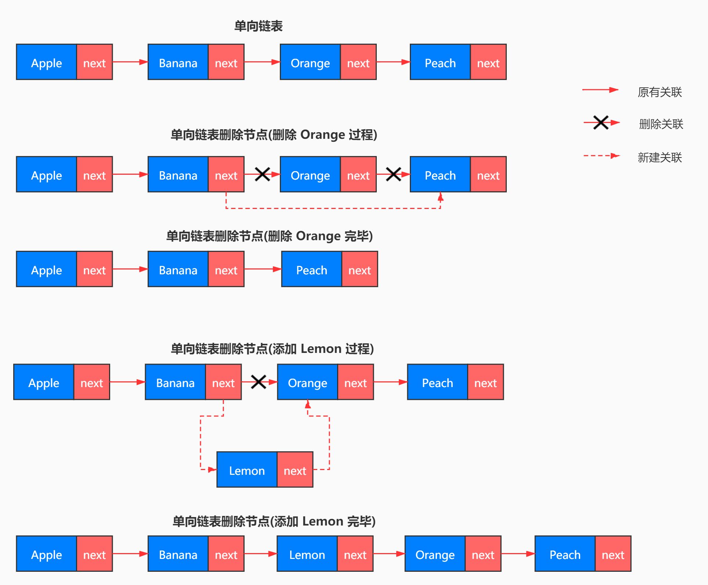
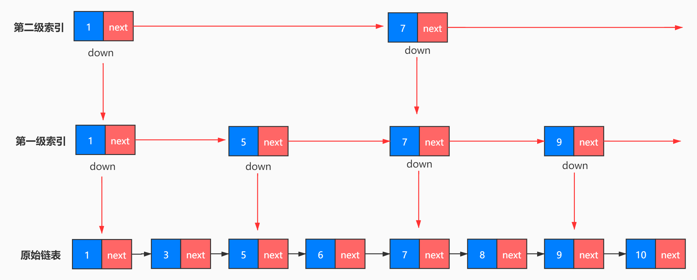

# 1. 数组、链表、跳表

## 1.1 数组
+ 线性表数据结构，连续的内存空间，存储一组具有相同类型的数据。
+ 支持随机访问，根据下标随机访问的时间复杂度为 O(1)。
    + 增加和删除时需要将被操作元素后边的元素逐个移动位置（删除时向前，添加时向后），所以在内存中会有大量的元素移动，效率会比较低。

|数据结构|操作|最优时间复杂度|最差时间复杂度|平均时间复杂度|
|-------|-------|-------|-------|-------|
|数组|查询|O(1)|O(1)|O(1)|
|数组|修改|O(1)|O(1)|O(1)|
|数组|增加|O(1)|O(n)|O(n/2)|
|数组|删除|O(1)|O(n)|O(n/2)|

## 1.2 链表
+ 特点：前一个元素即 node 有一个 next 指针指向下一个元素
+ 可以快速的增加和删除，添加时将新元素的前一个元素的 next 指向新元素，新元素的 next 指向原来的下一个元素。删除时只需要将被删除元素的前一个元素的 next 指向被删除元素的下一个元素即可。
+ 查询和修改时需要遍历整个链表，直到找到目标元素
+ 有单链表，双向链表，循环链表

|数据结构|操作|最优时间复杂度|最差时间复杂度|平均时间复杂度|
|-------|-------|-------|-------|-------|
|单链表|查询|O(1)|O(n)|O(n/2)|
|单链表|修改|O(1)|O(n)|O(n/2)|
|单链表|增加|O(1)|O(1)|O(1)|
|单链表|删除|O(1)|O(n)|O(n/2)|
|双向链表|查询|O(1)|O(n)|O(n/2)|
|双向链表|修改|O(1)|O(n)|O(n/2)|
|双向链表|增加|O(1)|O(1)|O(1)|
|双向链表|删除|O(1)|O(1)|O(1)|

+ 链表 LRU 最近最少使用缓存淘汰算法
    + 使用一个有序单链表，越靠近链表尾部的结点是越早之前访问的。当有一个新的数据被访问时，我们从链表头开始顺序遍历链表。
    + 如果此数据之前已经被缓存在链表中了，我们遍历得到这个数据对应的结点，并将其从原来的位置删除，然后再插入到链表的头部。
    + 如果此数据没有在缓存链表中，又可以分为两种情况：
        + 如果此时缓存未满，则将此结点直接插入到链表的头部；
        + 如果此时缓存已满，则链表尾结点删除，将新的数据结点插入链表的头部。

+ 链表相关练习
    + 单链表反转
    + 链表中环的检测
    + 两个有序链表的合并
    + 删除链表倒数第 n 个元素
    + 求链表的中间结点

## 1.3 跳表(skip list)
+ 跳表：只能用于元素有序的情况。跳表对标的时平衡树(AVL Tree)和二分查找，是一种插入/删除/搜索都是 O(log n) 的数据结构。
    + 优点：原理简单，容易实现，方便扩展，效率更高。
    + 缺点：元素经过多此添加或删除，索引就会有变动，有一些索引会跨几步，有一些会跨两步，添加和删除需要把索引全部都更新一遍，所以维护成本比较高
    + 在一些热门的项目里用来替代平衡树，如 Redis、LevelDB 等。
+ 原理：通过添加多级索引
    + n/2、n/4、n/8、第 k 级索引结点的个数就是 n/(2^k)
    + 假设索引有 h 级，最高级的索引有 2 个结点。n/(2^h) = 2，从而求得 h = log2(n) - 1
+ 需要建立的结点的总数
    + 如果每两个结点抽一个结点作为索引，那么需要建立的总的结点个数为 n/2 + n/4 + n/8 + … + 8 + 4 + 2 = n-2，空间复杂度是 O(n)。
    + 如果每三个结点抽一个结点作为索引，那么需要建立的总的结点个数为 n/3 + n/9 + n/27 + … + 9 + 3 + 1= n/2，空间复杂度是 O(n/2)。
    + 索引结点往往只需要存储 key 和几个指针，并不需要存储完整的对象，所以当对象比索引结点大很多时，索引占用的额外空间就可以忽略了。
+ 更新索引
    + 假如一直往原始列表中添加数据，但是不更新索引，就可能出现两个索引节点之间数据非常多的情况，极端情况，跳表退化为单链表，从而使得查找效率从 O(logn) 退化为 O(n)。
    + 完全重建索引，因为索引的空间复杂度是 O(n)，即：索引节点的个数是 O(n) 级别，每次完全重新建一个 O(n) 级别的索引，时间复杂度也是 O(n) 。造成的后果是：为了维护索引，导致每次插入数据的时间复杂度变成了 O(n)。
+ 跳表学习资源
    + 掘金 [一文彻底搞懂跳表的各种时间复杂度、适用场景以及实现原理](https://juejin.im/post/5d90e4a15188252d3a6a60b8)

## 1.4 资源链接
+ [Java 源码分析（ArrayList）](http://developer.classpath.org/doc/java/util/ArrayList-source.html)
+ [Linked List 的标准实现代码](http://www.geeksforgeeks.org/implementing-a-linked-list-in-java-using-class/)
+ [Linked List 示例代码](http://www.cs.cmu.edu/~adamchik/15-121/lectures/Linked%20Lists/code/LinkedList.java)
+ [Java 源码分析（LinkedList）](http://developer.classpath.org/doc/java/util/LinkedList-source.html)
+ leetcode LRU Cache - Linked list：[LRU 缓存机制](http://leetcode-cn.com/problems/lru-cache)
+ [跳跃表](http://redisbook.readthedocs.io/en/latest/internal-datastruct/skiplist.html)
+ Redis - Skip List：[为啥 Redis 使用跳表（Skip List）而不是使用 Red-Black？](http://www.zhihu.com/question/20202931)

## 1.5 leetcode 相关练习题
+ [11. 盛最多水的容器](https://leetcode-cn.com/problems/container-with-most-water/)
+ [283. 移动零](https://leetcode-cn.com/problems/move-zeroes/)
+ [70. 爬楼梯](https://leetcode-cn.com/problems/climbing-stairs/)
+ [15. 三数之和](https://leetcode-cn.com/problems/3sum/)

# 2. 栈、队列、优先队列、双端队列
## 2.1 栈
+ 栈是一种 `操作受限` 的线性表
+ 用数组实现的栈，我们叫作顺序栈，用链表实现的栈，我们叫作链式栈。
+ 函数调用栈：操作系统给每个线程分配了一块独立的内存空间，这块内存被组织成“栈”这种结构, 用来存储函数调用时的临时变量。每进入一个函数，就会将临时变量作为一个栈帧入栈，当被调用函数执行完成，返回之后，将这个函数对应的栈帧出栈。
+ leetcode上关于栈的题目大家可以先做20,155,232,844,224,682,496.

|数据结构|操作|最优时间复杂度|最差时间复杂度|平均时间复杂度|
|-------|-------|-------|-------|-------|
|栈|查询|O(1)|O(1)|O(1)|
|栈|修改|O(1)|O(1)|O(1)|
|栈|增加|O(1)|O(1)|O(1)|
|栈|删除|O(1)|O(1)|O(1)|

## 2.2 队列
+ 操作受限的线性表数据结构
+ 有普通队列，循环队列，阻塞队列，并发队列
+ 用数组实现的队列叫作顺序队列，用链表实现的队列叫作链式队列。
+ 阻塞队列：阻塞队列其实就是在队列基础上增加了阻塞操作。简单来说，就是在队列为空的时候，从队头取数据会被阻塞。因为此时还没有数据可取，直到队列中有了数据才能返回；如果队列已经满了，那么插入数据的操作就会被阻塞，直到队列中有空闲位置后再插入数据，然后再返回。在多线程情况下，会有多个线程同时操作队列，这个时候就会存在线程安全问题。
+ 并发队列：最简单直接的实现方式是直接在 enqueue()、dequeue() 方法上加锁，但是锁粒度大并发度会比较低，同一时刻仅允许一个存或者取操作。实际上，基于数组的循环队列，利用 CAS 原子操作，可以实现非常高效的并发队列。这也是循环队列比链式队列应用更加广泛的原因。
+ 问题：线程池没有空闲线程时，新的任务请求线程资源时，线程池该如何处理？各种处理策略又是如何实现的呢？

我们一般有两种处理策略。第一种是非阻塞的处理方式，直接拒绝任务请求；另一种是阻塞的处理方式，将请求排队，等到有空闲线程时，取出排队的请求继续处理。那如何存储排队的请求呢？

我们希望公平地处理每个排队的请求，先进者先服务，所以队列这种数据结构很适合来存储排队请求。我们前面说过，队列有基于链表和基于数组这两种实现方式。这两种实现方式对于排队请求又有什么区别呢？

基于链表的实现方式，可以实现一个支持无限排队的无界队列（unbounded queue），但是可能会导致过多的请求排队等待，请求处理的响应时间过长。所以，针对响应时间比较敏感的系统，基于链表实现的无限排队的线程池是不合适的。而基于数组实现的有界队列（bounded queue），队列的大小有限，所以线程池中排队的请求超过队列大小时，接下来的请求就会被拒绝，这种方式对响应时间敏感的系统来说，就相对更加合理。不过，设置一个合理的队列大小，也是非常有讲究的。队列太大导致等待的请求太多，队列太小会导致无法充分利用系统资源、发挥最大性能。

除了前面讲到队列应用在线程池请求排队的场景之外，队列可以应用在任何有限资源池中，用于排队请求，比如数据库连接池等。实际上，对于大部分资源有限的场景，当没有空闲资源时，基本上都可以通过“队列”这种数据结构来实现请求排队。

## 2.3 优先队列

## 2.4 双端队列

