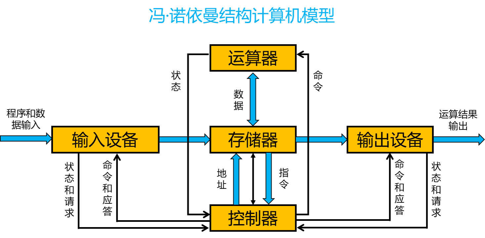
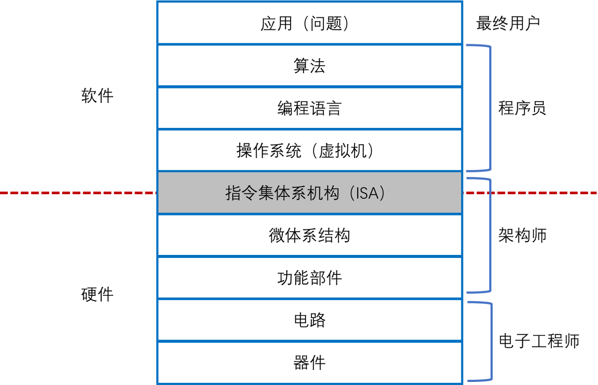
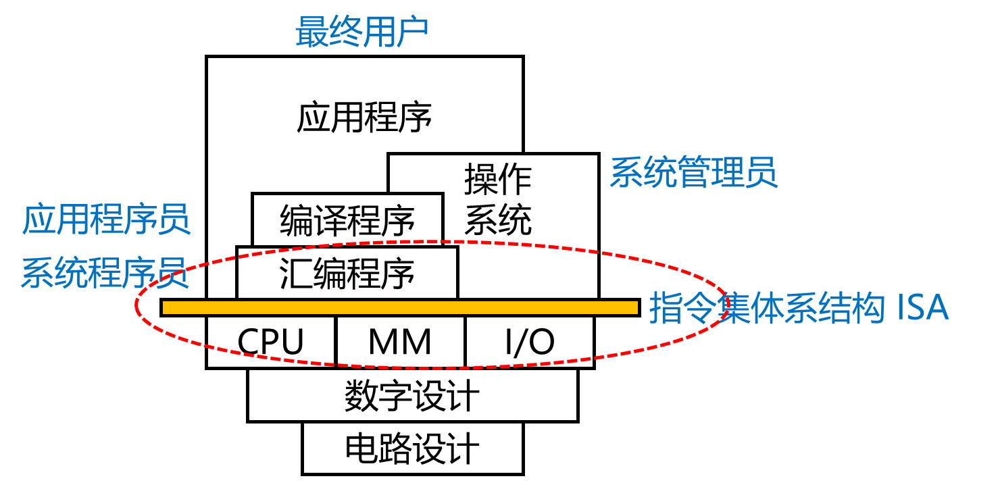

# 1. 计算机的发展历程
## 1.1 电子计算机

世界上第一台电子计算机是 1946 年在美国诞生的 ENIAC，设计师是宾夕法尼亚大学的莫齐利(Mauchly)和他的学生艾克特(Eckert)。

ENIAC(Electronic Numerical Integrator and Computer)，电子数字积分机和计算机，耗资 40 万美元，使用 18000 个真空管，重 30 吨，占地面积 170 平方米，耗电 160 千瓦。

ENIAC 能进行每秒 5000 次的加法运算，每秒 50 次的乘法运算，以及平方、立方、sin、cos 函数数值运算。

## 1.2 第一代计算机

第一代计算机(20 世纪 40 年代中期到 20 世纪 50 年代末)为电子管计算机，逻辑元件采用电子管，存储器件为声延迟线或磁鼓，典型逻辑结构为定点运算。

第一代计算机 ENIAC 没有采用二进制操作和存储程序控制，不具备现代电子计算机的主要特征。

1945 年 3 月，冯诺依曼发表了 **存储程序** 方式的电子数字计算机方法 EDVAC，存储程序方式的基本思想是： **必须将事先编写好的程序和原始数据送入主存后才能执行程序，一旦程序被启动执行，计算机能在不需要操作人员干预下自动完成逐条指令的取出和执行的任务。**

## 1.3 第二代计算机

第二代计算机(20 世纪 50 年代中后期到 20 世纪 60 年代末为 **晶体管** 计算机。

这一代计算机除了逻辑元件采用晶体管以外，其内存采用磁芯存储器，外存采用磁鼓与磁带存储器，实现了浮点运算，并在系统结构方面提出变址、中断、I/O 处理器等新概念。

**和第一代计算机相比，第二代晶体管计算机体积小、速度快、功耗低、可靠性强。**

## 1.4 第三代计算机

第三代计算机(20 世纪 60 年代中期到 20 世纪 70 年代中后期) 为 **集成电路计算机**。

计算机的逻辑元件与存储器均可由集成电路实现。集成电路的应用是微电子与计算机技术相结合的一大突破，为构建运算速度快、价格低、容量大、可靠性强、体积小、功耗低的各类计算机提供了技术条件。

1964 年 IBM 公司宣布世界上第一个采用集成电路的通用计算机 IBM 360 系统研制成功。该系统采用了一系列计算机新技术，包括微程序控制、高速缓存、虚拟存储器和流水线技术等。在软件方便首先实现了操作系统，具有资源调度、人机通信和输入输出控制等功能。

## 1.5 第四代计算机

第四代计算机(20 世纪 70 年代后期开始到现在)为 **超大规模集成电路计算机** ，主要源于微电子学产生的大规模集成电路和微处理器。

半导体集成电路的集成度越来越高，速度越来越快，发展遵循 **摩尔定律** ：由于硅技术的不断改进，每 18 个月，集成度将翻一番，速度将提高一倍，而其价格将降低一半。

随着超大规模集成电路与微处理器技术的长足进步和现代科学技术对提高计算能力的强烈需求，并行

另外一个特点是计算机网络的发展与广泛使用。

另外一个发展方向是计算机的智能化。

# 2. 计算机系统的基本功能和基本组成

## 2.1 计算机系统的基本功能

计算机系统的基本功能

+ **数据处理(data process)** 是计算机系统的基本功能。
+ **数据存储(data storage)** 功能是计算机能采用自动工作方式的基本保证。
+ **数据传送(data transfer)** 功能是计算机内部的各个功能部件之间、计算机主机与外部设备之间、各个计算机系统之间进行信息交换的操作功能。

数据处理、数据存储、数据传送的功能是通过执行指令来完成的，而计算机指令的执行过程由控制器产生的控制信号来控制。

+ **运算器** ：进行数据处理的部件。主要运算部件是 **算术逻辑部件(Arithmetic Logic Unit)** 。
+ **存储器** ：进行数据存储的部件。主要分为 **外存(storage)** 和 **内存(memory)**
+ **互连部件** ：进行数据传送的部件。主要有 **总线(bus)** 、 **桥接器(bridge)** 等。

## 2.2 计算机硬件

### 2.2.1 冯诺依曼结构设计计算机的特点

+ 采用 **存储程序** 的工作方式
+ 计算机由运算器、控制器、存储器、输入设备、输出设备五个基本部件组成
+ 存储器不仅能存储数据，还能存储指令，形式上数据和指令没有任何区别
+ 计算机内部以二进制方式表示指令和地址

### 2.2.2 冯诺依曼结构设计计算机的瓶颈：CPU 和存储器速率之间的问题无法调和
+ CPU 处理速度太快了
+ 存储设备传输数据的速度太慢了
+ CPU 经常要空等着数据传输
+ 最好的是 CPU 和存储设备的传输速度能够一致

### 2.2.3 计算机硬件主要包括中央处理器、存储器、外部设备和各类总线

+ **中央处理器(Central Processing Unit，CPU)** 也称为处理器，是整个计算机的核心部件，主要用于指令的执行。CPU 主要包含两个基本部分：数据通路和控制器
    + **数据通路(data path)** 主要用来执行算术和逻辑运算以及寄存器和存储器的读/写控制等。其中，算术逻辑部件(ALU)用来进行基本的算术和逻辑运算，ALU 中最基本的是加法器，所有算术运算都可以基于加法和逻辑运算来实现。
    + **控制器(controller)** 用来对指令进行移码，生成相应的控制信号，以控制数据通路进行正确的操作。
+ **存储器** 分为内存和外存
    + 内存包括 **主存储器(main memory)** ，简称主存，和 **高速缓冲存储器(cache)** 。
    + 外存包括辅助存储器和海量后备存储器
+ **外部设备** 简称外设，也叫 IO 设备。外设通常由机械部分和电子部分组成，并且两部分通常是可以分开的。
    + 机械部分是外部设备本身
    + 电子部分则是控制外部设备工作的 IO 控制器或 IO 适配器。
+ **总线(bus)** 是传输信息的介质，用于在部件之间传输信息，CPU、主存和 IO 模块通过总线互连，在 CPU 和 IO 模块中都内含有相应的存储部件，即缓存器。

### 2.2.4 名次解释

+ **仲裁** 计算机互连结构的问题在于，每次只有唯一一个设备能够与其他设备通信，因为只有一条信息通路。如果两个设备同时请求使用总线，他们不得不去竞争总线的控制权。系统采用一个名为仲裁器的专用部件来决定允许哪个设备继续工作，而其他竞争者只能等待轮到自己。
+ **宽度** 一般用于并行数据通路的数量来定义总线的宽度，一条 64 位宽的总线一次能够传送 64 位(8 bit)信息。但是宽度也会用来表示构成总线的连接线的总数。比如一条总线可能含有 50 条信息通路，其中 32 条用来传输数据，其他的可能是控制通路或者电源线。
+ **带宽** 总线带宽是衡量信息在总线上的数据速率的一项指标。带宽的代为要么是 B/s，要么是 b/s。在保持数据传输率不变的情况下增加总线的宽度，可以提高带宽。
+ **延迟** 是从发出数据传输请求到实际数据传输的时间间隔。总线延迟通常包括传输开始之前进行总线仲裁的时间。

# 3. 计算机的层次结构

## 3.1 计算机系统抽象层的转换

+ 首先，将应用问题转为算法问题
+ 将算法转为编程语言描述的程序
+ 编程语言的执行
    + 高级语言
    + 低级语言
    + 机器语言
    + 汇编语言
+ 执行指令
+ 使用逻辑电路实现微体系结构
+ 使用器件技术实现逻辑电路

## 3.2 计算机系统的用户

+ 最终用户
+ 系统管理员
+ 应用程序员
+ 系统程序员

# 4. 计算机体系结构

## 4.1 计算机体系结构的历史

+ 20 世纪五六十年代

由于工艺技术限制，计算机做的很简单，计算机体系结构主要研究怎么做加减乘除，主要研究成果是先行进位加法器、Booth 补码乘法算法、华莱士树等。

+ 20 世纪七八十年代

以 **精简指令集(Reduced Instruction Set Computer，简称 RISC)** 兴起为标志，**指令系统结构(Instruction Set Architecture，简称 ISA)** 成为计算机体系结构的研究重点。

+ 20 世纪九十年代以后

计算机体系结构把 CPU、存储系统、IO 系统和多处理器包括在内。

+ 21 世纪

网络就是计算机，计算机体系机构向上突破了软硬件界面，需要考虑软件紧密协同。向下突破了逻辑设计和工艺实现的界面，需要从晶体管的角度考虑结构设计。

## 4.2 摩尔定律和工艺的发展

+ 工艺技术的发展

摩尔定律不是一个客观规律，而是一个主观规律。Intel 公司的创始人摩尔在 20 世纪六七十年代说，集成电路厂商大约 18 个月能把工艺提高一代，即相同面积中晶体管的数目提高一倍。

现在变慢了，大约 2~3 年更新一代，一个重要原因是新工艺的研发成本变得越来越高，厂商收回投资需要更多的时间。

**CMOS(Complementary Metal Oxide Semiconductor，互补金属氧化物半导体)** 是集成电路的设计工艺，节省电力，发热少，且是最基础最常用的半导体元件。

CMOS 工艺面临物理极限，一是蚀刻问题越来越难以处理，二是片内漂移的问题突出。三是栅氧厚度难以继续降低，漏点问题严重。

摩尔定律的终结仅仅是晶体管尺寸难以进一步缩小，并不是硅平台的终结。

+ 工艺和计算机结构

晶体管越来越多，但是越来越难用，晶体管变得 “复杂”、“不快”、“不省电”。

复杂是指纳米级别工艺的物理效应。90nm 工艺以后，工艺越来越难以控制，同一个硅片不同部分的晶体管有快有慢(工艺漂移)，需要考虑可制造性以提高芯片成品率。此外，晶体管数据继续以指数增长，设计和验证能力赶不上晶体管增加的速度，形成剪刀差。

不快主要是晶体管的驱动能力越来越小，连线电容相对变大，连线延迟越来越大。

不省电是漏电功耗不断增加；电压随着工艺更新而降低，随线宽而线性下降，但是到 90nm 以后，工作电压始终在 1V 左右。纳米级别工艺以后连线电容在负载电容中占主导，导致功耗难以降低。

## 4.3 计算机体系结构的障碍

+ 复杂度障碍
+ 主频障碍
+ 功耗障碍
+ 带宽障碍

## 4.4 计算机体系结构设计的基本原则

+ **平衡性**
    + 关于计算机性能和访存带宽平衡的原则，即峰值浮点运算速度(MFLOPS)和峰值访存带宽(MB/s) 为 1:1 左右
    + **Amdahl(阿姆达尔) 定律** ：通过使用某种较快的执行方式所获得的性能的提高，受限于不可使用这种方式提高性能的执行时间所占总执行时间的百分比。
+ **局部性**
    + 时间局部性：一个数据被访问后，很有可能多此访问
    + 空间局部性：一个数据被访问后，它相邻的数据很有可能被访问
+ **并行性**
    + 指令级并行
        + 时间并行：即指令流水线。
        + 空间并行：即多发射
    + 数据级并行：主要指单指令流多数据流(SIMD，Single Instruction Multiple Data)
    + 任务级并行
        + 代表是多核处理器以及多线程处理器
        + 并行粒度大，一个线程中包含几百条或者更多的指令
    + 提高并行性的方法
        + 时间重叠
        + 资源重复
        + 资源共享
+ **虚拟化**
    + 多线程和虚拟机技术“虚拟”了 CPU
    + 流水线和多发射结构
    + Cache 技术
    + 分布式共享存储系统中的 Cache 一致性协议
