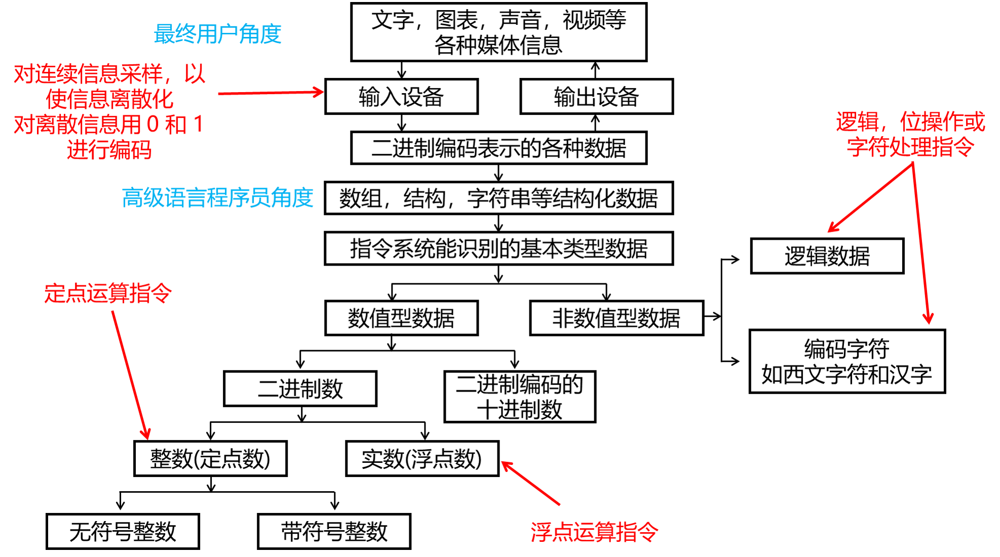

# 1. 数制和编码

计算机内存储和处理信息的最小单位是位(bit)，也叫 比特，值可以是 0 或 1，不可把 bit 再分为更小的信息单位。

数字计算机将信息以一组或一串比特（字）的形式保存在存储器中。

在 x86 计算机中，所有数据存储的基本单位都是字节(byte)，一个字节有 8 位。其他的存储单位还有字(word，两个字节)，双字(double word，四个字节)，四字(quadword，八个字节)。

## 1.1 计算机中数的表示
+ 二进制只有 0 和 1 两个数，其编码、计数和运算规则都很简单，特别是其中 0 和 1 可以对应逻辑命题中的 “假” 和 ”真“，因为能通过逻辑电路方便地实现算术运算。
+ 二进制只能两种基本状态，使用有两个稳定状态的物理元件九年呢表示二进制数中的每一位。
+ 计算机表示一个数的三要素：进位制、定浮点表示、编码规则
+ 计算机中只有 0 和 1，无法表示小数点。所以通过约定小数点的位置来解决。
+ 小数点位置约定在固定位置的数称为定点数，小数点位置约定为可以浮动的数称为浮点数。

## 1.2 数值的表示
+ 二进制
+ 二进制编码的十进制数(Binary Coded Decimal Number，简称 BCD)

表示一个数值要确定三个要素：进位计数制、定/浮点表示和编码规则。

## 1.3 进位计数制

一般用 B(Binary) 表示二进制，用 O(Octal) 表示八进制，用 D(Decimal) 表示十进制，用 H(Hexadecimal) 表示十六进制。

+ R 进制转换成十进制，**按权展开**
+ 十进制转换成 R 进制，将整数和小数部分分开转换
    + 整数部分转换，方法是 **除基取余，上右下左**，用转换的十进制整数去除以基数 R，将得到的余数作为结果数据中各位的数字，直到余数为 0 为止。上面的余数（先得到的余数）作为右边低位上的数位，下面的余数作左边高位上的数位。
    + 小数部分转换，方法是 **乘基取整，上左下右**，用要转换的十进制小数乘以基数 R，将得到的乘积的整数部分作为结果数据中各位的数字，小数部分继续与基数 R 相乘，以此类推，直到某一步乘积的小数部分为 0 或已得到希望的位数为止。
    + 含整数、小数部分的数的转换，将整数和小数部分分开转换，转换后将两部分组合起来得到一个完整的数。
+ 二、八、十六进制数的互相转换
    + 八进制转为二进制，把每一个八进制数字改写成等值的 3 位二进制数即可，且保持高低位的次序不变。
    + 十六进制转为二进制，把每一个十六进制的数字改写成等值的 4 位二进制数即可，且保持高低位次序不变。
    + 二进制转为八进制，整数部分从低位向高位方向每 3 位用一个等值的八进制数来替换，最后不足 3 位时在高位补 0 凑满 3 位。小数部分从高位向低位方向每 3 位用一个等值的八进制数来替换，最后不足 3 位时在低位补 0 凑满 3 位。
    + 二进制转为十六进制，整数部分从低位向高位方向每 4 位用一个等值的十六进制数来替换，最后不足 4 位时在高位补 0 凑满 4 位。小数部分从高位向低位方向每 3 位用一个等值的十六进制数来替换，最后不足 4 位时在低位补 0 凑满 4 位。

## 1.4 定点数的编码表示

### 1.4.1 原码

+ 正数的原码是其本身，负数的原码是其绝对值，+0 的原码是 +0，-0 的原码是 -0。
+ 优点：
    + 与日常记录正负数习惯接近
    + 原码实现乘除运算比较简便直接
+ 缺点：
    + 0 的表示不唯一，使用带来不便。
    + 原码的加减运算规则复杂，原码加减运算时，需要首先判断是否为异号相加或同好相减的情况，如果是的话，则必须先根据两个数的绝对值的大小关系来决定结果的正负号，再用绝对值大的数减去绝对值小的数。

**以 8 位为例：**
    + 数值 `+0`，原码表示为 `0000 0000`，`-0` 原码表示为 `1000 0000` 。
    + 数值 `100`，原码表示为 `0110 0100`，`-100` 原码表示为 `1110 0100` 。
    + 所以 8 位的取值范围为 `[1111 1111, 0111 1111]`

### 1.4.2 补码
+ 和原码转换：原码最高位是 0 时，原码与补码相同。原码最高位为 1 时，原码的最高位不变，其余位按位取反后末位加 1。
+ 求一个数的补码时取模运算，利用补码基于取模运算的特点，可以把减法转换为加法来做。这样不需要在计算机中把加法器和减法器分开。

### 1.4.3 溢出

+ 当同号数相加或者异号相减时，结果的数值可能就会超过该长度编码下的表示范围，称之为溢出。
+ 加法溢出的判断方法：如果 A 和 B 的最高位一样，但是 A + B 的结果的最高位与 A 和 B 的最高位不一样，表示溢出，即两个正数相加得负数，或两个负数相加得正数。
+ 减法溢出的判断方法：即负数减正数的结果时正数，或正数减负数的结果是负数，表示溢出。

### 1.4.4 反码

+ 正数的反码是其自身。
+ 负数的反码是在原码基础上，符号位不变，其余各位取反。

### 1.4.5 模运算

在模运算系统中，如果 A、B、M 满足以下关系 `A = B + K * M`(K 为正数)，则记为 `A = B(mod M)`。即 A、B 各除以 M 后的余数相同，称 B 和 A 为模 M 同余，就是说一个数与它除以 “模” 后得到的余数是等价的。

### 1.4.6 补码的定义

正数的补码是他本身，负数的补码是在原码的基础上，符号位不变，各位取反，最后+ 1。即 反码 + 1。

## 1.5 浮点数的表示

计算机中的浮点数表示沿用了科学计数法的表示方法，即包含了符号、尾数和阶码三个域。

符号用一位二进制码表示， 0 为正，1 为负。

计算机内部位宽为有限的，余下的尾数和解码两者间存在一个此消彼长的关系。

增加尾数的位宽会提高表示的精度，但是会减少表示的范围。

增加阶码的位宽会扩大表示的范围，但是会降低表示的精度。

1985 年，IEEE 完成了浮点数标准 IEEE 754 的制定。

+ IEEE 754 标准浮点数格式

定义了两种基本的浮点数格式，32 位的单精度格式和 64 位的双精度格式。

32 位单精度格式：包含 1 个符号位，8 位阶码和 23 位尾数。

64 位双精度格式：包含 1 个符号位，11 位阶码和 52 位尾数。

## 1.6 IEEE 754 特殊规定
+ 无穷大：阶码位 1 尾数全 0
    + 保证程序出现浮点异常可以正常执行
    + 位程序提供一种检测错误的途径
    + 无穷大作为源操作数时，可以得到无穷大的结果
+ 非数：阶码全 1 尾数非 0
    + 检测非初始化值的使用
    + 计算出现异常时程序可以继续执行下去
+ 规格化非 0 数：阶码非全 0 非全 1
    + 单精度：阶码 e 落在 `[1, 254]`。双精度：阶码 e 落在 `[1, 2046]`
+ 非规格化非 0 数：阶码全 0 尾数非 1
+ 零：阶码全 0 尾数全 0

# 2. 非数值数据的编码表示

## 2.1 西文字符

西文由拉丁字母、数组、标点符号及一些特殊符号组成，统称为字符(character)。所有字符的集合叫做字符集。

字符不能直接在计算机内部进行处理，因而必须对他们进行数字化编码。

字符集中每一个字符都有一个代码，构成了该字符集的代码表，简称码表。码表中的代码具有唯一性。

字符集有多重，每一个字符集的编码方式也不一样，目前计算机中使用最广泛的西文字符是 ASCII 码，即美国标准信息交换码(American Standard Code for Information Interchange)。

## 2.2 汉字字符

+ 汉字的输入码

每个汉字用一个或几个键来表示，这种对每个汉字用相应的按键进行的编码表示就成为汉字的输入码，又称外码。因此汉字的输入码的码元（即组成编码的基本元素）是西文键盘中的某个按键。

+ 字符集与汉字内码

汉字被输入到计算机内部后，按照一种内码的编码形式在系统中进行存储、查找、传送等处理。对于西文字符，它的内码就是 ASCII。

1981 年我国颁布了《信息交换用汉字编码字符集·基本集》（GB2312-80）。该标准选出 6763 个常用汉字，为每一个汉字规定了标准代码，以供汉字信息在不同计算机系统之间交换使用。这个标准成为 **国标码** ，又称 **国标交换码**。

**GB2312 国标字符集由三部分组成：**
    + 字母、数字和各种符号。包括英文、俄文、日文平假名与片假名、罗马字母、汉语拼音等共 687 个。
    + 一级常用汉字，用 3755 个，按汉语拼音排列。
    + 二级常用汉字，共 3008 个，因为不太常用，所以按偏旁部首排列。

+ 汉字的字模点阵码和轮廓描述

每一个汉字的字形都必须先存放在计算机中，一套汉字的所有字符的形状描述信息集合在一起称为 **字形信息库** ，简称 **字库(font library)**。不同的字体对应不同的字库，在输入的每一个汉字时，计算机都要先到字库中区找到它的字形描述信息，然后把字形信息送到相应的设备输出。

汉字的形主要有两种描述方法：字模点阵描述和轮廓描述。

字模点阵描述是将字库中的各个汉字或其他字符的字形（字模），用一个其元素由 0 和 1 组成的房展（16*16，24*24等）来表示，汉字或字符中有黑点的地方用 1 表示，空白处用 0 表示，这种方式二进制点阵数据称为汉字的 **字模点阵码** 。

汉字的 **轮廓描述** 方法比较复杂，它把汉字的笔画用一组直线和曲线来勾画，记下每一直线和曲线的数据描述公式，目前已有两类国际标准：Adobe Type1 和 True Type，这种轮廓描述字形的方式精度高，字形大小可以任意变化。

## 2.3 Unicode 标准

UTF-8 用于 HTML，与 ASCII 有相同的字节数值

UTF-16用于节约使用内存与高效访问字符相互平衡的环境中。比如 Windows 近期版本使用 UTF-16，其中的每一个字符都有一个 16 位的编码。

UTF-32 用于不考虑空间，但需要固定宽度字符的环境中，每一个字符都有 32 位的编码。

# 3. 数据的宽度和存储

## 3.1 数据的宽度和单位

二进制数据的每一位（0 或 1）是组成二进制信息的最小单位，称为一个比特(bit)，或称为位。比特是计算机存储、运算和传输信息的最小单位。

每个西文字符需要用 8 个比特表示，而每个汉字需要用 16 个比特才能表示。在计算机内部，二进制信息的计量单位是字节(byte)，也称为位组，一个字节等于 8 个比特。

计算机的一个很重要的指标就是机器的 **字长**，就是平时说的 32 位或者 64 位。机器字长通常是指 CPU 内部用于整数运算的数据通路的宽度。CPU 内部数据通路是指 CPU 内部的数据流经的路径以及路径上的部件，主要是 CPU 内部进行数据运算、存储和传送的部件，这些部件的宽度基本上要一致才能匹配。因此，字长等于 CPU 内部用于整数运算的运算器位数和通用寄存器的宽度。

## 3.2 数据的存储和排列顺序

最低有效位(Least Significant Bit，LSB)表示数的最低位。

最高有效位(Most Significant Bit，MSB)表示数的最高位。

对于带符号的数，最高位就是符号位，所以 MSB 就是符号位。

在计算机中，多字节数都被存放在连续的字节序列中。根据数据中各字节在连续字节序列中的排列顺序不同，可有两种排列方式：大端(big endian)和小端(little endian)

**大端方式** 将数据的最高有效字节存放在低地址单元中，将最低有效字节存放在高地址单元中，即数据的地址就是 MSB 所在的地址。

**小端方式** 将数据的最高有效字节存放在高地址单元中，将最低有效字节存放在低地址单元中，即数据的地址就是 LSB 所在的地址。

# 4. 数据的基本运算

## 4.1 MOS 晶体管工作原理

晶体管可以根据控制端电压或电流的变化来实现“开启”和“关闭”功能，从而表达二进制。

晶体管主要分为双极型二极管(Bipolar Junction Transistor) 和金属-氧化物半导体场效应晶体管(Metal Oxide Semiconductor Field Effect Transistor，简称 MOSFET 或 MOS)

当前绝大多数 CPU 都采用 MOS 晶体管实现，其中又以 CMOS(Complementary Metal Oxide Semiconductor) 晶体管电路设计最为常见。

+ 半导体：MOS 晶体管使用硅作为基本材料。
+ NMOS 和 PMOS 晶体管

## 4.2 CMOS 逻辑电路

### 4.2.1 数字逻辑电路

+ 布尔代数：最基本的逻辑运算有三种 `与(AND，&)`，`或(OR，|)`，`非(NOT，~)`
    + 恒等律：`A | 0 = A，A & 1 = A`
    + 0/1律：`A | 1 = 1，A & 0 = 0`
    + 互补律：`A | (~A) = 1，A & (~A) = 0`
    + 交换律：`A | B = B | A，A & B = B & A`
    + 结合律：`A | (B | C) = (A | C) | B，A & (B & C) = (A & B) & C`
    + 分配律：`A & (B | C) = (A & B) | (A & C)，A | (B & C) = (A & B) | (A & C)`
    + 德摩根定律：`~(A & B) = (~A) | (~B)，~(A | B) = (~A) | (~B)`
+ 组合逻辑：
    + 组合逻辑电路中没有数据存储单元，电路的输出完全由当前的输入决定。在组合逻辑的各种表达方式中，最简单的就是真值表，即对每一种可能的输入组合给出输出值。所以一个 N 输入的电路就有 2 的 N 次方种不同的输入组合。
    + 利用基本逻辑门电路可以构成具有特定功能的更功能的组合的逻辑部件，如译码器，编码器，多路选择器，加法器等。
+ 时序逻辑：
    + 时序逻辑电路包含时钟信号和数据存储单元两个要素。
    + 特点：输出不惮于当前的输入的逻辑有关，还与在此之前曾经输入的逻辑值有关。
    + 时钟信号时时序逻辑电路的基础，用于确定时序逻辑逻辑原件种的状态在何时发生变化。

### 4.2.2 常见 CMOS 电路

+ 非门：非门也称作反相器的 CMOS 电路，有一个 PMOS 晶体管和一个 NMOS 晶体管组成，其中 P 管(PMOS) 的源极接电源，N 管(NMOS 晶体管)的源极接地，两管的漏极连载一起作为输出，栅极连在一起作为输入。
+ 与非门
+ 或非门
+ 传输门
+ D 触发器

## 4.3 按位运算和逻辑运算
+ 位运算
    + 按位与(AND) `&`
    + 按位或(OR) `|`
    + 按位非(NOT) `~`
    + 按位异或(XOR) `^`

位运算的一个重要运用就是实现掩码(masking)操作，通过与给定的一个位模式进行按位与，可以提取所需要的位，然后对这些位进行 `置1`、`清 0`、`是否为 1 测试`、`是否为 0 测试` 等，这里的位模式就被成为掩码。 

+ 逻辑运算
    + 且运算(AND) `&&`
    + 或运算(OR) `||`
    + 非运算(NOT) `!`

## 4.4 移位

+ 左移时，高位移出，低位补 0。
+ 右移时，低位移出，高位补 0。
+ 对于无符号整数的逻辑左移，如果最高位移出的是 1，则发生溢出。

## 4.5 整数加减运算

只有两个加数的符号相同时才可能发生溢出。两个加数都是正数时发生的溢出称为正溢出。两个加数都是负数时发生溢出称为负溢出。

在 Intel x86 架构中，不管高级语言程序中定义的变量是带符号整数还是无符号整数类型，对应的加减法指令都一样。

在 MIPS 架构中，提供了专门的带符号整数的加减指令和无符号整数的加减指令，因而在 MIPS 处理器中的运算电路中会区分是带符号整数还是无符号整数。区别在于带符号整数加减时会判断溢出并对溢出做出处理，而无符号整数加减时不判断溢出，其余部分是一样的。

## 4.6 常量乘除运算

由于整数乘法运算比移位和加法等运算所用时间长的多，通常一次乘法运算需要 10 个左右的时钟周期，而一次移位、加法和减法等运算只要一个或更少的时钟周期。

因此，编译器在处理变量与常数相乘时，往往以移位、加法和减法的组合运算来代替乘法运算。

无论是无符号整数还是带符号整数的乘法，即时计算结果发生了溢出，利用移位和加法运算组合的方式得到的结果都是一样的。

对于整数除法，由于不能采用流水线方式实现，所以一次除法运算大概需要 30 多个甚至更多的时钟周期。为了缩短除法运算时间，编译器在处理一个变量与一个 2 的幂次形式的整数相处时，尝采用右移运算来实现。
