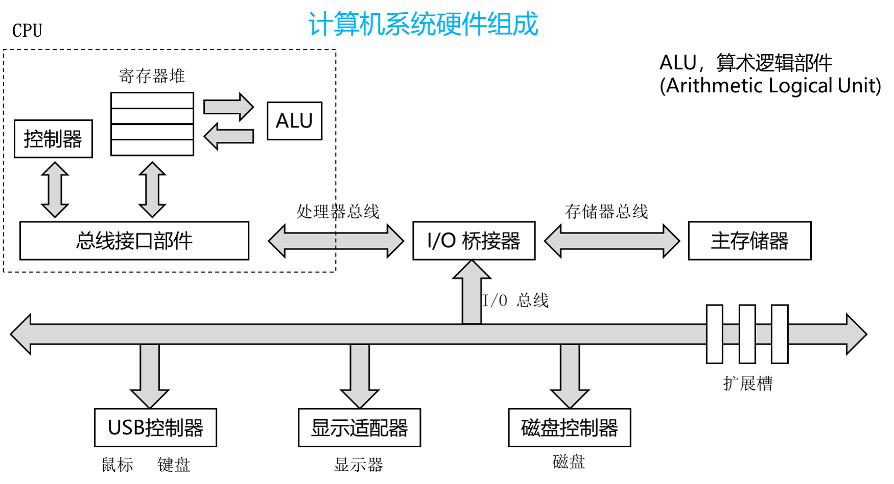

# 1. 计算机组成原理和结构

## 1.1 冯·诺依曼结构

### 1.1.1 冯·诺依曼结构主要特点
+ 计算机有存储器、控制器、运算器、输入设备、输出设备组成，其中运算器和控制器合称为中央处理器(Central Processing Unit)
+ 存储器是按地址访问的线程编址的一维结构，每个单元的位数固定。
+ 采用存储程序方式，即指令和数据不加区别混合存储在同一存储器中。
+ 控制器通过执行指令发出控制信号控制计算机的操作。指令在存储器中按其执行顺序存放，由指令计数器指明要执行的指令所在的单元地址。指令计数器一般按顺序递增，但执行顺序可按运算结果或当时的外部条件而改变。
+ 以运算器为中心，输入输出设备和存储器的数据传送都经过运算器。

### 1.1.2 冯·诺依曼结构的改进
+ 由以运算器为中心改为以存储器为中心。使得诗句的流向更加合理，从而使运算器、存储器和输入输出设备都能够并行工作
+ 由单一的集中控制改进为分散控制。
+ 从基于串行算法改进为适应并行算法。出现流水线处理器、超标量处理器、向量处理器、多核处理器、对称多处理器、大规模并行处理机和机群系统等。
+ 出现为适应特殊需要的专用计算机
+ 依靠数据驱动的数据流计算机、图规约计算机等。

但是，现代计算机系统占据主要地位的依然是以存储程序和指令驱动执行为主要特点的冯·诺依曼结构。

## 1.2 计算机的组成部件

### 1.2.1 运算器
+ 运算器在计算机中负责计算（算术计算和逻辑计算）的部件。
+ 运算器包括算术和逻辑运算部件、位移部件、浮点运算部件、向量运算部件、寄存器等
+ 复杂运算如乘除法、开方及浮点运算可以用程序或运算器实现。寄存器可以保存数据和地址。运算器可以设置条件码寄存器等专用寄存器，条件码寄存器可以保存当前运算结果的状态，如运算结果是正数、负数或零，是否溢出等
+ 随着晶体管集成度的不断提升，处理器所继承的运算器的数量也在持续增加，通常将具有相近属性的一类运算组织在一起构成一个运算单元。不同的处理器有不同的运算单元组织，有的倾向于每个单元大而全，有的倾向于每个单元的功能相对单一。

## 1.2.2 控制器
+ 控制器是计算机中发出控制命令以控制计算机各部件自动、协调工作的装置。
+ 现代计算机通常把控制器和运算器集成在一起，称为中央处理器，CPU。现在 CPU 还集成了高速缓存、内存控制器等部件。
+ 执行指令的过程：（一个指令周期）
    + 从存储器取出指令并对取回的指令进行译码
    + 从存储器或寄存器读取指令执行需要的操作数
    + 执行指令
    + 把执行结果写回存储器或寄存器
+ 指令流水线（控制器通过指令流水线提高指令执行效率）
    + 把一条指令的执行划分为若干阶段（取指、译码、执行、访存、写回等）来减少每个时钟周期的工作量，从而提高主频。
    + 允许多条指令的不同阶段重叠执行实现并行处理。
    + 同一条指令的执行时间没有变短，但是处理器在单位时间内执行的指令数增加了
+ 提高流水线效率的技术
    + 转移预测技术
        + 程序平均每 5~10 条指令就有 1 条朱阿姨指令，而转移指令的后续指令需要等待转移指令执行结构确定后才能取指，导致转移指令和后续指令之间不能重叠执行，降低了流水线的效率。
        + 转移预测技术可以消除转移指令引起的指令流水线阻塞。根据当前转移指令或其他转移指令的历史行为，在转移指令的取值或译码阶段预测该转移指令的跳转方向和目标地址并进行后续指令的取指。
    + 乱序执行技术
    + 超标量（多发射）技术

### 1.2.3 存储器
+ 存储器存储程序和数据，一般用动态随机访问存储器(DRAM，Dynamic Random Access Memory)实现
+ 存储器的速度满足不了 CPU 的快速需求，将存储系统分为高速缓存(Cache)、主存储器和辅助存储器三个层次
    + Cache 存放当前 CPU 最频繁访问的部分主存储器内容，采用静态随机访问存储器(SRAM，Static Random Access Memory)其实现
    + 现代计算机访问内存时采用虚拟地址，操作系统负责维护虚拟地址和物理地址转换的页表
+ 存储器的主要评价指标：存储容量、访问速度。
+ 存储介质分类
    + 磁性存储介质
    + 闪存
    + 动态随机访问存储
    + 静态随机访问存储
+ 高速缓存
    + CPU 速度与内存速度差距太大，形成剪刀差。
    + 局部性原理
+ 内存
    + 一般采用同步动态随机存储器(SDRAM)
    + 影响因素
        + 行缓冲局部性
        + Bank 级并行度

### 1.2.4 输入/输出设备

+ GPU(Graphic Processing Unit) 图形处理单元
+ 硬盘
+ 闪存

## 1.3 计算机系统硬件结构发展

现代计算机系统的硬件结构主要包含了：中央处理器、图形处理器、北桥和南桥

+ CPU-GPU-北桥-南桥结构
+ CPU-北桥-南桥
+ CPU-弱北桥-南桥
+ CPU-南桥
+ SoC(System on Chip，片上系统) 单片结构

## 1.4 处理器与 IO 设备通信

### 1.4.1 IO 寄存器寻址
+ 内存映射寻址：把 IO 寄存器的地址映射到内存地址空间
+ 特殊 IO 指令：使用专有指令来执行 IO 操作

### 1.4.2 处理器和 IO 之间的同步
+ 查询
    + 处理器向 IO 设备发出访问请求后，需要不断读取 IO 设备的状态寄存器，也叫做轮询
    + 由于 IO 设备的速度比较慢，所以查询方式比较浪费
+ 中断
    + 处理器不需要轮询状态寄存器的值，而是在等待设备完成某个操作时转去执行其他进程。
    + 设备完成操作后，自行产生一个中断信号来中断处理器的执行。
    + 处理器被中断，再去读取设备的状态寄存器。
    + 提高了处理器的利用率

### 1.4.3 处理器和 IO 之间的数据传送

早期存储器和 IO 设备之间数据传送是通过处理器来完成的。由于存储器和 IO 设备之间没有直接的数据通路，当需要从存储器中搬运数据到 IO 设备时，处理器首先从存储器中读取数据到通用寄存器中，在从通用寄存器写数据到 IO 设备。当需要从 IO 设备搬运数据到存储器中，处理器需要先从 IO 设备中读取数据到通用寄存器，再从寄存器写入内存。这种方式叫做 PIO(Programming Input/Output)模式。

+ PIO中转影响处理器的执行，也降低了数据传送的效率。
+ DMA(Direct Memory Access) 直接存储器访问。DMA 方式在存储器和外设之间开辟直接的数据传送通道，数据传送由专门的硬件来控制。控制 DMA 数据传送的硬件被称为 DMA 控制器。
+ DMA 传递数据的流程
    + 处理器为 DMA 请求预先分配一段地址空间
    + 处理器设置 DMA 控制器参数，包括设备标识，数据传送方向，内存中传递数据的原地址，目标地址，传输的数据量
    + DMA 控制器进行数据传输
    + DMA 控制器向处理器发出一个中断信号，通知处理器数据传送的结果
    + 处理器完成本次 DMA 请求，可以开始新的 DMA 请求

# 2. 总线概述

总线本质是完成数据交换，用于将两个或两个以上的部件连接起来，使得他们之间可以进行通信。

总线分为以下几个层级：

+ 机械层，接口的外形，尺寸，信号排列，连接线的长度范围等。
+ 电气层，信号描述，电源电压，电平标准，信号质量等。
+ 协议层，信号时序，握手规范，命令格式，出错处理等。
+ 架构层，硬件模型，硬件架构等。

## 2.1 总线分类
 
+ 按照传递方向
    + 单向(工)总线
    + 双向(工)总线
        + 半双工
        + 全双工
+ 按照信号类型
    + 并行总线
    + 串行总线
+ 按照物理位置
    + 片上总线
    + 内存总线
    + 系统总线
    + 设备总线

## 2.2 片上总线

+ 片上总线是指芯片片内互连使用的总线。
+ 通用处理器在设计时，会划分为处理器核、共享高速缓存、内存控制器等模块。
+ AMBA(Advanced Microcontroller Bus Architecture，高级微控制器总线架构) 包含了 AXI，AHB，ASB，APB 等总线。
+ AXI(Advanced eXtensible Interface，高级可扩展接口) 是一种高性能、高带宽、低延迟的片上总线。 
+ AHB(Advanced High-performance Bus) 高性能系统总线。
+ ASB(Advanced System Bus) 第一代 AMBA 系统总线。
+ APB(Advanced Peripheral Bus) 本地二级总想概念。

## 2.3 系统总线

+ 系统总线通常用于处理器和桥片的连接，同时作为多处理器之间的连接构成多路系统。
+ HyperTransport 是 AMD 公司提出的高速系统总线，用于连接为处理器与配套桥片，以及多个处理器之间的互连。
+ HT 总线的软件架构与 PCI 总线协议基本相同，都采用配置空间、IO 空间和 Memory 空间的划分，通过对配置寄存器的设置，采用正向译码的方向对设备空间进行访问。
+ 基于 PCI 总线设计的设备驱动程序能够直接使用在 HT 总线设备上。

## 2.4 设备总线
+ 设备总线用于计算机系统中与 IO 设备的连接
+ PCI(Peripheral Component Interconnect) 总线是一种对计算机系统结构连接影响深远并广泛应用的设备总线。
+ PCIE(PCI Express) 可以被看作是 PCI 总线的升级版本，兼容 PCI 软件架构。

# 3. 计算机系统启动过程分析

## 3.1 处理器核初始化

初始化实际上是将内部的各种寄存器状态从不确定设置为确定，将一些模块状态从无序强制为有序的过程。简单来说，就是通过 load/store 指令或其他方法将指定寄存器或结构设置为特定数值。

以 MIPS 结构为例，只将 0 号寄存器的值强制设置为 0，而其他的通用寄存器值是没有要求的。那么在处理器复位后开始运行的时候，这些寄存器的值可能是任意值。如果需要用到寄存器内容时，就需要对其先进行写操作，写为一个软件期望的值。

### 3.1.1 处理器复位

+ 处理器的第一条取指，是由复位信号控制的，但是受限于各种其他因素，复位信号并没有对其处理器内部的所有部分进行控制。
+ MIPS 处理器复位后的第一条指令时将固定从地址 0XBFC00000 的位置获取，这个过程时有处理器的执行执行寄存器为硬件复位为 0XBFC00000 而决定的。
+ 对物理地址 0X1FC00000 的取指请求，会被处理器内部预先设定好的片上互连网络路由至某个预先存放着启动程序的存储设备上。

### 3.1.2 调试接口初始化
+ 对串口的初始化操作，实际上时处理器对串口执行一连串约定号的 IO 操作。
+ X86 结构下，IO 地址空间与内存地址互相独立，IO 操作与访存操作是通过不同的指令实现的。
+ MIPS 结构下，不显示区分 IO 地址和内存地址，而采用全局编址，使用地址空间将 IO 和内存隐式分离。
+ 内存空间对应的是存储器，存储器不会发生存储内容的自动更新。
+ IO 空间一般对应的是控制寄存器或状态寄存器，是受 IO 设备的工作状态所影响的。

### 3.1.3 TLB 初始化

+ TLB(Translation Look-aside Buffer，转译后备缓冲区)
+ TLB 是地址映射的管理模块，主要负责操作系统里用户进程地址空间的管理，用以支持多用户多任务并发。
+ 然而在处理器启动的过程中，处理器核处于特权态，整个 BIOS 都工作在一个统一的地址空间里，并不需要对用户地址空间进行过多干预，此时 TLB 的作用更多的是地址转换，以映射更大的地址空间供程序使用。

### 3.1.4 Cache 初始化

+ Cache 在系统复位后，也处于一个未初始化的状态，也就是说，Cache 里可能包含这残留的或者随机的数据，如果不经处理刷，对Cache 的访问也可能会导致错误的命中。
+ 不同的处理器可能包含着不同的 Cache 层次，各级 Cache 的容量也可能各不相同。
+ Cache 的组织结构中，主要包含标签 Tag 和数据 Data 两部分。Tag 用于保存 Cache 块的状态、Cache 块地址等信息， Data 则保存数据内容。大多数情况下对 Cache 的初始化就是对 Tag 的初始化，只需要将其中的 Cache 块状态设置为无效，其他部分的随机数据就不会产生影响。 

## 3.2 总线接口初始化

### 3.2.1 内存初始化
+ 计算机运行是的程序和数据都被保存在内存中。相对复位时用于取指的 ROM 或 Flash 器件来说，内存的读写性更是达到了千倍以上。
+ 越来越多的处理器已经继承内存控制器，因为内存的使用和设置与外界内存芯片的种类、配置相关，所以在计算器系统启动的过程中需要先获取内存的配置信息，再根据内存配置信息对内存控制器进行配置。
+ 内存的使用完全是由软件控制的，软件知道其访问的每一个地址是否存在有效的数据。而 Cache 是一个硬盘加速部件，大多数情况下不需要真正知道其存在，Cache 的硬件控制位正式为了掩盖内存访问延迟，保证访存操作的正确性。 
+ 初始化包括两部分
    + 内存的行地址、列地址等对内存地址映射进行配置
    + 针对协议对内存信号的调整的支持方式对内存读写信号相关的寄存器进行训练，以保证传输时数据完整性。

### 3.2.2 IO 总线初始化
+ IO 总线初始化的主要目的时将非通用的软硬件设置都预先设置好，将与桥片特性相关的部分与后面的标准驱动加载程序完全分离出来，以保证接下来的通用设备管理程序的运行。
+ 完成内存与 IO 总线初始化后，整个计算机系统就已经进入到一个可控的状态，也就是说， BIOS 中的基本硬件初始化的功能目标已经达到。
+ 但是为了加载操作系统，还需要对系统中的一些设备进行配置和驱动。

### 3.2.3 设备的探测及驱动加载
+ PCI 软件架构下，系统可以灵活地支持设备的自动识别和驱动的自动架子啊
+ PCI 协议下，IO 的系统空间分为三个部分：配置空间、IO 空间、Memory 空间
+ 因为每个设备都有唯一的识别号，通过记载这些识别号对应的驱动，就完成了设备的自动识别和驱动的自动加载。

## 3.3. 多核启动过程

### 3.3.1 初始化时的多核协同
+ 将多核处理器中的一个设定为主核，其他的设定为从核。
+ 主核除了对自身处理器的初始化，还需要负责对各种总线及外设初始化。
+ 从核只需要对自身处理器的私有部件进行初始化，之后第穷哦那个过程中保持空闲状态，直到进入操作系统再由主核进行调度。
+ 主核完成了内存初始化后，其他核才能使用内存进行数据的读写操作。

### 3.3.2 操作系统启动时的多核唤醒

在操作系统中，主核在各种数据结构准备好的情况下就可以开始依次唤醒每一个从核。唤醒的过程也是串行的，主核唤醒从核之后也会进入一个等待过程，直到从核执行完毕并通过从核，从核才再次唤醒新的从核。

### 3.3.3 核间同步与通信
+ 核间中断可以完成各种核间的同步与通信操作。
+ 核间中断也是利用一组 IO 寄存器实现的。

# 4. 指令流水线

## 4.1 单周期处理器

指令系统按照功能可以分为运算指令、访存指令、转移指令和特殊指令四类。

根据指令集的定义，可以得知 CPU 的数据通路包含以下组成要素：

+ 程序计数器，又称 PC，指示当前指令的地址
+ 指令存储器，按照指令地址存储指令码，接受 PC ，读出指令
+ 译码部件，用于分析指令，判断指令类别
+ 通用寄存器堆，用于承载寄存器的值，绝大多数指令都需要读取及修改寄存器。
+ 运算器，用于执行指令所指示的运算操作
+ 数据存储器，按照地址存储数据，主要用于访存指令

数据通路上各组成要素的具体连接规则：

+ 根据 PC 从指令存储器种取出指令，然后是译码部件解析出相关控制信号，并读取通用寄存器堆。
+ 运算器堆对通用寄存器堆独处的操作数进行计算，得到计算指令的结果写回通用寄存器堆，或者得到访存指令的地址，或者得到转移指令的跳转目标。
+ load 指令访问数据存储器后，需要将结果写回通用寄存器堆。
+ 通用寄存器堆写入数据在计算结果和访存结果之间二选一。
+ 由于有了控制流指令的存在，因此新指令的 PC 既可能等于顺序下一体指令的 PC，也可能来自转移指令计算出的跳转目标。

译码部件要识别不同的指令，并根据指令要求，控制读取那些通用寄存器，执行何种运算，是否要读写数据存储器，写哪个通用寄存器，以及根据控制流指令来决定 PC 的更新。

## 4.2 流水线处理器

每个之中周期必须完成取指，译码，读存储器，执行，访存等多个工作，为了保证下一个时钟上升沿到来之前准备好寄存器堆的写数据，所以每个时钟周期的间隔就要很长，导致处理器的主频无法提高。

使用流水线技术可以提高处理器的主频。

如果在每段操作前后加上触发器，采用分频时钟的处理器模型称为多周期处理器。多周期处理器设计可以提高运行频率，但是每条指令的执行时间并不能降低。

但是我们可以将各个执行阶段以流水方式组织起来，同一时刻不同指令的不同执行阶段重叠在一起，进一步提高 CPU 执行效率。

多周期处理器演进到流水线处理器，核心在于控制逻辑和数据通路对应关系维护机制的变化。

## 4.3 指令相关和流水线冲突

指令间的相关可以分为三类：数据相关、控制相关、结构相关。

在程序中，如果两条指令访问同一个寄存器或内存单元，而且这两条指令中至少有一条是写该寄存器或内存单元的指令，那么这两条指令之间就存在数据相关。

如果两条指令中一条是转移指令， 而且另外一条是否被执行取决于该转移指令的执行结果，则这两条指令就存在控制相关。

如果两条指令使用同一份硬件资源，则这两条指令存在结构相关。

## 4.4 流水线与异常处理

异常可以分为可恢复异常和不可恢复异常。

不可恢复异常通常发生在系统硬件出现了严重故障的时候，此时异常处理后系统通常面临重启，所以处理器响应不可恢复异常的机制很简单，只要立即终止当前的执行，记录软件所需要的信息然后跳转到异常处理入口即可。

可恢复异常处理比较难，要求做的非常精确，精确异常要求处理完毕异常之后，回到产生异常的地方接着执行，还能执行正确，就好像是没有发生过异常一样。要达到整个效果，要求在处理异常时，发生异常的指令前面的所有指令都必须执行完毕，而发生异常的指令及其后面的指令都没有执行。

## 4.5 提高流水线效率的技术

流水线 CPI = 理想 CPI + 结构相关阻塞周期数 + RAW 阻塞周期数 + WAR 阻塞周期数 + WAW 阻塞周期数 + 控制相关阻塞周期数

### 4.5.1 多路发射技术

让处理器中每一级流水线都可以同时处理更多的指令，这被称为多发射数据通路技术。

要在处理器中支持多发射，首先就要将处理器中的各种资源翻倍，包括采用支持双端口的存储器。其次还要增加额外的阻塞判断逻辑，当同一个时钟周期执行的两条指令存在执行相关，也需要进行阻塞。包括数据相关、控制相关和结构相关在内的阻塞机制修需要略微改动。

多发射数据通路技术理论上可以大幅降低处理器的 CPI，但是由于各类相关所引起的阻塞影响，实际执行效率是要打折扣的。

### 4.5.2 动态调度

把相关的解决尽量往后拖延，同时前面指令的等待不影响后面指令继续进行。

ROB(Re-order Buffer，重排序缓存)

实现动态调整后流水线各阶段的调整：

+ 取指，不变。
+ 译码，拆分为译码和发射两个阶段
+ 发射，把操作队列的指令根据操作类型送到保留站，并在 ROB 种指定一项作为临时保存该指令结果调用。
+ 指令，如果所需要的操作数都准备好，则执行。否则根据结果 ROB 号侦听结果总线并接收结果总线的值。
+ 写回，把结果送到结果总线，释放保留站，ROB 根据结果结果总线修改相应的项。
+ 提交，如果队列种的第一条指令的结果已经写回并且没有发生异常，把该指令的结果从 ROB 写回到寄存器或存储器，释放 ROB 的相应项。如果队列头的指令发生了异常或者转移指令猜测错误，清除操作队列以及 ROB。

### 4.5.3 转移预测

在转移指令的取指或译码阶段预测出转移指令的方向和目标地址，并从预测的目标地址继续取指令执行。

猜测正确，就不会阻塞流水线。

硬件转移预测有两个步骤：

+ 预测，取指或译码阶段预测转移指令是否跳转以及转移的目标地址，并根据预测结果进行后续指令的取指。

+ 确认，转移指令执行完毕后，比较最终确定的转移条件和转移目标与之前预测的结果是否相同，如果不同则需要取消预测后的指令执行，并从正确的目标重新开始执行。
