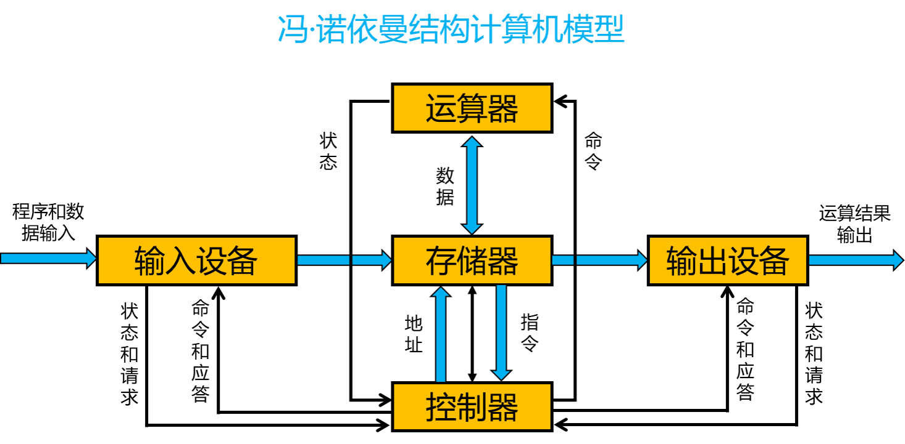

# 1. 计算机结构

冯·诺依曼计算机：将程序指令和数据一起存储的计算机设计概念结构

## 1.1 早期计算机
+ 仅包含固定用途程序
+ 如果改变程序用途，需要改变程序更改结构、重新设计电路

## 1.2 冯·诺依曼体系具体内容
+ 必须有存储器、控制器、运算器
+ 必须有输入设备和输出设备

## 1.3 冯·诺依曼计算机的特点
+ 计算机有存储器、控制器、运算器、输入设备、输出设备组成，其中运算器和控制器合称为中央处理器(Central Processing Unit)
+ 存储器是按地址访问的线程编址的一维结构，每个单元的位数固定。
+ 采用 **存储程序** 的工作方式，即指令和数据不加区别混合存储在同一存储器中。
+ 控制器通过执行指令发出控制信号控制计算机的操作。指令在存储器中按其执行顺序存放，由指令计数器指明要执行的指令所在的单元地址。指令计数器一般按顺序递增，但执行顺序可按运算结果或当时的外部条件而改变。
+ 以运算器为中心，输入输出设备和存储器的数据传送都经过运算器。

## 1.4 冯·诺依曼瓶颈

CPU 和存储器速率之间的问题无法调和

+ CPU 处理速度太快了
+ 存储设备传输数据的速度太慢了
+ CPU 经常要空等着数据传输
+ 最好的是 CPU 和存储设备的传输速度能够一致

## 1.5 冯·诺依曼结构的改进
+ 由以运算器为中心改为以存储器为中心。使得诗句的流向更加合理，从而使运算器、存储器和输入输出设备都能够并行工作
+ 由单一的集中控制改进为分散控制。
+ 从基于串行算法改进为适应并行算法。出现流水线处理器、超标量处理器、向量处理器、多核处理器、对称多处理器、大规模并行处理机和机群系统等。
+ 出现为适应特殊需要的专用计算机
+ 依靠数据驱动的数据流计算机、图规约计算机等。

但是，现代计算机系统占据主要地位的依然是以存储程序和指令驱动执行为主要特点的冯·诺依曼结构。

# 2. 计算机组成部件

## 2.1 运算器
+ 运算器在计算机中负责计算（算术计算和逻辑计算）的部件。
+ 运算器包括算术和逻辑运算部件、位移部件、浮点运算部件、向量运算部件、寄存器等
+ 复杂运算如乘除法、开方及浮点运算可以用程序或运算器实现。寄存器可以保存数据和地址。运算器可以设置条件码寄存器等专用寄存器，条件码寄存器可以保存当前运算结果的状态，如运算结果是正数、负数或零，是否溢出等
+ 随着晶体管集成度的不断提升，处理器所继承的运算器的数量也在持续增加，通常将具有相近属性的一类运算组织在一起构成一个运算单元。不同的处理器有不同的运算单元组织，有的倾向于每个单元大而全，有的倾向于每个单元的功能相对单一。

## 2.2 控制器
+ 控制器是计算机中发出控制命令以控制计算机各部件自动、协调工作的装置。
+ 现代计算机通常把控制器和运算器集成在一起，称为中央处理器，CPU。现在 CPU 还集成了高速缓存、内存控制器等部件。
+ 执行指令的过程：（一个指令周期）
    + 从存储器取出指令并对取回的指令进行译码
    + 从存储器或寄存器读取指令执行需要的操作数
    + 执行指令
    + 把执行结果写回存储器或寄存器
+ 指令流水线（控制器通过指令流水线提高指令执行效率）
    + 把一条指令的执行划分为若干阶段（取指、译码、执行、访存、写回等）来减少每个时钟周期的工作量，从而提高主频。
    + 允许多条指令的不同阶段重叠执行实现并行处理。
    + 同一条指令的执行时间没有变短，但是处理器在单位时间内执行的指令数增加了
+ 提高流水线效率的技术
    + 转移预测技术
        + 程序平均每 5~10 条指令就有 1 条朱阿姨指令，而转移指令的后续指令需要等待转移指令执行结构确定后才能取指，导致转移指令和后续指令之间不能重叠执行，降低了流水线的效率。
        + 转移预测技术可以消除转移指令引起的指令流水线阻塞。根据当前转移指令或其他转移指令的历史行为，在转移指令的取值或译码阶段预测该转移指令的跳转方向和目标地址并进行后续指令的取指。
    + 乱序执行技术
    + 超标量（多发射）技术

## 2.3 存储器
+ 存储器存储程序和数据，一般用动态随机访问存储器(DRAM，Dynamic Random Access Memory)实现
+ 存储器的速度满足不了 CPU 的快速需求，将存储系统分为高速缓存(Cache)、主存储器和辅助存储器三个层次
    + Cache 存放当前 CPU 最频繁访问的部分主存储器内容，采用静态随机访问存储器(SRAM，Static Random Access Memory)其实现
    + 现代计算机访问内存时采用虚拟地址，操作系统负责维护虚拟地址和物理地址转换的页表
+ 存储器的主要评价指标：存储容量、访问速度。
+ 存储介质分类
    + 磁性存储介质
    + 闪存
    + 动态随机访问存储
    + 静态随机访问存储
+ 高速缓存
    + CPU 速度与内存速度差距太大，形成剪刀差。
    + 局部性原理
+ 内存
    + 一般采用同步动态随机存储器(SDRAM)
    + 影响因素
        + 行缓冲局部性
        + Bank 级并行度

## 2.4 输入/输出设备

+ GPU(Graphic Processing Unit) 图形处理单元
+ 硬盘
+ 闪存

# 3. 计算机的基本功能

+ **数据处理(data process)** 是计算机系统的基本功能。
+ **数据存储(data storage)** 功能是计算机能采用自动工作方式的基本保证。
+ **数据传送(data transfer)** 功能是计算机内部的各个功能部件之间、计算机主机与外部设备之间、各个计算机系统之间进行信息交换的操作功能。

数据处理、数据存储、数据传送的功能是通过执行指令来完成的，而计算机指令的执行过程由控制器产生的控制信号来控制。

+ **运算器** ：进行数据处理的部件。主要运算部件是 **算术逻辑部件(Arithmetic Logic Unit)** 。
+ **存储器** ：进行数据存储的部件。主要分为 **外存(storage)** 和 **内存(memory)**
+ **互连部件** ：进行数据传送的部件。主要有 **总线(bus)** 、 **桥接器(bridge)** 等。

+ **仲裁** 计算机互连结构的问题在于，每次只有唯一一个设备能够与其他设备通信，因为只有一条信息通路。如果两个设备同时请求使用总线，他们不得不去竞争总线的控制权。系统采用一个名为仲裁器的专用部件来决定允许哪个设备继续工作，而其他竞争者只能等待轮到自己。
+ **宽度** 一般用于并行数据通路的数量来定义总线的宽度，一条 64 位宽的总线一次能够传送 64 位(8 bit)信息。但是宽度也会用来表示构成总线的连接线的总数。比如一条总线可能含有 50 条信息通路，其中 32 条用来传输数据，其他的可能是控制通路或者电源线。
+ **带宽** 总线带宽是衡量信息在总线上的数据速率的一项指标。带宽的代为要么是 B/s，要么是 b/s。在保持数据传输率不变的情况下增加总线的宽度，可以提高带宽。
+ **延迟** 是从发出数据传输请求到实际数据传输的时间间隔。总线延迟通常包括传输开始之前进行总线仲裁的时间。
