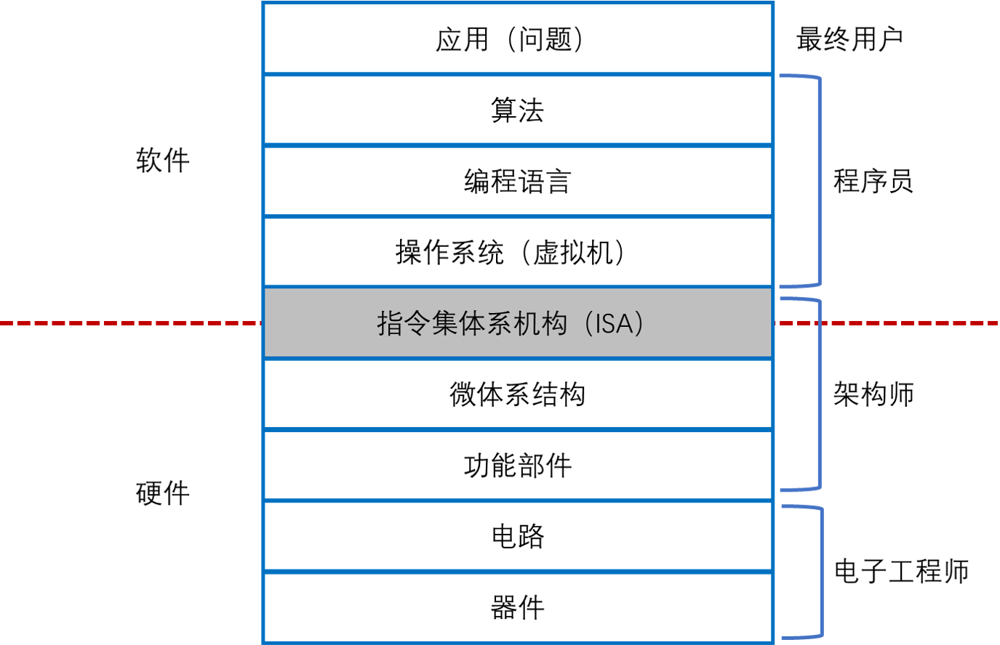
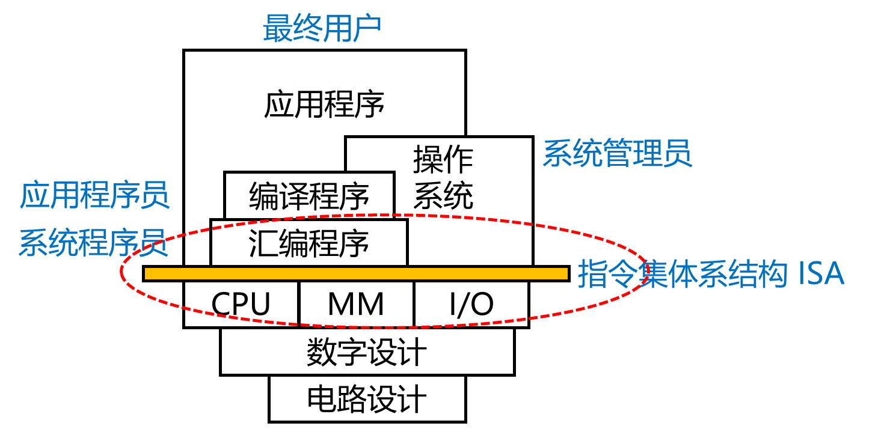

# 1. 计算机系统抽象层的转换

+ 首先，将应用问题转为算法问题
+ 将算法转为编程语言描述的程序
+ 编程语言的执行
    + 高级语言
    + 低级语言
    + 机器语言
    + 汇编语言
+ 执行指令
+ 使用逻辑电路实现微体系结构
+ 使用器件技术实现逻辑电路

# 2. 计算机体系结构

## 2.1 计算机体系结构的历史

+ 20 世纪五六十年代

由于工艺技术限制，计算机做的很简单，计算机体系结构主要研究怎么做加减乘除，主要研究成果是先行进位加法器、Booth 补码乘法算法、华莱士树等。

+ 20 世纪七八十年代

以 **精简指令集(Reduced Instruction Set Computer，简称 RISC)** 兴起为标志，**指令系统结构(Instruction Set Architecture，简称 ISA)** 成为计算机体系结构的研究重点。

+ 20 世纪九十年代以后

计算机体系结构把 CPU、存储系统、IO 系统和多处理器包括在内。

+ 21 世纪

网络就是计算机，计算机体系机构向上突破了软硬件界面，需要考虑软件紧密协同。向下突破了逻辑设计和工艺实现的界面，需要从晶体管的角度考虑结构设计。

## 2.2 摩尔定律和工艺的发展

+ 工艺技术的发展

摩尔定律不是一个客观规律，而是一个主观规律。Intel 公司的创始人摩尔在 20 世纪六七十年代说，集成电路厂商大约 18 个月能把工艺提高一代，即相同面积中晶体管的数目提高一倍。

现在变慢了，大约 2~3 年更新一代，一个重要原因是新工艺的研发成本变得越来越高，厂商收回投资需要更多的时间。

**CMOS(Complementary Metal Oxide Semiconductor，互补金属氧化物半导体)** 是集成电路的设计工艺，节省电力，发热少，且是最基础最常用的半导体元件。

CMOS 工艺面临物理极限，一是蚀刻问题越来越难以处理，二是片内漂移的问题突出。三是栅氧厚度难以继续降低，漏点问题严重。

摩尔定律的终结仅仅是晶体管尺寸难以进一步缩小，并不是硅平台的终结。

+ 工艺和计算机结构

晶体管越来越多，但是越来越难用，晶体管变得 “复杂”、“不快”、“不省电”。

复杂是指纳米级别工艺的物理效应。90nm 工艺以后，工艺越来越难以控制，同一个硅片不同部分的晶体管有快有慢(工艺漂移)，需要考虑可制造性以提高芯片成品率。此外，晶体管数据继续以指数增长，设计和验证能力赶不上晶体管增加的速度，形成剪刀差。

不快主要是晶体管的驱动能力越来越小，连线电容相对变大，连线延迟越来越大。

不省电是漏电功耗不断增加；电压随着工艺更新而降低，随线宽而线性下降，但是到 90nm 以后，工作电压始终在 1V 左右。纳米级别工艺以后连线电容在负载电容中占主导，导致功耗难以降低。

## 2.3 计算机体系结构的障碍

+ 复杂度障碍
+ 主频障碍
+ 功耗障碍
+ 带宽障碍

## 2.4 计算机体系结构设计的基本原则

### 2.4.1 平衡性

+ 关于计算机性能和访存带宽平衡的原则，即峰值浮点运算速度(MFLOPS)和峰值访存带宽(MB/s) 为 1:1 左右
+ **Amdahl(阿姆达尔) 定律** ：通过使用某种较快的执行方式所获得的性能的提高，受限于不可使用这种方式提高性能的执行时间所占总执行时间的百分比。

### 2.4.2 局部性

+ 时间局部性：一个数据被访问后，很有可能多此访问
+ 空间局部性：一个数据被访问后，它相邻的数据很有可能被访问

### 2.4.3 并行性

+ 指令级并行
    + 时间并行：即指令流水线。
    + 空间并行：即多发射
+ 数据级并行：主要指单指令流多数据流(SIMD，Single Instruction Multiple Data)
+ 任务级并行
    + 代表是多核处理器以及多线程处理器
    + 并行粒度大，一个线程中包含几百条或者更多的指令
+ 提高并行性的方法
    + 时间重叠
    + 资源重复
    + 资源共享

### 2.4.4 虚拟化

+ 多线程和虚拟机技术“虚拟”了 CPU
+ 流水线和多发射结构
+ Cache 技术
+ 分布式共享存储系统中的 Cache 一致性协议
