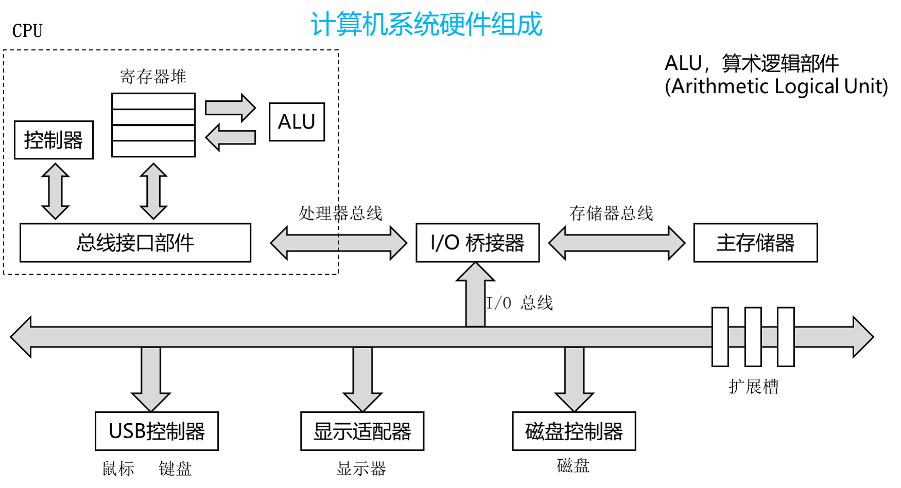

# 1. 计算机硬件组成

## 1.1 中央处理器(Central Processing Unit，CPU)

中央处理器也称为处理器，是整个计算机的核心部件，主要用于指令的执行。CPU 主要包含两个基本部分：数据通路和控制器。

+ **数据通路(data path)** 主要用来执行算术和逻辑运算以及寄存器和存储器的读/写控制等。其中，算术逻辑部件(ALU)用来进行基本的算术和逻辑运算，ALU 中最基本的是加法器，所有算术运算都可以基于加法和逻辑运算来实现。
+ **控制器(controller)** 用来对指令进行移码，生成相应的控制信号，以控制数据通路进行正确的操作。

## 1.2 存储器：内存和外存
+ 内存包括 **主存储器(main memory)** ，简称主存，和 **高速缓冲存储器(cache)** 。
+ 外存包括辅助存储器和海量后备存储器

## 1.3 外部设备，简称外设

外部设备也叫 IO 设备。外设通常由机械部分和电子部分组成，并且两部分通常是可以分开的。

+ 机械部分是外部设备本身
+ 电子部分则是控制外部设备工作的 IO 控制器或 IO 适配器。

## 1.4 总线(bus)

总线是传输信息的介质，用于在部件之间传输信息，CPU、主存和 IO 模块通过总线互连，在 CPU 和 IO 模块中都内含有相应的存储部件，即缓存器。

## 1.5 计算机系统硬件结构发展

现代计算机系统的硬件结构主要包含了：中央处理器、图形处理器、北桥和南桥

+ CPU-GPU-北桥-南桥结构
+ CPU-北桥-南桥
+ CPU-弱北桥-南桥
+ CPU-南桥
+ SoC(System on Chip，片上系统) 单片结构

## 1.6 处理器与 IO 设备通信

### 1.6.1 IO 寄存器寻址
+ 内存映射寻址：把 IO 寄存器的地址映射到内存地址空间
+ 特殊 IO 指令：使用专有指令来执行 IO 操作

### 1.6.2 处理器和 IO 之间的同步
+ 查询
    + 处理器向 IO 设备发出访问请求后，需要不断读取 IO 设备的状态寄存器，也叫做轮询
    + 由于 IO 设备的速度比较慢，所以查询方式比较浪费
+ 中断
    + 处理器不需要轮询状态寄存器的值，而是在等待设备完成某个操作时转去执行其他进程。
    + 设备完成操作后，自行产生一个中断信号来中断处理器的执行。
    + 处理器被中断，再去读取设备的状态寄存器。
    + 提高了处理器的利用率

### 1.6.3 处理器和 IO 之间的数据传送

早期存储器和 IO 设备之间数据传送是通过处理器来完成的。由于存储器和 IO 设备之间没有直接的数据通路，当需要从存储器中搬运数据到 IO 设备时，处理器首先从存储器中读取数据到通用寄存器中，在从通用寄存器写数据到 IO 设备。当需要从 IO 设备搬运数据到存储器中，处理器需要先从 IO 设备中读取数据到通用寄存器，再从寄存器写入内存。这种方式叫做 PIO(Programming Input/Output)模式。

+ PIO中转影响处理器的执行，也降低了数据传送的效率。
+ DMA(Direct Memory Access) 直接存储器访问。DMA 方式在存储器和外设之间开辟直接的数据传送通道，数据传送由专门的硬件来控制。控制 DMA 数据传送的硬件被称为 DMA 控制器。
+ DMA 传递数据的流程
    + 处理器为 DMA 请求预先分配一段地址空间
    + 处理器设置 DMA 控制器参数，包括设备标识，数据传送方向，内存中传递数据的原地址，目标地址，传输的数据量
    + DMA 控制器进行数据传输
    + DMA 控制器向处理器发出一个中断信号，通知处理器数据传送的结果
    + 处理器完成本次 DMA 请求，可以开始新的 DMA 请求

# 2. 总线概述

总线本质是完成数据交换，用于将两个或两个以上的部件连接起来，使得他们之间可以进行通信。

总线分为以下几个层级：

+ 机械层，接口的外形，尺寸，信号排列，连接线的长度范围等。
+ 电气层，信号描述，电源电压，电平标准，信号质量等。
+ 协议层，信号时序，握手规范，命令格式，出错处理等。
+ 架构层，硬件模型，硬件架构等。

## 2.1 总线分类
 
+ 按照传递方向
    + 单向(工)总线
    + 双向(工)总线
        + 半双工
        + 全双工
+ 按照信号类型
    + 并行总线
    + 串行总线
+ 按照物理位置
    + 片上总线
    + 内存总线
    + 系统总线
    + 设备总线

## 2.2 片上总线

+ 片上总线是指芯片片内互连使用的总线。
+ 通用处理器在设计时，会划分为处理器核、共享高速缓存、内存控制器等模块。
+ AMBA(Advanced Microcontroller Bus Architecture，高级微控制器总线架构) 包含了 AXI，AHB，ASB，APB 等总线。
+ AXI(Advanced eXtensible Interface，高级可扩展接口) 是一种高性能、高带宽、低延迟的片上总线。 
+ AHB(Advanced High-performance Bus) 高性能系统总线。
+ ASB(Advanced System Bus) 第一代 AMBA 系统总线。
+ APB(Advanced Peripheral Bus) 本地二级总想概念。

## 2.3 系统总线

+ 系统总线通常用于处理器和桥片的连接，同时作为多处理器之间的连接构成多路系统。
+ HyperTransport 是 AMD 公司提出的高速系统总线，用于连接为处理器与配套桥片，以及多个处理器之间的互连。
+ HT 总线的软件架构与 PCI 总线协议基本相同，都采用配置空间、IO 空间和 Memory 空间的划分，通过对配置寄存器的设置，采用正向译码的方向对设备空间进行访问。
+ 基于 PCI 总线设计的设备驱动程序能够直接使用在 HT 总线设备上。

## 2.4 设备总线
+ 设备总线用于计算机系统中与 IO 设备的连接
+ PCI(Peripheral Component Interconnect) 总线是一种对计算机系统结构连接影响深远并广泛应用的设备总线。
+ PCIE(PCI Express) 可以被看作是 PCI 总线的升级版本，兼容 PCI 软件架构。
    
# 3. 计算机系统启动过程分析

## 3.1 处理器核初始化

初始化实际上是将内部的各种寄存器状态从不确定设置为确定，将一些模块状态从无序强制为有序的过程。简单来说，就是通过 load/store 指令或其他方法将指定寄存器或结构设置为特定数值。

以 MIPS 结构为例，只将 0 号寄存器的值强制设置为 0，而其他的通用寄存器值是没有要求的。那么在处理器复位后开始运行的时候，这些寄存器的值可能是任意值。如果需要用到寄存器内容时，就需要对其先进行写操作，写为一个软件期望的值。

### 3.1.1 处理器复位

+ 处理器的第一条取指，是由复位信号控制的，但是受限于各种其他因素，复位信号并没有对其处理器内部的所有部分进行控制。
+ MIPS 处理器复位后的第一条指令时将固定从地址 0XBFC00000 的位置获取，这个过程时有处理器的执行执行寄存器为硬件复位为 0XBFC00000 而决定的。
+ 对物理地址 0X1FC00000 的取指请求，会被处理器内部预先设定好的片上互连网络路由至某个预先存放着启动程序的存储设备上。

### 3.1.2 调试接口初始化
+ 对串口的初始化操作，实际上时处理器对串口执行一连串约定号的 IO 操作。
+ X86 结构下，IO 地址空间与内存地址互相独立，IO 操作与访存操作是通过不同的指令实现的。
+ MIPS 结构下，不显示区分 IO 地址和内存地址，而采用全局编址，使用地址空间将 IO 和内存隐式分离。
+ 内存空间对应的是存储器，存储器不会发生存储内容的自动更新。
+ IO 空间一般对应的是控制寄存器或状态寄存器，是受 IO 设备的工作状态所影响的。

### 3.1.3 TLB 初始化

+ TLB(Translation Look-aside Buffer，转译后备缓冲区)
+ TLB 是地址映射的管理模块，主要负责操作系统里用户进程地址空间的管理，用以支持多用户多任务并发。
+ 然而在处理器启动的过程中，处理器核处于特权态，整个 BIOS 都工作在一个统一的地址空间里，并不需要对用户地址空间进行过多干预，此时 TLB 的作用更多的是地址转换，以映射更大的地址空间供程序使用。

### 3.1.4 Cache 初始化

+ Cache 在系统复位后，也处于一个未初始化的状态，也就是说，Cache 里可能包含这残留的或者随机的数据，如果不经处理刷，对Cache 的访问也可能会导致错误的命中。
+ 不同的处理器可能包含着不同的 Cache 层次，各级 Cache 的容量也可能各不相同。
+ Cache 的组织结构中，主要包含标签 Tag 和数据 Data 两部分。Tag 用于保存 Cache 块的状态、Cache 块地址等信息， Data 则保存数据内容。大多数情况下对 Cache 的初始化就是对 Tag 的初始化，只需要将其中的 Cache 块状态设置为无效，其他部分的随机数据就不会产生影响。 

## 3.2 总线接口初始化

### 3.2.1 内存初始化
+ 计算机运行是的程序和数据都被保存在内存中。相对复位时用于取指的 ROM 或 Flash 器件来说，内存的读写性更是达到了千倍以上。
+ 越来越多的处理器已经继承内存控制器，因为内存的使用和设置与外界内存芯片的种类、配置相关，所以在计算器系统启动的过程中需要先获取内存的配置信息，再根据内存配置信息对内存控制器进行配置。
+ 内存的使用完全是由软件控制的，软件知道其访问的每一个地址是否存在有效的数据。而 Cache 是一个硬盘加速部件，大多数情况下不需要真正知道其存在，Cache 的硬件控制位正式为了掩盖内存访问延迟，保证访存操作的正确性。 
+ 初始化包括两部分
    + 内存的行地址、列地址等对内存地址映射进行配置
    + 针对协议对内存信号的调整的支持方式对内存读写信号相关的寄存器进行训练，以保证传输时数据完整性。

### 3.2.2 IO 总线初始化
+ IO 总线初始化的主要目的时将非通用的软硬件设置都预先设置好，将与桥片特性相关的部分与后面的标准驱动加载程序完全分离出来，以保证接下来的通用设备管理程序的运行。
+ 完成内存与 IO 总线初始化后，整个计算机系统就已经进入到一个可控的状态，也就是说， BIOS 中的基本硬件初始化的功能目标已经达到。
+ 但是为了加载操作系统，还需要对系统中的一些设备进行配置和驱动。

### 3.2.3 设备的探测及驱动加载
+ PCI 软件架构下，系统可以灵活地支持设备的自动识别和驱动的自动架子啊
+ PCI 协议下，IO 的系统空间分为三个部分：配置空间、IO 空间、Memory 空间
+ 因为每个设备都有唯一的识别号，通过记载这些识别号对应的驱动，就完成了设备的自动识别和驱动的自动加载。

## 3.3. 多核启动过程

### 3.3.1 初始化时的多核协同
+ 将多核处理器中的一个设定为主核，其他的设定为从核。
+ 主核除了对自身处理器的初始化，还需要负责对各种总线及外设初始化。
+ 从核只需要对自身处理器的私有部件进行初始化，之后第穷哦那个过程中保持空闲状态，直到进入操作系统再由主核进行调度。
+ 主核完成了内存初始化后，其他核才能使用内存进行数据的读写操作。

### 3.3.2 操作系统启动时的多核唤醒

在操作系统中，主核在各种数据结构准备好的情况下就可以开始依次唤醒每一个从核。唤醒的过程也是串行的，主核唤醒从核之后也会进入一个等待过程，直到从核执行完毕并通过从核，从核才再次唤醒新的从核。

### 3.3.3 核间同步与通信
+ 核间中断可以完成各种核间的同步与通信操作。
+ 核间中断也是利用一组 IO 寄存器实现的。
