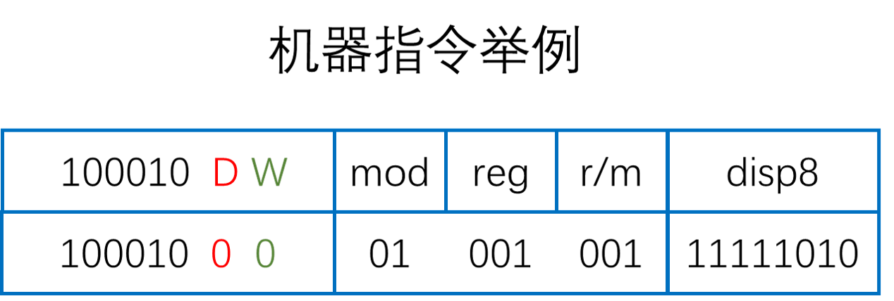

计算机的指令有微指令、机器指令和宏（伪）指令之分。

**微指令** 是微程序级命令，属于硬件范畴。

**宏指令** 是由若干机器指令组成的指令序列，属于软件范畴。

**机器指令** 是介于二者之间，处于硬件和软件的交界面。

机器指令的汇编语言表示形式为 **汇编指令** 。机器指令和汇编指令一一对应，他们都与具体的机器结构有关，都属于机器指令。

# 1. 机器指令及汇编指令

**机器语言程序** 是一个由若干条机器指令组成的序列。每条机器指令都有若干字段组成。 **操作码字段** 用来指出指令的操作性质， **立即数字段** 是用来指出操作数或偏移量， **寄存器编号字段** 给出操作数或操作数地址所在的寄存器编号等。

为了能够直观地表示机器语言程序，引入了一种与机器语言一一对应的符号化表示语言，称为 **汇编语言** 。汇编语言用容易记忆的英文单词或缩写来表示指令操作码的含义，用标号、变量名称、寄存器名称、常数等表示操作数或地址码。这些都被称为 **汇编助记符** 。用若干个助记符表示的与机器指令意义对应的指令称为汇编指令，用汇编语言编写的程序称为 **汇编语言程序** 。



+ 开始的 6 位 “100010” 表示的是 mov 指令。
+ 位 D 表示 reg 字段给出的是否为目的操作数，D = 1 说明 reg 字段给出的是目的操作数，否则是源操作数。
+ 位 W 表示操作数的宽度，W = 0 时为 8 位，W = 1 时为 16 位。
+ mod 字段表示的是寻址方式。
+ reg 字段是源或目的操作数所在的寄存器编号。
+ r/m 字段给出源或目的操作数所在寄存器编号，或有效地址计算方式。
+ disp8 给出在有效地址计算中用到的 8 位偏移量。

用来将汇编语言源程序中的汇编指令翻译成机器指令的程序称为 **汇编程序** 。而将机器指令反过来翻译成汇编指令的程序称为 **反汇编程序** 。

机器语言和汇编语言统称为机器级语言。用机器指令表示的机器语言程序和用汇编指令表示的汇编语言程序称为机器级程序，它是对应高级语言程序的机器级表示。

# 2. 指令集体系结构

指令及体系结构(Instruction Set Architecture)是计算机硬件上最重要的抽象层，对使用硬件的软件屏蔽了底层硬件的实现细节，将物理上的计算机抽象为一个逻辑上的虚拟计算机，称为 **计算机语言级虚拟机** 。

ISA 定义了机器语言级虚拟机的属性和功能特性，主要包括：
+ 可执行的指令的集合，包括指令格式、操作种类以及每种操作对应的操作数的相应规定。
+ 指令可以接受的操作数的类型。
+ 操作数所能够存放的寄存器组的结构，包括每个寄存器的名称、编号、长度和用途。
+ 操作数所能够存放的存储空间的大小和编址方式。
+ 操作数在存储空间存放时按照大端方式还是小端方式存放。
+ 指令获取操作数的方式，即寻址方式。
+ 指令执行过程的控制方式，包括程序计数器、条件码定义等。

# 3. 生成机器代码的过程

使用 GCC 将 C 语言程序转换为可执行文件，需要四个步骤：预处理、编译、汇编、链接。

+ **源文件**

C 程序 main.c

```c
#include <stdio.h>

int main() {
  printf("hello world");
  return 0;
}
```

+ **预处理**

预处理阶段：预处理程序对源程序中以字符 `#` 开头的命令进行处理，输出的结构是一个以 `.i` 为扩展名的源程序文件

对 main.c 进行预处理后，执行 `gcc -E main.c -o main.i` 命令，生成 main.i 文件

文件太大，所以直接看[预处理后的文件](../code/main.i)文件

只预处理，不编译，不链接。

+ **编译**

编译阶段：编译程序对预处理后的源程序进行编译，生成一个汇编语言源程序文件，以 `.s` 为扩展名

对 main.i 进行编译，执行 `gcc -S main.i -o main.s` 命令，生成 main.s 文件，文件里是汇编代码。

只编译，不汇编，不链接。

```acm
	.file	"main.c"
	.text
	.def	___main;	.scl	2;	.type	32;	.endef
	.section .rdata,"dr"
LC0:
	.ascii "hello world\0"
	.text
	.globl	_main
	.def	_main;	.scl	2;	.type	32;	.endef
_main:
LFB13:
	.cfi_startproc
	pushl	%ebp
	.cfi_def_cfa_offset 8
	.cfi_offset 5, -8
	movl	%esp, %ebp
	.cfi_def_cfa_register 5
	andl	$-16, %esp
	subl	$16, %esp
	call	___main
	movl	$LC0, (%esp)
	call	_printf
	movl	$0, %eax
	leave
	.cfi_restore 5
	.cfi_def_cfa 4, 4
	ret
	.cfi_endproc
LFE13:
	.ident	"GCC: (MinGW.org GCC-8.2.0-5) 8.2.0"
	.def	_printf;	.scl	2;	.type	32;	.endef

```

+ **汇编**

汇编阶段：汇编程序对汇编语言进行汇编，生成一个可重定位目标文件(relocatable object file)，以 `.o` 为扩展名，是一个二进制文件，其中的代码已经是机器码。

对 main.s 进行汇编操作，执行 `gcc -c main.s -o main.o` 生成 main.o 文件，这是一个二进制文件，不能直接打开，但是可以通过 objdump 命令查看文件里的内容，执行 `objdump -d main.o` 命令，命令行输出下面内容。

编译且汇编，不链接。

`objdump -d <filename>` 的意思是反汇编，从目标文件中反汇编那些特定指令机器码的 section。

```
// objdump -d main.o

main.o:     file format pe-i386


Disassembly of section .text:

00000000 <_main>:
   0:   55                      push   %ebp
   1:   89 e5                   mov    %esp,%ebp
   3:   83 e4 f0                and    $0xfffffff0,%esp
   6:   83 ec 10                sub    $0x10,%esp
   9:   e8 00 00 00 00          call   e <_main+0xe>
   e:   c7 04 24 00 00 00 00    movl   $0x0,(%esp)
  15:   e8 00 00 00 00          call   1a <_main+0x1a>
  1a:   b8 00 00 00 00          mov    $0x0,%eax
  1f:   c9                      leave
  20:   c3                      ret
  21:   90                      nop
  22:   90                      nop
  23:   90                      nop
```

main.o 是重定位目标文件，所以目标代码从相对地址 0 开始，冒号前面的值表示每条指令相对于起始地址 0 的偏移量，冒号后边紧接着的是用十六进制表示的机器指令，右边是对应的汇编指令。

+ **链接**

链接阶段：链接程序将多个可重定位目标文件和标准库函数合并成为一个可执行目标文件(executable object file)，简称可执行文件。


# 4. 程序中每条指令的执行

每个可执行文件都包含程序代码段，可执行文件的执行实际上就是对程序代码段执行的过程，程序代码段由一条一条的机器指令构成。

**指令(instruction)是用 0 和 1 表示的一串 0/1 序列，用来指示 CPU 完成一个特定的原子操作。**

+ **取数指令(load instruction)** 从存储单元中取出一个数据存放到 CPU 寄存器中。
+ **存数指令(store instruction)** 将 CPU 寄存器的内容写入一个存储单元。
+ **ALU 指令(ALU instruction)** 将两个寄存器内容进行某种算术或逻辑运算后再送入一个 CPU 寄存器中。
+ **输出指令(output instruction)** 将一个 CPU 寄存器的内容送到 IO 模块的某个缓存器中。

**指令通常被划分为若干个字段，有操作码字段、地址字段和立即数字段等。**

+ **操作码字段** 指出指令的操作类型，如加、减、传送、跳转等。
+ **地址码字段** 指出指令所处理的操作数的地址，如寄存器的编号、内存单元地址等。
+ **立即数字段** 指出具体的一个操作数或偏移地址等。

指令执行时通过控制器对指令操作码进行译码，解释成 **控制信号(control signal)** 控制数据通路执行。

**指令的执行过程：** 从存储器取出指令并计算下一条指令的地址、对指令进行译码、取操作数、对操作数进行运算、送运算结果到存储器或寄存器保存。每次从存储器取指令都将 PC 的值作为指令的地址。因此，计算出下一条要执行的指令的地址被送到 PC，当前指令执行完之后，根据 PC 的值到存储器去取下一条指令，从而能够周而复始地执行程序中的每条指令。

指令的执行由 **时钟信号(clock signal)** 进行定时，一条指令的还行可能需要一个或多个时钟的时间。

# 5. IA-32 指令系统概述

x86 是 Intel 开发的一种处理器体系结构的泛称。该系列中较早期的处理器以数字来表示，并以 "86" 结尾，包括 Intel 8086、80286、i386 和 i486，因此其架构被称为 "x86"。由于数字并不能作为注册商标，因此 Intel 及其竞争者均对新一代处理器使用了可注册的名称。如 Pentium、PentiumPro、Core 2、Core i7 等。

现在 Intel 把 32 位 x86 架构的名称 x86-32 该称为 IA-32，全名为 "Intel Architecture, 32-bit"。

后来由 AMD 首先提出了一个 Intel 指令集的 64 位版本，命名为 "x86-64"，它在 IA-32 的基础上对寄存器的宽度和个数、浮点运算指令等进行了扩展，并加入了一些新特性，指令能够直接处理长度为 64 位的数据。后来 AMD 将其更名为 AMD64，而 Intel 称为 Intel64。

## 5.1 数据类型及其格式

IA-32 中，大部分指令并不需要区分其操作数是什么类型，只是把操作数当成一个 0/1 序列来处理，所以，机器指令中只要再有相应的字段能够区分操作数的长度即可。

IA-32 中有些指令需要区分操作数类型，通常由指令操作码来区分指令操作数是带符号整数、无符号整数还是浮点数。

## 5.2 寄存器组织和寻址方式

不考虑 I/O 指令，IA-32 指令的操作数有三类：立即数、寄存器操作数和存储器操作数。

立即数就在指令中，无需指定其存放位置。

寄存器操作数需要制定操作数所在的寄存器的编号。

当操作数为存储单元内容时，需要制定操作数所在存储单元的地址。

IA-32 指令中用到的寄存器主要分为定点寄存器组、浮点寄存器栈和多媒体扩展寄存器。

**寻址方式**

根据指令给定信息得到操作数或操作数地址的方式称为 **寻址方式** 。

**立即寻址** 指指令中直接给出操作数。

**寄存器寻址** 指指令中给出的操作数所在的寄存器的编号。

除了立即寻址和寄存器寻址外，其他寻址方式下的操作数都在存储单元中，称为 **存储器操作数** 。

# 6. IA-32 常用指令类型及其操作

## 6.1 通用数据传送指令

通用数据传送指令传送的是寄存器或存储器中的数据。

+ MOV: 一般的传送指令，包括 movb，movw 和 movl 等
+ MOVS: 符号扩展传送指令，将短的源数据高位符号扩展后传送到目的地址，
+ MOVZ: 零扩展传送指令，将短的源数据高位零扩展后传送到目的地址。
+ XCHG: 数据交换指令，将两个寄存器内容互换。
+ PUSH: 先执行 `R[sp] <- R[sp] - 2` 或 `R[esp] <- R[esp] - 4`，然后将一个字或两字从指定寄存器送到 SP 或 ESP 指示的栈单元哄。比如 pushl 表示双字压栈，popw 表示字出栈。
+ POP: 现将一个字或双字从 SP 或 ESP 指示的栈单元送到指定寄存器中，再执行`R[sp] <- R[sp] + 2` 或 `R[esp] <- R[esp] + 4`，如 popl 表示双字出栈，popw 表示字出栈。

## 6.2 地址传送指令

地址传送指令传送的是操作数的存储地址，指定的目的寄存器不能是段寄存器，且源操作数必须是存储器寻址方式。

注意：这些指令均不影响标志位。主要是 **加载有效地址(Load Effect Address，LEA)** 指令，用来将源操作数的存储地址送到目的寄存器中。

## 6.3 输入输出指令

输入输出指令专门用于在累加器和 I/O 端口之间进行数据交换。

## 6.4 标志传送指令

标志传送指令专门用于对标志寄存器进行操作。

## 6.5 定点算术运算指令

+ 加/减运算指令

加减类(ADD/SUB)指令用于对给定长度的两个位串进行相加或相减，两个操作数中最多只能有一个是存储器操作数，不区分是无符号数还是带符号数整数，产生的和差送到目的地，生成的标志信息送到标志寄存器 FLAGS/EFLAGS。

+ 增减运算指令

增减类(INC/DEC)指令对给定长度的一个位串加 1 或减 1，给定操作数既是源操作数也是目的操作数。不区分是无符号数还是带符号整数，生成的标志信息送标志寄存器 FLAGS/EFLAGS，注意不生成 CF 标志。

+ 取负指令

取负类指令 NEG 用于求操作数的负数，就是将给定长度的一个位串 “各位取反，末尾加 1”，也称为取补指令。给定操作数既是源操作数也是目的操作数，生成的标志信息送标志寄存器 FLAGS/EFLAGS。

+ 比较指令

比较类指令 CMP 用于两个寄存器操作数的比较，用目的操作数减去源操作数，结果不送回目的操作数，即两个操作数保持原值不变，只是标志位作相应改变，因而功能类似 SUB 指令。通常该指令后面跟条件转移指令或条件设置指令。

+ 乘除运算指令

乘法指令分成 MUL(无符号数乘)和 IMUL(带符号整数乘)两类，指令中可以明显地给出一个操作数、两个操作数或三个操作数。

## 6.6 按位运算指令

+ 逻辑运算指令：NOT、AND、OR、XOR、TEST
+ 移位指令：逻辑左/右移、算术左/右移、循环左/右移、带循环左/右移

## 6.7 控制转移指令

IA-32 中执行执行的顺序由 CS 和 EIP 确定。正常情况下，指令按照它们在存储器中的存放顺序一条一条地按顺序执行，但是有些情况下，程序需要转移到另一段代码去执行，可以采用改变 CS 和 EIP，叫做 **段间转移** 或 **远转移** 转移目标的属性为 FAR，或者仅改变 EIP 的方法来实现转移，叫做 **段内转移**，分 **近转移** 和 **短转移**，转移目标的属性分别为 NEAR 或 SHORT。

段内转移和段间转移都有直接转移和间接转移之分。**直接转移** 是指转移的目标地址作为立即数直接出现在指令的机器码中。**间接转移** 则是指转移的目标地址简介存储在某一寄存器或存储单元中。

IA-32 提供了多种控制转移指令，有 无条件转移指令、条件转移指令、条件设置指令、调用/返回指令、中断指令等。

## 6.8 x87 浮点处理指令

IA-32 的浮点处理架构有两种：较早的一种是与 x86 配套的浮点协处理器 x87 架构，采用栈结构。另一种是由 MMX 发展而来的 SSE 指令集架构，采用的是单指令多数据(Single Instruction Multi Data，SIMD)技术，包括 SSE、SSE2、SSE3、SSE4 等。对于 IA-32 架构 GCC 默认生成 x87 指令集代码，如果想要生成 SEE 指令集代码，则需要设置适当的编译选项。

x87 FPU 有一个浮点寄存器栈，栈的深度为 8，每个浮点寄存器有 80 位。根据指令的操作功能，x87 浮点数指令可以分为浮点数装入、浮点数存储、整数浮点数转换、浮点数运算和浮点数测试比较等几种类型。

## 6.9 MMX/SSE 指令集

Intel 公司与 1997 年推出了 MMX(Multi Media eXtension，多媒体扩展)指令集，是一种多媒体指令增强技术，包括 57 条多媒体处理指令，通过这些指令可以一次处理多个数据。

随着网络、通信、语音、视频、图形、图像等多媒体处理软件对处理器性能越来越高的要求，Intel 在多能奔腾以后的处理器中加入了更多流式 SIMD 扩展(Stream SIMD Extension)指令集，包括 SSE、SSE2、SSE3、SSE4 等，这些都是典型的数据级并行处理技术。

SSE 兼容 MMX 指令，它可以通过 SIMD 技术在单时钟周期内并行处理 4 个单精度浮点数来有效提高浮点运算速度。

