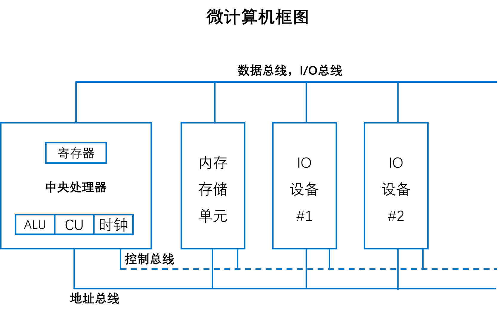
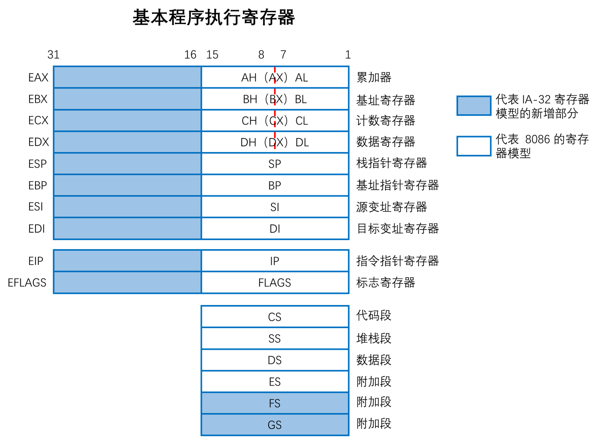
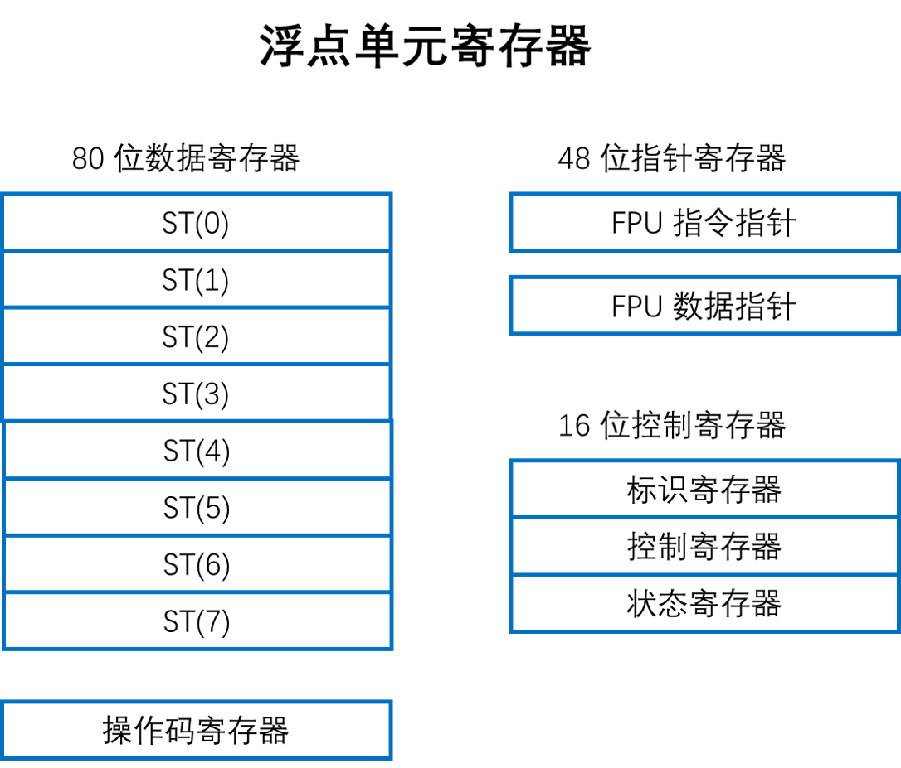
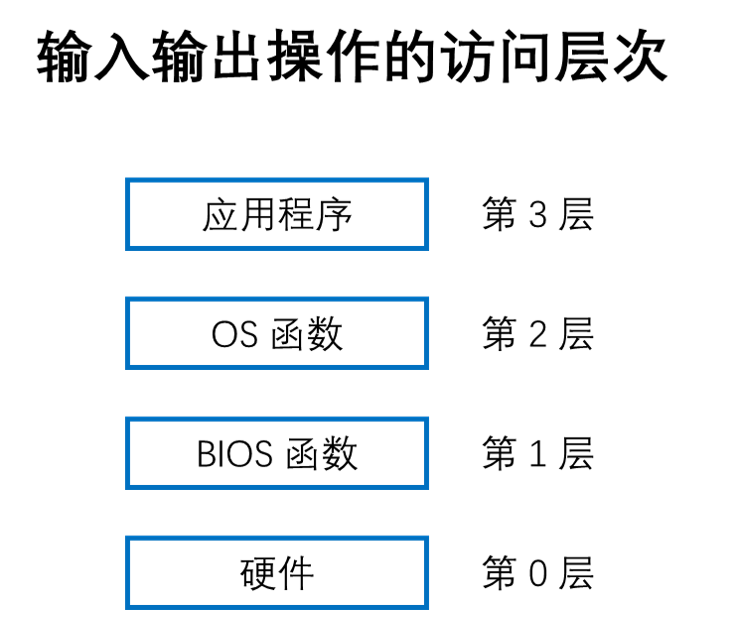
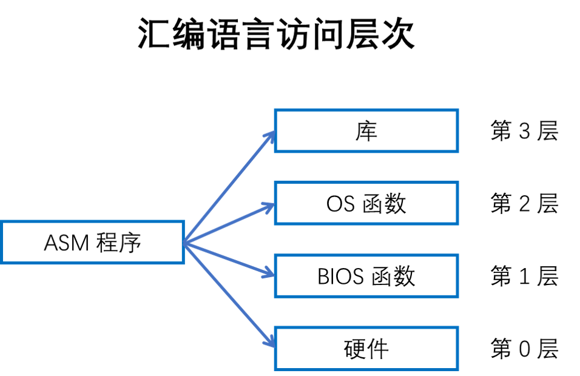

# 1. x86 处理器一般概念

## 1.1 基本微机结构

中央处理器 CPU 是进行算术和逻辑操作的部件，包含了有限数量的存储位置————寄存器（register），一个高频时钟，一个控制单元，一个算术逻辑单元。

+ **时钟(clock)** 对 CPU 内部操作与系统其它组件进行同步
+ **控制单元(control unit, CU)** 协调产生于机器指令执行的步骤序列
+ **算术逻辑单元(arithmetic logic unit, ALU)** 执行算术运算，比如加减法，逻辑运算

CPU 通过主板上的 CPU 插座的引脚与计算机其它部分相连。大部分引脚连接的是总线、控制总线和地址总线。

+ **内存存储单元(memory storage unit) 用于在程序运行时保存指令与数据。** 它接受来自 CPU 的数据请求，将数据从随机存储器(RAM)传输到 CPU，并从 CPU 传输到内存。由于所有的数据处理都在 CPU 内进行，因此保存在内存中的程序在执行前需要备复制到 CPU 中。指令程序在复制到 CPU 时，可以一次复制一条，也可以一次复制多条。

+ **总线(bus)** 是一组平行线，用于将数据从计算机一个部分传送到另一个部分。计算机系统通常包含四类总线：数据类、I/O 类、控制类、地址类
    + **数据总线(data bus)** 在 CPU 和内存之间传输指令和数据。
    + **I/O 总线** 在 CPU 和系统输入/输出设备之间传输数据。
    + **控制总线(control bus)** 用二进制信号对所有连接在系统总线上设备的行为进行同步。
    + 当前执行指令在 CPU 和内存之间传输数据时，**地址总线(address bus)** 用于保存指令和数据的地址。

+ **时钟** 时钟与 CPU 和系统总线相关的每一个操作都是由一个恒定速率的内部时钟脉冲来进行同步。机器指令的基本时间单位是 **机器周期(machine cycle)** 或 **时钟周期(clock cycle)**。一个时钟周期的时长是一个完整时钟脉冲所需要的时间。

时钟周期持续时间用时钟速度的倒数来计算，而时钟速度则用每秒震荡数来衡量。

执行一条机器指令最少一个 1 个时钟周期，有几个需要的时钟则超过了 50 个（比如 8088 处理器中的乘法指令）。由于 CPU、系统总线和内存电路之间存在速度差异，因此，需要访问内存的指令常常需要空时钟周期，也被称为 **等待状态(wait states)**

## 1.2 执行时钟周期

CPU 在执行一条机器指令时，需要经过一系列预先定义好的步骤，这些步骤被称为指令执行周期(instruction execution cycle)。这些步骤简化为 **取指、译码、执行** 。

在从内存读取程序指令之前，将其地址放到地址总线上。然后，内存控制器将所需代码送到数据总线上，存入代码高速缓存(code cache)。指令指针的值决定下一条要执行的指令。指令由指令译码器分析，并产生相应的数值信号送往控制单元，其协调 ALU 和浮点单元。

## 1.3 读取内存

计算机从内存读取数据比从内部寄存器读取速度慢很多，因为：
    + 将想要读取的值的地址放到地址总线上
    + 设置处理器 RD(读取)引脚(改变 RD 的值) 
    + 等待一个时钟周期给存储器芯片进行响应
    + 将数据从数据总线复制到目标操作数

上边的每一步操作只需要一个时钟周期，时钟周期是基于处理器内固定速率时钟节拍的一种时间测量方法。计算机的 CPU 通常是用其时钟速度来描述。

为了减少读写内存的时间，将大部分近期使用过的指令和数据存放在 **高速存储器 cache** 中。其思想是，程序更可能希望反复访问相同的内存和指令。

cache 保存这些值能使他们能被快速访问到。此外，当 CPU 开始执行一个程序时，它会预先将后续比如 1000 条指令加载到 cache 中，这个行为基于一种假设，就是这些指令很快会被用到。

当处理器能够在 cache 存储器中发现想要的数据，则称为 cache 命中(cache hit)。如果 CPU 在 cache 中没有找到数据，则称为 cache 未命中(cache miss)。

x86 系列中的 cache 存储器有两种类型：一级 cache(主 cache) 位于 CPU 上。二级 cache(次 cache)速度略慢，通过高速数据总线与 CPU 相连。

还有一个原因使得 cache 存储器比传统的 RAM 速度快，因为 cache 存储器是一种被称为静态 RAM(SRAM) 的特殊存储器芯片构成的。

## 1.4 加载并执行程序

在程序执行前，需要用一种工具程序将其加载到内存，之后你个工具程序成为程序加载起(program loader)。加载后，操作系统必须将 CPU 指向程序的入口，即程序开始执行的地址。

+ 操作系统(OS) 在当前磁盘目录下搜索程序的文件名。如果找不到，则在预定目录列表(路径 path)下搜索文件名。当 OS 无法检索到文件名时，它会发出一个出错的信息。
+ 如果程序文件被找到，OS 就访问磁盘目录中的程序文件基本信息，包括文件大小，及其在磁盘驱动器上的物理位置。
+ OS 确定内存中下一个可使用的位置，将程序文件加载到内存。为该程序分配内存块，并将程序大小和位置信息假如表中(描述符表 descriptor table)。另外， OS 可能调整程序内指针的值，使得它们包括程序数据地址。
+ OS 开始执行程序的第一条机器指令。当程序开始执行后，就成为一个进程(process)。OS 为这个进程分配一个标识号(进程 ID)，用于在执行期间对其进行追踪。
+ 进程自动运行。OS 的工作是追踪进程的进行，并响应系统资源的请求。这些资源包括内存、磁盘文件和输入输出设备等。
+ 进程结束后，就会从内存中移除。

# 2. 32 位 x86 处理器

## 2.1 操作模式

x86 处理器有三个主要的操作模式：保护模式、实地址模式和系统管理模式，以及一个子模式：虚拟 8086(virtual 8086) 模式，这是保护模式的特殊情况。

**保护模式(protected mode)** 是处理器的原生状态，在这种模式下，所有的指令和特性都是可用的。分配给程序的独立内存区域被称为段，而处理器会阻止程序使用自身段之外的模式。

**虚拟 8086 模式(virtual 8086 mode)** 保护模式下，处理器可以在一个安全环境中，直接执行实地址模式软件。比如 MS-DOS 等。如果一个程序崩溃了或者是向系统内存写数据，都不会影响到同一时间内执行的其他程序。现代操作系统可以同时执行多个独立的虚拟 8086 模式。

**实地址模式(read-address mode)** 实现的是早期 Intel 处理器的编程环境，但是增加了一些其他的特性，比如切换到其他模式的功能。当程序需要直接访问系统的内存或硬件设备时，这种模式就很有用。

**系统管理模式(system management mode)** 向操作系统提供了实现诸如电源管理和系统安全等功能的机器。这些功能通常是计算机制造商实现的，为一个特定的系统设置而定制处理器。

## 2.2 基本执行环境

**地址空间** 在 32 位保护模式下，一个任务或程序最大可以寻址 4GB 的线性地址空间。从 P6 处理器开始，一种被称为扩展物理寻址(extended physical addressing) 的技术使得可以被寻址的无理内存空间增加到 64GB。而实地址模式程序只能寻址 1MB 空间。如果处理器在保护模式下运行多个虚拟 8086 程序，则每个程序只能拥有自己的 1MB 内存空间。

**基本程序执行寄存器** 是直接位于 CPU 内的高速存储位置，其设计访问速度远高于传统存储器。例如当一个循环处理为了速度进行优化时，其循环计数会保留在寄存器中而不是变量中。

图中表示了一个基本程序执行寄存器(basic program execution registers)。8 个通用寄存器，6 个段寄存器，1 个处理器状态标志寄存器(EFLAGS) 和 1 个指令指针寄存器(EIP)。

**通用寄存器** 主要用户算术运算和数据传输。EAX 寄存器的低 16 位在使用时可以用 AX 表示。

一些寄存器的组成部分可以处理 8 位的值。例如 AX 寄存器的高 8 位被称为 AH，而低 8 位被称为 AL，同样的重叠关系也存在 EAX，EBX，ECX，EDX 寄存器中。

**特殊用法**

+ 乘除指令默认使用 EAX，常被称为 **扩展累加器(extended accumulator)** 寄存器。
+ CPU 默认使用 ECX 为循环计数器。
+ ESP 用于寻址堆栈结构，它极少用于一般算术运算和数据传输，通常被称为 **扩展堆栈指针(extended stack pointer)** 寄存器。
+ ESI 和 EDI 用于高速存储器传输指令，有时也被称为 **扩展源变址(extended source index)** 寄存器和 **扩展目的变址(extended destination index)** 寄存器。
+ 高级语言通过 EBP 来引用堆栈中的函数参数和局部变量。除了高级编程，不用于一般算术运算和数据传输，常常被称为 **扩展帧指针(extended frame pointer)** 寄存器

**段寄存器**，在实地址模式中，16 位段寄存器表示的是预先分配的内存区域的基址，这个内存区域称为段。保护模式周静，段寄存器中存放的是段描述符表指针。一些段中存放程序指令（代码），其他段存放变量（数据），还有一个堆栈段存放的是局部函数变量和函数参数。

**指令指针(EIP)** 寄存器中包含下一条将要执行指令的地址。某些机器指令能控制 EIP，使得程序分支转向到一个新位置。

**EFLAGS 寄存器** 包含了独立的二进制位，用于控制 CPU 的操作，或者是反映一些 CPU 操作的结果。有些指令可以测试和控制这些单独的处理器标志位。 **设置标志位时，该标志位 = 1。清除（或重置）该标志位时，该标志位 = 0。**

**控制标志位** 控制 CPU 的操作。例如能够使得 CPU 每执行一条指令后进入中断。在侦测到算术运算溢出时中断执行。进入虚拟 8086 模式以及进入保护模式。程序能够通过设置 EFLAGS 寄存器中的单独位来控制 CPU 的操作。比如方向标志位和中断标志位。
+ 方向标志(Direction Flag, DF) 用来确定串操作指令执行时的变址寄存器SI(ESI)和DI(DDI)中的内容是自动递增还是递减。DF = 1 则为递减，否则为递增。可用 std 和 cld 指令分别将 DF 置 1 和 清 0。
+ 中断允许标志(Interrupt Flag, IF) IF = 1，表示允许响应中断，否则禁止响应中断。
+ 陷阱标志(Trap Flag, TF) 用来控制单步执行操作。TF = 1，CPU 按单步方式执行指令。

**状态标志位** 反映了 CPU 执行的算术和逻辑操作的结果。包括：溢出位、符号位、零标志位、辅助进位标志位、奇偶校验位和进位标志位。
+ 进位标志位(Carry Flag, CF)，与目标位置相比，**无符号算术运算结果太大时**，设置该标志位。
+ 溢出标志位(Over Flag, OF)，与目标位置相比，**有符号算术运算结果太大或太小时**，设置该标志位。
+ 符号标志位(Sign Flag, SF)，算术或逻辑操作产生 **负结果** 时，设置该标志位。
+ 零标志位(Zero Flag, ZF)，算术或逻辑操作产生 **结果为 0** 时，设置该标志位。
+ 辅助进位标志位(AC)，算术操作在 8 位操作数中产生了位 3 向位 4 进位时，设置该标志位。
+ 奇偶校验标志位(PF)，结果的最低有效字节包含偶数个 1 时，设置该标志位。否则，清除该标志位。一般情况下，如果数据有可能被修改或损坏时，该标志位用于进行错误检测。

## 2.3 MMX(Multi Media Extension) 多媒体增强寄存器

在实现高级多媒体和通信应用时，MMX 技术提高了 Intel 处理器的性能。8 个 64 位 MXX 寄存器支持称为 SIMD(Single Instruction Multiple Data)的特殊指令。

## 2.4 XMM 寄存器

x86 结构还包括了 8 个 128 位 XMM 寄存器，他们被用于 SIMD 流扩展指令集。

**浮点单元(Floating Point Unit)** 执行高速浮点算术运算。之前为了执行高速浮点算术运算，需要一个独立的协处理器芯片。从 Intel486 处理器开始，FPU 已经集成到主处理器芯片上。FPU 中有 8 个浮点数据寄存器。

## 2.5 x86 内存管理

保护模式是最可靠、最强大的，但是它对应用程序直接访问系统硬件有着严格的限制。

在实地址模式下，只能寻址 1MB 内存，地址从 00000H 到 FFFFFH。处理器一次只能运行一个程序，但是可以暂停中断程序来处理来自外围设备的请求（称为中断 interrupt）。应用程序被允许访问内存的任何位置，包括哪些直接与系统硬件相关的地址。MS-DOS 操作系统在实地址模式下运行， Windows95 和 98 能够引导进入这种模式。

在保护模式下，处理器可以同时运行多个程序，它为每个进程（程序中的程序）分配总共 4GB 的内存。每个程序都分配有自己的保留内存区域，程序之间禁止意外访问其他程序的代码和数据。MS-Windows 和 Linux 运行在保护模式下。

在虚拟 8086 模式周静，计算机运行在保护模式下，通过创建一个带有 1MB 地址空间的虚拟 8086 机器来模拟运行于实地址模式的 80x86计算机。同一时间可以运行多个这样的窗口，并且窗口之间都是受到保护的。

# 3. 64 位 x86-64 处理器

这些处理器包括 Intel 64 和 AMD 64 处理器系列，指令集是已讨论的 x86 指令集的 64 位扩展。基本特征：
+ 向后兼容 x86 指令集。
+ 地址长度为 64 位，虚拟地址空间为 2 的 64 次方字节。但是按照当前芯片的实现情况，只能使用地址的低 48 位。
+ 可以使用 64 位通用寄存器，允许指令具有 64 位整数操作数。
+ 比 x86 多了 8 个通用寄存器
+ 物理地址为 48 位，支持高达 256TB 的 RAM。

当处理器运行于本机 64 位模式时，是不支持 16 位实模式或虚拟 8086 模式的。

现在的 Core i5 和 Core i7。AMD 处理器中的 Opteron 和 Athlon 64。

## 3.1 64 位操作模式

Intel 64 架构引入了一个新模式，称为 IA-32e，从技术上看，这个模式包含两个子模式：兼容模式(compatibility mode) 和 64 位模式(64-bit mode)。

**兼容模式** 在兼容模式下，现有的 16 位于 32 位应用程序通常不用进行重新编译就可以运行。但是 16 位 Windows(Win16) 和 DOS 应用程序不能运行在 64 位 Microsoft Windows 下。与早期 Windows 版本不同，64 位 Windows 没有虚拟 DOS 机器子系统来利用处理器的功能切换到虚拟 8086 模式。

**64 位模式** 在 64 位模式下，处理器执行的是使用 64 位线性地址空间的应用程序。这是 64 位 Microsoft Windows 的原生模式，该模式能使用 64 位指令操作数。

## 3.2 基本 64 位执行环境

64 位模式下，虽然处理器现在只能支持 48 位的地址，但是理论上，地址最大可为 64 位。

从寄存器来看， 64 位模式与 32 位最大的区别：
+ 16 个 64 位通用寄存器(32 位模式只有 8 个通用寄存器)
+ 8 个 80 位浮点寄存器
+ 1 个 64 位状态标志寄存器 RFLAGS(只使用低 32 位)
+ 1 个 64 位指令指针寄存器 RIP
+ 8 个 64 位 MMX 寄存器
+ 16 个 128 位 XMM 寄存器(32 位模式只有 8 个 XMM 寄存器)

**通用寄存器** 64 位模式下，操作数的默认大小为 32 位，并且有 8 个通用寄存器。但是给每条指令加上 REX(寄存器扩展)的前缀后，操作数可以达到 64 位，可用通用寄存器的数量也增加到了 16 个。

64 位模式下，单条指令不能同时访问寄存器高字节，如 AH、BH、CH、DH 以及新字节寄存器的低字节，如 DIL

64 位模式下，32 位 EFLAGS 寄存器由 64 位 RFLAGS 寄存器取代。这两个寄存器共享低 32 位，而 RFLAGS 的高 32 位是不使用的。

32 位模式和 64 位模式具有相同的状态标志。

# 4. 典型的 x86 计算机组件

## 4.1 PCI 和 PCI Express 总线架构

PCI(Peripheral Component Interconnect，外部设备互连) 总线为 CPU 和其他系统设备提供了连接桥，这些设备包括硬件驱动器、内存、显卡、声卡和网卡。最近，PCI Express 总线在设备、内存和处理器之间提供了双向串行连接。该总线得到显卡的广泛支持，能够以较高速度传递数据。

## 4.2 主板芯片组

主板芯片组(motherboard chipset) 是一组处理器芯片的集合，这些芯片被设计为在特定类型主板上一起工作，各种芯片具有增强处理能力，多媒体功能或减少功耗等特性。

## 4.3 内存

基于 Intel 的系统使用的几种基础类型内存：只读存储器(ROM)、可擦除可编程只读存储器(EPROM)、动态随机访问存储器(DRAM)、静态 RAM(SRAM)、图像随机存储器(VRAM)和互补金属氧化物半导体(CMOS)RAM。

+ ROM 永久烧录在芯片上，并且不能擦除。
+ EPROM 能用紫外线缓慢擦除，并且重新编程
+ DRAM，通常哟经的内存，在程序运行时保存程序和数据的部件。部件价格便宜，但是每毫秒需要进行刷新，以避免丢失其内容。有些系统使用的 ECC(错误检查和纠正)存储器。
+ SRAM 主要用于价格高、速度快的 cache 存储器。它不需要刷新，CPU 的 cache 存储器就是 SRAM 构成的。
+ VRAM 保存视频数据。VRAM 是双端口的，它允许一个端口持续刷新显示器，同时另一个端口将数据写到显示器。
+ CMOS RAM 在系统主板上，保存系统设置信息。由电池供电，因此当计算机电源关闭后，CMOS RAM 中的内容仍能保留。

## 4.4 输入输出设备

IO 访问层次，主要有三个：
+ 高级语言函数：高级编程语言，包含了执行输入输出函数，这些函数具有可移植性
+ 操作系统：开发人员能够从API(Application Programing Interface)的库中调用操作系统函数。操作系统提供高级操作，比如向文件写入字符串，从键盘读取字符串，分配块内存等。
+ BIOS：基本输入输出系统是一组能够直接与硬件设备通信的低级子程序集合。BIOS 由计算机制造商安装并定制，以适应机器硬件，操作系统通常与 BIOS 通信。

**设备驱动程序** 设备驱动程序允许操作系统与硬件设备和系统 BIOS 直接通信。
+ 应用程序调用 HLL(High Level Language) 库函数，将字符串写入标准输出。
+ 库函数（第 3 层）调用操作系统函数，传递一个字符串指针。
+ 操作系统函数（第 2 层）用循环的方法调用 BIOS 子程序，向其传递每个字符的 ASCII 码和颜色。操作系统调用另一个 BIOS 子程序，将光标移动到屏幕的下一个位置上。
+ BIOS 子程序（第 1 层）接收一个字符，将其映射到一个特定的系统字体，并把该字符发送到与视频控制卡相连的硬件端口。
+ 视频控制卡（第 0 层）为视频显示产生定时硬件信号，来控制光栅扫描并显示像素。

**多层次编程** 汇编语言程序在输入输出编程领域有着强大的能力和灵活性。
+ 第 3 层：调用库函数来执行通用文本 I/O 和基于文件的 I/O。
+ 第 2 层：调用操作系统函数来执行通用文本 I/O 和基于文件的 I/O。
+ 第 1 层：调用 BIOS 函数来控制设备的具体特性。
+ 第 0 层：从硬件端口发送和接收数据，对特定设备拥有控制权。这个方式没有广泛用于各种硬件设备，因此不具有可移植性。

通用操作系统极少允许应用程序直接访问系统硬件，因为这样会使得它几乎无法同时运行多个程序。相反，硬件只能由设备驱动程序按照严格控制方式进行访问。另一方面，专业设备的小型操作系统则常常直接与硬件相连。这样做是为了介绍操作系统代码占用的内存空间，并且这些操作系统几乎总是一次只运行单个程序。